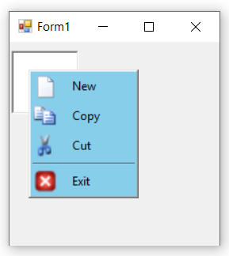
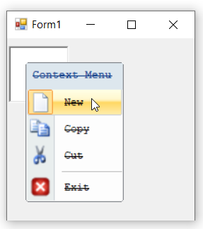
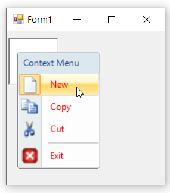
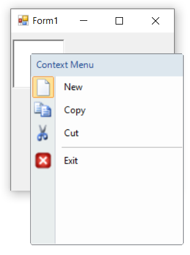
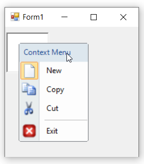
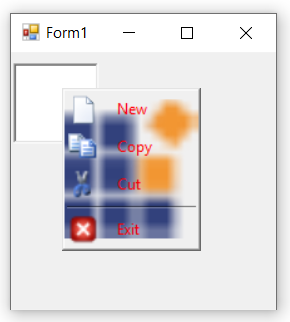

# Customize appearance in WinForms Context Menu Strip

## Background Color

The [`BackColor`](https://learn.microsoft.com/en-us/dotnet/api/system.windows.forms.toolstrip.backcolor?redirectedfrom=MSDN&view=netframework-4.7.2#System_Windows_Forms_ToolStrip_BackColor) property sets the background color of WinForms Context Menu Strip. The background color is used to improve the visual appearance of the WinForms Context Menu Strip.

The below code snippet will explain how to set background color of WinForms Context Menu Strip.




this.contextMenuStripEx.BackColor = System.Drawing.Color.SkyBlue;





Me.contextMenuStripEx.BackColor = System.Drawing.Color.SkyBlue




## Font

The [`Font`](https://learn.microsoft.com/en-us/dotnet/api/system.windows.forms.toolstripdropdown.font?redirectedfrom=MSDN&view=netframework-4.7.2#System_Windows_Forms_ToolStripDropDown_Font) property sets the **FontFamily**, **Size** (in points), and **FontStyle** of the WinForms Context Menu Strip.

The below code snippet will explain the procedure to set font for menu items.




this.contextMenuStripEx.Font = new System.Drawing.Font("Courier New", 9F, System.Drawing.FontStyle.Strikeout);





Me.contextMenuStripEx.Font = New System.Drawing.Font("Courier New", 9F, System.Drawing.FontStyle.Strikeout)




## Foreground Color

The [`ForeColor`](https://learn.microsoft.com/en-us/dotnet/api/system.windows.forms.toolstrip.forecolor?redirectedfrom=MSDN&view=netframework-4.7.2#System_Windows_Forms_ToolStrip_ForeColor) property sets the foreground color for menu items.




this.contextMenuStripEx.ForeColor = System.Drawing.Color.Red;





Me.contextMenuStripEx.ForeColor = System.Drawing.Color.Red




## Size

The [`Size`](https://learn.microsoft.com/en-us/dotnet/api/system.windows.forms.control.size?redirectedfrom=MSDN&view=netframework-4.7.2#System_Windows_Forms_Control_Size) property sets the height and width of context menu items.

>**NOTE**:
In order to set a custom size for the context menu, set the [`AutoSize`](https://learn.microsoft.com/en-us/dotnet/api/system.windows.forms.toolstripdropdown.autosize?redirectedfrom=MSDN&view=netframework-4.7.2#System_Windows_Forms_ToolStripDropDown_AutoSize) property to `false`.

The below code snippet is to set the size of context menu.




this.contextMenuStripEx.AutoSize = false;
this.contextMenuStripEx.Size = new System.Drawing.Size(200, 250);





Me.contextMenuStripEx.AutoSize = False
Me.contextMenuStripEx.Size = New System.Drawing.Size(200, 250)




## Text

The [`Text`](https://learn.microsoft.com/en-us/dotnet/api/system.windows.forms.control.text?redirectedfrom=MSDN&view=netframework-4.7.2#System_Windows_Forms_Control_Text) property sets the accessible caption (name) of the WinForms Context Menu Strip control; it does not display as the menu's title at runtime.

The below code snippet will explain how to set text for WinForms Context Menu Strip.




this.contextMenuStripEx.Text = "Context Menu";





Me.contextMenuStripEx.Text = "Context Menu"




## Background Image

The [`BackgroundImage`](https://learn.microsoft.com/en-us/dotnet/api/system.windows.forms.control.backgroundimage?redirectedfrom=MSDN&view=netframework-4.7.2#System_Windows_Forms_Control_BackgroundImage) property sets the background image of WinForms Context Menu Strip.

The below code snippet is to set the background image of WinForms Context Menu Strip.




this.contextMenuStripEx.BackgroundImage = System.Drawing.Image.FromFile(@"..\..\..\cut.png");





Me.contextMenuStripEx.BackgroundImage = System.Drawing.Image.FromFile("..\..\..\cut.png")




