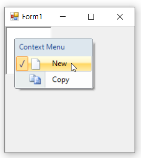
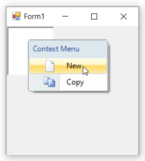

# Checked/unchecked menu items in Windows Forms ContextMenuStrip

This support will help users to easily acknowledge the selected menu item by using the check mark. The [`Checked`](https://learn.microsoft.com/en-us/dotnet/api/system.windows.forms.toolstripmenuitem.checked?redirectedfrom=MSDN&view=netframework-4.7.2#System_Windows_Forms_ToolStripMenuItem_Checked) property indicates whether a check mark should appear before the text of the menu item or not. The [`CheckState`](https://learn.microsoft.com/en-us/dotnet/api/system.windows.forms.toolstripmenuitem.checkstate?redirectedfrom=MSDN&view=netframework-4.7.2#System_Windows_Forms_ToolStripMenuItem_CheckState) property specifies the exact state - checked or unchecked which needs to be set either statically. On runtime, user need to toggle the state manually through the [`Click`](https://learn.microsoft.com/en-us/dotnet/api/system.windows.forms.toolstripitem.click?view=netframework-4.7.2) event of the menu item.

>**NOTE:**       
>1. This feature is not applicable for combobox and textbox.       
>2. This feature will be applied only if [`ShowCheckMargin`](https://learn.microsoft.com/en-us/dotnet/api/system.windows.forms.toolstripdropdownmenu.showcheckmargin?redirectedfrom=MSDN&view=netframework-4.7.2#System_Windows_Forms_ToolStripDropDownMenu_ShowCheckMargin) property of ContextMenuStripEx is set to `true`.

Below code snippet will explain the check state of the menu item.




//Declaration
private Syncfusion.Windows.Forms.Tools.ContextMenuStripEx contextMenuStripEx1;
private System.Windows.Forms.ToolStripMenuItem toolStripMenuItem1;
private System.Windows.Forms.ToolStripMenuItem toolStripMenuItem2;

//Initializing
this.contextMenuStripEx1 = new Syncfusion.Windows.Forms.Tools.ContextMenuStripEx();
this.toolStripMenuItem1 = new System.Windows.Forms.ToolStripMenuItem();
this.toolStripMenuItem2 = new System.Windows.Forms.ToolStripMenuItem();

this.contextMenuStripEx1.ShowCheckMargin = true;
this.toolStripMenuItem1.Checked = true;
this.toolStripMenuItem1.CheckState = System.Windows.Forms.CheckState.Checked;





'Declaration
Private contextMenuStripEx1 As Syncfusion.Windows.Forms.Tools.ContextMenuStripEx
Private toolStripMenuItem1 As System.Windows.Forms.ToolStripMenuItem
Private toolStripMenuItem2 As System.Windows.Forms.ToolStripMenuItem

'Initializing
Me.contextMenuStripEx1 = New Syncfusion.Windows.Forms.Tools.ContextMenuStripEx()
Me.toolStripMenuItem1 = New System.Windows.Forms.ToolStripMenuItem()
Me.toolStripMenuItem2 = New System.Windows.Forms.ToolStripMenuItem()

Me.contextMenuStripEx1.ShowCheckMargin = True
Me.toolStripMenuItem1.Checked = True
Me.toolStripMenuItem1.CheckState = System.Windows.Forms.CheckState.Checked




