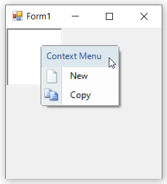

# Display Image in WinForms Context Menu Strip

Displaying an image beside each menu item helps users to easily identify the operation through iconic representation and also to improve the visual appearance of the context menu item. Images can be added directly via the [`Image`](https://learn.microsoft.com/en-us/dotnet/api/system.windows.forms.toolstripitem.image?redirectedfrom=MSDN&view=netframework-4.7.2#System_Windows_Forms_ToolStripItem_Image) property of each menu item. The size of the images can be adjusted by using the [`ImageScalingSize`](https://learn.microsoft.com/en-us/dotnet/api/system.windows.forms.toolstrip.imagescalingsize?redirectedfrom=MSDN&view=netframework-4.7.2#System_Windows_Forms_ToolStrip_ImageScalingSize) property.

>**NOTE**:
>1. Image can be set only for menu items, not for ComboBox and TextBox.
>2. Image will be displayed only if [`ShowImageMargin`](https://learn.microsoft.com/en-us/dotnet/api/system.windows.forms.toolstripdropdownmenu.showimagemargin?redirectedfrom=MSDN&view=netframework-4.7.2#System_Windows_Forms_ToolStripDropDownMenu_ShowImageMargin) property of WinForms Context Menu Strip is set to `true`.

The following code snippet illustrates how to add an image in a menu item.




this.contextMenuStripEx = new Syncfusion.Windows.Forms.Tools.ContextMenuStripEx();
this.toolStripMenuItem1 = new System.Windows.Forms.ToolStripMenuItem();
this.toolStripMenuItem2 = new System.Windows.Forms.ToolStripMenuItem();
this.richTextBox1 = new System.Windows.Forms.RichTextBox();

this.contextMenuStripEx.ShowImageMargin = true;
this.contextMenuStripEx.ImageScalingSize = new System.Drawing.Size(24, 24);
this.toolStripMenuItem1.Image = System.Drawing.Image.FromFile(@"..\..\..\new.png");
this.toolStripMenuItem2.Image = System.Drawing.Image.FromFile(@"..\..\..\copy.png");
this.toolStripMenuItem1.Text = "New";
this.toolStripMenuItem2.Text = "Copy";
this.contextMenuStripEx.Items.AddRange(new System.Windows.Forms.ToolStripItem[] { this.toolStripMenuItem1, this.toolStripMenuItem2 });
this.richTextBox1.ContextMenuStrip = this.contextMenuStripEx;
this.Controls.Add(this.richTextBox1);





Me.contextMenuStripEx = New Syncfusion.Windows.Forms.Tools.ContextMenuStripEx()
Me.toolStripMenuItem1 = New System.Windows.Forms.ToolStripMenuItem()
Me.toolStripMenuItem2 = New System.Windows.Forms.ToolStripMenuItem()
Me.richTextBox1 = New System.Windows.Forms.RichTextBox()

Me.contextMenuStripEx.ShowImageMargin = True
Me.contextMenuStripEx.ImageScalingSize = New System.Drawing.Size(24, 24)
Me.toolStripMenuItem1.Image = System.Drawing.Image.FromFile("..\..\..\new.png")
Me.toolStripMenuItem2.Image = System.Drawing.Image.FromFile("..\..\..\copy.png")
Me.toolStripMenuItem1.Text = "New"
Me.toolStripMenuItem2.Text = "Copy"
Me.contextMenuStripEx.Items.AddRange(New System.Windows.Forms.ToolStripItem() {Me.toolStripMenuItem1, Me.toolStripMenuItem2})
Me.richTextBox1.ContextMenuStrip = Me.contextMenuStripEx
Me.Controls.Add(Me.richTextBox1)




