# Getting Started with WinForms Context Menu Strip

>**Important**
Starting with v16.2.0.x, if you refer to Syncfusion assemblies from trial setup or from the NuGet feed, include a license key in your projects. Refer to this [link](https://help.syncfusion.com/common/essential-studio/licensing/overview) to learn about registering Syncfusion license key in your Windows Forms application to use our components.

This section provides a quick overview for working with the **WinForms Context Menu Strip** control in a WinForms application.

## Dependent Assemblies

The following assemblies need to be added as references to use the control in any application.

* Syncfusion.Tools.Windows
* Syncfusion.Grid.Base
* Syncfusion.Grid.Windows
* Syncfusion.Shared.Base
* Syncfusion.Shared.Windows
* Syncfusion.Tools.Base
* Syncfusion.Licensing (required for license validation starting with v16.2.0.x)

## Adding a WinForms Context Menu Strip through designer

The [WinForms Context Menu Strip](https://www.syncfusion.com/winforms-ui-controls/contextmenustrip) (ContextMenuStripEx) control can be added through the designer by following the steps below.

1. Drag and drop the WinForms Context Menu Strip control from the toolbox (under the section **Syncfusion® Windows Forms {Visual Studio Version} Toolbox {Essential Studio Version}**) into the designer page. Replace `{Visual Studio Version}` and `{Essential Studio Version}` with the versions installed on your machine (for example, **Visual Studio 2022 Toolbox 22.1.36**).

   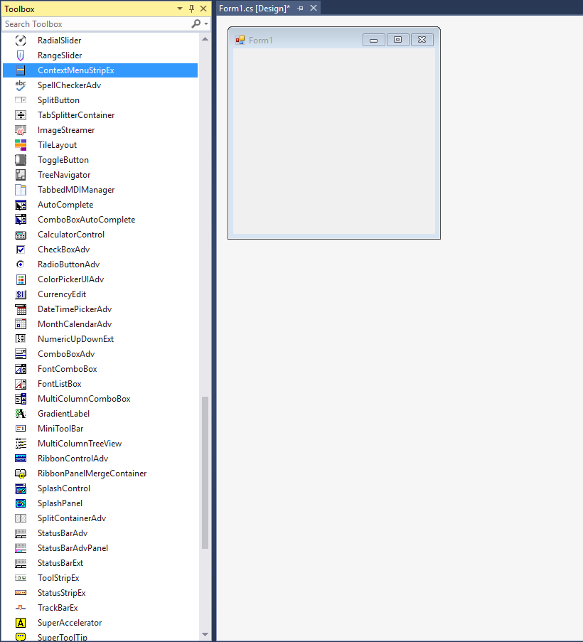

2. Now the WinForms Context Menu Strip control will be successfully added into the application along with the required dependent assemblies.

   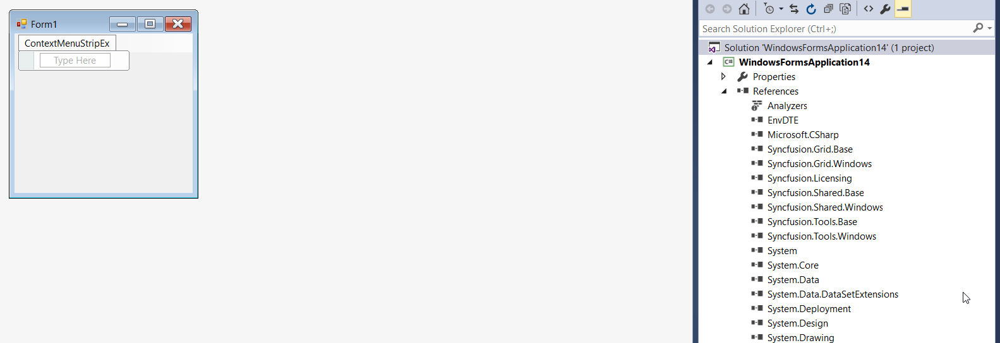

3. Click **Type Here** to add items. On clicking, it will display different types of ToolStripItems, using which the user can add items as per their need.

   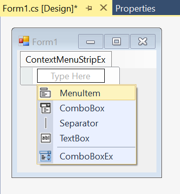

4. Items can also be added by choosing **Edit Items** under the **Properties** smart tag and then selecting the ToolStripItems from the **Items Collection Editor**.

   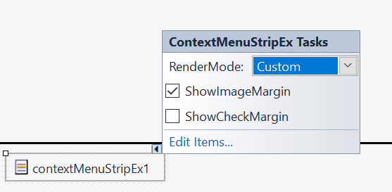

   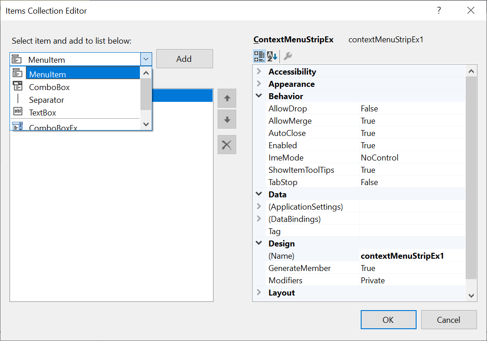

5. Once the item is added, we can set the image by right-clicking on the particular item in the designer and selecting **Properties**. Now, in the **Properties** panel, under **Appearance > Image** we can browse to the respective image.

   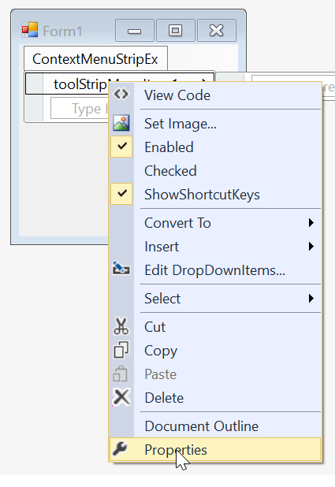

   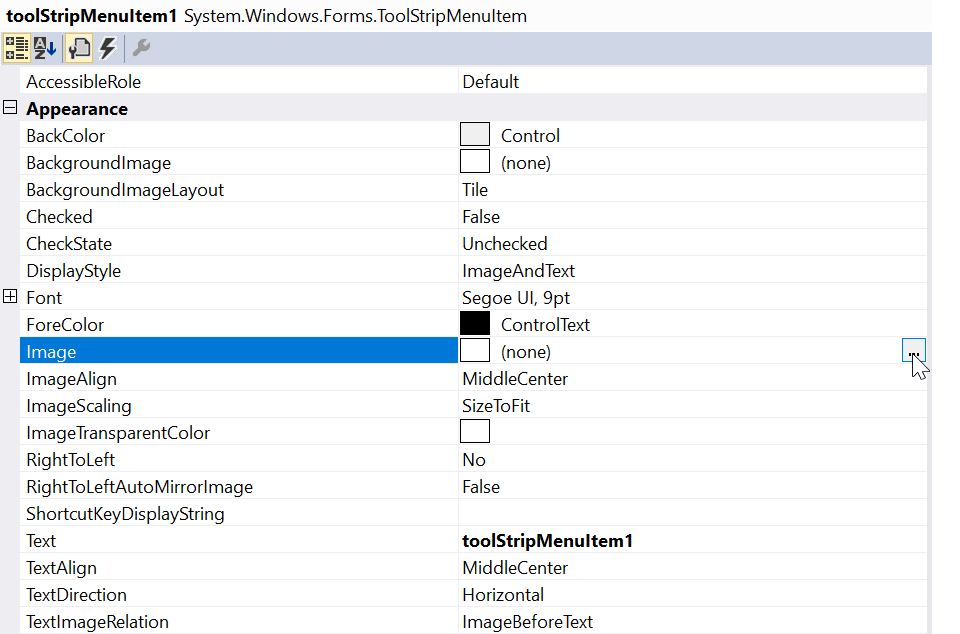

6. Similarly, we can set the text for a menu item in the **Properties** panel, under the **Appearance > Text** section.

   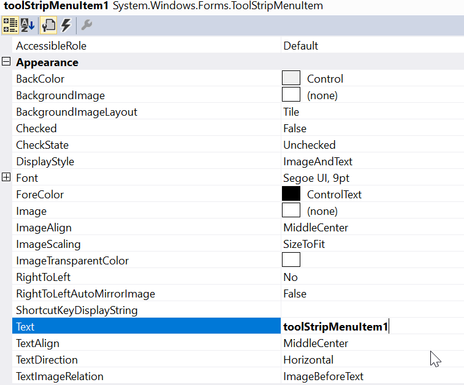

7. To associate the WinForms Context Menu Strip to a control we need to drag and drop a control of your choice onto the form. In this illustration, we have used a **RichTextBox**.

   >**NOTE**:
   To associate the WinForms Context Menu Strip control, you can choose any type of control like RichTextBox, Button, Label, TextBox, MaskedTextBox, etc.

   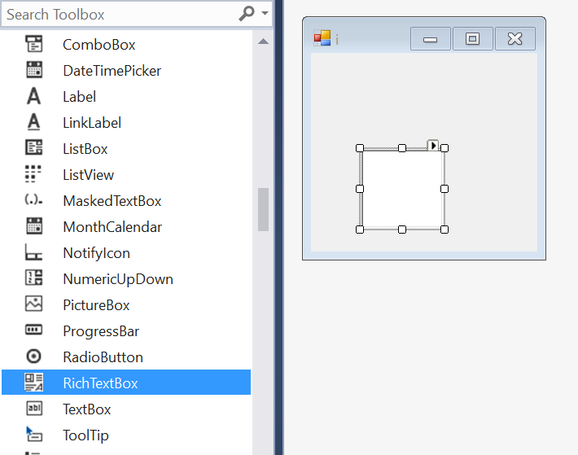

8. **Right-click** on the RichTextBox control in the designer and select **Properties**. Now, in the **Properties** panel, under **Behavior > ContextMenuStrip** we need to assign the respective context menu.

   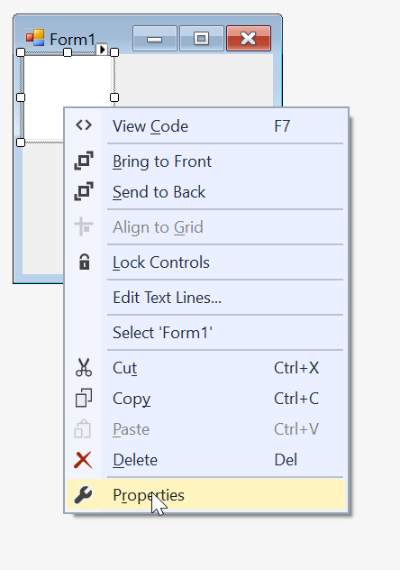

   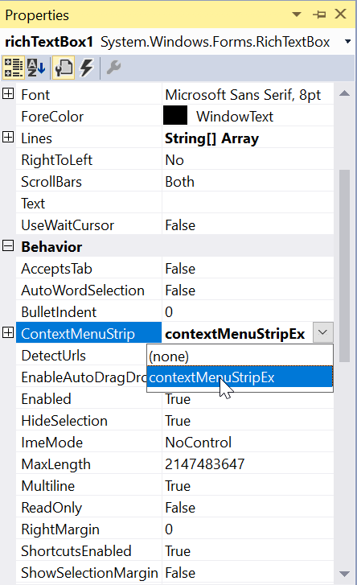

9. Finally, we have populated the WinForms Context Menu Strip control successfully.

   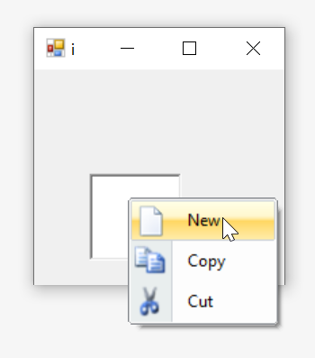         

## Adding a context menu through code

The WinForms Context Menu Strip control can be added through code by following the steps below.

1. Add the following dependency assembly references to the project.

   * Syncfusion.Tools.Windows.dll
   * Syncfusion.Grid.Base.dll
   * Syncfusion.Grid.Windows.dll
   * Syncfusion.Shared.Base.dll
   * Syncfusion.Shared.Windows.dll
   * Syncfusion.Tools.Base.dll
   * Syncfusion.Licensing.dll

   You can get these assemblies by browsing to the default assembly location:
   `{System Drive}:\Program Files (x86)\Syncfusion\Essential Studio\{Platform}\{Build Version Number}\precompiledassemblies\{Framework Version Number}`

   For example: `C:\Program Files (x86)\Syncfusion\Essential Studio\Windows\22.1.36\precompiledassemblies\net472`

2. Add the following `using` (C#) / `Imports` (VB) directive at the top of the code file:

   
   
   using Syncfusion.Windows.Forms.Tools;
   
   
   Imports Syncfusion.Windows.Forms.Tools
   
   

3. The below code snippets add a WinForms Context Menu Strip control to the application and wire up a `Click` handler to one of the menu items.





//Declaration
private Syncfusion.Windows.Forms.Tools.ContextMenuStripEx contextMenuStripEx;
private System.Windows.Forms.ToolStripMenuItem toolStripMenuItem1;
private System.Windows.Forms.ToolStripMenuItem toolStripMenuItem2;
private System.Windows.Forms.ToolStripMenuItem toolStripMenuItem3;
private System.Windows.Forms.RichTextBox richTextBox1;

//Initializing
this.contextMenuStripEx = new Syncfusion.Windows.Forms.Tools.ContextMenuStripEx();
this.toolStripMenuItem1 = new System.Windows.Forms.ToolStripMenuItem();
this.toolStripMenuItem2 = new System.Windows.Forms.ToolStripMenuItem();
this.toolStripMenuItem3 = new System.Windows.Forms.ToolStripMenuItem();
this.richTextBox1 = new System.Windows.Forms.RichTextBox();

//Configure the menu items
this.toolStripMenuItem1.Image = System.Drawing.Image.FromFile(@"..\..\..\new.png");
this.toolStripMenuItem2.Image = System.Drawing.Image.FromFile(@"..\..\..\copy.png");
this.toolStripMenuItem3.Image = System.Drawing.Image.FromFile(@"..\..\..\cut.png");
this.toolStripMenuItem1.Text = "New";
this.toolStripMenuItem2.Text = "Copy";
this.toolStripMenuItem3.Text = "Cut";
this.toolStripMenuItem1.Click += new System.EventHandler(this.toolStripMenuItem1_Click);

//Populate the context menu and associate it with the RichTextBox
this.contextMenuStripEx.Items.AddRange(new System.Windows.Forms.ToolStripItem[] {
    this.toolStripMenuItem1,
    this.toolStripMenuItem2,
    this.toolStripMenuItem3
});
this.richTextBox1.ContextMenuStrip = this.contextMenuStripEx;
this.Controls.Add(this.richTextBox1);

//Sample click handler
private void toolStripMenuItem1_Click(object sender, System.EventArgs e)
{
    MessageBox.Show("New was clicked.");
}





'Declaration
Private contextMenuStripEx As Syncfusion.Windows.Forms.Tools.ContextMenuStripEx
Private toolStripMenuItem1 As System.Windows.Forms.ToolStripMenuItem
Private toolStripMenuItem2 As System.Windows.Forms.ToolStripMenuItem
Private toolStripMenuItem3 As System.Windows.Forms.ToolStripMenuItem
Private richTextBox1 As System.Windows.Forms.RichTextBox

'Initializing
Me.contextMenuStripEx = New Syncfusion.Windows.Forms.Tools.ContextMenuStripEx()
Me.toolStripMenuItem1 = New System.Windows.Forms.ToolStripMenuItem()
Me.toolStripMenuItem2 = New System.Windows.Forms.ToolStripMenuItem()
Me.toolStripMenuItem3 = New System.Windows.Forms.ToolStripMenuItem()
Me.richTextBox1 = New System.Windows.Forms.RichTextBox()

'Configure the menu items
Me.toolStripMenuItem1.Image = System.Drawing.Image.FromFile("..\..\..\new.png")
Me.toolStripMenuItem2.Image = System.Drawing.Image.FromFile("..\..\..\copy.png")
Me.toolStripMenuItem3.Image = System.Drawing.Image.FromFile("..\..\..\cut.png")
Me.toolStripMenuItem1.Text = "New"
Me.toolStripMenuItem2.Text = "Copy"
Me.toolStripMenuItem3.Text = "Cut"
AddHandler toolStripMenuItem1.Click, AddressOf toolStripMenuItem1_Click

'Populate the context menu and associate it with the RichTextBox
Me.contextMenuStripEx.Items.AddRange(New System.Windows.Forms.ToolStripItem() { _
    Me.toolStripMenuItem1, _
    Me.toolStripMenuItem2, _
    Me.toolStripMenuItem3 _
})
Me.richTextBox1.ContextMenuStrip = Me.contextMenuStripEx
Me.Controls.Add(Me.richTextBox1)

'Sample click handler
Private Sub toolStripMenuItem1_Click(ByVal sender As Object, ByVal e As System.EventArgs)
    MessageBox.Show("New was clicked.")
End Sub




{{ codesnippet1 | OrderList_Indent_Level_1 }}

## Adding a WinForms Context Menu Strip through NuGet package

1. Right-click your project in **Solution Explorer** and choose **Manage NuGet Packages…**.
2. Search for the Syncfusion WinForms NuGet packages listed in the [Control Dependencies](https://help.syncfusion.com/windowsforms/control-dependencies#contextmenustripex) section and install them. The required packages are:
   * `Syncfusion.Tools.Windows`
   * `Syncfusion.Grid.Base`
   * `Syncfusion.Grid.Windows`
   * `Syncfusion.Shared.Base`
   * `Syncfusion.Shared.Windows`
   * `Syncfusion.Tools.Base`
   * `Syncfusion.Licensing` (for license validation starting with v16.2.0.x)
3. Add the `using Syncfusion.Windows.Forms.Tools;` / `Imports Syncfusion.Windows.Forms.Tools` directive and follow the code in the [Adding a context menu through code](#adding-a-context-menu-through-code) section to instantiate and configure the control.

For more information on installing NuGet packages in a WinForms application, see [Steps to install NuGet packages](https://help.syncfusion.com/windowsforms/installation/install-nuget-packages).

