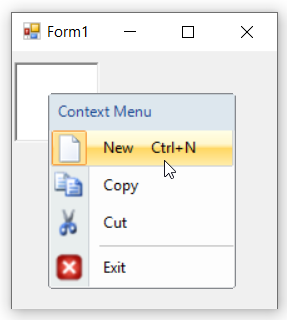

# Keyboard Shortcuts in WinForms ContextMenuStrip (ContextMenuStripEx)

The menu items can be selected through keyboard operation by specifying the shortcuts via the [`ShortcutKeys`](https://learn.microsoft.com/en-us/dotnet/api/system.windows.forms.toolstripmenuitem.shortcutkeys?redirectedfrom=MSDN&view=netframework-4.7.2#System_Windows_Forms_ToolStripMenuItem_ShortcutKeys) property of the ContextMenu. The [`ShowShortcutKeys`](https://learn.microsoft.com/en-us/dotnet/api/system.windows.forms.toolstripmenuitem.showshortcutkeys?redirectedfrom=MSDN&view=netframework-4.7.2#System_Windows_Forms_ToolStripMenuItem_ShowShortcutKeys) property is used for display the shortcut key text in the menu item.

>**NOTE**:        
> 1. This feature is not applicable for combobox and textbox.           
> 2. By using this keyboard shortcuts we can access the menu items through [`Click`](https://learn.microsoft.com/en-us/dotnet/api/system.windows.forms.toolstripitem.click?view=netframework-4.7.2) event.
> 3. To learn more about the list of Keys Enum, go to ['link'](https://learn.microsoft.com/en-us/dotnet/api/system.windows.forms.keys?view=windowsdesktop-7.0&viewFallbackFrom=net-5.0).

The below code snippet shows how shortcut is assigned to the menu item.




this.toolStripMenuItem1.ShowShortcutKeys = true;
this.toolStripMenuItem1.ShortcutKeys = ((System.Windows.Forms.Keys)((System.Windows.Forms.Keys.Control | System.Windows.Forms.Keys.N)));





Me.toolStripMenuItem1.ShowShortcutKeys = True
Me.toolStripMenuItem1.ShortcutKeys = (CType((System.Windows.Forms.Keys.Control Or System.Windows.Forms.Keys.N), System.Windows.Forms.Keys))




**ShortcutKeyDisplayString**: User can also specify custom text in place of keyboard shortcuts region using the [`ShortcutKeyDisplayString`](https://learn.microsoft.com/en-us/dotnet/api/system.windows.forms.toolstripmenuitem.shortcutkeydisplaystring?redirectedfrom=MSDN&view=netframework-4.7.2#System_Windows_Forms_ToolStripMenuItem_ShortcutKeyDisplayString) property.




this.toolStripMenuItem1.ShowShortcutKeys = true;
this.toolStripMenuItem1.ShortcutKeys = ((System.Windows.Forms.Keys)((System.Windows.Forms.Keys.Control | System.Windows.Forms.Keys.N)));
this.toolStripMenuItem1.ShortcutKeyDisplayString = "Press Ctrl + N";





Me.toolStripMenuItem1.ShowShortcutKeys = True
Me.toolStripMenuItem1.ShortcutKeys = (CType((System.Windows.Forms.Keys.Control Or System.Windows.Forms.Keys.N), System.Windows.Forms.Keys))
Me.toolStripMenuItem1.ShortcutKeyDisplayString = "Press Ctrl + N"




