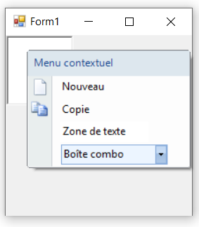

# Localization in Windows Forms ContextMenuStrip (ContextMenuStripEx)

Localization is the process of making application multilingual by formatting the content according to the cultures. This involves configuring the application for a specific language. Culture is the combination of language and location. For example, en-US is the culture for English spoken in United States; en-GB is the culture for English spoken in Great Britain.

The below code snippet will explain how to set the localize text in **French** culture as an example.




this.contextMenuStripEx.Text = "Menu contextual";
this.toolStripMenuItem1.Text = "Nouveau";
this.toolStripMenuItem2.Text = "Copier";
this.toolStripTextBox1.Text = "Zone de texte";
this.toolStripComboBox1.Text = "Boîte combo";





Me.contextMenuStripEx.Text = "Menu contextual"
Me.toolStripMenuItem1.Text = "Nouveau"
Me.toolStripMenuItem2.Text = "Copier"
Me.toolStripTextBox1.Text = "Zone de texte"
Me.toolStripComboBox1.Text = "Boîte combo"




**French Culture**

