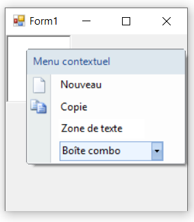

# Localization in WinForms Context Menu Strip

Localization is the process of making an application multilingual by formatting the content according to the cultures. This involves configuring the application for a specific language. Culture is the combination of language and location. For example, `en-US` is the culture for English spoken in the United States; `en-GB` is the culture for English spoken in Great Britain.

The following example assumes that `contextMenuStripEx`, `toolStripMenuItem1`, `toolStripMenuItem2`, `toolStripTextBox1`, and `toolStripComboBox1` have already been declared and added to the context menu strip. The code snippet below shows how to set the localized text in the **French (fr-FR)** culture as an example.




this.contextMenuStripEx.Text = "Menu contextuel";
this.toolStripMenuItem1.Text = "Nouveau";
this.toolStripMenuItem2.Text = "Copier";
this.toolStripTextBox1.Text = "Zone de texte";
this.toolStripComboBox1.Text = "Boîte combo";





Me.contextMenuStripEx.Text = "Menu contextuel"
Me.toolStripMenuItem1.Text = "Nouveau"
Me.toolStripMenuItem2.Text = "Copier"
Me.toolStripTextBox1.Text = "Zone de texte"
Me.toolStripComboBox1.Text = "Boîte combo"




To switch the application's culture at runtime, set the current UI culture before the form is shown, for example in the `Main` method:

```csharp
System.Threading.Thread.CurrentThread.CurrentUICulture = new System.Globalization.CultureInfo("fr-FR");
Application.Run(new Form1());
```

**French Culture**

