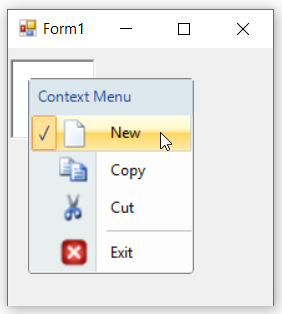

# Margin and Shadow in WinForms ContextMenuStrip (ContextMenuStripEx)

## Margin Setting

We can set margin for the context menu to indicates whether a check mark should appear before the text of the menu item by using the [`ShowCheckMargin`](https://learn.microsoft.com/en-us/dotnet/api/system.windows.forms.toolstripdropdownmenu.showcheckmargin?redirectedfrom=MSDN&view=netframework-4.7.2#System_Windows_Forms_ToolStripDropDownMenu_ShowCheckMargin) property. Also to show image separately, use the [`ShowImageMargin`](https://learn.microsoft.com/en-us/dotnet/api/system.windows.forms.toolstripdropdownmenu.showimagemargin?redirectedfrom=MSDN&view=netframework-4.7.2#System_Windows_Forms_ToolStripDropDownMenu_ShowImageMargin) property.

The below code snippet will explain how to set the margin for ContextMenuStripEx control.




this.contextMenuStripEx.ShowCheckMargin = true;
this.contextMenuStripEx.ShowImageMargin = true;





Me.contextMenuStripEx.ShowCheckMargin = True
Me.contextMenuStripEx.ShowImageMargin = True




## Shadow Setting

The shadow option for ContextMenuStripEx control refers to shows a three dimensional shadow for the context menu. It can be enabled by using the [`DropShadowEnabled`](https://learn.microsoft.com/en-us/dotnet/api/system.windows.forms.toolstripdropdown.dropshadowenabled?redirectedfrom=MSDN&view=netframework-4.7.2#System_Windows_Forms_ToolStripDropDown_DropShadowEnabled) property.

The below code snippet will explain how to set shadow for ContextMenuStripEx control.




this.contextMenuStripEx1.DropShadowEnabled = true;





Me.contextMenuStripEx1.DropShadowEnabled = True




