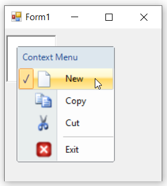
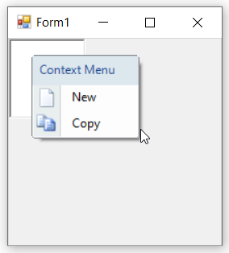

# Margin and Shadow in WinForms Context Menu Strip

## Margin Setting

We can set margins for the WinForms Context Menu Strip. The [`ShowCheckMargin`](https://learn.microsoft.com/en-us/dotnet/api/system.windows.forms.toolstripdropdownmenu.showcheckmargin?redirectedfrom=MSDN&view=netframework-4.7.2#System_Windows_Forms_ToolStripDropDownMenu_ShowCheckMargin) property controls whether a dedicated column is reserved for the check mark shown by checked menu items. To show the images in a separate column, use the [`ShowImageMargin`](https://learn.microsoft.com/en-us/dotnet/api/system.windows.forms.toolstripdropdownmenu.showimagemargin?redirectedfrom=MSDN&view=netframework-4.7.2#System_Windows_Forms_ToolStripDropDownMenu_ShowImageMargin) property. For details on toggling the check mark itself, refer to the [Checked State](checkedstate-of-menu-items) page.

The below code snippet will explain how to set the margin for WinForms Context Menu Strip control.




this.contextMenuStripEx.ShowCheckMargin = true;
this.contextMenuStripEx.ShowImageMargin = true;





Me.contextMenuStripEx.ShowCheckMargin = True
Me.contextMenuStripEx.ShowImageMargin = True




## Shadow Setting

The shadow option for the WinForms Context Menu Strip control shows a three-dimensional shadow behind the context menu when it opens. It can be enabled by using the [`DropShadowEnabled`](https://learn.microsoft.com/en-us/dotnet/api/system.windows.forms.toolstripdropdown.dropshadowenabled?redirectedfrom=MSDN&view=netframework-4.7.2#System_Windows_Forms_ToolStripDropDown_DropShadowEnabled) property.

The below code snippet will explain how to set shadow for WinForms Context Menu Strip control.




this.contextMenuStripEx1.DropShadowEnabled = true;





Me.contextMenuStripEx1.DropShadowEnabled = True




