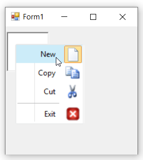

# RTL in Windows Forms ContextMenuStrip (ContextMenuStripEx)

RTL is used to display the content from right to left by setting the [`RightToLeft`](https://learn.microsoft.com/en-us/dotnet/api/system.windows.forms.toolstripdropdown.righttoleft?redirectedfrom=MSDN&view=netframework-4.7.2#System_Windows_Forms_ToolStripDropDown_RightToLeft) property to `Yes`.

The following code sample explains how to display the control from right-to-left.




this.contextMenuStripEx.RightToLeft = System.Windows.Forms.RightToLeft.Yes;





Me.contextMenuStripEx.RightToLeft = System.Windows.Forms.RightToLeft.Yes




