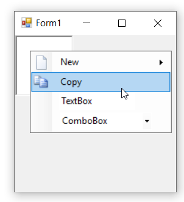
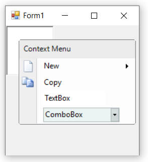
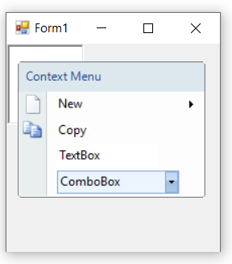
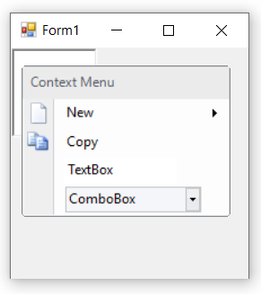

# Render Mode to customize appearance of ContextMenuStrip

Render mode is used to customize the appearance of the ContextMenu either through predefined or custom standards. It also refers to what kind of visual style the ToolStripItems needs to use. The [`RenderMode`](https://learn.microsoft.com/en-us/dotnet/api/system.windows.forms.toolstrip.rendermode?redirectedfrom=MSDN&view=netframework-4.7.2#System_Windows_Forms_ToolStrip_RenderMode) property is used to provides different painting styles like:

* Professional
* System
* ManagerRenderMode
* Custom

## Professional

The below code snippet is used to apply "Professional" style renderer.




this.contextMenuStripEx1.RenderMode = System.Windows.Forms.ToolStripRenderMode.Professional;





Me.contextMenuStripEx1.RenderMode = System.Windows.Forms.ToolStripRenderMode.Professional




## System

The below code snippet is used to apply "System" style renderer.




this.contextMenuStripEx1.RenderMode = System.Windows.Forms.ToolStripRenderMode.System;





Me.contextMenuStripEx1.RenderMode = System.Windows.Forms.ToolStripRenderMode.System




## ManagerRenderMode

The below code snippet is used to apply "ManagerRenderMode" style renderer.




this.contextMenuStripEx1.RenderMode = System.Windows.Forms.ToolStripRenderMode.ManagerRenderMode;





Me.contextMenuStripEx1.RenderMode = System.Windows.Forms.ToolStripRenderMode.ManagerRenderMode




## Custom

The RenderMode property cannot be directly set to **Custom** enumeration. To use a custom ToolStripRenderer, set the [`Renderer`](https://learn.microsoft.com/en-us/dotnet/api/system.windows.forms.toolstrip.renderer?redirectedfrom=MSDN&view=netframework-4.7.2#System_Windows_Forms_ToolStrip_Renderer) property directly instead. Here we have set the [`Renderer`]((https://learn.microsoft.com/en-us/dotnet/api/system.windows.forms.toolstrip.renderer?redirectedfrom=MSDN&view=netframework-4.7.2#System_Windows_Forms_ToolStrip_Renderer)) property to Office12ToolStripRenderer or Office2016ToolStripRenderer class object, which is used to change the appearance of the ContextMenuStripEx control.

In the form load event, add one of the below code to change the appearance.




//Sets Office Black Color
this.contextMenuStripEx1.Renderer = new Office12ToolStripRenderer(new OfficeBlack ());

//Sets Office Blue Color
this.contextMenuStripEx1.Renderer = new Office12ToolStripRenderer(new OfficeBlue ());

//Sets Office Silver Color
this.contextMenuStripEx1.Renderer = new Office12ToolStripRenderer(new Office12ColorTable());





'Sets Office Black Color
Me.contextMenuStripEx1.Renderer = New Office12ToolStripRenderer(New OfficeBlack) 

'Sets Office Blue Color
Me.contextMenuStripEx1.Renderer = New Office12ToolStripRenderer(New OfficeBlue)

'Sets Office Silver Color
Me.contextMenuStripEx1.Renderer = New Office12ToolStripRenderer(New Office12ColorTable())




 

 
  

## See also

[How to add an icon in a header of WinForms ContextMenuStripEx using CustomRenderer class](https://support.syncfusion.com/kb/article/10354/how-to-add-an-icon-in-a-header-of-winforms-contextmenustripex)

