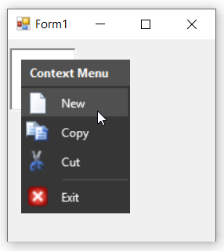
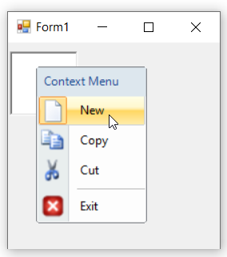
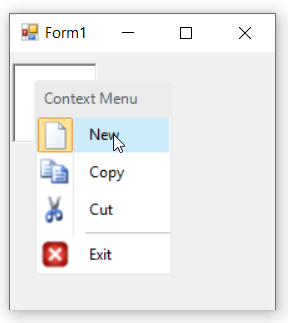
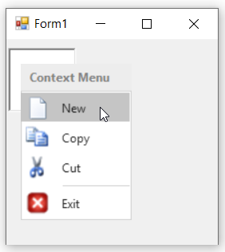
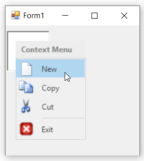
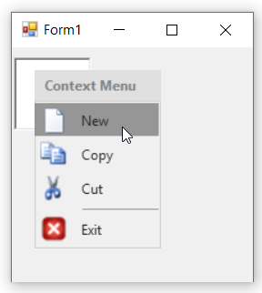

# Themes in Windows Forms ContextMenuStrip (ContextMenuStripEx)

Theming is the process of applying rich look and feel to visual elements of a control. The [`Style`](https://help.syncfusion.com/cr/windowsforms/Syncfusion.Windows.Forms.Tools.ContextMenuStripEx.html#Syncfusion_Windows_Forms_Tools_ContextMenuStripEx_Style) property is used to set the visual style of ContextMenuStripEx control. This control provides the following theming options:

* Default
* Metro
* Office2016Colorful
* Office2016White
* Office2016DarkGray
* Office2016Black

The below code snippet will sets the visual style as "Office2016Black".

   
   

   this.contextMenuStripEx1.Style = Syncfusion.Windows.Forms.Tools.ContextMenuStripEx.ContextMenuStyle.Office2016Black;

   

   

   Me.contextMenuStripEx1.Style = Syncfusion.Windows.Forms.Tools.ContextMenuStripEx.ContextMenuStyle.Office2016Black

   
   

## Office2016Black

## Default

## Metro

## Office2016Colorful

## Office2016White

## Office2016DarkGray

