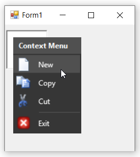
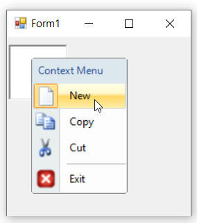
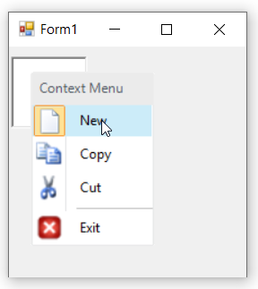
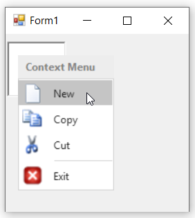
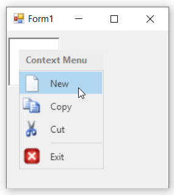
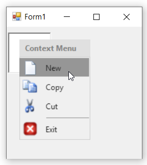

# Themes in WinForms Context Menu Strip

Theming is the process of applying a rich look and feel to the visual elements of a control. The [`Style`](https://help.syncfusion.com/cr/windowsforms/Syncfusion.Windows.Forms.Tools.ContextMenuStripEx.html#Syncfusion_Windows_Forms_Tools_ContextMenuStripEx_Style) property sets the visual style of the WinForms Context Menu Strip control. This control provides the following theming options:

* Default
* Metro
* Office2016Colorful
* Office2016White
* Office2016DarkGray
* Office2016Black

The below code snippet sets the visual style as **Office2016Black**.

   
   

   this.contextMenuStripEx1.Style = Syncfusion.Windows.Forms.Tools.ContextMenuStripEx.ContextMenuStyle.Office2016Black;

   

   

   Me.contextMenuStripEx1.Style = Syncfusion.Windows.Forms.Tools.ContextMenuStripEx.ContextMenuStyle.Office2016Black

   
   

## Office2016Black



this.contextMenuStripEx1.Style = Syncfusion.Windows.Forms.Tools.ContextMenuStripEx.ContextMenuStyle.Office2016Black;


Me.contextMenuStripEx1.Style = Syncfusion.Windows.Forms.Tools.ContextMenuStripEx.ContextMenuStyle.Office2016Black



## Default



this.contextMenuStripEx1.Style = Syncfusion.Windows.Forms.Tools.ContextMenuStripEx.ContextMenuStyle.Default;


Me.contextMenuStripEx1.Style = Syncfusion.Windows.Forms.Tools.ContextMenuStripEx.ContextMenuStyle.Default



## Metro



this.contextMenuStripEx1.Style = Syncfusion.Windows.Forms.Tools.ContextMenuStripEx.ContextMenuStyle.Metro;


Me.contextMenuStripEx1.Style = Syncfusion.Windows.Forms.Tools.ContextMenuStripEx.ContextMenuStyle.Metro



## Office2016Colorful



this.contextMenuStripEx1.Style = Syncfusion.Windows.Forms.Tools.ContextMenuStripEx.ContextMenuStyle.Office2016Colorful;


Me.contextMenuStripEx1.Style = Syncfusion.Windows.Forms.Tools.ContextMenuStripEx.ContextMenuStyle.Office2016Colorful



## Office2016White



this.contextMenuStripEx1.Style = Syncfusion.Windows.Forms.Tools.ContextMenuStripEx.ContextMenuStyle.Office2016White;


Me.contextMenuStripEx1.Style = Syncfusion.Windows.Forms.Tools.ContextMenuStripEx.ContextMenuStyle.Office2016White



## Office2016DarkGray



this.contextMenuStripEx1.Style = Syncfusion.Windows.Forms.Tools.ContextMenuStripEx.ContextMenuStyle.Office2016DarkGray;


Me.contextMenuStripEx1.Style = Syncfusion.Windows.Forms.Tools.ContextMenuStripEx.ContextMenuStyle.Office2016DarkGray



