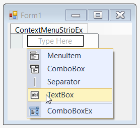
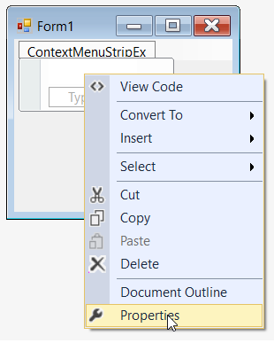
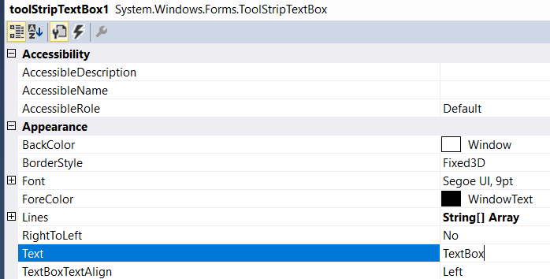
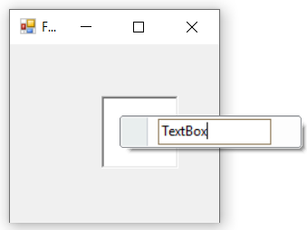
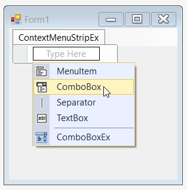
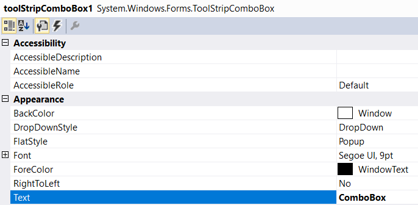
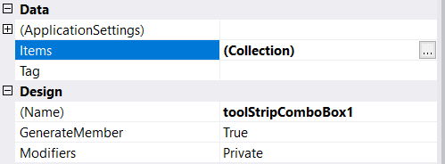
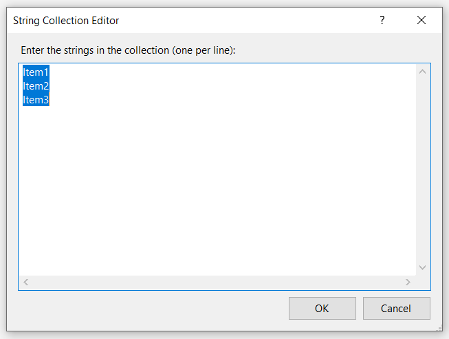
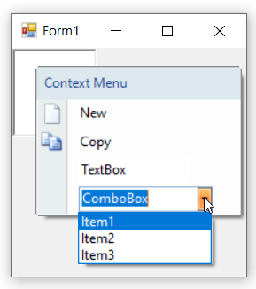

# ToolStripItem Types in WinForms ContextMenuStrip (ContextMenuStripEx)

The following are the ToolStripItems which can be added as menu items to the ContextMenuStripEx control.

* MenuItem
* TextBox
* ComboBox
* Separator

## MenuItem

Represents a selectable option displayed on a MenuStrip or ContextMenuStrip. The MenuItem supports all the general properties of a ToolStripItems. 

>**NOTE** :  
Please refer the link ["Getting Started"](https://help.syncfusion.com/windowsforms/contextmenustrip/getting-started) section for adding MenuItem to the ContextMenuStripEx control.

The below table will explain the properties of menu item,

<table>
<tr>
<th>
Property</th><th>
Description</th></tr>
<tr>
<td>
Checked</td><td>
Indicates whether the item is in the checked state. This will be displayed only if ContextMenuStripEx.ShowCheckMargin property is set to true .</td></tr>
<tr>
<td>
Image</td><td>
Sets the image for the menu item. This image will be displayed only when the ContextMenuStripEx.ShowImageMargin is true and DisplayStyle is Image or ImageAndText.</td></tr>
<tr>
<td>
CheckedState</td><td>
Specifies the check state of the item. They can be Checked, Unchecked or Indeterminate.</td></tr>
<tr>
<td>
ShowShortcut keys</td><td>
Indicates whether a shortcut key should be displayed in the menu item. User can access the particular menu item using this shortcut key specified in ShortcutKeys property.</td></tr>
<tr>
<td>
ShortcutKeys</td><td>
The shortcut key to be displayed for a menu item.</td></tr>
<tr>
<td>
ShortcutKeyDisplayString</td><td>
You can modify the ShortcutKey string, that is set by using the ShortcutKeyDisplayString property.</td></tr>
<tr>
<td>
AutoToolTip</td><td>
When set to true, will display the text set in the Text property as the item's tooltip. When set to false, will display the text set in the ToolTipText property.</td></tr>
<tr>
<td>
ToolTipText</td><td>
Sets the text for the tooltip when AutoToolTip is set to false.</td></tr>
<tr>
<td>
DropDown</td><td>
Specifies the ToolStripDropDown to be shown when the item is clicked.</td></tr>
<tr>
<td>
DropDownItems</td><td>
Invokes the Items Collection Editor and lets you add ToolStripItems to be displayed when the item is clicked.</td></tr>
</table>

## TextBox

The TextBox control is used for editable text. It is used to get input from the user at runtime. 

### Add a TextBox through designer

1. Once ContextMenuStripEx control is added, click **Type Here** for adding the TextBox. On clicking, it will display different type of ToolStripItems, using this user can choose **TextBox** option.

   

2. Once item is added, we can set the text by right-click on the particular item in the designer and select **Properties**. Now, in the **Properties** panel, under **Appearance > Text** we can set the text.

   

   

3. Finally, we have added the TextBox item in ContextMenuStripEx control successfully.

   

### Add a TextBox through code

The below code snippet helps to add the **TextBox** in ContextMenuStripEx control.




//Declaration 
private Syncfusion.Windows.Forms.Tools.ContextMenuStripEx contextMenuStripEx;
private System.Windows.Forms.ToolStripTextBox toolStripTextBox1;

//Initializing
this.contextMenuStripEx = new Syncfusion.Windows.Forms.Tools.ContextMenuStripEx();
this.toolStripTextBox1 = new System.Windows.Forms.ToolStripTextBox();

//Add a textbox
this.toolStripTextBox1.Text = "TextBox";
this.contextMenuStripEx1.Items.Add(this.toolStripTextBox1);





'Declaration
Private contextMenuStripEx As Syncfusion.Windows.Forms.Tools.ContextMenuStripEx
Private toolStripTextBox1 As System.Windows.Forms.ToolStripTextBox

'Initializing
Me.contextMenuStripEx = New Syncfusion.Windows.Forms.Tools.ContextMenuStripEx()
Me.toolStripTextBox1 = New System.Windows.Forms.ToolStripTextBox()

'Add a textbox
Me.toolStripTextBox1.Text = "TextBox"
Me.contextMenuStripEx1.Items.Add(Me.toolStripTextBox1)




The below table explains the properties of textbox.

<table>
<tr>
<th>
Property</th><th>
Description</th></tr>
<tr>
<td>
BorderStyle</td><td>
Sets the border style for the textbox. The styles available are, FixedSingle and Fixed3D (Default).</td></tr>
<tr>
<td>
Lines</td><td>
Let’s you open a String Collection Editor, using which multi-line text can be entered.</td></tr>
<tr>
<td>
Text</td><td>
Specifies the text to be displayed on the item.</td></tr>
<tr>
<td>
TextBoxTextAlign</td><td>
Specifies the alignment of the text inside the textbox.</td></tr>
<tr>
<td>
AcceptsReturn</td><td>
Indicates if return characters are accepted as input.</td></tr>
<tr>
<td>
AcceptsTab</td><td>
Indicates if tab characters are accepted as input.</td></tr>
<tr>
<td>
CharacterCasing</td><td>
Indicates if the characters should be Normal or in Upper Case or in Lower Case.</td></tr>
<tr>
<td>
HideSelection</td><td>
Indicates whether the selection should be hidden when the control loses focus.</td></tr>
<tr>
<td>
MaxLength</td><td>
Maximum number of characters that can be entered into the control.</td></tr>
<tr>
<td>
ReadOnly</td><td>
Indicates whether the text in the textbox is read-only.</td></tr>
</table>

## ComboBox

A subset of the hosted control's properties and events are exposed at the ToolStripComboBox level, but ComboBox control is fully accessible through the ComboBox property. ToolStripComboBox is optimized for hosting in a ToolStrip.

### Add a ComboBox through designer

1. Once ContextMenuStripEx control is added, click **Type Here** for adding the ComboBox. On clicking, it will display different type of ToolStripItems, in which choose **ComboBox**.

   

2. Once item is added, we can set the text by right-clicking on the particular item in the designer and select **Properties**. Now, in the **Properties** panel, under **Appearance > Text** we can set the text.

   

   

3. Similarly, we can add items collections in **properties** panel, under **Data > Items** by using **String Collection Editor**.

   

   

4. Finally, we have add the ComboBox in ContextMenuStripEx control successfully.

   

### Add a ComboBox through code

The below code snippets helps to add the ComboBox in ContextMenuStripEx control.




//Declaration 
private Syncfusion.Windows.Forms.Tools.ContextMenuStripEx contextMenuStripEx;
private System.Windows.Forms.ToolStripComboBox toolStripComboBox1;

//Initializing
this.contextMenuStripEx = new Syncfusion.Windows.Forms.Tools.ContextMenuStripEx();
this.toolStripComboBox1 = new System.Windows.Forms.ToolStripComboBox();

//Add a combobox
this.toolStripComboBox1.Text = "ComboBox";
this.contextMenuStripEx1.Items.Add(this.toolStripComboBox1);
this.toolStripComboBox1.Items.AddRange(new object[] { "Item1", "Item2", "Item3"});





'Declaration
Private contextMenuStripEx As Syncfusion.Windows.Forms.Tools.ContextMenuStripEx
Private toolStripComboBox1 As System.Windows.Forms.ToolStripComboBox

'Initializing
Me.contextMenuStripEx = New Syncfusion.Windows.Forms.Tools.ContextMenuStripEx()
Me.toolStripComboBox1 = New System.Windows.Forms.ToolStripComboBox()

'Add a combobox
Me.toolStripComboBox1.Text = "ComboBox"
Me.contextMenuStripEx1.Items.Add(Me.toolStripComboBox1)
Me.toolStripComboBox1.Items.AddRange(New Object() { "Item1", "Item2", "Item3"})




The below table explains the properties of combobox.

<table>
<tr>
<th>
Property</th><th>
Description</th></tr>
<tr>
<td>
FlatStyle</td><td>
Specifies the style of display of the control. The options are, Flat, Popup, Standard and System.</td></tr>
<tr>
<td>
Items</td><td>
Invokes String Collection Editor which lets you add strings list to be displayed in the combobox.</td></tr>
<tr>
<td>
MaxDropDownItems</td><td>
Sets the maximum number of strings that should be displayed in the dropdown.</td></tr>
<tr>
<td>
MaxLength</td><td>
Specifies the maximum characters that can be entered into the combobox.</td></tr>
<tr>
<td>
DropDownHeight</td><td>
Sets the height for the DropDown.</td></tr>
<tr>
<td>
DropDownWidth</td><td>
Sets the width for the DropDown.</td></tr>
<tr>
<td>
IntegralHeight</td><td>
Indicates whether the combobox should resize to avoid showing partial items.</td></tr>
<tr>
<td>
Sorted</td><td>
Specifies whether the dropdown list should be sorted.</td></tr>
<tr>
<td>
AutoCompleteCustomSource</td><td>
Represents the custom source of string collection for the autocomplete feature, when AutoCompleteSource property is set to CustomSource.</td></tr>
<tr>
<td>
AutoCompleteSource</td><td>
Represents the source of strings used for autocompletion. The sources can be, FileSystem, AllSystemSources (Default), AllUrl, CustomSource, FileSystemDirectories, HistoryList, ListItems, RecentlyUsedList and None.</td></tr>
<tr>
<td>
AutoCompleteMode</td><td>
Indicates text completion behavior of the combo box. The modes are, {{ '_Suggest_' | markdownify }} - Displays the drop down list associated with the EditControl. This dropdown list is populated with one or more suggested completion strings, {{ '_Append_' | markdownify }} - Appends the reminder of the most likely candidate string to the existing character, highlighting the appended character, and {{ '_SuggestAppend_' | markdownify }} - Displays the drop down, also appends the highlighted string.</td></tr>
</table>

## Separator

Used for separation of items visually in a form. The ToolStripSeparator is automatically spaced.

### Add a Separator through designer

Once ContextMenuStripEx control is added, click **Type Here** for adding the Separator. On clicking, it will display different type of ToolStripItems, in which choose Separator.

   

### Add a Separator through code

The below code snippets adding the Separator in ContextMenuStripEx control.




//Declaration 
private Syncfusion.Windows.Forms.Tools.ContextMenuStripEx contextMenuStripEx;
private System.Windows.Forms.ToolStripMenuItem toolStripMenuItem1;
private System.Windows.Forms.ToolStripMenuItem toolStripMenuItem2;
private System.Windows.Forms.ToolStripMenuItem toolStripMenuItem3;
private System.Windows.Forms.ToolStripSeparator toolStripSeparator1;
private System.Windows.Forms.ToolStripMenuItem toolStripMenuItem4;

//Initializing
this.contextMenuStripEx = new Syncfusion.Windows.Forms.Tools.ContextMenuStripEx();
this.toolStripMenuItem1 = new System.Windows.Forms.ToolStripMenuItem();
this.toolStripMenuItem2 = new System.Windows.Forms.ToolStripMenuItem();
this.toolStripMenuItem3 = new System.Windows.Forms.ToolStripMenuItem();
this.toolStripSeparator1 = new System.Windows.Forms.ToolStripSeparator();
this.toolStripMenuItem4 = new System.Windows.Forms.ToolStripMenuItem();

//Add a separator
this.toolStripMenuItem1.Image = System.Drawing.Image.FromFile(@"..\..\..\new.png");
this.toolStripMenuItem2.Image = System.Drawing.Image.FromFile(@"..\..\..\copy.png");
this.toolStripMenuItem3.Image = System.Drawing.Image.FromFile(@"..\..\..\cut.png");
this.toolStripMenuItem3.Image = System.Drawing.Image.FromFile(@"..\..\..\exit.png");
this.toolStripMenuItem1.Text = "New";
this.toolStripMenuItem2.Text = "Copy";
this.toolStripMenuItem3.Text = "Cut";
this.toolStripMenuItem3.Text = "Exit";
this.contextMenuStripEx.Items.AddRange(new System.Windows.Forms.ToolStripItem[] {
this.toolStripMenuItem1,
this.toolStripMenuItem2,
this.toolStripMenuItem3,
this.toolStripSeparator1,
this.toolStripMenuItem4});





'Declaration
Private contextMenuStripEx As Syncfusion.Windows.Forms.Tools.ContextMenuStripEx
Private toolStripMenuItem1 As System.Windows.Forms.ToolStripMenuItem
Private toolStripMenuItem2 As System.Windows.Forms.ToolStripMenuItem
Private toolStripMenuItem3 As System.Windows.Forms.ToolStripMenuItem
Private toolStripSeparator1 As System.Windows.Forms.ToolStripSeparator
Private toolStripMenuItem4 As System.Windows.Forms.ToolStripMenuItem

'Initializing
Me.contextMenuStripEx = New Syncfusion.Windows.Forms.Tools.ContextMenuStripEx()
Me.toolStripMenuItem1 = New System.Windows.Forms.ToolStripMenuItem()
Me.toolStripMenuItem2 = New System.Windows.Forms.ToolStripMenuItem()
Me.toolStripMenuItem3 = New System.Windows.Forms.ToolStripMenuItem()
Me.toolStripSeparator1 = New System.Windows.Forms.ToolStripSeparator()
Me.toolStripMenuItem4 = New System.Windows.Forms.ToolStripMenuItem()

'Add a Separator
Me.toolStripMenuItem1.Image = System.Drawing.Image.FromFile("..\..\..\new.png")
Me.toolStripMenuItem2.Image = System.Drawing.Image.FromFile("..\..\..\copy.png")
Me.toolStripMenuItem3.Image = System.Drawing.Image.FromFile("..\..\..\cut.png")
Me.toolStripMenuItem3.Image = System.Drawing.Image.FromFile("..\..\..\exit.png")
Me.toolStripMenuItem1.Text = "New"
Me.toolStripMenuItem2.Text = "Copy"
Me.toolStripMenuItem3.Text = "Cut"
Me.toolStripMenuItem3.Text = "Exit"
Me.contextMenuStripEx.Items.AddRange(New System.Windows.Forms.ToolStripItem() { Me.toolStripMenuItem1, Me.toolStripMenuItem2, Me.toolStripMenuItem3, Me.toolStripSeparator1, Me.toolStripMenuItem4})




Finally, we have added separator in ContextMenuStripEx control successfully.

The below table explains the properties of Separator.

<table>
<tr>
<th>
Property</th><th>
Description</th></tr>
<tr>
<td>
BackColor</td><td>
Sets the back color for the separator.</td></tr>
<tr>
<td>
ForeColor</td><td>
Sets the fore color for the separator.</td></tr>
<tr>
<td>
AutoSize</td><td>
Determines whether the item should automatically size based on its image and text.</td></tr>
<tr>
<td>
Visible</td><td>
Sets the visibility of the separator.</td></tr>
</table>