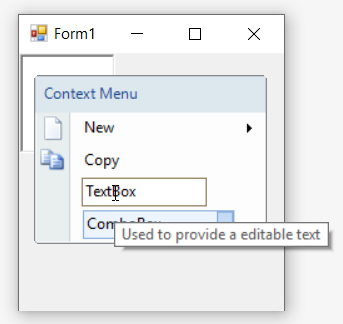
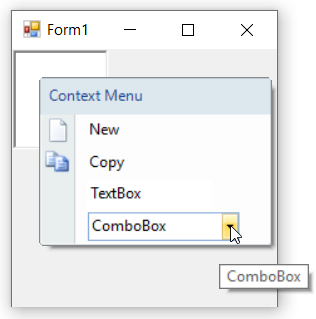

# Tooltip in WinForms Context Menu Strip

A tooltip is a short hint that shows customized text about a menu item when the mouse hovers over it. It can be enabled using the [`ShowItemToolTips`](https://learn.microsoft.com/en-us/dotnet/api/system.windows.forms.toolstrip.showitemtooltips?redirectedfrom=MSDN&view=netframework-4.7.2#System_Windows_Forms_ToolStrip_ShowItemToolTips) property. The [`ToolTipText`](https://learn.microsoft.com/en-us/dotnet/api/system.windows.forms.toolstripitem.tooltiptext?redirectedfrom=MSDN&view=netframework-4.7.2#System_Windows_Forms_ToolStripItem_ToolTipText) property sets the short hint text for each menu item.

The following example assumes that `contextMenuStripEx`, `toolStripMenuItem1`, `toolStripTextBox1`, and `toolStripComboBox1` have already been declared and added to the context menu strip.

The below code snippet will explain how to set tooltip for WinForms Context Menu Strip items.




this.contextMenuStripEx.ShowItemToolTips = true;
this.toolStripMenuItem1.ToolTipText = "Used to create a new file";
this.toolStripTextBox1.ToolTipText = "Used to provide a editable text";
this.toolStripComboBox1.ToolTipText = "Used to provide a collection of items";





Me.contextMenuStripEx.ShowItemToolTips = True
Me.toolStripMenuItem1.ToolTipText = "Used to create a new file"
Me.toolStripTextBox1.ToolTipText = "Used to provide a editable text"
Me.toolStripComboBox1.ToolTipText = "Used to provide a collection of items"




## Auto Tooltip

The [`AutoTooltip`](https://learn.microsoft.com/en-us/dotnet/api/system.windows.forms.toolstripitem.autotooltip?redirectedfrom=MSDN&view=netframework-4.7.2#System_Windows_Forms_ToolStripItem_AutoToolTip) property is set to `false` by default. In such case, the control will display the text set in the [`ToolTipText`](https://learn.microsoft.com/en-us/dotnet/api/system.windows.forms.toolstripitem.tooltiptext?redirectedfrom=MSDN&view=netframework-4.7.2#System_Windows_Forms_ToolStripItem_ToolTipText) property of the menu item as discussed above. But on setting it to `true`, it will display the exact text set in the [`Text`](https://learn.microsoft.com/en-us/dotnet/api/system.windows.forms.toolstripitem.text?redirectedfrom=MSDN&view=netframework-4.7.2#System_Windows_Forms_ToolStripItem_Text) property of each menu item if and only if [`ToolTipText`](https://learn.microsoft.com/en-us/dotnet/api/system.windows.forms.toolstripitem.tooltiptext?redirectedfrom=MSDN&view=netframework-4.7.2#System_Windows_Forms_ToolStripItem_ToolTipText) property remains empty.

The below code snippet will explain how to set auto tooltip for menu items.




this.toolStripMenuItem1.AutoToolTip = true;
this.toolStripTextBox1.AutoToolTip = true;
this.toolStripComboBox1.AutoToolTip = true;





Me.toolStripMenuItem1.AutoToolTip = True
Me.toolStripTextBox1.AutoToolTip = True
Me.toolStripComboBox1.AutoToolTip = True




