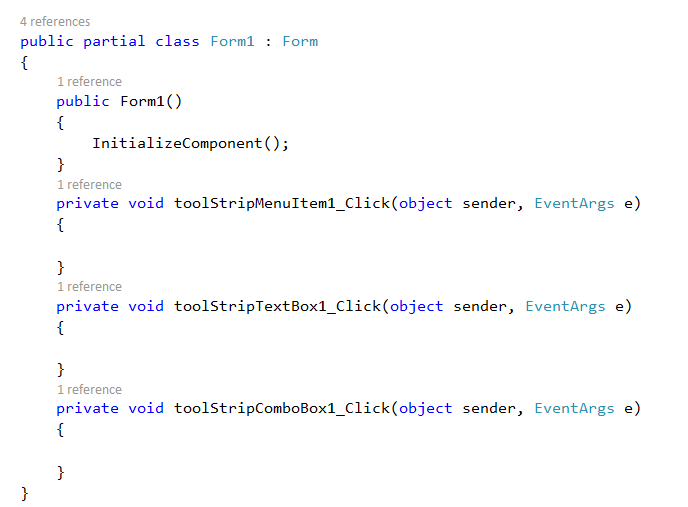

# Trigger Menu Items in WinForms Context Menu Strip

On selection, the WinForms Context Menu Strip item functionality is handled through the [`Click`](https://learn.microsoft.com/en-us/dotnet/api/system.windows.forms.toolstripitem.click?view=netframework-4.7.2) event for further operations.

> **NOTE**
> Menu items can also be operated through keyboard shortcuts. The [`Click`](https://learn.microsoft.com/en-us/dotnet/api/system.windows.forms.toolstripitem.click?view=netframework-4.7.2) event will be invoked when the shortcut keys are pressed.

The below code snippet shows how to attach a click event to menu items through code-behind.




this.toolStripMenuItem1.Click += new System.EventHandler(this.toolStripMenuItem1_Click);
this.toolStripTextBox1.Click += new System.EventHandler(this.toolStripTextBox1_Click);
this.toolStripComboBox1.Click += new System.EventHandler(this.toolStripComboBox1_Click);

private void toolStripMenuItem1_Click(object sender, System.EventArgs e)
{
    MessageBox.Show("New clicked");
}

private void toolStripTextBox1_Click(object sender, System.EventArgs e)
{
    // Handle the ToolStripTextBox click here
}

private void toolStripComboBox1_Click(object sender, System.EventArgs e)
{
    // Handle the ToolStripComboBox click here
}





AddHandler toolStripMenuItem1.Click, AddressOf toolStripMenuItem1_Click
AddHandler toolStripTextBox1.Click, AddressOf toolStripTextBox1_Click
AddHandler toolStripComboBox1.Click, AddressOf toolStripComboBox1_Click

Private Sub toolStripMenuItem1_Click(ByVal sender As Object, ByVal e As System.EventArgs)
    MessageBox.Show("New clicked")
End Sub

Private Sub toolStripTextBox1_Click(ByVal sender As Object, ByVal e As System.EventArgs)
    ' Handle the ToolStripTextBox click here
End Sub

Private Sub toolStripComboBox1_Click(ByVal sender As Object, ByVal e As System.EventArgs)
    ' Handle the ToolStripComboBox click here
End Sub




