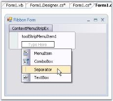
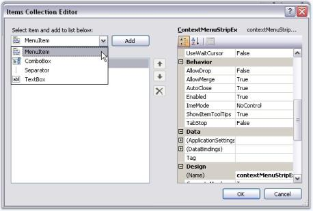
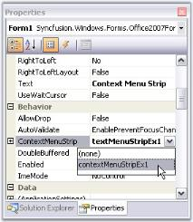
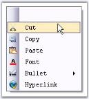
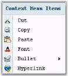
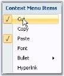

# ContextMenuStripEx

ContextMenuStripEx is a separate control in Essential Tools with advanced features embedded in it. It can be dragged and dropped from the toolbox.

## Creating ContextMenuStripEx

### Through Designer

Drag and drop a ContextMenuStripEx to the form. Click "Type Here" to add the items. This displays a collection of menu items, using which user can add the menu items. 

Items can also be added using ContextMenuStripEx.Items property or Edit Items... command in the property grid.

 

### Through Code

The below code snippets adds a ToolStripItem (Cut) to the menu list.



//Declaration

private Syncfusion.Windows.Forms.Tools.ContextMenuStripEx EditorContextMenuStripEx;

private System.Windows.Forms.ToolStripMenuItem toolStripMenuItem1;

//Initializing

this.EditorContextMenuStripEx = new Syncfusion.Windows.Forms.Tools.ContextMenuStripEx();

//Assigning the ContextMenuStrip created

this.richTextBox1.ContextMenuStrip = this.EditorContextMenuStripEx;

//Adding a menu item

this.EditorContextMenuStripEx.Items.AddRange(new System.Windows.Forms.ToolStripItem[] {this.toolStripMenuItem1});

this.toolStripMenuItem1.Image = ((System.Drawing.Image)(resources.GetObject("toolStripMenuItem1.Image")));

this.toolStripMenuItem1.Text = "Cu&t";

this.EditorContextMenuStripEx.ResumeLayout(false);





'Declaration

Private EditorContextMenuStripEx As Syncfusion.Windows.Forms.Tools.ContextMenuStripEx

Private toolStripMenuItem1 As System.Windows.Forms.ToolStripMenuItem

'Initializing

Me.EditorContextMenuStripEx = New Syncfusion.Windows.Forms.Tools.ContextMenuStripEx

'Assigning the ContextMenuStrip created

Me.richTextBox1.ContextMenuStrip = Me.EditorContextMenuStripEx

'Adding a menu item

Me.EditorContextMenuStripEx.Items.AddRange(New System.Windows.Forms.ToolStripItem() {Me.toolStripMenuItem1})

Me.toolStripMenuItem1.Image = CType((Resources.GetObject("toolStripMenuItem1.Image")), System.Drawing.Image)

Me.toolStripMenuItem1.Text = "Cu&t"

Me.EditorContextMenuStripEx.ResumeLayout(False)



### Associating the ContextMenuStrip to a control

This can be easily done by assigning the ContextMenuStripEx to the Control.ContextMenuStrip property.



this.richTextBox1.ContextMenuStrip = this.contextMenuStripEx1;





Me.richTextBox1.ContextMenuStrip = Me.contextMenuStripEx1



At Run time, when the user right clicks the control, menu items will be displayed like the below image.

Various Features and Customization options are discussed in the following topics.

* Style Settings
* Foreground Settings
* Margin and Shadow Settings
* RunTime Features
* RTL Support
* ToolStripItems

## Style Settings

### Office12ToolStripRenderer Class

Using the Office12ToolStripRenderer Class, the appearance of the ContextMenuStripEx can be changed. 

Use the below code snippet for implementing this feature.



private Syncfusion.Windows.Forms.Tools.Office12ColorTable ct;

private Syncfusion.Windows.Forms.Tools.Office12ToolStripRenderer m_Office12Renderer;

ct =new Syncfusion.Windows.Forms.Tools.Office12ColorTable();

ct.UseSystemColors = false;

m_Office12Renderer = new Syncfusion.Windows.Forms.Tools.Office12ToolStripRenderer(ct);





Private ct As Syncfusion.Windows.Forms.Tools.Office12ColorTable

Private m_Office12Renderer As Syncfusion.Windows.Forms.Tools.Office12ToolStripRenderer

ct = New Syncfusion.Windows.Forms.Tools.Office12ColorTable 

ct.UseSystemColors = False 

m_Office12Renderer = New Syncfusion.Windows.Forms.Tools.Office12ToolStripRenderer(ct)



In the form load event, add one of the below code to change the appearance.



//Sets Office Black Color

this.contextMenuStripEx1.Renderer = new Office12ToolStripRenderer(new OfficeBlack ());

//Sets Office Blue Color

this.contextMenuStripEx1.Renderer = new Office12ToolStripRenderer(new OfficeBlue ());

//Sets Office Silver Color

this.contextMenuStripEx1.Renderer = new Office12ToolStripRenderer(new Office12ColorTable());





'Sets Office Black Color

Me.contextMenuStripEx1.Renderer = New Office12ToolStripRenderer(New OfficeBlack) 

'Sets Office Blue Color

Me.contextMenuStripEx1.Renderer = New Office12ToolStripRenderer(New OfficeBlue)

'Sets Office Silver Color

Me.contextMenuStripEx1.Renderer = New Office12ToolStripRenderer(New Office12ColorTable())



### Rendering Mode

Rendering mode of the ContextMenuStripEx can be controlled using the below property.

<table>
<tr>
<th>
Property</th><th>
Description</th></tr>
<tr>
<td>
RenderMode</td><td>
Represents the painting style applied to the control. The different styles supported are,Professional,System and ManagerRenderMode.</td></tr>
</table>



this.contextMenuStripEx1.RenderMode = System.Windows.Forms.ToolStripRenderMode.Professional;





Me.contextMenuStripEx1.RenderMode = System.Windows.Forms.ToolStripRenderMode.Professional



 

## Foreground Settings of ContextMenuStripEx

### Caption

Caption for the context menu can be specified in Text property. 



this.ContextMenuStripEx.Text = "Context Menu Items";





Me.ContextMenuStripEx.Text = "Context Menu Items"



### Menu Items

The font style for the menu items can be controlled using Font property. 



this.contextMenuStripEx2.Font = new System.Drawing.Font("Courier New", 9F, System.Drawing.FontStyle.Regular);





Me.contextMenuStripEx1.Font = New System.Drawing.Font("Courier New", 9F, System.Drawing.FontStyle.Regular)



N> The font face of the Caption alone changes based on this Font property.

## Margin and Shadow Settings 

### Shadow Settings

Shadow for the context menu drop down is controlled using the below property.

<table>
<tr>
<th>
Property</th><th>
Description</th></tr>
<tr>
<td>
DropShadowEnabled</td><td>
Shows or hides three dimensional shadow for the context menu.</td></tr>
</table>



this.contextMenuStripEx1.DropShadowEnabled = true;





Me.contextMenuStripEx1.DropShadowEnabled = True



The below image displays a shadow for the context menu strip.

### Margin Settings

We can set margins for the context menu using the below properties.

<table>
<tr>
<th>
Property</th><th>
Description</th></tr>
<tr>
<td>
ShowCheckMargin</td><td>
Shows or hides check margin on the left side of the context menu.</td></tr>
<tr>
<td>
ShowImageMargin</td><td>
Shows or hides the image margin on the left side of the context menu.</td></tr>
<tr>
<td>
ImageScaling</td><td>
Sets the size of images on items.</td></tr>
</table>



this.contextMenuStripEx1.ShowCheckMargin = true;

this.contextMenuStripEx1.ShowImageMargin = true;





Me.contextMenuStripEx1.ShowCheckMargin = True

Me.contextMenuStripEx1.ShowImageMargin = True



N> The check functionality can be enabled using the Checked property and check state can be provided using CheckedState property available for individual menu item, through Items Collection Editor.

## RunTime Features 

### Menu Item Tooltips

The menu items can display tooltips while mouse hovering, by enabling ShowItemToolTips property.



this.contextMenuStripEx1.ShowItemToolTips = true;





Me.contextMenuStripEx1.ShowItemToolTips = True



### Auto Closing At Runtime

AutoClose property of the ContextMenuStrip control, when set to true, will close the context menu dropdown when the user clicks any item. If this is not enabled, the menu items will not be closed even after user actions.

<table>
<tr>
<th>
Property</th><th>
Description</th></tr>
<tr>
<td>
AutoClose</td><td>
Specifies whether the context menu closes for any user actions at runtime.{{ '_True_' | markdownify }} - Closes the context menu dropdown, when the user selects or clicks any item.{{ '_False_' | markdownify }} - The context menu drop down will not be closed for any user actions.</td></tr>
</table>



this.contextMenuStripEx1.AutoClose = true;





Me.contextMenuStripEx1.AutoClose = True



## RTL Support

ContextMenuStripEx has RTL support which can be enabled using RightToLeft property.



this.contextMenuStripEx1.RightToLeft = Yes;





Me.contextMenuStripEx1.RightToLeft = Yes



## ToolStripItems

The following are the ToolStripItems which can be added as menu items to the ContextMenuStripEx control.

### ToolStripItem - MenuItem

The ToolStripMenuItem supports all the general properties of a ToolStripItems. This section will walk you through the unique properties with their description for the ToolStripMenuItem.

<table>
<tr>
<th>
Property</th><th>
Description</th></tr>
<tr>
<td>
Checked</td><td>
Indicates whether the item is in the checked state. 

_Note: This will be displayed only if ContextMenuStripEx.ShowCheckMargin property is set to true_ .</td></tr>
<tr>
<td>
Image</td><td>
Sets the image for the menu item. This image will be displayed only when the ContextMenuStripEx.ShowImageMargin is true and DisplayStyle is Image or ImageAndText.</td></tr>
<tr>
<td>
CheckedState</td><td>
Specifies the check state of the item. They can be Checked, Unchecked or Indeterminate.</td></tr>
<tr>
<td>
ShowShortcut keys</td><td>
Indicates whether a shortcut key should be displayed in the menu item. User can access the particular menu item using this shortcut key specified in ShortcutKeys property.</td></tr>
<tr>
<td>
ShortcutKeys</td><td>
The shortcut key to be displayed for a menu item.</td></tr>
<tr>
<td>
ShortcutKeyDisplayString</td><td>
You can modify the ShortcutKey string, that is set, using the ShortcutKeyDisplayString property.</td></tr>
<tr>
<td>
AutoToolTip</td><td>
When set to true, will display the text set in the Text property as the item's tooltip.When set to false, will display the text set in the ToolTipText property.</td></tr>
<tr>
<td>
ToolTipText</td><td>
Sets the text for the tooltip when AutoToolTip is set to false.</td></tr>
<tr>
<td>
DropDown</td><td>
Specifies the ToolStripDropDown to be shown when the item is clicked.</td></tr>
<tr>
<td>
DropDownItems</td><td>
Invokes the Items Collection Editor and lets you add ToolStripItems to be displayed when the item is clicked.</td></tr>
</table>



this.pasteToolStripMenuItem.ShortcutKeys = ((System.Windows.Forms.Keys)((System.Windows.Forms.Keys.Control | System.Windows.Forms.Keys.B)));

this.fontToolStripMenuItem.DropDownItems.AddRange(new System.Windows.Forms.ToolStripItem[] {

this.toolStripMenuItem1,

this.toolStripMenuItem2});

this.hyperlinkToolStripMenuItem.ShortcutKeys = ((System.Windows.Forms.Keys)((System.Windows.Forms.Keys.Control | System.Windows.Forms.Keys.C)));





Me.pasteToolStripMenuItem.ShortcutKeys = DirectCast(((System.Windows.Forms.Keys.Control Or System.Windows.Forms.Keys.B)), System.Windows.Forms.Keys) 

Me.fontToolStripMenuItem.DropDownItems.AddRange(New System.Windows.Forms.ToolStripItem() {Me.toolStripMenuItem1, Me.toolStripMenuItem2}) 

Me.hyperlinkToolStripMenuItem.ShortcutKeys = DirectCast(((System.Windows.Forms.Keys.Control Or System.Windows.Forms.Keys.C)), System.Windows.Forms.Keys) 



### ToolStripItem - ComboBox

This section lists the unique properties of a ToolStripComboBox item and their description.

<table>
<tr>
<th>
Property</th><th>
Description</th></tr>
<tr>
<td>
FlatStyle</td><td>
Specifies the style of display of the control. The options are,Flat,Popup,Standard andSystem.</td></tr>
<tr>
<td>
Items</td><td>
Invokes String Collection Editor which lets you add strings list to be displayed in the combobox.</td></tr>
<tr>
<td>
MaxDropDownItems</td><td>
Sets the maximum number of strings that should be displayed in the dropdown.</td></tr>
<tr>
<td>
MaxLength</td><td>
Specifies the maximum characters that can be entered into the combobox.</td></tr>
<tr>
<td>
DropDownHeight</td><td>
Sets the height for the DropDown.</td></tr>
<tr>
<td>
DropDownWidth</td><td>
Sets the width for the DropDown.</td></tr>
<tr>
<td>
IntegralHeight</td><td>
Indicates whether the combobox should resize to avoid showing partial items.</td></tr>
<tr>
<td>
Sorted</td><td>
Specifies whether the dropdown list should be sorted.</td></tr>
<tr>
<td>
AutoCompleteCustomSource</td><td>
Represents the custom source of string collection for the autocomplete feature, when AutoCompleteSource property is set to CustomSource.</td></tr>
<tr>
<td>
AutoCompleteSource</td><td>
Represents the source of strings used for autocompletion. The sources can be,FileSystem,AllSystemSources (Default),AllUrl,CustomSource,FileSystemDirectories,HistoryList,ListItems,RecentlyUsedList andNone.</td></tr>
<tr>
<td>
AutoCompleteMode</td><td>
Indicates text completion behavior of the combo box. The modes are,{{ '_Suggest_' | markdownify }} - Displays the drop down list associated with the EditControl. This dropdown list is populated with one or more suggested completion strings,{{ '_Append_' | markdownify }} - Appends the reminder of the most likely candidate string to the existing character, highlighting the appended character, and {{ '_SuggestAppend_' | markdownify }} - Displays the drop down, also appends the highlighted string.</td></tr>
</table>
AutoComplete Feature



this.toolStripComboBox1.AutoCompleteCustomSource.AddRange(new string[] {"Customization", "Custom Properties", "Custom Source", "Custom Items", "Properties", "IssuesList"});

this.toolStripComboBox1.AutoCompleteMode = System.Windows.Forms.AutoCompleteMode.Suggest;

this.toolStripComboBox1.AutoCompleteSource = System.Windows.Forms.AutoCompleteSource.CustomSource;





Me.toolStripComboBox1.AutoCompleteCustomSource.AddRange(New String() {"Customization", "Custom Properties", "Custom Source", "Custom Items", "Properties", "IssuesList"}) 

Me.toolStripComboBox1.AutoCompleteMode = System.Windows.Forms.AutoCompleteMode.Suggest 

Me.toolStripComboBox1.AutoCompleteSource = System.Windows.Forms.AutoCompleteSource.CustomSource 



### Separator

This section lists the unique properties of a ToolStripSeparator and their description.

<table>
<tr>
<th>
Property</th><th>
Description</th></tr>
<tr>
<td>
BackColor</td><td>
Sets the back color for the separator.</td></tr>
<tr>
<td>
ForeColor</td><td>
Sets the fore color for the separator.</td></tr>
<tr>
<td>
AutoSize</td><td>
Determines whether the item should automatically size based on its image and text.</td></tr>
<tr>
<td>
Visible</td><td>
Sets the visibility of the separator.</td></tr>
</table>

## TextBox

This section lists the unique properties of a ToolStripTextBox item and their description.

<table>
<tr>
<th>
Property</th><th>
Description</th></tr>
<tr>
<td>
BorderStyle</td><td>
Sets the border style for the textbox. The styles available are,FixedSingle andFixed3D (Default).</td></tr>
<tr>
<td>
Lines</td><td>
Lets you open a String Collection Editor, using which multiline text can be entered.</td></tr>
<tr>
<td>
Text</td><td>
Specifies the text to be displayed on the item.</td></tr>
<tr>
<td>
TextBoxTextAlign</td><td>
Specifies the alignment of the text inside the textbox.</td></tr>
<tr>
<td>
AcceptsReturn</td><td>
Indicates if return characters are accepted as input.</td></tr>
<tr>
<td>
AcceptsTab</td><td>
Indicates if tab characters are accepted as input.</td></tr>
<tr>
<td>
CharacterCasing</td><td>
Indicates if the characters should be Normal or in Upper Case or in Lower Case.</td></tr>
<tr>
<td>
HideSelection</td><td>
Indicates whether the selection should be hidden when the control loses focus.</td></tr>
<tr>
<td>
MaxLength</td><td>
Maximum number of characters that can be entered into the control.</td></tr>
<tr>
<td>
ReadOnly</td><td>
Indicates whether the text in the textbox is read-only.</td></tr>
</table>