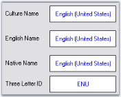

# Advanced Features in Windows Forms Currency Textbox (CurrencyTextbox)

## Clipboard Support

The CurrencyTextBox control also provides support for clipboard operations that are compatible with currency data. The [ClipMode](https://help.syncfusion.com/cr/windowsforms/Syncfusion.Windows.Forms.Tools.NumberTextBoxBase.html#Syncfusion_Windows_Forms_Tools_NumberTextBoxBase_ClipMode) property specifies if formatting characters are to be copied to the clipboard.





this.currencyTextBox1.ClipMode = Syncfusion.Windows.Forms.Tools.CurrencyClipModes.ExcludeFormatting;





Me.currencyTextBox1.ClipMode = Syncfusion.Windows.Forms.Tools.CurrencyClipModes.ExcludeFormatting





 

## Overflow Indicator

You can display an indicator in the textbox, when the currency value is displayed, beyond its boundaries. We can also display tooltip for the overflow indicator. The tooltip text is specified in [OverflowIndicatorToolTipText](https://help.syncfusion.com/cr/windowsforms/Syncfusion.Windows.Forms.Tools.TextBoxExt.html#Syncfusion_Windows_Forms_Tools_TextBoxExt_OverflowIndicatorToolTipText). Set [ShowOverflowIndicator](https://help.syncfusion.com/cr/windowsforms/Syncfusion.Windows.Forms.Tools.TextBoxExt.html#Syncfusion_Windows_Forms_Tools_TextBoxExt_ShowOverflowIndicator) property to true to enable this feature. Set [ShowOverflowIndicatorToolTip](https://help.syncfusion.com/cr/windowsforms/Syncfusion.Windows.Forms.Tools.TextBoxExt.html#Syncfusion_Windows_Forms_Tools_TextBoxExt_ShowOverflowIndicatorToolTip) property to true to display the tooltip text.





this.currencyTextBox1.OverflowIndicatorToolTipText = "Overflow";

this.currencyTextBox1.ShowOverflowIndicator = true;

this.currencyTextBox1.ShowOverflowIndicatorToolTip = true;





Me.currencyTextBox1.OverflowIndicatorToolTipText = "Overflow"

Me.currencyTextBox1.ShowOverflowIndicator = True

Me.currencyTextBox1.ShowOverflowIndicatorToolTip = True





 

## Globalization

The CurrencyTextBox class is globalization aware and uses [System.Globalization.CultureInfo](https://learn.microsoft.com/en-us/dotnet/api/system.globalization.cultureinfo?view=netframework-4.7.2) for locale-specific information. You can set the control's culture to any installed culture through its [culture](https://help.syncfusion.com/cr/windowsforms/Syncfusion.Windows.Forms.Tools.NumberTextBoxBase.html#Syncfusion_Windows_Forms_Tools_NumberTextBoxBase_Culture) property.

* [Culture](https://help.syncfusion.com/cr/windowsforms/Syncfusion.Windows.Forms.Tools.NumberTextBoxBase.html#Syncfusion_Windows_Forms_Tools_NumberTextBoxBase_Culture)
* [CurrentCultureRefresh](https://help.syncfusion.com/cr/windowsforms/Syncfusion.Windows.Forms.Tools.NumberTextBoxBase.html#Syncfusion_Windows_Forms_Tools_NumberTextBoxBase_CurrentCultureRefresh)
* [SpecialCultureValue](https://help.syncfusion.com/cr/windowsforms/Syncfusion.Windows.Forms.Tools.NumberTextBoxBase.html#Syncfusion_Windows_Forms_Tools_NumberTextBoxBase_SpecialCultureValue)

 





this.currencyTextBox1.Culture = new System.Globalization.CultureInfo("ar-SA");

this.currencyTextBox1.CurrentCultureRefresh = true;

this.currencyTextBox1.SpecialCultureValue = Syncfusion.Windows.Forms.Tools.SpecialCultureValues.None;





Me.currencyTextBox1.Culture = New System.Globalization.CultureInfo("ar-SA")

Me.currencyTextBox1.CurrentCultureRefresh = True

Me.currencyTextBox1.SpecialCultureValue = Syncfusion.Windows.Forms.Tools.SpecialCultureValues.None





### User Override for Culture

<table>
<tr>
<td>
{{ '**CurrencyTextBox Properties**' | markdownify }}</td><td>
{{ '**Description**' | markdownify }}</td></tr>
<tr>
<td>
UseUserOverride</td><td>
Specifies if the NumberFormatInfo used for formatting will use the User overrides for the culture.</td></tr>
</table>





this.currencyTextBox1.UseUserOverride = false;

this.currencyTextBox1.Culture = new CultureInfo(CultureInfo.CurrentUICulture.LCID,this.currencyTextBox1.UseUserOverride);





Me.currencyTextBox1.UseUserOverride = False

Me.currencyTextBox1.Culture = New CultureInfo(CultureInfo.CurrentUICulture.LCID,Me.currencyTextBox1.UseUserOverride)





### Culture name

The culture name can be displayed in the different format according to the specified culture value. Refer the following table in detail.

<table>
<tr>
<td>
{{ '**CurrencyTextBox.Culture Properties**' | markdownify }}</td><td>
{{ '**Description**' | markdownify }}</td></tr>
<tr>
<td>
DisplayName</td><td>
Gets the culture name in the format "&lt;language full&gt;(&lt;country/region full&gt;)" in the language of the localized version of the .NET Framework.</td></tr>
<tr>
<td>
EnglishName</td><td>
Gets the culture name in the format "&lt;language full&gt;(&lt;country/region full&gt;)" in English.</td></tr>
<tr>
<td>
NativeName</td><td>
Gets the culture name in the format "&lt;language full&gt;(&lt;country/region full&gt;)" in the language that the culture is set to display.</td></tr>
<tr>
<td>
ThreeLetterWindowsLanguageName</td><td>
Gets the three letter code for the language as specified in the windows API.</td></tr>
</table>

The following figure illustrates this when the culture is 'en-US'.





this.label11.Text = this.currencyTextBox1.Culture.DisplayName;

this.label12.Text  = this.currencyTextBox1.Culture.EnglishName;

this.label13.Text  = this.currencyTextBox1.Culture.NativeName;

this.label14.Text  = this.currencyTextBox1.Culture.ThreeLetterWindowsLanguageName;





Me.label11.Text = Me.currencyTextBox1.Culture.DisplayName

Me.label12.Text = Me.currencyTextBox1.Culture.EnglishName

Me.label13.Text = Me.currencyTextBox1.Culture.NativeName

Me.label14.Text = Me.currencyTextBox1.Culture.ThreeLetterWindowsLanguageName





 

