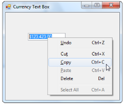
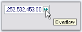
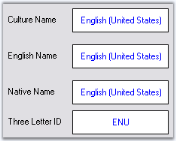

# Advanced Features in WinForms Currency TextBox

## Clipboard Support

The WinForms Currency TextBox control also provides support for clipboard operations that are compatible with currency data. The [ClipMode](https://help.syncfusion.com/cr/windowsforms/Syncfusion.Windows.Forms.Tools.NumberTextBoxBase.html#Syncfusion_Windows_Forms_Tools_NumberTextBoxBase_ClipMode) property specifies whether formatting characters are to be copied to the clipboard.



this.currencyTextBox1.ClipMode = Syncfusion.Windows.Forms.Tools.CurrencyClipModes.ExcludeFormatting;


Me.currencyTextBox1.ClipMode = Syncfusion.Windows.Forms.Tools.CurrencyClipModes.ExcludeFormatting



## Overflow Indicator

You can display an indicator in the textbox when the currency value is displayed beyond its boundaries. You can also display a tooltip for the overflow indicator. The tooltip text is specified in [OverflowIndicatorToolTipText](https://help.syncfusion.com/cr/windowsforms/Syncfusion.Windows.Forms.Tools.TextBoxExt.html#Syncfusion_Windows_Forms_Tools_TextBoxExt_OverflowIndicatorToolTipText). Set the [ShowOverflowIndicator](https://help.syncfusion.com/cr/windowsforms/Syncfusion.Windows.Forms.Tools.TextBoxExt.html#Syncfusion_Windows_Forms_Tools_TextBoxExt_ShowOverflowIndicator) property to `true` to enable this feature. Set the [ShowOverflowIndicatorToolTip](https://help.syncfusion.com/cr/windowsforms/Syncfusion.Windows.Forms.Tools.TextBoxExt.html#Syncfusion_Windows_Forms_Tools_TextBoxExt_ShowOverflowIndicatorToolTip) property to `true` to display the tooltip text.



this.currencyTextBox1.OverflowIndicatorToolTipText = "Overflow";
this.currencyTextBox1.ShowOverflowIndicator = true;
this.currencyTextBox1.ShowOverflowIndicatorToolTip = true;


Me.currencyTextBox1.OverflowIndicatorToolTipText = "Overflow"
Me.currencyTextBox1.ShowOverflowIndicator = True
Me.currencyTextBox1.ShowOverflowIndicatorToolTip = True



## Globalization

The WinForms Currency TextBox class is globalization-aware and uses [System.Globalization.CultureInfo](https://learn.microsoft.com/en-us/dotnet/api/system.globalization.cultureinfo?view=netframework-4.7.2) for locale-specific information. You can set the control's culture to any installed culture through its [Culture](https://help.syncfusion.com/cr/windowsforms/Syncfusion.Windows.Forms.Tools.NumberTextBoxBase.html#Syncfusion_Windows_Forms_Tools_NumberTextBoxBase_Culture) property.

* [Culture](https://help.syncfusion.com/cr/windowsforms/Syncfusion.Windows.Forms.Tools.NumberTextBoxBase.html#Syncfusion_Windows_Forms_Tools_NumberTextBoxBase_Culture) - Sets the culture used for formatting and parsing.
* [CurrentCultureRefresh](https://help.syncfusion.com/cr/windowsforms/Syncfusion.Windows.Forms.Tools.NumberTextBoxBase.html#Syncfusion_Windows_Forms_Tools_NumberTextBoxBase_CurrentCultureRefresh) - When `true`, the control refreshes whenever the current culture changes.
* [SpecialCultureValue](https://help.syncfusion.com/cr/windowsforms/Syncfusion.Windows.Forms.Tools.NumberTextBoxBase.html#Syncfusion_Windows_Forms_Tools_NumberTextBoxBase_SpecialCultureValue) - Specifies how the control behaves for neutral cultures that do not define currency or number format information.



this.currencyTextBox1.Culture = new System.Globalization.CultureInfo("ar-SA");
this.currencyTextBox1.CurrentCultureRefresh = true;
this.currencyTextBox1.SpecialCultureValue = Syncfusion.Windows.Forms.Tools.SpecialCultureValues.None;


Me.currencyTextBox1.Culture = New System.Globalization.CultureInfo("ar-SA")
Me.currencyTextBox1.CurrentCultureRefresh = True
Me.currencyTextBox1.SpecialCultureValue = Syncfusion.Windows.Forms.Tools.SpecialCultureValues.None



### User Override for Culture

<table>
<tr>
<th>WinForms Currency TextBox Property</th>
<th>Description</th>
</tr>
<tr>
<td>UseUserOverride</td>
<td>Specifies if the NumberFormatInfo used for formatting will use the User overrides for the culture.</td>
</tr>
</table>



this.currencyTextBox1.UseUserOverride = false;
this.currencyTextBox1.Culture = new CultureInfo(CultureInfo.CurrentUICulture.LCID, this.currencyTextBox1.UseUserOverride);


Me.currencyTextBox1.UseUserOverride = False
Me.currencyTextBox1.Culture = New CultureInfo(CultureInfo.CurrentUICulture.LCID, Me.currencyTextBox1.UseUserOverride)



### Culture name

The culture name can be displayed in different formats according to the specified culture value. Refer to the following table for details.

<table>
<tr>
<th>CurrencyTextBox.Culture Property</th>
<th>Description</th>
</tr>
<tr>
<td>DisplayName</td>
<td>Gets the culture name in the format "&lt;language full&gt;(&lt;country/region full&gt;)" in the language of the localized version of the .NET Framework.</td>
</tr>
<tr>
<td>EnglishName</td>
<td>Gets the culture name in the format "&lt;language full&gt;(&lt;country/region full&gt;)" in English.</td>
</tr>
<tr>
<td>NativeName</td>
<td>Gets the culture name in the format "&lt;language full&gt;(&lt;country/region full&gt;)" in the language that the culture is set to display.</td>
</tr>
<tr>
<td>ThreeLetterWindowsLanguageName</td>
<td>Gets the three letter code for the language as specified in the Windows API.</td>
</tr>
</table>

The following figure illustrates this when the culture is **en-US**.



this.label11.Text = this.currencyTextBox1.Culture.DisplayName;
this.label12.Text = this.currencyTextBox1.Culture.EnglishName;
this.label13.Text = this.currencyTextBox1.Culture.NativeName;
this.label14.Text = this.currencyTextBox1.Culture.ThreeLetterWindowsLanguageName;


Me.label11.Text = Me.currencyTextBox1.Culture.DisplayName
Me.label12.Text = Me.currencyTextBox1.Culture.EnglishName
Me.label13.Text = Me.currencyTextBox1.Culture.NativeName
Me.label14.Text = Me.currencyTextBox1.Culture.ThreeLetterWindowsLanguageName



 

