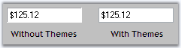
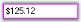
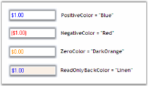

# Appearance in WinForms Currency TextBox

## Themes

WinForms Currency TextBox control can be themed by setting the [ThemesEnabled](https://help.syncfusion.com/cr/windowsforms/Syncfusion.Windows.Forms.Tools.TextBoxExt.html#Syncfusion_Windows_Forms_Tools_TextBoxExt_ThemesEnabled) property to `true`.



this.currencyTextBox1.ThemesEnabled = true;


Me.currencyTextBox1.ThemesEnabled = True



## Border Styles

The following properties are available to set the border for the WinForms Currency TextBox control:

* [BorderStyle](https://learn.microsoft.com/en-us/dotnet/api/system.windows.forms.textboxbase.borderstyle?redirectedfrom=MSDN&view=netframework-4.7.2#System_Windows_Forms_TextBoxBase_BorderStyle) - Sets the overall border style (for example, `FixedSingle` or `None`).
* [Border3DStyle](https://help.syncfusion.com/cr/windowsforms/Syncfusion.Windows.Forms.Tools.TextBoxExt.html#Syncfusion_Windows_Forms_Tools_TextBoxExt_Border3DStyle) - Sets the 3D border style when `BorderStyle` is `Fixed3D`.
* [BorderSides](https://help.syncfusion.com/cr/windowsforms/Syncfusion.Windows.Forms.Tools.TextBoxExt.html#Syncfusion_Windows_Forms_Tools_TextBoxExt_BorderSides) - Specifies which sides of the border are drawn.
* [BorderColor](https://help.syncfusion.com/cr/windowsforms/Syncfusion.Windows.Forms.Tools.TextBoxExt.html#Syncfusion_Windows_Forms_Tools_TextBoxExt_BorderColor) - Sets the color of the border.



this.currencyTextBox1.BorderStyle = System.Windows.Forms.BorderStyle.FixedSingle;
this.currencyTextBox1.Border3DStyle = System.Windows.Forms.Border3DStyle.Flat;
this.currencyTextBox1.BorderColor = System.Drawing.Color.Magenta;
this.currencyTextBox1.BorderSides = System.Windows.Forms.Border3DSide.All;


Me.currencyTextBox1.BorderStyle = System.Windows.Forms.BorderStyle.FixedSingle
Me.currencyTextBox1.Border3DStyle = System.Windows.Forms.Border3DStyle.Flat
Me.currencyTextBox1.BorderColor = System.Drawing.Color.Magenta
Me.currencyTextBox1.BorderSides = System.Windows.Forms.Border3DSide.All



## Color Settings

We can set different colors for different sets of currency values. Colors can be set for positive, negative, and zero values using the properties below. We can also draw the background of the WinForms Currency TextBox with a specific color when it is in read-only mode using the [ReadOnlyBackColor](https://help.syncfusion.com/cr/windowsforms/Syncfusion.Windows.Forms.Tools.NumberTextBoxBase.html#Syncfusion_Windows_Forms_Tools_NumberTextBoxBase_ReadOnlyBackColor) property.

* [PositiveColor](https://help.syncfusion.com/cr/windowsforms/Syncfusion.Windows.Forms.Tools.NumberTextBoxBase.html#Syncfusion_Windows_Forms_Tools_NumberTextBoxBase_PositiveColor) - Foreground color used for positive values.
* [NegativeColor](https://help.syncfusion.com/cr/windowsforms/Syncfusion.Windows.Forms.Tools.NumberTextBoxBase.html#Syncfusion_Windows_Forms_Tools_NumberTextBoxBase_NegativeColor) - Foreground color used for negative values.
* [ReadOnlyBackColor](https://help.syncfusion.com/cr/windowsforms/Syncfusion.Windows.Forms.Tools.NumberTextBoxBase.html#Syncfusion_Windows_Forms_Tools_NumberTextBoxBase_ReadOnlyBackColor) - Background color when the control is read-only.
* [ZeroColor](https://help.syncfusion.com/cr/windowsforms/Syncfusion.Windows.Forms.Tools.NumberTextBoxBase.html#Syncfusion_Windows_Forms_Tools_NumberTextBoxBase_ZeroColor) - Foreground color used when the value is zero.



this.currencyTextBox1.PositiveColor = System.Drawing.Color.Blue;
this.currencyTextBox1.NegativeColor = System.Drawing.Color.Red;
this.currencyTextBox1.ReadOnlyBackColor = System.Drawing.Color.Linen;
this.currencyTextBox1.ZeroColor = System.Drawing.Color.DarkOrange;


Me.currencyTextBox1.PositiveColor = System.Drawing.Color.Blue
Me.currencyTextBox1.NegativeColor = System.Drawing.Color.Red
Me.currencyTextBox1.ReadOnlyBackColor = System.Drawing.Color.Linen
Me.currencyTextBox1.ZeroColor = System.Drawing.Color.DarkOrange



## Visual Style

Please refer to the [TextBoxExt Visual Style](https://help.syncfusion.com/windowsforms/textboxext/overview) page to set themes for the WinForms Currency TextBox.
