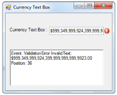

# Event Handling in WinForms Currency TextBox

WinForms Currency TextBox fires events when the 3D border style is changed, the border color is changed, the border sides are changed, the decimal value property is changed, and when the `ThemesEnabled` property is changed. It also fires an event when the input text is invalid.

**KeyDown:**

The [KeyDown event](https://learn.microsoft.com/en-us/dotnet/api/system.windows.forms.control.keydown?view=windowsdesktop-7.0&viewFallbackFrom=net-5.0) occurs when a key is pressed while the control has focus. The event handler receives an argument of type `KeyEventArgs`. We can handle this event to add keyboard support to the WinForms Currency TextBox. Refer to [Adding Key Support for Mega and Kilo](https://help.syncfusion.com/windowsforms/currency-textbox/event-handling#adding-key-support).

**ValidationError:** It occurs when an inappropriate character is encountered. The event handler receives an argument of type `ValidationErrorArgs`.

The event properties associated with the `ValidationErrorArgs` are as follows.

<table>
<tr>
<th>Members</th>
<th>Description</th>
</tr>
<tr>
<td>ErrorMessage</td>
<td>Returns the error message.</td>
</tr>
<tr>
<td>InvalidText</td>
<td>Returns the invalid text as it would have been if the error had not intercepted it.</td>
</tr>
<tr>
<td>StartPosition</td>
<td>Returns the location of the invalid input within the invalid text.</td>
</tr>
</table>

It can be handled to raise an alarm to the user when invalid text is entered. Refer to the [Error Validation](#error-validation) section below.

## KeyDown Event

### Adding Key Support

Sometimes there may be situations for entering large values, such as Mega, Kilo, and so on. In such situations, adding keyboard support is very useful for the user. For example, if we want to enter the value as multiples of a thousand, we can use the following method. Note that the snippet below should be wired up to the control's `KeyDown` event (for example, `this.currencyTextBox1.KeyDown += new System.Windows.Forms.KeyEventHandler(this.currencyTextBox1_KeyDown);`).



private void currencyTextBox1_KeyDown(object sender, KeyEventArgs e)
{
    // Multiplies the current value by 1000, 1000000, or 1000000000 based on the key pressed.
    decimal v = currencyTextBox1.DecimalValue;
    switch (e.KeyCode)
    {
        case Keys.G: v = v * 1000000000; break;
        case Keys.M: v = v * 1000000; break;
        case Keys.K: v = v * 1000; break;
    }
    currencyTextBox1.DecimalValue = v;
}


Private Sub currencyTextBox1_KeyDown(ByVal sender As Object, ByVal e As KeyEventArgs)
    ' Multiplies the current value by 1000, 1000000, or 1000000000 based on the key pressed.
    Dim v As Decimal = currencyTextBox1.DecimalValue
    Select Case e.KeyCode
        Case Keys.G
            v = v * 1000000000
        Case Keys.M
            v = v * 1000000
        Case Keys.K
            v = v * 1000
    End Select
    currencyTextBox1.DecimalValue = v
End Sub



So if the user wants to enter `32000`, they just need to enter `32` and then press **K**. The value will change to `32000`.

## Error Validation

When invalid text is entered by the user, we can handle the `ValidationError` event to raise an alarm. Follow the steps below.

* Drag the WinForms Currency TextBox, an `ErrorProvider` control, and a `TextBox` onto the form.
* Handle the `ValidationError` event of the WinForms Currency TextBox.



private void currencyTextBox1_ValidationError(object sender, ValidationErrorArgs e)
{
    string item = e.StartPosition.ToString();
    string eventlogmessage = String.Format("Event: {0} InvalidText: {1} Position: {2}\r\n", "ValidationError", e.InvalidText, item);

    textBox1.Text = textBox1.Text + eventlogmessage;
    this.errorProvider1.SetError((Control)sender, eventlogmessage);
}


Private Sub currencyTextBox1_ValidationError(ByVal sender As Object, ByVal e As ValidationErrorArgs)
    Dim item As String = e.StartPosition.ToString()
    Dim eventlogmessage As String = String.Format("Event: {0} InvalidText: {1} Position: {2}" & vbCrLf, "ValidationError", e.InvalidText, item)

    textBox1.Text = textBox1.Text & eventlogmessage
    Me.errorProvider1.SetError(CType(sender, Control), eventlogmessage)
End Sub



