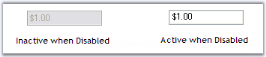

# FAQ in WinForms Currency TextBox

When the control is set to disabled, we could not make any changes in it. But we can make the text active by setting [DrawActiveWhenDisabled](https://help.syncfusion.com/cr/windowsforms/Syncfusion.Windows.Forms.Tools.TextBoxExt.html#Syncfusion_Windows_Forms_Tools_TextBoxExt_DrawActiveWhenDisabled) to True.

The following figure illustrates this.

 

