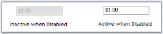

---
layout: post
title: FAQ in Windows Forms Currency TextBox | Syncfusion®
description: Find frequently asked questions and answers about Syncfusion Windows Forms CurrencyTextBox control, its features, behavior, and common usage scenarios.
platform: windowsforms
control: CurrencyTextBox
documentation: ug
---

# FAQ in WinForms Currency TextBox

When the control is set to disabled, the user cannot make any changes to it. But you can make the text active by setting the [DrawActiveWhenDisabled](https://help.syncfusion.com/cr/windowsforms/Syncfusion.Windows.Forms.Tools.TextBoxExt.html#Syncfusion_Windows_Forms_Tools_TextBoxExt_DrawActiveWhenDisabled) property to `True`.

The following figure illustrates this.

 

