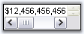
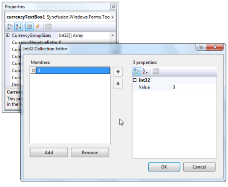

# Text Field in Windows Forms Currency Textbox (CurrencyTextbox)

The text field of a CurrencyTextBox control can be customized using the properties available. The below image illustrates the various sections of the control.

 

## Text

The default text in the CurrencyTextBox can be edited through [Text](https://help.syncfusion.com/cr/windowsforms/Syncfusion.Windows.Forms.Tools.CurrencyTextBox.html#Syncfusion_Windows_Forms_Tools_CurrencyTextBox_Text) property. Default value is $2.00. The text can be aligned to Left, Right or Center using TextAlign property.





this.currencyTextBox2.Text = "$25.00";

this.currencyTextBox1.TextAlign = System.Windows.Forms.HorizontalAlignment.Right;





Me.currencyTextBox2.Text = "$25.00"

Me.currencyTextBox1.TextAlign = System.Windows.Forms.HorizontalAlignment.Right





 

### Multiline Feature

The CurrencyTextBox control can be made multiline by setting [Multiline](https://learn.microsoft.com/en-us/dotnet/api/system.windows.forms.textbox.multiline?redirectedfrom=MSDN&view=netframework-4.7.2#System_Windows_Forms_TextBox_Multiline) property to true. Using the below properties we can control the behavior of control. 

* [Lines](https://learn.microsoft.com/en-us/dotnet/api/system.windows.forms.textboxbase.lines?redirectedfrom=MSDN&view=netframework-4.7.2#System_Windows_Forms_TextBoxBase_Lines)
* [WordWrap](https://learn.microsoft.com/en-us/dotnet/api/system.windows.forms.textboxbase.wordwrap?redirectedfrom=MSDN&view=netframework-4.7.2#System_Windows_Forms_TextBoxBase_WordWrap)
* [ScrollBars](https://learn.microsoft.com/en-us/dotnet/api/system.windows.forms.textboxbase.wordwrap?redirectedfrom=MSDN&view=netframework-4.7.2#System_Windows_Forms_TextBoxBase_WordWrap)





this.currencyTextBox1.Multiline = true;

this.currencyTextBox2.Text = "$12,456,456,456,456,456,456,456.00";

this.currencyTextBox2.WordWrap = "true"

this.currencyTextBox1.ScrollBars = System.Windows.Forms.ScrollBars.Both;





Me.currencyTextBox1.Multiline = True

Me.currencyTextBox2.Text = "$12,456,456,456,456,456,456,456.00"

Me.currencyTextBox2.WordWrap = True

Me.currencyTextBox1.ScrollBars = System.Windows.Forms.ScrollBars.Both





 

 

### Password Character

We can display password characters instead of the digits in the text field using [PasswordChar](https://learn.microsoft.com/en-us/dotnet/api/system.windows.forms.textbox.passwordchar?redirectedfrom=MSDN&view=netframework-4.7.2#System_Windows_Forms_TextBox_PasswordChar) property. To use the system password character in the text field, set [UseSystemPasswordChar](https://learn.microsoft.com/en-us/dotnet/api/system.windows.forms.textbox.usesystempasswordchar?redirectedfrom=MSDN&view=netframework-4.7.2#System_Windows_Forms_TextBox_UseSystemPasswordChar) property to true.





this.currencyTextBox1.UseSystemPasswordChar = false;

this.currencyTextBox1.PasswordChar = '*';





Me.currencyTextBox1.UseSystemPasswordChar = False

Me.currencyTextBox1.PasswordChar = '*'





### Banner Text Support

We can set banner text for the CurrencyTextBox control. Refer BannerTextProvider Component topic for more details.

We need to do the below settings to make Banner text feature available for the control.





this.currencyTextBox1.AllowNull = true;

this.currencyTextBox1.NullString = "";

this.currencyTextBox1.Text = "";





Me.currencyTextBox1.AllowNull = True

Me.currencyTextBox1.NullString = ""

Me.currencyTextBox1.Text = ""





## Number and Decimal Digits

The CurrencyTextBox text field has a number part and a decimal part. The properties which controls appearance and behavior of the text field are discussed in this section.

### Number part

The below properties lets you decide the formatting of the number part of CurrencyTextBox control.

* [CurrencyNumberDigits](https://help.syncfusion.com/cr/windowsforms/Syncfusion.Windows.Forms.Tools.CurrencyTextBox.html#Syncfusion_Windows_Forms_Tools_CurrencyTextBox_CurrencyNumberDigits)
* [CurrencyPositivePattern](https://help.syncfusion.com/cr/windowsforms/Syncfusion.Windows.Forms.Tools.CurrencyTextBox.html#Syncfusion_Windows_Forms_Tools_CurrencyTextBox_CurrencyPositivePattern)
* [CurrencyNegativePattern](https://help.syncfusion.com/cr/windowsforms/Syncfusion.Windows.Forms.Tools.CurrencyTextBox.html#Syncfusion_Windows_Forms_Tools_CurrencyTextBox_CurrencyNegativePattern)





this.currencyTextBox1.NumberDigits = 10;

this.currencyTextBox1.CurrencyPositivePattern = 1;

this.currencyTextBox1.CurrencyNegativePattern = 2;





Me.currencyTextBox1.NumberDigits = 10

Me.currencyTextBox1.CurrencyPositivePattern = 1

Me.currencyTextBox1.CurrencyNegativePattern = 2





### Decimal Part

The below properties lets you decide the formatting of the CurrencyTextBox control's number part.

* [CurrencyDecimalDigits](https://help.syncfusion.com/cr/windowsforms/Syncfusion.Windows.Forms.Tools.CurrencyTextBox.html#Syncfusion_Windows_Forms_Tools_CurrencyTextBox_CurrencyDecimalDigits)
* [CurrencyDecimalSeparator](https://help.syncfusion.com/cr/windowsforms/Syncfusion.Windows.Forms.Tools.CurrencyTextBox.html#Syncfusion_Windows_Forms_Tools_CurrencyTextBox_CurrencyDecimalSeparator)
* [CurrencyGroupSeparator](https://help.syncfusion.com/cr/windowsforms/Syncfusion.Windows.Forms.Tools.CurrencyTextBox.html#Syncfusion_Windows_Forms_Tools_CurrencyTextBox_CurrencyGroupSeparator)
* [CurrencyGroupSizes](https://help.syncfusion.com/cr/windowsforms/Syncfusion.Windows.Forms.Tools.CurrencyTextBox.html#Syncfusion_Windows_Forms_Tools_CurrencyTextBox_CurrencyGroupSizes)
* [DecimalValue](https://help.syncfusion.com/cr/windowsforms/Syncfusion.Windows.Forms.Tools.CurrencyTextBox.html#Syncfusion_Windows_Forms_Tools_CurrencyTextBox_DecimalValue)
* [RemoveDecimalZeros](https://help.syncfusion.com/cr/windowsforms/Syncfusion.Windows.Forms.Tools.CurrencyTextBox.html#Syncfusion_Windows_Forms_Tools_CurrencyTextBox_RemoveDecimalZeros)

 





this.currencyTextBox1.CurrencyDecimalDigits = 3;

this.currencyTextBox1.CurrencyDecimalSeparator = ".";

this.currencyTextBox1.CurrencyGroupSeparator = ",";

this.currencyTextBox1.CurrencyGroupSizes = new int[] {3};

this.currencyTextBox1.RemoveDecimalZeros = true;





Me.currencyTextBox1.CurrencyDecimalDigits = 3

Me.currencyTextBox1.CurrencyDecimalSeparator = "."

Me.currencyTextBox1.CurrencyGroupSeparator = ","

Me.currencyTextBox1.CurrencyGroupSizes = New Integer() {3}

Me.currencyTextBox1.RemoveDecimalZeros = True





 

 

## Negative Part

The default negative sign '-' can be changed by [NegativeSign](https://help.syncfusion.com/cr/windowsforms/Syncfusion.Windows.Forms.Tools.NumberTextBoxBase.html#Syncfusion_Windows_Forms_Tools_NumberTextBoxBase_NegativeSign) property to any other special characters. We can specify the behavior of the Currency TextBox by [NegativeInputPendingOnSelectAll](https://help.syncfusion.com/cr/windowsforms/Syncfusion.Windows.Forms.Tools.NumberTextBoxBase.html#Syncfusion_Windows_Forms_Tools_NumberTextBoxBase_NegativeInputPendingOnSelectAll) when its content is fully selected and negative key is pressed by the user. When [NegativeInputPendingOnSelectAll](https://help.syncfusion.com/cr/windowsforms/Syncfusion.Windows.Forms.Tools.NumberTextBoxBase.html#Syncfusion_Windows_Forms_Tools_NumberTextBoxBase_NegativeInputPendingOnSelectAll) set to 'True', the current value is not changed. The next key stroke is taken to a new value and the entire content of the TextBox is replaced by the negative value of the key stroke entered.

For example, if the current value of the TextBox is 1.00 with all the text being selected and when the user presses the negative key followed by key 5, the value will be  '-5'.

When it is set to false, the current value is changed to negative value immediately. For example, if the current value of the TextBox is 1.00 with all the text being selected and when the user presses the negative key, the value is '-1'.





this.currencyTextBox1.NegativeSign = "-";

this.currencyTextBox1.NegativeInputPendingOnSelectAll = true;





Me.currencyTextBox1.NegativeSign = "-"

Me.currencyTextBox1.NegativeInputPendingOnSelectAll = True





## Values

The maximum and minimum value of the currency can be specified by MaxValue and MinValue properties.

[MaxValue](https://help.syncfusion.com/cr/windowsforms/Syncfusion.Windows.Forms.Tools.CurrencyTextBox.html#Syncfusion_Windows_Forms_Tools_CurrencyTextBox_MaxValue)
[MinValue](https://help.syncfusion.com/cr/windowsforms/Syncfusion.Windows.Forms.Tools.CurrencyTextBox.html#Syncfusion_Windows_Forms_Tools_CurrencyTextBox_MinValue)
[EnforceMinMaxDuringValidating](https://help.syncfusion.com/cr/windowsforms/Syncfusion.Windows.Forms.Tools.NumberTextBoxBase.html#Syncfusion_Windows_Forms_Tools_NumberTextBoxBase_EnforceMinMaxDuringValidating)





this.currencyTextBox1.MaxValue=10;

this.currencyTextBox1.MinValue=0;

this.currencyTextBox1.EnforceMinMaxDuringValidating= true;





Me.currencyTextBox1.MaxValue=10

Me.currencyTextBox1.MinValue=0

Me.currencyTextBox1.EnforceMinMaxDuringValidating = True;





### Null String

If you want to display null string instead of actual decimal values, you can set [NullString](https://help.syncfusion.com/cr/windowsforms/Syncfusion.Windows.Forms.Tools.NumberTextBoxBase.html#Syncfusion_Windows_Forms_Tools_NumberTextBoxBase_NullString) property to any values. To display the null string set AllowNull to true.

[NullString](https://help.syncfusion.com/cr/windowsforms/Syncfusion.Windows.Forms.Tools.NumberTextBoxBase.html#Syncfusion_Windows_Forms_Tools_NumberTextBoxBase_NullString)
[AllowNull](https://help.syncfusion.com/cr/windowsforms/Syncfusion.Windows.Forms.Tools.NumberTextBoxBase.html#Syncfusion_Windows_Forms_Tools_NumberTextBoxBase_AllowNull)





this.currencyTextBox1.NullString = "NULL";

this.currencyTextBox1.AllowNull = true;





Me.currencyTextBox1.NullString = "NULL"

Me.currencyTextBox1.AllowNull = True





 

## Currency Symbol

The currency symbol that will be used for formatting the display is specified by setting [CurrencySymbol](https://help.syncfusion.com/cr/windowsforms/Syncfusion.Windows.Forms.Tools.CurrencyTextBox.html#Syncfusion_Windows_Forms_Tools_CurrencyTextBox_CurrencySymbol) to any special characters.





this.currencyTextBox1.CurrencySymbol = "#";





Me.currencyTextBox1.CurrencySymbol = "#"




