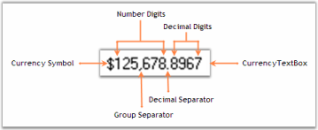
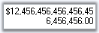
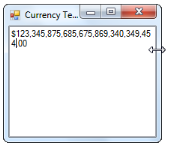
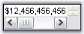
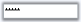
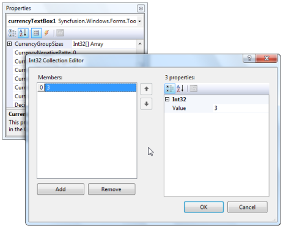
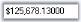
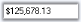
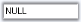

# Text Field in WinForms Currency TextBox

The text field of a WinForms Currency TextBox control can be customized using the available properties. The image below illustrates the various sections of the control.

## Text

The default text in the WinForms Currency TextBox can be edited through the [Text](https://help.syncfusion.com/cr/windowsforms/Syncfusion.Windows.Forms.Tools.CurrencyTextBox.html#Syncfusion_Windows_Forms_Tools_CurrencyTextBox_Text) property. The default value is `$2.00`. The text can be aligned to Left, Right, or Center using the `TextAlign` property.



this.currencyTextBox2.Text = "$25.00";
this.currencyTextBox1.TextAlign = System.Windows.Forms.HorizontalAlignment.Right;


Me.currencyTextBox2.Text = "$25.00"
Me.currencyTextBox1.TextAlign = System.Windows.Forms.HorizontalAlignment.Right



### Multiline Feature

The WinForms Currency TextBox control can be made multiline by setting the [Multiline](https://learn.microsoft.com/en-us/dotnet/api/system.windows.forms.textbox.multiline?redirectedfrom=MSDN&view=netframework-4.7.2#System_Windows_Forms_TextBox_Multiline) property to `true`. Use the following properties to control the behavior of the control:

* [Lines](https://learn.microsoft.com/en-us/dotnet/api/system.windows.forms.textboxbase.lines?redirectedfrom=MSDN&view=netframework-4.7.2#System_Windows_Forms_TextBoxBase_Lines) - Gets or sets the lines of text in a multiline text box.
* [WordWrap](https://learn.microsoft.com/en-us/dotnet/api/system.windows.forms.textboxbase.wordwrap?redirectedfrom=MSDN&view=netframework-4.7.2#System_Windows_Forms_TextBoxBase_WordWrap) - When `true`, lines wrap automatically at the edge of the text box.
* [ScrollBars](https://learn.microsoft.com/en-us/dotnet/api/system.windows.forms.textboxbase.wordwrap?view=netframework-4.7.2) - Specifies which scroll bars appear (the original docs link to the `WordWrap` API; this property controls scroll bars).



this.currencyTextBox1.Multiline = true;
this.currencyTextBox2.Text = "$12,456,456,456,456,456,456,456.00";
this.currencyTextBox2.WordWrap = true;
this.currencyTextBox1.ScrollBars = System.Windows.Forms.ScrollBars.Both;


Me.currencyTextBox1.Multiline = True
Me.currencyTextBox2.Text = "$12,456,456,456,456,456,456,456.00"
Me.currencyTextBox2.WordWrap = True
Me.currencyTextBox1.ScrollBars = System.Windows.Forms.ScrollBars.Both



### Password Character

You can display password characters instead of the digits in the text field using the [PasswordChar](https://learn.microsoft.com/en-us/dotnet/api/system.windows.forms.textbox.passwordchar?redirectedfrom=MSDN&view=netframework-4.7.2#System_Windows_Forms_TextBox_PasswordChar) property. To use the system password character in the text field, set the [UseSystemPasswordChar](https://learn.microsoft.com/en-us/dotnet/api/system.windows.forms.textbox.usesystempasswordchar?redirectedfrom=MSDN&view=netframework-4.7.2#System_Windows_Forms_TextBox_UseSystemPasswordChar) property to `true`.



this.currencyTextBox1.UseSystemPasswordChar = false;
this.currencyTextBox1.PasswordChar = '*';


Me.currencyTextBox1.UseSystemPasswordChar = False
Me.currencyTextBox1.PasswordChar = '*'



### Banner Text Support

You can set banner text for the WinForms Currency TextBox control. Refer to the **BannerTextProvider Component** topic for more details.

Configure the settings below to make the Banner Text feature available for the control.



this.currencyTextBox1.AllowNull = true;
this.currencyTextBox1.NullString = "";
this.currencyTextBox1.Text = "";


Me.currencyTextBox1.AllowNull = True
Me.currencyTextBox1.NullString = ""
Me.currencyTextBox1.Text = ""



## Number and Decimal Digits

The WinForms Currency TextBox text field has a number part and a decimal part. The properties that control the appearance and behavior of the text field are discussed in this section.

### Number part

The following properties let you decide the formatting of the number part of the WinForms Currency TextBox control:

* [CurrencyNumberDigits](https://help.syncfusion.com/cr/windowsforms/Syncfusion.Windows.Forms.Tools.CurrencyTextBox.html#Syncfusion_Windows_Forms_Tools_CurrencyTextBox_CurrencyNumberDigits) - Number of digits to display in the integer part.
* [CurrencyPositivePattern](https://help.syncfusion.com/cr/windowsforms/Syncfusion.Windows.Forms.Tools.CurrencyTextBox.html#Syncfusion_Windows_Forms_Tools_CurrencyTextBox_CurrencyPositivePattern) - Index of the [NumberFormatInfo.CurrencyPositivePattern](https://learn.microsoft.com/en-us/dotnet/api/system.globalization.numberformatinfo.currencypositivepattern) array to use for positive values.
* [CurrencyNegativePattern](https://help.syncfusion.com/cr/windowsforms/Syncfusion.Windows.Forms.Tools.CurrencyTextBox.html#Syncfusion_Windows_Forms_Tools_CurrencyTextBox_CurrencyNegativePattern) - Index of the [NumberFormatInfo.CurrencyNegativePattern](https://learn.microsoft.com/en-us/dotnet/api/system.globalization.numberformatinfo.currencynegativepattern) array to use for negative values.



this.currencyTextBox1.NumberDigits = 10;
this.currencyTextBox1.CurrencyPositivePattern = 1;
this.currencyTextBox1.CurrencyNegativePattern = 2;


Me.currencyTextBox1.NumberDigits = 10
Me.currencyTextBox1.CurrencyPositivePattern = 1
Me.currencyTextBox1.CurrencyNegativePattern = 2



### Decimal Part

The following properties let you decide the formatting of the decimal part of the WinForms Currency TextBox control:

* [CurrencyDecimalDigits](https://help.syncfusion.com/cr/windowsforms/Syncfusion.Windows.Forms.Tools.CurrencyTextBox.html#Syncfusion_Windows_Forms_Tools_CurrencyTextBox_CurrencyDecimalDigits) - Number of digits to display after the decimal separator.
* [CurrencyDecimalSeparator](https://help.syncfusion.com/cr/windowsforms/Syncfusion.Windows.Forms.Tools.CurrencyTextBox.html#Syncfusion_Windows_Forms_Tools_CurrencyTextBox_CurrencyDecimalSeparator) - String used as the decimal separator.
* [CurrencyGroupSeparator](https://help.syncfusion.com/cr/windowsforms/Syncfusion.Windows.Forms.Tools.CurrencyTextBox.html#Syncfusion_Windows_Forms_Tools_CurrencyTextBox_CurrencyGroupSeparator) - String that separates groups of digits to the left of the decimal.
* [CurrencyGroupSizes](https://help.syncfusion.com/cr/windowsforms/Syncfusion.Windows.Forms.Tools.CurrencyTextBox.html#Syncfusion_Windows_Forms_Tools_CurrencyTextBox_CurrencyGroupSizes) - Number of digits in each group to the left of the decimal.
* [DecimalValue](https://help.syncfusion.com/cr/windowsforms/Syncfusion.Windows.Forms.Tools.CurrencyTextBox.html#Syncfusion_Windows_Forms_Tools_CurrencyTextBox_DecimalValue) - Gets or sets the underlying numeric value.
* [RemoveDecimalZeros](https://help.syncfusion.com/cr/windowsforms/Syncfusion.Windows.Forms.Tools.CurrencyTextBox.html#Syncfusion_Windows_Forms_Tools_CurrencyTextBox_RemoveDecimalZeros) - When `true`, trailing zeros after the decimal separator are removed.



this.currencyTextBox1.CurrencyDecimalDigits = 3;
this.currencyTextBox1.CurrencyDecimalSeparator = ".";
this.currencyTextBox1.CurrencyGroupSeparator = ",";
this.currencyTextBox1.CurrencyGroupSizes = new int[] { 3 };
this.currencyTextBox1.RemoveDecimalZeros = true;


Me.currencyTextBox1.CurrencyDecimalDigits = 3
Me.currencyTextBox1.CurrencyDecimalSeparator = "."
Me.currencyTextBox1.CurrencyGroupSeparator = ","
Me.currencyTextBox1.CurrencyGroupSizes = New Integer() {3}
Me.currencyTextBox1.RemoveDecimalZeros = True



## Negative Part

The default negative sign `-` can be changed by the [NegativeSign](https://help.syncfusion.com/cr/windowsforms/Syncfusion.Windows.Forms.Tools.NumberTextBoxBase.html#Syncfusion_Windows_Forms_Tools_NumberTextBoxBase_NegativeSign) property to any other special characters. You can specify the behavior of the WinForms Currency TextBox through the [NegativeInputPendingOnSelectAll](https://help.syncfusion.com/cr/windowsforms/Syncfusion.Windows.Forms.Tools.NumberTextBoxBase.html#Syncfusion_Windows_Forms_Tools_NumberTextBoxBase_NegativeInputPendingOnSelectAll) property when its content is fully selected and the negative key is pressed by the user. When `NegativeInputPendingOnSelectAll` is set to `true`, the current value is not changed. The next key stroke is taken as a new value, and the entire content of the TextBox is replaced by the negative value of the key stroke entered.

For example, if the current value of the TextBox is `1.00` with all the text being selected and the user presses the negative key followed by the key `5`, the value will be `-5`.

When it is set to `false`, the current value is changed to the negative value immediately. For example, if the current value of the TextBox is `1.00` with all the text being selected and the user presses the negative key, the value is `-1`.



this.currencyTextBox1.NegativeSign = "-";
this.currencyTextBox1.NegativeInputPendingOnSelectAll = true;


Me.currencyTextBox1.NegativeSign = "-"
Me.currencyTextBox1.NegativeInputPendingOnSelectAll = True



## Values

The maximum and minimum values of the currency can be specified using the `MaxValue` and `MinValue` properties.

* [MaxValue](https://help.syncfusion.com/cr/windowsforms/Syncfusion.Windows.Forms.Tools.CurrencyTextBox.html#Syncfusion_Windows_Forms_Tools_CurrencyTextBox_MaxValue) - Upper bound of the value the control will accept.
* [MinValue](https://help.syncfusion.com/cr/windowsforms/Syncfusion.Windows.Forms.Tools.CurrencyTextBox.html#Syncfusion_Windows_Forms_Tools_CurrencyTextBox_MinValue) - Lower bound of the value the control will accept.
* [EnforceMinMaxDuringValidating](https://help.syncfusion.com/cr/windowsforms/Syncfusion.Windows.Forms.Tools.NumberTextBoxBase.html#Syncfusion_Windows_Forms_Tools_NumberTextBoxBase_EnforceMinMaxDuringValidating) - When `true`, values outside the `MinValue`/`MaxValue` range are rejected during validation.



this.currencyTextBox1.MaxValue = 10;
this.currencyTextBox1.MinValue = 0;
this.currencyTextBox1.EnforceMinMaxDuringValidating = true;


Me.currencyTextBox1.MaxValue = 10
Me.currencyTextBox1.MinValue = 0
Me.currencyTextBox1.EnforceMinMaxDuringValidating = True



### Null String

If you want to display a null string instead of the actual decimal values, you can set the [NullString](https://help.syncfusion.com/cr/windowsforms/Syncfusion.Windows.Forms.Tools.NumberTextBoxBase.html#Syncfusion_Windows_Forms_Tools_NumberTextBoxBase_NullString) property to any value. To display the null string, also set `AllowNull` to `true`.

* [NullString](https://help.syncfusion.com/cr/windowsforms/Syncfusion.Windows.Forms.Tools.NumberTextBoxBase.html#Syncfusion_Windows_Forms_Tools_NumberTextBoxBase_NullString) - The string shown when the value is null.
* [AllowNull](https://help.syncfusion.com/cr/windowsforms/Syncfusion.Windows.Forms.Tools.NumberTextBoxBase.html#Syncfusion_Windows_Forms_Tools_NumberTextBoxBase_AllowNull) - When `true`, the control allows a null value (and displays the `NullString`).



this.currencyTextBox1.NullString = "NULL";
this.currencyTextBox1.AllowNull = true;


Me.currencyTextBox1.NullString = "NULL"
Me.currencyTextBox1.AllowNull = True



## Currency Symbol

The currency symbol used for formatting the display is specified by setting the [CurrencySymbol](https://help.syncfusion.com/cr/windowsforms/Syncfusion.Windows.Forms.Tools.CurrencyTextBox.html#Syncfusion_Windows_Forms_Tools_CurrencyTextBox_CurrencySymbol) property to any special characters.



this.currencyTextBox1.CurrencySymbol = "#";


Me.currencyTextBox1.CurrencySymbol = "#"


