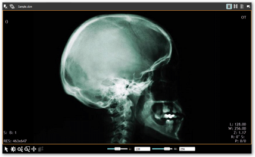

# Getting Started with Windows Forms DICOM

## Feature Summary

Essential DICOM is a 100% native .NET library that converts the standard image formats to the DICOM format (DCM). Essential DICOM is a solution for users who need to convert the ordinary image formats namely JPEG, BMP, PNG, EMF, TIFF, GIF to the DICOM format. It requires a DICOM Viewer or an equivalent viewer to view the converted DICOM image.

The following image shows the converted DICOM Image using Essential DICOM.

## Adding DICOM to an Application

This section illustrates the step-by-step procedure to create the following platform applications:

* Windows
* WPF

### Windows Application

1. Open Microsoft Visual Studio. Go to File menu and click New Project. In the New Project dialog box, select Windows Forms Application template, name the project and click OK. 

A windows application is created.

2. Open the main form of the application in the designer.
3. Add the Syncfusion.Core and Syncfusion.DICOM.Base reference to the project.

### WPF Application

1. Open Microsoft Visual Studio. Go to File menu and click New Project. In the New Project dialog box, select WPF Application template, name the project and click OK. 

   
   A new WPF application is created.

2. Open the main form of the application in the designer. 
3. Add the Syncfusion.Core and Syncfusion.DICOM.Base reference to the project.

