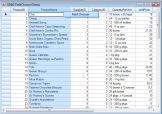

# Field Chooser for DataBound Grid 

This feature enables you to customize the view of the grid without modifying the database.The _FieldChooser_ class of _GridDataBoundGrid_ has been implemented to add or remove columns from a grid. 

Use Case Scenarios

This feature will be useful when you want to remove certain columns (which cannot be deleted) from the grid.

Methods

<table>
<tr>
<th>
TABLEMETHODS </th><th>
DESCRIPTION </th><th>
PARAMETERS </th><th>
TYPE </th><th>
RETURN TYPE </th><th>
REFERENCE LINKS </th></tr>
<tr>
<td>
WireGrid </td><td>
Used to wire tde {{ '_FieldChooser._' | markdownify }}</td><td>
Overloads:  ( Arg1) </td><td>
In GridWindowsForm </td><td>
Example: GridDataboundGrid1.WireGrid(GridDataboundGrid). </td><td>
NA</td></tr>
<tr>
<td>
UnWireGrid </td><td>
Used to unwire tde FieldChooser.</td><td>
NA</td><td>
In GridWindowsForm </td><td>
Example: GridDataboundGrid1.Unwired(). </td><td>
NA</td></tr>
</table>

## Sample Link

You can find a sample for this feature in the following location: 

_..\..\AppData\Local\Syncfusion\EssentialStudio\9.4.0.49\Windows\Grid.Windows\Samples\2.0\Data Bound\GDBG FieldChooser Demo_

Adding Field Chooser for Grid Data Bound Grid

1. To add field chooser, pass data bound grid as the parameter__of the _WireGrid_ method.

   The following code illustrates this:

			  GridDataBoundFieldChooser fChooser = new GridDataBoundFieldChooser();

			            fChooser.WireGrid(this.GridDataBoundGrid1);

			Dim fchooser As GridDataBoundFieldChooser = New GridDataBoundFieldChooser()

			            fchooser.WireGrid(Me.GridDataBoundGrid1)

2. When the code runs, the entire grid will open.
3. Right click on a column header and select the Field Chooser menu item to view _Field Chooser_ dialog.

    

4. This dialog will list all the column names with check boxes adjacent to them.

    

5. Select the checkboxes of the columns you want to be displayed in the grid.
6. The grid will have only the columns which are selected in the _Field Chooser_ dialog.

    

   {:.prettyprint}
