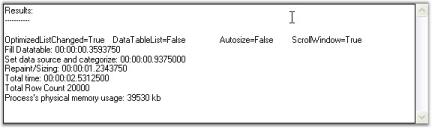

# Performance of DataBound Grid 

Essential DataBound Grid can handle large amount of data without a performance hit.

 

For more details, refer to the sample: _<Install Location>\Syncfusion\EssentialStudio\[Version Number]\Windows\Grid.Windows\Samples\2.0\Data Bound\Grid Performance Demo_

## Example

The Grid can be loaded by specifying the number of records and using the following options, Use OptimizedListChangeEvent, Use ResizeToFit on ColWidths and Use DataTableList.

In the Initialize Table group box,

* Use OptimizedListChangeEvent - Selecting this option ensures that the grid data is updated using IBindingList.ListChanged instead of CurrencyManager to change events. 
* Use ResizeToFit on ColWidths - Selecting this option ensures column width is resized to fit the cell content after the data is loaded. 
* Use DataTableList - Selecting this option ensures that the Syncfusion.Collections.DataTableWrapperList is used as the data source instead of data table. DataTableWrapperList is an IBindingList collection that wraps a data table and provides optimized access to the rows of data table in turn improving the performance when inserting records into an existing table holding many records.

In the Manipulate Grid group box

* Repeat Count and Batch Size can be specified in order to check the performance in batch updates. 
* Selecting Use ScrollWindow check box invalidates only the inserted or removed rows instead of invalidating the whole Grid.
* Insert Records, Remove Records and Change Records buttons let you check the performance when inserting, removing, or changing records in the underlying data table. Once the data is loaded after the batch update, you will be able to see the performance and memory usage in a text box, as shown below.

 

