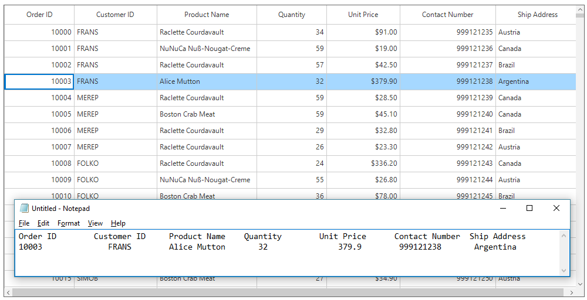
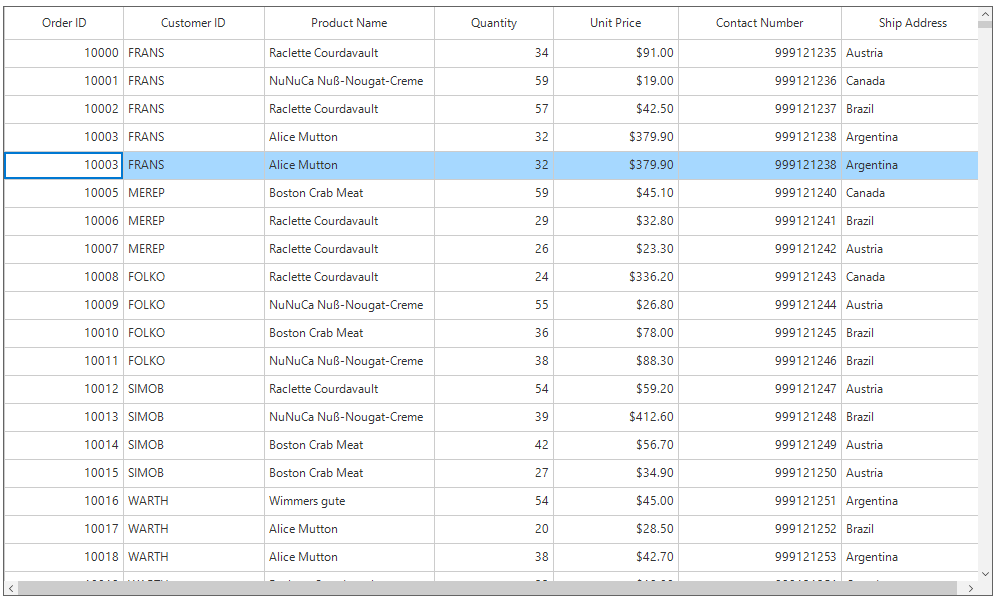
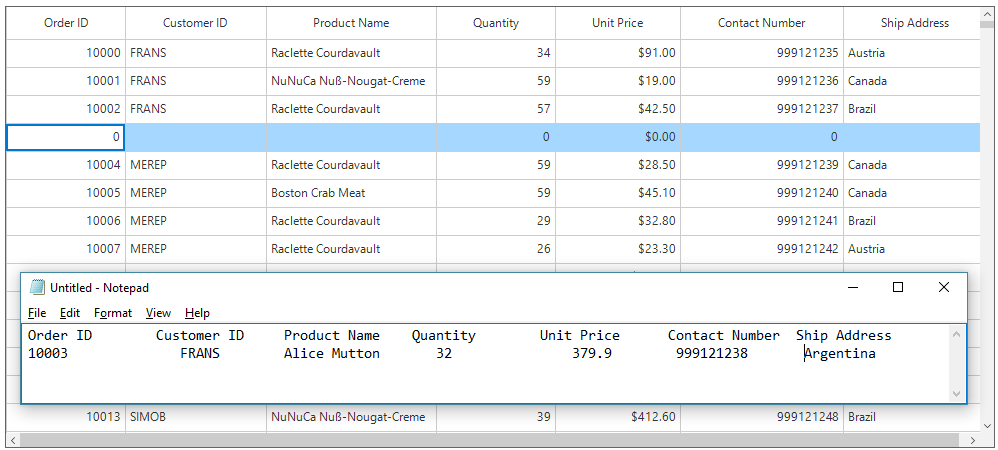
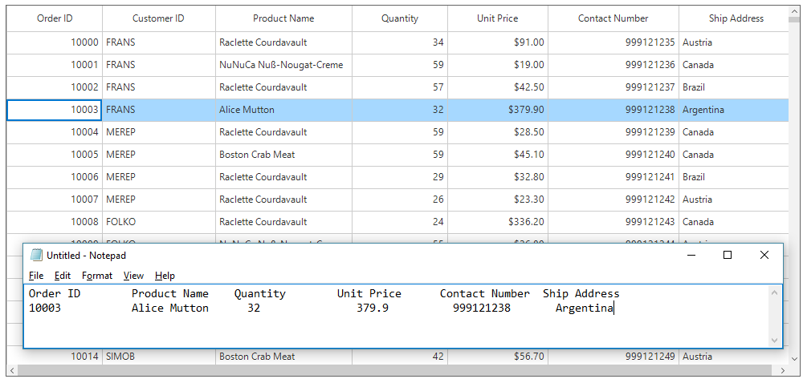
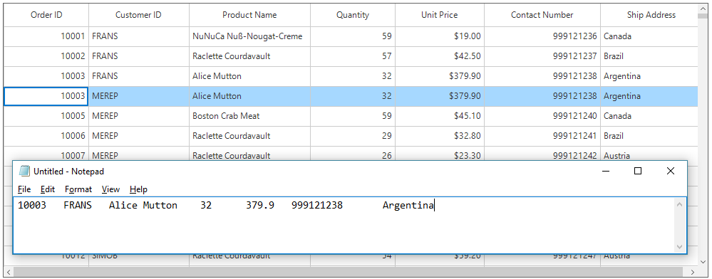
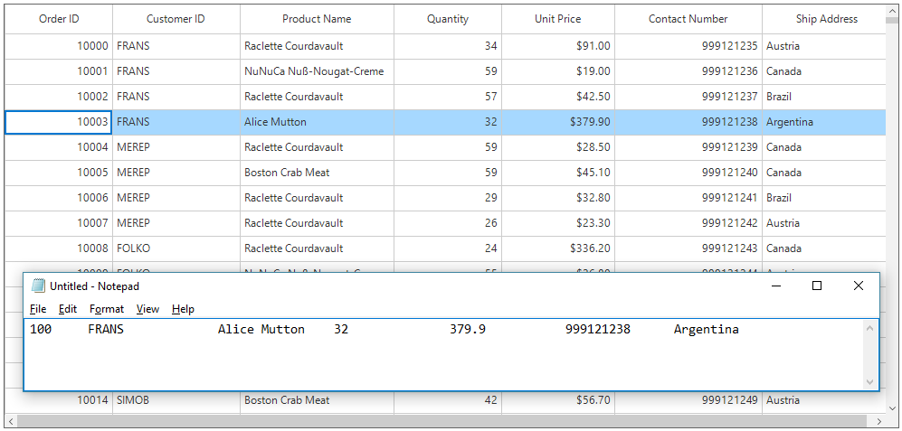

# Clipboard Operations in Windows Forms DataGrid

SfDataGrid provide support for the clipboard operations such as cut, copy and paste the data within control and between other applications such as Notepad, Excel. Clipboard operations copy and paste is enabled by default. The Selected records from SfDataGrid can be copied by pressing <kbd>Ctrl+C</kbd> and the content from Clipboard can be pasted to SfDataGrid by pressing <kbd>Ctrl+V</kbd>.

N> Clipboard operations are not supported for the summary rows, add new row and unbound rows.

## Copy

Copy operation works based on [CopyOption](https://help.syncfusion.com/cr/windowsforms/Syncfusion.WinForms.DataGrid.SfDataGrid.html#Syncfusion_WinForms_DataGrid_SfDataGrid_CopyOption) property.

CopyOption provides the following options,

[None](https://help.syncfusion.com/cr/windowsforms/Syncfusion.WinForms.DataGrid.SfDataGrid.html#Syncfusion_WinForms_DataGrid_SfDataGrid_CopyOption) – Disables copy in SfDataGrid.

[CopyData](https://help.syncfusion.com/cr/windowsforms/Syncfusion.WinForms.DataGrid.SfDataGrid.html#Syncfusion_WinForms_DataGrid_SfDataGrid_CopyOption) – Enables copy in SfDataGrid.

[CutData](https://help.syncfusion.com/cr/windowsforms/Syncfusion.WinForms.DataGrid.SfDataGrid.html#Syncfusion_WinForms_DataGrid_SfDataGrid_CopyOption) – Enables cut in SfDataGrid.

[IncludeHeaders](https://help.syncfusion.com/cr/windowsforms/Syncfusion.WinForms.DataGrid.SfDataGrid.html#Syncfusion_WinForms_DataGrid_SfDataGrid_CopyOption) – Column header also copied along with data.

[IncludeFormat](https://help.syncfusion.com/cr/windowsforms/Syncfusion.WinForms.DataGrid.SfDataGrid.html#Syncfusion_WinForms_DataGrid_SfDataGrid_CopyOption) – Copies the display text with format instead of actual value.

[IncludeHiddenColumn](https://help.syncfusion.com/cr/windowsforms/Syncfusion.WinForms.DataGrid.SfDataGrid.html#Syncfusion_WinForms_DataGrid_SfDataGrid_CopyOption) – Hidden column also copied to clipboard.

`IncludeHeaders`, `IncludeFormat`, `IncludeHiddenColumn` options should be used along with `CopyData` option.



this.sfDataGrid1.CopyOption = CopyOptions.CopyData | CopyOptions.IncludeHeaders;


Me.sfDataGrid1.CopyOption = CopyOptions.CopyData Or CopyOptions.IncludeHeaders



## Paste

Paste operation works based on [PasteOption](https://help.syncfusion.com/cr/windowsforms/Syncfusion.WinForms.DataGrid.SfDataGrid.html#Syncfusion_WinForms_DataGrid_SfDataGrid_PasteOption) property.
PasteOption provides the following options,

[None](https://help.syncfusion.com/cr/windowsforms/Syncfusion.WinForms.DataGrid.SfDataGrid.html#Syncfusion_WinForms_DataGrid_SfDataGrid_PasteOption) – Disables paste in SfDataGrid.

[PasteData](https://help.syncfusion.com/cr/windowsforms/Syncfusion.WinForms.DataGrid.SfDataGrid.html#Syncfusion_WinForms_DataGrid_SfDataGrid_PasteOption) – Enables paste in SfDataGrid and when an incompatible value is pasted into a record, the pasting operation is skipped for that particular record.

[ExcludeFirstLine](https://help.syncfusion.com/cr/windowsforms/Syncfusion.WinForms.DataGrid.SfDataGrid.html#Syncfusion_WinForms_DataGrid_SfDataGrid_PasteOption) – This can be used when pasting data copied with IncludeHeader copy option.

[IncludeHiddenColumn](https://help.syncfusion.com/cr/windowsforms/Syncfusion.WinForms.DataGrid.SfDataGrid.html#Syncfusion_WinForms_DataGrid_SfDataGrid_PasteOption) – Paste the values in hidden columns also.

`ExcludeFirstLine`, `IncludeHiddenColumn` options should be used along with `PasteData` option.



this.sfDataGrid1.PasteOption = PasteOptions.PasteData | PasteOptions.ExcludeFirstLine;


Me.sfDataGrid1.PasteOption = PasteOptions.PasteData Or PasteOptions.ExcludeFirstLine



## Cut

Cut operation works based on [CopyOption](https://help.syncfusion.com/cr/windowsforms/Syncfusion.WinForms.DataGrid.SfDataGrid.html#Syncfusion_WinForms_DataGrid_SfDataGrid_CopyOption) property.

`CopyOption` provides the following options,

[None](https://help.syncfusion.com/cr/windowsforms/Syncfusion.WinForms.DataGrid.SfDataGrid.html#Syncfusion_WinForms_DataGrid_SfDataGrid_CopyOption) – Disables cut in SfDataGrid.

[CutData](https://help.syncfusion.com/cr/windowsforms/Syncfusion.WinForms.DataGrid.SfDataGrid.html#Syncfusion_WinForms_DataGrid_SfDataGrid_CopyOption) – Enabled cut in SfDataGrid.

[IncludeHeaders](https://help.syncfusion.com/cr/windowsforms/Syncfusion.WinForms.DataGrid.SfDataGrid.html#Syncfusion_WinForms_DataGrid_SfDataGrid_CopyOption) – Column header also copied along with data.

[IncludeFormat](https://help.syncfusion.com/cr/windowsforms/Syncfusion.WinForms.DataGrid.SfDataGrid.html#Syncfusion_WinForms_DataGrid_SfDataGrid_CopyOption) – Cut the display text with format instead of actual value.

[IncludeHiddenColumn](https://help.syncfusion.com/cr/windowsforms/Syncfusion.WinForms.DataGrid.SfDataGrid.html#Syncfusion_WinForms_DataGrid_SfDataGrid_CopyOption) – Hidden column also cut to clipboard.

`IncludeHeaders`, `IncludeFormat`, `IncludeHiddenColumn` options should be used along with `CutData` option.



this.sfDataGrid1.CopyOption = CopyOptions.CutData | CopyOptions.IncludeHeaders;


Me.sfDataGrid1.CopyOption = CopyOptions.CutData Or CopyOptions.IncludeHeaders



## Cancel Copy Operation

### Rows

Copy operation for any particular row can be canceled by handling the [CopyContent](https://help.syncfusion.com/cr/windowsforms/Syncfusion.WinForms.DataGrid.SfDataGrid.html) event.



this.sfDataGrid1.CopyContent += SfDataGrid1_CopyContent;

void SfDataGrid1_CopyContent(object sender, CutCopyPasteEventArgs e)
{
    if (((e.OriginalSender as SfDataGrid).SelectedItem as OrderInfo).OrderID == 10004)
        e.Cancel = true;

}


AddHandler sfDataGrid1.CopyContent, AddressOf SfDataGrid1_CopyContent

Private Sub SfDataGrid1_CopyContent(ByVal sender As Object, ByVal e As CutCopyPasteEventArgs)
	If (TryCast((TryCast(e.OriginalSender, SfDataGrid)).SelectedItem, OrderInfo)).OrderID = 10004 Then
		e.Cancel = True
	End If

End Sub



### Columns

Copy operation for any particular column can be canceled by handling the [CopyCellContent](https://help.syncfusion.com/cr/windowsforms/Syncfusion.WinForms.DataGrid.SfDataGrid.html) event.



this.sfDataGrid1.CopyCellContent += SfDataGrid1_CopyCellContent;
void SfDataGrid1_CopyCellContent(object sender, CellCutCopyPasteEventArgs e)
{
    if (e.Column.MappingName == "CustomerID")
        e.Cancel = true;
}


AddHandler sfDataGrid1.CopyCellContent, AddressOf SfDataGrid1_CopyCellContent
Private Sub SfDataGrid1_CopyCellContent(ByVal sender As Object, ByVal e As CellCutCopyPasteEventArgs)
	If e.Column.MappingName = "CustomerID" Then
		e.Cancel = True
	End If
End Sub



## Cancel Paste Operation

### Rows

Paste operation for any particular row can be canceled by handling the [PasteContent](https://help.syncfusion.com/cr/windowsforms/Syncfusion.WinForms.DataGrid.SfDataGrid.html) event.



this.sfDataGrid1.PasteContent += SfDataGrid1_PasteContent;

void SfDataGrid1_PasteContent(object sender, CutCopyPasteEventArgs e)
{
    if (((e.OriginalSender as SfDataGrid).SelectedItem as OrderInfo).OrderID == 10004)
        e.Cancel = true;
}


AddHandler sfDataGrid1.PasteContent, AddressOf SfDataGrid1_PasteContent

Private Sub SfDataGrid1_PasteContent(ByVal sender As Object, ByVal e As CutCopyPasteEventArgs)
	If (TryCast((TryCast(e.OriginalSender, SfDataGrid)).SelectedItem, OrderInfo)).OrderID = 10004 Then
		e.Cancel = True
	End If
End Sub



### Columns

Paste operation for any particular column can be canceled by handling the [PasteCellContent](https://help.syncfusion.com/cr/windowsforms/Syncfusion.WinForms.DataGrid.SfDataGrid.html) event.



this.sfDataGrid1.PasteCellContent += SfDataGrid1_PasteCellContent;

void SfDataGrid1_PasteCellContent(object sender, CellCutCopyPasteEventArgs e)
{
    if (e.Column.MappingName == "CustomerID")
        e.Cancel = true;
}


AddHandler sfDataGrid1.PasteCellContent, AddressOf SfDataGrid1_PasteCellContent

Private Sub SfDataGrid1_PasteCellContent(ByVal sender As Object, ByVal e As CellCutCopyPasteEventArgs)
	If e.Column.MappingName = "CustomerID" Then
		e.Cancel = True
	End If
End Sub



## Change the Clipboard Text

### Copy

SfDataGrid allows to change the clipboard value while copying the values to the clipboard by handling the [CopyCellContent](https://help.syncfusion.com/cr/windowsforms/Syncfusion.WinForms.DataGrid.SfDataGrid.html) event.
The below code example changes the clipboard value as `100` instead of cell value `10003` in SfDataGrid while copying the record.



void SfDataGrid1_CopyCellContent(object sender, CellCutCopyPasteEventArgs e)
{
    if (e.Column.MappingName == "OrderID" && ((e.OriginalSender as SfDataGrid).SelectedItem as OrderInfo).OrderID == 10003)
    {
        e.ClipboardValue = "100";
    }
}


Private Sub SfDataGrid1_CopyCellContent(ByVal sender As Object, ByVal e As CellCutCopyPasteEventArgs)
	If e.Column.MappingName = "OrderID" AndAlso (TryCast((TryCast(e.OriginalSender, SfDataGrid)).SelectedItem, OrderInfo)).OrderID = 10003 Then
		e.ClipboardValue = "100"
	End If
End Sub



### Paste

SfDataGrid allows to change the clipboard value while pasting the values from the clipboard by handling the [PasteCellContent](https://help.syncfusion.com/cr/windowsforms/Syncfusion.WinForms.DataGrid.SfDataGrid.html) event.

The below code example changes the clipboard value as `100` instead of cell value `10003` in SfDataGrid while pasting the record to the SfDataGrid.



void SfDataGrid_PasteCellContent(object sender, CellCutCopyPasteEventArgs e)
{
    if (e.Column.MappingName == "OrderID" && ((e.OriginalSender as SfDataGrid).SelectedItem as OrderInfo).OrderID == 10003)
    {
        e.ClipboardValue = "100";
    }
}


Private Sub SfDataGrid_PasteCellContent(ByVal sender As Object, ByVal e As CellCutCopyPasteEventArgs)
	If e.Column.MappingName = "OrderID" AndAlso (TryCast((TryCast(e.OriginalSender, SfDataGrid)).SelectedItem, OrderInfo)).OrderID = 10003 Then
		e.ClipboardValue = "100"
	End If
End Sub



## Handling Programmatically

### Copy Programmatically	 

Copy the selected records in SfDataGrid by using [Copy](https://help.syncfusion.com/cr/windowsforms/Syncfusion.WinForms.DataGrid.Interactivity.IDataGridClipboardController.html#Syncfusion_WinForms_DataGrid_Interactivity_IDataGridClipboardController_Copy) method in [ClipboardController](https://help.syncfusion.com/cr/windowsforms/Syncfusion.WinForms.DataGrid.SfDataGrid.html#Syncfusion_WinForms_DataGrid_SfDataGrid_ClipboardController) of SfDataGrid.


this.sfDataGrid1.ClipboardController.Copy();


Me.sfDataGrid1.ClipboardController.Copy()



Copy a record by selecting the record using [MoveToCurrentCell](https://help.syncfusion.com/cr/windowsforms/Syncfusion.WinForms.DataGrid.SfDataGrid.html#Syncfusion_WinForms_DataGrid_SfDataGrid_MoveToCurrentCell_Syncfusion_WinForms_GridCommon_ScrollAxis_RowColumnIndex_) method and `Copy` method in [ClipboardController](https://help.syncfusion.com/cr/windowsforms/Syncfusion.WinForms.DataGrid.SfDataGrid.html#Syncfusion_WinForms_DataGrid_SfDataGrid_ClipboardController) of SfDataGrid.



RowColumnIndex rowColumnIndex = new RowColumnIndex();
rowColumnIndex.RowIndex = 2;
rowColumnIndex.ColumnIndex = 2;
this.sfDataGrid1.MoveToCurrentCell(rowColumnIndex);
this.sfDataGrid1.ClipboardController.Copy();


Dim rowColumnIndex As New RowColumnIndex()
rowColumnIndex.RowIndex = 2
rowColumnIndex.ColumnIndex = 2
Me.sfDataGrid1.MoveToCurrentCell(rowColumnIndex)
Me.sfDataGrid1.ClipboardController.Copy()



Copy the multiple records by selecting group of records using [SelectRows](https://help.syncfusion.com/cr/windowsforms/Syncfusion.WinForms.DataGrid.SfDataGrid.html#Syncfusion_WinForms_DataGrid_SfDataGrid_SelectRows_System_Int32_System_Int32_) method and `Copy`method in [ClipboardController](https://help.syncfusion.com/cr/windowsforms/Syncfusion.WinForms.DataGrid.SfDataGrid.html#Syncfusion_WinForms_DataGrid_SfDataGrid_ClipboardController) of SfDataGrid.



this.sfDataGrid1.SelectRows(1, 3);
this.sfDataGrid1.ClipboardController.Copy();


Me.sfDataGrid1.SelectRows(1, 3)
Me.sfDataGrid1.ClipboardController.Copy()



### Copy Rows without Selecting

The records can be copied without selection by using [CopyRowsToClipboard](https://help.syncfusion.com/cr/windowsforms/Syncfusion.WinForms.DataGrid.Interactivity.IDataGridClipboardController.html#Syncfusion_WinForms_DataGrid_Interactivity_IDataGridClipboardController_CopyRowsToClipboard_System_Int32_System_Int32_) method in [ClipboardController](https://help.syncfusion.com/cr/windowsforms/Syncfusion.WinForms.DataGrid.SfDataGrid.html#Syncfusion_WinForms_DataGrid_SfDataGrid_ClipboardController) of SfDataGrid.



this.sfDataGrid1.ClipboardController.CopyRowsToClipboard(3,5);


Me.sfDataGrid1.ClipboardController.CopyRowsToClipboard(3,5)



### Cut Programmatically

Cut the selected records in SfDataGrid by using [Cut](https://help.syncfusion.com/cr/windowsforms/Syncfusion.WinForms.DataGrid.Interactivity.IDataGridClipboardController.html#Syncfusion_WinForms_DataGrid_Interactivity_IDataGridClipboardController_Cut) method in [ClipboardController](https://help.syncfusion.com/cr/windowsforms/Syncfusion.WinForms.DataGrid.SfDataGrid.html#Syncfusion_WinForms_DataGrid_SfDataGrid_ClipboardController) of SfDataGrid.



this.sfDataGrid1.ClipboardController.Cut();


Me.sfDataGrid1.ClipboardController.Cut()



Cut the entire record in SfDataGrid by selecting whole SfDataGrid using [SelectAll](https://help.syncfusion.com/cr/windowsforms/Syncfusion.WinForms.DataGrid.SfDataGrid.html#Syncfusion_WinForms_DataGrid_SfDataGrid_SelectAll) method and `Cut` method in [ClipboardController](https://help.syncfusion.com/cr/windowsforms/Syncfusion.WinForms.DataGrid.SfDataGrid.html#Syncfusion_WinForms_DataGrid_SfDataGrid_ClipboardController) of SfDataGrid.



this.sfDataGrid1.SelectAll();
this.sfDataGrid1.ClipboardController.Cut();


Me.sfDataGrid1.SelectAll()
Me.sfDataGrid1.ClipboardController.Cut()



### Paste Programmatically

Paste the clipboard value into SfDataGrid by using [Paste](https://help.syncfusion.com/cr/windowsforms/Syncfusion.WinForms.DataGrid.Interactivity.IDataGridClipboardController.html#Syncfusion_WinForms_DataGrid_Interactivity_IDataGridClipboardController_Paste) method in [ClipboardController](https://help.syncfusion.com/cr/windowsforms/Syncfusion.WinForms.DataGrid.SfDataGrid.html#Syncfusion_WinForms_DataGrid_SfDataGrid_ClipboardController) of SfDataGrid.



this.sfDataGrid1.ClipboardController.Paste();


Me.sfDataGrid1.ClipboardController.Paste()



Paste the clipboard value into selected record by selecting the record using [MoveToCurrentCell](https://help.syncfusion.com/cr/windowsforms/Syncfusion.WinForms.DataGrid.SfDataGrid.html#Syncfusion_WinForms_DataGrid_SfDataGrid_MoveToCurrentCell_Syncfusion_WinForms_GridCommon_ScrollAxis_RowColumnIndex_) method and `Paste` method in [ClipboardController](https://help.syncfusion.com/cr/windowsforms/Syncfusion.WinForms.DataGrid.SfDataGrid.html#Syncfusion_WinForms_DataGrid_SfDataGrid_ClipboardController) of SfDataGrid.



RowColumnIndex rowColumnIndex = new RowColumnIndex();
rowColumnIndex.RowIndex = 2;
rowColumnIndex.ColumnIndex = 2;
this.sfDataGrid1.MoveToCurrentCell(rowColumnIndex);
this.sfDataGrid1.ClipboardController.Paste();


Dim rowColumnIndex As New RowColumnIndex()
rowColumnIndex.RowIndex = 2
rowColumnIndex.ColumnIndex = 2
Me.sfDataGrid1.MoveToCurrentCell(rowColumnIndex)
Me.sfDataGrid1.ClipboardController.Paste()



## Customizing Copy Paste Behavior

The SfDataGrid performs clipboard operations in [DataGridClipboardController](https://help.syncfusion.com/cr/windowsforms/Syncfusion.WinForms.DataGrid.Interactivity.DataGridClipboardController.html) class. The default copy paste behaviors can be customized by overriding `DataGridClipboardController` class and setting it to [ClipboardController](https://help.syncfusion.com/cr/windowsforms/Syncfusion.WinForms.DataGrid.SfDataGrid.html#Syncfusion_WinForms_DataGrid_SfDataGrid_ClipboardController).



public class CustomClipboardController : DataGridClipboardController
{
    public CustomClipboardController(SfDataGrid dataGrid) : base(dataGrid)
    {
    }
}


Public Class CustomClipboardController
	Inherits DataGridClipboardController
	Public Sub New(ByVal dataGrid As SfDataGrid)
		MyBase.New(dataGrid)
	End Sub
End Class





this.sfDataGrid.ClipboardController = new CustomClipboardController(this.sfDataGrid);


Me.sfDataGrid.ClipboardController = New CustomClipboardController(Me.sfDataGrid)



### Paste a Record into Many Rows

By default, one row can be copied and pasted into another row when selection is enabled in the SfDataGrid. The following code shows how to copy one row and paste it into all the selected rows by overriding the [PasteToRow](https://help.syncfusion.com/cr/windowsforms/Syncfusion.WinForms.DataGrid.Interactivity.DataGridClipboardController.html#Syncfusion_WinForms_DataGrid_Interactivity_DataGridClipboardController_PasteToRow_System_Object_System_Object_) method in [DataGridClipboardController](https://help.syncfusion.com/cr/windowsforms/Syncfusion.WinForms.DataGrid.Interactivity.DataGridClipboardController.html) class.



public class CustomClipboardController : DataGridClipboardController
{
    SfDataGrid dataGrid;
    public CustomClipboardController(SfDataGrid dataGrid) : base(dataGrid)
    {
        this.dataGrid = dataGrid;
    }
    protected override void PasteToRow(object clipBoardContent, object selectedRecords)
    {
        var text = Clipboard.GetText();
        string[] clipBoardText = Regex.Split(text, @"\r\n");

        //Get the clipBoardText and check if the clipBoardText is more than one row

        //means call the base.
        if (clipBoardText.Count() > 1)
        {
            base.PasteToRow(clipBoardContent, selectedRecords);
            return;
        }
        var selectedRecord = this.dataGrid.SelectedItems;
        for (int i = 0; i < selectedRecord.Count; i++)
        {
            //Get the selected records for paste the copied row.
            selectedRecords = selectedRecord[i];

            //Call the PasteToRow method with clipBoardContent and selectedRecords
            base.PasteToRow(clipBoardContent, selectedRecords);
        }
    }
}


Public Class CustomClipboardController
	Inherits DataGridClipboardController
	Private dataGrid As SfDataGrid
	Public Sub New(ByVal dataGrid As SfDataGrid)
		MyBase.New(dataGrid)
		Me.dataGrid = dataGrid
	End Sub
	Protected Overrides Sub PasteToRow(ByVal clipBoardContent As Object, ByVal selectedRecords As Object)
		Dim text = Clipboard.GetText()
		Dim clipBoardText() As String = Regex.Split(text, "\r\n")

		'Get the clipBoardText and check if the clipBoardText is more than one row

		'means call the base.
		If clipBoardText.Count() > 1 Then
			MyBase.PasteToRow(clipBoardContent, selectedRecords)
			Return
		End If
		Dim selectedRecord = Me.dataGrid.SelectedItems
		For i As Integer = 0 To selectedRecord.Count - 1
			'Get the selected records for paste the copied row.
			selectedRecords = selectedRecord(i)

			'Call the PasteToRow method with clipBoardContent and selectedRecords
			MyBase.PasteToRow(clipBoardContent, selectedRecords)
		Next i
	End Sub
End Class



### Create New Records while Pasting

By default, when pasting the clipboard values to the SfDataGrid, it changes the values of the already existing records. The following code example shows how to add the copied records as new rows to the SfDataGrid by overriding the [PasteToRows](https://help.syncfusion.com/cr/windowsforms/Syncfusion.WinForms.DataGrid.Interactivity.DataGridClipboardController.html#Syncfusion_WinForms_DataGrid_Interactivity_DataGridClipboardController_PasteToRows_System_Object_) method in [DataGridClipboardController](https://help.syncfusion.com/cr/windowsforms/Syncfusion.WinForms.DataGrid.Interactivity.DataGridClipboardController.html) class.



public class CustomClipboardController : DataGridClipboardController
{
    SfDataGrid dataGrid;
    public CustomClipboardController(SfDataGrid dataGrid) : base(dataGrid)
    {
        this.dataGrid = dataGrid;
    }
    protected override void PasteToRows(object clipboardRows)
    {
        var copiedRecord = (string[])clipboardRows;
        int copiedRecordsCount = copiedRecord.Count();
        //Based on the clipboard count added the new record to be pasted.
        if (copiedRecordsCount > 0)
        {
            for (int i = 0; i < copiedRecordsCount; i++)
            {
                // Creates new record.
                this.dataGrid.View.AddNew();
                for (int j = 0; j < this.dataGrid.Columns.Count; j++)
                {
                    var record = copiedRecord[i];
                    string[] splitRecord = Regex.Split(record, @"\t");
                    //Adds the new record by using the PasteToCell method, by passing       the created data, particular column, and clipboard value.
                    this.PasteToCell(this.dataGrid.View.CurrentAddItem, this.dataGrid.Columns[j], splitRecord[j]);
                }
                // Commits the pasted record.
                this.dataGrid.View.CommitNew();
            }
        }
    }
}


Public Class CustomClipboardController
	Inherits DataGridClipboardController
	Private dataGrid As SfDataGrid
	Public Sub New(ByVal dataGrid As SfDataGrid)
		MyBase.New(dataGrid)
		Me.dataGrid = dataGrid
	End Sub
	Protected Overrides Sub PasteToRows(ByVal clipboardRows As Object)
		Dim copiedRecord = CType(clipboardRows, String())
		Dim copiedRecordsCount As Integer = copiedRecord.Count()
		'Based on the clipboard count added the new record to be pasted.
		If copiedRecordsCount > 0 Then
			For i As Integer = 0 To copiedRecordsCount - 1
				' Creates new record.
				Me.dataGrid.View.AddNew()
				For j As Integer = 0 To Me.dataGrid.Columns.Count - 1
					Dim record = copiedRecord(i)
					Dim splitRecord() As String = Regex.Split(record, "\t")
					'Adds the new record by using the PasteToCell method, by passing       the created data, particular column, and clipboard value.
					Me.PasteToCell(Me.dataGrid.View.CurrentAddItem, Me.dataGrid.Columns(j), splitRecord(j))
				Next j
				' Commits the pasted record.
				Me.dataGrid.View.CommitNew()
			Next i
		End If
	End Sub
End Class



### Paste the Copied Data by Custom Column Order

By default, the SfDataGrid pastes the data only from the first column. The copied data can be pasted anywhere in the SfDataGrid by deriving a new class from [DataGridClipboardController](https://help.syncfusion.com/cr/windowsforms/Syncfusion.WinForms.DataGrid.Interactivity.DataGridClipboardController.html) and overriding the [PasteToRow](https://help.syncfusion.com/cr/windowsforms/Syncfusion.WinForms.DataGrid.Interactivity.DataGridClipboardController.html#Syncfusion_WinForms_DataGrid_Interactivity_DataGridClipboardController_PasteToRow_System_Object_System_Object_) virtual method.



public class CustomClipboardController : DataGridClipboardController
{
    SfDataGrid dataGrid;
    public CustomClipboardController(SfDataGrid dataGrid) : base(dataGrid)
    {
        this.dataGrid = dataGrid;
    }
    protected override void PasteToRow(object clipboardContent, object selectedRecords)
    {
        //Splits the row into number of cells by using \t.
        clipboardContent = Regex.Split(clipboardContent.ToString(), @"\t");
        var copyValue = (string[])clipboardContent;
        //For Row selection
        int columnIndex = 0;
        //Gets the current cell column index.
        var index = this.dataGrid.CurrentCell.ColumnIndex;
        foreach (var column in dataGrid.Columns)
        {
            if (index >= dataGrid.Columns.Count)
                return;
            if (copyValue.Count() <= this.dataGrid.Columns.IndexOf(column))
                break;
            // Calls the PasteToCell method and passes the copied data and pastes the column index.
            PasteToCell(selectedRecords, this.dataGrid.Columns[index], copyValue[columnIndex]);
            index++;
            columnIndex++;
        }
    }
}


Public Class CustomClipboardController
	Inherits DataGridClipboardController
	Private dataGrid As SfDataGrid
	Public Sub New(ByVal dataGrid As SfDataGrid)
		MyBase.New(dataGrid)
		Me.dataGrid = dataGrid
	End Sub
	Protected Overrides Sub PasteToRow(ByVal clipboardContent As Object, ByVal selectedRecords As Object)
		'Splits the row into number of cells by using \t.
		clipboardContent = Regex.Split(clipboardContent.ToString(), "\t")
		Dim copyValue = CType(clipboardContent, String())
		'For Row selection
		Dim columnIndex As Integer = 0
		'Gets the current cell column index.
		Dim index = Me.dataGrid.CurrentCell.ColumnIndex
		For Each column In dataGrid.Columns
			If index >= dataGrid.Columns.Count Then
				Return
			End If
			If copyValue.Count() <= Me.dataGrid.Columns.IndexOf(column) Then
				Exit For
			End If
			' Calls the PasteToCell method and passes the copied data and pastes the column index.
			PasteToCell(selectedRecords, Me.dataGrid.Columns(index), copyValue(columnIndex))
			index += 1
			columnIndex += 1
		Next column
	End Sub
End Class



### Paste the copied row in AddNewRow

By default, the copied row cannot be pasted in AddNewRow. The following code shows how to paste the copied row in AddNewRow by overriding the [PasteTextToRow](https://help.syncfusion.com/cr/windowsforms/Syncfusion.WinForms.DataGrid.Interactivity.DataGridClipboardController.html#Syncfusion_WinForms_DataGrid_Interactivity_DataGridClipboardController_PasteTextToRow) method in [DataGridClipboardController](https://help.syncfusion.com/cr/windowsforms/Syncfusion.WinForms.DataGrid.Interactivity.DataGridClipboardController.html) class.



public partial class Form1 : Form
 {
     public Form1()
     {
         InitializeComponent();
         this.sfDataGrid.AddNewRowPosition = RowPosition.Top;
         this.sfDataGrid.ClipboardController = new CustomClipBoardController(this.sfDataGrid);
     }
 }

protected override void PasteTextToRow()
{
    bool isAddNewRow = this.DataGrid.IsAddNewRowIndex(this.DataGrid.CurrentCell.RowIndex);

    if (isAddNewRow)
    {
        IDataObject dataObject = null;
        dataObject = Clipboard.GetDataObject();
        var clipBoardContent = dataObject.GetData(DataFormats.UnicodeText) as string;
        string[] records = Regex.Split(clipBoardContent.ToString(), @"\r\n");

        if (!this.DataGrid.View.IsAddingNew)
            return;

        string[] record = Regex.Split(records[0], @"\t");
        var provider = this.DataGrid.View.GetPropertyAccessProvider();
        var rowData = (this.DataGrid.View as CollectionViewAdv).CurrentAddItem;

        //Paste the copied row in each cell.
        foreach (var column in this.DataGrid.Columns)
            CommitValue(rowData, column, provider, record[this.DataGrid.Columns.IndexOf(column)]);

        this.DataGrid.TableControl.Invalidate(this.DataGrid.TableControl.GetRowRectangle(this.DataGrid.GetAddNewRowIndex(), false));
    }
    else
        base.PasteTextToRow();
}


Partial Public Class Form1
	Inherits Form
	Public Sub New()
		InitializeComponent()
		Me.sfDataGrid.AddNewRowPosition = RowPosition.Top
		Me.sfDataGrid.ClipboardController = New CustomClipBoardController(Me.sfDataGrid)
	End Sub
End Class

Public Class CustomClipBoardController
	Inherits DataGridClipboardController
	Private DataGrid As SfDataGrid
	Public Sub New(ByVal datagrid As SfDataGrid)
		MyBase.New(datagrid)
		Me.DataGrid = datagrid
	End Sub

	Protected Overrides Sub PasteTextToRow()
		Dim isAddNewRow As Boolean = Me.DataGrid.IsAddNewRowIndex(Me.DataGrid.CurrentCell.RowIndex)

		If isAddNewRow Then
			Dim dataObject As IDataObject = Nothing
			dataObject = Clipboard.GetDataObject()
			Dim clipBoardContent = TryCast(dataObject.GetData(DataFormats.UnicodeText), String)
			Dim records() As String = Regex.Split(clipBoardContent.ToString(), "\r\n")

			If Not Me.DataGrid.View.IsAddingNew Then
				Return
			End If

			Dim record() As String = Regex.Split(records(0), "\t")
			Dim provider = Me.DataGrid.View.GetPropertyAccessProvider()
			Dim rowData = (TryCast(Me.DataGrid.View, CollectionViewAdv)).CurrentAddItem

			'Paste the copied row in each cell.
			For Each column In Me.DataGrid.Columns
				CommitValue(rowData, column, provider, record(Me.DataGrid.Columns.IndexOf(column)))
			Next column

			Me.DataGrid.TableControl.Invalidate(Me.DataGrid.TableControl.GetRowRectangle(Me.DataGrid.GetAddNewRowIndex(), False))
		Else
			MyBase.PasteTextToRow()
		End If
	End Sub
End Class



Download sample from below location,
[Sample location](http://www.syncfusion.com/downloads/support/directtrac/general/ze/Sample1502467420)

N> The copied row can be pasted only after initiating the AddNewRow by editing.

## See also

[How to append the new text in clipboard which is not available in DataGrid(SfDataGrid)](https://www.syncfusion.com/kb/11243)
