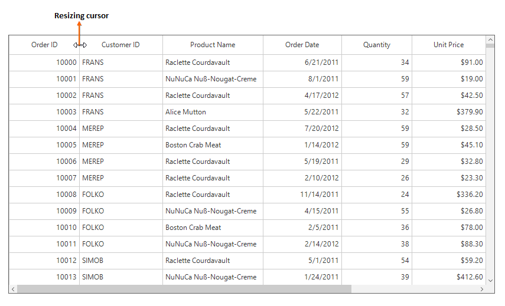
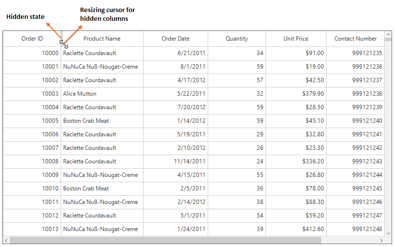
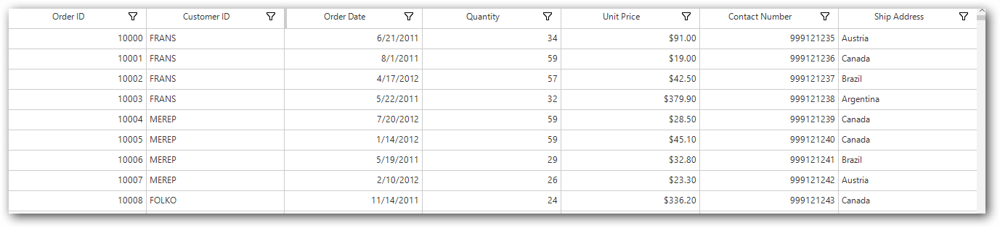
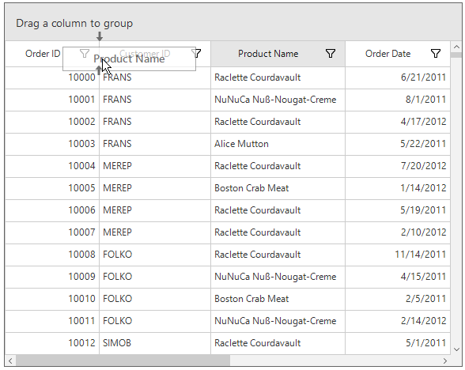
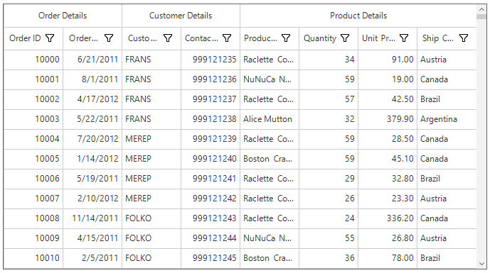
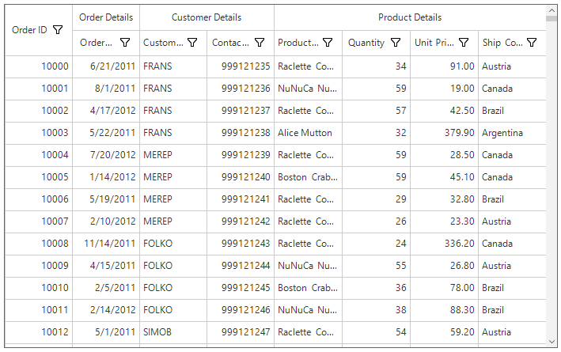
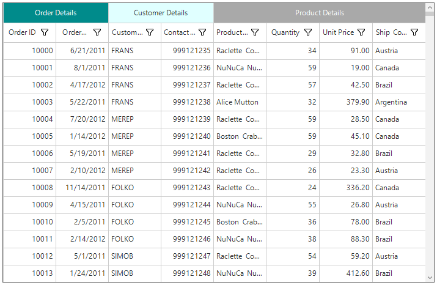
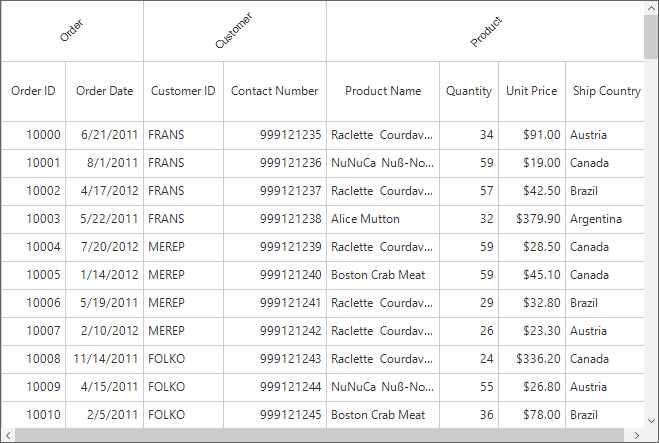
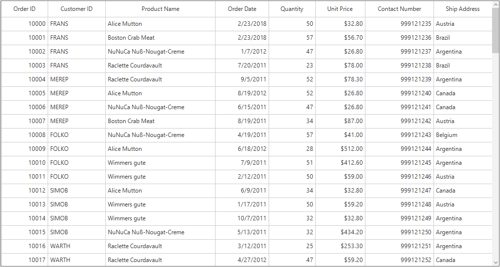
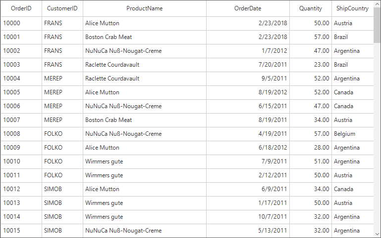

# Columns in WinForms DataGrid (SfDataGrid)
SfDataGrid allows to add or remove columns using [SfDataGrid.Columns](https://help.syncfusion.com/cr/windowsforms/Syncfusion.WinForms.DataGrid.SfDataGrid.html#Syncfusion_WinForms_DataGrid_SfDataGrid_Columns) property. The columns to be added can be chosen from built-in column types or own column can be created and add to the `SfDataGrid.Columns`.
Below are the built-in column types supported in SfDataGrid. Each column has its own properties to handle different types of data.
<table>
<tr>
<td>
{{'**Column Type**'| markdownify }}
</td>
<td>
{{'        **Description**'| markdownify }}
</td>
</tr>
<tr>
<td>
{{'[GridTextColumn](https://help.syncfusion.com/cr/windowsforms/Syncfusion.WinForms.DataGrid.GridTextColumn.html)'| markdownify }}        
</td>
<td>
Use to display the string data
</td>
</tr>
<tr>
<td>
{{'[GridNumericColumn](https://help.syncfusion.com/cr/windowsforms/Syncfusion.WinForms.DataGrid.GridNumericColumn.html)'| markdownify }}
</td>
<td>
Use to display the numeric data
</td>
</tr>
<tr>
<td>
{{'[GridDateTimeColumn](https://help.syncfusion.com/cr/windowsforms/Syncfusion.WinForms.DataGrid.GridDateTimeColumn.html)'| markdownify }}
</td>
<td>
Use to display the date time value
</td>
</tr>
<tr>
<td>
{{'[GridCheckBoxColumn](https://help.syncfusion.com/cr/windowsforms/Syncfusion.WinForms.DataGrid.GridCheckBoxColumn.html)'| markdownify }}        
</td>
<td>
Use to display the Boolean type data
</td>
</tr>
<tr>
<td>
{{'[GridComboBoxColumn](https://help.syncfusion.com/cr/windowsforms/Syncfusion.WinForms.DataGrid.GridComboBoxColumn.html)'| markdownify }}
</td>
<td>
Use to display combobox in each row
</td>
</tr>
<tr>
<td>
{{'[GridImageColumn](https://help.syncfusion.com/cr/windowsforms/Syncfusion.WinForms.DataGrid.GridImageColumn.html)'| markdownify }}
</td>
<td>
Use to display the image in each row
</td>
</tr>
<tr>
<td>
{{'[GridHyperlinkColumn](https://help.syncfusion.com/cr/windowsforms/Syncfusion.WinForms.DataGrid.GridHyperlinkColumn.html)'| markdownify }}
</td>
<td>
Use to display the Uri data
</td>
</tr>
<tr>
<td>
{{'[GridButtonColumn](https://help.syncfusion.com/cr/windowsforms/Syncfusion.WinForms.DataGrid.GridButtonColumn.html)'| markdownify }}
</td>
<td>
Use to display button in each row
</td>
</tr>
<tr>
<td>
{{'[GridProgressBarColumn](https://help.syncfusion.com/cr/windowsforms/Syncfusion.WinForms.DataGrid.GridProgressBarColumn.html)'| markdownify }}
</td>
<td>
Use to display progressbar in each row
</td>
</tr>
<tr>
<td>
{{'[GridMultiSelectComboBoxColumn](https://help.syncfusion.com/cr/windowsforms/Syncfusion.WinForms.DataGrid.GridMultiSelectComboBoxColumn.html)'| markdownify }}
</td>
<td>
Use to display multi select combobox in each row
</td>
</tr>
<tr>
<td>
{{'[GridMaskColumn](https://help.syncfusion.com/cr/windowsforms/Syncfusion.WinForms.DataGrid.GridMaskColumn.html)'| markdownify }}
</td>
<td>
Use to display the masked value.
</td>
</tr>
<tr>
<td>
{{'[GridCheckBoxSelectorColumn](https://help.syncfusion.com/cr/windowsforms/Syncfusion.WinForms.DataGrid.GridCheckBoxSelectorColumn.html)'| markdownify }}
</td>
<td>
Selects or deselects rows based on the check box value, which is not bound with data object.
</td>
</tr>
</table>

## Defining Columns

SfDataGrid provides support for creating columns automatically or manually. Below sections explains both the ways,
SfDataGrid provides support for generating 

1. Automatically generating columns
2. Manually defining columns

### Automatically Generating Columns

The automatic column generation based on properties of data object can be enabled or disabled by setting [SfDataGrid.AutoGenerateColumns](https://help.syncfusion.com/cr/windowsforms/Syncfusion.WinForms.DataGrid.SfDataGrid.html#Syncfusion_WinForms_DataGrid_SfDataGrid_AutoGenerateColumns). Default value is `true`. The columns will be automatically generated based on its column type from the underlying data source.

It is also possible to generate columns for custom type properties in the data object by setting the [SfDataGrid.AutoGenerateColumnsForCustomType](https://help.syncfusion.com/cr/windowsforms/Syncfusion.WinForms.DataGrid.SfDataGrid.html#Syncfusion_WinForms_DataGrid_SfDataGrid_AutoGenerateColumnsForCustomType) property to `true`. The default value is `false`.

<table>
<tr>
<td>
{{'**Data Type**'| markdownify }}
</td>
<td>
{{'        **Column**'| markdownify }}
</td>
</tr>
<tr>
<td>
string, object, dynamic
</td>
<td>
GridTextColumn
</td>
</tr>
<tr>
<td>
int, float, double, decimal and also it’s nullable        
</td>
<td>
GridNumericColumn
</td>
</tr>
<tr>
<td>
DateTime, DateTimeOffset and also it’s nullable
</td>
<td>
GridDateTimeColumn
</td>
</tr>
<tr>
<td>
Uri, Uri?        
</td>
<td>
GridHyperLinkColumn
</td>
</tr>
<tr>
<td>
bool, bool?        
</td>
<td>
GridCheckBoxColumn
</td>
</tr>
</table>

N> The order of columns in the collection will determine the order of that they will appear in SfDataGrid.

#### AutoGenerateColumns with Different Modes

The column auto generation is controlled using the [SfDataGrid.AutoGenerateColumnsMode](https://help.syncfusion.com/cr/windowsforms/Syncfusion.WinForms.DataGrid.SfDataGrid.html#Syncfusion_WinForms_DataGrid_SfDataGrid_AutoGenerateColumnsMode) property. Default value is `AutoGenerateColumnsMode.Reset`.
The `SfDataGrid.AutoGenerateColumnsMode` includes the following modes.
<table>
<tr>
<td>
{{'**Mode**'| markdownify }}
</td>
<td>
{{'**Behavior**'| markdownify }}
</td>
<td>
{{'**When DataSource changed**'| markdownify }}
</td>
</tr>
<tr>
<td>
None
</td>
<td>
Generates the columns based on the explicit column definition.
</td>
<td>
Keeps old columns in DataGrid.Columns collection.
</td>
</tr>
<tr>
<td>
Reset
</td>
<td>
Generates the columns based on the properties defined in the underlying data object and explicit column definition.
</td>
<td>
Keeps the columns added manually. Clears the columns which are auto generated before and creates new columns based on new DataSource.
</td>
</tr>
<tr>
<td>
ResetAll
</td>
<td>
Generates the columns based on the properties defined in the underlying data object.
</td>
<td>
Clear all the columns including the columns defined manually and creates new columns based on new DataSource.
</td>
</tr>
<tr>
<td>
RetainOld
</td>
<td>
Generates the columns based on the properties defined in the underlying data object, when the SfDataGrid doesn’t have an explicit column definition.
</td>
<td>
The same columns will be maintained when changing DataSource also. So sorting and grouping settings will be maintained.
</td>
</tr>
<tr>
<td>
SmartReset
</td>
<td>
Generates the columns and retains data operation based on the properties defined in underlying data object.
</td>
<td>
Keeps the columns which matches in the current data source and the data operation performed in it.
</td>
</tr>
</table>

#### Auto generating columns for complex type

Custom type (complex type) properties in the data object can be auto-generated by setting the [AutoGenerateColumnsForCustomType](https://help.syncfusion.com/cr/windowsforms/Syncfusion.WinForms.DataGrid.SfDataGrid.html#Syncfusion_WinForms_DataGrid_SfDataGrid_AutoGenerateColumnsForCustomType) property as true. The default value is false.
Custom type properties will be auto-generated through the `AutoGenerateColumnsModeForCustomType` property.



this.sfDataGrid1.AutoGenerateColumnsForCustomType = true;
this.sfDataGrid1.AutoGenerateColumnsModeForCustomType = AutoGenerateColumnsModeForCustomType.Parent;             


Me.sfDataGrid1.AutoGenerateColumnsForCustomType = True
Me.sfDataGrid1.AutoGenerateColumnsModeForCustomType = AutoGenerateColumnsModeForCustomType.Parent



The `AutoGenerateColumnsModeForCustomType` includes the following modes.

<table>
<tr>
<th>
Mode
</th>
<th>
Behavior
</th>
</tr>
<tr>
<td>
<code>Child</code>
</td>
<td>
Specifies that the columns for all inner properties of the custom type column will be auto-generated. 
</td>
</tr>
<tr>
<td>
<code>Parent</code>
</td>
<td>
Specifies that the column for only the custom type will be auto-generated.
</td>
</tr>
<tr>
<td>
<code>Both</code>
</td>
<td>
Specifies that the columns for both the custom type and its inner properties will be auto generated.
</td>
</tr>
</table>

#### Customize Auto-generated Columns

The auto-generated column can be customized by handling the [AutoGeneratingColumn](https://help.syncfusion.com/cr/windowsforms/Syncfusion.WinForms.DataGrid.SfDataGrid.html) event. The `AutoGeneratingColumn` event occurs when the column is auto-generated.
[AutoGeneratingColumnArgs](https://help.syncfusion.com/cr/windowsforms/Syncfusion.WinForms.DataGrid.Events.AutoGeneratingColumnArgs.html) provides the information about the auto-generated column to the `AutoGeneratingColumn` event. [AutoGeneratingColumnArgs.Column](https://help.syncfusion.com/cr/windowsforms/Syncfusion.WinForms.DataGrid.Events.AutoGeneratingColumnArgs.html#Syncfusion_WinForms_DataGrid_Events_AutoGeneratingColumnArgs_Column) property returns the auto-generated column.


this.sfDataGrid1.AutoGeneratingColumn += SfDataGrid1_AutoGeneratingColumn;

private void SfDataGrid1_AutoGeneratingColumn(object sender, AutoGeneratingColumnArgs e)
{
    e.Column.HeaderText = "AutoGenerated";
    e.Column.HeaderStyle.BackColor = Color.LightSkyBlue;
}



AddHandler sfDataGrid1.AutoGeneratingColumn, AddressOf SfDataGrid1_AutoGeneratingColumn

Private Sub SfDataGrid1_AutoGeneratingColumn(ByVal sender As Object, ByVal e As AutoGeneratingColumnArgs)
	e.Column.HeaderText = "AutoGenerated"
	e.Column.HeaderStyle.BackColor = Color.LightSkyBlue
End Sub



#### Cancel Column Generation for Particular Property

The auto generation of the specific column can be canceled by handling the [AutoGeneratingColumn](https://help.syncfusion.com/cr/windowsforms/Syncfusion.WinForms.DataGrid.SfDataGrid.html) event. The column generation can be canceled by setting the `Cancel` property to `true`.


this.sfDataGrid1.AutoGeneratingColumn += SfDataGrid1_AutoGeneratingColumn;
private void SfDataGrid1_AutoGeneratingColumn(object sender, AutoGeneratingColumnArgs e)
{
     if (e.Column.MappingName == "OrderID")
        e.Cancel = true;
}


AddHandler sfDataGrid1.AutoGeneratingColumn, SfDataGrid1_AutoGeneratingColumn;

Private Sub SfDataGrid1_AutoGeneratingColumn(ByVal sender As Object, ByVal e As AutoGeneratingColumnArgs)
	 If e.Column.MappingName = "OrderID" Then
		e.Cancel = True
	 End If
End Sub



#### Changing Column Type

The type of column adding to SfDataGrid can be changed by setting the instance of column that has to be added in [AutoGeneratingColumn](https://help.syncfusion.com/cr/windowsforms/Syncfusion.WinForms.DataGrid.SfDataGrid.html) event.
In the below code, column type for `UnitPrice` property is changed to `GridTextColumn` by setting instance of GridTextColumn to `Column` property.


this.sfDataGrid1.AutoGeneratingColumn += SfDataGrid1_AutoGeneratingColumn;
private void SfDataGrid1_AutoGeneratingColumn(object sender, AutoGeneratingColumnArgs e)
{
    if (e.Column.MappingName == "UnitPrice")
    {
        if (e.Column is GridNumericColumn)
        {
            e.Column = new GridTextColumn() { MappingName = "UnitPrice", HeaderText = "Unit    Price" };
        }
    }
}


AddHandler sfDataGrid1.AutoGeneratingColumn, AddressOf SfDataGrid1_AutoGeneratingColumn
Private Sub SfDataGrid1_AutoGeneratingColumn(ByVal sender As Object, ByVal e As AutoGeneratingColumnArgs)
If e.Column.MappingName = "UnitPrice" Then
If TypeOf e.Column Is GridNumericColumn Then
e.Column = New GridTextColumn() With {.MappingName = "UnitPrice", .HeaderText = "Unit    Price"}
End If
End If
End Sub



#### Changing Property Settings

The properties of the auto generating column can be changed by handling the [AutoGeneratingColumn](https://help.syncfusion.com/cr/windowsforms/Syncfusion.WinForms.DataGrid.SfDataGrid.html) event.


this.sfDataGrid1.AutoGeneratingColumn += SfDataGrid1_AutoGeneratingColumn;
private void SfDataGrid1_AutoGeneratingColumn(object sender, AutoGeneratingColumnArgs e)
{
    if (e.Column.MappingName == "OrderID")
    {
        e.Column.AllowSorting = true;
        e.Column.AllowGrouping = false;
        e.Column.HeaderStyle.BackColor = Color.LightSkyBlue;
        e.Column.CellStyle.BackColor = Color.MediumBlue;
    }
}


AddHandler sfDataGrid1.AutoGeneratingColumn, AddressOf SfDataGrid1_AutoGeneratingColumn

Private Sub SfDataGrid1_AutoGeneratingColumn(ByVal sender As Object, ByVal e As AutoGeneratingColumnArgs)
	If e.Column.MappingName = "OrderID" Then
		e.Column.AllowSorting = True
		e.Column.AllowGrouping = False
		e.Column.HeaderStyle.BackColor = Color.LightSkyBlue
		e.Column.CellStyle.BackColor = Color.MediumBlue
	End If
End Sub



#### Data Annotations with AutoGenerateColumns

SfDataGrid support to generate the columns based on built-in [Data Annotation Attributes](https://docs.microsoft.com/en-us/previous-versions/windows/silverlight/dotnet-windows-silverlight/cc490428(v=vs.95)). Data Annotations ignored, when the [AutoGenerateColumns](https://help.syncfusion.com/cr/windowsforms/Syncfusion.WinForms.DataGrid.SfDataGrid.html#Syncfusion_WinForms_DataGrid_SfDataGrid_AutoGenerateColumns) is set to `false`.

#### Exclude Column

The column generation can be skipped by using `AutoGenerateField` property or by setting the `Bindable` attribute to `false`.



[Display(AutoGenerateField = false, Description = "OrderID field is not generated in UI")]

public int OrderID
{
    get { return orderID; }
    set { orderID = value; }
}


<Display(AutoGenerateField := False, Description := "OrderID field is not generated in UI")>
Public Property OrderID() As Integer
	Get
		Return orderID
	End Get
	Set(ByVal value As Integer)
		orderID = value
	End Set
End Property



#### Filtering

Filtering can be enabled automatically for the field by using `Display.AutoGenerateFilter` property


[Display(AutoGenerateFilter = true, Description = "Filter enabled for CustomerID column")]

public string CustomerID
{
    get { return customerId; }
    set { customerId = value; }
}


<Display(AutoGenerateFilter := True, Description := "Filter enabled for CustomerID column")>
Public Property CustomerID() As String
	Get
		Return customerId
	End Get
	Set(ByVal value As String)
		customerId = value
	End Set
End Property



#### Editing

The value of the property can be changed by using `Editable` attribute.


[Editable(true)]

public string Country
{
    get { return country; }
    set { country = value; }
}


<Editable(True)>
Public Property Country() As String
	Get
		Return country
	End Get
	Set(ByVal value As String)
		country = value
	End Set
End Property



#### Change the HeaderText of Column

The Header text of column can be customized by using `Display.Name` property.


[Display(Name="Name of the Customer",Description="CustomerName is necessary for identification ")]

public string CustomerName
{
    get { return customerName; }
    set { customerName = value; }
}


<Display(Name:="Name of the Customer",Description:="CustomerName is necessary for identification ")>
Public Property CustomerName() As String
	Get
		Return customerName
	End Get
	Set(ByVal value As String)
		customerName = value
	End Set
End Property



#### Change the Order of the Columns

The columns order can be changed by using `DisplayAttribute.Order` property.


[Display(Order=0)]

public int OrderID
{
    get { return orderID; }
    set { orderID = value; }
}

[Display(Order=-1)]

public string CustomerID
{
    get { return customerId; }
    set { customerId = value; }
}


<Display(Order:=0)>
Public Property OrderID() As Integer
	Get
		Return orderID
	End Get
	Set(ByVal value As Integer)
		orderID = value
	End Set
End Property

<Display(Order:=-1)>
Public Property CustomerID() As String
	Get
		Return customerId
	End Get
	Set(ByVal value As String)
		customerId = value
	End Set
End Property


The OrderID and CustomerID column rearranged based on specified order.

#### Customizing Data Format

The data format can  be customized using `DataTypeAttribute.DataType` property.


[DataType(DataType.Currency)]        

public double  UnitPrice
{
    get { return unitPrice; }
    set { unitPrice = value; }
}


<DataType(DataType.Currency)>
Public Property UnitPrice() As Double
	Get
		Return unitPrice
	End Get
	Set(ByVal value As Double)
		unitPrice = value
	End Set
End Property



#### Setting Read-only Column

The editing for a column can be disabled by using `ReadOnly` attribute..


[ReadOnly(true)]

public string Country
{
    get { return country; }
    set { country = value; }
}


<ReadOnly(True)>
Public Property Country() As String
	Get
		Return country
	End Get
	Set(ByVal value As String)
		country = value
	End Set
End Property



### Manually Defining Columns

The SfDataGrid allows to define the columns manually by adding the desired column to the [SfDataGrid.Columns](https://help.syncfusion.com/cr/windowsforms/Syncfusion.WinForms.DataGrid.SfDataGrid.html#Syncfusion_WinForms_DataGrid_SfDataGrid_Columns) collection.


this.sfDataGrid1.AutoGenerateColumns = false;
this.sfDataGrid1.DataSource = collection.OrdersListDetails;

this.sfDataGrid1.Columns.Add(new GridTextColumn() { MappingName = "OrderID", HeaderText = "Order ID" });
this.sfDataGrid1.Columns.Add(new GridTextColumn() { MappingName = "CustomerID", HeaderText = "Customer ID" });
this.sfDataGrid1.Columns.Add(new GridTextColumn() { MappingName = "CustomerName", HeaderText = "Customer Name" });
this.sfDataGrid1.Columns.Add(new GridTextColumn() { MappingName = "Country", HeaderText = "Country" });
this.sfDataGrid1.Columns.Add(new GridTextColumn() { MappingName = "ProductName", HeaderText = "Product Name" });


Me.sfDataGrid1.AutoGenerateColumns = False
Me.sfDataGrid1.DataSource = collection.OrdersListDetails

Me.sfDataGrid1.Columns.Add(New GridTextColumn() With {.MappingName = "OrderID", .HeaderText = "Order ID"})
Me.sfDataGrid1.Columns.Add(New GridTextColumn() With {.MappingName = "CustomerID", .HeaderText = "Customer ID"})
Me.sfDataGrid1.Columns.Add(New GridTextColumn() With {.MappingName = "CustomerName", .HeaderText = "Customer Name"})
Me.sfDataGrid1.Columns.Add(New GridTextColumn() With {.MappingName = "Country", .HeaderText = "Country"})
Me.sfDataGrid1.Columns.Add(New GridTextColumn() With {.MappingName = "ProductName", .HeaderText = "Product Name"})



## Column Manipulation

The columns (added or auto-generated) can be retrieved from [SfDataGrid.Columns](https://help.syncfusion.com/cr/windowsforms/Syncfusion.WinForms.DataGrid.SfDataGrid.html#Syncfusion_WinForms_DataGrid_SfDataGrid_Columns) property.

### Adding Column

The column can be added to the SfDataGrid by adding the instance of the column to `SfDataGrid.Columns` property.



this.sfDataGrid1.Columns.Add(new GridTextColumn() { MappingName = "OrderID", HeaderText = "Order ID" });


Me.sfDataGrid1.Columns.Add(New GridTextColumn() With {.MappingName = "OrderID", .HeaderText = "Order ID"})



### Accessing Column

The column can be accessed through its column index or [GridColumnBase.MappingName](https://help.syncfusion.com/cr/windowsforms/Syncfusion.WinForms.DataGrid.GridColumnBase.html#Syncfusion_WinForms_DataGrid_GridColumnBase_MappingName) property from the `SfDataGrid.Columns` collection.


GridColumn column = this.sfDataGrid1.Columns[1];
// Or
GridColumn column = this.sfDataGrid1.Columns["OrderID"];


Dim column As GridColumn = Me.sfDataGrid1.Columns(1)
' Or
Dim column As GridColumn = Me.sfDataGrid1.Columns("OrderID")



### Clearing or Removing Column

All the columns can be removed by clearing the `SfDataGrid.Columns` collection.


this.sfDataGrid1.Columns.Clear();


Me.sfDataGrid1.Columns.Clear()


A column can be removed using the Remove and RemoveAt methods.


this.sfDataGrid1.Columns.Remove(gridColumn);
// Or
this.sfDataGrid1.Columns.RemoveAt(1);


Me.sfDataGrid1.Columns.Remove(gridColumn)
' Or
Me.sfDataGrid1.Columns.RemoveAt(1)


Column under a stacked column can be removed from StackedHeaderRow.


var childColumns = this.sfDataGrid1.StackedHeaderRows[0].StackedColumns[0].ChildColumns.Split(',');
foreach(var name in childColumns)
{
    var column = this.sfDataGrid1.Columns[name];
    this.sfDataGrid1.Columns.Remove(column);
}


Dim childColumns = Me.sfDataGrid1.StackedHeaderRows(0).StackedColumns(0).ChildColumns.Split(","c)
For Each name In childColumns
	Dim column = Me.sfDataGrid1.Columns(name)
	Me.sfDataGrid1.Columns.Remove(column)
Next name



### Changing the order of a column

The order of a column can be changed by using the [SfDataGrid.Columns.Move](https://help.syncfusion.com/cr/windowsforms/Syncfusion.WinForms.DataGrid.Columns.html) method.



sfDataGrid.Columns.Move(0, 5);


sfDataGrid.Columns.Move(0, 5)



## Resizing Columns

SfDataGrid allows to resize the columns like in excel by resizing column header. 
This can be enabled or disabled by setting [SfDataGrid.AllowResizingColumns](https://help.syncfusion.com/cr/windowsforms/Syncfusion.WinForms.DataGrid.SfDataGrid.html#Syncfusion_WinForms_DataGrid_SfDataGrid_AllowResizingColumns) 
or [GridColumnBase.AllowResizing](https://help.syncfusion.com/cr/windowsforms/Syncfusion.WinForms.DataGrid.GridColumnBase.html#Syncfusion_WinForms_DataGrid_GridColumnBase_AllowResizing) property.

N> Resizing considers MinimumWidth and MaximumWidth of column.



this.sfDataGrid1.AllowResizingColumns = true;


Me.sfDataGrid1.AllowResizingColumns = True



The column width can be changed by clicking and dragging the resizing cursor at the edge of column header. The resizing cursor appears when you hover the line exists between two columns.

### Hidden Column Resizing 
SfDataGrid shows indication for hidden columns in column header and also allows end-users to resize the hidden columns when setting [SfDataGrid.AllowResizingHiddenColumns](https://help.syncfusion.com/cr/windowsforms/Syncfusion.WinForms.DataGrid.SfDataGrid.html#Syncfusion_WinForms_DataGrid_SfDataGrid_AllowResizingHiddenColumns) property to true.

### Disable Resizing
Resizing of particular column can be canceled by setting [GridColumnBase.AllowResizing](https://help.syncfusion.com/cr/windowsforms/Syncfusion.WinForms.DataGrid.GridColumnBase.html#Syncfusion_WinForms_DataGrid_GridColumnBase_AllowResizing) property to false. 

In another way, the resizing can be canceled by handling [SfDataGrid.ColumnResizing](https://help.syncfusion.com/cr/windowsforms/Syncfusion.WinForms.DataGrid.SfDataGrid.html) event. The `ColumnResizing` event occurs when start dragging by resizing cursor on headers.
[ColumnResizingEventArgs](https://help.syncfusion.com/cr/windowsforms/Syncfusion.WinForms.DataGrid.Events.ColumnResizingEventArgs.html) of `ColumnResizing` provides information about the column’s index and width.


this.sfDataGrid.ColumnResizing += SfDataGrid_ColumnResizing;

void SfDataGrid_ColumnResizing(object sender, ColumnResizingEventArgs e)
{
    if (e.ColumnIndex == 1)
        e.Cancel = true;
}


AddHandler sfDataGrid.ColumnResizing, AddressOf SfDataGrid_ColumnResizing

Private Sub SfDataGrid_ColumnResizing(ByVal sender As Object, ByVal e As ColumnResizingEventArgs)
	If e.ColumnIndex = 1 Then
		e.Cancel = True
	End If
End Sub



### Hiding Columns
You can hide any column in SfDataGrid by using [GridColumnBase.Visible](https://help.syncfusion.com/cr/windowsforms/Syncfusion.WinForms.DataGrid.GridColumnBase.html#Syncfusion_WinForms_DataGrid_GridColumnBase_Visible) property. Refer to the following code example.



this.sfDataGrid.Columns["ProductName"].Visible = false;


Me.sfDataGrid.Columns("ProductName").Visible = False



## Column Drag and Drop
SfDataGrid allow end-users to rearrange the columns by drag and drop the column headers by setting [SfDataGrid.AllowDraggingColumns](https://help.syncfusion.com/cr/windowsforms/Syncfusion.WinForms.DataGrid.SfDataGrid.html#Syncfusion_WinForms_DataGrid_SfDataGrid_AllowDraggingColumns) to true.


sfDataGrid.AllowDraggingColumns = true;


sfDataGrid.AllowDraggingColumns = True



The drag and drop operation for particular column can be enabled or disabled using the [AllowDragging](https://help.syncfusion.com/cr/windowsforms/Syncfusion.WinForms.DataGrid.GridColumnBase.html#Syncfusion_WinForms_DataGrid_GridColumnBase_AllowDragging) property.


sfDataGrid.Columns[0].AllowDragging = false;


sfDataGrid.Columns(0).AllowDragging = False



### Disable Column Reordering
The [ColumnDragging](https://help.syncfusion.com/cr/windowsforms/Syncfusion.WinForms.DataGrid.SfDataGrid.html) event occurs when start dragging the column header. The dragging operation of the particular column can canceled by handling the `ColumnDragging` event. [ColumnDraggingEventArgs](https://help.syncfusion.com/cr/windowsforms/Syncfusion.WinForms.DataGrid.Events.ColumnDraggingEventArgs.html) of `ColumnDragging` event provides information about the column triggered this event.

#### Cancel Dragging Operation
SfDataGrid allow to cancel dragging operation for particular column by handling the `ColumnDragging` event when the `e.Reason` is `ColumnDraggingAction.DragStarting`.


sfDataGrid.ColumnDragging += sfDataGrid_ColumnDragging;

void sfDataGrid_ColumnDragging(object sender, Syncfusion.WinForms.DataGrid.Events.ColumnDraggingEventArgs e)
{
    var column = sfDataGrid.Columns[e.From];
    if (column.MappingName == "OrderID" && e.Reason == ColumnDraggingAction.DragStarting)
    {
        e.Cancel = true;
    }
}


AddHandler sfDataGrid.ColumnDragging, AddressOf sfDataGrid_ColumnDragging

Private Sub sfDataGrid_ColumnDragging(ByVal sender As Object, ByVal e As Syncfusion.WinForms.DataGrid.Events.ColumnDraggingEventArgs)
	Dim column = sfDataGrid.Columns(e.From)

	If column.MappingName = "OrderID" AndAlso e.Reason = ColumnDraggingAction.DragStarting Then
		e.Cancel = True
	End If
End Sub



#### Cancel Column Reordering
SfDataGrid allow to cancel dropping a column at particular column by handling the `ColumnDragging` event with `e.Reason` is `ColumnDraggingAction.Dropping`.


sfDataGrid.ColumnDragging += sfDataGrid_ColumnDragging;

void sfDataGrid_ColumnDragging(object sender, Syncfusion.WinForms.DataGrid.Events.ColumnDraggingEventArgs e)
{
    if (e.Reason == ColumnDraggingAction.Dropping)
    {
        var column = sfDataGrid.Columns[e.To];
        if (column.MappingName == "ProductName")
        {
            e.Cancel = true;
        }
    }
}


AddHandler sfDataGrid.ColumnDragging, AddressOf sfDataGrid_ColumnDragging

Private Sub sfDataGrid_ColumnDragging(ByVal sender As Object, ByVal e As Syncfusion.WinForms.DataGrid.Events.ColumnDraggingEventArgs)
	If e.Reason = ColumnDraggingAction.Dropping Then
		Dim column = sfDataGrid.Columns(e.To)

		If column.MappingName = "ProductName" Then
			e.Cancel = True
		End If
	End If
End Sub


### Drag and Drop Customization
The drag-and-drop operations can be changed by overriding the virtual methods of [ColumnDragDropController](https://help.syncfusion.com/cr/windowsforms/Syncfusion.WinForms.DataGrid.Interactivity.ColumnDragDropController.html) class and assigning it to [SfDataGrid.ColumnDragDropController](https://help.syncfusion.com/cr/windowsforms/Syncfusion.WinForms.DataGrid.SfDataGrid.html#Syncfusion_WinForms_DataGrid_SfDataGrid_ColumnDragDropController).



sfDataGrid.ColumnDragDropController = new CustomDragAndDropController(sfDataGrid.TableControl, sfDataGrid.GroupPanel);

public class CustomDragAndDropController : ColumnDragDropController
{
    public CustomDragAndDropController(TableControl tableControl, GroupPanel groupPanel)
        : base(tableControl, groupPanel)
    {
    }

    protected override bool CanShowPopup(GridColumn column)
    {
        if (column.MappingName == "UnitPrice")
            return false;
        return base.CanShowPopup(column);
    }

    protected override void PopupDroppedOnHeaderRow(int oldIndex, int newIndex)
    {
        if (newIndex == 0)
            return;
        base.PopupDroppedOnHeaderRow(oldIndex, newIndex);
    }

    protected override void PopupDroppedOnGroupDropArea(GridColumn draggingColumn, MouseEventArgs e)
    {
        if (draggingColumn.MappingName == "OrderID")
            return;
        base.PopupDroppedOnGroupDropArea(draggingColumn, e);
    }
}


sfDataGrid.ColumnDragDropController = New CustomDragAndDropController(sfDataGrid.TableControl, sfDataGrid.GroupPanel)

public class CustomDragAndDropController : ColumnDragDropController
	public CustomDragAndDropController(TableControl tableControl, GroupPanel groupPanel)
		MyBase.New(tableControl, groupPanel)

	protected override Boolean CanShowPopup(GridColumn column)
		If column.MappingName = "UnitPrice" Then
			Return False
		End If
		Return MyBase.CanShowPopup(column)

	protected override void PopupDroppedOnHeaderRow(Integer oldIndex, Integer newIndex)
		If newIndex = 0 Then
			Return
		End If
		MyBase.PopupDroppedOnHeaderRow(oldIndex, newIndex)

	protected override void PopupDroppedOnGroupDropArea(GridColumn draggingColumn, MouseEventArgs e)
		If draggingColumn.MappingName = "OrderID" Then
			Return
		End If
		MyBase.PopupDroppedOnGroupDropArea(draggingColumn, e)



### Disabling Drag and Drop between Frozen and Non-frozen Columns

By default, the columns re-ordering performed between any column regions of columns. The dropping action can cancel between the frozen and non-frozen columns by handling `SfDataGrid.ColumnDragging` event.


sfDataGrid.ColumnDragging += sfDataGrid_ColumnDragging;

void sfDataGrid_ColumnDragging(object sender, Syncfusion.WinForms.DataGrid.Events.ColumnDraggingEventArgs e)
{
    if (e.Reason == ColumnDraggingAction.Dropping)
    {
        var frozenColIndex = this.sfDataGrid.FrozenColumnCount + this.sfDataGrid.TableControl.ResolveToStartColumnIndex();
        if (e.From < frozenColIndex && e.To > frozenColIndex - 1)
            e.Cancel = true;
        if (e.From > frozenColIndex && e.To < frozenColIndex || (e.From == frozenColIndex && e.To < frozenColIndex))
            e.Cancel = true;
    }
}


AddHandler sfDataGrid.ColumnDragging, AddressOf sfDataGrid_ColumnDragging

Private Sub sfDataGrid_ColumnDragging(ByVal sender As Object, ByVal e As Syncfusion.WinForms.DataGrid.Events.ColumnDraggingEventArgs)
	If e.Reason = ColumnDraggingAction.Dropping Then
		Dim frozenColIndex = Me.sfDataGrid.FrozenColumnCount + Me.sfDataGrid.TableControl.ResolveToStartColumnIndex()
		If e.From < frozenColIndex AndAlso e.To > frozenColIndex - 1 Then
			e.Cancel = True
		End If
		If e.From > frozenColIndex AndAlso e.To < frozenColIndex OrElse (e.From Is frozenColIndex AndAlso e.To < frozenColIndex) Then
			e.Cancel = True
		End If
	End If
End Sub



N> `FrozenColumnCount` and `FooterColumnCount` should be lesser than the number of columns that can be displayed in view.

## Stacked Headers
SfDataGrid supports additional unbound header rows known as [StackedHeaderRows](https://help.syncfusion.com/cr/windowsforms/Syncfusion.WinForms.DataGrid.StackedHeaderRows.html) that span across the DataGrid columns using `StackedHeaderRows`. SfDataGrid allows to group one or more columns under each stacked header. Each `StackedHeaderRow` contains the [StackedColumns](https://help.syncfusion.com/cr/windowsforms/Syncfusion.WinForms.DataGrid.StackedColumns.html) where each [StackedColumn](https://help.syncfusion.com/cr/windowsforms/Syncfusion.WinForms.DataGrid.StackedColumn.html) contains a number of child columns.
[StackedColumn.ChildColumns](https://help.syncfusion.com/cr/windowsforms/Syncfusion.WinForms.DataGrid.StackedColumn.html#Syncfusion_WinForms_DataGrid_StackedColumn_ChildColumns) property returns the columns which are grouped under the stacked header row. [StackedColumn.HeaderText](https://help.syncfusion.com/cr/windowsforms/Syncfusion.WinForms.DataGrid.StackedColumn.html#Syncfusion_WinForms_DataGrid_StackedColumn_HeaderText) returns the text that displays in stacked header row.

### Adding Stacked header
The stacked headers can be added by using the below steps,

1. Create an object of `StackedHeaderRow` for adding stacked columns.

2. Add the columns using `ChildColumns` property of `StackedColumn`.

3. Add the `StackedColumn` to `StackedColumns` collection.

4. Finally add the `StackedHeaderRow` to `StackedHeaderRows` collection of the SfDataGrid. 



//Creating object for a stacked header row.
var stackedHeaderRow1 = new StackedHeaderRow();

//Adding stacked column to stacked columns collection available in stacked header row object.
stackedHeaderRow1.StackedColumns.Add(new StackedColumn() { ChildColumns = "OrderID,OrderDate", HeaderText = "Order Details" });
stackedHeaderRow1.StackedColumns.Add(new StackedColumn() { ChildColumns = "CustomerID,ContactNumber,", HeaderText = "Customer Details" });
stackedHeaderRow1.StackedColumns.Add(new StackedColumn() { ChildColumns = "ProductName,Quantity,UnitPrice,ShipCountry", HeaderText = "Product Details" });

//Adding stacked header row object to stacked header row collection available in SfDataGrid.
sfDataGrid.StackedHeaderRows.Add(stackedHeaderRow1);


'Creating object for a stacked header row.
Dim stackedHeaderRow1 = New StackedHeaderRow()

'Adding stacked column to stacked columns collection available in stacked header row object.
stackedHeaderRow1.StackedColumns.Add(New StackedColumn() With {.ChildColumns = "OrderID,OrderDate", .HeaderText = "Order Details"})
stackedHeaderRow1.StackedColumns.Add(New StackedColumn() With {.ChildColumns = "CustomerID,ContactNumber,", .HeaderText = "Customer Details"})
stackedHeaderRow1.StackedColumns.Add(New StackedColumn() With {.ChildColumns = "ProductName,Quantity,UnitPrice,ShipCountry", .HeaderText = "Product Details"})

'Adding stacked header row object to stacked header row collection available in SfDataGrid.
sfDataGrid.StackedHeaderRows.Add(stackedHeaderRow1)



### Adding Child Columns	
SfDataGrid allows to add the child columns in a particular stacked header directly.



//Previous Child columns.
string previousChild = this.sfDataGrid.StackedHeaderRows[0].StackedColumns[0].ChildColumns;

//Adding ChildColumns to stacked header rows with additional child column. 
this.sfDataGrid.StackedHeaderRows[0].StackedColumns[0].ChildColumns = previousChild + ",CustomerID";


'Previous Child columns.
Dim previousChild As String = Me.sfDataGrid.StackedHeaderRows(0).StackedColumns(0).ChildColumns

'Adding ChildColumns to stacked header rows with additional child column. 
Me.sfDataGrid.StackedHeaderRows(0).StackedColumns(0).ChildColumns = previousChild & ",CustomerID"



### Removing Child Columns
SfDataGrid allows to remove the child columns from particular stacked header directly.



//Removing ChildColumns from the stacked header row.
 var removingColumns = this.sfDataGrid.StackedHeaderRows[0].StackedColumns[0].ChildColumns.Split(',').ToList<string>();
string childColumns = string.Empty;
foreach (var stackedColumnName in removingColumns.ToList())
{
    if (stackedColumnName.Equals("OrderID"))
    {
        removingColumns.Remove(stackedColumnName);
    }
    else
        childColumns = childColumns + stackedColumnName + ",";
}
this.sfDataGrid.StackedHeaderRows[0].StackedColumns[0].ChildColumns = childColumns;


'Removing ChildColumns from the stacked header row.
 Dim removingColumns = Me.sfDataGrid.StackedHeaderRows(0).StackedColumns(0).ChildColumns.Split(","c).ToList(Of String)()
Dim childColumns As String = String.Empty
For Each stackedColumnName In removingColumns.ToList()
	If stackedColumnName.Equals("OrderID") Then
		removingColumns.Remove(stackedColumnName)
	Else
		childColumns = childColumns & stackedColumnName & ","
	End If
Next stackedColumnName
Me.sfDataGrid.StackedHeaderRows(0).StackedColumns(0).ChildColumns = childColumns



### Multi Stacked Headers
Multiple stacked headers can be added to `SfDataGrid` by adding the required number of `StackedHeaderRow` to `SfDataGrid.StackedHeaderRows`property.



//Creating instance for StackedHeaderRow
StackedHeaderRow stackedHeaderRow1 = new StackedHeaderRow();
StackedHeaderRow stackedHeaderRow2 = new StackedHeaderRow();

//Adding columns to StackedColumns collection to StackedHeaderRow object.
stackedHeaderRow1.StackedColumns.Add(new StackedColumn() { ChildColumns = "OrderID,CustomerID,ContactNumber,OrderDate,ProductName,Quantity", HeaderText = "Sales Details" });

stackedHeaderRow2.StackedColumns.Add(new StackedColumn() { ChildColumns = "OrderID", HeaderText = "Order Details" });
stackedHeaderRow2.StackedColumns.Add(new StackedColumn() { ChildColumns = "CustomerID,ContactNumber", HeaderText = "Customer Details" });
stackedHeaderRow2.StackedColumns.Add(new StackedColumn() { ChildColumns = "OrderDate,ProductName,Quantity", HeaderText = "Product Details" });

//Adding StackedHeaderRow object to StackedHeaderRows collection of SfDatagrid.
this.sfDataGrid.StackedHeaderRows.Add(stackedHeaderRow1);
this.sfDataGrid.StackedHeaderRows.Add(stackedHeaderRow2);


'Creating instance for StackedHeaderRow
Dim stackedHeaderRow1 As New StackedHeaderRow()
Dim stackedHeaderRow2 As New StackedHeaderRow()

'Adding columns to StackedColumns collection to StackedHeaderRow object.
stackedHeaderRow1.StackedColumns.Add(New StackedColumn() With {.ChildColumns = "OrderID,CustomerID,ContactNumber,OrderDate,ProductName,Quantity", .HeaderText = "Sales Details"})

stackedHeaderRow2.StackedColumns.Add(New StackedColumn() With {.ChildColumns = "OrderID", .HeaderText = "Order Details"})
stackedHeaderRow2.StackedColumns.Add(New StackedColumn() With {.ChildColumns = "CustomerID,ContactNumber", .HeaderText = "Customer Details"})
stackedHeaderRow2.StackedColumns.Add(New StackedColumn() With {.ChildColumns = "OrderDate,ProductName,Quantity", .HeaderText = "Product Details"})

'Adding StackedHeaderRow object to StackedHeaderRows collection of SfDatagrid.
Me.sfDataGrid.StackedHeaderRows.Add(stackedHeaderRow1)
Me.sfDataGrid.StackedHeaderRows.Add(stackedHeaderRow2)



### Appearance 

### Stacked Header Row Appearance

The appearance of stacked header row can be customized by setting the [StackedHeaderStyle](https://help.syncfusion.com/cr/windowsforms/Syncfusion.WinForms.DataGrid.Styles.DataGridStyle.html#Syncfusion_WinForms_DataGrid_Styles_DataGridStyle_StackedHeaderStyle) property. The `StackedHeaderStyle` property contains all the settings that are needed for the stacked header row appearance customization. 


this.sfDataGrid.Style.StackedHeaderStyle.BackColor = Color.DarkCyan;
this.sfDataGrid.Style.StackedHeaderStyle.TextColor = Color.White;


Me.sfDataGrid.Style.StackedHeaderStyle.BackColor = Color.DarkCyan
Me.sfDataGrid.Style.StackedHeaderStyle.TextColor = Color.White



### Changing the Stacked Header Appearance based on Column
An appearance of the stacked header row can be customized by using [DrawCell](https://help.syncfusion.com/cr/windowsforms/Syncfusion.WinForms.DataGrid.SfDataGrid.html) event. SfDataGrid allow to check the row type for stacked header row by getting the property from `(e.DataRow as DataRowBase).RowType` of [DrawCellEventArgs](https://help.syncfusion.com/cr/windowsforms/Syncfusion.WinForms.DataGrid.Events.DrawCellEventArgs.html). 
 SfDataGrid allows to check the stacked column by its cell value which is available in `DrawCellEventArgs `​and apply styling using ‘e.Style’ property of `DrawCellEventArgs` 


this.sfDataGrid.DrawCell += SfDataGrid_DrawCell;

private void SfDataGrid_DrawCell(object sender, DrawCellEventArgs e)
{
    if ((e.DataRow as DataRowBase).RowType == RowType.StackedHeaderRow)
    {
        if (e.CellValue == "Order Details")
        {
            e.Style.BackColor = Color.DarkCyan;
            e.Style.TextColor = Color.White;
        }
        if (e.CellValue == "Customer Details")
        {
            e.Style.BackColor = Color.LightCyan;
        }
        if (e.CellValue == "Product Details")
        {
            e.Style.BackColor = Color.DarkGray;
            e.Style.TextColor = Color.White;
        }
    }
}


AddHandler sfDataGrid.DrawCell, AddressOf SfDataGrid_DrawCell

Private Sub SfDataGrid_DrawCell(ByVal sender As Object, ByVal e As DrawCellEventArgs)
	If (TryCast(e.DataRow, DataRowBase)).RowType = RowType.StackedHeaderRow Then
		If e.CellValue = "Order Details" Then
			e.Style.BackColor = Color.DarkCyan
			e.Style.TextColor = Color.White
		End If
		If e.CellValue = "Customer Details" Then
			e.Style.BackColor = Color.LightCyan
		End If
		If e.CellValue = "Product Details" Then
			e.Style.BackColor = Color.DarkGray
			e.Style.TextColor = Color.White
		End If
	End If
End Sub



### Font orientation for stacked headers

Font orientation of the stacked header cells can be set by using the [StackedHeaderStyle.Font.Orientation](https://help.syncfusion.com/cr/windowsforms/Syncfusion.WinForms.DataGrid.Styles.DataGridStyle.html#Syncfusion_WinForms_DataGrid_Styles_DataGridStyle_StackedHeaderStyle) property.



//Creating object for a stacked header row.
var stackedHeaderRow1 = new StackedHeaderRow();

//Adding stacked column to stacked columns collection available in stacked header row object.
stackedHeaderRow1.StackedColumns.Add(new StackedColumn() { ChildColumns = "OrderID,OrderDate", HeaderText = "Order" });
stackedHeaderRow1.StackedColumns.Add(new StackedColumn() { ChildColumns = "CustomerID,ContactNumber,", HeaderText = "Customer" });
stackedHeaderRow1.StackedColumns.Add(new StackedColumn() { ChildColumns = "ProductName,Quantity,UnitPrice,ShipCountry", HeaderText = "Product" });

//Adding stacked header row object to stacked header row collection available in SfDataGrid.
sfDataGrid1.StackedHeaderRows.Add(stackedHeaderRow1);

this.sfDataGrid1.HeaderRowHeight = 60;

//Set the font orientation for the stacked headers
this.sfDataGrid1.Style.StackedHeaderStyle.Font.Orientation = 45;


'Creating object for a stacked header row.
Dim stackedHeaderRow1 = New StackedHeaderRow()

'Adding stacked column to stacked columns collection available in stacked header row object.
stackedHeaderRow1.StackedColumns.Add(New StackedColumn() With {.ChildColumns = "OrderID,OrderDate", .HeaderText = "Order"})
stackedHeaderRow1.StackedColumns.Add(New StackedColumn() With {.ChildColumns = "CustomerID,ContactNumber,", .HeaderText = "Customer"})
stackedHeaderRow1.StackedColumns.Add(New StackedColumn() With {.ChildColumns = "ProductName,Quantity,UnitPrice,ShipCountry", .HeaderText = "Product"})

'Adding stacked header row object to stacked header row collection available in SfDataGrid.
sfDataGrid1.StackedHeaderRows.Add(stackedHeaderRow1)

Me.sfDataGrid1.HeaderRowHeight = 60

'Set the font orientation for the stacked headers
Me.sfDataGrid1.Style.StackedHeaderStyle.Font.Orientation = 45



## Column Sizing
SfDataGrid allows to set the column widths based on certain logic using [SfDataGrid.AutoSizeColumnsMode](https://help.syncfusion.com/cr/windowsforms/Syncfusion.WinForms.DataGrid.SfDataGrid.html#Syncfusion_WinForms_DataGrid_SfDataGrid_AutoSizeColumnsMode) or [GridColumnBase.AutoSizeColumnsMode](https://help.syncfusion.com/cr/windowsforms/Syncfusion.WinForms.DataGrid.GridColumnBase.html#Syncfusion_WinForms_DataGrid_GridColumnBase_AutoSizeColumnsMode) property. Below is the list of predefined column sizing options available.

<table>
<tr>
<th>
Name
</th>
<th>
Description
</th>
</tr>
<tr>
<td>
AllCells
</td>
<td>
Calculates the width of column based on header and cell contents. So, header and cell contents are not truncated.
</td>
</tr>
<tr>
<td>
AllCellsExceptHeader
</td>
<td>
Calculates the width of column based on cell contents. So, cell contents are not truncated.
</td>
</tr>
<tr>
<td>
AllCellsWithLastColumnFill
</td>
<td>
Applies {{'[AutoSizeColumnsMode.AllCells](https://help.syncfusion.com/cr/windowsforms/Syncfusion.WinForms.DataGrid.SfDataGrid.html#Syncfusion_WinForms_DataGrid_SfDataGrid_AutoSizeColumnsMode)'| markdownify }} width to all the columns except last column which is visible and sets the maximum between last column auto spacing width and remaining width to last column.
</td>
</tr>
<tr>
<td>
ColumnHeader
</td>
<td>
Calculates the width of column based on header content. So, header content is not truncated.
</td>
</tr>
<tr>
<td>
Fill
</td>
<td>
Divides the total width equally for columns.
</td>
</tr>
<tr>
<td>
LastColumnFill
</td>
<td>
Applies {{'[AutoSizeColumnsMode.AllCells](https://help.syncfusion.com/cr/windowsforms/Syncfusion.WinForms.DataGrid.SfDataGrid.html#Syncfusion_WinForms_DataGrid_SfDataGrid_AutoSizeColumnsMode)'| markdownify }} width to all the columns except last column which is visible and the remaining width from total width of SfDataGrid is set to last column.
</td>
</tr>
<tr>
<td>
None
</td>
<td>
No sizing. Default column width or defined width set to column.
</td>
</tr>
</table>

N> `AutoSizeColumnsMode` will not work when the column width defined explicitly. AutoSizeCalculationMode calculates column width based on [MinimumWidth ](https://help.syncfusion.com/cr/windowsforms/Syncfusion.WinForms.DataGrid.GridColumnBase.html#Syncfusion_WinForms_DataGrid_GridColumnBase_MinimumWidth)and [MaximumWidth ](https://help.syncfusion.com/cr/windowsforms/Syncfusion.WinForms.DataGrid.GridColumnBase.html#Syncfusion_WinForms_DataGrid_GridColumnBase_MaximumWidth) properties of the column.

Below code, applies `AutoSizeColumnsMode.Fill` to equally set width for [SfDataGrid.Columns](https://help.syncfusion.com/cr/windowsforms/Syncfusion.WinForms.DataGrid.SfDataGrid.html#Syncfusion_WinForms_DataGrid_SfDataGrid_Columns).



OrderInfoCollection collection = new OrderInfoCollection();
sfDataGrid.DataSource = collection.OrdersListDetails;
sfDataGrid.AutoSizeColumnsMode = AutoSizeColumnsMode.Fill;


Dim collection As New OrderInfoCollection()
sfDataGrid.DataSource = collection.OrdersListDetails
sfDataGrid.AutoSizeColumnsMode = AutoSizeColumnsMode.Fill



N> The `GridColumnBase.AutoSizeColumnsMode` takes higher priority than the `SfDataGrid.AutoSizeColumnsMode`.

### Fill Remaining Width for any Column
While setting [SfDataGrid.AutoSizeColumnsMode](https://help.syncfusion.com/cr/windowsforms/Syncfusion.WinForms.DataGrid.SfDataGrid.html#Syncfusion_WinForms_DataGrid_SfDataGrid_AutoSizeColumnsMode) as `LastColumnFill` or `AllCellsWithLastColumnFill` remaining width is applied to last column. The remaining width to specific column can be applied by setting `GridColumnBase.AutoSizeColumnsMode` property as like below,



this.sfDataGrid.AutoSizeColumnsMode = AutoSizeColumnsMode.LastColumnFill;
this.sfDataGrid.Columns["ProductName"].AutoSizeColumnsMode = AutoSizeColumnsMode.LastColumnFill;


Me.sfDataGrid.AutoSizeColumnsMode = AutoSizeColumnsMode.LastColumnFill
Me.sfDataGrid.Columns("ProductName").AutoSizeColumnsMode = AutoSizeColumnsMode.LastColumnFill



### Auto Size based on String Length
By default, the auto size of the column is calculated based on the string width. To improve the performance of the column auto sizing, the column auto size calculation logic can be calculated based on the length of the values by using [SfDataGrid.AutoSizeController.AutoSizeCalculationMode](https://help.syncfusion.com/cr/windowsforms/Syncfusion.WinForms.DataGrid.AutoSizeController.html#Syncfusion_WinForms_DataGrid_AutoSizeController_AutoSizeCalculationMode) property.
The default is `AutoSizeCalculationMode.Default` which calculates size for all the cell’s formatted text. The columns can also be auto sized based on string length of the cell using the `AutoSizeCalculationMode.SmartFit` which calculates the size for the cell which has longest string.



this.sfDataGrid. AutoSizeController.AutoSizeCalculationMode = AutoSizeCalculationMode.SmartFit;
this.sfDataGrid.AutoSizeColumnsMode = AutoSizeColumnsMode.AllCells;


Me.sfDataGrid.AutoSizeController.AutoSizeCalculationMode = AutoSizeCalculationMode.SmartFit
Me.sfDataGrid.AutoSizeColumnsMode = AutoSizeColumnsMode.AllCells



### Column Auto Sizing for Visible Rows
By default, the column auto size is calculated for the whole rows. The column auto size can be calculated for the visible rows only by using the  [AutoSizeController.AutoSizeRange](https://help.syncfusion.com/cr/windowsforms/Syncfusion.WinForms.DataGrid.AutoSizeController.html#Syncfusion_WinForms_DataGrid_AutoSizeController_AutoSizeRange) property.
The default is `AutoSizeRange.Table` which considers all the records in the table for auto sizing. The columns can be auto sized considering only the visible rows using the `AutoSizeRange.VisibleRows` mode as like below.



this.sfDataGrid.AutoSizeController.AutoSizeRange = AutoSizeRange.VisibleRows;


Me.sfDataGrid.AutoSizeController.AutoSizeRange = AutoSizeRange.VisibleRows



### Refreshing ColumnSizer at Runtime
The auto column sizing can be refreshed at by calling [SfDataGrid.AutoSizeController.Refresh](https://help.syncfusion.com/cr/windowsforms/Syncfusion.WinForms.DataGrid.AutoSizeController.html#Syncfusion_WinForms_DataGrid_AutoSizeController_Refresh) method. The column auto width can be recalculated by calling the reset methods of `AutoSizeController`. The [ResetAutoSizeWidthForAllColumns](https://help.syncfusion.com/cr/windowsforms/Syncfusion.WinForms.DataGrid.AutoSizeController.html#Syncfusion_WinForms_DataGrid_AutoSizeController_ResetAutoSizeWidthForAllColumns) method reset widths to all columns. [ResetAutoSizeWidth](https://help.syncfusion.com/cr/windowsforms/Syncfusion.WinForms.DataGrid.AutoSizeController.html#Syncfusion_WinForms_DataGrid_AutoSizeController_ResetAutoSizeWidth_Syncfusion_WinForms_DataGrid_GridColumn_) method reset the width to specific column.

N> The column does not auto size its width automatically when the data of that column get changed. 
For example, you can refresh all the column’s width based on the cell contents of newly added records at runtime.



var orderInfoCollection = this.sfDataGrid.DataSource as OrderInfoCollection;
orderInfoCollection.Orders.Add(new OrderInfo() { OrderID = 11, CustomerID = "BLFKI", ProductName = "Boston Crab Meat" });

this.sfDataGrid1.AutoSizeController.ResetAutoSizeWidthForAllColumns();
this.sfDataGrid1.AutoSizeController.Refresh();


Dim orderInfoCollection = TryCast(Me.sfDataGrid.DataSource, OrderInfoCollection)
orderInfoCollection.Orders.Add(New OrderInfo() With {.OrderID = 11, .CustomerID = "BLFKI", .ProductName = "Boston Crab Meat"})

Me.sfDataGrid1.AutoSizeController.ResetAutoSizeWidthForAllColumns()
Me.sfDataGrid1.AutoSizeController.Refresh()



### Resetting Column Width to Apply AutoSizeColumnsMode
When the width of the column is explicitly defined or column is resized, column width is not changed based on `AutoSizeColumnsMode`. You can reset [GridColumnBase.Width](https://help.syncfusion.com/cr/windowsforms/Syncfusion.WinForms.DataGrid.GridColumnBase.html#Syncfusion_WinForms_DataGrid_GridColumnBase_Width) by setting -1 to apply column width based on column sizer.



foreach (var column in this.sfDataGrid.Columns)
{
    if (column.Width != 0)
        column.Width = -1;
}
this.sfDataGrid1.ColumnSizer.Refresh();


For Each column In Me.sfDataGrid.Columns
	If column.Width <> 0 Then
		column.Width = -1
	End If
Next column
Me.sfDataGrid1.ColumnSizer.Refresh()



### Customizing Built-in Column Sizing Logic
The column auto sizing operations of the SfDataGrid is processed in the [AutoSizeController](https://help.syncfusion.com/cr/windowsforms/Syncfusion.WinForms.DataGrid.AutoSizeController.html) class. The column sizing operations can be customized by overriding  `AutoSizeController` and set it to `SfDataGrid.AutoSizeController` property.



this.sfDataGrid.AutoSizeController = new CustomGridColumnSizer(this.sfDataGrid);

public class CustomGridColumnSizer : AutoSizeController
{
    public CustomGridColumnSizer(SfDataGrid sfDataGrid)
        : base(sfDataGrid)
    { }

    // Calculate width for column when AutoSizeColumnsMode is AllCells.     
    protected override double CalculateAllCellsWidth(GridColumn column, bool isAllCells = false)
    {
        return base.CalculateAllCellsWidth(column, isAllCells);
    }

    // Calculate width for column when AutoSizeColumnsMode is ColumnHeader.     
    protected override int CalculateColumnHeaderWidth(GridColumn column, bool setWidth = true)
    {
        return base.CalculateColumnHeaderWidth(column, setWidth);
    }

    // Calculate width for column when AutoSizeColumnsMode is AllCellsExceptHeaderWidth.     
    protected override double CalculateAllCellsExceptHeaderWidth(GridColumn column, bool setWidth = true)
    {
        return base.CalculateAllCellsExceptHeaderWidth(column, setWidth);
    }
}


Me.sfDataGrid.AutoSizeController = New CustomGridColumnSizer(Me.sfDataGrid)

public class CustomGridColumnSizer : AutoSizeController
	public CustomGridColumnSizer(SfDataGrid sfDataGrid)
		MyBase.New(sfDataGrid)

	' Calculate width for column when AutoSizeColumnsMode is AllCells.     
	protected override Double CalculateAllCellsWidth(GridColumn column, Boolean isAllCells = False)
		Return MyBase.CalculateAllCellsWidth(column, isAllCells)

	' Calculate width for column when AutoSizeColumnsMode is ColumnHeader.     
	protected override Integer CalculateColumnHeaderWidth(GridColumn column, Boolean setWidth = True)
		Return MyBase.CalculateColumnHeaderWidth(column, setWidth)

	' Calculate width for column when AutoSizeColumnsMode is AllCellsExceptHeaderWidth.     
	protected override Double CalculateAllCellsExceptHeaderWidth(GridColumn column, Boolean setWidth = True)
		Return MyBase.CalculateAllCellsExceptHeaderWidth(column, setWidth)



### Custom Column Sizer with Ratio Support

The `AutoSizeColumnsMode.Fill` width calculation logic can be customized by overriding [SetFillWidth](https://help.syncfusion.com/cr/windowsforms/Syncfusion.WinForms.DataGrid.AutoSizeController.html#Syncfusion_WinForms_DataGrid_AutoSizeController_SetFillWidth_System_Double_System_Collections_Generic_IEnumerable_Syncfusion_WinForms_DataGrid_GridColumn__) method of `AutoSizeController`.
For example, the column width can be calculated with specified ratios instead of dividing equal width for all columns in `AutoSizeColumnsMode.Fill` calculation using the logic in below `FillRatio` class.



public static class FillRatio
{
    // Returns the fill ratio for the column.
    public static int GetColumnRatio(GridColumn column)
    {
        int i = 0;
        switch (column.MappingName)
        {
            case "OrderID":
            case "CustomerID":
            case "Quantity":
            case "ShipCountry":
                i = 1;
                break;

            case "ProductName":
                i = 3;
                break;

            case "OrderDate":
                i = 2;
                break;
        }

        return i;
    }
}


Public NotInheritable Class FillRatio
	' Returns the fill ratio for the column.
	Private Sub New()
	End Sub
	Public Shared Function GetColumnRatio(ByVal column As GridColumn) As Integer
		Dim i As Integer = 0
		Select Case column.MappingName
			Case "OrderID", "CustomerID", "Quantity", "ShipCountry"
				i = 1

			Case "ProductName"
				i = 3

			Case "OrderDate"
				i = 2
		End Select

		Return i
	End Function
End Class



Below code to define the fill width calculation based on the `FillRatio`.



public class CustomGridColumnSizer : AutoSizeController
{
    public CustomGridColumnSizer(SfDataGrid sfDataGrid)
        : base(sfDataGrid)
    {    }

    // Overridden to customize the AutoSizeColumnsMode.Fill logic.
    protected override void SetFillWidth(double remainingColumnWidth, IEnumerable<GridColumn> remainingColumns)
    {
        var removedColumn = new List<GridColumn>();
        var columns = remainingColumns.ToList();
        var totalRemainingFillValue = remainingColumnWidth;
        double removedWidth = 0;
        bool isRemoved;

        while (columns.Count > 0)
        {
            isRemoved = false;
            removedWidth = 0;
            var columnsCount = 0;

            columns.ForEach((col) =>
            {
                columnsCount += FillRatio.GetColumnRatio(col);
            });

            double fillWidth = Math.Floor((totalRemainingFillValue / columnsCount));
            var column = columns.First();
            fillWidth *= FillRatio.GetColumnRatio(column);
            double computedWidth = SetColumnWidth(column, (int)fillWidth);

            if (fillWidth != computedWidth && fillWidth > 0)
            {
                isRemoved = true;
                columns.Remove(column);
                foreach (var remColumn in removedColumn)
                {
                    if (!columns.Contains(remColumn))
                    {
                        removedWidth += remColumn.ActualWidth;
                        columns.Add(remColumn);
                    }
                }
                removedColumn.Clear();
                totalRemainingFillValue += removedWidth;
            }

            totalRemainingFillValue = totalRemainingFillValue - computedWidth;

            if (!isRemoved)
            {
                columns.Remove(column);
                if (!removedColumn.Contains(column))
                    removedColumn.Add(column);
            }
        }
    }
}


Public Class CustomGridColumnSizer
	Inherits AutoSizeController
	Public Sub New(ByVal sfDataGrid As SfDataGrid)
		MyBase.New(sfDataGrid)
	End Sub

	' Overridden to customize the AutoSizeColumnsMode.Fill logic.
	Protected Overrides Sub SetFillWidth(ByVal remainingColumnWidth As Double, ByVal remainingColumns As IEnumerable(Of GridColumn))
		Dim removedColumn = New List(Of GridColumn)()
		Dim columns = remainingColumns.ToList()
		Dim totalRemainingFillValue = remainingColumnWidth
		Dim removedWidth As Double = 0
		Dim isRemoved As Boolean

		Do While columns.Count > 0
			isRemoved = False
			removedWidth = 0
			Dim columnsCount = 0

            For Each col As GridColumn In columns
                columnsCount += FillRatio.GetColumnRatio(col)
            Next

			Dim fillWidth As Double = Math.Floor((totalRemainingFillValue / columnsCount))
			Dim column = columns.First()
			fillWidth *= FillRatio.GetColumnRatio(column)
			Dim computedWidth As Double = SetColumnWidth(column, CInt(Fix(fillWidth)))

			If fillWidth <> computedWidth AndAlso fillWidth > 0 Then
				isRemoved = True
				columns.Remove(column)
				For Each remColumn In removedColumn
					If Not columns.Contains(remColumn) Then
						removedWidth += remColumn.ActualWidth
						columns.Add(remColumn)
					End If
				Next remColumn
				removedColumn.Clear()
				totalRemainingFillValue += removedWidth
			End If

			totalRemainingFillValue = totalRemainingFillValue - computedWidth

			If Not isRemoved Then
				columns.Remove(column)
				If Not removedColumn.Contains(column) Then
					removedColumn.Add(column)
				End If
			End If
		Loop
	End Sub
End Class



Below code to set the `SfDataGrid.AutoSizeController` to apply the custom logic for fill mode.


this.sfDataGrid.AutoGenerateColumns = false;
OrderInfoCollection orderInfoCollection = new OrderInfoCollection();
this.sfDataGrid.DataSource = orderInfoCollection.OrdersListDetails;

this.sfDataGrid.Columns.Add(new GridTextColumn() { MappingName = "OrderID" });
this.sfDataGrid.Columns.Add(new GridTextColumn() { MappingName = "CustomerID" });
this.sfDataGrid.Columns.Add(new GridTextColumn() { MappingName = "ProductName" });
this.sfDataGrid.Columns.Add(new GridDateTimeColumn() { MappingName = "OrderDate" });
this.sfDataGrid.Columns.Add(new GridNumericColumn() { MappingName = "Quantity" });
this.sfDataGrid.Columns.Add(new GridTextColumn() { MappingName = "ShipCountry" });

// Assigns the CustomGridColumnSizer to SfDataGrid.
this.sfDataGrid.AutoSizeController = new CustomGridColumnSizer(this.sfDataGrid);

this.sfDataGrid.AutoSizeColumnsMode = AutoSizeColumnsMode.Fill;


Me.sfDataGrid.AutoGenerateColumns = False
Dim orderInfoCollection As New OrderInfoCollection()
Me.sfDataGrid.DataSource = orderInfoCollection.OrdersListDetails

Me.sfDataGrid.Columns.Add(New GridTextColumn() With {.MappingName = "OrderID"})
Me.sfDataGrid.Columns.Add(New GridTextColumn() With {.MappingName = "CustomerID"})
Me.sfDataGrid.Columns.Add(New GridTextColumn() With {.MappingName = "ProductName"})
Me.sfDataGrid.Columns.Add(New GridDateTimeColumn() With {.MappingName = "OrderDate"})
Me.sfDataGrid.Columns.Add(New GridNumericColumn() With {.MappingName = "Quantity"})
Me.sfDataGrid.Columns.Add(New GridTextColumn() With {.MappingName = "ShipCountry"})

' Assigns the CustomGridColumnSizer to SfDataGrid.
Me.sfDataGrid.AutoSizeController = New CustomGridColumnSizer(Me.sfDataGrid)

Me.sfDataGrid.AutoSizeColumnsMode = AutoSizeColumnsMode.Fill



