# Conditional Styling in Windows Forms DataGrid (SfDataGrid)

## Cells

### Styling based on Content

The appearance of the record cells in SfDataGrid can be customized conditionally based on the content by handling the [SfDataGrid.QueryCellStyle](https://help.syncfusion.com/cr/windowsforms/Syncfusion.WinForms.DataGrid.SfDataGrid.html) event.



this.sfDataGrid1.QueryCellStyle += SfDataGrid1_QueryCellStyle;

private void SfDataGrid1_QueryCellStyle(object sender, QueryCellStyleEventArgs e)
{
    if (e.Column.MappingName == "ProductName" )
    {
        if (e.DisplayText == "NuNuCa Nub-Nougat-Creme")
        {
            e.Style.BackColor = Color.Coral;
            e.Style.TextColor = Color.White;
        }
        else if(e.DisplayText == "Alice Mutton")
        {
            e.Style.BackColor = Color.LightSkyBlue;
            e.Style.TextColor = Color.DarkSlateBlue;
        }
    }
}


AddHandler sfDataGrid1.QueryCellStyle, AddressOf SfDataGrid1_QueryCellStyle 

Private Sub SfDataGrid1_QueryCellStyle(ByVal sender As Object, ByVal e As QueryCellStyleEventArgs)
	If e.Column.MappingName = "ProductName" Then
		If e.DisplayText = "NuNuCa Nub-Nougat-Creme" Then
			e.Style.BackColor = Color.Coral
			e.Style.TextColor = Color.White
		ElseIf e.DisplayText = "Alice Mutton" Then
			e.Style.BackColor = Color.LightSkyBlue
			e.Style.TextColor = Color.DarkSlateBlue
		End If
	End If
End Sub



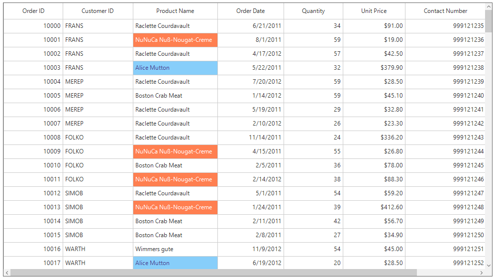

### Styling Alternate Cells

The appearance of the alternating cells in a column can be customized conditionally by using the [SfDataGrid.QueryCellStyle](https://help.syncfusion.com/cr/windowsforms/Syncfusion.WinForms.DataGrid.SfDataGrid.html) event.



this.sfDataGrid1.QueryCellStyle += SfDataGrid1_QueryCellStyle;

private void SfDataGrid1_QueryCellStyle(object sender, QueryCellStyleEventArgs e)
{
    if(e.Column.MappingName == "OrderID")
    {
        if (e.RowIndex % 2 == 0)
            e.Style.BackColor = Color.PaleTurquoise;
        else
            e.Style.BackColor = Color.Snow;   
    }
}


AddHandler sfDataGrid1.QueryCellStyle, AddressOf SfDataGrid1_QueryCellStyle 
Private Sub SfDataGrid1_QueryCellStyle(ByVal sender As Object, ByVal e As QueryCellStyleEventArgs)
If e.Column.MappingName = "OrderID" Then
If e.RowIndex Mod 2 = 0 Then
e.Style.BackColor = Color.PaleTurquoise
Else
e.Style.BackColor = Color.Snow
End If
End If
End Sub



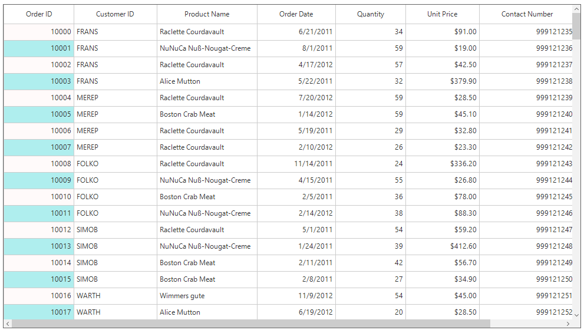

## Rows

### Styling based on Content

The appearance of the record rows in SfDataGrid can be conditionally customized based on the content by handling the [SfDataGrid.QueryRowStyle](https://help.syncfusion.com/cr/windowsforms/Syncfusion.WinForms.DataGrid.SfDataGrid.html) event. The following code shows how to apply conditional styling for Observable collection.



this.sfDataGrid.QueryRowStyle += SfDataGrid_QueryRowStyle;

private void SfDataGrid_QueryRowStyle(object sender, QueryRowStyleEventArgs e)
{
    if (e.RowType == RowType.DefaultRow)
    {
        if ((e.RowData as OrderInfo).CustomerID == "FRANS")
            e.Style.BackColor = Color.Bisque;
        else if ((e.RowData as OrderInfo).CustomerID == "MEREP")
            e.Style.BackColor = Color.LightBlue;
    }
}


AddHandler sfDataGrid.QueryRowStyle, AddressOf SfDataGrid_QueryRowStyle

Private Sub SfDataGrid_QueryRowStyle(ByVal sender As Object, ByVal e As QueryRowStyleEventArgs)
    If e.RowType = RowType.DefaultRow Then
        If (TryCast(e.RowData, OrderInfo)).CustomerID = "FRANS" Then
            e.Style.BackColor = Color.Bisque
        ElseIf (TryCast(e.RowData, OrderInfo)).CustomerID = "MEREP" Then
            e.Style.BackColor = Color.LightBlue
        End If
    End If
End Sub



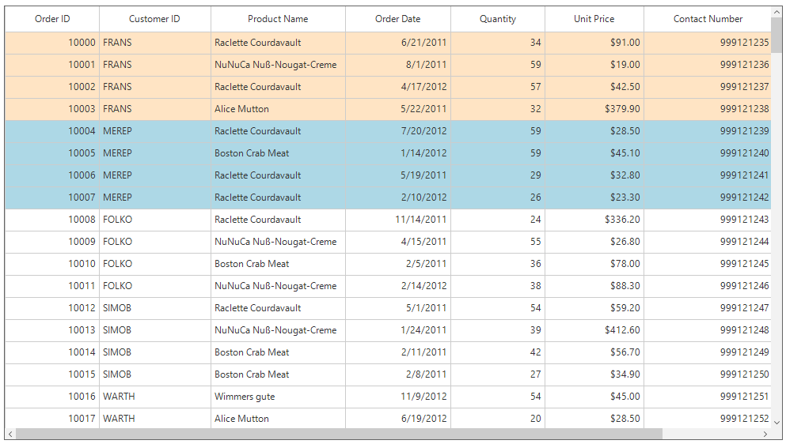

The following code shows how to apply conditional styling for the data table.



this.sfDataGrid.QueryCellStyle += SfDataGrid_QueryCellStyle;

private void SfDataGrid_QueryRowStyle(object sender, QueryRowStyleEventArgs e)
{
    // Get the "Country" column from the RowData   
    if (e.RowType == RowType.DefaultRow)
    {
        var dataRowView = e.RowData as DataRowView;
        if (dataRowView != null)
        {
            var dataRow = dataRowView.Row;
            var cellValue = dataRow["Country"].ToString();

            if (cellValue == "UK")
                e.Style.BackColor = Color.PaleTurquoise;
            else if (cellValue == "US")
                e.Style.BackColor = Color.CornflowerBlue;
            else
                e.Style.BackColor = Color.Wheat;
        }
    }
}


AddHandler sfDataGrid1.QueryCellStyle, AddressOf SfDataGrid1_QueryCellStyle 
Private Sub SfDataGrid_QueryRowStyle(ByVal sender As Object, ByVal e As QueryRowStyleEventArgs)
	' Get the "Country" column from the RowData   
	If e.RowType = RowType.DefaultRow Then
		Dim dataRowView = TryCast(e.RowData, DataRowView)
		If dataRowView IsNot Nothing Then
			Dim dataRow = dataRowView.Row
			Dim cellValue = dataRow("Country").ToString()

			If cellValue Is "UK" Then
				e.Style.BackColor = Color.PaleTurquoise
			ElseIf cellValue Is "US" Then
				e.Style.BackColor = Color.CornflowerBlue
			Else
				e.Style.BackColor = Color.Wheat
			End If
		End If
	End If
End Sub



### Styling Alternate Rows

The appearance of the alternating rows in  SfDataGrid can be customized by using the [SfDataGrid.QueryRowStyle](https://help.syncfusion.com/cr/windowsforms/Syncfusion.WinForms.DataGrid.SfDataGrid.html) event.



this.sfDataGrid.QueryRowStyle += SfDataGrid_QueryRowStyle;

private void SfDataGrid_QueryRowStyle(object sender, QueryRowStyleEventArgs e)
{
    if (e.RowType == RowType.DefaultRow)
    {
        if (e.RowIndex % 2 == 0)
            e.Style.BackColor = Color.Lavender;
        else
            e.Style.BackColor = Color.AliceBlue;
    }
}


AddHandler sfDataGrid.QueryRowStyle, AddressOf SfDataGrid_QueryRowStyle

Private Sub SfDataGrid_QueryRowStyle(ByVal sender As Object, ByVal e As QueryRowStyleEventArgs)
    If e.RowType = RowType.DefaultRow Then
        If e.RowIndex Mod 2 = 0 Then
            e.Style.BackColor = Color.Lavender
        Else
            e.Style.BackColor = Color.AliceBlue
        End If
    End If
End Sub



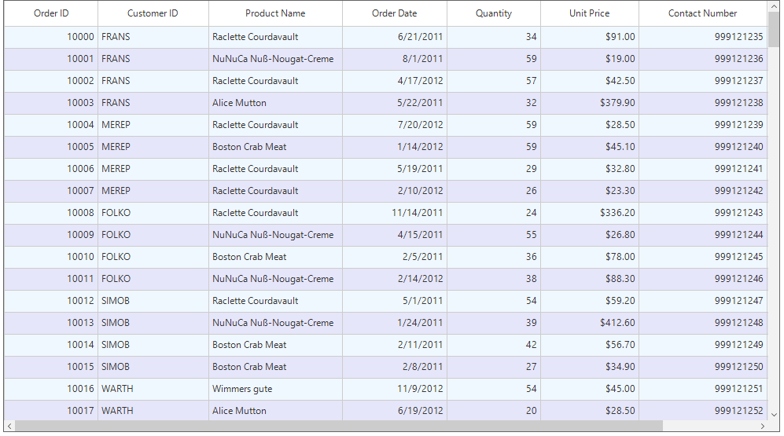

## Caption Summary

### Cell

The appearance of the caption summary cells in SfDataGrid can be customized conditionally based on the summary values by handling the [SfDataGrid.DrawCell](https://help.syncfusion.com/cr/windowsforms/Syncfusion.WinForms.DataGrid.SfDataGrid.html) event.



this.sfDataGrid1.DrawCell += SfDataGrid1_DrawCell;

private void SfDataGrid1_DrawCell(object sender, DrawCellEventArgs e)
{
    if(e.DataRow.RowType == RowType.CaptionRow)
    {
        int result;
        int.TryParse((e.DataRow.RowData as Group).SummaryDetails.SummaryValues[0].AggregateValues.ElementAt(0).Value.ToString(), out result);
        if(result < 50 && e.Column.MappingName == "Quantity")
        {
            e.Style.Font.Bold = true;
            e.Style.TextColor = Color.Red;
        }
    }
}


AddHandler sfDataGrid1.DrawCell, AddressOf SfDataGrid1_DrawCell

Private Sub SfDataGrid1_DrawCell(ByVal sender As Object, ByVal e As DrawCellEventArgs)
	If e.DataRow.RowType = RowType.CaptionRow Then
		Dim result As Integer
		Integer.TryParse((TryCast(e.DataRow.RowData, Group)).SummaryDetails.SummaryValues(0).AggregateValues.ElementAt(0).Value.ToString(), result)
		If result < 50 AndAlso e.Column.MappingName = "Quantity" Then
			e.Style.Font.Bold = True
			e.Style.TextColor = Color.Red
		End If
	End If
End Sub



### Row

The appearance of the caption summary row in SfDataGrid can be customized conditionally based on the summary values by handling the 
[SfDataGrid.DrawCell](https://help.syncfusion.com/cr/windowsforms/Syncfusion.WinForms.DataGrid.SfDataGrid.html) event.



this.sfDataGrid1.DrawCell += SfDataGrid1_DrawCell;

private void SfDataGrid1_DrawCell(object sender, DrawCellEventArgs e)
{
    if (e.DataRow.RowType == RowType.CaptionCoveredRow)
    {
        int result;
        int.TryParse((e.DataRow.RowData as Group).SummaryDetails.SummaryValues[0].AggregateValues.ElementAt(0).Value.ToString(), out result);
        if (result < 50)
        {
            e.Style.Font.Bold = true;
            e.Style.TextColor = Color.Red;
        }
	}	
}


AddHandler sfDataGrid1.DrawCell, AddressOf SfDataGrid1_DrawCell

Private Sub SfDataGrid1_DrawCell(ByVal sender As Object, ByVal e As DrawCellEventArgs)
    If e.DataRow.RowType = RowType.CaptionCoveredRow Then
        Dim result As Integer
        Integer.TryParse((TryCast(e.DataRow.RowData, Group)).SummaryDetails.SummaryValues(0).AggregateValues.ElementAt(0).Value.ToString(), result)
        If result < 50 Then
            e.Style.Font.Bold = True
            e.Style.TextColor = Color.Red
        End If
    End If
End Sub



## Group Summary

### Cell

The appearance of the group summary cells in SfDataGrid can be customized conditionally by handling the [SfDataGrid.DrawCell](https://help.syncfusion.com/cr/windowsforms/Syncfusion.WinForms.DataGrid.SfDataGrid.html) event.



this.sfDataGrid1.DrawCell += SfDataGrid1_DrawCell;

private void SfDataGrid1_DrawCell(object sender, DrawCellEventArgs e)
{
    if (e.DataRow.RowType == RowType.SummaryRow)
    {
        if (e.Column.MappingName == "UnitPrice")
            e.Style.BackColor = Color.RosyBrown;
    }
}


AddHandler sfDataGrid1.DrawCell, AddressOf SfDataGrid1_DrawCell

Private Sub SfDataGrid1_DrawCell(ByVal sender As Object, ByVal e As DrawCellEventArgs)
	If e.DataRow.RowType = RowType.SummaryRow Then
		If e.Column.MappingName = "UnitPrice" Then
			e.Style.BackColor = Color.RosyBrown
		End If
	End If
End Sub


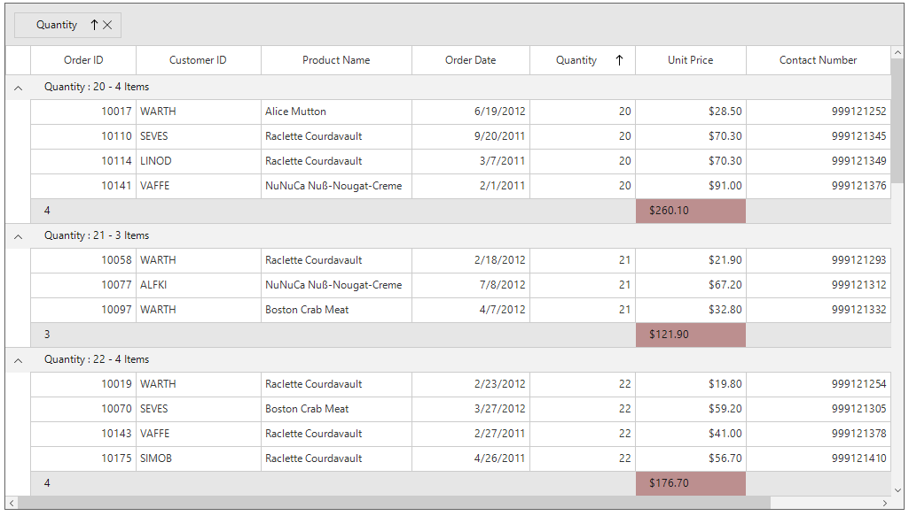

### Row

The appearance of the group summary row in SfDataGrid can be customized conditionally by handling the [SfDataGrid.DrawCell](https://help.syncfusion.com/cr/windowsforms/Syncfusion.WinForms.DataGrid.SfDataGrid.html) event.



this.sfDataGrid1.DrawCell += SfDataGrid1_DrawCell;

private void SfDataGrid1_DrawCell(object sender, DrawCellEventArgs e)
{
    if (e.DataRow.RowType == RowType.SummaryCoveredRow)
    {
        float result;
        float.TryParse((e.DataRow.RowData as SummaryRecordEntry).SummaryValues[0].AggregateValues.ElementAt(0).Value.ToString(), out result);

        if (result < 200)
            e.Style.BackColor = Color.BlanchedAlmond;
    }
}


AddHandler sfDataGrid1.DrawCell, AddressOf SfDataGrid1_DrawCell

Private Sub SfDataGrid1_DrawCell(ByVal sender As Object, ByVal e As DrawCellEventArgs)
	If e.DataRow.RowType = RowType.SummaryCoveredRow Then
		Dim result As Single
		Single.TryParse((TryCast(e.DataRow.RowData, SummaryRecordEntry)).SummaryValues(0).AggregateValues.ElementAt(0).Value.ToString(), result)

		If result < 200 Then
			e.Style.BackColor = Color.BlanchedAlmond
		End If
	End If
End Sub



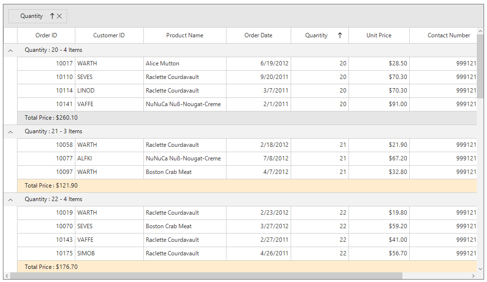

## Table Summary

### Cell

The appearance of the table summary cells in SfDataGrid can be customized conditionally by handling the [SfDataGrid.DrawCell](https://help.syncfusion.com/cr/windowsforms/Syncfusion.WinForms.DataGrid.SfDataGrid.html) event.



this.sfDataGrid1.DrawCell += SfDataGrid1_DrawCell;

private void SfDataGrid1_DrawCell(object sender, DrawCellEventArgs e)
{
    if (e.DataRow.RowType == RowType.TableSummaryRow)
    {
        if (e.Column.MappingName == "UnitPrice")
            e.Style.BackColor = Color.Aquamarine;
    }
}


AddHandler sfDataGrid1.DrawCell, AddressOf SfDataGrid1_DrawCell

Private Sub SfDataGrid1_DrawCell(ByVal sender As Object, ByVal e As DrawCellEventArgs)
	If e.DataRow.RowType = RowType.TableSummaryRow Then
		If e.Column.MappingName = "UnitPrice" Then
			e.Style.BackColor = Color.Aquamarine
		End If
	End If
End Sub



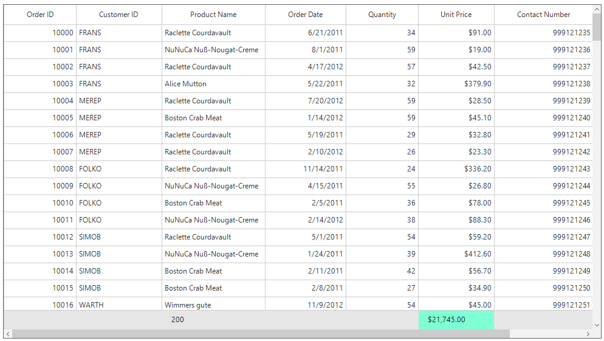

### Row

The appearance of the table summary row in SfDataGrid can be customized conditionally by handling the [SfDataGrid.DrawCell](https://help.syncfusion.com/cr/windowsforms/Syncfusion.WinForms.DataGrid.SfDataGrid.html) event.



this.sfDataGrid1.DrawCell += SfDataGrid1_DrawCell;
private void SfDataGrid1_DrawCell(object sender, DrawCellEventArgs e)
{
    if (e.DataRow.RowType == RowType.TableSummaryCoveredRow)
    {
        double result;
        double.TryParse((e.DataRow.RowData as SummaryRecordEntry).SummaryValues[0].AggregateValues.ElementAt(0).Value.ToString(), out result);
        if (result > 10000)
            e.Style.BackColor = Color.Beige;
        else
            e.Style.BackColor = Color.Bisque;
    }
}


AddHandler sfDataGrid1.DrawCell, AddressOf SfDataGrid1_DrawCell
Private Sub SfDataGrid1_DrawCell(ByVal sender As Object, ByVal e As DrawCellEventArgs)
If e.DataRow.RowType = RowType.TableSummaryCoveredRow Then
Dim result As Double
Double.TryParse((TryCast(e.DataRow.RowData, SummaryRecordEntry)).SummaryValues(0).AggregateValues.ElementAt(0).Value.ToString(), result)
If result > 10000 Then
e.Style.BackColor = Color.Beige
Else
e.Style.BackColor = Color.Bisque
End If
End If
End Sub



## Stacked Header

The appearance of the stacked headers in SfDataGrid can be customized conditionally by overriding the [GridStackedHeaderCellRenderer](https://help.syncfusion.com/cr/windowsforms/Syncfusion.WinForms.DataGrid.Renderers.GridStackedHeaderCellRenderer.html) class.



this.sfDataGrid1.CellRenderers.Remove("StackedHeader");
this.sfDataGrid1.CellRenderers.Add("StackedHeader", new CustomStackedHeaderCellRenderer());

public class CustomStackedHeaderCellRenderer : GridStackedHeaderCellRenderer
{
    protected override void OnRender(Graphics paint, Rectangle cellRect, string cellValue, CellStyleInfo style, DataColumnBase column, RowColumnIndex rowColumnIndex)
    {
        if (column.ColumnIndex == 0)
        {
            style.BackColor = Color.LightSkyBlue;
        }
        else
        {
            style.BackColor = Color.BlanchedAlmond;
        }
        base.OnRender(paint, cellRect, cellValue, style, column, rowColumnIndex);
    }
}


Me.sfDataGrid1.CellRenderers.Remove("StackedHeader")
Me.sfDataGrid1.CellRenderers.Add("StackedHeader", New CustomStackedHeaderCellRenderer())

Public Class CustomStackedHeaderCellRenderer
	Inherits GridStackedHeaderCellRenderer
	Protected Overrides Sub OnRender(ByVal paint As Graphics, ByVal cellRect As Rectangle, ByVal cellValue As String, ByVal style As CellStyleInfo, ByVal column As DataColumnBase, ByVal rowColumnIndex As RowColumnIndex)
		If column.ColumnIndex = 0 Then
			style.BackColor = Color.LightSkyBlue
		Else
			style.BackColor = Color.BlanchedAlmond
		End If

		MyBase.OnRender(paint, cellRect, cellValue, style, column, rowColumnIndex)
	End Sub
End Class



## Row Header

The appearance of the row headers in SfDataGrid can be customized conditionally by handling the [SfDataGrid.DrawCell](https://help.syncfusion.com/cr/windowsforms/Syncfusion.WinForms.DataGrid.SfDataGrid.html) event.



this.sfDataGrid1.DrawCell += SfDataGrid1_DrawCell;
private void SfDataGrid1_DrawCell(object sender, DrawCellEventArgs e)
{
    if (this.sfDataGrid1.ShowRowHeader && e.ColumnIndex == 0 && e.DataRow.RowIndex != 0)
    {
        if (e.RowIndex % 2 == 0)
        {
            e.Style.BackColor = Color.LightBlue;
        }
        else
        {
            e.Style.BackColor = Color.CadetBlue;
        }
    }
}


AddHandler sfDataGrid1.DrawCell, AddressOf SfDataGrid1_DrawCell
Private Sub SfDataGrid1_DrawCell(ByVal sender As Object, ByVal e As DrawCellEventArgs)
If Me.sfDataGrid1.ShowRowHeader AndAlso e.ColumnIndex = 0 AndAlso e.DataRow.RowIndex &lt;&gt; 0 Then
If e.RowIndex Mod 2 = 0 Then
e.Style.BackColor = Color.LightBlue
Else
e.Style.BackColor = Color.CadetBlue
End If
End If
End Sub



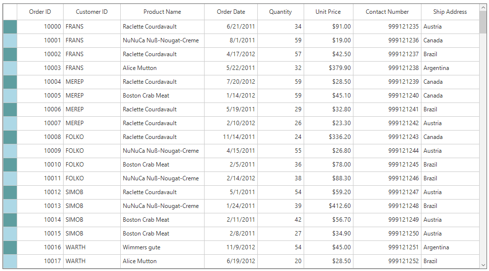

## Indent cell

The appearance of indent cells in SfDataGrid can be customized conditionally by overriding the [GridIndentCellRenderer](https://help.syncfusion.com/cr/windowsforms/Syncfusion.WinForms.DataGrid.Renderers.GridIndentCellRenderer.html) class.



public Form1()
{
    InitializeComponent();
    this.sfDataGrid.CellRenderers.Remove("Indent");
    this.sfDataGrid.CellRenderers.Add("Indent", new CustomIndentCellRenderer());   
}

public class CustomIndentCellRenderer : GridIndentCellRenderer
{
    protected override void OnRender(Graphics paint, Rectangle cellRect, string cellValue, CellStyleInfo style, DataColumnBase column, RowColumnIndex rowColumnIndex)
    {
        if (rowColumnIndex.RowIndex % 2 == 0)
            style.BackColor = Color.Lavender;
        else
            style.BackColor = Color.AliceBlue;

        base.OnRender(paint, cellRect, cellValue, style, column, rowColumnIndex);   
    }
}


Public Sub New()
	InitializeComponent()
	Me.sfDataGrid.CellRenderers.Remove("Indent")
	Me.sfDataGrid.CellRenderers.Add("Indent", New CustomIndentCellRenderer())
End Sub

Public Class CustomIndentCellRenderer
	Inherits GridIndentCellRenderer
	Protected Overrides Sub OnRender(ByVal paint As Graphics, ByVal cellRect As Rectangle, ByVal cellValue As String, ByVal style As CellStyleInfo, ByVal column As DataColumnBase, ByVal rowColumnIndex As RowColumnIndex)
		If rowColumnIndex.RowIndex Mod 2 = 0 Then
			style.BackColor = Color.Lavender
		Else
			style.BackColor = Color.AliceBlue
		End If

		MyBase.OnRender(paint, cellRect, cellValue, style, column, rowColumnIndex)
	End Sub
End Class



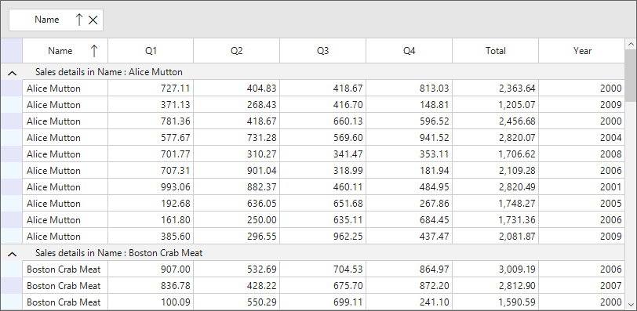

## Adding an Image for a Cell

SfDataGrid allows to add image within a cell by handling the [SfDataGrid.DrawCell](https://help.syncfusion.com/cr/windowsforms/Syncfusion.WinForms.DataGrid.SfDataGrid.html) event.



this.sfDataGrid1.DrawCell += SfDataGrid1_DrawCell;
private void SfDataGrid1_DrawCell(object sender, DrawCellEventArgs e)
{
    if (e.RowIndex == 1 && e.Column.MappingName == "ShipCountry")
    {
        e.Handled = true;
        e.Graphics.DrawImage(Image.FromFile(@"../../US.jpg"), e.Bounds.X + 20, e.Bounds.Y);
        Pen borderPen = new Pen(Color.LightGray);
        e.Graphics.DrawLine(borderPen, e.Bounds.Right, e.Bounds.Top, e.Bounds.Right, e.Bounds.Bottom);
        e.Graphics.DrawLine(borderPen, e.Bounds.Left, e.Bounds.Bottom, e.Bounds.Right, e.Bounds.Bottom);
    }
}


AddHandler sfDataGrid1.DrawCell, AddressOf SfDataGrid1_DrawCell
Private Sub SfDataGrid1_DrawCell(ByVal sender As Object, ByVal e As DrawCellEventArgs)
If e.RowIndex = 1 AndAlso e.Column.MappingName = "ShipCountry" Then
e.Handled = True
e.Graphics.DrawImage(Image.FromFile("../../US.jpg"), e.Bounds.X + 20, e.Bounds.Y)
Dim borderPen As New Pen(Color.LightGray)
e.Graphics.DrawLine(borderPen, e.Bounds.Right, e.Bounds.Top, e.Bounds.Right, e.Bounds.Bottom)
e.Graphics.DrawLine(borderPen, e.Bounds.Left, e.Bounds.Bottom, e.Bounds.Right, e.Bounds.Bottom)
End If
End Sub



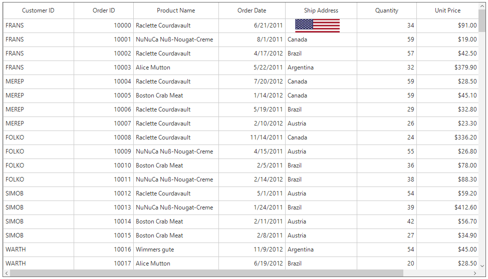

## Highlighting the Newly Added Row 

The newly added records in SfDataGrid can be highlighted by changing its Background or Foreground color. 
For that add a new Boolean property in underling data source and set it as true for newly added records in [SfDataGrid.AddNewRowInitiating](https://help.syncfusion.com/cr/windowsforms/Syncfusion.WinForms.DataGrid.SfDataGrid.html) event.



this.sfDataGrid1.AddNewRowInitiating += SfDataGrid1_AddNewRowInitiating;
private void SfDataGrid1_AddNewRowInitiating(object sender, AddNewRowInitiatingEventArgs e)
{
    (e.NewObject as OrderInfo).isNewlyAdded = true;
}


AddHandler sfDataGrid1.AddNewRowInitiating, AddressOf SfDataGrid1_AddNewRowInitiating
Private Sub SfDataGrid1_AddNewRowInitiating(ByVal sender As Object, ByVal e As AddNewRowInitiatingEventArgs)
TryCast(e.NewObject, OrderInfo).isNewlyAdded = True
End Sub



Now change the appearance of the row in [SfDataGrid.QueryCellStyle](https://help.syncfusion.com/cr/windowsforms/Syncfusion.WinForms.DataGrid.SfDataGrid.html) event based on this property value.



this.sfDataGrid.QueryCellStyle += SfDataGrid_QueryCellStyle;

private void SfDataGrid_QueryCellStyle(object sender, QueryCellStyleEventArgs e)
{
    if (e.DataRow == null || e.DataRow.RowData == null)
        return;

    if (e.DataRow.RowData != null && (e.DataRow.RowData as OrderInfo).isNewlyAdded)
        e.Style.BackColor = Color.LightBlue;
}


AddHandler sfDataGrid1.QueryCellStyle, AddressOf SfDataGrid_QueryCellStyle

Private Sub SfDataGrid_QueryCellStyle(ByVal sender As Object, ByVal e As QueryCellStyleEventArgs)
    If e.DataRow Is Nothing OrElse e.DataRow.RowData Is Nothing Then
        Return
    End If

    If e.DataRow.RowData IsNot Nothing AndAlso (TryCast(e.DataRow.RowData, OrderInfo)).isNewlyAdded Then
        e.Style.BackColor = Color.LightBlue
    End If
End Sub



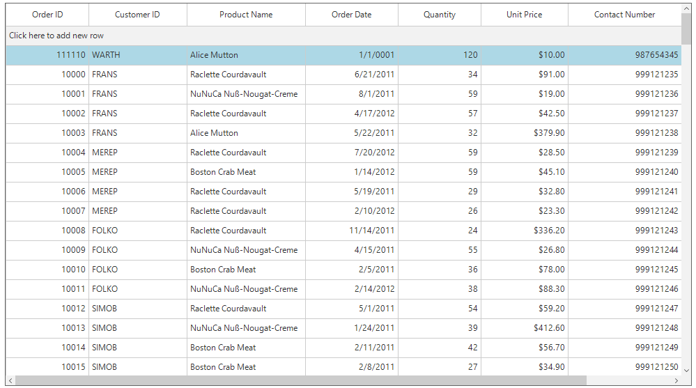

## Alignment Customization based on Column

The alignment within the cell can be changed based on the columns using the [SfDataGrid.QueryCellStyle](https://help.syncfusion.com/cr/windowsforms/Syncfusion.WinForms.DataGrid.SfDataGrid.html) event.



this.sfDataGrid.QueryCellStyle += SfDataGrid_QueryCellStyle;

private void SfDataGrid_QueryCellStyle(object sender, QueryCellStyleEventArgs e)
{
    if (e.DataRow.RowType == RowType.DefaultRow && e.Column.MappingName == "ProductName")
    {
        e.Style.VerticalAlignment = System.Windows.Forms.VisualStyles.VerticalAlignment.Top;
        e.Style.HorizontalAlignment = HorizontalAlignment.Center;
    }
}


AddHandler sfDataGrid1.QueryCellStyle, AddressOf SfDataGrid_QueryCellStyle

Private Sub SfDataGrid_QueryCellStyle(ByVal sender As Object, ByVal e As QueryCellStyleEventArgs)
    If e.DataRow.RowType = RowType.DefaultRow AndAlso e.Column.MappingName = "ProductName" Then
        e.Style.VerticalAlignment = System.Windows.Forms.VisualStyles.VerticalAlignment.Top
        e.Style.HorizontalAlignment = HorizontalAlignment.Center
    End If
End Sub



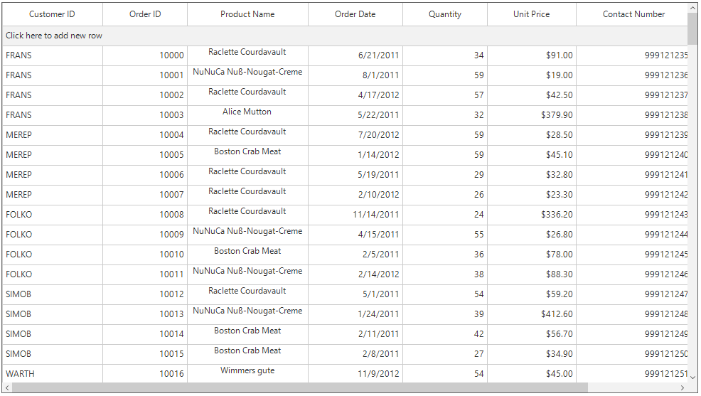

