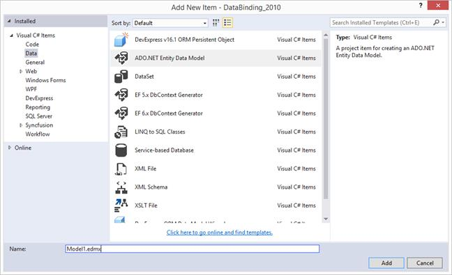
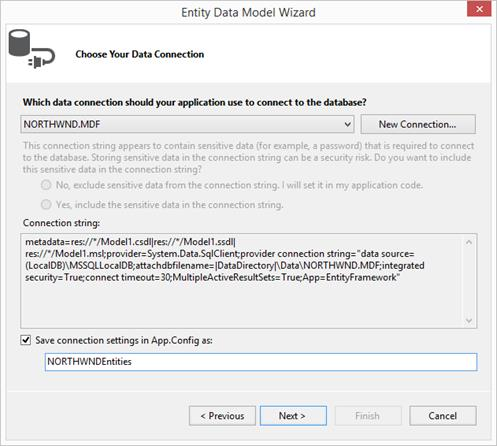
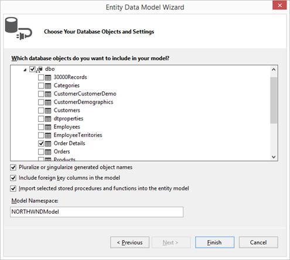
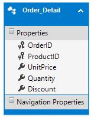
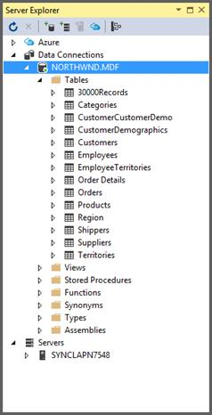
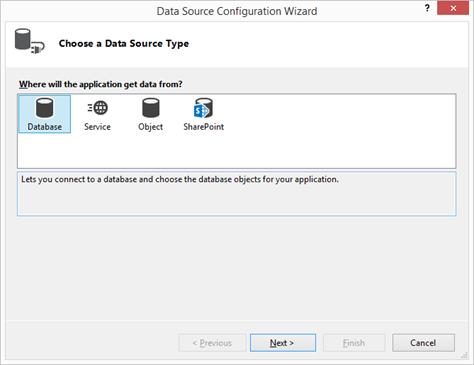
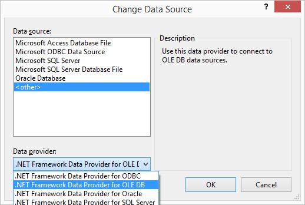

# Data Binding in Windows Forms DataGrid (SfDataGrid)
[WinForms DataGrid](https://www.syncfusion.com/winforms-ui-controls/datagrid) control is designed to display the bounded data in a tabular format. The data binding can be achieved by assigning the data sources to [SfDataGrid.DataSource](https://help.syncfusion.com/cr/windowsforms/Syncfusion.WinForms.DataGrid.SfDataGrid.html#Syncfusion_WinForms_DataGrid_SfDataGrid_DataSource) property.



OrderInfoCollection collection = new OrderInfoCollection();
this.sfDataGrid1.DataSource = collection.OrdersListDetails;


Dim collection As New OrderInfoCollection()
Me.sfDataGrid1.DataSource = collection.OrdersListDetails



If the data source implements [INotifyCollectionChanged](https://docs.microsoft.com/en-us/dotnet/api/system.collections.specialized.inotifycollectionchanged?view=net-5.0) interface, then SfDataGrid control will automatically refresh the UI when item is added, removed or while list cleared.
When an item is added/removed in [ObservableCollection](https://docs.microsoft.com/en-us/dotnet/api/system.collections.objectmodel.observablecollection-1?view=net-5.0), SfDataGrid automatically refresh the UI as `ObservableCollection` implements `INotifyCollectionChanged`. But when an item is added/removed in [List](https://docs.microsoft.com/en-us/dotnet/api/system.collections.generic.list-1?view=net-5.0), SfDataGrid will not refresh the UI automatically.

## Binding to IEnumerable
SfDataGrid control supports to bind any collection that implements the [IEnumerable](https://docs.microsoft.com/en-us/dotnet/api/system.collections.ienumerable?view=net-5.0) interface. All the data operations such as sorting, grouping, filtering, summaries are supported when binding collection derived from `IEnumerable`.

## Binding with DataTable
SfDataGrid control supports to bind the DataTable. SfDataGrid control automatically refresh the UI when binding DataTable as `DataSource` when rows are added, removed or cleared.



DataTable dataTable = this.GetDataTable();
this.sfDataGrid1.DataSource = dataTable;


Dim dataTable As DataTable = Me.GetDataTable()
Me.sfDataGrid1.DataSource = dataTable



Below are the limitations when binding DataTable as `DataSource` to SfDataGrid.

* Custom sorting is not supported.
* [SfDataGrid.View.Filter](https://help.syncfusion.com/cr/windowsforms/Syncfusion.WinForms.DataGrid.Data.DataTableCollectionViewWrapper.html) is not supported.
* Advanced Filtering does not support Case Sensitive filtering.
* [AddNewRow](https://help.syncfusion.com/cr/windowsforms/Syncfusion.WinForms.DataGrid.SfDataGrid.html#Syncfusion_WinForms_DataGrid_SfDataGrid_AddNewRowPosition) is not support when filtering is enabled.
* [GridUnboundColumn.Expression](https://help.syncfusion.com/cr/windowsforms/Syncfusion.WinForms.DataGrid.GridUnboundColumn.html#Syncfusion_WinForms_DataGrid_GridUnboundColumn_Expression) is not supported. This can be achieved by using the [DataColumn](https://docs.microsoft.com/en-us/dotnet/api/system.data.datacolumn?view=net-5.0) of DataTable by setting [DataColumn.Expression](https://docs.microsoft.com/en-us/dotnet/api/system.data.datacolumn.expression?view=net-5.0) property.
* [SfDataGrid.LiveDataUpdateMode](https://help.syncfusion.com/cr/windowsforms/Syncfusion.WinForms.DataGrid.SfDataGrid.html#Syncfusion_WinForms_DataGrid_SfDataGrid_LiveDataUpdateMode) is not supported.

## Binding to XML Data
SfDataGrid can be bound to data from XML files. This can be achieved by using the [DataSet](https://docs.microsoft.com/en-us/dotnet/api/system.data.dataset?view=net-5.0) object which provides the necessary methods that is used to read XML data into dataset. After loading the data, the SfDataGrid can be bind to this dataset by setting data binding properties such as `DataSource` and `DataMember` to the dataset and table name respectively. It is also possible to save the changes back to XML file.



DataSet dataSet = new DataSet();
dataSet.ReadXml(@"..\\..\\Data\\Datasource.xml");
this.sfDataGrid1.DataSource = dataSet.Tables[0];


Dim dataSet As New DataSet()
dataSet.ReadXml("..\\..\\Data\\Datasource.xml")
Me.sfDataGrid1.DataSource = dataSet.Tables(0)



## Binding Complex Properties
SfDataGrid control provides support to bind complex property to its columns. To bind the complex property to [GridColumn](https://help.syncfusion.com/cr/windowsforms/Syncfusion.WinForms.DataGrid.GridColumn.html), set the complex property path to [MappingName](https://help.syncfusion.com/cr/windowsforms/Syncfusion.WinForms.DataGrid.GridColumnBase.html#Syncfusion_WinForms_DataGrid_GridColumnBase_MappingName).


this.sfDataGrid1.Columns.Add(new GridTextColumn() { MappingName = "EmployeeComplexModel.EmployeeName", HeaderText = "Employee Name" });


Me.sfDataGrid1.Columns.Add(New GridTextColumn() With {.MappingName = "EmployeeComplexModel.EmployeeName", .HeaderText = "Employee Name"})



All the data operations (sorting, grouping, filtering and etc.) are supported when binding complex property.

### Limitations when Binding Complex Property
* SfDataGrid doesn’t support [LiveDataUpdateMode](https://help.syncfusion.com/cr/windowsforms/Syncfusion.WinForms.DataGrid.SfDataGrid.html#Syncfusion_WinForms_DataGrid_SfDataGrid_LiveDataUpdateMode) – [AllowDataShaping](https://help.syncfusion.com/cr/windowsforms/Syncfusion.WinForms.DataGrid.SfDataGrid.html#Syncfusion_WinForms_DataGrid_SfDataGrid_LiveDataUpdateMode) and [AllowSummaryUpdate](https://help.syncfusion.com/cr/windowsforms/Syncfusion.WinForms.DataGrid.SfDataGrid.html#Syncfusion_WinForms_DataGrid_SfDataGrid_LiveDataUpdateMode).

## Binding Indexer Properties
SfDataGrid control provides support to bind an indexer property to its columns. To bind an indexer property to `GridColumn`, set the indexer property path to `MappingName`.


this.sfDataGrid1.Columns.Add(new GridTextColumn() { MappingName = "EmployeeDetails[0].Title", HeaderText = "Title" });


Me.sfDataGrid1.Columns.Add(New GridTextColumn() With {.MappingName = "EmployeeDetails[0].Title", .HeaderText = "Title"})



All the data operations (sorting, grouping, filtering and etc.) are supported when binding indexer property. 

### Limitations when Binding Indexer Property
* SfDataGrid doesn’t support [LiveDataUpdateMode ](https://help.syncfusion.com/cr/windowsforms/Syncfusion.WinForms.DataGrid.SfDataGrid.html#Syncfusion_WinForms_DataGrid_SfDataGrid_LiveDataUpdateMode)– [AllowDataShaping](https://help.syncfusion.com/cr/windowsforms/Syncfusion.WinForms.DataGrid.SfDataGrid.html#Syncfusion_WinForms_DataGrid_SfDataGrid_LiveDataUpdateMode) and [AllowSummaryUpdate](https://help.syncfusion.com/cr/windowsforms/Syncfusion.WinForms.DataGrid.SfDataGrid.html#Syncfusion_WinForms_DataGrid_SfDataGrid_LiveDataUpdateMode).

## Events

### DataSourceChanged
[SfDataGrid.DataSourceChanged](https://help.syncfusion.com/cr/windowsforms/Syncfusion.WinForms.DataGrid.SfDataGrid.html) event occurs when the data source is changed by using `DataSource` property.
This event receives two arguments namely sender that handles SfDataGrid and [DataSourceChangedEventArgs](https://help.syncfusion.com/cr/windowsforms/Syncfusion.WinForms.DataGrid.Events.DataSourceChangedEventArgs.html) as objects.
The `DataSourceChangedEventArgs` object contains the following properties:

* [OldValue](https://help.syncfusion.com/cr/windowsforms/Syncfusion.WinForms.DataGrid.Events.DataSourceChangedEventArgs.html#Syncfusion_WinForms_DataGrid_Events_DataSourceChangedEventArgs_OldValue) - Gets the value of old data source
* [NewValue](https://help.syncfusion.com/cr/windowsforms/Syncfusion.WinForms.DataGrid.Events.DataSourceChangedEventArgs.html#Syncfusion_WinForms_DataGrid_Events_DataSourceChangedEventArgs_NewValue)  - Get the value of new data source
* [OldView](https://help.syncfusion.com/cr/windowsforms/Syncfusion.WinForms.DataGrid.Events.DataSourceChangedEventArgs.html#Syncfusion_WinForms_DataGrid_Events_DataSourceChangedEventArgs_OldView) – Gets the old view of the data grid.
* [NewView](https://help.syncfusion.com/cr/windowsforms/Syncfusion.WinForms.DataGrid.Events.DataSourceChangedEventArgs.html#Syncfusion_WinForms_DataGrid_Events_DataSourceChangedEventArgs_NewView) – Gets the new view of the data grid.

## View
SfDataGrid has the [View](https://help.syncfusion.com/cr/windowsforms/Syncfusion.WinForms.DataGrid.SfDataGrid.html#Syncfusion_WinForms_DataGrid_SfDataGrid_View) property of type [ICollectionViewAdv](https://help.syncfusion.com/cr/windowsforms/Syncfusion.Data.ICollectionViewAdv.html) interface that implements [IEditableCollectionView](https://help.syncfusion.com/cr/windowsforms/Syncfusion.Data.IEditableCollectionView.html) interface. `View` is responsible for maintaining and manipulating the data and other advanced operations like Sorting, Grouping, Filtering etc.
When binding Collection to `DataSource` property of SfDataGrid, then `View` will be created and maintains the operations on data such as Grouping, Filtering, Sorting, Insert, Delete, and Modification.
Following are some important properties that can be used for various purposes.

N> SfDataGrid creates different types of views derived from `ICollectionViewAdv` interface based on `DataSource`.

<table>
<tr>
<td>
{{'**Property**'| markdownify }}
</td>
<td>
{{'**Type**'| markdownify }}
</td>
<td>
{{'**Description**'| markdownify }}
</td>
</tr>
<tr>
<td>
Records
</td>
<td>
RecordsList
</td>
<td>
Maintains the Records that are displayed in View when SfDataGrid is not Grouped.
</td>
</tr>
<tr>
<td>
TopLevelGroup
</td>
<td>
TopLevelGroup
</td>
<td>
Maintains the Group information when SfDataGrid is Grouped.
</td>
</tr>
<tr>
<td>
TopLevelGroup.DisplayElements
</td>
<td>
GroupDisplayElements
</td>
<td>
Maintains the Records and Group information that are displayed in View when SfDataGrid is Grouped.
</td>
</tr>
<tr>
<td>
Filter
</td>
<td>
Predicate&lt;object&gt;
</td>
<td>
Get or sets the method that determines the data is suitable to be displayed in View.
</td>
</tr>
<tr>
<td>
FilterPredicates
</td>
<td>
ObservableCollection&lt;IFilterDefinition&gt;
</td>
<td>
Maintains the FilterPredicates that are created while filtering using Filtering UI.
</td>
</tr>
<tr>
<td>
GroupDescriptions
</td>
<td>
ObservableCollection&lt;GroupDescription&gt;
</td>
<td>
Maintains the GroupDescription collection information. It describes how the items in the collection are grouped in the view.
</td>
</tr>
<tr>
<td>
SortDescriptions
</td>
<td>
SortDescriptionCollection
</td>
<td>
Maintains the SortDescription collection information. It describes how the items in the collection are sort in the view.
</td>
</tr>
<tr>
<td>
SourceCollection
</td>
<td>
IEnumerable
</td>
<td>
Maintains the underlying source collection.
</td>
</tr>
<tr>
<td>
TableSummaryRows
</td>
<td>
ObservableCollection&lt;ISummaryRow&gt;
</td>
<td>
Maintains the TableSummaryRows collection information. 
</td>
</tr>
<tr>
<td>
SummaryRows
</td>
<td>
ObservableCollection&lt;ISummaryRow&gt;
</td>
<td>
Maintains the SummaryRows collection information. 
</td>
</tr>
<tr>
<td>
CaptionSummaryRow
</td>
<td>
ISummaryRow
</td>
<td>
Maintains the CaptionSummaryRow information.
</td>
</tr>
</table>

### Events
The following events are associated with `View`.

* RecordPropertyChanged
* CollectionChanged
* SourceCollectionChanged

#### RecordPropertyChanged
[RecordPropertyChanged](https://help.syncfusion.com/cr/windowsforms/Syncfusion.Data.ICollectionViewAdv.html) event is raised when the DataModel property value is changed, if the DataModel implements the [INotifyPropertyChanged](https://docs.microsoft.com/en-us/dotnet/api/system.componentmodel.inotifypropertychanged?view=net-5.0) interface. The event receives with two arguments namely sender that handles the DataModel and [PropertyChangedEventArgs](https://docs.microsoft.com/en-us/dotnet/api/system.componentmodel.propertychangedeventargs?view=net-5.0) as object.
`PropertyChangedEventArgs` has below property,
* [PropertyName](https://docs.microsoft.com/en-us/dotnet/api/system.componentmodel.propertychangedeventargs.propertyname?view=net-5.0) – It denotes the PropertyName of the changed value.

#### CollectionChanged 
[CollectionChanged](https://help.syncfusion.com/cr/windowsforms/Syncfusion.Data.CollectionViewAdv.html) event is raised whenever that is some change in Records / DisplayElements collection. The event receives two arguments namely sender that handles View object and [NotifyCollectionChangedEventArgs](https://docs.microsoft.com/en-us/dotnet/api/system.componentmodel.propertychangedeventargs?redirectedfrom=MSDN&view=netframework-4.8) as object.
`NotifyCollectionChangedEventArgs` has below properties,
* [Action](https://docs.microsoft.com/en-us/dotnet/api/system.collections.specialized.notifycollectionchangedeventargs.action?redirectedfrom=MSDN&view=netframework-4.8#System_Collections_Specialized_NotifyCollectionChangedEventArgs_Action) - It contains the current action. (i.e.) Add, Remove, Move, Replace, Reset.

* [NewItems](https://docs.microsoft.com/en-us/dotnet/api/system.collections.specialized.notifycollectionchangedeventargs.newitems?redirectedfrom=MSDN&view=netframework-4.8#System_Collections_Specialized_NotifyCollectionChangedEventArgs_NewItems) - It contains the list of new items involved in the change.

* [OldItems](https://docs.microsoft.com/en-us/dotnet/api/system.collections.specialized.notifycollectionchangedeventargs.olditems?redirectedfrom=MSDN&view=netframework-4.8#System_Collections_Specialized_NotifyCollectionChangedEventArgs_OldItems) - It contains the list of old items affected by the Action.

* [NewStartingIndex](https://docs.microsoft.com/en-us/dotnet/api/system.collections.specialized.notifycollectionchangedeventargs.newstartingindex?redirectedfrom=MSDN&view=netframework-4.8#System_Collections_Specialized_NotifyCollectionChangedEventArgs_NewStartingIndex) - It contains the index at which the change occurred.

* [OldStartingIndex](https://docs.microsoft.com/en-us/dotnet/api/system.collections.specialized.notifycollectionchangedeventargs.oldstartingindex?redirectedfrom=MSDN&view=netframework-4.8#System_Collections_Specialized_NotifyCollectionChangedEventArgs_OldStartingIndex) - It contains the index at which the Action occurred.

#### SourceCollectionChanged
[SourceCollectionChanged ](https://help.syncfusion.com/cr/windowsforms/Syncfusion.Data.ICollectionViewAdv.html)event is raised when source collection is changed for example add or remove the collection. The event receives two arguments namely sender that handles [QueryableCollectionViewWrapper](https://help.syncfusion.com/cr/windowsforms/Syncfusion.WinForms.DataGrid.Data.QueryableCollectionViewWrapper.html) object and [NotifyCollectionChangedEventArgs](https://docs.microsoft.com/en-us/dotnet/api/system.collections.specialized.notifycollectionchangedeventargs?view=net-5.0) as object.
`NotifyCollectionChangedEventArgs` has below properties,
* [Action](https://docs.microsoft.com/en-us/dotnet/api/system.collections.specialized.notifycollectionchangedeventargs.action?view=net-5.0) - It contains the current action. (i.e.) Add, Remove, Move, Replace and Reset.

* [NewItems](https://docs.microsoft.com/en-us/dotnet/api/system.collections.specialized.notifycollectionchangedeventargs.newitems?view=net-5.0) - It contains the list of new items involved in the change.

* [OldItems](https://docs.microsoft.com/en-us/dotnet/api/system.collections.specialized.notifycollectionchangedeventargs.olditems?view=net-5.0) - It contains the list of old items affected by the Action.

* [NewStartingIndex](https://docs.microsoft.com/en-us/dotnet/api/system.collections.specialized.notifycollectionchangedeventargs.newstartingindex?view=net-5.0) - It contains the index at which the change occurred.

* [OldStartingIndex](https://docs.microsoft.com/en-us/dotnet/api/system.collections.specialized.notifycollectionchangedeventargs.oldstartingindex?view=net-5.0) - It contains the index at which the Action occurred.

The following is the methods that are associated with `View` which can be used to defer refresh the view.
<table>
<tr>
<td>
{{'**Method Name**'| markdownify }}
</td>
<td>
{{'**Description**'| markdownify }}
</td>
</tr>
<tr>
<td>
DeferRefresh
</td>
<td>
Enter the defer cycle so that all data operations can be performed in view and update once.
</td>
</tr>
<tr>
<td>
BeginInit & EndInit
</td>
<td>
When BeginInit method is called it suspends all the updates until EndInit method is called. All the updation can be performed with in these methods and update the view at once.
</td>
</tr>
</table>

N>`View` has properties that already defined in SfDataGrid. It recommended setting those properties via SfDataGrid.

## Binding Data from ADO .NET Entity Framework
SfDataGrid control supports to bind data from ADO.NET Entity Framework. This walk-through describe about binding data from ADO.NET Entity Framework and save back the changes to the database.
**References:**
[https://docs.microsoft.com/en-us/ef/ef6/fundamentals/databinding/winforms](https://docs.microsoft.com/en-us/ef/ef6/fundamentals/databinding/winforms) 

### Defining Data Model using Entity Framework 4.0
To create Data Model using Entity Framework in Windows Forms application, follow the below steps.

1) Right click the project, select **Add** option and then click **New Item**. 

2) The **Add New Item** wizard appears, select “**ADO.NET Entity Data Mode**” from the Data node. 

3) Name the file as **Model1.edmx** and then select **Add** button.  

4) The Entity Data Model Wizard appears. In the **Choose Model Contents**, select **EF Designer from database** option and then click **Next**.

5) In the **Choose Your Data Connection**, select **Northwind** database from the drop-down list for data connection. To configure/modify connection, refer: [How to: Create Connections to SQL Server Databases](https://docs.microsoft.com/en-us/previous-versions/visualstudio/visual-studio-2008/s4yys16a(v=vs.90)).

6) Enable the **Save entity connection settings in App.config** as check box and then click **Next**.
7) In the **Choose Your Database** Objects and Settings, expand the Tables node and select the **Order Details** table.

8) Click **Finish** button to add the **Model1.edmx** file to the application. The Entity diagram for the **Order Detail** table is opened.

### Loading Data from Entity Framework Data Service
The data from the defined entity model can be loaded as a data source to the SfDataGrid by loading the **Order Details** table by the created entity for the **Northwnd** database.



NORTHWNDEntities northWind = new NORTHWNDEntities();
this.sfDataGrid1.DataSource = northWind.Order_Details;


Dim northWind As New NORTHWNDEntities()
Me.sfDataGrid1.DataSource = northWind.Order_Details



Now, run the application. The following screenshot shows the SfDataGrid control populated with data from Entity Framework data service.

## Binding Data from LINQ to SQL
SfDataGrid control supports to bind data from LINQ to SQL. This walkthrough, describes about binding data from LINQ to SQL and save back the changes to the Database.

### Adding Data Model using LINQ to SQL
To create data model using LINQ to SQL in WF project follow the below steps.
1) Right click on the project, Select **Add** option and then click **New Item**.
2) The Add New Item wizard appears, Select **LINQ to SQL Classes** from the **Visual C#**.
3) Name the file as **Northwind** and then select **Add** option to add the **Northwind.dbml** in the project.

4) Once the **Northwind.dbml** is added in the project, then the design view is opened.

5) New Database connection can be added by clicking add icon button in Server Explorer. 

6) The **Add Connection** wizard appeared with the default data source as **Microsoft SQL Server Database File (SqlClient**).

7) Click **Change** to open the **Change Data Source** dialog box and select the type of data source as **Microsoft SQL Server Database File (SqlClient).**

8) Select the Database file name and click on **Test Connection** to check the connection with the database.

9) Once the connection is succeeded, click **OK** button to add database in the server explorer.

10) Drag **Shippers** table in to design view of **Northwind.dbml**. The Entity model diagram for **Shippers** table is generated once it is dropped in to design view.

### Loading Data from LINQ to SQL Classes

The data from the defined data model of the LINQ to SQL classes can be loaded as a data source to the SfDataGrid by loading the **Shippers** table by the created data context for the **Northwnd** database.



NorthwindDataContext northWindDataContext = new NorthwindDataContext();
this.sfDataGrid1.DataSource = northWindDataContext.Shippers;


Dim northWindDataContext As New NorthwindDataContext()
Me.sfDataGrid1.DataSource = northWindDataContext.Shippers



## Binding Data from ADO.NET
SfDataGrid control supports to load the data using ADO.NET. This walk-through, describe about binding data from ADO.NET service

### Connecting Application to Databases
To connect SQL database to WinForms application, refer the below MSDN link or follow the below steps,
[https://docs.microsoft.com/en-us/previous-versions/visualstudio/visual-studio-2008/s4yys16a(v=vs.90)](https://docs.microsoft.com/en-us/previous-versions/visualstudio/visual-studio-2008/s4yys16a(v=vs.90)) 

1) Select the **Connect to Database** option from the **Tools** menu.

2) The Add Connection wizard appeared with the default data source as Microsoft SQL Server (SqlClient).

3) Click **Change** to open the **Change Data Source** dialog box and select the type of data source as **Microsoft SQL Server Database File (SqlClient).**

4) Select the Database file name and click on **Test Connection** to check the connection with the database.

5) Once the connection is succeeded, click **OK** button to add database in the server explorer.

6) To get connection string for the database, right-click on the database and then click **Properties** option.

### Loading Data from ADO.NET
To access the data from data source using `ADO.NET`, follow the below steps.

1) Create a connection through any of the [.NET Framework data provider](https://docs.microsoft.com/en-us/dotnet/framework/data/adonet/data-providers) based on the type of data source.

2) Fill the data from the database to a data set using the data adapter.

3) Set the `DataSource` as **Suppliers** table from the data set.



DataSet dataSet = new DataSet();
SqlConnection sqlConnection = new SqlConnection(@"Data Source=(LocalDB)\MSSQLLocalDB;AttachDbFilename=NORTHWND.MDF;Integrated Security=True;Connect Timeout=30");
sqlConnection.Open();
SqlDataAdapter sqlAdapter = new SqlDataAdapter("Select * from Suppliers", sqlConnection);
sqlAdapter.Fill(dataSet, "Suppliers");
this.sfDataGrid1.DataSource = dataSet.Tables["Suppliers"];


Dim dataSet As New DataSet()
Dim sqlConnection As New SqlConnection("Data Source=(LocalDB)\MSSQLLocalDB;AttachDbFilename=NORTHWND.MDF;Integrated Security=True;Connect Timeout=30")
sqlConnection.Open()
Dim sqlAdapter As New SqlDataAdapter("Select * from Suppliers", sqlConnection)
sqlAdapter.Fill(dataSet, "Suppliers")
Me.sfDataGrid1.DataSource = dataSet.Tables("Suppliers")



## Binding Data from Microsoft Access
SfDataGrid control supports to bind data from Microsoft Access database. This section describes about how to bind the data from Microsoft Access database to SfDataGrid.

### Importing Microsoft Access Database
To load the data from Microsoft Access database, follow the below steps.

1) On the **View** menu, select **Other Windows > Data Sources**.

2) In the **Data Sources** window, click **Add New Data Source**, the DataSource configuration wizard will be opened.

3) Select **Database** on the **Choose a Data Source Type** page, and then select **Next**.

4) On the **Choose your Data Connection** page, select **New Connection** to configure a new data connection and Change the **Data source** to **.NET Framework Data Provider for OLE DB**.

5) In **OLE DB Provider**, select **Microsoft Office 12.0 Access Database Engine OLE DB Provider**. In **Server or file name**, specify the path and name of the .accdb file to which want to connect, and then select **OK**.

6) Select **Next** on the **Choose your Data Connection** page.

7) Select **Next** on the **Save connection string to the Application Configuration file** page.

8) Expand the **Tables** node on the **Choose your Database Objects** page.

9) Select whatever tables or views in the dataset, and then select **Finish**.

### Loading Data from Microsoft Access Database
To access the Microsoft Access database, follow the below steps.

1) Create a **OleDbConnection** with the Microsoft Access database.

2) Fill the data from the database to a data set using the **OleDbDataAdapter**.

3) Set the `DataSource` as **Employees** table from the data set.



OleDbConnection oleConnection = new OleDbConnection(@"Provider=Microsoft.ACE.OLEDB.12.0;Data Source=E:\SfWinforms\SfDataGrid_UserGuide\Sample\DataBinding\Data\Employees.accdb;Persist Security Info=True");
OleDbDataAdapter oleDataAdapter = new OleDbDataAdapter("SELECT * FROM Employees", oleConnection);
EmployeesDataSet employeeDataSet = new EmployeesDataSet();
oleConnection.Open();
oleDataAdapter.Fill(employeeDataSet, "Employees");
oleConnection.Close();
this.sfDataGrid1.DataSource = employeeDataSet.Tables[“Employees”];


Dim oleConnection As New OleDbConnection("Provider=Microsoft.ACE.OLEDB.12.0;Data Source=E:\SfWinforms\SfDataGrid_UserGuide\Sample\DataBinding\Data\Employees.accdb;Persist Security Info=True")
Dim oleDataAdapter As New OleDbDataAdapter("SELECT * FROM Employees", oleConnection)
Dim employeeDataSet As New EmployeesDataSet()
oleConnection.Open()
oleDataAdapter.Fill(employeeDataSet, "Employees")
oleConnection.Close()
Me.sfDataGrid1.DataSource = employeeDataSet.Tables(“Employees”)



N> You can explore our [WinForms DataGrid example](https://github.com/syncfusion/winforms-demos/tree/master/datagrid) that shows how to render the DataGrid in Windows Forms.
