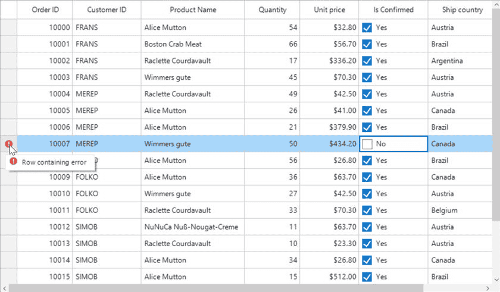

# Data Validation in Windows Forms DataGrid (SfDataGrid)
SfDataGrid allows to validate the data and display hints in case of validation is not passed. In case of invalid data, error icon is displayed at the left corner of cell. When mouse hover the error icon, error information will be displayed in tooltip.

## Built-in Validations
Built-in validations through[IDataErrorInfo](https://learn.microsoft.com/en-us/dotnet/api/system.componentmodel.idataerrorinfo?view=net-5.0), [INotifyDataErrorInfo](https://learn.microsoft.com/en-us/dotnet/api/system.componentmodel.inotifydataerrorinfo?view=net-5.0) and Data annotation attributes, can be enabled by setting [SfDataGrid.GridValidationMode](https://help.syncfusion.com/cr/windowsforms/Syncfusion.WinForms.DataGrid.SfDataGrid.html#Syncfusion_WinForms_DataGrid_SfDataGrid_ValidationMode) or [GridColumn.GridValidationMod](https://help.syncfusion.com/cr/windowsforms/Syncfusion.WinForms.DataGrid.GridColumnBase.html#Syncfusion_WinForms_DataGrid_GridColumnBase_ValidationMode)e properties.
`GridColumn.GridValidationMode` takes priority than `SfDataGrid.GridValidationMode`.

* `GridValidation.InEdit` - display error icon & tips and also doesn’t allows the users to commit the invalid data without allowing users to edit other cells.
* `GridValidation.InView` - displays error icons and tips alone.
* `GridValidation.None` - disables built-in validation support.

### Using IDataErrorInfo

#### Cell Validation
SfDataGrid provides support to validate the data based on [IDataErrorInfo](https://learn.microsoft.com/en-us/dotnet/api/system.componentmodel.idataerrorinfo?view=net-5.0). This can be enabled by setting the [SfDataGrid.ValidationMode](https://help.syncfusion.com/cr/windowsforms/Syncfusion.WinForms.DataGrid.SfDataGrid.html#Syncfusion_WinForms_DataGrid_SfDataGrid_ValidationMode) or [GridColumn.ValidationMode](https://help.syncfusion.com/cr/windowsforms/Syncfusion.WinForms.DataGrid.GridColumnBase.html#Syncfusion_WinForms_DataGrid_GridColumnBase_ValidationMode) property to `InEdit` or `InView`.



public partial class OrderInfo : IDataErrorInfo
{
    /// 

    /// Initializes a new instance of the <see cref="OrderInfo"/> class.
    /// 

    public OrderInfo()
    { }

    /// 

    /// Gets or sets quantity
    /// 

    /// <value>the quantity</value>     
    public int Quantity {get; set;}

    public string Error
    {
        get { return string.Empty; }
    }

    public string this[string columnName]
    {
        get
        {
            if (columnName == "Quantity" && this.Quantity < 30)
                return "The quantity is less than minimum";

            return string.Empty;
        }
    }
}


Partial Public Class OrderInfo
	Implements IDataErrorInfo
	''' 

	''' Initializes a new instance of the <see cref="OrderInfo"/> class.
	''' 

	Public Sub New()
	End Sub

	''' 

	''' Gets or sets quantity
	''' 

	''' <value>the quantity</value>     
	Public Property Quantity() As Integer

	Public ReadOnly Property [Error]() As String
		Get
			Return String.Empty
		End Get
	End Property

	Default Public ReadOnly Property Item(ByVal columnName As String) As String
		Get
			If columnName = "Quantity" AndAlso Me.Quantity < 30 Then
				Return "The quantity is less than minimum"
			End If

			Return String.Empty
		End Get
	End Property
End Class



Enable the validation for the SfDataGrid,



// Set the validation mode for the grid.
this.sfDataGrid.ValidationMode = GridValidationMode.InEdit;

//Or

// Set the validation mode only for the particular column.
this.sfDataGrid.Columns["Quantity"].ValidationMode = GridValidationMode.InEdit;
]

' Set the validation mode for the grid.
Me.sfDataGrid.ValidationMode = GridValidationMode.InEdit

'Or

' Set the validation mode only for the particular column.
Me.sfDataGrid.Columns("Quantity").ValidationMode = GridValidationMode.InEdit



#### Row Validation
The error icon can be displayed in the row header by using the [IDataErrorInfo.Error](https://learn.microsoft.com/en-us/dotnet/api/system.componentmodel.idataerrorinfo.error?view=net-5.0) property. The `IDataErrorInfo.Error` text will be displayed in the error tool tip of the row header,



public partial class OrderInfo : IDataErrorInfo
{
    /// 

    /// Initializes a new instance of the <see cref="OrderInfo"/> class.
    /// 

    public OrderInfo()
    { }
    [Display(AutoGenerateField = false)]
    public string Error
    {
        get
        { 
           if (this.Country.Contains("Germany") || this.Country.Contains("UK"))
                return "Delivery not available for the country " + this.Country;
               return string.Empty;
        }
    }
    public string this[string columnName]
    {
        get
        {
            return string.Empty;
        }
    }
}


Partial Public Class OrderInfo
	Implements IDataErrorInfo
	''' 

	''' Initializes a new instance of the <see cref="OrderInfo"/> class.
	''' 

	Public Sub New()
	End Sub

		  <Display(AutoGenerateField := False)>
		  Public ReadOnly Property [Error]() As String
				  Get
						   If Me.Country.Contains("Germany") OrElse Me.Country.Contains("UK") Then
									Return "Delivery not available for the country " & Me.Country
						   End If
						   Return String.Empty
				  End Get
		  End Property

	Default Public ReadOnly Property Item(ByVal columnName As String) As String
		Get
			Return String.Empty
		End Get
	End Property
End Class



### Using INotifyDataErrorInfo

#### Cell Validation
The data can be validated by inheriting the [INotifyDataErrorInfo](https://learn.microsoft.com/en-us/dotnet/api/system.componentmodel.inotifydataerrorinfo?view=net-5.0) interface in model class.



public class OrderInfo : INotifyDataErrorInfo
{
    private List<string> errors = new List<string>();    

    private string shipCountry;

    [Display(Name = "Ship Address")]
    public string ShipCountry
    {
        get { return shipCountry; }
        set { shipCountry = value; }
    }

    public System.Collections.IEnumerable GetErrors(string propertyName)
    {
        if (!propertyName.Equals("ShipCountry "))
            return null;

        if (this.ShipCity.Contains("Mexico"))
            errors.Add("Delivery not available for the city " + ShipCountry);

        return errors;
    }

    [Display(AutoGenerateField = false)]
    public bool HasErrors
    {
        get
        {
            return false;
        }
    }

    public event EventHandler<DataErrorsChangedEventArgs> ErrorsChanged;
}


Public Class OrderInfo
	Implements INotifyDataErrorInfo
	Private errors As New List(Of String)()

	Private _shipCountry As String

	<Display(Name := "Ship Address")>
	Public Property ShipCountry() As String
		Get
			Return _shipCountry
		End Get
		Set(ByVal value As String)
			_shipCountry = value
		End Set
	End Property

	Public Function GetErrors(ByVal propertyName As String) As System.Collections.IEnumerable
		If Not propertyName.Equals("ShipCountry ") Then
			Return Nothing
		End If

		If Me.ShipCity.Contains("Mexico") Then
			errors.Add("Delivery not available for the city " & ShipCountry)
		End If

		Return errors
	End Function

	<Display(AutoGenerateField := False)>
	Public ReadOnly Property HasErrors() As Boolean
		Get
			Return False
		End Get
	End Property

	Public Event ErrorsChanged As EventHandler(Of DataErrorsChangedEventArgs)
End Class



#### Row Validation
The error message can be shown in a row header by setting [INotifyDataErrorInfo.HasErrors](https://learn.microsoft.com/en-us/dotnet/api/system.componentmodel.inotifydataerrorinfo.haserrors?view=net-5.0). By default error message “Row Containing Error” will be displayed as an error message. This can be modified by changing the `RowErrorMessage` in the resx file.



public class OrderInfo : INotifyDataErrorInfo
{
    private List<string> errors = new List<string>();    
    private string shipCountry;
    [Display(Name = "Ship Address")]
    public string ShipCountry
    {
        get { return shipCountry; }
        set { shipCountry = value; }
    }
    public System.Collections.IEnumerable GetErrors(string propertyName)
    {
        return null;
    }
    [Display(AutoGenerateField = false)]
    public bool HasErrors
    {
        get
        {
           if (this.ShipCountry.Contains("Mexico"))
               return true;
            return false;
        }
    }
    public event EventHandler<DataErrorsChangedEventArgs> ErrorsChanged;
}


Public Class OrderInfo
	Implements INotifyDataErrorInfo
	Private errors As New List(Of String)()
	Private _shipCountry As String
	<Display(Name := "Ship Address")>
	Public Property ShipCountry() As String
		Get
			Return _shipCountry
		End Get
		Set(ByVal value As String)
			_shipCountry = value
		End Set
	End Property
	Public Function GetErrors(ByVal propertyName As String) As System.Collections.IEnumerable
		Return Nothing
	End Function
	<Display(AutoGenerateField := False)>
	Public ReadOnly Property HasErrors() As Boolean
		Get
		   If Me.ShipCountry.Contains("Mexico") Then
			   Return True
		   End If
			Return False
		End Get
	End Property
	Public Event ErrorsChanged As EventHandler(Of DataErrorsChangedEventArgs)
End Class



N> The `INotifyDataErrorInfo` is available from the .NET framework 4.5.

### Using Data Annotation
The SfDataGrid allows to validate the data using data annotation attributes by setting `SfDataGrid.ValidationMode` or `GridColumn.ValidationMode` property to `InEdit` or `InView`.

#### Numeric Validation
The numeric type like int, double, decimal properties can be validated using [Range attributes](https://learn.microsoft.com/en-us/dotnet/api/system.componentmodel.dataannotations.rangeattribute?view=net-5.0).



private int orderID;
[Range(10001, 10005, ErrorMessage = "OrderID between 10001 and 10005 alone processed")]        
public int OrderID
{
    get { return orderID; }
    set { orderID = value; }
}

private decimal price;
[Range(typeof(decimal),"12","20")]
public decimal Price
{
    get { return price; }
    set { price = value; }
}


Private _orderID As Integer
<Range(10001, 10005, ErrorMessage := "OrderID between 10001 and 10005 alone processed")>
Public Property OrderID() As Integer
	Get
		Return _orderID
	End Get
	Set(ByVal value As Integer)
		_orderID = value
	End Set
End Property

Private _price As Decimal
<Range(GetType(Decimal),"12","20")>
Public Property Price() As Decimal
	Get
		Return _price
	End Get
	Set(ByVal value As Decimal)
		_price = value
	End Set
End Property



#### String Validation
The string type property can be validated using [Required](https://learn.microsoft.com/en-us/dotnet/api/system.componentmodel.dataannotations.requiredattribute?view=net-5.0), [String Length attributes](https://learn.microsoft.com/en-us/dotnet/api/system.componentmodel.dataannotations.stringlengthattribute?view=net-5.0)



private string shippingCity;
[Required]
public string ShipCity
{
    get { return shippingCity; }
    set { shippingCity = value; }
}

private string productName;
[StringLength(17)]
public string ProductName
{
    get { return productName; }
    set { productName = value; }
}


Private shippingCity As String
<Required>
Public Property ShipCity() As String
	Get
		Return shippingCity
	End Get
	Set(ByVal value As String)
		shippingCity = value
	End Set
End Property

Private _productName As String
<StringLength(17)>
Public Property ProductName() As String
	Get
		Return _productName
	End Get
	Set(ByVal value As String)
		_productName = value
	End Set
End Property



#### RegularExpression Validation
The data that has heterogeneous type (combination of number, special character) can be validated using RegularExpressions.



[RegularExpressionAttribute(@"^[a-zA-Z]{1,40}$", ErrorMessage = "Numbers and special characters not allowed")]
public string CustomerID
{
    get
    {
        return this.customerID;
    }
    set
    {
        this.customerID = value;
    }
}


<RegularExpressionAttribute("^[a-zA-Z]{1,40}$", ErrorMessage := "Numbers and special characters not allowed")>
Public Property CustomerID() As String
	Get
		Return Me.customerID
	End Get
	Set(ByVal value As String)
		Me.customerID = value
	End Set
End Property



## Custom Validations
The current cell and row validations can be customized by using the [CurrentCellValidating](https://help.syncfusion.com/cr/windowsforms/Syncfusion.WinForms.DataGrid.SfDataGrid.html#Syncfusion_WinForms_DataGrid_SfDataGrid_CurrentCellValidating) and [RowValidating](https://help.syncfusion.com/cr/windowsforms/Syncfusion.WinForms.DataGrid.SfDataGrid.html#Syncfusion_WinForms_DataGrid_SfDataGrid_RowValidating) events. SfDataGrid will not allow to edit other cell / row if validation failed.

### Cell Validation
The cell validation can be customized by using the `CurrentCellValidating` event. This event will be raised when the edited cells tries to commit the data or lose the focus.



this.sfDataGrid.CurrentCellValidating += sfDataGrid_CurrentCellValidating;
void sfDataGrid_CurrentCellValidating(object sender, CurrentCellValidatingEventArgs e)
{
    if (e.NewValue.ToString().Equals("10004"))
    {
        e.IsValid = false;
        e.ErrorMessage = "OrderID 10004 cannot be passed";
    }
}


AddHandler sfDataGrid.CurrentCellValidating, AddressOf sfDataGrid_CurrentCellValidating
Private Sub sfDataGrid_CurrentCellValidating(ByVal sender As Object, ByVal e As CurrentCellValidatingEventArgs)
	If e.NewValue.ToString().Equals("10004") Then
		e.IsValid = False
		e.ErrorMessage = "OrderID 10004 cannot be passed"
	End If
End Sub



The current cell will not end the editing until the CurrentCell validation is passed. To get pass the cell validation need to enter the valid input to the cell. 
The [SfDataGrid.CurrentCellValidated](https://help.syncfusion.com/cr/windowsforms/Syncfusion.WinForms.DataGrid.SfDataGrid.html#Syncfusion_WinForms_DataGrid_SfDataGrid_CurrentCellValidated) event triggered when the cell has finished validating with valid data.



this.sfDataGrid.CurrentCellValidated += sfDataGrid_CurrentCellValidated;

void sfDataGrid_CurrentCellValidated(object sender, CurrentCellValidatedEventArgs e)
{
    MessageBox.Show("Cell validation is passed.");
}


AddHandler Me.sfDataGrid1.CurrentCellValidated, AddressOf sfDataGrid_CurrentCellValidated

Private Sub sfDataGrid_CurrentCellValidated(ByVal sender As Object, ByVal e As CurrentCellValidatedEventArgs)
    MessageBox.Show("Cell validation is passed.")
End Sub




### Row Validation
The row can be validated by using the [RowValidating](https://help.syncfusion.com/cr/windowsforms/Syncfusion.WinForms.DataGrid.SfDataGrid.html#Syncfusion_WinForms_DataGrid_SfDataGrid_RowValidating) event when the cell is edited. This event occurs when the edited cells tries to commit the row data or lose the focus.



this.sfDataGrid.RowValidating += sfDataGrid_RowValidating;
void sfDataGrid_RowValidating(object sender, RowValidatingEventArgs e)
{
    var data = e.DataRow.RowData as OrderInfo;
    if (data.CustomerID.Equals("AROUT"))
    {
        e.IsValid = false;
        e.ErrorMessage ="Customer AROUT cannot be passed";
    }
}



AddHandler sfDataGrid.RowValidating, AddressOf sfDataGrid_RowValidating
Private Sub sfDataGrid_RowValidating(ByVal sender As Object, ByVal e As RowValidatingEventArgs)
	Dim data = TryCast(e.DataRow.RowData, OrderInfo)

	If data.CustomerID.Equals("AROUT") Then
		e.IsValid = False
		e.ErrorMessage ="Customer AROUT cannot be passed"
	End If
End Sub



[SfDataGrid.RowValidated](https://help.syncfusion.com/cr/windowsforms/Syncfusion.WinForms.DataGrid.SfDataGrid.html#Syncfusion_WinForms_DataGrid_SfDataGrid_RowValidated) event triggered when the row has finished validating with valid row data.



this.sfDataGrid1.RowValidated += sfDataGrid1_RowValidated;
void sfDataGrid1_RowValidated(object sender, RowValidatedEventArgs e)
{
    MessageBox.Show("Row validation is completed");
}


AddHandler sfDataGrid1.RowValidated, AddressOf sfDataGrid1_RowValidated
Private Sub sfDataGrid1_RowValidated(ByVal sender As Object, ByVal e As RowValidatedEventArgs)
	MessageBox.Show("Row validation is completed")
End Sub



### Validation for GridCheckboxColumn
Since the [GridCheckBoxColumn](https://help.syncfusion.com/cr/windowsforms/Syncfusion.WinForms.DataGrid.GridCheckBoxColumn.html) is a non-editable column, the validation can be achieved by using the [SetCurrentCellValidated](https://help.syncfusion.com/cr/windowsforms/Syncfusion.WinForms.DataGrid.SfDataGrid.html#Syncfusion_WinForms_DataGrid_SfDataGrid_SetCurrentCellValidated_System_Boolean_) and [SetCurrentRowValidated](https://help.syncfusion.com/cr/windowsforms/Syncfusion.WinForms.DataGrid.SfDataGrid.html#Syncfusion_WinForms_DataGrid_SfDataGrid_SetCurrentRowValidated_System_Boolean_) methods.

Cell validation can be achieved by calling the [SetCurrentCellValidated](https://help.syncfusion.com/cr/windowsforms/Syncfusion.WinForms.DataGrid.SfDataGrid.html#Syncfusion_WinForms_DataGrid_SfDataGrid_SetCurrentCellValidated_System_Boolean_) method with a `false` value as a parameter inside the corresponding [SfDataGrid.CellCheckBoxClick](https://help.syncfusion.com/cr/windowsforms/Syncfusion.WinForms.DataGrid.SfDataGrid.html#Syncfusion_WinForms_DataGrid_SfDataGrid_CellCheckBoxClick) event. The [CurrentCellValidating](https://help.syncfusion.com/cr/windowsforms/Syncfusion.WinForms.DataGrid.SfDataGrid.html#Syncfusion_WinForms_DataGrid_SfDataGrid_CurrentCellValidating) event will be triggered when attempting to navigate the current cell.



this.sfDataGrid.CellCheckBoxClick += SfDataGrid_CellCheckBoxClick;
private void SfDataGrid_CellCheckBoxClick(object sender, CellCheckBoxClickEventArgs e)
{
    if(e.Column.CellType == "CheckBox")
        this.sfDataGrid.SetCurrentCellValidated(false);
}


AddHandler sfDataGrid.CellCheckBoxClick, AddressOf sfDataGrid_CellCheckBoxClick
Private Sub sfDataGrid_CellCheckBoxClick(sender As Object, e As CellCheckBoxClickEventArgs)
    If e.Column.CellType = "CheckBox" Then
        sfDataGrid.SetCurrentCellValidated(False)
    End If
End Sub



Row validation can be achieved by calling the [SetCurrentRowValidated](https://help.syncfusion.com/cr/windowsforms/Syncfusion.WinForms.DataGrid.SfDataGrid.html#Syncfusion_WinForms_DataGrid_SfDataGrid_SetCurrentRowValidated_System_Boolean_) method with a `false` value as a parameter inside the corresponding [SfDataGrid.CellCheckBoxClick](https://help.syncfusion.com/cr/windowsforms/Syncfusion.WinForms.DataGrid.SfDataGrid.html#Syncfusion_WinForms_DataGrid_SfDataGrid_CellCheckBoxClick) event. The [RowValidating](https://help.syncfusion.com/cr/windowsforms/Syncfusion.WinForms.DataGrid.SfDataGrid.html#Syncfusion_WinForms_DataGrid_SfDataGrid_RowValidating) event will be triggered when attempting to navigate the current cell to another row.



this.sfDataGrid.CellCheckBoxClick += SfDataGrid_CellCheckBoxClick;
private void SfDataGrid_CellCheckBoxClick(object sender, CellCheckBoxClickEventArgs e)
{
    this.sfDataGrid.SetCurrentRowValidated(false);
}


AddHandler sfDataGrid.CellCheckBoxClick, AddressOf sfDataGrid_CellCheckBoxClick
Private Sub sfDataGrid_CellCheckBoxClick(sender As Object, e As CellCheckBoxClickEventArgs)
    sfDataGrid.SetCurrentRowValidated(False)
End Sub



## Customizing Error Icon and ToolTip

### Error Icon Customization
The custom error icon can be set by using the [ErrorIcon](https://help.syncfusion.com/cr/windowsforms/Syncfusion.WinForms.DataGrid.Styles.DataGridStyle.html#Syncfusion_WinForms_DataGrid_Styles_DataGridStyle_ErrorIcon) property.



//Setting the custom error icon
this.sfDataGrid.Style.ErrorIcon = SystemIcons.Error.ToBitmap();


'Setting the custom error icon
Me.sfDataGrid.Style.ErrorIcon = SystemIcons.Error.ToBitmap()



The error icons displayed in the cell and row header can be disabled by setting the [ShowErrorIcon](https://help.syncfusion.com/cr/windowsforms/Syncfusion.WinForms.DataGrid.SfDataGrid.html#Syncfusion_WinForms_DataGrid_SfDataGrid_ShowErrorIcon) and [ShowRowHeaderErrorIcon](https://help.syncfusion.com/cr/windowsforms/Syncfusion.WinForms.DataGrid.SfDataGrid.html#Syncfusion_WinForms_DataGrid_SfDataGrid_ShowRowHeaderErrorIcon) properties to `false`. 



// Disable the Error Icon in Cell level
this.sfDataGrid.ShowErrorIcon = false;

// Disables the error icon in row header
this.sfDataGrid.ShowRowHeaderErrorIcon = false;


' Disable the Error Icon in Cell level
Me.sfDataGrid.ShowErrorIcon = False

' Disables the error icon in row header
Me.sfDataGrid.ShowRowHeaderErrorIcon = False



### Customizing the Error Tip 
The tool tip of the data validation can be customized by using the [ValidationErrorToolTipOpening](https://help.syncfusion.com/cr/windowsforms/Syncfusion.WinForms.DataGrid.SfDataGrid.html#Syncfusion_WinForms_DataGrid_SfDataGrid_ValidationErrorToolTipOpening) event. This event will be raised when the mouse is hovered on the error icon.



this.sfDataGrid.ValidationErrorToolTipOpening += sfDataGrid_ValidationErrorToolTipOpening;

void sfDataGrid_ValidationErrorToolTipOpening(object sender, ValidationErrorToolTipOpeningEventArgs e)
{
    if(e.Column != null && e.Column.MappingName == "OrderID")
    {              
        e.ToolTipInfo.Items[0].Style.BackColor = Color.Green;
        e.ToolTipInfo.Items[0].Style.ForeColor = Color.White;                
    }
}


AddHandler sfDataGrid.ValidationErrorToolTipOpening, AddressOf sfDataGrid_ValidationErrorToolTipOpening

Private Sub sfDataGrid_ValidationErrorToolTipOpening(ByVal sender As Object, ByVal e As ValidationErrorToolTipOpeningEventArgs)
	If e.Column IsNot Nothing AndAlso e.Column.MappingName = "OrderID" Then
		e.ToolTipInfo.Items(0).Style.BackColor = Color.Green
		e.ToolTipInfo.Items(0).Style.ForeColor = Color.White
	End If
End Sub



The validation error tool tip can be disabled by setting the [ShowValidationErrorToolTip](https://help.syncfusion.com/cr/windowsforms/Syncfusion.WinForms.DataGrid.SfDataGrid.html#Syncfusion_WinForms_DataGrid_SfDataGrid_ShowValidationErrorToolTip) property to `false`.



// Disable the validation tool tip.
this.sfDataGrid.ShowValidationErrorToolTip = false;


' Disable the validation tool tip.
Me.sfDataGrid.ShowValidationErrorToolTip = False



N> SfToolTip has used for the validation error  tool tip support in the SfDataGrid. Refer [user guide](https://help.syncfusion.com/windowsforms/tooltip/overview) of SfToolTip for more customizations options.

## Limitations
* Non editable columns will not support custom validation.
* CurrentCellValidating event will not triggered for the GridUnboundColumn, AddNewRow and FilterRow.

## See also

[How to change the ValidationMode of the GridNumericColumn in WinForms DataGrid (SfDataGrid)](https://support.syncfusion.com/kb/article/8276/how-to-change-the-validationmode-of-the-gridnumericcolumn-in-winforms-datagrid-sfdatagrid)
