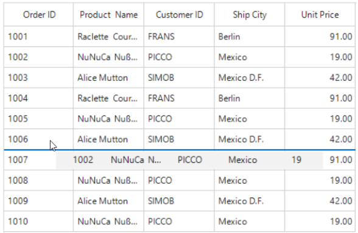
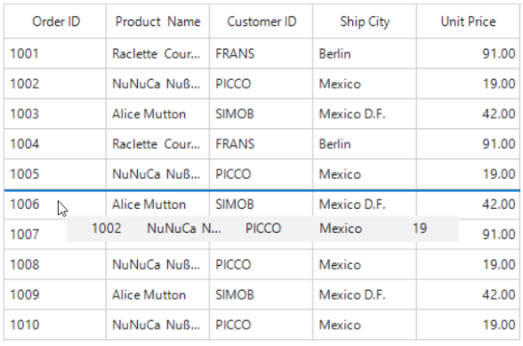
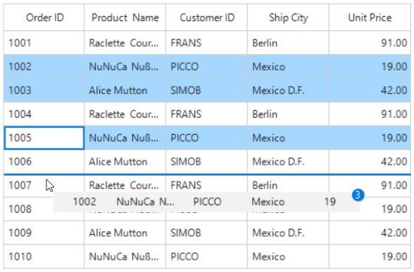
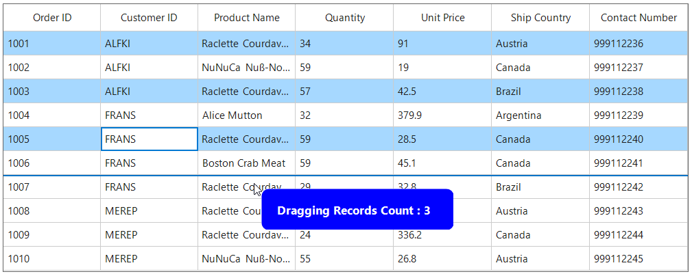
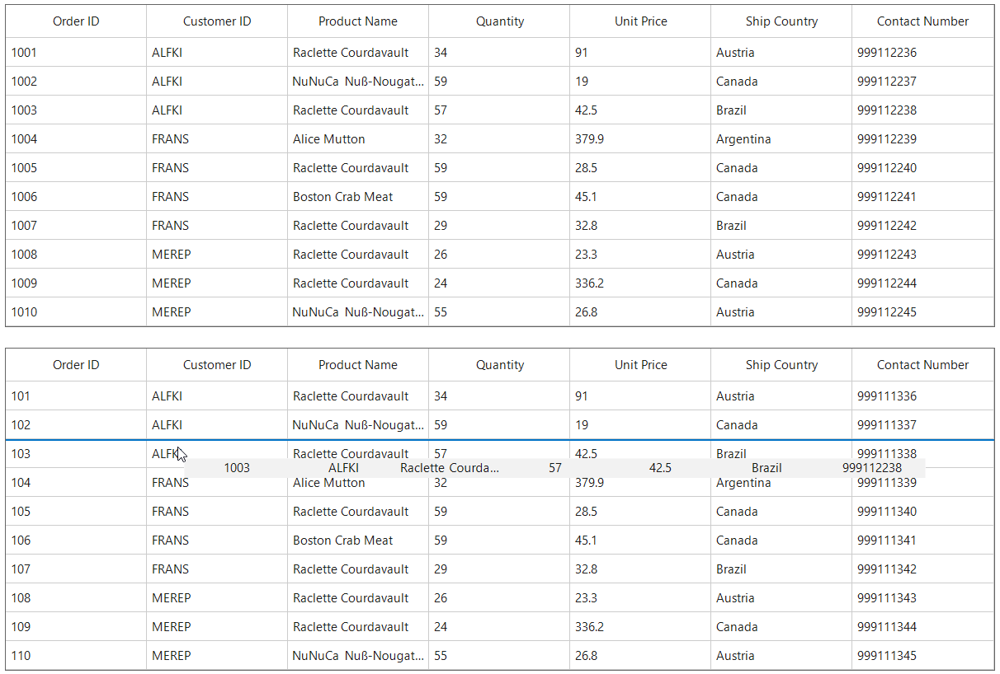

# Drag and Drop in WinForms DataGrid (SfDataGrid)

## Column Drag and Drop
SfDataGrid allow end-users to rearrange the columns by drag and drop the column headers by setting [SfDataGrid.AllowDraggingColumns](https://help.syncfusion.com/cr/windowsforms/Syncfusion.WinForms.DataGrid.SfDataGrid.html#Syncfusion_WinForms_DataGrid_SfDataGrid_AllowDraggingColumns) to true.


sfDataGrid.AllowDraggingColumns = true;


sfDataGrid.AllowDraggingColumns = True



The drag and drop operation for particular column can be enabled or disabled using the [AllowDragging](https://help.syncfusion.com/cr/windowsforms/Syncfusion.WinForms.DataGrid.GridColumnBase.html#Syncfusion_WinForms_DataGrid_GridColumnBase_AllowDragging) property.


sfDataGrid.Columns[0].AllowDragging = false;


sfDataGrid.Columns(0).AllowDragging = False



### Disable Column Reordering
The [ColumnDragging](https://help.syncfusion.com/cr/windowsforms/Syncfusion.WinForms.DataGrid.SfDataGrid.html#Syncfusion_WinForms_DataGrid_SfDataGrid_ColumnDragging) event occurs when start dragging the column header. The dragging operation of the particular column can canceled by handling the `ColumnDragging` event. [ColumnDraggingEventArgs](https://help.syncfusion.com/cr/windowsforms/Syncfusion.WinForms.DataGrid.Events.ColumnDraggingEventArgs.html) of `ColumnDragging` event provides information about the column triggered this event.

#### Cancel Dragging Operation
SfDataGrid allow to cancel dragging operation for particular column by handling the `ColumnDragging` event when the `e.Reason` is `ColumnDraggingAction.DragStarting`.


sfDataGrid.ColumnDragging += sfDataGrid_ColumnDragging;

void sfDataGrid_ColumnDragging(object sender, Syncfusion.WinForms.DataGrid.Events.ColumnDraggingEventArgs e)
{
    var column = sfDataGrid.Columns[e.From];
    if (column.MappingName == "OrderID" && e.Reason == ColumnDraggingAction.DragStarting)
    {
        e.Cancel = true;
    }
}


AddHandler sfDataGrid.ColumnDragging, AddressOf sfDataGrid_ColumnDragging

Private Sub sfDataGrid_ColumnDragging(ByVal sender As Object, ByVal e As Syncfusion.WinForms.DataGrid.Events.ColumnDraggingEventArgs)
	Dim column = sfDataGrid.Columns(e.From)

	If column.MappingName = "OrderID" AndAlso e.Reason = ColumnDraggingAction.DragStarting Then
		e.Cancel = True
	End If
End Sub



#### Cancel Column Reordering
SfDataGrid allow to cancel dropping a column at particular column by handling the `ColumnDragging` event with `e.Reason` is `ColumnDraggingAction.Dropping`.


sfDataGrid.ColumnDragging += sfDataGrid_ColumnDragging;

void sfDataGrid_ColumnDragging(object sender, Syncfusion.WinForms.DataGrid.Events.ColumnDraggingEventArgs e)
{
    if (e.Reason == ColumnDraggingAction.Dropping)
    {
        var column = sfDataGrid.Columns[e.To];
        if (column.MappingName == "ProductName")
        {
            e.Cancel = true;
        }
    }
}


AddHandler sfDataGrid.ColumnDragging, AddressOf sfDataGrid_ColumnDragging

Private Sub sfDataGrid_ColumnDragging(ByVal sender As Object, ByVal e As Syncfusion.WinForms.DataGrid.Events.ColumnDraggingEventArgs)
	If e.Reason = ColumnDraggingAction.Dropping Then
		Dim column = sfDataGrid.Columns(e.To)

		If column.MappingName = "ProductName" Then
			e.Cancel = True
		End If
	End If
End Sub


### Drag and Drop Customization
The drag-and-drop operations can be changed by overriding the virtual methods of [ColumnDragDropController](https://help.syncfusion.com/cr/windowsforms/Syncfusion.WinForms.DataGrid.Interactivity.ColumnDragDropController.html) class and assigning it to [SfDataGrid.ColumnDragDropController](https://help.syncfusion.com/cr/windowsforms/Syncfusion.WinForms.DataGrid.SfDataGrid.html#Syncfusion_WinForms_DataGrid_SfDataGrid_ColumnDragDropController).



sfDataGrid.ColumnDragDropController = new CustomDragAndDropController(sfDataGrid.TableControl, sfDataGrid.GroupPanel);

public class CustomDragAndDropController : ColumnDragDropController
{
    public CustomDragAndDropController(TableControl tableControl, GroupPanel groupPanel)
        : base(tableControl, groupPanel)
    {
    }

    protected override bool CanShowPopup(GridColumn column)
    {
        if (column.MappingName == "UnitPrice")
            return false;
        return base.CanShowPopup(column);
    }

    protected override void PopupDroppedOnHeaderRow(int oldIndex, int newIndex)
    {
        if (newIndex == 0)
            return;
        base.PopupDroppedOnHeaderRow(oldIndex, newIndex);
    }

    protected override void PopupDroppedOnGroupDropArea(GridColumn draggingColumn, MouseEventArgs e)
    {
        if (draggingColumn.MappingName == "OrderID")
            return;
        base.PopupDroppedOnGroupDropArea(draggingColumn, e);
    }
}


sfDataGrid.ColumnDragDropController = New CustomDragAndDropController(sfDataGrid.TableControl, sfDataGrid.GroupPanel)

public class CustomDragAndDropController : ColumnDragDropController
	public CustomDragAndDropController(TableControl tableControl, GroupPanel groupPanel)
		MyBase.New(tableControl, groupPanel)

	protected override Boolean CanShowPopup(GridColumn column)
		If column.MappingName = "UnitPrice" Then
			Return False
		End If
		Return MyBase.CanShowPopup(column)

	protected override void PopupDroppedOnHeaderRow(Integer oldIndex, Integer newIndex)
		If newIndex = 0 Then
			Return
		End If
		MyBase.PopupDroppedOnHeaderRow(oldIndex, newIndex)

	protected override void PopupDroppedOnGroupDropArea(GridColumn draggingColumn, MouseEventArgs e)
		If draggingColumn.MappingName = "OrderID" Then
			Return
		End If
		MyBase.PopupDroppedOnGroupDropArea(draggingColumn, e)



### Disabling Drag and Drop between Frozen and Non-frozen Columns

By default, the columns re-ordering performed between any column regions of columns. The dropping action can cancel between the frozen and non-frozen columns by handling `SfDataGrid.ColumnDragging` event.


sfDataGrid.ColumnDragging += sfDataGrid_ColumnDragging;

void sfDataGrid_ColumnDragging(object sender, Syncfusion.WinForms.DataGrid.Events.ColumnDraggingEventArgs e)
{
    if (e.Reason == ColumnDraggingAction.Dropping)
    {
        var frozenColIndex = this.sfDataGrid.FrozenColumnCount + this.sfDataGrid.TableControl.ResolveToStartColumnIndex();
        if (e.From < frozenColIndex && e.To > frozenColIndex - 1)
            e.Cancel = true;
        if (e.From > frozenColIndex && e.To < frozenColIndex || (e.From == frozenColIndex && e.To < frozenColIndex))
            e.Cancel = true;
    }
}


AddHandler sfDataGrid.ColumnDragging, AddressOf sfDataGrid_ColumnDragging

Private Sub sfDataGrid_ColumnDragging(ByVal sender As Object, ByVal e As Syncfusion.WinForms.DataGrid.Events.ColumnDraggingEventArgs)
	If e.Reason = ColumnDraggingAction.Dropping Then
		Dim frozenColIndex = Me.sfDataGrid.FrozenColumnCount + Me.sfDataGrid.TableControl.ResolveToStartColumnIndex()
		If e.From < frozenColIndex AndAlso e.To > frozenColIndex - 1 Then
			e.Cancel = True
		End If
		If e.From > frozenColIndex AndAlso e.To < frozenColIndex OrElse (e.From Is frozenColIndex AndAlso e.To < frozenColIndex) Then
			e.Cancel = True
		End If
	End If
End Sub



N> `FrozenColumnCount` and `FooterColumnCount` should be lesser than the number of columns that can be displayed in view.

## Row Drag and Drop
WinForms DataGrid allows drag and drop the rows within and between controls by setting the **AllowDraggingRows** and **AllowDrop** property as true. It is also possible to drag and drop the rows between datagrids. SfDataGrid allows dropping rows when **AllowDrop** is true and allows dragging when **AllowDraggingRows** is true.



this.sfDataGrid.AllowDraggingRows = true;
this.sfDataGrid.AllowDrop = true;


Me.sfDataGrid.AllowDraggingRows = True
Me.sfDataGrid.AllowDrop = True



While dropping, the dragged records can be added above or below to the target record based on its drop indicator.

For example, if you dropped record at the bottom of the targeted record, it will be added below the targeted record.

If you drop at the top of the targeted record, it will be added above the targeted record.

### Dragging multiple rows

WinForms DataGrid (SfDataGrid) allows to drag multiple selected rows. To enable multiple selection, set the [SfDataGrid.SelectionMode](https://help.syncfusion.com/cr/windowsforms/Syncfusion.WinForms.DataGrid.SfDataGrid.html#Syncfusion_WinForms_DataGrid_SfDataGrid_SelectionMode) as `Multiple` or `Extended`.

N> The drag selection cannot be performed while the **AllowDraggingRows** enabled as `true` in the SfDataGrid.

## Drag and drop events

SfDataGrid triggers the following events when drag and drop:

### Drag start event

**DragStart** event occurs when you start to drag the records in datagrid. The **GridRowDragStartEventArgs** has the following member, which provides information for the `DragStart` event.

- **DraggingRecords**: Gets the Records which contains the data associated while dragging the rows.



this.sfDataGrid.RowDragDropController.DragStart += RowDragDropController_DragStart;

private void RowDragDropController_DragStart(object sender, GridRowDragStartEventArgs e)
{    
}



### Drag over event

**DragOver** event occurs continuously while record is dragged within the target SfDataGrid. The **GridRowDragOverEventArgs** has the following members, which provide information for the `DragOver` event.

- **Data**: Gets a data object that contains the data associated while dragging the rows.
- **DropPosition**: Gets a value indicating the drop position which is based on dropped location
- **IsFromOutSideSource**: Gets a value indicating whether the dragging item is from same DataGrid or not.
- **ShowDragUI**: Gets or sets a value indicating the default Dragging UI.
- **TargetRecord**: Gets a value indicating the target record which is going to drop.



this.sfDataGrid.RowDragDropController.DragOver += RowDragDropController_DragOver;

private void RowDragDropController_DragOver(object sender, GridRowDragOverEventArgs e)
{
}



### Drag leave event

**DragLeave** event occurs when leave a drag-and-drop operation.The **GridRowDragLeaveEventArgs** has the following members, which provide information for the `DragLeave` event.

- **Data**: Gets a data object that contains the data associated while dragging the rows.
- **DropPosition**: Gets a value indicating the drop position which is based on dropped location
- **IsFromOutSideSource**: Gets a value indicating whether the dragging item is from same DataGrid or not.
- **TargetRecord**: Gets a value indicating the target record which is going to drop.



this.sfDataGrid.RowDragDropController.DragLeave += RowDragDropController_DragLeave;

private void RowDragDropController_DragLeave(object sender, GridRowDragLeaveEventArgs e)
{     
}



### Drop event

**Drop** event occurs when a record is dropping within the target SfDataGrid.The **GridRowDropEventArgs** has the following members, which provide information for the `Drop` event.

- **Data**: Gets a data object that contains the data associated while dragging the rows.
- **DraggingRecords**: Gets the Records which contains the data associated while dragging the rows.
- **DropPosition**: Gets a value indicating the drop position which is based on dropped location
- **IsFromOutSideSource**: Gets a value indicating whether the dragging item is from same DataGrid or not.
- **TargetRecord**: Gets a value indicating the target record which is going to drop.



this.sfDataGrid.RowDragDropController.Drop += RowDragDropController_Drop;

private void RowDragDropController_Drop(object sender, GridRowDropEventArgs e)
{      
}



### Dropped event

Dropped event occurs when a record is dropping within the target SfDataGrid. The GridRowDroppedEventArgs has the following members, which provide information for the Drop event.

- **Data**: Gets a data object that contains the data associated while dragging the rows.
- **DropPosition**: Gets a value indicating the drop position which is based on dropped location
- **IsFromOutSideSource**: Gets a value indicating whether the dragging item is from same DataGrid or not.
- **TargetRecord**: Gets a value indicating the target record which is going to drop.



this.sfDataGrid.RowDragDropController.Dropped += RowDragDropController_Dropped;

private void RowDragDropController_Dropped(object sender, GridRowDroppedEventArgs e)
{        
}



### Customizing row drag and drop operation

#### Disable dragging of certain rows in WinForms DataGrid

You can restrict the dragging of certain rows in SfDataGrid by using the **GridRowDragDropController.DragStart event**.



this.sfDataGrid.RowDragDropController.DragStart += RowDragDropController_DragStart;

private void RowDragDropController_DragStart(object sender, GridRowDragStartEventArgs e)
{
    var records = e.DraggingRecords;
    var order= records[0] as OrderInfo;
    // You can restrict the dragging for certain rows based on the record value also. 
    var rowIndex = this.sfDataGrid.TableControl.ResolveToRowIndex(orders);
    var recordIndex = this.sfDataGrid.TableControl.ResolveToRecordIndex(rowIndex);
    if (recordIndex > 5)
        e.Handled = true;
}



#### Disable dropping over certain rows in WinForms DataGrid

You can restrict the dropping the records in certain rows in SfDataGrid by using the **GridRowDragDropController.Drop event**.



this.sfDataGrid.RowDragDropController.Drop += RowDragDropController_Drop;

private void RowDragDropController_Drop(object sender, GridRowDropEventArgs e)
{
    var record = e.TargetRecord;
    //You can restrict the dropping for certain rows based on the target record index.
    var rowIndex = this.sfDataGrid.TableControl.ResolveToRowIndex(record);
    var recordIndex = this.sfDataGrid.TableControl.ResolveToRecordIndex(rowIndex);
    if (recordIndex > 5)
      e.Handled = true;
}



#### Disable the default drag UI

You can disable the draggable popup by setting the ShowDragUI as false in the DragOver event of **GridRowDragDropController.DragOver event**.



this.sfDataGrid.RowDragDropController.DragOver += RowDragDropController_DragOver;

private void RowDragDropController_DragOver(object sender, GridRowDragOverEventArgs e)
{
    e.ShowDragUI = false;
}



#### Customizing the Drag Preview Row

You can customize the appearance of the drag preview row by overriding the **DrawDragPreviewRow** method. 



this.sfDataGrid.RowDragDropController = new CustomizedRowDragDropController(sfDataGrid.TableControl);

public class CustomizedRowDragDropController : RowDragDropController
{
    public CustomizedRowDragDropController(TableControl tableControl) : base(tableControl) { }
    protected override Bitmap DrawDragPreviewRow(TableControl tableControl, List<int> rowIndexes)
    {
        int width = 240;
        int height = 60;
        var bmp = new Bitmap(width, height, System.Drawing.Imaging.PixelFormat.Format32bppPArgb);

        using (Graphics g = Graphics.FromImage(bmp))
        {
            g.SmoothingMode = System.Drawing.Drawing2D.SmoothingMode.AntiAlias;

            using (var bgBrush = new SolidBrush(Color.Blue))
            using (var path = new System.Drawing.Drawing2D.GraphicsPath())
            {
                path.AddArc(0, 0, 20, 20, 180, 90);
                path.AddArc(width - 20, 0, 20, 20, 270, 90);
                path.AddArc(width - 20, height - 20, 20, 20, 0, 90);
                path.AddArc(0, height - 20, 20, 20, 90, 90);
                path.CloseFigure();
                g.FillPath(bgBrush, path);
            }

            using (var font = new Font("Segoe UI", 10, FontStyle.Bold))
            using (var textBrush = new SolidBrush(Color.White))
            {
                g.DrawString("Dragging Records Count : "+ rowIndexes.Count, font, textBrush, new PointF(20, 20));
            }
        }

        return bmp;
    }
}



### Row drag and drop between two DataGrids

You can able row drag-and-drop between two SfDataGrid controls and control the behavior when dropping into another grid using the **CrossGridDropAction** property:
- **CrossGridDropAction.Move** : The dragged records are removed from the source grid and inserted into the target grid.
- **CrossGridDropAction.Copy** :  The dragged records are copied to the target grid without removing them from the source grid.

N> The `CrossGridDropAction` property applies only when rows are dragged between two `SfDataGrid` controls. Dragging from other controls (such as `ListView`) into an SfDataGrid does not support these actions.

### Limitations
- When grouping is applied, records cannot be dropped into a different group.
- When grouping is applied, dragging multiple rows is allowed only when all selected rows are within the same group.
- In Master-Details view, row drag-and-drop is supported only within the same DetailsViewDataGrid. 
- Cross-hierarchical drag-and-drop (between master and detail views) is not allowed.
- Cross-Grid Drop is not supported when grouping is applied in either of the grids.
