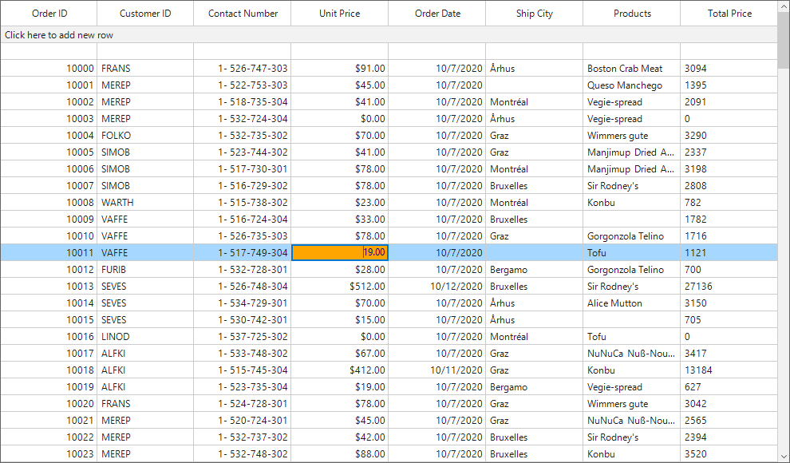

# Editing in Windows Forms DataGrid (SfDataGrid)
[Windows Forms DataGrid](https://www.syncfusion.com/winforms-ui-controls/datagrid) (SfDataGrid) provides support for editing and it can be enabled or disabled by setting [SfDataGrid.AllowEditing](https://help.syncfusion.com/cr/windowsforms/Syncfusion.WinForms.DataGrid.SfDataGrid.html#Syncfusion_WinForms_DataGrid_SfDataGrid_AllowEditing) property.



//Enable Editing for the whole grid. 
this.sfDataGrid.AllowEditing = true;


'Enable Editing for the whole grid. 
Me.sfDataGrid.AllowEditing = True



The editing can be enabled only for the particular columns by setting the [GridColumn.AllowEditing](https://help.syncfusion.com/cr/windowsforms/Syncfusion.WinForms.DataGrid.GridColumnBase.html#Syncfusion_WinForms_DataGrid_GridColumnBase_AllowEditing) property to `true`. 



// Enable editing for particular column.
this.sfDataGrid.Columns[0].AllowEditing = true;


' Enable editing for particular column.
Me.sfDataGrid.Columns(0).AllowEditing = True



**Note:**The `GridColumn.AllowEditing` has the high priority than the `SfDataGrid.AllowEditing`.

## Entering into Edit Mode
The current cell can be enter into edit mode by pressing &lt;kbd&gt;F2&lt;/kbd&gt; key or clicking (touch also supported) the cell. The edit mode of the cell can be changed to the single click or double click by setting the [EditMode](https://help.syncfusion.com/cr/windowsforms/Syncfusion.WinForms.DataGrid.SfDataGrid.html#Syncfusion_WinForms_DataGrid_SfDataGrid_EditMode) property.



// Enters to the edit mode of the cell using double click
this.sfDataGrid.EditMode = EditMode.DoubleClick;


' Enters to the edit mode of the cell using double click
Me.sfDataGrid.EditMode = EditMode.DoubleClick



## Cursor Placement
When the cell enters into edit mode, cursor is placed based on [EditorSelectionBehavior](https://help.syncfusion.com/cr/windowsforms/Syncfusion.WinForms.DataGrid.SfDataGrid.html#Syncfusion_WinForms_DataGrid_SfDataGrid_EditorSelectionBehavior) property.
The following types of [EditorSelectionBehavior](https://help.syncfusion.com/cr/windowsforms/Syncfusion.WinForms.DataGrid.Enums.EditorSelectionBehavior.html) is available,

* `Default` – Moves the cursor to the clicked position on the text.
* `SelectAll`– selects the text of edit element loaded inside cell.
* `MoveLast` – places the cursor at the last of edit element loaded inside cell.



// Select all the text while entering to the edit mode.
this.sfDataGrid.EditorSelectionBehavior = EditorSelectionBehavior.SelectAll;


' Select all the text while entering to the edit mode.
Me.sfDataGrid.EditorSelectionBehavior = EditorSelectionBehavior.SelectAll



## Customization Using Events

### Cancel the Editing of the Current Cell
The current cell editing can be canceled by using the [CurrentCellBeginEdit](https://help.syncfusion.com/cr/windowsforms/Syncfusion.WinForms.DataGrid.SfDataGrid.html) event. This event will be raised when the current cell enters to the edit mode.



this.sfDataGrid.CurrentCellBeginEdit += sfDataGrid_CurrentCellBeginEdit;

void sfDataGrid_CurrentCellBeginEdit(object sender, CurrentCellBeginEditEventArgs e)
{
    //Cancel the editing of the particular column.
    if (e.DataColumn.GridColumn.MappingName == "ProductName")
        e.Cancel = true;
}


AddHandler Me.sfDataGrid1.CurrentCellBeginEdit, AddressOf sfDataGrid_CurrentCellBeginEdit

Private Sub sfDataGrid_CurrentCellBeginEdit(ByVal sender As Object, ByVal e As CurrentCellBeginEditEventArgs)
    'Cancel the editing of the particular column.
    If e.DataColumn.GridColumn.MappingName = "ProductName" Then
        e.Cancel = True
    End If
End Sub




### Display Message Box on Current Cell Editing Complete
The editing completion of the current cell can be notified by using the [CurrentCellEndEdit](https://help.syncfusion.com/cr/windowsforms/Syncfusion.WinForms.DataGrid.SfDataGrid.html) event.



this.sfDataGrid.CurrentCellEndEdit += sfDataGrid_CurrentCellEndEdit;

void sfDataGrid_CurrentCellEndEdit(object sender, CurrentCellEndEditEventArgs e)
{
    MessageBox.Show("The editing is completed for the cell (" + e.DataRow.RowIndex + "," + e.DataColumn.ColumnIndex + ")");
}


AddHandler sfDataGrid.CurrentCellEndEdit, AddressOf sfDataGrid_CurrentCellEndEdit

Private Sub sfDataGrid_CurrentCellEndEdit(ByVal sender As Object, ByVal e As CurrentCellEndEditEventArgs)
	MessageBox.Show("The editing is completed for the cell (" & e.DataRow.RowIndex & "," & e.DataColumn.ColumnIndex & ")")
End Sub



### Change style of editor control

The style of editor control which displaying while editing the current cell can be modified using the [sfDataGrid.EditingControlShowing](https://help.syncfusion.com/cr/windowsforms/Syncfusion.WinForms.DataGrid.SfDataGrid.html#Syncfusion_WinForms_DataGrid_SfDataGrid_EditingControlShowing) event. You can set the style by using [Style](https://help.syncfusion.com/cr/windowsforms/Syncfusion.WinForms.DataGrid.Events.DataGridEditingControlShowingEventArgs.html#Syncfusion_WinForms_DataGrid_Events_DataGridEditingControlShowingEventArgs_Style) property available in the [DataGridEditingControlShowingEventArgs](https://help.syncfusion.com/cr/windowsforms/Syncfusion.WinForms.DataGrid.Events.DataGridEditingControlShowingEventArgs.html).



sfDataGrid.EditingControlShowing += SfDataGrid_EditingControlShowing;

private void SfDataGrid_EditingControlShowing(object sender, DataGridEditingControlShowingEventArgs e)
{
    e.Style.BackColor = Color.LightBlue;
    e.Style.TextColor = Color.White;
}



AddHandler sfDataGrid.EditingControlShowing, AddressOf SfDataGrid_EditingControlShowing

Private Sub SfDataGrid_EditingControlShowing(ByVal sender As Object, ByVal e As DataGridEditingControlShowingEventArgs)
	e.Style.BackColor = Color.LightBlue
	e.Style.TextColor = Color.White
End Sub




## Programmatic Editing 
The editing can be handled programmatically by using the [CurrentCellManager](https://help.syncfusion.com/cr/windowsforms/Syncfusion.WinForms.DataGrid.Interactivity.CurrentCellManager.html) which has the helper methods for handling the editing.

### Begin Editing 
The editing of the cell can be achieved by using the [CurrentCellManager.BeginEdit](https://help.syncfusion.com/cr/windowsforms/Syncfusion.WinForms.DataGrid.Interactivity.CurrentCellManager.html#Syncfusion_WinForms_DataGrid_Interactivity_CurrentCellManager_BeginEdit) method. Initially the `CurrentCell` need to set before calling the `BeginEdit` method



private void button1_Click(object sender, System.EventArgs e)
{
    RowColumnIndex rowColumnIndex = new RowColumnIndex(3, 2);
    this.sfDataGrid.MoveToCurrentCell(rowColumnIndex);
    this.sfDataGrid.CurrentCell.BeginEdit();
}


Private Sub button1_Click(ByVal sender As Object, ByVal e As System.EventArgs)
	Dim rowColumnIndex As New RowColumnIndex(3, 2)
	Me.sfDataGrid.MoveToCurrentCell(rowColumnIndex)
	Me.sfDataGrid.CurrentCell.BeginEdit()
End Sub



### End Editing
The editing can be end programmatically by using the [EndEdit](https://help.syncfusion.com/cr/windowsforms/Syncfusion.WinForms.DataGrid.Interactivity.CurrentCellManager.html#Syncfusion_WinForms_DataGrid_Interactivity_CurrentCellManager_EndEdit_System_Boolean_) method.



// End the editing of the current cell
this.sfDataGrid.CurrentCell.EndEdit();


' End the editing of the current cell
Me.sfDataGrid.CurrentCell.EndEdit()



### Cancel Editing
The editing can be canceled by calling the [CancelEdit](https://help.syncfusion.com/cr/windowsforms/Syncfusion.WinForms.DataGrid.Interactivity.CurrentCellManager.html#Syncfusion_WinForms_DataGrid_Interactivity_CurrentCellManager_CancelEdit) method. This will end the editing of the current cell by replacing the old value before entering to the edit mode.



// Cancel the editing of the current cell.
this.sfDataGrid.CurrentCell.CancelEdit();


' Cancel the editing of the current cell.
Me.sfDataGrid.CurrentCell.CancelEdit()



## Change a cell value programmatically

The value exists in a particular cell can be changed programmatically by using the row column index of the cell. 




// Modify the cell value for RowIndex = 5 and ColumnIndex = 2
int rowIndex = 5;
int columnIndex = sfDataGrid1.TableControl.ResolveToGridVisibleColumnIndex(2);
if (columnIndex < 0)
    return;
var mappingName = sfDataGrid1.Columns[columnIndex].MappingName;
var recordIndex = sfDataGrid1.TableControl.ResolveToRecordIndex(rowIndex);
if (recordIndex < 0)
    return;
object data;
if (sfDataGrid1.View.TopLevelGroup != null)
{
    var record = sfDataGrid1.View.TopLevelGroup.DisplayElements[recordIndex];
    if (!record.IsRecords)
        return;
    data = (record as Syncfusion.Data.RecordEntry).Data;
}
else
    data = sfDataGrid1.View.Records.GetItemAt(recordIndex);

this.sfDataGrid1.View.GetPropertyAccessProvider().SetValue(data, mappingName, "Modified Value");




' Modify the cell value for RowIndex = 5 and ColumnIndex = 2
Dim rowIndex As Integer = 5
Dim columnIndex As Integer = sfDataGrid1.TableControl.ResolveToGridVisibleColumnIndex(2)
If columnIndex < 0 Then
    Return
End If
Dim mappingName = sfDataGrid1.Columns(columnIndex).MappingName
Dim recordIndex = sfDataGrid1.TableControl.ResolveToRecordIndex(rowIndex)
If recordIndex < 0 Then
    Return
End If
Dim data As Object
If sfDataGrid1.View.TopLevelGroup IsNot Nothing Then
    Dim record = sfDataGrid1.View.TopLevelGroup.DisplayElements(recordIndex)
    If Not record.IsRecords Then
        Return
    End If
    data = (TryCast(record, Syncfusion.Data.RecordEntry)).Data
Else
    data = sfDataGrid1.View.Records.GetItemAt(recordIndex)
End If

Me.sfDataGrid1.View.GetPropertyAccessProvider().SetValue(data, mappingName, "Modified Value")




N> View sample in [GitHub](https://github.com/SyncfusionExamples/windows-forms-editing-ug-samples-)

## See also

[How to show on screen keyboard in tablet device while editing a cell in WinForms DataGrid](https://www.syncfusion.com/kb/9906)
