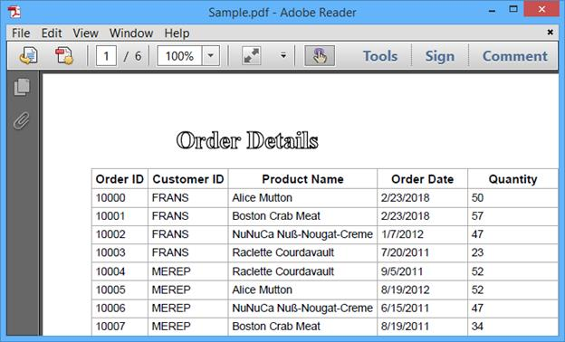
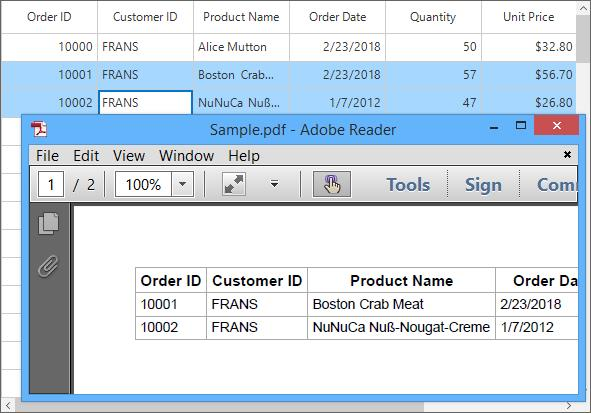
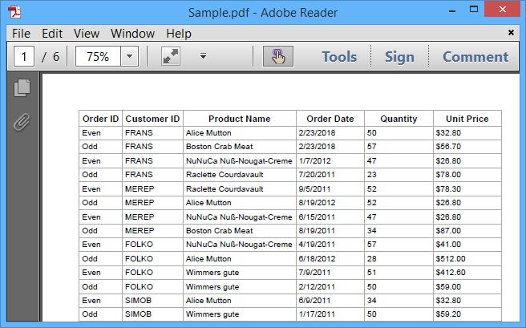
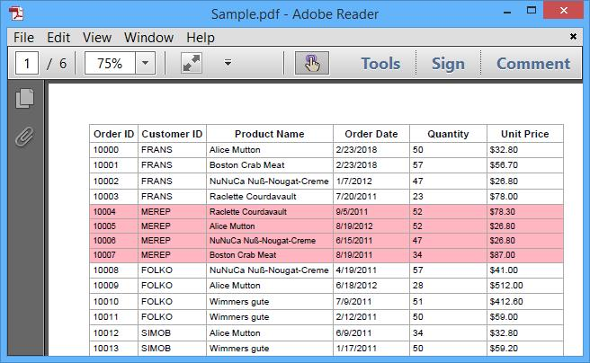
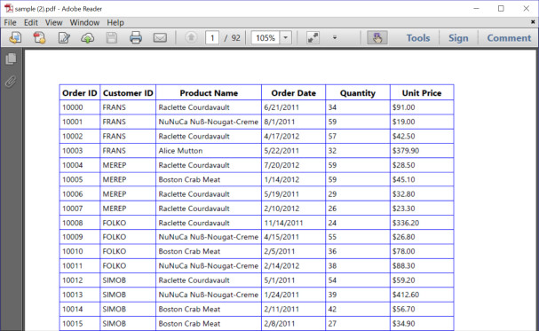
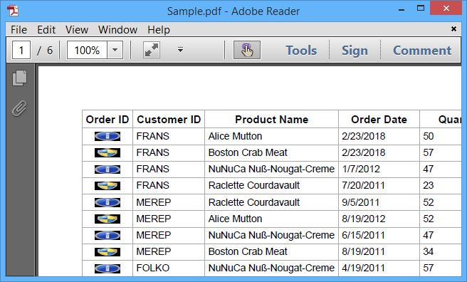

# Export to PDF in WinForms DataGrid (SfDataGrid)
[WinForms DataGrid](https://www.syncfusion.com/winforms-ui-controls/datagrid) (SfDataGrid) provides support to export data to PDF file. It also provides support for grouping, filtering, sorting, unbound rows and stacked headers while exporting.
The following assemblies needs to be added for exporting to PDF file.

* [Syncfusion.SfDataGridConverter.WinForms](https://help.syncfusion.com/cr/windowsforms/Syncfusion.WinForms.DataGridConverter.html)
* [Syncfusion.Pdf.Base](https://help.syncfusion.com/cr/windowsforms)

For [NuGet package](https://help.syncfusion.com/windowsforms/installation/install-nuget-packages), have to install [Syncfusion.DataGridExport.WinForms](https://www.nuget.org/packages/Syncfusion.DataGridExport.WinForms/) package. For more details refer this [UG link](https://help.syncfusion.com/windowsforms/control-dependencies#exporting-sfdatagrid-to-excel-pdf-and-csv)

The SfDataGrid can be exported to the pdf by using the following methods which is available in the `Syncfusion.WinForms.DataGridConverter` namespace.

* [ExportToPdf](https://help.syncfusion.com/cr/windowsforms/Syncfusion.WinForms.DataGridConverter.DataGridPdfExportExtension.html#Syncfusion_WinForms_DataGridConverter_DataGridPdfExportExtension_ExportToPdf_Syncfusion_WinForms_DataGrid_SfDataGrid_)
* [ExportToPdfGrid](https://help.syncfusion.com/cr/windowsforms/Syncfusion.WinForms.DataGridConverter.DataGridPdfExportExtension.html#Syncfusion_WinForms_DataGridConverter_DataGridPdfExportExtension_ExportToPdfGrid_Syncfusion_WinForms_DataGrid_SfDataGrid_Syncfusion_Data_ICollectionViewAdv_Syncfusion_WinForms_DataGridConverter_PdfExportingOptions_)



using Syncfusion.WinForms.DataGridConverter;

var document = this.sfDataGrid.ExportToPdf();
document.Save("Sample.pdf");


Imports Syncfusion.WinForms.DataGridConverter

Private document = Me.sfDataGrid.ExportToPdf()
document.Save("Sample.pdf")



N> SfDataGrid exports data to PDF file by using[Essential PDF](https://help.syncfusion.com/file-formats/pdf/overview). You can refer [PDF documentation](https://help.syncfusion.com/file-formats/pdf/working-with-document) for manipulating.

## Exporting Options
Exporting operation can be customized by passing [PdfExportingOptions](https://help.syncfusion.com/cr/windowsforms/Syncfusion.WinForms.DataGridConverter.PdfExportingOptions.html) instance as argument to `ExportToPdf` and `ExportToPdfGrid` method.

### Exporting with Auto Column Width
SfDataGrid can be exported to PDF with fitting column widths based on its content by setting [AutoColumnWidth](https://help.syncfusion.com/cr/windowsforms/Syncfusion.WinForms.DataGridConverter.PdfExportingOptions.html#Syncfusion_WinForms_DataGridConverter_PdfExportingOptions_AutoColumnWidth) property as `true`.



PdfExportingOptions options = new PdfExportingOptions();
options.AutoColumnWidth = true;
var document = sfDataGrid.ExportToPdf(options);
document.Save("Sample.pdf");


Dim options As New PdfExportingOptions()
options.AutoColumnWidth = True
Dim document = sfDataGrid.ExportToPdf(options)
document.Save("Sample.pdf")



### Exporting with Auto Row Height
SfDataGrid can be exported to PDF with fitting row heights based on its content by setting [AutoRowHeight](https://help.syncfusion.com/cr/windowsforms/Syncfusion.WinForms.DataGridConverter.PdfExportingOptions.html#Syncfusion_WinForms_DataGridConverter_PdfExportingOptions_AutoRowHeight) property as `true`.



PdfExportingOptions options = new PdfExportingOptions();
options.AutoRowHeight = true;
var document = sfDataGrid.ExportToPdf(options);
document.Save("Sample.pdf");


Dim options As New PdfExportingOptions()
options.AutoRowHeight = True
Dim document = sfDataGrid.ExportToPdf(options)
document.Save("Sample.pdf")



### Exclude Columns while Exporting
By default, all the columns (including hidden columns) in SfDataGrid will be exported to PDF. In order to exclude some columns while exporting to PDF, use the [ExcludeColumns](https://help.syncfusion.com/cr/windowsforms/Syncfusion.WinForms.DataGridConverter.PdfExportingOptions.html#Syncfusion_WinForms_DataGridConverter_PdfExportingOptions_ExcludeColumns) property in [PdfExportingOptions](https://help.syncfusion.com/cr/windowsforms/Syncfusion.WinForms.DataGridConverter.PdfExportingOptions.html).



PdfExportingOptions options = new PdfExportingOptions();
options.ExcludeColumns.Add("CustomerID");
options.ExcludeColumns.Add("ProductName");
var document = sfDataGrid.ExportToPdf(options);
document.Save("Sample.pdf");


Dim options As New PdfExportingOptions()
options.ExcludeColumns.Add("CustomerID")
options.ExcludeColumns.Add("ProductName")
Dim document = sfDataGrid.ExportToPdf(options)
document.Save("Sample.pdf")



### Export Format
By default, display text only will be exported to PDF. In order to export the actual value instead of the display text, set the [ExportFormat](https://help.syncfusion.com/cr/windowsforms/Syncfusion.WinForms.DataGridConverter.PdfExportingOptions.html#Syncfusion_WinForms_DataGridConverter_PdfExportingOptions_ExportFormat) property as `false`.



PdfExportingOptions options = new PdfExportingOptions();
options.ExportFormat = false;
var document = sfDataGrid.ExportToPdf(options);
document.Save("Sample.pdf");


Dim options As New PdfExportingOptions()
options.ExportFormat = False
Dim document = sfDataGrid.ExportToPdf(options)
document.Save("Sample.pdf")



### Display Column Header on Each Page
Column headers can be exported on each page by setting [RepeatHeaders](https://help.syncfusion.com/cr/windowsforms/Syncfusion.WinForms.DataGridConverter.PdfExportingOptions.html#Syncfusion_WinForms_DataGridConverter_PdfExportingOptions_RepeatHeaders) property.


PdfExportingOptions options = new PdfExportingOptions();
options.RepeatHeaders = true;
var document = sfDataGrid.ExportToPdf(options);
document.Save("Sample.pdf");


Dim options As New PdfExportingOptions()
options.RepeatHeaders = True
Dim document = sfDataGrid.ExportToPdf(options)
document.Save("Sample.pdf")



### Export all Columns in One Page
While exporting to PDF, you can fit all columns on one page by setting [FitAllColumnsInOnePage](https://help.syncfusion.com/cr/windowsforms/Syncfusion.WinForms.DataGridConverter.PdfExportingOptions.html#Syncfusion_WinForms_DataGridConverter_PdfExportingOptions_FitAllColumnsInOnePage) property as `true`.



PdfExportingOptions options = new PdfExportingOptions();
options.FitAllColumnsInOnePage = true;
var document = sfDataGrid.ExportToPdf(options);
document.Save("Sample.pdf");


Dim options As New PdfExportingOptions()
options.FitAllColumnsInOnePage = True
Dim document = sfDataGrid.ExportToPdf(options)
document.Save("Sample.pdf")



### Exclude Groups on Exporting
By default, all the groups in SfDataGrid will be exported to PDF. To export the SfDataGrid without the groups, need to set the [ExportGroups](https://help.syncfusion.com/cr/windowsforms/Syncfusion.WinForms.DataGridConverter.PdfExportingOptions.html#Syncfusion_WinForms_DataGridConverter_PdfExportingOptions_ExportGroups) property as `false`.



PdfExportingOptions options = new PdfExportingOptions();
options.ExportGroups = false;
var document = sfDataGrid.ExportToPdf(options);
document.Save("Sample.pdf");


Dim options As New PdfExportingOptions()
options.ExportGroups = False
Dim document = sfDataGrid.ExportToPdf(options)
document.Save("Sample.pdf")



### Exclude Group Summaries while Exporting
By default, group summaries in SfDataGrid will be exported to PDF. To export the SfDataGrid without the group summaries, set the [ExportGroupSummary](https://help.syncfusion.com/cr/windowsforms/Syncfusion.WinForms.DataGridConverter.ExcelExportingOptions.html#Syncfusion_WinForms_DataGridConverter_ExcelExportingOptions_ExportGroupSummary) property as `false`.



PdfExportingOptions options = new PdfExportingOptions();
options.ExportGroupSummary = false;
var document = sfDataGrid.ExportToPdf(options);
document.Save("Sample.pdf");


Dim options As New PdfExportingOptions()
options.ExportGroupSummary = False
Dim document = sfDataGrid.ExportToPdf(options)
document.Save("Sample.pdf")



### Exclude Table Summaries while Exporting
By default, table summaries in SfDataGrid will be exported to PDF. If you want to export without table summaries, need to set [ExportTableSummary](https://help.syncfusion.com/cr/windowsforms/Syncfusion.WinForms.DataGridConverter.PdfExportingOptions.html#Syncfusion_WinForms_DataGridConverter_PdfExportingOptions_ExportTableSummary) property as `false`.



PdfExportingOptions options = new PdfExportingOptions();
Options.ExportTableSummary = false;
var document = sfDataGrid.ExportToPdf(options);
document.Save("Sample.pdf");


Dim options As New PdfExportingOptions()
Options.ExportTableSummary = False
Dim document = sfDataGrid.ExportToPdf(options)
document.Save("Sample.pdf")



### Exporting Unbound Rows
The Unbound rows can also exported to the pdf by setting the [ExportUnboundRows](https://help.syncfusion.com/cr/windowsforms/Syncfusion.WinForms.DataGridConverter.ExcelExportingOptions.html#Syncfusion_WinForms_DataGridConverter_ExcelExportingOptions_ExportUnboundRows) property as `true`.



PdfExportingOptions options = new PdfExportingOptions();
options.ExportUnboundRows = true;
var document = sfDataGrid.ExportToPdf(options);
document.Save("Sample.pdf");


Dim options As New PdfExportingOptions()
options.ExportUnboundRows = True
Dim document = sfDataGrid.ExportToPdf(options)
document.Save("Sample.pdf")



### Exporting Stacked Headers
The stacked headers can be exported to the PDF by setting the [ExportStackedHeaders](https://help.syncfusion.com/cr/windowsforms/Syncfusion.WinForms.DataGridConverter.ExcelExportingOptions.html#Syncfusion_WinForms_DataGridConverter_ExcelExportingOptions_ExportStackedHeaders) property to `true`.



PdfExportingOptions options = new PdfExportingOptions();
options.ExportStackedHeaders = true;
var document = sfDataGrid.ExportToPdf(options);
document.Save("Sample.pdf");


Dim options As New PdfExportingOptions()
options.ExportStackedHeaders = True
Dim document = sfDataGrid.ExportToPdf(options)
document.Save("Sample.pdf")



## Setting Header and Footer
SfDataGrid provides a way to display additional content at the top (Header) or bottom (Footer) of the page while exporting to PDF. This can be achieved by setting [HeaderFooterExporting](https://help.syncfusion.com/cr/windowsforms/Syncfusion.WinForms.DataGridConverter.PdfExportingOptions.html) event in [PdfExportingOptions](https://help.syncfusion.com/cr/windowsforms/Syncfusion.WinForms.DataGridConverter.PdfExportingOptions.html).
Setting [PdfPageTemplateElement](https://help.syncfusion.com/cr/windowsforms/Syncfusion.Pdf.PdfPageTemplateElement.html) to `PdfDocumentTemplate.Top` loads the content at top of the page and setting the `PdfDocumentTemplate.Bottom` loads the content at bottom of the page.



PdfExportingOptions options = new PdfExportingOptions();
options.HeaderFooterExporting += options_HeaderFooterExporting;
var document = sfDataGrid.ExportToPdf(options);
document.Save("Sample.pdf");
void options_HeaderFooterExporting(object sender, Syncfusion.WinForms.DataGridConverter.Events.PdfHeaderFooterEventArgs e)
{
    PdfFont font = new PdfStandardFont(PdfFontFamily.TimesRoman, 20f, PdfFontStyle.Bold);
    var width = e.PdfPage.GetClientSize().Width;
    PdfPageTemplateElement header = new PdfPageTemplateElement(width, 38);
    header.Graphics.DrawString("Order Details", font, PdfPens.Black, 70, 3);
    e.PdfDocumentTemplate.Top = header;
}


Private options As New PdfExportingOptions()
Private options.HeaderFooterExporting += AddressOf options_HeaderFooterExporting
Private document = sfDataGrid.ExportToPdf(options)
document.Save("Sample.pdf")

Private Sub options_HeaderFooterExporting(ByVal sender As Object, ByVal e As Syncfusion.WinForms.DataGridConverter.Events.PdfHeaderFooterEventArgs)
	Dim font As PdfFont = New PdfStandardFont(PdfFontFamily.TimesRoman, 20f, PdfFontStyle.Bold)
	Dim width = e.PdfPage.GetClientSize().Width
	Dim header As New PdfPageTemplateElement(width, 38)
	header.Graphics.DrawString("Order Details", font, PdfPens.Black, 70, 3)
	e.PdfDocumentTemplate.Top = header
End Sub



Here, string is inserted in the header of exported PDF file using `DrawString` method. Similarly, you can insert image, line,etc. using `DrawImage`, `DrawLine` methods respectively.

## Change PDF Page Orientation 
The default orientation of the PDF is Portrait. To change the page orientation, need to get the exported [PdfGrid](https://help.syncfusion.com/cr/windowsforms/Syncfusion.Pdf.Grid.PdfGrid.html) by using [ExportToPdfGrid](https://help.syncfusion.com/cr/windowsforms/Syncfusion.WinForms.DataGridConverter.DataGridPdfExportExtension.html#Syncfusion_WinForms_DataGridConverter_DataGridPdfExportExtension_ExportToPdfGrid_Syncfusion_WinForms_DataGrid_SfDataGrid_Syncfusion_Data_ICollectionViewAdv_Syncfusion_WinForms_DataGridConverter_PdfExportingOptions_) method and then draw that `PdfGrid` into a [PdfDocument](https://help.syncfusion.com/cr/windowsforms/Syncfusion.Pdf.PdfDocument.html) by changing the [PageSettings.Orientation](https://help.syncfusion.com/cr/windowsforms/Syncfusion.Pdf.PdfPageSettings.html#Syncfusion_Pdf_PdfPageSettings_Orientation) property of `PdfDocument`.



var options = new PdfExportingOptions();
var document = new PdfDocument();
document.PageSettings.Orientation = PdfPageOrientation.Landscape;
var page = document.Pages.Add();
var PDFGrid = sfDataGrid.ExportToPdfGrid(sfDataGrid.View, options);
var format = new PdfGridLayoutFormat()
{
    Layout = PdfLayoutType.Paginate,
    Break = PdfLayoutBreakType.FitPage
};

PDFGrid.Draw(page, new PointF(), format);
document.Save("Sample.pdf");


Dim options = New PdfExportingOptions()
Dim document = New PdfDocument()
document.PageSettings.Orientation = PdfPageOrientation.Landscape
Dim page = document.Pages.Add()
Dim PDFGrid = sfDataGrid.ExportToPdfGrid(sfDataGrid.View, options)
Dim format = New PdfGridLayoutFormat() With {.Layout = PdfLayoutType.Paginate, .Break = PdfLayoutBreakType.FitPage}

PDFGrid.Draw(page, New PointF(), format)
document.Save("Sample.pdf")



## Export SelectedItems to PDF
By default, entire grid will be exported to PDF. The selected items can only exported to the pdf by passing [SelectedItems](https://help.syncfusion.com/cr/windowsforms/Syncfusion.WinForms.DataGrid.SfDataGrid.html#Syncfusion_WinForms_DataGrid_SfDataGrid_SelectedItems) to `ExportToPdf` and `ExportToPdfGrid` methods.



PdfExportingOptions options = new PdfExportingOptions();
options.AutoColumnWidth = true;
var document = sfDataGrid.ExportToPdf(sfDataGrid.SelectedItems, options);
document.Save("Sample.pdf");


Dim options As New PdfExportingOptions()
options.AutoColumnWidth = True
Dim document = sfDataGrid.ExportToPdf(sfDataGrid.SelectedItems, options)
document.Save("Sample.pdf")



## Saving Options

### Save Directly to a File

After exporting to PDF, you can save exported PDF file directly to file system by using [Save](https://help.syncfusion.com/cr/windowsforms/Syncfusion.Pdf.PdfDocumentBase.html#Syncfusion_Pdf_PdfDocumentBase_Save_System_IO_Stream_) method.



var document = dataGrid.ExportToPdf();
document.Save("Sample.pdf");


Dim document = dataGrid.ExportToPdf()
document.Save("Sample.pdf")



Refer the [PDF documentation](http://help.syncfusion.com/file-formats/pdf/loading-and-saving-document#saving-a-pdf-document-to-file-system) for more information.

### Save as Stream
After exporting to PDF, the exported PDF file can be saved to a stream by using [Save](https://help.syncfusion.com/cr/windowsforms/Syncfusion.Pdf.PdfDocumentBase.html#Syncfusion_Pdf_PdfDocumentBase_Save_System_IO_Stream_) method.



FileStream fileStream = new FileStream("Sample.pdf", FileMode.Create);
var document = sfDataGrid.ExportToPdf();
document.Save(fileStream);
fileStream.Close();


Dim fileStream As New FileStream("Sample.pdf", FileMode.Create)
Dim document = sfDataGrid.ExportToPdf()
document.Save(fileStream)
fileStream.Close()



### Save using File Dialog
After exporting to PDF, save the exported PDF file by opening [FileDialog](https://docs.microsoft.com/en-us/dotnet/api/system.windows.forms.filedialog?view=net-5.0).



var document = sfDataGrid.ExportToPdf();
SaveFileDialog saveFileDialog = new SaveFileDialog
{
    Filter = "PDF Files(*.pdf)|*.pdf"
};
if (saveFileDialog.ShowDialog() == DialogResult.OK)
{
    using (Stream stream = saveFileDialog.OpenFile())
    {
        document.Save(stream);
    }
    //Message box confirmation to view the created Pdf file.
    if (MessageBox.Show("Do you want to view the Pdf file?", "Pdf file has been created", MessageBoxButtons.YesNo, MessageBoxIcon.Information) == DialogResult.Yes) 
    {
        //Launching the Pdf file using the default Application.
        System.Diagnostics.Process.Start(saveFileDialog.FileName);
    }
}



## Exporting Customization

### Styling Cells based on CellType in PDF

The exported cells can be customized based on the cell type by using the Exporting event.



PdfExportingOptions options = new PdfExportingOptions();
options.Exporting += options_Exporting;
var document = sfDataGrid.ExportToPdf(options);
document.Save("Sample.pdf");

void options_Exporting(object sender, DataGridPdfExportingEventArgs e)
{
    if (e.CellType == ExportCellType.HeaderCell)
        e.CellStyle.BackgroundBrush = PdfBrushes.LightSteelBlue;

    else if (e.CellType == ExportCellType.GroupCaptionCell)
        e.CellStyle.BackgroundBrush = PdfBrushes.LightGray;

    else if (e.CellType == ExportCellType.RecordCell)
        e.CellStyle.BackgroundBrush = PdfBrushes.Wheat;
}



Private options As New PdfExportingOptions()
options.Exporting += options_Exporting;
Private document = sfDataGrid.ExportToPdf(options)
document.Save("Sample.pdf")

Private Sub options_Exporting(ByVal sender As Object, ByVal e As DataGridPdfExportingEventArgs)
	If e.CellType Is ExportCellType.HeaderCell Then
		e.CellStyle.BackgroundBrush = PdfBrushes.LightSteelBlue

	ElseIf e.CellType Is ExportCellType.GroupCaptionCell Then
		e.CellStyle.BackgroundBrush = PdfBrushes.LightGray

	ElseIf e.CellType Is ExportCellType.RecordCell Then
		e.CellStyle.BackgroundBrush = PdfBrushes.Wheat
	End If
End Sub



### Embedding Fonts in PDF File
By default, some fonts (such as Unicode font) are not supported in PDF. In this case, it is possible to embed the font in PDF document with the help of [PdfTrueTypeFont](https://help.syncfusion.com/cr/windowsforms/Syncfusion.Pdf.Graphics.PdfTrueTypeFont.html).



PdfExportingOptions options = new PdfExportingOptions();
options.Exporting += OnPdfExporting;
var document = sfDataGrid.ExportToPdf(options);
document.Save("Sample.pdf");
private void OnPdfExporting(object sender, DataGridPdfExportingEventArgs e)
{
    if (e.CellType != ExportCellType.RecordCell)
        return;
    //creates a new font from the font file.                
    var font = new PdfTrueTypeFont(@"..\..\Resources\SegoeUI.ttf", 9f, PdfFontStyle.Regular);
    e.CellStyle.Font = font;
}


Private options As New PdfExportingOptions()
Private options.Exporting += AddressOf OnPdfExporting
Private document = sfDataGrid.ExportToPdf(options)
document.Save("Sample.pdf")

Private Sub OnPdfExporting(ByVal sender As Object, ByVal e As DataGridPdfExportingEventArgs)
	If e.CellType IsNot ExportCellType.RecordCell Then
		Return
	End If

	'creates a new font from the font file.                
	Dim font = New PdfTrueTypeFont("..\..\Resources\SegoeUI.ttf", 9f, PdfFontStyle.Regular)
	e.CellStyle.Font = font
End Sub



Here, new font is created from font file and it is assigned to the Font of[PdfGridCell](https://help.syncfusion.com/cr/windowsforms/Syncfusion.Pdf.Grid.PdfGridCell.html).

### Set the width of the column when enable FitAllColumnsInOnePage option

By default, all the columns will have same width when enabling the [FitAllColumnsInOnePage](https://help.syncfusion.com/cr/windowsforms/Syncfusion.WinForms.DataGridConverter.PdfExportingOptions.html#Syncfusion_WinForms_DataGridConverter_PdfExportingOptions_FitAllColumnsInOnePage) option in [PdfExportingOptions](https://help.syncfusion.com/cr/windowsforms/Syncfusion.WinForms.DataGridConverter.PdfExportingOptions.html). Column width will be changed when exporting SfDataGrid to PdfGrid using the [ExportToPdfGrid](https://help.syncfusion.com/cr/windowsforms/Syncfusion.WinForms.DataGridConverter.DataGridPdfExportExtension.html#Syncfusion_WinForms_DataGridConverter_DataGridPdfExportExtension_ExportToPdfGrid_Syncfusion_WinForms_DataGrid_SfDataGrid_Syncfusion_Data_ICollectionViewAdv_Syncfusion_WinForms_DataGridConverter_PdfExportingOptions_) method. 



void ExportDataGrid(object sender, System.EventArgs e)
{
    var pdfExportingOptions = GetPdfExportOption();
    var pdfDocument = new PdfDocument();
    var page = pdfDocument.Pages.Add();

    var pdfGrid = sfDataGrid1.ExportToPdfGrid(this.sfDataGrid1.View, pdfExportingOptions);

    foreach (PdfGridCell headerCell in pdfGrid.Headers[0].Cells)
    {
        if (headerCell.Value.ToString() == sfDataGrid1.Columns["OrderID"].HeaderText)
        {
            var index = pdfGrid.Headers[0].Cells.IndexOf(headerCell);
            pdfGrid.Columns[index].Width = 30;
        }
    }

    var format = new PdfGridLayoutFormat()
    {
        Layout = PdfLayoutType.Paginate,
        Break = PdfLayoutBreakType.FitPage
    };

    pdfGrid.Draw(page, new PointF(), format);
}


Private Sub ExportDataGrid(ByVal sender As Object, ByVal e As System.EventArgs)
	Dim pdfExportingOptions = GetPdfExportOption()
	Dim pdfDocument = New PdfDocument()
	Dim page = pdfDocument.Pages.Add()

	Dim pdfGrid = sfDataGrid1.ExportToPdfGrid(Me.sfDataGrid1.View, pdfExportingOptions)

	For Each headerCell As PdfGridCell In pdfGrid.Headers(0).Cells
		If headerCell.Value.ToString() = sfDataGrid1.Columns("OrderID").HeaderText Then
			Dim index = pdfGrid.Headers(0).Cells.IndexOf(headerCell)
			pdfGrid.Columns(index).Width = 30
		End If
	Next headerCell

	Dim format = New PdfGridLayoutFormat() With {.Layout = PdfLayoutType.Paginate, .Break = PdfLayoutBreakType.FitPage}

	pdfGrid.Draw(page, New PointF(), format)
End Sub



## Cell Customization in PDF while Exporting 
The exported cells of the PDF document can be customized document by setting [CellExporting](https://help.syncfusion.com/cr/windowsforms/Syncfusion.WinForms.DataGridConverter.ExcelExportingOptions.html) event of the `PdfExportingOptions`.

### Customize Cell Values while Exporting
 The cell value can be customized while exporting to PDF by using the `CellExporting` event of the `PdfExportingOption`.
 


PdfExportingOptions options = new PdfExportingOptions();
options.CellExporting += OnCellExporting;
var document = sfDataGrid.ExportToPdf(options);
document.Save("Sample.pdf");

void OnCellExporting(object sender, DataGridCellPdfExportingEventArgs e)
{
    // Based on the column mapping name and the cell type, we can change the cell values while exporting to excel.
    if (e.CellType == ExportCellType.RecordCell && e.ColumnName == "OrderID")
    {              
        //if the cell value is Odd, "Odd" will be displayed else "Even" will be displayed.
        if (Convert.ToInt16(e.CellValue) % 2 == 0)
            e.CellValue = "Even";
        else
            e.CellValue = "Odd";               
    }
}


Dim options As New PdfExportingOptions()
options.CellExporting += OnCellExporting
Dim document = sfDataGrid.ExportToPdf(options)
document.Save("Sample.pdf")

Private Sub OnCellExporting(ByVal sender As Object, ByVal e As DataGridCellPdfExportingEventArgs)
	' Based on the column mapping name and the cell type, we can change the cell values while exporting to excel.
	If e.CellType Is ExportCellType.RecordCell AndAlso e.ColumnName = "OrderID" Then
		'if the cell value is Odd, "Odd" will be displayed else "Even" will be displayed.
		If Convert.ToInt16(e.CellValue) Mod 2 = 0 Then
			e.CellValue = "Even"
		Else
			e.CellValue = "Odd"
		End If
	End If
End Sub



Here, cell values are changed for `OrderID` column based on custom condition.

### Changing Row Style in PDF based on Data
The rows can be customized based on the record values by using [CellExporting](https://help.syncfusion.com/cr/windowsforms/Syncfusion.WinForms.DataGridConverter.ExcelExportingOptions.html) event.



PdfExportingOptions options = new PdfExportingOptions();
options.CellExporting += options_CellExporting;
var document = sfDataGrid.ExportToPdf(options);
document.Save("Sample.pdf");

void options_CellExporting(object sender, DataGridCellPdfExportingEventArgs e)
{
    if (!(e.NodeEntry is OrderInfo))
        return;
    if ((e.NodeEntry as OrderInfo).CustomerID == "MEREP")
    {
        var cellStyle = new PdfGridCellStyle();
        cellStyle.BackgroundBrush = PdfBrushes.LightPink;
        cellStyle.Borders.All = new PdfPen(PdfBrushes.DarkGray, 0.2f);
        e.PdfGridCell.Style = cellStyle;
    }
}


Dim options As New PdfExportingOptions()
options.CellExporting += options_CellExporting
Dim document = sfDataGrid.ExportToPdf(options)
document.Save("Sample.pdf")

Private Sub options_CellExporting(ByVal sender As Object, ByVal e As DataGridCellPdfExportingEventArgs)
	If Not(TypeOf e.NodeEntry Is OrderInfo) Then
		Return
	End If

	If (TryCast(e.NodeEntry, OrderInfo)).CustomerID = "MEREP" Then
		Dim cellStyle = New PdfGridCellStyle()
		cellStyle.BackgroundBrush = PdfBrushes.LightPink
		cellStyle.Borders.All = New PdfPen(PdfBrushes.DarkGray, 0.2f)
		e.PdfGridCell.Style = cellStyle
	End If
End Sub



### Changing the border color of cells in PDF document

The border color of the cell will be customized when exporting to PDF by using the [CellExporting](https://help.syncfusion.com/cr/windowsforms/Syncfusion.WinForms.DataGridConverter.ExcelExportingOptions.html) event of [PdfExportingOption](https://help.syncfusion.com/cr/windowsforms/Syncfusion.WinForms.DataGridConverter.PdfExportingOptions.html).



PdfExportingOptions options = new PdfExportingOptions();
options.CellExporting += OnCellExporting;

void OnCellExporting(object sender, DataGridCellPdfExportingEventArgs e)
{
    if (e.CellValue == null)
        e.CellValue = string.Empty;

    //Set the border color for the pdf cell 
    e.PdfGridCell.Style.Borders.All = new PdfPen(Color.Blue, 0.2f);
}


Private options As New PdfExportingOptions()
AddHandler CellExporting, AddressOf OnCellExporting
Private Sub OnCellExporting(ByVal sender As Object, ByVal e As DataGridCellPdfExportingEventArgs)
	If e.CellValue Is Nothing Then
		e.CellValue = String.Empty
	End If

	'Set the border color for the pdf cell 
	e.PdfGridCell.Style.Borders.All = New PdfPen(Color.Blue, 0.2f)
End Sub



### Exporting Middle Eastern Languages (Arabic, Hebrew) from SfDataGrid to PDF
By default, Middle Eastern languages (Arabic, Hebrew) in SfDataGrid are exported as left to right in PDF. You can export them as displayed in SfDataGrid (export from Right to Left) by enabling [RightToLeft](https://help.syncfusion.com/cr/windowsforms/Syncfusion.Pdf.Graphics.PdfStringFormat.html#Syncfusion_Pdf_Graphics_PdfStringFormat_RightToLeft) property in [PdfStringFormat](https://help.syncfusion.com/cr/windowsforms/Syncfusion.Pdf.Graphics.PdfStringFormat.html) class and apply the format to the [PdfGridCell](https://help.syncfusion.com/cr/windowsforms/Syncfusion.Pdf.Grid.PdfGridCell.html) by using `CellExporting` event.


PdfExportingOptions options = new PdfExportingOptions();
options.CellExporting += options_CellExporting;
var document = sfDataGrid.ExportToPdf(options);
document.Save("Sample.pdf");

void options_CellExporting(object sender, DataGridCellPdfExportingEventArgs e)
{
    if (e.CellType != ExportCellType.RecordCell)
        return;
    PdfStringFormat format = new PdfStringFormat();

    //format the string from right to left.
    format.TextDirection = PdfTextDirection.RightToLeft;   
    format.Alignment = PdfTextAlignment.Right; 
    e.PdfGridCell.StringFormat = format;
}



Dim options As New PdfExportingOptions()
options.CellExporting += options_CellExporting
Dim document = sfDataGrid.ExportToPdf(options)
document.Save("Sample.pdf")

Private Sub options_CellExporting(ByVal sender As Object, ByVal e As DataGridCellPdfExportingEventArgs)
	If e.CellType IsNot ExportCellType.RecordCell Then
		Return
	End If

	Dim format As New PdfStringFormat()

	'format the string from right to left.
	format.TextDirection = PdfTextDirection.RightToLeft
    format.Alignment = PdfTextAlignment.Right
	e.PdfGridCell.StringFormat = format
End Sub



### Exporting Images to PDF
The images can be exported to the PDF by using `CellExporting` event. Based on the [ImagePosition](https://help.syncfusion.com/cr/windowsforms/Syncfusion.Pdf.Grid.PdfGridCell.html#Syncfusion_Pdf_Grid_PdfGridCell_ImagePosition) of the [PdfGridCell](https://help.syncfusion.com/cr/windowsforms/Syncfusion.Pdf.Grid.PdfGridCell.html) the image will be loaded in the cell.



PdfExportingOptions options = new PdfExportingOptions();
options.CellExporting += cellExporting;
var document = sfDataGrid.ExportToPdf(options);
document.Save("Sample.pdf");
private void cellExporting(object sender, DataGridCellPdfExportingEventArgs e)
{
    if (e.CellType == ExportCellType.RecordCell && e.ColumnName == "OrderID")
    {
        var style = new PdfGridCellStyle();
        PdfPen normalBorder = new PdfPen(PdfBrushes.DarkGray, 0.2f);
        System.Drawing.Image image = null;
        //Images are exported based on the CellValue 
        if (Convert.ToInt16(e.CellValue) % 2 == 0)
            //Access the image from the specified path 
            image = SystemIcons.Information.ToBitmap();
        else
            image = SystemIcons.Shield.ToBitmap();               
        //Create the PDFImage for the specified image and assigned to BackgroundImage of the PdfGridCellStyle
        style.BackgroundImage = PdfImage.FromImage(image);
        e.PdfGridCell.ImagePosition = PdfGridImagePosition.Center;
        e.PdfGridCell.Style = style;
        //customize the Border color of PdfGridCell
        e.PdfGridCell.Style.Borders.All = normalBorder;
        e.CellValue = string.Empty;
    }
}


Private options As New PdfExportingOptions()
Private options.CellExporting += AddressOf cellExporting
Private document = sfDataGrid.ExportToPdf(options)
document.Save("Sample.pdf")

Private Sub cellExporting(ByVal sender As Object, ByVal e As DataGridCellPdfExportingEventArgs)
	If e.CellType Is ExportCellType.RecordCell AndAlso e.ColumnName = "OrderID" Then
		Dim style = New PdfGridCellStyle()
		Dim normalBorder As New PdfPen(PdfBrushes.DarkGray, 0.2f)
		Dim image As System.Drawing.Image = Nothing

		'Images are exported based on the CellValue 
		If Convert.ToInt16(e.CellValue) Mod 2 = 0 Then
			'Access the image from the specified path 
			image = SystemIcons.Information.ToBitmap()
		Else
			image = SystemIcons.Shield.ToBitmap()
		End If

		'Create the PDFImage for the specified image and assigned to BackgroundImage of the PdfGridCellStyle
		style.BackgroundImage = PdfImage.FromImage(image)
		e.PdfGridCell.ImagePosition = PdfGridImagePosition.Center
		e.PdfGridCell.Style = style

		'customize the Border color of PdfGridCell
		e.PdfGridCell.Style.Borders.All = normalBorder
		e.CellValue = String.Empty
	End If
End Sub



## See also

[How to add page numbers to the exported pdf document in WinForms DataGrid (SfDataGrid)](https://www.syncfusion.com/kb/9315)

[How to print the WinForms DataGrid (SfDataGrid) control](https://www.syncfusion.com/kb/9255)

[How to preview WinForms DataGrid (SfDataGrid) control in print preview dialog](https://www.syncfusion.com/kb/9252)
