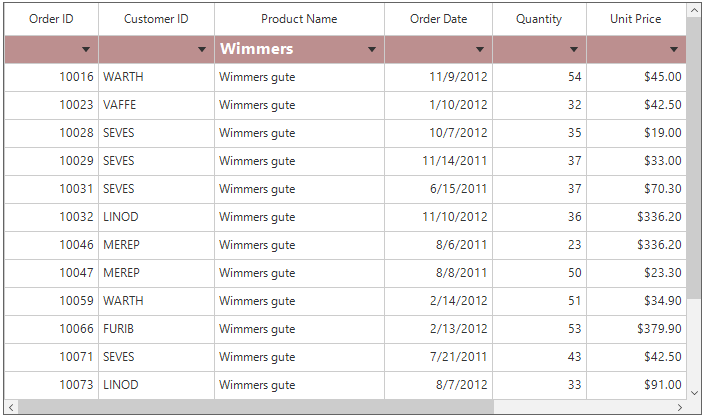
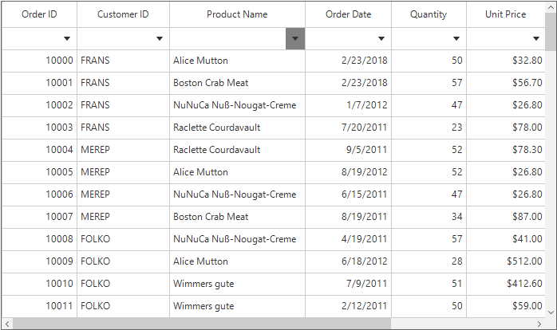

# FilterRow in Windows Forms DataGrid (SfDataGrid)
SfDataGrid provides built-in row (called FilterRow) to filter the records. This FilterRow can be enabled by specifying the position where it should be displayed by setting [SfDataGrid.FilterRowPosition](https://help.syncfusion.com/cr/windowsforms/Syncfusion.WinForms.DataGrid.SfDataGrid.html#Syncfusion_WinForms_DataGrid_SfDataGrid_FilterRowPosition) property.



//Adding FilterRow at the top
this.sfDataGrid1.FilterRowPosition = RowPosition.Top;


'Adding FilterRow at the top
Me.sfDataGrid1.FilterRowPosition = RowPosition.Top



The index of the filter row can be get by using the [GetFilterRowIndex](https://help.syncfusion.com/cr/windowsforms/Syncfusion.WinForms.DataGrid.DataGridIndexResolver.html#Syncfusion_WinForms_DataGrid_DataGridIndexResolver_GetFilterRowIndex_Syncfusion_WinForms_DataGrid_SfDataGrid_) method.



//Gets the filter row index.
int filterRowIndex = this.sfDataGrid1.GetFilterRowIndex();


'Gets the filter row index.
Dim filterRowIndex As Integer = Me.sfDataGrid1.GetFilterRowIndex()



You can also check whether the given row index is the filter row index or not by using the [IsFilterRowIndex](https://help.syncfusion.com/cr/windowsforms/Syncfusion.WinForms.DataGrid.DataGridIndexResolver.html#Syncfusion_WinForms_DataGrid_DataGridIndexResolver_IsFilterRowIndex_Syncfusion_WinForms_DataGrid_SfDataGrid_System_Int32_) helper method.



//To check whether the given row index is the filter row or not.
bool isFilterRow = this.sfDataGrid1.IsFilterRowIndex(filterRowIndex);


'To check whether the given row index is the filter row or not.
Dim isFilterRow As Boolean = Me.sfDataGrid1.IsFilterRowIndex(filterRowIndex)



## Built-in FilterRow Editor Types
By default, the filter row loads the editors based on underlying property type to filter the data easily. The default editor of the column can be changed by using [GridColumn.FilterRowEditorType](https://help.syncfusion.com/cr/windowsforms/Syncfusion.WinForms.DataGrid.GridColumnBase.html#Syncfusion_WinForms_DataGrid_GridColumnBase_FilterRowEditorType) property.



//To load the text box filter for the particular column.
this.sfDataGrid1.Columns[2].FilterRowEditorType = "MultiSelectComboBox";


'To load the text box filter for the particular column.
Me.sfDataGrid1.Columns(2).FilterRowEditorType = "MultiSelectComboBox"



The following types of default filter row editors are available in the SfDataGrid.

<table>
<tr>
<th>
FilterRowEditorType
</th>
<th>
Editor Control
</th>
<th>
Renderer
</th>
<th>
Description
</th>
</tr>
<tr>
<td>
TextBox
</td>
<td>
TextBox
</td>
<td>
FilterRowTextBoxRenderer
</td>
<td>
Filters the string values.
</td>
</tr>
<tr>
<td>
Numeric
</td>
<td>
SfNumericTextBox
</td>
<td>
FilterRowNumericRenderer
</td>
<td>
Filters the numeric values.
</td>
</tr>
<tr>
<td>
CheckBox
</td>
<td>
-
</td>
<td>
FilterRowCheckBoxCellRenderer
</td>
<td>
Filters the Boolean values.
</td>
</tr>
<tr>
<td>
DateTime
</td>
<td>
SfDataTimeEdit
</td>
<td>
FilterRowDateTimeCellRenderer
</td>
<td>
Filters the DateTime values.
</td>
</tr>
<tr>
<td>
ComboBox
</td>
<td>
SfComboBox
</td>
<td>
FilterRowComboBoxCellRenderer
</td>
<td>
Filters a specific value from the drop-down.
</td>
</tr>
<tr>
<td>
MultiSelectComboBox
</td>
<td>
SfComboBox
</td>
<td>
FilterRowMultiSelectComboBoxCellRenderer
</td>
<td>
Filters multiple values from the drop-down.
</td>
</tr>
</table>

## FilterRow Options
Based on the editor type, FilterRowCell displays the filter conditions in dropdown where you can easily switch between the conditions to filter the data. The filter options can be disabled by setting [GridColumn.ShowFilterRowOptions](https://help.syncfusion.com/cr/windowsforms/Syncfusion.WinForms.DataGrid.GridColumnBase.html#Syncfusion_WinForms_DataGrid_GridColumnBase_ShowFilterRowOptions) property to `false`. 



// Collapse the visibility of the FilterRow options
this.sfDataGrid1.Columns[2].ShowFilterRowOptions = false;


' Collapse the visibility of the FilterRow options
Me.sfDataGrid1.Columns(2).ShowFilterRowOptions = False



Below are the filter conditions supported by different filter row editors in SfDataGrid.
<table>
<tr>
<th>
Numeric Editor
</th>
<th>
TextBox Editor
</th>
<th>
DateTime Editor
</th>
<th>
CheckBox Editor
</th>
<th>
ComboBox and MultiSelectComboBox Editor
</th>
</tr>
<tr>
<td>
When the integer, double, short, decimal, byte or long are bound to the 
GridColumn, the Numeric editor type is loaded in FilterRowCell.
</td>
<td>
When the string value is bounded to the 
GridColumn or the items is dynamic, then TextBox editor type is loaded in FilterRowCell.
</td>
<td>
When the DateTime type is bounded to the 
GridColumn, then DateTime editor is loaded in FilterRowCell.
</td>
<td>
When the Boolean type is bounded to the 
GridColumn , then CheckBoxEditor is loaded in FilterRowCell
</td>
<td>
If you need ComboBox and MultiSelectComboBox, you have to set the FilterRowEditorType as ComboBox and MultiSelectComboBox respectively.
</td>
</tr>
<tr>
<td>
The default filter condition is Equals. Following filter conditions are available in numeric filter.
<ol>
<li>Equals</li>
<li>Not Equal</li>
<li>Null</li>
<li>Not Null</li>
<li>Less Than</li>
<li>Less Than or Equal</li>
<li>Greater Than</li>
<li>Greater Than or Equal</li>
</ol>
</td>
<td>
The default filter condition is Begins With. Following filter conditions are available in text filter.
<ol>
<li>Equals</li>
<li>Not Equal</li>
<li>Null</li>
<li>Not Null</li>
<li>Begins With</li>
<li>Does Not Begin With</li>
<li>Ends With</li>
<li>Does Not End With</li>
<li>Contains</li>
<li>Does Not Contain</li>
<li>Empty</li>
<li>Not Empty</li>
</ol>
</td>
<td>
The default filter condition is Equals. Following filter conditions are available in date time filter.
<ol>
<li>Equals</li>
<li>Not Equal</li>
<li>Null</li>
<li>Not Null</li>
<li>Before</li>
<li>Before or Equal</li>
<li>After</li>
<li>After or Equal</li>
</ol>
</td>
<td>
Always equals filter condition will be applied for filtering the CheckBox value.
</td>
<td>
Always Equals or Not Equal filter condition will be applied based on the selected items count for filtering the items.
</td>
</tr>
</table>

## Filtering null Values 
The null values of the columns can be filtered by using the filter row options such as Null and Not Null. This options is enabled by default for all the filter row editors. To disable the null filter options from the filter options list, use the [AllowBlankFilters](https://help.syncfusion.com/cr/windowsforms/Syncfusion.WinForms.DataGrid.GridColumnBase.html#Syncfusion_WinForms_DataGrid_GridColumnBase_AllowBlankFilters) property of the GridColumn. The default value of this property is `true`.



// To remove the null filter conditions from the FilterRow options.
this.sfDataGrid1.Columns[1].AllowBlankFilters = false;


' To remove the null filter conditions from the FilterRow options.
Me.sfDataGrid1.Columns(1).AllowBlankFilters = False



## Immediate Filtering
By default, filters are applied to the columns when moving to other cells or pressing the enter key. This can be changed to apply the filtering while typing or selecting in editor itself by setting the [GridColumn.ImmediateUpdateColumnFilter](https://help.syncfusion.com/cr/windowsforms/Syncfusion.WinForms.DataGrid.GridColumnBase.html#Syncfusion_WinForms_DataGrid_GridColumnBase_ImmediateUpdateColumnFilter) as true.



// Enable the immediate filtering for the column.
this.sfDataGrid1.Columns[2].ImmediateUpdateColumnFilter = true;


' Enable the immediate filtering for the column.
Me.sfDataGrid1.Columns(2).ImmediateUpdateColumnFilter = True



### Delay Immediate Filtering
By default, filtering will be applied immediately while entering the character in the filter row when the ` ImmediateUpdateColumnFilter` is enabled. The time delay for applying the filtering can be set by using the [FilterDelay](https://help.syncfusion.com/cr/windowsforms/Syncfusion.WinForms.DataGrid.SfDataGrid.html#Syncfusion_WinForms_DataGrid_SfDataGrid_FilterDelay) property.



this.sfDataGrid.FilterRowPosition = RowPosition.Top;
this.sfDataGrid.Columns[0].ImmediateUpdateColumnFilter = true;

// Set the filter delay for the SfDataGrid.
this.sfDataGrid.FilterDelay = 1000;


Me.sfDataGrid.FilterRowPosition = RowPosition.Top
Me.sfDataGrid.Columns(0).ImmediateUpdateColumnFilter = True

' Set the filter delay for the SfDataGrid.
Me.sfDataGrid.FilterDelay = 1000



## Disable the Filtering for Particular FilterRow Cell
By default the filtering will be applied based on the edited value of the filter row cell. To avoid the filtering through the filter row cell, cancel the editing of the cell using the [CurrentCellBeginEdit](https://help.syncfusion.com/cr/windowsforms/Syncfusion.WinForms.DataGrid.SfDataGrid.html) event.



this.sfDataGrid1.CurrentCellBeginEdit += sfDataGrid1_CurrentCellBeginEdit;
void sfDataGrid1_CurrentCellBeginEdit(object sender, CurrentCellBeginEditEventArgs e)
{
    //Cancel the editing for filter row cell in OrderID Column
    if (e.DataColumn.GridColumn.MappingName == "OrderID" && this.sfDataGrid1.IsFilterRowIndex(e.DataRow.RowIndex))
    {
        e.Cancel = true;
    }
}


AddHandler sfDataGrid1.CurrentCellBeginEdit, AddressOf sfDataGrid1_CurrentCellBeginEdit
Private Sub sfDataGrid1_CurrentCellBeginEdit(ByVal sender As Object, ByVal e As CurrentCellBeginEditEventArgs)
	'Cancel the editing for filter row cell in OrderID Column
	If e.DataColumn.GridColumn.MappingName = "OrderID" AndAlso Me.sfDataGrid1.IsFilterRowIndex(e.DataRow.RowIndex) Then
		e.Cancel = True
	End If
End Sub



## Appearance
The fore color and back color of the filter row can be customized by using the [FilterRowStyle](https://help.syncfusion.com/cr/windowsforms/Syncfusion.WinForms.DataGrid.Styles.DataGridStyle.html#Syncfusion_WinForms_DataGrid_Styles_DataGridStyle_FilterRowStyle) property.



this.sfDataGrid1.Style.FilterRowStyle.BackColor = Color.RosyBrown;
this.sfDataGrid1.Style.FilterRowStyle.TextColor = Color.White;
this.sfDataGrid1.Style.FilterRowStyle.Font = new GridFontInfo(new Font("Segoe UI", 12f, FontStyle.Bold));


Me.sfDataGrid1.Style.FilterRowStyle.BackColor = Color.RosyBrown
Me.sfDataGrid1.Style.FilterRowStyle.TextColor = Color.White
Me.sfDataGrid1.Style.FilterRowStyle.Font = New GridFontInfo(New Font("Segoe UI", 12f, FontStyle.Bold))



## Customizing FilterRow CellRenderer
SfDataGrid allows to customize the filter row renderer behavior by overriding the corresponding renderer associated with the filter row cell. Each renderer have a set of virtual methods for handling the filter row behaviors. It also provides the support to create a new renderers instead of overriding the existing renderer. 
The default TextBox editor behavior can be customized by overriding [FilterRowTextBoxCellRenderer](https://help.syncfusion.com/cr/windowsforms/Syncfusion.WinForms.DataGrid.RowFilter.FilterRowTextBoxCellRenderer.html) class and add the custom renderer to [FilterRowCellRenderers](https://help.syncfusion.com/cr/windowsforms/Syncfusion.WinForms.DataGrid.SfDataGrid.html#Syncfusion_WinForms_DataGrid_SfDataGrid_FilterRowCellRenderers) collection.



public class FilterRowTextBoxRendererExt : FilterRowTextBoxCellRenderer
{
    public FilterRowTextBoxRendererExt()
        : base()
    {}            

    protected override void DrawDropDownButton(Graphics g, Rectangle rect, Color backColor)
    {
        //Modify the back color for the drop down button.
        backColor = Color.Gray;
        base.DrawDropDownButton(g, rect, backColor);
    }
}


Public Class FilterRowTextBoxRendererExt
	Inherits FilterRowTextBoxCellRenderer
	Public Sub New()
		MyBase.New()
	End Sub

	Protected Overrides Sub DrawDropDownButton(ByVal g As Graphics, ByVal rect As Rectangle, ByVal backColor As Color)
		'Modify the back color for the drop down button.
		backColor = Color.Gray
		MyBase.DrawDropDownButton(g, rect, backColor)
	End Sub
End Class



Adding custom filter row cell renderer to the `FilterRowCellRenderers` collection on the button click,



private void btnApplyFilter_Click(object sender, System.EventArgs e)
{
    //Add the custom renderer to the FilterRowCellRenderers collection.
    this.sfDataGrid.FilterRowCellRenderers.Add("CustomEditor", new FilterRowTextBoxRendererExt());

    //Set the Custom filter row renderer for the column.
    sfDataGrid.Columns[2].FilterRowEditorType = "CustomEditor";
    sfDataGrid.FilterRowPosition = RowPosition.Top;            
}


Private Sub btnApplyFilter_Click(ByVal sender As Object, ByVal e As System.EventArgs)
	'Add the custom renderer to the FilterRowCellRenderers collection.
	Me.sfDataGrid.FilterRowCellRenderers.Add("CustomEditor", New FilterRowTextBoxRendererExt())

	'Set the Custom filter row renderer for the column.
	sfDataGrid.Columns(2).FilterRowEditorType = "CustomEditor"
	sfDataGrid.FilterRowPosition = RowPosition.Top
End Sub



### Filter based on numeric interval by using the MultiSelectComboBox filter
By default, multiple data in the column can be filtered by using the `MultiSelectComboBox` filter row editor type. The following code shows how to filter the data based on the range of numeric values by overriding the `ProcessMultipleFilters` method in the `FilterRowMultiSelectComboBoxCellRenderer` class.



this.sfDataGrid1.FilterRowCellRenderers.Add("ComboBoxExt", new FilterRowMultiSelectComboBoxCellRendererExt());
this.sfDataGrid1.Columns[0].FilterRowEditorType = "ComboBoxExt";

public class FilterRowMultiSelectComboBoxCellRendererExt : FilterRowMultiSelectComboBoxCellRenderer
{
    /// 

    /// Specifies the datasource for the multi select combo box.
    /// 

    private List<FilterElement> numericComboBoxItems;

    /// 

    /// Initializes a new instance of the FilterRowMultiSelectComboBoxCellRendererExt class.
    /// 

    public FilterRowMultiSelectComboBoxCellRendererExt()
        : base()
    {
        SetNumericComboBoxItemsList();
    }

    /// 

    /// InitializeEditBinding based on our item, set the SelectedItem and set the ItemSource.
    /// 

    /// <param name="uiElement">Corresponding UIElement</param>
    /// <param name="dataColumn">Corresponding Column</param>
    protected override void OnInitializeEditElement(DataColumnBase column, Syncfusion.WinForms.GridCommon.ScrollAxis.RowColumnIndex rowColumnIndex, SfComboBox uiElement)
    {
        base.OnInitializeEditElement(column, rowColumnIndex, uiElement);
        ObservableCollection<object> selItems = new ObservableCollection<object>();

        //Generate the items for FilterRow                 
        uiElement.DataSource = numericComboBoxItems;
        uiElement.DisplayMember = "DisplayText";

        if (column.GridColumn.FilteredFrom == FilteredFrom.FilterRow && column.GridColumn.FilterPredicates.Count > 0)
        {
            if (numericComboBoxItems != null)
            {
                numericComboBoxItems.ForEach(element =>
                {

                    //Check if the filter is already applied or not, if applied means again add the filter
                    bool needToAdd = false;
                    switch (element.DisplayText)
                    {

                        case "Between 10001 and 10004":
                            needToAdd = this.NeedToAdd(column.GridColumn.FilterPredicates, "10001");
                            break;

                        case "Between 10005 and 10009":
                            needToAdd = this.NeedToAdd(column.GridColumn.FilterPredicates, "10005");
                            break;

                        case "Between 10010 and 10014":
                            needToAdd = this.NeedToAdd(column.GridColumn.FilterPredicates, "10010");
                            break;

                        case "Between 10015 and 10020":
                            needToAdd = this.NeedToAdd(column.GridColumn.FilterPredicates, "10015");
                            break;

                        case ">1020":
                            needToAdd = this.NeedToAdd(column.GridColumn.FilterPredicates, "1020");
                            break;
                    }

                    if (needToAdd)
                        selItems.Add(element);
                });
            }
        }

        if (selItems.Count > 0)
            uiElement.SelectedItems = selItems;
        else if (uiElement.SelectedItems != null)
            uiElement.SelectedItems.Clear();        
    }

    /// 

    /// Generate the FilterPredicates and apply the filter for a corresponding column
    /// 

    /// <param name="filterValues">Corresponding Filter Value</param>
    /// <param name="totalItems">Corresponding Filter Items</param>
    public override void ProcessMultipleFilters(List<object> filterValues, List<object> totalItems)
    {
        var selectedItems = filterValues.Cast<FilterElement>().ToList();
        var total = totalItems.Cast<FilterElement>().ToList();
        string filterText = string.Empty;

        if (selectedItems == null || total == null || filterValues == null)
            return;

        if (selectedItems.Count == total.Count)
        {
            this.ApplyFilters(null, string.Empty);
            this.IsValueChanged = false;
            return;
        }

        var filterPredicates = new List<FilterPredicate>();
        if (filterValues.Count > 0)
        {
            selectedItems.ForEach(item =>
            {
                switch (item.DisplayText)
                {
                    case "Between 10001 and 10004":
                        filterPredicates.Add(GetFilterPredicates((int)10001, FilterType.GreaterThan, PredicateType.OrElse));
                        filterPredicates.Add(GetFilterPredicates((int)10004, FilterType.LessThan, PredicateType.And));
                        break;

                    case "Between 10005 and 10009":
                        filterPredicates.Add(GetFilterPredicates((int)10005, FilterType.GreaterThan, PredicateType.OrElse));
                        filterPredicates.Add(GetFilterPredicates((int)10009, FilterType.LessThan, PredicateType.And));
                        break;

                    case "Between 10010 and 10014":
                        filterPredicates.Add(GetFilterPredicates((int)10010, FilterType.GreaterThan, PredicateType.OrElse));
                        filterPredicates.Add(GetFilterPredicates((int)10014, FilterType.LessThan, PredicateType.And));
                        break;

                    case "Between 10015 and 10020":
                        filterPredicates.Add(GetFilterPredicates((int)10015, FilterType.GreaterThan, PredicateType.OrElse));
                        filterPredicates.Add(GetFilterPredicates((int)10020, FilterType.LessThan, PredicateType.And));
                        break;

                    case ">1020":
                        filterPredicates.Add(GetFilterPredicates((int)10020, FilterType.GreaterThan, PredicateType.Or));
                        break;
                }
            });
        }

        //Creates the FilterText
        if (filterPredicates.Count > 0)
        {
            var selectItems = ((IList)filterValues).Cast<FilterElement>().ToList();
            for (int i = 0; i < selectedItems.Count; i++)
            {
                filterText += selectedItems[i].DisplayText;

                if (i != selectedItems.Count - 1)
                    filterText += " - ";
            }
        }

        if (filterPredicates != null)
            this.ApplyFilters(filterPredicates, filterText);
        this.IsValueChanged = false;
    }

    /// 

    /// Check whether the column having a FilterPredicate or not.
    /// 

    /// <param name="filterPredicate">FilterPredicates for a column</param>
    /// <param name="filterValue">FilterValue for a column</param>
    /// <returns>Returns trow whether the column having the filter value other wise return false.</returns>
    private bool NeedToAdd(ObservableCollection<FilterPredicate> filterPredicate, string filterValue)
    {
        bool needToAdd = false;
        foreach (var item in filterPredicate)
        {
            if ((item as FilterPredicate).FilterValue.ToString() == filterValue)
            {
                needToAdd = true;
                break;
            }
        }

        return needToAdd;
    }

    /// 

    /// Generate the Items for NumericComboBox
    /// 

    /// <returns>Returns the list of items for the numeric combobox.</returns>
    private void SetNumericComboBoxItemsList()
    {
        numericComboBoxItems = new List<FilterElement>();
        numericComboBoxItems.Add(new FilterElement() { DisplayText = "Between 10001 and 10004" });
        numericComboBoxItems.Add(new FilterElement() { DisplayText = "Between 10005 and 10009" });
        numericComboBoxItems.Add(new FilterElement() { DisplayText = "Between 10010 and 10014" });
        numericComboBoxItems.Add(new FilterElement() { DisplayText = "Between 10015 and 10020" });
        numericComboBoxItems.Add(new FilterElement() { DisplayText = ">1020" });
    }

    /// 

    /// Generate the Filter Predicates for the given value.
    /// 

    /// <param name="value">Filter value.</param>
    /// <param name="filterType">Filter type.</param>
    /// <param name="predicateType">The predicate type.</param>
    /// <returns>Returns the filter predicate for the given value.</returns>
    private FilterPredicate GetFilterPredicates(object value, FilterType filterType, PredicateType predicateType)
    {
        return new FilterPredicate()
        {
            FilterBehavior = FilterBehavior.StronglyTyped,
            FilterType = filterType,
            FilterValue = value,
            IsCaseSensitive = false,
            PredicateType = predicateType
        };
    }
}


Me.sfDataGrid1.FilterRowCellRenderers.Add("ComboBoxExt", New FilterRowMultiSelectComboBoxCellRendererExt())
Me.sfDataGrid1.Columns(0).FilterRowEditorType = "ComboBoxExt"

Public Class FilterRowMultiSelectComboBoxCellRendererExt
	Inherits FilterRowMultiSelectComboBoxCellRenderer
	''' 

	''' Specifies the datasource for the multi select combo box.
	''' 

	Private numericComboBoxItems As List(Of FilterElement)

	''' 

	''' Initializes a new instance of the FilterRowMultiSelectComboBoxCellRendererExt class.
	''' 

	Public Sub New()
		MyBase.New()
		SetNumericComboBoxItemsList()
	End Sub

	''' 

	''' InitializeEditBinding based on our item, set the SelectedItem and set the ItemSource.
	''' 

	''' <param name="uiElement">Corresponding UIElement</param>
	''' <param name="dataColumn">Corresponding Column</param>
	Protected Overrides Sub OnInitializeEditElement(ByVal column As DataColumnBase, ByVal rowColumnIndex As Syncfusion.WinForms.GridCommon.ScrollAxis.RowColumnIndex, ByVal uiElement As SfComboBox)
		MyBase.OnInitializeEditElement(column, rowColumnIndex, uiElement)
		Dim selItems As New ObservableCollection(Of Object)()

		'Generate the items for FilterRow                 
		uiElement.DataSource = numericComboBoxItems
		uiElement.DisplayMember = "DisplayText"

		If column.GridColumn.FilteredFrom = FilteredFrom.FilterRow AndAlso column.GridColumn.FilterPredicates.Count > 0 Then
			If numericComboBoxItems IsNot Nothing Then
					'Check if the filter is already applied or not, if applied means again add the filter
				numericComboBoxItems.ForEach(Sub(element)
					Dim needToAdd As Boolean = False
					Select Case element.DisplayText
						Case "Between 10001 and 10004"
							needToAdd = Me.NeedToAdd(column.GridColumn.FilterPredicates, "10001")
							Case "Between 10005 and 10009"
								needToAdd = Me.NeedToAdd(column.GridColumn.FilterPredicates, "10005")
								Case "Between 10010 and 10014"
									needToAdd = Me.NeedToAdd(column.GridColumn.FilterPredicates, "10010")
									Case "Between 10015 and 10020"
										needToAdd = Me.NeedToAdd(column.GridColumn.FilterPredicates, "10015")
										Case ">1020"
											needToAdd = Me.NeedToAdd(column.GridColumn.FilterPredicates, "1020")
					End Select
					If needToAdd Then
						selItems.Add(element)
					End If
				End Sub)
			End If
		End If

		If selItems.Count > 0 Then
			uiElement.SelectedItems = selItems
		ElseIf uiElement.SelectedItems IsNot Nothing Then
			uiElement.SelectedItems.Clear()
		End If
	End Sub

	''' 

	''' Generate the FilterPredicates and apply the filter for a corresponding column
	''' 

	''' <param name="filterValues">Corresponding Filter Value</param>
	''' <param name="totalItems">Corresponding Filter Items</param>
	Public Overrides Sub ProcessMultipleFilters(ByVal filterValues As List(Of Object), ByVal totalItems As List(Of Object))
		Dim selectedItems = filterValues.Cast(Of FilterElement)().ToList()
		Dim total = totalItems.Cast(Of FilterElement)().ToList()
		Dim filterText As String = String.Empty

		If selectedItems Is Nothing OrElse total Is Nothing OrElse filterValues Is Nothing Then
			Return
		End If

		If selectedItems.Count = total.Count Then
			Me.ApplyFilters(Nothing, String.Empty)
			Me.IsValueChanged = False
			Return
		End If

		Dim filterPredicates = New List(Of FilterPredicate)()
		If filterValues.Count > 0 Then
			selectedItems.ForEach(Sub(item)
				Select Case item.DisplayText
					Case "Between 10001 and 10004"
						filterPredicates.Add(GetFilterPredicates(CInt(Fix(10001)), FilterType.GreaterThan, PredicateType.OrElse))
						filterPredicates.Add(GetFilterPredicates(CInt(Fix(10004)), FilterType.LessThan, PredicateType.And))
						Case "Between 10005 and 10009"
							filterPredicates.Add(GetFilterPredicates(CInt(Fix(10005)), FilterType.GreaterThan, PredicateType.OrElse))
							filterPredicates.Add(GetFilterPredicates(CInt(Fix(10009)), FilterType.LessThan, PredicateType.And))
							Case "Between 10010 and 10014"
								filterPredicates.Add(GetFilterPredicates(CInt(Fix(10010)), FilterType.GreaterThan, PredicateType.OrElse))
								filterPredicates.Add(GetFilterPredicates(CInt(Fix(10014)), FilterType.LessThan, PredicateType.And))
								Case "Between 10015 and 10020"
									filterPredicates.Add(GetFilterPredicates(CInt(Fix(10015)), FilterType.GreaterThan, PredicateType.OrElse))
									filterPredicates.Add(GetFilterPredicates(CInt(Fix(10020)), FilterType.LessThan, PredicateType.And))
									Case ">1020"
										filterPredicates.Add(GetFilterPredicates(CInt(Fix(10020)), FilterType.GreaterThan, PredicateType.Or))
				End Select
			End Sub)
		End If

		'Creates the FilterText
		If filterPredicates.Count > 0 Then
			Dim selectItems = (CType(filterValues, IList)).Cast(Of FilterElement)().ToList()
			For i As Integer = 0 To selectedItems.Count - 1
				filterText &= selectedItems(i).DisplayText

				If i <> selectedItems.Count - 1 Then
					filterText &= " - "
				End If
			Next i
		End If

		If filterPredicates IsNot Nothing Then
			Me.ApplyFilters(filterPredicates, filterText)
		End If
		Me.IsValueChanged = False
	End Sub

	''' 

	''' Check whether the column having a FilterPredicate or not.
	''' 

	''' <param name="filterPredicate">FilterPredicates for a column</param>
	''' <param name="filterValue">FilterValue for a column</param>
	''' <returns>Returns trow whether the column having the filter value other wise return false.</returns>
	Private Function NeedToAdd(ByVal filterPredicate As ObservableCollection(Of FilterPredicate), ByVal filterValue As String) As Boolean
'INSTANT VB NOTE: The local variable needToAdd was renamed since Visual Basic will not allow local variables with the same name as their enclosing function or property:
		Dim needToAdd_Renamed As Boolean = False
		For Each item In filterPredicate
			If (TryCast(item, FilterPredicate)).FilterValue.ToString() = filterValue Then
				needToAdd_Renamed = True
				Exit For
			End If
		Next item

		Return needToAdd_Renamed
	End Function

	''' 

	''' Generate the Items for NumericComboBox
	''' 

	''' <returns>Returns the list of items for the numeric combobox.</returns>
	Private Sub SetNumericComboBoxItemsList()
		numericComboBoxItems = New List(Of FilterElement)()
		numericComboBoxItems.Add(New FilterElement() With {.DisplayText = "Between 10001 and 10004"})
		numericComboBoxItems.Add(New FilterElement() With {.DisplayText = "Between 10005 and 10009"})
		numericComboBoxItems.Add(New FilterElement() With {.DisplayText = "Between 10010 and 10014"})
		numericComboBoxItems.Add(New FilterElement() With {.DisplayText = "Between 10015 and 10020"})
		numericComboBoxItems.Add(New FilterElement() With {.DisplayText = ">1020"})
	End Sub

	''' 

	''' Generate the Filter Predicates for the given value.
	''' 

	''' <param name="value">Filter value.</param>
	''' <param name="filterType">Filter type.</param>
	''' <param name="predicateType">The predicate type.</param>
	''' <returns>Returns the filter predicate for the given value.</returns>
	Private Function GetFilterPredicates(ByVal value As Object, ByVal filterType As FilterType, ByVal predicateType As PredicateType) As FilterPredicate
		Return New FilterPredicate() With {.FilterBehavior = FilterBehavior.StronglyTyped, .FilterType = filterType, .FilterValue = value, .IsCaseSensitive = False, .PredicateType = predicateType}
	End Function
End Class



