# Filtering with Windows Forms DataGrid
Filtering is the process of retrieving the values from the collection which satisfy the specified condition. In the [WinForms DataGrid](https://www.syncfusion.com/winforms-ui-controls/datagrid) (SfDataGrid) the filtering can be applied though the UI as well as the programmatic filters. 

## Programmatic Filtering
The programmatic filtering can be applied to the SfDataGrid by using the following methods,
 
* View Filtering
* Column Filtering 

### View Filtering 
The view filtering can be applied by setting the [SfDataGrid.View.Filter](https://help.syncfusion.com/cr/windowsforms/Syncfusion.Data.CollectionViewAdv.html#Syncfusion_Data_CollectionViewAdv_Filter) delegate. Once the Filter delegate is set for the view, call the[RefreshFilter](https://help.syncfusion.com/cr/windowsforms/Syncfusion.Data.ICollectionViewAdv.html#Syncfusion_Data_ICollectionViewAdv_RefreshFilter_System_Boolean_) method to refresh the view.
Here, `FilterRecords` delegate is assigned to `SfDataGrid.View.Filter` predicate to filter `CustomerID` column. After that, `SfDataGrid.View.RefreshFilter` method is called to refresh the records. If the record satisfies the filter conditions, `true` will be returned. Else `false` is returned.



public bool FilterRecords(object o)
{
    string filterText = "FRANS";
    var item = o as OrderInfo;
    if (item != null)
    {
        if (item.CustomerID.Equals(filterText))
            return true;
    }
    return false;
}

private void btnApplyFilter_Click(object sender, EventArgs e)
{
    sfDataGrid1.View.Filter = FilterRecords;
    sfDataGrid1.View.RefreshFilter();
}


Public Function FilterRecords(ByVal o As Object) As Boolean
	Dim filterText As String = "FRANS"
	Dim item = TryCast(o, OrderInfo)
	If item IsNot Nothing Then
		If item.CustomerID.Equals(filterText) Then
			Return True
		End If
	End If
	Return False
End Function

Private Sub btnApplyFilter_Click(ByVal sender As Object, ByVal e As EventArgs)
	sfDataGrid1.View.Filter = AddressOf FilterRecords
	sfDataGrid1.View.RefreshFilter()
End Sub



N>View filters is not supported when the DataSource is DataTable.

### Column Filtering
The column filtering can be achieved by adding the [FilterPredicate](https://help.syncfusion.com/cr/windowsforms/Syncfusion.Data.FilterPredicate.html) to the [GridColumn.FilterPredicates](https://help.syncfusion.com/cr/windowsforms/Syncfusion.WinForms.DataGrid.GridColumnBase.html#Syncfusion_WinForms_DataGrid_GridColumnBase_FilterPredicates) property.



// Filter the OrderID column with a value of 10005.
sfDataGrid1.Columns["OrderID"].FilterPredicates.Add(new FilterPredicate() { FilterType = FilterType.Equals, FilterValue = "10005" });


' Filter the OrderID column with a value of 10005.
sfDataGrid1.Columns("OrderID").FilterPredicates.Add(New FilterPredicate() With {.FilterType = FilterType.Equals, .FilterValue = "10005"})



### Filter Behavior
The [FilterBehavior](https://help.syncfusion.com/cr/windowsforms/Syncfusion.Data.FilterBehavior.html) property is used to specify whether to consider the [FilterValue](https://help.syncfusion.com/cr/windowsforms/Syncfusion.Data.FilterPredicate.html#Syncfusion_Data_FilterPredicate_FilterValue) as the string or specific data type.

* **StringTyped** - Records are filtered without considering the type and it takes FilterValue type as string.
* **StronglyTyped** - Records are filtered by considering the FilterValue underlying type.

N>When the[DataTable](https://learn.microsoft.com/en-us/dotnet/api/system.data.datatable?view=net-5.0) is used as a datasource, [IsCaseSensitive](https://help.syncfusion.com/cr/windowsforms/Syncfusion.Data.FilterPredicate.html#Syncfusion_Data_FilterPredicate_IsCaseSensitive) property in FilterPredicate is not applicable, since `DataTable` does not support case sensitive filtering.

### Clear Filtering
The Filters applied to the SfDataGrid can be removed by clearing the `FilterPredicates` added for the columns. This can be achieved by using the following methods, 

* [SfDataGrid.ClearFilters](https://help.syncfusion.com/cr/windowsforms/Syncfusion.WinForms.DataGrid.SfDataGrid.html#Syncfusion_WinForms_DataGrid_SfDataGrid_ClearFilters) - Clears filters for all the columns programmatically.
* [SfDataGrid.ClearFilter(String columnName)](https://help.syncfusion.com/cr/windowsforms/Syncfusion.WinForms.DataGrid.SfDataGrid.html#Syncfusion_WinForms_DataGrid_SfDataGrid_ClearFilter_System_String_) - Clears the filter for particular column that has the columnName as MappingName.
* [SfDataGrid.ClearFilter(GridColumn column)](https://help.syncfusion.com/cr/windowsforms/Syncfusion.WinForms.DataGrid.SfDataGrid.html#Syncfusion_WinForms_DataGrid_SfDataGrid_ClearFilter_Syncfusion_WinForms_DataGrid_GridColumn_) - Clears the filter for particular column alone.



sfDataGrid1.ClearFilters();
sfDataGrid1.ClearFilter("OrderID");
sfDataGrid1.ClearFilter(sfDataGrid1.Columns[0]);


sfDataGrid1.ClearFilters()
sfDataGrid1.ClearFilter("OrderID")
sfDataGrid1.ClearFilter(sfDataGrid1.Columns(0))



### Adding multiple FilterPredicates for a column

The [PredicateType](https://help.syncfusion.com/cr/windowsforms/Syncfusion.Data.PredicateType.html) property is used to apply multiple FilterPredicates for a column.

* And: Performs And operation in filters.
* AndAlso: Performs AndAlso operation in filters.
* Or: Performs Or operation in filters.
* OrElse: Performs OrElse operation in filters.



//Filter the CustomerID column with values "FRANS" or "MEREP"
sfDataGrid.Columns["CustomerID"].FilterPredicates.Add(new FilterPredicate() { FilterType = FilterType.Equals, FilterValue = "FRANS", PredicateType = PredicateType.Or });
sfDataGrid.Columns["CustomerID"].FilterPredicates.Add(new FilterPredicate() { FilterType = FilterType.Equals, FilterValue = "MEREP", PredicateType = PredicateType.Or });


'Filter the CustomerID column with values "FRANS" or "MEREP"
sfDataGrid.Columns("CustomerID").FilterPredicates.Add(New FilterPredicate() With {.FilterType = FilterType.Equals, .FilterValue = "FRANS", .PredicateType = PredicateType.Or})
sfDataGrid.Columns("CustomerID").FilterPredicates.Add(New FilterPredicate() With {.FilterType = FilterType.Equals, .FilterValue = "MEREP", .PredicateType = PredicateType.Or})



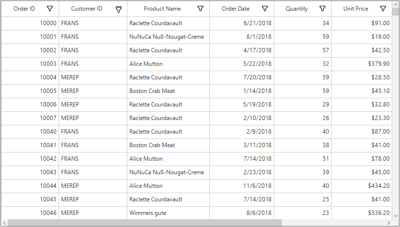

### Filter DateColumn with range between two dates

A GridDateTimeColumn can be filtered with range between two dates by applying two FilterPredicates for the same column. The [FilterType](https://help.syncfusion.com/cr/windowsforms/Syncfusion.Data.FilterType.html) for the FilterPredicate with start date should be `GreaterThanOrEqual` and end date should be `LessThanOrEqual`.



//Filter the Dates between 8/1/2018 to 8/9/2018
sfDataGrid.Columns["OrderDate"].FilterPredicates.Add(new FilterPredicate() { FilterType = FilterType.GreaterThanOrEqual, FilterValue = "8/1/2018" });
sfDataGrid.Columns["OrderDate"].FilterPredicates.Add(new FilterPredicate() { FilterType = FilterType.LessThanOrEqual, FilterValue = "8/9/2018" });


'Filter the Dates between 8/1/2018 to 8/9/2018
sfDataGrid.Columns("OrderDate").FilterPredicates.Add(New FilterPredicate() With {.FilterType = FilterType.GreaterThanOrEqual, .FilterValue = "8/1/2018"})
sfDataGrid.Columns("OrderDate").FilterPredicates.Add(New FilterPredicate() With {.FilterType = FilterType.LessThanOrEqual, .FilterValue = "8/9/2018"})



### Retrieving the filtered records

After filtering, the records in the view can be retrieved in the same order as displayed in the view by using the [SfDataGrid.View.Records](https://help.syncfusion.com/cr/windowsforms/Syncfusion.Data.CollectionViewAdv.html#Syncfusion_Data_CollectionViewAdv_Records) collection.



foreach (var record in sfDataGrid.View.Records)
{
    // Do your customizations here.
}


For Each record In sfDataGrid.View.Records
    ' Do your customizations here.
Next record



## UI Filtering 
The WinForms DataGrid (SfDataGrid) provides excel like filtering UI and also advanced filter UI to filter the data easily. UI filtering can be enabled by setting [SfDataGrid.AllowFiltering](https://help.syncfusion.com/cr/windowsforms/Syncfusion.WinForms.DataGrid.SfDataGrid.html#Syncfusion_WinForms_DataGrid_SfDataGrid_AllowFiltering) property to `true`. This allows to open the filter UI by clicking on the filter icon in column header to filter the records.
The filtering can be enabled or disabled for the particular column by setting [GridColumn.AllowFiltering](https://help.syncfusion.com/cr/windowsforms/Syncfusion.WinForms.DataGrid.GridColumnBase.html#Syncfusion_WinForms_DataGrid_GridColumnBase_AllowFiltering) property.



// Enable the UI filtering for the SfDataGrid.
this.sfDataGrid1.AllowFiltering = true;  

// Enable the UI filtering for the OrderID column.
this.sfDataGrid1.Columns["OrderID"].AllowFiltering = true;


' Enable the UI filtering for the SfDataGrid.
Me.sfDataGrid1.AllowFiltering = True

' Enable the UI filtering for the OrderID column.
Me.sfDataGrid1.Columns("OrderID").AllowFiltering = True



N>`GridColumn.AllowFiltering` has higher priority than `SfDataGrid.AllowFiltering` property.

### Built-in UI Views
The SfDataGrid provides the following types of Filter popup modes, 

* Checkbox Filter - Provides excel like filter interface with list of check box’s.
* Advanced Filter - Provides advanced filter options to filter the data.
* Both - Both Checkbox Filter and Advanced Filter are loaded while opening the filter pop-up. 
By default, the filter popup mode of the column is set as `Both`. The checkbox and the advanced filter UI’s can be switched by using the Advanced Filter button.

**Checkbox Filtering UI**

**Advanced Filtering UI**

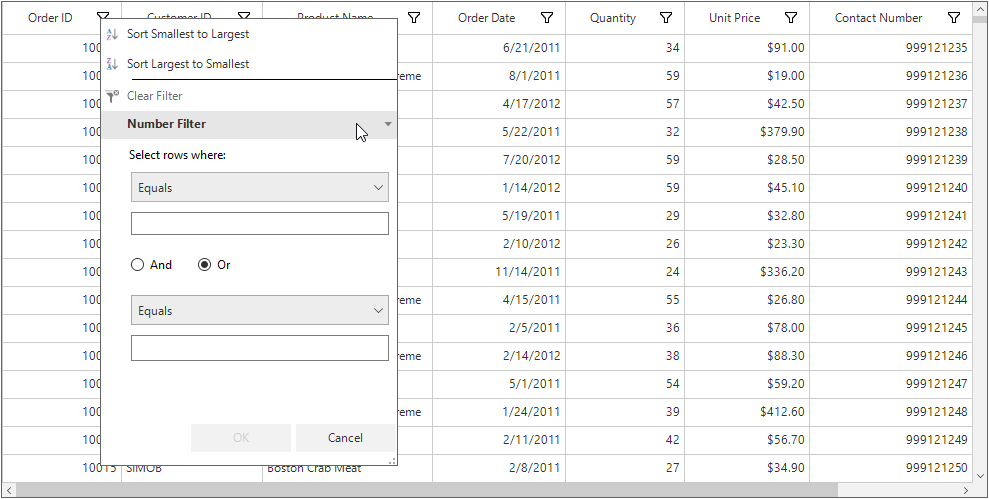

### Changing Filter UI View for Grid
The Filter popup mode for the SfDataGrid can be set by using the [SfDataGrid.FilterPopupMode](https://help.syncfusion.com/cr/windowsforms/Syncfusion.WinForms.DataGrid.SfDataGrid.html#Syncfusion_WinForms_DataGrid_SfDataGrid_FilterPopupMode) property.



// Sets the Advanced filter mode for the SfDataGrid.
this.sfDataGrid1.FilterPopupMode = FilterPopupMode.AdvancedFilter;

// Sets the CheckBox filter mode for the SfDataGrid.
this.sfDataGrid1.FilterPopupMode = FilterPopupMode.CheckBoxFilter;

//Sets the Both filter mode for the SfDataGrid.
this.sfDataGrid1.FilterPopupMode = FilterPopupMode.Both;


' Sets the Advanced filter mode for the SfDataGrid.
Me.sfDataGrid1.FilterPopupMode = FilterPopupMode.AdvancedFilter

' Sets the CheckBox filter mode for the SfDataGrid.
Me.sfDataGrid1.FilterPopupMode = FilterPopupMode.CheckBoxFilter

'Sets the Both filter mode for the SfDataGrid.
Me.sfDataGrid1.FilterPopupMode = FilterPopupMode.Both



### Changing Filter UI View for Column
The Filter popup mode for the column can be set by using the [GridColumn.FilterPopupMode](https://help.syncfusion.com/cr/windowsforms/Syncfusion.WinForms.DataGrid.GridColumnBase.html#Syncfusion_WinForms_DataGrid_GridColumnBase_FilterPopupMode) property.



// Sets the advanced filter popup mode for the column.
sfDataGrid1.Columns["OrderID"].FilterPopupMode = FilterPopupMode.AdvancedFilter;

// Sets the checkbox filter popup mode for the column.
sfDataGrid1.Columns["OrderID"].FilterPopupMode = FilterPopupMode.CheckBoxFilter;

// Sets the Both advanced and checkbox filter popup mode for the column.
sfDataGrid1.Columns["OrderID"].FilterPopupMode = FilterPopupMode.Both;


' Sets the advanced filter popup mode for the column.
sfDataGrid1.Columns("OrderID").FilterPopupMode = FilterPopupMode.AdvancedFilter

' Sets the checkbox filter popup mode for the column.
sfDataGrid1.Columns("OrderID").FilterPopupMode = FilterPopupMode.CheckBoxFilter

' Sets the Both advanced and checkbox filter popup mode for the column.
sfDataGrid1.Columns("OrderID").FilterPopupMode = FilterPopupMode.Both



### Changing Filter UI using Event
The column `FilterPopupMode` can also be changed by using the [FilterPopupShowing](https://help.syncfusion.com/cr/windowsforms/Syncfusion.WinForms.DataGrid.SfDataGrid.html) event. This even will be raised on opening the filter popup.



sfDataGrid.FilterPopupShowing += sfDataGrid_FilterPopupShowing;
void sfDataGrid_FilterPopupShowing(object sender, FilterPopupShowingEventArgs e)
{
    if(e.Column.MappingName == "OrderID")
    {
        e.Control.FilterPopupMode = FilterPopupMode.AdvancedFilter;
    }
}


AddHandler sfDataGrid.FilterPopupShowing, AddressOf sfDataGrid_FilterPopupShowing

Private Sub sfDataGrid_FilterPopupShowing(ByVal sender As Object, ByVal e As FilterPopupShowingEventArgs)
	If e.Column.MappingName = "OrderID" Then
		e.Control.FilterPopupMode = FilterPopupMode.AdvancedFilter
	End If
End Sub



## Checkbox Filtering
The Checkbox filtering is like the Excel like filter popup. Which shows the checked list box of the unique items with the search textbox. 
The items which are in the checked state will be visible in the view other items will be filtered out of the view. 



// Sets the CheckBox filter mode for the SfDataGrid.
this.sfDataGrid1.FilterPopupMode = FilterPopupMode.CheckBoxFilter;

// Sets the checkbox filter popup mode for the column.
sfDataGrid1.Columns["OrderID"].FilterPopupMode = FilterPopupMode.CheckBoxFilter;


' Sets the CheckBox filter mode for the SfDataGrid.
Me.sfDataGrid1.FilterPopupMode = FilterPopupMode.CheckBoxFilter

' Sets the checkbox filter popup mode for the column.
sfDataGrid1.Columns("OrderID").FilterPopupMode = FilterPopupMode.CheckBoxFilter



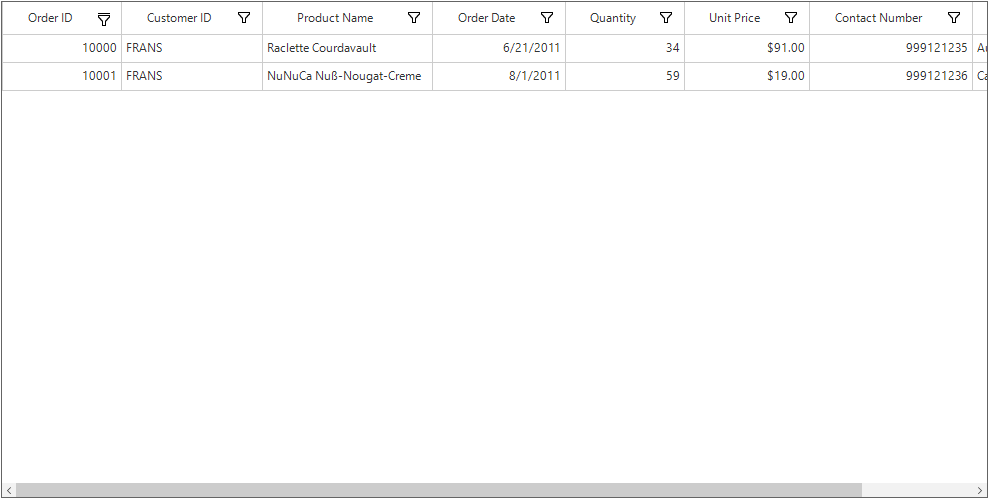

### Instant Filtering
By default, filters are applied to the columns when OK button is clicked in UI filtering. This can be change to update the filters immediately whenever update in filter popup by setting the [ImmediateUpdateColumnFilter](https://help.syncfusion.com/cr/windowsforms/Syncfusion.WinForms.DataGrid.GridColumnBase.html#Syncfusion_WinForms_DataGrid_GridColumnBase_ImmediateUpdateColumnFilter) property as true for the corresponding column.
This will loads the Checkbox filter popup with the `Done` button to close the filter popup.


// Enable immediate filtering for the column.
this.sfDataGrid1.Columns["CustomerID"].ImmediateUpdateColumnFilter = true;


' Enable immediate filtering for the column.
Me.sfDataGrid1.Columns("CustomerID").ImmediateUpdateColumnFilter = True



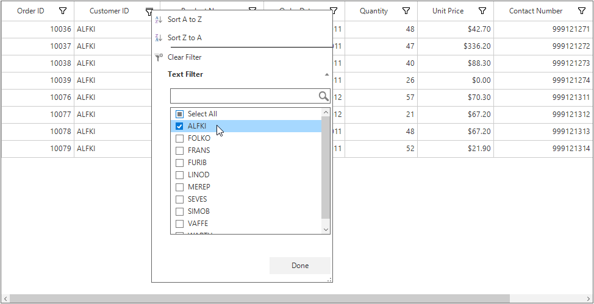

### Filtering Null Values 
The null values of the column can be filtered by using the ` (Blanks) ` option of the checked list box. This can be enabled for the column by setting the [AllowBlankFilters](https://help.syncfusion.com/cr/windowsforms/Syncfusion.WinForms.DataGrid.GridColumnBase.html#Syncfusion_WinForms_DataGrid_GridColumnBase_AllowBlankFilters) property to `true`.



// Enable blank filters for the column.
this.sfDataGrid1.Columns["CustomerID"].AllowBlankFilters = true;


' Enable blank filters for the column.
Me.sfDataGrid1.Columns("CustomerID").AllowBlankFilters = True



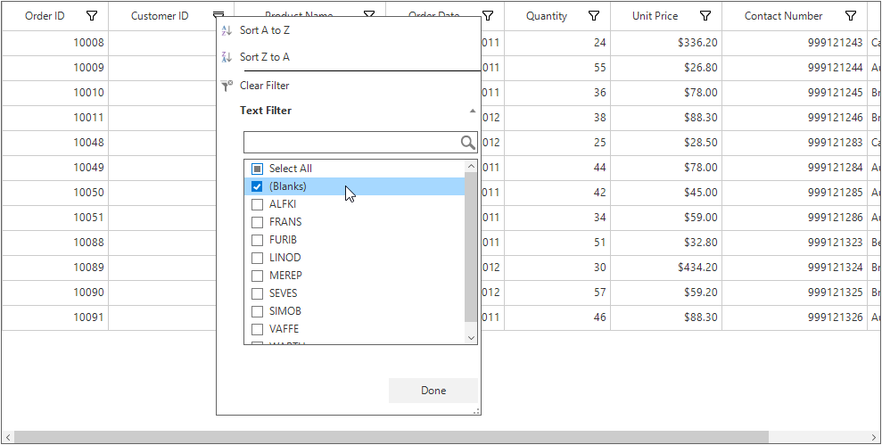

N>If there is no null values exist in the column, the `(Blanks)` option will not be listed in the CheckedListBox.

### Filtering based on Display Text
By default, the filtering is applied based on the actual value of the column. This can be changed to filter based on the display text by setting the [FilterMode](https://help.syncfusion.com/cr/windowsforms/Syncfusion.WinForms.DataGrid.GridColumnBase.html#Syncfusion_WinForms_DataGrid_GridColumnBase_FilterMode) value as `ColumnFilter.DisplayText`.
In the below screenshot, first and second records have same display value for OrderDate column but both have different actual value (E.g. 29/06/2018 12:00:00 AM and 29/06/2018 6:30:00 PM). 

By default, based on the actual value only filter will be applied. So it will consider both values as different. And while opening filter popup, both values will be displayed like below.

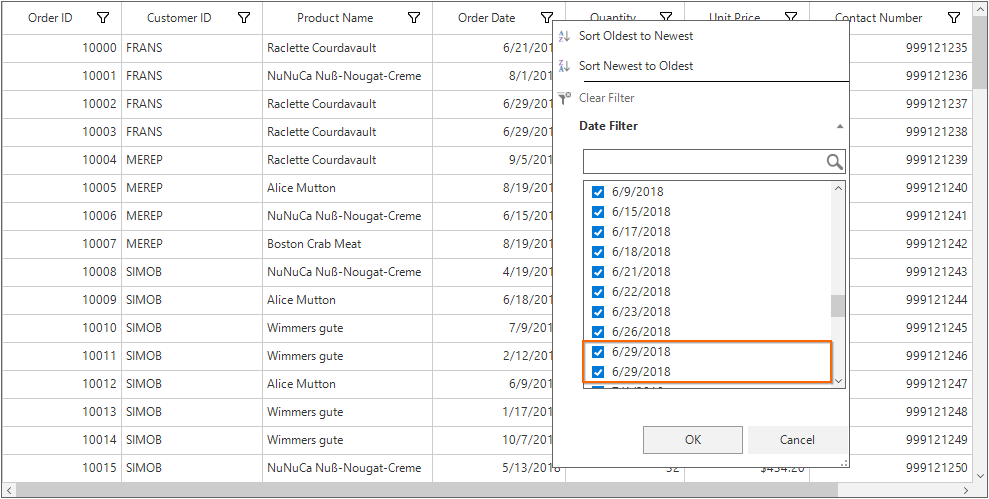

If the `FilterMode` is set as DisplayText, display value only will be considered for filtering. So filter popup will be shown like below.

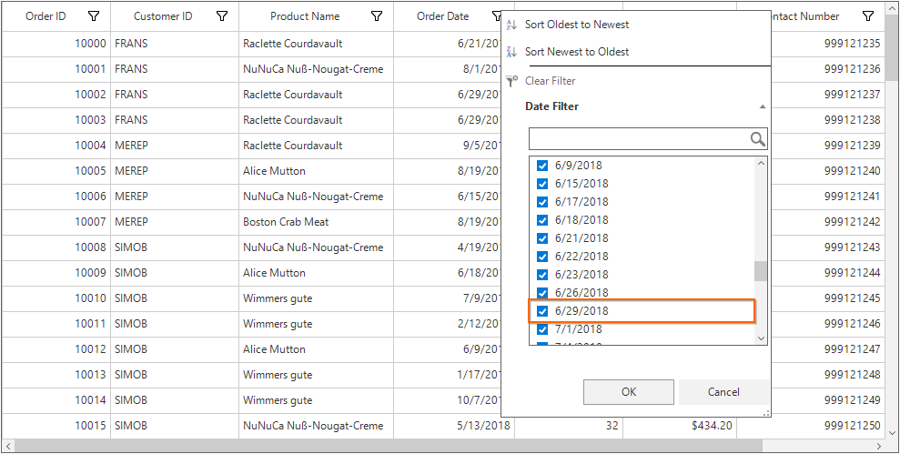

After filtering, both records having the same OrderDate display value will be displayed in view.

## Advanced Filtering
Advanced filter UI provides multiple filter options to filter the data easily. Filter menu options are loaded based on advanced filter type by automatically detecting the underlying date type.
Below are the built-in filter types supported.

* **Text Filters** – Loads various menu options to filter the display text effectively.
* **Number Filters** – Loads various menu options to filter the numeric data.
* **Date Filters** – Loads various menu options and DatePicker to filter DateTime type column.

<table>
<tr>
<th>
Text Filter
</th>
<th>
Number Filter
</th>
<th>
Date Filter
</th>
</tr>
<tr>
<td>
When the string value is bounded to the 
GridColumn or the items source is dynamic, then `TextFilter` are loaded in advanced filter.
</td>
<td>
When integer, double, short, decimal, byte or long are bound to the GridColumn then `Number Filters` are loaded in advanced filter.
</td>
<td>
When the DateTime type value is bound to the GridColumn, then `Date Filter` is loaded in advanced filter.
</td>
</tr>
<tr>
<td>

</td>
<td>

</td>
<td>
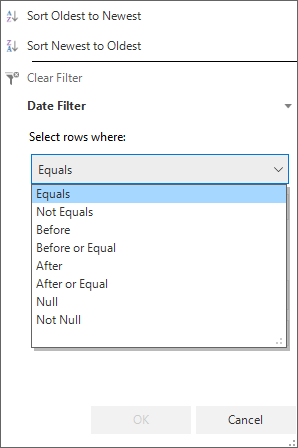
</td>
</tr>
<tr>
<td>
<b>Filter Menu Options</b>
<ol>
<li>Equals</li>
<li>Not Equal</li>
<li>Begins With</li>
<li>Does Not Begin With</li>
<li>Ends With</li>
<li>Does Not End With</li>
<li>Contains</li>
<li>Does Not Contain</li>
<li>Empty</li>
<li>Not Empty</li>
<li>Null</li>
<li>Not Null</li>
</ol>
</td>
<td>
<b>Filter Menu Options</b>
<ol>
<li>Equals</li>
<li>Not Equal</li>
<li>Null</li>
<li>Not Null</li>
<li>Less Than</li>
<li>Less Than or Equal</li>
<li>Greater Than</li>
<li>Greater Than or Equal</li>
</ol>
</td>
<td>
<b>Filter Menu Options</b>
<ol>
<li>Equals</li>
<li>Not Equal</li>
<li>Before</li>
<li>Before Or Equal</li>
<li>After</li>
<li>After Or Equal</li>
<li>Null</li>
<li>Not Null</li>
</ol>
</td>
</tr>
</table>

N> 
1. Null and Not Null options are available only when `AllowBlankFilters` is set to `true`.
2. If the column is `GridUnboundColumn`, then Text Filter will be loaded.

### Instant Filtering
By default the advanced filtering will be applied while clicking the OK button after specifying the suitable filter value. This can be changed to update filtering immediately on updating the filter popup by setting the [ImmediateUpdateColumnFilter](https://help.syncfusion.com/cr/windowsforms/Syncfusion.WinForms.DataGrid.GridColumnBase.html#Syncfusion_WinForms_DataGrid_GridColumnBase_ImmediateUpdateColumnFilter) property to `true` for the column.

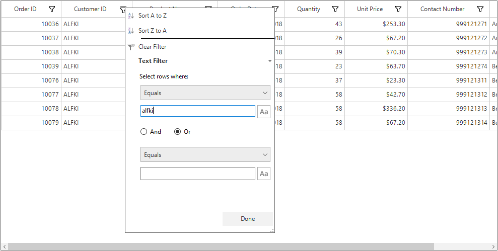

### Filtering Null Values 
The null values can be filtered by using the `Null` and `Not Null` filter conditions from the advanced filter. 

### Case Sensitive Filtering
The case sensitive filtering can be enabled for the column by using the casing buttons available in the advanced filter UI. If the button is active the filtering will be applied with the case sensitive with the filter text.

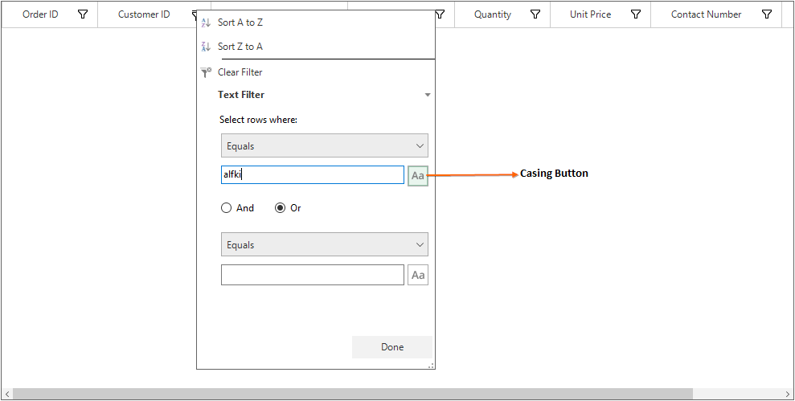

## Customization using Events

### Loading Text Filter for Number or Date Column
To load the Text Filter for the column that has number or date value as underlying type, set the `FilterBehavior` property of the GridColumn as `StringTyped`. This loads the Text Filters instead of Number or Date Filters.



//To load the text filter instead of date filter.
sfDataGrid.Columns["OrderDate"].FilterBehavior = FilterBehavior.StringTyped;


'To load the text filter instead of date filter.
sfDataGrid.Columns("OrderDate").FilterBehavior = FilterBehavior.StringTyped



### Customizing Filter Predicates
The filter predicated can be customized by using the [FilterChanging](https://help.syncfusion.com/cr/windowsforms/Syncfusion.WinForms.DataGrid.SfDataGrid.html) event. This event will be raised while applying the filter using the filter control.


sfDataGrid.FilterChanging +=sfDataGrid_FilterChanging;
void sfDataGrid_FilterChanging(object sender, FilterChangingEventArgs e)
{
    if (e.FilterPredicates == null || e.Column.MappingName != "CustomerID" || e.FilterPredicates.Count == 0)
        return;

    if (e.FilterPredicates[0].FilterValue.Equals("ALFKI"))
        e.FilterPredicates[0].FilterValue = "MEREP";          
}


AddHandler sfDataGrid.FilterChanging, AddressOf sfDataGrid_FilterChanging
Private Sub sfDataGrid_FilterChanging(ByVal sender As Object, ByVal e As FilterChangingEventArgs)
	If e.FilterPredicates Is Nothing OrElse e.Column.MappingName <> "CustomerID" OrElse e.FilterPredicates.Count = 0 Then
		Return
	End If

	If e.FilterPredicates(0).FilterValue.Equals("ALFKI") Then
		e.FilterPredicates(0).FilterValue = "MEREP"
	End If
End Sub



### Getting the Filtered Records
The filtered records can be get by using the [FilterChanged](https://help.syncfusion.com/cr/windowsforms/Syncfusion.WinForms.DataGrid.SfDataGrid.html) event. This event will be fired after performing the filtering in SfDataGrid.


sfDataGrid.FilterChanged +=sfDataGrid_FilterChanged;
void sfDataGrid_FilterChanged(object sender, FilterChangedEventArgs e)
{
    //OrderInfo is Model Class 
    ObservableCollection<OrderInfo> order = new ObservableCollection<OrderInfo>();

    // Get filtered records
    var records = (sender as SfDataGrid).View.Records;
    foreach (RecordEntry record in records)
        order.Add(record.Data as OrderInfo);
}


AddHandler sfDataGrid.FilterChanged, AddressOf sfDataGrid_FilterChanged
Private Sub sfDataGrid_FilterChanged(ByVal sender As Object, ByVal e As FilterChangedEventArgs)
	'OrderInfo is Model Class 
	Dim order As New ObservableCollection(Of OrderInfo)()

	' Get filtered records
	Dim records = (TryCast(sender, SfDataGrid)).View.Records

	For Each record As RecordEntry In records
		order.Add(TryCast(record.Data, OrderInfo))
	Next record
End Sub



### Displaying Custom Filter Control for Filtering
The custom filter control can be loaded instead of the default filter control by handling the [FilterPopupShowing](https://help.syncfusion.com/cr/windowsforms/Syncfusion.WinForms.DataGrid.SfDataGrid.html) event.


public class CustomFilterControl : FilterControlBase
{
    SfDataGrid grid;
    public string MappingName { get; set; }
    public CustomFilterControl(SfDataGrid grid)
        : base()
    {
        this.grid = grid;
        this.ShowSortPanel = false;
    }
    protected override void OnOKButtonClicked(object sender, EventArgs e)
    {
        if (!string.IsNullOrEmpty(MappingName))
        {
            var column = grid.Columns[MappingName];
            column.FilterPredicates.Clear();
            foreach (var item in this.CheckListBox.CheckedItems)
            {
                FilterPredicate predicate = new FilterPredicate
                {
                    FilterBehavior = Syncfusion.Data.FilterBehavior.StringTyped,
                    PredicateType = PredicateType.Or,
                    FilterMode = ColumnFilter.DisplayText,
                    FilterType = FilterType.Contains,
                    FilterValue = (item as FilterElement).DisplayText,
                    IsCaseSensitive = false
                };
                column.FilterPredicates.Add(predicate);
            }
        }
        base.OnOKButtonClicked(sender, e);
    }
}


Public Class CustomFilterControl
	Inherits FilterControlBase
	Private grid As SfDataGrid
	Public Property MappingName() As String

	Public Sub New(ByVal grid As SfDataGrid)
		MyBase.New()
		Me.grid = grid
		Me.ShowSortPanel = False
	End Sub

	Protected Overrides Sub OnOKButtonClicked(ByVal sender As Object, ByVal e As EventArgs)
		If Not String.IsNullOrEmpty(MappingName) Then
			Dim column = grid.Columns(MappingName)
			column.FilterPredicates.Clear()
			For Each item In Me.CheckListBox.CheckedItems
				Dim predicate As FilterPredicate = New FilterPredicate With {.FilterBehavior = Syncfusion.Data.FilterBehavior.StringTyped, .PredicateType = PredicateType.Or, .FilterMode = ColumnFilter.DisplayText, .FilterType = FilterType.Contains, .FilterValue = (TryCast(item, FilterElement)).DisplayText, .IsCaseSensitive = False}

				column.FilterPredicates.Add(predicate)
			Next item
		End If

		MyBase.OnOKButtonClicked(sender, e)
	End Sub
End Class



The custom filter control can be loaded in the SfDataGrid by using the `FilterPopupShowing` event. 


void sfDataGrid_FilterPopupShowing(object sender, FilterPopupShowingEventArgs e)
{
    if (e.Column.MappingName == "CustomerID")
    {
        e.Cancel = true;
        List<string> items = new List<string>();
        items.Add(new FilterElement() { DisplayText = "MEREP" });
        items.Add(new FilterElement() { DisplayText = "FOLKO" });
        items.Add(new FilterElement() { DisplayText = "ALFKI" });
        var customFilterControl = new CustomFilterControl(this.sfDataGrid);
        customFilterControl.Show(this.sfDataGrid, e.Location);
        customFilterControl.CheckListBox.DataSource = items;
        customFilterControl.CheckListBox.DisplayMember = "DisplayText";
        customFilterControl.MappingName = e.Column.MappingName;
    }
}


Private Sub sfDataGrid_FilterPopupShowing(ByVal sender As Object, ByVal e As FilterPopupShowingEventArgs)
	If e.Column.MappingName = "CustomerID" Then
		e.Cancel = True
		Dim items As New List(Of String)()
		items.Add(New FilterElement() With {.DisplayText = "MEREP"})
		items.Add(New FilterElement() With {.DisplayText = "FOLKO"})
		items.Add(New FilterElement() With {.DisplayText = "ALFKI"})
		Dim customFilterControl = New CustomFilterControl(Me.sfDataGrid)
		customFilterControl.Show(Me.sfDataGrid, e.Location)
		customFilterControl.CheckListBox.DataSource = items
		customFilterControl.CheckListBox.DisplayMember = "DisplayText"
		customFilterControl.MappingName = e.Column.MappingName
	End If
End Sub



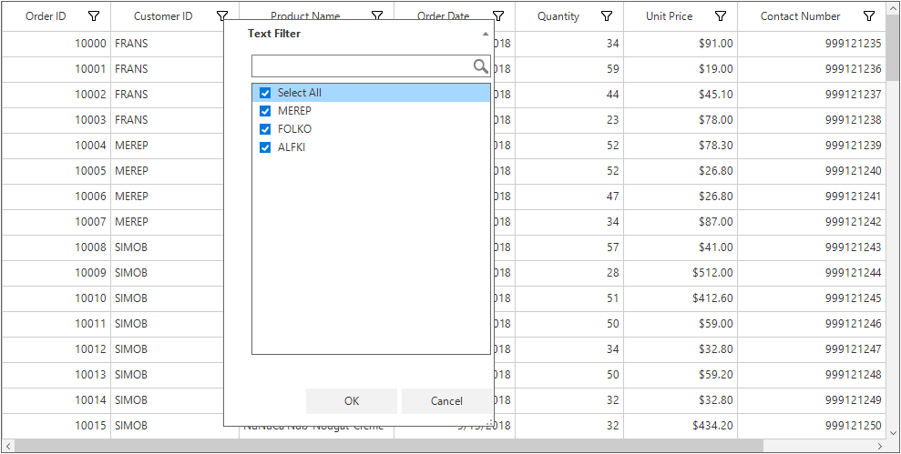

### Skip the frozen row data from filtering

The frozen rows can be skipped from filtering and retained in the view by using the [FilterPopupShown](https://help.syncfusion.com/cr/windowsforms/Syncfusion.WinForms.DataGrid.SfDataGrid.html) and [FilterChanging](https://help.syncfusion.com/cr/windowsforms/Syncfusion.WinForms.DataGrid.SfDataGrid.html) events.

The [FilterPopupShown](https://help.syncfusion.com/cr/windowsforms/Syncfusion.WinForms.DataGrid.SfDataGrid.html) event can be used to avoid frozen row data being populated into the filter item list.



this.sfDataGrid.FilterPopupShown += sfDataGrid_FilterPopupShown;

void sfDataGrid_FilterPopupShown(object sender, Syncfusion.WinForms.DataGrid.Events.FilterPopupShownEventArgs e)
{
    //Check whether the rows frozen in SfDataGrid .
    //If it is true means ,the default value loaded in FilterElement .
    if (this.sfDataGrid.FrozenRowCount < 1)
        return;

    //Get the column name which is going to be applied Filtering
    var columnName = e.Column.MappingName;

    //Gets property access provider for getting frozen rows display value
    var provider = this.sfDataGrid.View.GetPropertyAccessProvider();

    //Get the corresponding FilterElement of the column
    var dataSource = e.Control.CheckListBox.DataSource as List<FilterElement>;

    //Check whether the Grouping is applied or not .
    //If Grouping is not applied means ,you can get record directly from View 
    if (this.sfDataGrid.GroupColumnDescriptions != null && this.sfDataGrid.GroupColumnDescriptions.Count < 1)
    {
        //Get the records from view of SfDataGrid
        var records = this.sfDataGrid.View.Records;

        //Get the value for frozen rows count of corresponding column and remove it from FilterElement collection
        for (int i = 0; i < this.sfDataGrid.FrozenRowCount && i < this.sfDataGrid.View.Records.Count; i++)
        {
            var value = provider.GetValue(records[i].Data, columnName);
            if (value != null)
            {
                //Remove from FilterElement collection
                var removeElement = dataSource.FirstOrDefault(item => (item.ActualValue != null && item.ActualValue
                e.Control.CheckListBox.View.Items.Remove(removeElement);

            }
        }
    }

    //If Grouping is applied, need to get the records DisplayElements of TopLevelGroup in view
    else
    {
        //Gets the records from DisplayElements
        var records = this.sfDataGrid.View.TopLevelGroup.DisplayElements;

        for (int i = 0; i < this.sfDataGrid.FrozenRowCount && i < this.sfDataGrid.View.TopLevelGroup.DisplayElemen
        {
            if (records[i] is RecordEntry)
            {
                //Get the value for frozen rows count of corresponding column and remove it
                var value = provider.GetValue((records[i] as RecordEntry).Data, columnName);
                if (value != null)
                {
                    //Remove from FilterElement collection
                    var removeElement = dataSource.FirstOrDefault(item => (item.ActualValue != null && item.Actual
                    e.Control.CheckListBox.View.Items.Remove(removeElement);
                }
            }
        }
    }
}


AddHandler Me.sfDataGrid.FilterPopupShown, AddressOf sfDataGrid_FilterPopupShown

Private Sub sfDataGrid_FilterPopupShown(ByVal sender As Object, ByVal e As Syncfusion.WinForms.DataGrid.Events.FilterPopupShownEventArgs)
	'Check whether the rows frozen in SfDataGrid .
	'If it is true means, the default value loaded in FilterElement.
	If Me.sfDataGrid.FrozenRowCount < 1 Then
		Return
	End If

	'Get the column name which is going to be applied Filtering
	Dim columnName = e.Column.MappingName

	'Gets property access provider for getting frozen rows display value
	Dim provider = Me.sfDataGrid.View.GetPropertyAccessProvider()

	'Get the corresponding FilterElement of the column
	Dim dataSource = TryCast(e.Control.CheckListBox.DataSource, List(Of FilterElement))

	'Check whether the Grouping is applied or not.
	'If Grouping is not applied means, you can get record directly from View 
	If Me.sfDataGrid.GroupColumnDescriptions IsNot Nothing AndAlso Me.sfDataGrid.GroupColumnDescriptions.Count < 1 Then
		'Get the records from view of SfDataGrid
		Dim records = Me.sfDataGrid.View.Records

		'Get the value for frozen rows count of corresponding column and remove it from FilterElement collection
		Dim i As Integer = 0
		Do While i < Me.sfDataGrid.FrozenRowCount AndAlso i < Me.sfDataGrid.View.Records.Count
			Dim value = provider.GetValue(records(i).Data, columnName)
			If value IsNot Nothing Then
				'Remove from FilterElement collection
				Dim removeElement = dataSource.FirstOrDefault(Function(item) (item.ActualValue IsNot Nothing AndAlso item.ActualValue.Equals(value)) OrElse item.ActualValue Is Nothing)
				e.Control.CheckListBox.View.Items.Remove(removeElement)

			End If
			i += 1
		Loop

	'If Grouping is applied, need to get the records DisplayElements of TopLevelGroup in view
	Else
		'Gets the records from DisplayElements
		Dim records = Me.sfDataGrid.View.TopLevelGroup.DisplayElements

		Dim i As Integer = 0
		Do While i < Me.sfDataGrid.FrozenRowCount AndAlso i < Me.sfDataGrid.View.TopLevelGroup.DisplayElements.Count
			If TypeOf records(i) Is RecordEntry Then
				'Get the value for frozen rows count of corresponding column and remove it from FilterElement collection
				Dim value = provider.GetValue((TryCast(records(i), RecordEntry)).Data, columnName)
				If value IsNot Nothing Then
					'Remove from FilterElement collection
					Dim removeElement = dataSource.FirstOrDefault(Function(item) (item.ActualValue IsNot Nothing AndAlso item.ActualValue.Equals(value)) OrElse item.ActualValue Is Nothing)
					e.Control.CheckListBox.View.Items.Remove(removeElement)
				End If
			End If
			i += 1
		Loop
	End If
End Sub



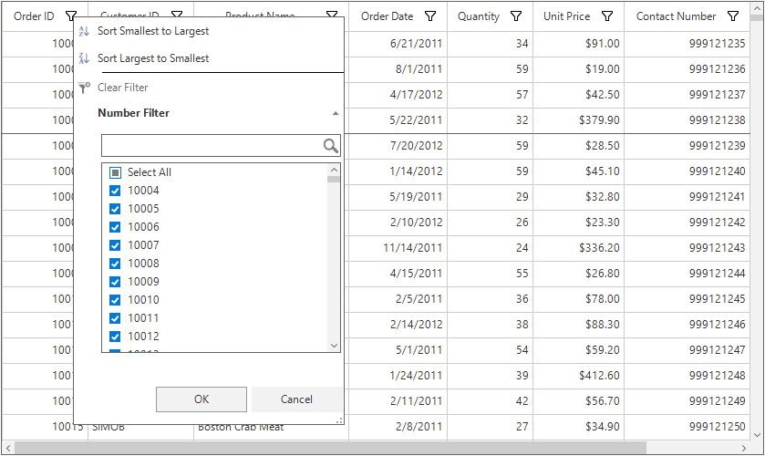

Retain the frozen row data in the view by managing the [FilterPredicates](https://help.syncfusion.com/cr/windowsforms/Syncfusion.WinForms.DataGrid.Events.FilterChangingEventArgs.html#Syncfusion_WinForms_DataGrid_Events_FilterChangingEventArgs_FilterPredicates) collection in the [FilterChanging](https://help.syncfusion.com/cr/windowsforms/Syncfusion.WinForms.DataGrid.SfDataGrid.html) event. In the following code, the frozen row data is added to the filter predicates using the `FilterPredicates` argument.



this.sfDataGrid.FilterChanging += sfDataGrid_FilterChanging;
        
void sfDataGrid_FilterChanging(object sender, Syncfusion.WinForms.DataGrid.Events.FilterChangingEventArgs e)
{
    //Check whether the Filtering is applied and the FrozenRowCount is more than zero 
    //If it is true means, the default filtering operation will be performed 
    if (e.FilterPredicates == null || this.sfDataGrid.FrozenRowCount < 1)
        return;

    //Gets property access provider for getting frozen rows display value
    var provider = this.sfDataGrid.View.GetPropertyAccessProvider();

    //Get the column name for which the filtering is going to be applied
    var columnName = e.Column.MappingName;

    //Check whether the Grouping is applied or not .
    //If Grouping is not applied means ,you can get record directly from View 
    if (this.sfDataGrid.GroupColumnDescriptions != null && this.sfDataGrid.GroupColumnDescriptions.Count < 1)
    {
        //Gets the records from the View
        var records = this.sfDataGrid.View.Records;

        //Add the FrozenRows filter predicate to view 
        for (int i = 0; i < this.sfDataGrid.FrozenRowCount; i++)
        {
            var value = provider.GetValue(records[i].Data, columnName);
            AddPredicates(e.FilterPredicates, FilterType.Equals, PredicateType.Or, value);
        }
    }

    //If Grouping is applied, need to get the records DisplayElements of TopLevelGroup in view
    else
    {
        //Gets the records from DisplayElements
        var records = this.sfDataGrid.View.TopLevelGroup.DisplayElements;

        //Get the value for frozen rows count of corresponding column and add it to FilterPredicate collection
        for (int i = 0; i < this.sfDataGrid.FrozenRowCount; i++)
        {
            if (records[i] is RecordEntry)
            {
                var value = provider.GetValue((records[i] as RecordEntry).Data, columnName);
                AddPredicates(e.FilterPredicates, FilterType.Equals, PredicateType.Or, value);
            }
        }
    }
}

//FilerPredicate added here
private void AddPredicates(List<FilterPredicate> FilterPredicates, FilterType FilterType, PredicateType predicateType, object value)
{
    FilterPredicates.Add(new FilterPredicate()
    {
        FilterValue = value,
        FilterType = FilterType,
        FilterBehavior = FilterBehavior.StronglyTyped,
        IsCaseSensitive = true,
        PredicateType = predicateType
    });
}


AddHandler Me.sfDataGrid.FilterChanging, AddressOf sfDataGrid_FilterChanging

Private Sub sfDataGrid_FilterChanging(ByVal sender As Object, ByVal e As Syncfusion.WinForms.DataGrid.Events.FilterChangingEventArgs)
	'Check whether the Filtering is applied and the FrozenRowCount is more than zero 
	'If it is true means, the default filtering operation will be performed 
	If e.FilterPredicates Is Nothing OrElse Me.sfDataGrid.FrozenRowCount < 1 Then
		Return
	End If

	'Gets property access provider for getting frozen rows display value
	Dim provider = Me.sfDataGrid.View.GetPropertyAccessProvider()

	'Get the column name for which the filtering is going to be applied
	Dim columnName = e.Column.MappingName

	'Check whether the Grouping is applied or not .
	'If Grouping is not applied means ,you can get record directly from View 
	If Me.sfDataGrid.GroupColumnDescriptions IsNot Nothing AndAlso Me.sfDataGrid.GroupColumnDescriptions.Count < 1 Then
		'Gets the records from the View
		Dim records = Me.sfDataGrid.View.Records

		'Add the FrozenRows filter predicate to view 
		For i As Integer = 0 To Me.sfDataGrid.FrozenRowCount - 1
			Dim value = provider.GetValue(records(i).Data, columnName)
			AddPredicates(e.FilterPredicates, FilterType.Equals, PredicateType.Or, value)
		Next i

	'If Grouping is applied, need to get the records DisplayElements of TopLevelGroup in view
	Else
		'Gets the records from DisplayElements
		Dim records = Me.sfDataGrid.View.TopLevelGroup.DisplayElements

		'Get the value for frozen rows count of corresponding column and add it to FilterPredicate collection
		For i As Integer = 0 To Me.sfDataGrid.FrozenRowCount - 1
			If TypeOf records(i) Is RecordEntry Then
				Dim value = provider.GetValue((TryCast(records(i), RecordEntry)).Data, columnName)
				AddPredicates(e.FilterPredicates, FilterType.Equals, PredicateType.Or, value)
			End If
		Next i
	End If
End Sub

'FilerPredicate added here
Private Sub AddPredicates(ByVal FilterPredicates As List(Of FilterPredicate), ByVal FilterType As FilterType, ByVal predicateType As PredicateType, ByVal value As Object)
	FilterPredicates.Add(New FilterPredicate() With {.FilterValue = value, .FilterType = FilterType, .FilterBehavior = FilterBehavior.StronglyTyped, .IsCaseSensitive = True, .PredicateType = predicateType})
End Sub



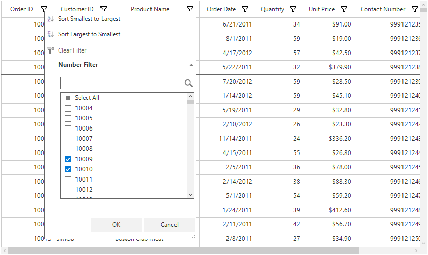

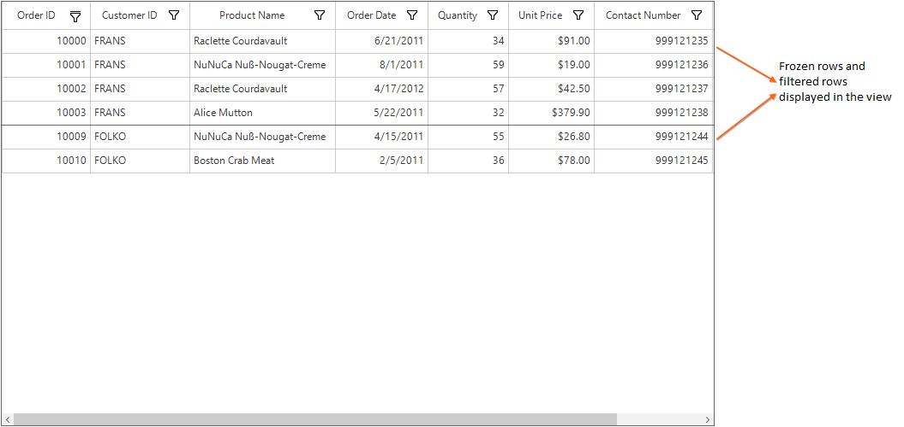

Download [Sample location](http://www.syncfusion.com/downloads/support/directtrac/general/ze/Sample1392776176).

## Appearance

### Hiding Sort Options 
The sort options of the filter control can be hidden by setting the [ShowSortPanel](https://help.syncfusion.com/cr/windowsforms/Syncfusion.WinForms.DataGrid.GridFiltering.DataGridFilterControl.html) property to `false` in the [FilterPopupShowing](https://help.syncfusion.com/cr/windowsforms/Syncfusion.WinForms.DataGrid.SfDataGrid.html) event.



sfDataGrid.FilterPopupShowing +=sfDataGrid_FilterPopupShowing;
void sfDataGrid_FilterPopupShowing(object sender, FilterPopupShowingEventArgs e)
{
    //Hide the sorting options of the filter control
    e.Control.ShowSortPanel = false;            
}


AddHandler sfDataGrid.FilterPopupShowing, AddressOf sfDataGrid_FilterPopupShowing
Private Sub sfDataGrid_FilterPopupShowing(ByVal sender As Object, ByVal e As FilterPopupShowingEventArgs)
	'Hide the sorting options of the filter control
	e.Control.ShowSortPanel = False
End Sub



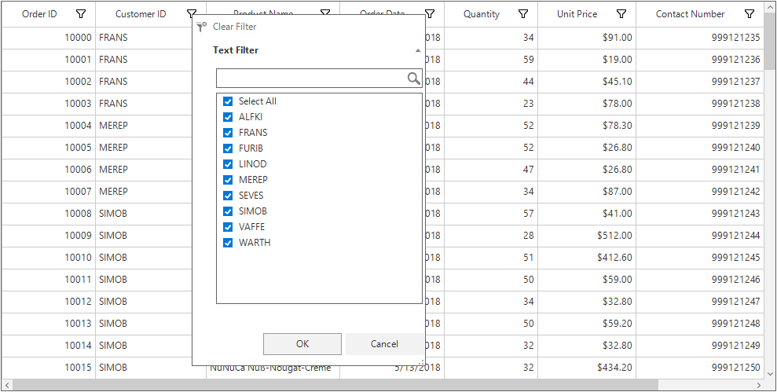

### Setting Custom Filter/Filtered Icons in Column Header
The custom filter icon or the filtered icons can be set to the column header by using the [HeaderStyle.FilterIcon](https://help.syncfusion.com/cr/windowsforms/Syncfusion.WinForms.DataGrid.Styles.HeaderStyleInfo.html#Syncfusion_WinForms_DataGrid_Styles_HeaderStyleInfo_FilterIcon) and [HeaderStyle.FilteredIcon](https://help.syncfusion.com/cr/windowsforms/Syncfusion.WinForms.DataGrid.Styles.HeaderStyleInfo.html#Syncfusion_WinForms_DataGrid_Styles_HeaderStyleInfo_FilteredIcon) property.



sfDataGrid.Columns[1].HeaderStyle.FilterIcon = new Bitmap(Image.FromFile(@"..\..\FilterIcon.png"));
sfDataGrid.Columns[0].HeaderStyle.FilteredIcon = new Bitmap(Image.FromFile(@"..\..\FilteredIcon.png"));


sfDataGrid.Columns(1).HeaderStyle.FilterIcon = New Bitmap(Image.FromFile("..\..\FilterIcon.png"))
sfDataGrid.Columns(0).HeaderStyle.FilteredIcon = New Bitmap(Image.FromFile("..\..\FilteredIcon.png"))



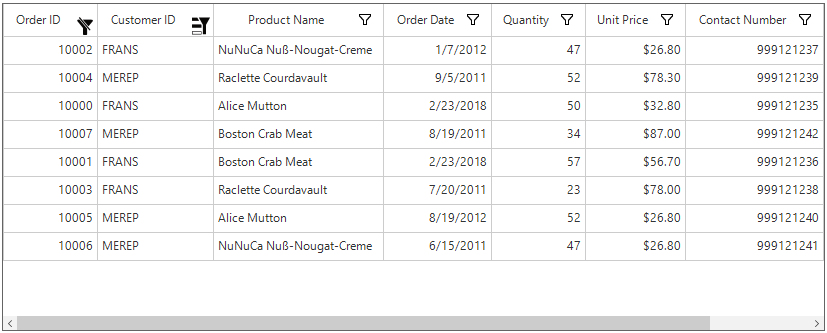

### Styling filter control

The appearance of the inner controls added to the GridFilterControl can be customized using the [SfDataGrid.FilterPopupShowing](https://help.syncfusion.com/cr/windowsforms/Syncfusion.WinForms.DataGrid.Events.FilterPopupShowingEventArgs.html) event. The [FilterPopupShowingEventArgs.Control](https://help.syncfusion.com/cr/windowsforms/Syncfusion.WinForms.DataGrid.Events.FilterPopupShowingEventArgs.html#Syncfusion_WinForms_DataGrid_Events_FilterPopupShowingEventArgs_Control) property provides access to all the controls inside the GridFilterControl that can be used to customize the style of each control.



this.sfDataGrid.FilterPopupShowing += sfDataGrid_FilterPopupShowing;

void sfDataGrid_FilterPopupShowing(object sender, FilterPopupShowingEventArgs e)
{
    e.Control.BackColor = ColorTranslator.FromHtml("#EDF3F3");

    //Customize the appearance of the CheckedListBox
    e.Control.CheckListBox.Style.CheckBoxStyle.CheckedBorderColor = e.Control.CheckListBox.Style.CheckBoxStyle.CheckedBackColor = ColorTranslator.FromHtml("#029684");
    e.Control.CheckListBox.Style.CheckBoxStyle.UncheckedBorderColor = ColorTranslator.FromHtml("#029684");
    e.Control.CheckListBox.Style.CheckBoxStyle.IndeterminateColor = e.Control.CheckListBox.Style.CheckBoxStyle.IndeterminateBorderColor = ColorTranslator.FromHtml("#029684");
    e.Control.CheckListBox.Style.ItemStyle.BackColor = ColorTranslator.FromHtml("#F9FDFE");
    e.Control.CheckListBox.Style.SelectionStyle.SelectionBackColor = ColorTranslator.FromHtml("#EDF3F3");

    //Customize the appearance of the Ok and Cancel buttons
    e.Control.OkButton.BackColor =  e.Control.CancelButton.BackColor = ColorTranslator.FromHtml("#029684");
    e.Control.OkButton.ForeColor = e.Control.CancelButton.ForeColor = Color.White;
    e.Control.OkButton.Font = e.Control.CancelButton.Font = new Font("Segoe UI", 9, FontStyle.Bold);
}


AddHandler sfDataGrid.FilterPopupShowing, AddressOf sfDataGrid_FilterPopupShowing

Private Sub sfDataGrid_FilterPopupShowing(ByVal sender As Object, ByVal e As FilterPopupShowingEventArgs)
	e.Control.BackColor = ColorTranslator.FromHtml("#EDF3F3")

	'Customize the appearance of the CheckedListBox
	e.Control.CheckListBox.Style.CheckBoxStyle.CheckedBackColor = ColorTranslator.FromHtml("#029684")
	e.Control.CheckListBox.Style.CheckBoxStyle.CheckedBorderColor = e.Control.CheckListBox.Style.CheckBoxStyle.CheckedBackColor
	e.Control.CheckListBox.Style.CheckBoxStyle.UncheckedBorderColor = ColorTranslator.FromHtml("#029684")
	e.Control.CheckListBox.Style.CheckBoxStyle.IndeterminateBorderColor = ColorTranslator.FromHtml("#029684")
	e.Control.CheckListBox.Style.CheckBoxStyle.IndeterminateColor = e.Control.CheckListBox.Style.CheckBoxStyle.IndeterminateBorderColor
	e.Control.CheckListBox.Style.ItemStyle.BackColor = ColorTranslator.FromHtml("#F9FDFE")
	e.Control.CheckListBox.Style.SelectionStyle.SelectionBackColor = ColorTranslator.FromHtml("#EDF3F3")

	'Customize the appearance of the Ok and Cancel buttons
	e.Control.CancelButton.BackColor = ColorTranslator.FromHtml("#029684")
	e.Control.OkButton.BackColor = e.Control.CancelButton.BackColor
	e.Control.CancelButton.ForeColor = Color.White
	e.Control.OkButton.ForeColor = e.Control.CancelButton.ForeColor
	e.Control.CancelButton.Font = New Font("Segoe UI", 9, FontStyle.Bold)
	e.Control.OkButton.Font = e.Control.CancelButton.Font
End Sub



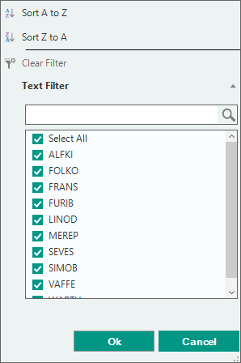
