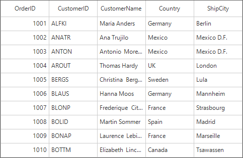
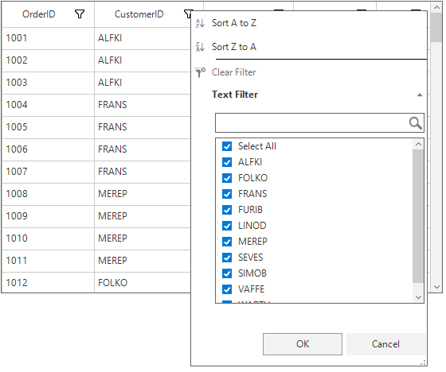

# Getting Started with Windows Forms DataGrid (SfDataGrid)
This section provides a quick overview for working with the data grid for WinForms. Walk through the entire process of creating a real world data grid.

To get start quickly with WinForms DataGrid, you can check on this video:

<iframe id='WinFormsDataGridVideoTutorial' src='https://www.youtube.com/embed/ShhjvfqfrxM'></iframe>

## Assembly Deployment

Refer [control dependencies](https://help.syncfusion.com/windowsforms/control-dependencies#sfdatagrid) section to get the list of assemblies or [NuGet package](https://help.syncfusion.com/windowsforms/visual-studio-integration/nuget-packages) needs to be added as reference to use the SfDataGrid control in any application.

## Creating Application with SfDataGrid
In this walk through, users will create WinForms application that contains SfDataGrid control.

### Creating the Project
Create new Windows Forms Project in Visual Studio to display SfDataGrid with data objects.

### Adding Control via Designer
SfDataGrid control can be added to the application by dragging it from Toolbox and dropping it in Designer. The required assembly references will be added automatically.

### Adding Control in Code
In order to add control manually, do the below steps,

1) 	Add the required [assembly references](https://help.syncfusion.com/windowsforms/control-dependencies#sfdatagrid) to the project

2)	Create the SfDataGrid control instance and add it to the Form



using Syncfusion.WinForms.DataGrid;

namespace WindowsFormsApplication1
{
    public partial class Form1 : Form
    {
        public Form1()
        {
            InitializeComponent();
            SfDataGrid sfDataGrid1 = new SfDataGrid();
            sfDataGrid1.Location = new System.Drawing.Point(85, 108);
            sfDataGrid1.Size = new System.Drawing.Size(240, 150); 
            this.Controls.Add(sfDataGrid1);
        }
    }
}


Imports Syncfusion.WinForms.DataGrid

Namespace WindowsFormsApplication1
	Partial Public Class Form1
		Inherits Form
		Public Sub New()
			InitializeComponent()
			Dim sfDataGrid1 As New SfDataGrid()
			sfDataGrid1.Location = New System.Drawing.Point(85, 108)
			sfDataGrid1.Size = New System.Drawing.Size(240, 150)
			Me.Controls.Add(sfDataGrid1)
		End Sub
	End Class
End Namespace



### Creating Data for Sample Application

SfDataGrid is a data-bound control. So data must be created for application.

1)	Create data object class named “OrderInfo” and declare properties as shown below,



public class OrderInfo
{
    int orderID;
    string customerId;
    string country;
    string customerName;
    string shippingCity;
    public int OrderID
    {
        get { return orderID; }
        set { orderID = value; }
    }
    public string CustomerID
    {
        get { return customerId; }
        set { customerId = value; }
    }
    public string CustomerName
    {
        get { return customerName; }
        set { customerName = value; }
    }
    public string Country
    {
        get { return country; }
        set { country = value; }
    }
    public string ShipCity
    {
        get { return shippingCity; }
        set { shippingCity = value; }
    }
    public OrderInfo(int orderId, string customerName, string country, string customerId, string shipCity)
    {
        this.OrderID = orderId;
        this.CustomerName = customerName;
        this.Country = country;
        this.CustomerID = customerId;
        this.ShipCity = shipCity;
    }
}


Public Class OrderInfo
	Private _orderID As Integer
	Private _customerId As String
	Private _country As String
	Private _customerName As String
	Private _shippingCity As String

	Public Property OrderID() As Integer
		Get
			Return _orderID
		End Get
		Set(ByVal value As Integer)
			_orderID = value
		End Set
	End Property

	Public Property CustomerID() As String
		Get
			Return _customerId
		End Get
		Set(ByVal value As String)
			_customerId = value
		End Set
	End Property

	Public Property CustomerName() As String
		Get
			Return _customerName
		End Get
		Set(ByVal value As String)
			_customerName = value
		End Set
	End Property

	Public Property Country() As String
		Get
			Return _country
		End Get
		Set(ByVal value As String)
			_country = value
		End Set
	End Property

	Public Property ShipCity() As String
		Get
			Return _shippingCity
		End Get
		Set(ByVal value As String)
			_shippingCity = value
		End Set
	End Property

	Public Sub New(ByVal orderId As Integer, ByVal customerName As String, ByVal country As String, ByVal customerId As String, ByVal shipCity As String)
		Me.OrderID = orderId
		Me.CustomerName = customerName
		Me.Country = country
		Me.CustomerID = customerId
		Me.ShipCity = shipCity
	End Sub
End Class



2)	Create an **OrderInfoCollection** class with Orders property and Orders property is initialized with several data objects in constructor.



public class OrderInfoCollection
{
    private ObservableCollection<OrderInfo> _orders;
    public ObservableCollection<OrderInfo> Orders
    {
        get { return _orders; }
        set { _orders = value; }
    }
    public OrderInfoCollection()
    {
        _orders = new ObservableCollection<OrderInfo>();
        this.GenerateOrders();
    }
    private void GenerateOrders()
    {
        _orders.Add(new OrderInfo(1001, "Maria Anders", "Germany", "ALFKI", "Berlin"));
        _orders.Add(new OrderInfo(1002, "Ana Trujilo", "Mexico", "ANATR", "Mexico D.F."));
        _orders.Add(new OrderInfo(1003, "Antonio Moreno", "Mexico", "ANTON", "Mexico D.F."));
        _orders.Add(new OrderInfo(1004, "Thomas Hardy", "UK", "AROUT", "London"));
        _orders.Add(new OrderInfo(1005, "Christina Berglund", "Sweden", "BERGS", "Lula"));
        _orders.Add(new OrderInfo(1006, "Hanna Moos", "Germany", "BLAUS", "Mannheim"));
        _orders.Add(new OrderInfo(1007, "Frederique Citeaux", "France", "BLONP", "Strasbourg"));
        _orders.Add(new OrderInfo(1008, "Martin Sommer", "Spain", "BOLID", "Madrid"));
        _orders.Add(new OrderInfo(1009, "Laurence Lebihan", "France", "BONAP", "Marseille"));
        _orders.Add(new OrderInfo(1010, "Elizabeth Lincoln", "Canada", "BOTTM", "Tsawassen"));
    }
}


Public Class OrderInfoCollection
	Private _orders As ObservableCollection(Of OrderInfo)
	Public Property Orders() As ObservableCollection(Of OrderInfo)
		Get
			Return _orders
		End Get
		Set(ByVal value As ObservableCollection(Of OrderInfo))
			_orders = value
		End Set
	End Property

	Public Sub New()
		_orders = New ObservableCollection(Of OrderInfo)()
		Me.GenerateOrders()
	End Sub

	Private Sub GenerateOrders()
		_orders.Add(New OrderInfo(1001, "Maria Anders", "Germany", "ALFKI", "Berlin"))
		_orders.Add(New OrderInfo(1002, "Ana Trujilo", "Mexico", "ANATR", "Mexico D.F."))
		_orders.Add(New OrderInfo(1003, "Antonio Moreno", "Mexico", "ANTON", "Mexico D.F."))
		_orders.Add(New OrderInfo(1004, "Thomas Hardy", "UK", "AROUT", "London"))
		_orders.Add(New OrderInfo(1005, "Christina Berglund", "Sweden", "BERGS", "Lula"))
		_orders.Add(New OrderInfo(1006, "Hanna Moos", "Germany", "BLAUS", "Mannheim"))
		_orders.Add(New OrderInfo(1007, "Frederique Citeaux", "France", "BLONP", "Strasbourg"))
		_orders.Add(New OrderInfo(1008, "Martin Sommer", "Spain", "BOLID", "Madrid"))
		_orders.Add(New OrderInfo(1009, "Laurence Lebihan", "France", "BONAP", "Marseille"))
		_orders.Add(New OrderInfo(1010, "Elizabeth Lincoln", "Canada", "BOTTM", "Tsawassen"))
	End Sub
End Class



### Binding to Data
To bind the SfDataGrid to data, set the [SfDataGrid.DataSource](https://help.syncfusion.com/cr/windowsforms/Syncfusion.WinForms.DataGrid.SfDataGrid.html#Syncfusion_WinForms_DataGrid_SfDataGrid_DataSource) property to an IEnumerable implementation. Each row in SfDataGrid is bound to an object in data source and each column in SfDataGrid bound to a property in data object.


OrderInfoCollection orderInfoCollection = new OrderInfoCollection();
sfDataGrid1.DataSource = orderInfoCollection.Orders;


Dim orderInfoCollection As New OrderInfoCollection()
sfDataGrid1.DataSource = orderInfoCollection.Orders



Now, run the application, the below output will occur.

## Defining Columns
By default, the SfDataGrid control generates the columns automatically when value assigned to [SfDataGrid.DataSource](https://help.syncfusion.com/cr/windowsforms/Syncfusion.WinForms.DataGrid.SfDataGrid.html#Syncfusion_WinForms_DataGrid_SfDataGrid_DataSource) property. The type of the column generated depends on the type of data in the column and the attribute of the property the column bound with.
The following table lists the column types and its constraints for auto column generation.
<table>
<tr>
<td>
{{'**Generated Column Type**'| markdownify }}
</td>
<td>
{{'**Data Type / Attribute**'| markdownify }}
</td>
</tr>
<tr>
<td>
GridTextColumn
</td>
<td>
Property of type String and any other type apart from below specified cases.
</td>
</tr>
<tr>
<td>
GridNumericColumn
</td>
<td>
Property of type Int, Double, Float, Decimal.
</td>
</tr>
<tr>
<td>
GridDateTimeColumn
</td>
<td>
Property of type DateTime.
</td>
</tr>
<tr>
<td>
GridImageColumn
</td>
<td>
Property of type Byte[]
</td>
</tr>
<tr>
<td>
GridHyperLinkColumn
</td>
<td>
Property of type Uri
</td>
</tr>
<tr>
<td>
GridCheckBoxColumn
</td>
<td>
Property of type Bool.
</td>
</tr>
</table>
When columns are auto-generated, the [SfDataGrid.AutoGeneratingColumn](https://help.syncfusion.com/cr/windowsforms/Syncfusion.WinForms.DataGrid.SfDataGrid.html) event can be handled to customize or cancel the columns before they are added to the SfDataGrid.
The automatic column generation can be prevented by setting [SfDataGrid.AutoGenerateColumns](https://help.syncfusion.com/cr/windowsforms/Syncfusion.WinForms.DataGrid.SfDataGrid.html#Syncfusion_WinForms_DataGrid_SfDataGrid_AutoGenerateColumns) property is false, The columns to be displayed should be defined as below,


sfDataGrid1.AutoGenerateColumns = false;
sfDataGrid1.Columns.Add(new GridTextColumn() { MappingName = "OrderID" });
sfDataGrid1.Columns.Add(new GridTextColumn() { MappingName = "CustomerID" });


sfDataGrid1.AutoGenerateColumns = False
sfDataGrid1.Columns.Add(New GridTextColumn() With {.MappingName = "OrderID"})
sfDataGrid1.Columns.Add(New GridTextColumn() With {.MappingName = "CustomerID"})


Below is the list of column types provided in SfDataGrid.
<table>
<tr>
<td>
{{'**Column Type**'| markdownify }}
</td>
<td>
{{'**Comments**'| markdownify }}
</td>
</tr>
<tr>
<td>
GridTextColumn
</td>
<td>
Represents SfDataGrid column that hosts textual content in its cells.
</td>
</tr>
<tr>
<td>
GridNumericColumn
</td>
<td>
Represents SfDataGrid column that hosts SfNumericTextBox controls in its cells which is used to format and display Numeric values.
</td>
</tr>
<tr>
<td>
GridDataTimeColumn
</td>
<td>
Represents SfDataGrid column that hosts SfDateTimeEdit controls in its cells which is used to display and format DateTime values.
</td>
</tr>
<tr>
<td>
GridImageColumn
</td>
<td>
Represents SfDataGrid column that hosts Image in its cells.
</td>
</tr>
<tr>
<td>
GridHyperLinkColumn
</td>
<td>
Represents SfDataGrid column that hosts Hyperlink in its cells
</td>
</tr>
<tr>
<td>
GridCheckBoxColumn
</td>
<td>
Represents SfDataGrid column that hosts CheckBox in its cells.
</td>
</tr>
<tr>
<td>
GridComboBoxColumn
</td>
<td>
Represents SfDataGrid column that hosts ComboBox in its cells.
</td>
</tr>
<tr>
<td>
GridButtonColumn
</td>
<td>
Represents SfDataGrid column that hosts Button in its cells.
</td>
</tr>
<tr>
<td>
GridUnboundColumn
</td>
<td>
Represents SfDataGrid column that hosts textual content which are not actually bound with data object of row.
</td>
</tr>
</table>

## Selection
By default, the entire row is selected when a user clicks a cell in a SfDataGrid. The [SfDataGrid.SelectionMode](https://help.syncfusion.com/cr/windowsforms/Syncfusion.WinForms.DataGrid.SfDataGrid.html#Syncfusion_WinForms_DataGrid_SfDataGrid_SelectionMode) property can be set to specify whether a user can select single row, or multiple rows. The information about the rows that are selected can be retrieved using [SfDataGrid.SelectedItem](https://help.syncfusion.com/cr/windowsforms/Syncfusion.WinForms.DataGrid.SfDataGrid.html#Syncfusion_WinForms_DataGrid_SfDataGrid_SelectedItem) and [SfDataGrid.SelectedItems](https://help.syncfusion.com/cr/windowsforms/Syncfusion.WinForms.DataGrid.SfDataGrid.html#Syncfusion_WinForms_DataGrid_SfDataGrid_SelectedItems) properties.


sfDataGrid1.SelectionMode = Syncfusion.WinForms.DataGrid.Enums.GridSelectionMode.Extended;


sfDataGrid1.SelectionMode = Syncfusion.WinForms.DataGrid.Enums.GridSelectionMode.Extended



The selection operations can be handled with the help of [SfDataGrid.SelectionChanging](https://help.syncfusion.com/cr/windowsforms/Syncfusion.WinForms.DataGrid.SfDataGrid.html) and [SfDataGrid.SelectionChanged](https://help.syncfusion.com/cr/windowsforms/Syncfusion.WinForms.DataGrid.SfDataGrid.html) events of SfDataGrid.

## Sorting, Grouping, and Filtering

### Sorting
By default, columns in a SfDataGrid can be sorted by clicking the column header. The sorting can be configured by setting [SfDataGrid.SortColumnDescriptions](https://help.syncfusion.com/cr/windowsforms/Syncfusion.WinForms.DataGrid.SfDataGrid.html#Syncfusion_WinForms_DataGrid_SfDataGrid_SortColumnDescriptions) property as below,


OrderInfoCollection orderInfoCollection = new OrderInfoCollection();
sfDataGrid1.DataSource = orderInfoCollection.Orders;
sfDataGrid1.SortColumnDescriptions.Add(new SortColumnDescription() { ColumnName = "Country" });


Dim orderInfoCollection As New OrderInfoCollection()
sfDataGrid1.DataSource = orderInfoCollection.Orders
sfDataGrid1.SortColumnDescriptions.Add(New SortColumnDescription() With {.ColumnName = "Country"})



The sorting can be customized by handling the [SfDataGrid.SortColumnsChanging](https://help.syncfusion.com/cr/windowsforms/Syncfusion.WinForms.DataGrid.SfDataGrid.html) and [SfDataGrid.SortColumnsChanged](https://help.syncfusion.com/cr/windowsforms/Syncfusion.WinForms.DataGrid.SfDataGrid.html) events. To cancel the default sort, set the Cancel property to true in `SfDataGrid.SortColumnsChanging` event.


sfDataGrid1.SortColumnsChanging += sfDataGrid1_SortColumnsChanging;

void sfDataGrid1_SortColumnsChanging(object sender, Syncfusion.WinForms.DataGrid.Events.SortColumnsChangingEventArgs e)
{
    if (e.AddedItems[0].ColumnName == "CustomerName")
        e.Cancel = true;
}


AddHandler sfDataGrid1.SortColumnsChanging, AddressOf sfDataGrid1_SortColumnsChanging

Private Sub sfDataGrid1_SortColumnsChanging(ByVal sender As Object, ByVal e As Syncfusion.WinForms.DataGrid.Events.SortColumnsChangingEventArgs)
	If e.AddedItems(0).ColumnName = "CustomerName" Then
		e.Cancel = True
	End If
End Sub



### Grouping
Grouping can be enabled by setting [SfDataGrid.ShowGroupDropArea](https://help.syncfusion.com/cr/windowsforms/Syncfusion.WinForms.DataGrid.SfDataGrid.html#Syncfusion_WinForms_DataGrid_SfDataGrid_ShowGroupDropArea) property, where group can be dragged by dragging the column header and dropping it in theGroupDropArea over the column headers. The grouping can be configured by setting [SfDataGrid.GroupColumnDescriptions](https://help.syncfusion.com/cr/windowsforms/Syncfusion.WinForms.DataGrid.SfDataGrid.html#Syncfusion_WinForms_DataGrid_SfDataGrid_GroupColumnDescriptions) property as below,


OrderInfoCollection orderInfoCollection = new OrderInfoCollection();
sfDataGrid1.DataSource = orderInfoCollection.Orders;
sfDataGrid1.GroupColumnDescriptions.Add(new GroupColumnDescription() { ColumnName = "CustomerName" });


Dim orderInfoCollection As New OrderInfoCollection()
sfDataGrid1.DataSource = orderInfoCollection.Orders
sfDataGrid1.GroupColumnDescriptions.Add(New GroupColumnDescription() With {.ColumnName = "CustomerName"})



### Filtering
Filtering can be enabled by setting [SfDataGrid.AllowFiltering](https://help.syncfusion.com/cr/windowsforms/Syncfusion.WinForms.DataGrid.SfDataGrid.html#Syncfusion_WinForms_DataGrid_SfDataGrid_AllowFiltering) property to true, where advanced filter UI can be  opened by clicking the Filter icon in column header and filter the SfDataGrid. The filtering operations ca be customized by handling [SfDataGrid.FilterChanging](https://help.syncfusion.com/cr/windowsforms/Syncfusion.WinForms.DataGrid.SfDataGrid.html) and [SfDataGrid.FilterChanged](https://help.syncfusion.com/cr/windowsforms/Syncfusion.WinForms.DataGrid.SfDataGrid.html) events.


OrderInfoCollection orderInfoCollection = new OrderInfoCollection();
sfDataGrid1.DataSource = orderInfoCollection.Orders;
sfDataGrid1.AllowFiltering = true;


Dim orderInfoCollection As New OrderInfoCollection()
sfDataGrid1.DataSource = orderInfoCollection.Orders
sfDataGrid1.AllowFiltering = True



## Editing
Editing can be enabled by setting [SfDataGrid.AllowEditing](https://help.syncfusion.com/cr/windowsforms/Syncfusion.WinForms.DataGrid.SfDataGrid.html#Syncfusion_WinForms_DataGrid_SfDataGrid_AllowEditing) property to true. Set [SfDataGrid.AllowDeleting](https://help.syncfusion.com/cr/windowsforms/Syncfusion.WinForms.DataGrid.SfDataGrid.html#Syncfusion_WinForms_DataGrid_SfDataGrid_AllowDeleting) property to specify whether user can delete rows by pressing <kbd>Delete</kbd> key.
Set [SfDataGrid.AddNewRowPosition](https://help.syncfusion.com/cr/windowsforms/Syncfusion.WinForms.DataGrid.SfDataGrid.html#Syncfusion_WinForms_DataGrid_SfDataGrid_AddNewRowPosition) property to enable additional row either Top or Bottom of SfDataGrid, where user can enter new items into the blank row. Adding new row adds an item to the [SfDataGrid.DataSource](https://help.syncfusion.com/cr/windowsforms/Syncfusion.WinForms.DataGrid.SfDataGrid.html#Syncfusion_WinForms_DataGrid_SfDataGrid_DataSource).
The editing operations can be customized by handling [SfDataGrid.CurrentCellBeginEdit](https://help.syncfusion.com/cr/windowsforms/Syncfusion.WinForms.DataGrid.SfDataGrid.html) and [SfDataGrid.CurrentCellEndEdit](https://help.syncfusion.com/cr/windowsforms/Syncfusion.WinForms.DataGrid.SfDataGrid.html) events.

## Handling events 
You cannot handle the Key and Mouse events of the SfDataGrid when raising them, because the TableControl is hosted in the SfDataGrid. So, raise the events for [SfDataGrid.TableControl](https://help.syncfusion.com/cr/windowsforms/Syncfusion.WinForms.DataGrid.SfDataGrid.html#Syncfusion_WinForms_DataGrid_SfDataGrid_TableControl).



//KeyDown Event for TableControl
sfDataGrid.TableControl.KeyDown += OnKeyDown;

void OnKeyDown(object sender, KeyEventArgs e)
{
    //Do your customization here
}

//MouseDown Event for TableControl
sfDataGrid.TableControl.MouseDown += OnMouseDown;

void OnMouseDown(object sender, MouseEventArgs e)
{
    //Do your customization here
}


'KeyDown Event for TableControl
AddHandler sfDataGrid.TableControl.KeyDown, AddressOf OnKeyDown

Private Sub OnKeyDown(ByVal sender As Object, ByVal e As KeyEventArgs)
	'Do your customization here
End Sub

'MouseDown Event for TableControl
AddHandler sfDataGrid.TableControl.MouseDown, AddressOf OnMouseDown

Private Sub OnMouseDown(ByVal sender As Object, ByVal e As MouseEventArgs)
	'Do your customization here
End Sub



