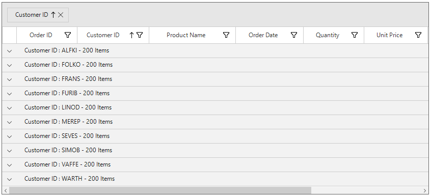
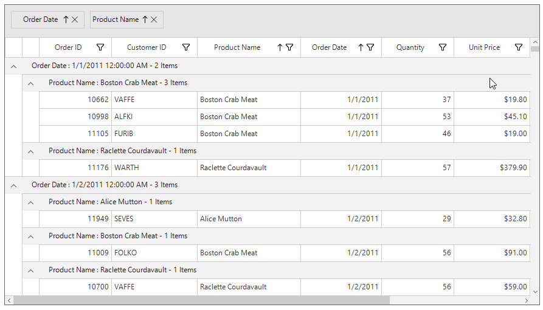
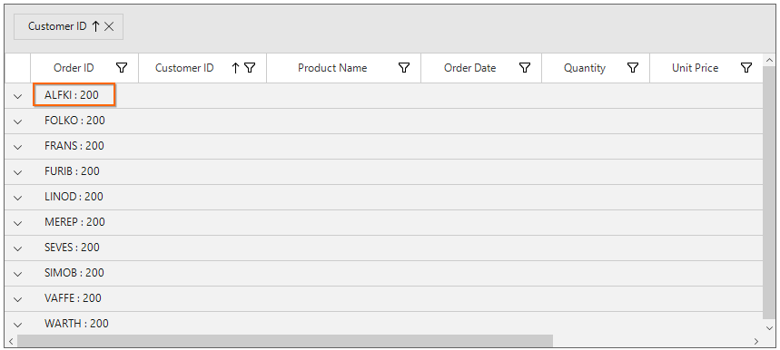
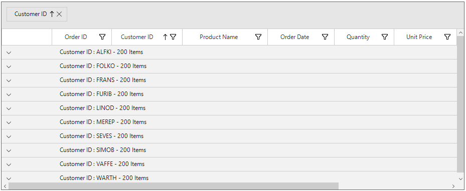
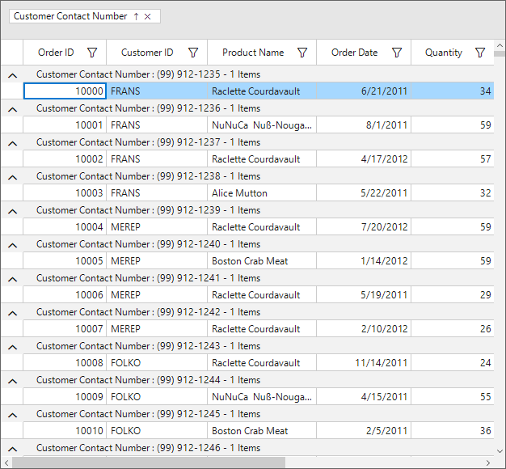
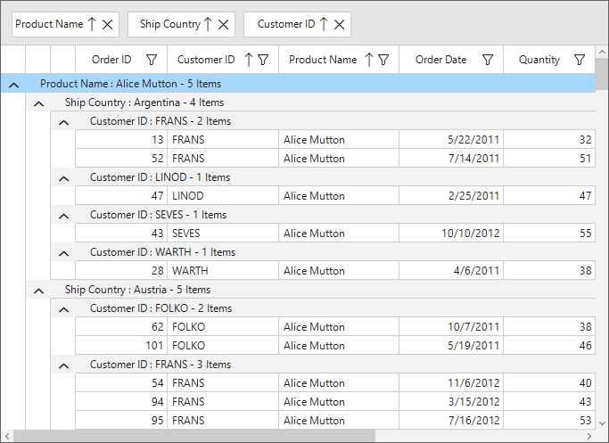
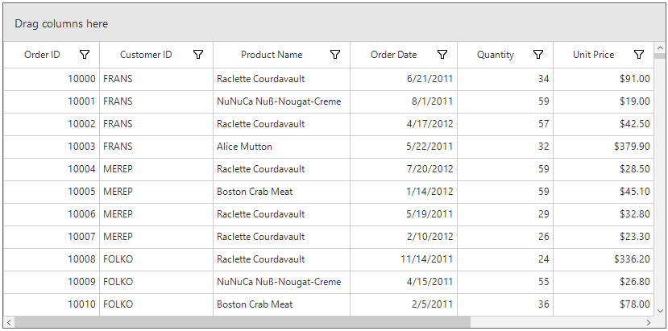
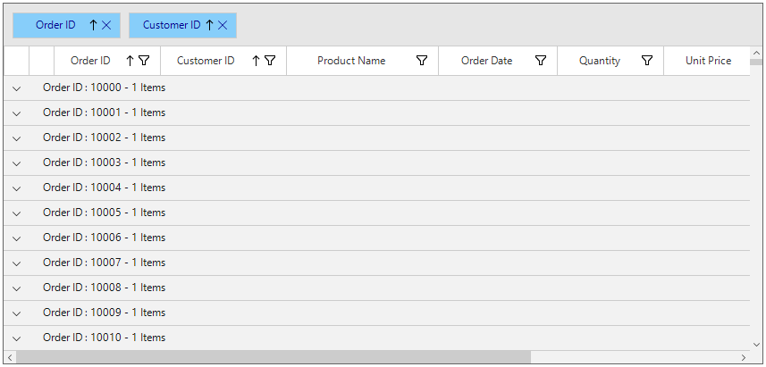
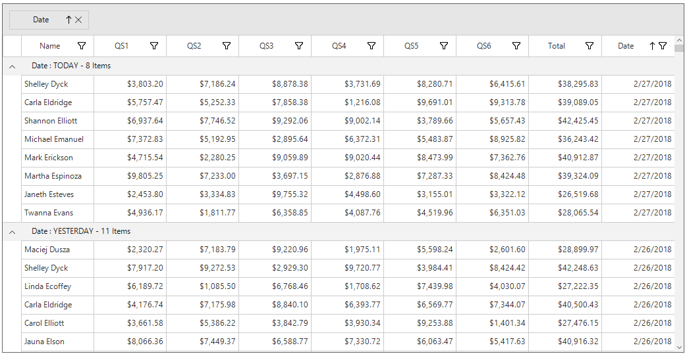

# Grouping in Windows Forms DataGrid (SfDataGrid)
SfDataGrid allows to group the data against one or more columns. When grouping is applied, the data is organized into a hierarchical structure based on matching column values and it is sorted by ascending order.

## UI Grouping
End-user can group the data by setting [SfDataGrid.AllowGrouping](https://help.syncfusion.com/cr/windowsforms/Syncfusion.WinForms.DataGrid.SfDataGrid.html#Syncfusion_WinForms_DataGrid_SfDataGrid_AllowGrouping) property to `true`, where user can drag and drop the column into `GroupDropArea` to group based on that column.
When the column is grouped, records that have an identical value in the column are combined to form a group. The GroupDropArea can be enabled by setting the [SfDataGrid.ShowGroupDropArea](https://help.syncfusion.com/cr/windowsforms/Syncfusion.WinForms.DataGrid.SfDataGrid.html#Syncfusion_WinForms_DataGrid_SfDataGrid_ShowGroupDropArea) property to `true`.


this.sfDataGrid1.AllowGrouping = true;


Me.sfDataGrid1.AllowGrouping = True



Grouping for particular column can  be enables or disabled by setting the [GridColumnBase.AllowGrouping](https://help.syncfusion.com/cr/windowsforms/Syncfusion.WinForms.DataGrid.GridColumnBase.html#Syncfusion_WinForms_DataGrid_GridColumnBase_AllowGrouping) property.


this.sfDataGrid1.Columns["OrderID"].AllowGrouping = true;
this.sfDataGrid1.Columns["CustomerID"].AllowGrouping = true;


Me.sfDataGrid1.Columns("OrderID").AllowGrouping = True
Me.sfDataGrid1.Columns("CustomerID").AllowGrouping = True



N> [GridColumn.AllowGrouping](https://help.syncfusion.com/cr/windowsforms/Syncfusion.WinForms.DataGrid.GridColumnBase.html#Syncfusion_WinForms_DataGrid_GridColumnBase_AllowGrouping) takes higher priority than [SfDataGrid.AllowGrouping.](https://help.syncfusion.com/cr/windowsforms/Syncfusion.WinForms.DataGrid.SfDataGrid.html#Syncfusion_WinForms_DataGrid_SfDataGrid_AllowGrouping)

The data can be grouped by an unlimited number of columns. To group more than one columns, drag-and-drop the desired columns in to `GroupDropArea`.

Each group is identified by its CaptionSummaryRows and it is used to organize the data into a hierarchical tree structure based on identical values of that column. The underlying records in each caption summary row can be expanded or collapsed by clicking its group caption.
Each `CaptionSummaryRow` carries information about a particular group like group name, number of items (records) in the group, etc. Refer the `Caption Summaries` section, for more information about `CaptionSummaryRow`.

## Programmatic Grouping

### Adding Groups

SfDataGrid allows to group the data programmatically by adding or removing [GroupColumnDescription](https://help.syncfusion.com/cr/windowsforms/Syncfusion.WinForms.DataGrid.GroupColumnDescription.html# "") to [SfDataGrid.GroupColumnDescriptions](https://help.syncfusion.com/cr/windowsforms/Syncfusion.WinForms.DataGrid.SfDataGrid.html#Syncfusion_WinForms_DataGrid_SfDataGrid_GroupColumnDescriptions) collection.
If OrderID column need to be grouped programmatically, define its [MappingName](https://help.syncfusion.com/cr/windowsforms/Syncfusion.WinForms.DataGrid.GridColumnBase.html#Syncfusion_WinForms_DataGrid_GridColumnBase_MappingName) to [ColumnName](https://help.syncfusion.com/cr/windowsforms/Syncfusion.WinForms.DataGrid.GroupColumnDescription.html#Syncfusion_WinForms_DataGrid_GroupColumnDescription_ColumnName) property of `GroupColumnDescription`. Then add the `GroupColumnDescription` to the `SfDataGrid.GroupColumnDescriptions` collection.


this.sfDataGrid1.GroupColumnDescriptions.Add(new GroupColumnDescription() { ColumnName = "OrderID" });


Me.sfDataGrid1.GroupColumnDescriptions.Add(New GroupColumnDescription() With {.ColumnName = "OrderID"})



### Removing Groups

The groups can be removed by removing [GroupColumnDescription](https://help.syncfusion.com/cr/windowsforms/Syncfusion.WinForms.DataGrid.GroupColumnDescription.html# "") from [SfDataGrid.GroupColumnDescriptions](https://help.syncfusion.com/cr/windowsforms/Syncfusion.WinForms.DataGrid.SfDataGrid.html#Syncfusion_WinForms_DataGrid_SfDataGrid_GroupColumnDescriptions) collection or by specifying the index using the `RemoveAt` method.


this.sfDataGrid1.GroupColumnDescriptions.Remove(new GroupColumnDescription() { ColumnName = "OrderID" });
// OR
this.sfDataGrid1.GroupColumnDescriptions.RemoveAt(1);


Me.sfDataGrid1.GroupColumnDescriptions.Remove(New GroupColumnDescription() With {.ColumnName = "OrderID"})
' OR
Me.sfDataGrid1.GroupColumnDescriptions.RemoveAt(1)



To ungroup the column in UI, click the close button on column header or drag the column header from the GroupDropArea and drop it on the header row.

### Clearing Groups
All the groups of the `SfDataGrid` can be removed by using `Clear` method.


this.sfDataGrid1.GroupColumnDescriptions.Clear();


Me.sfDataGrid1.GroupColumnDescriptions.Clear()



## Formatting Built-in Group Caption

The group caption text can be formatted using the [SfDataGrid.GroupCaptionTextFormat](https://help.syncfusion.com/cr/windowsforms/Syncfusion.WinForms.DataGrid.SfDataGrid.html#Syncfusion_WinForms_DataGrid_SfDataGrid_GroupCaptionTextFormat) property.
The default group caption format is `{ColumnName}: {Key} - {ItemsCount} Items`.

* ColumnName - Displays the name of the column currently grouped.
* Key - Displays the key value of group.
* ItemsCount - Displays the number of items in group.

The group caption format can be changed to Key and ItemsCount alone by setting [GroupCaptionTextFormat](https://help.syncfusion.com/cr/windowsforms/Syncfusion.WinForms.DataGrid.SfDataGrid.html#Syncfusion_WinForms_DataGrid_SfDataGrid_GroupCaptionTextFormat) as below,


this.sfDataGrid1.GroupCaptionTextFormat = "{Key} : {ItemsCount}";


Me.sfDataGrid1.GroupCaptionTextFormat = "{Key} : {ItemsCount}"



## Expanding or Collapsing the Groups

By default, the records in each group can be viewed by expanding its group caption. 
The end-user can expand or collapse the groups programmatically at runtime.

### Expand Groups while Grouping

All the groups can be expanded while grouping by setting [SfDataGrid.View.AutoExpandGroups](https://help.syncfusion.com/cr/windowsforms/Syncfusion.WinForms.DataGrid.SfDataGrid.html#Syncfusion_WinForms_DataGrid_SfDataGrid_AutoExpandGroups) to `true`. So, when user group any column, all groups will be in expanded state.


this.sfDataGrid1.View.AutoExpandGroups = true;


Me.sfDataGrid1.View.AutoExpandGroups = True



### Programmatically Expanding or Collapsing the Groups

#### Expand or Collapse All the Groups

All the groups can be expanded or collapsed programmatically at runtime by using [SfDataGrid.ExpandAllGroup](https://help.syncfusion.com/cr/windowsforms/Syncfusion.WinForms.DataGrid.SfDataGrid.html#Syncfusion_WinForms_DataGrid_SfDataGrid_ExpandAllGroup) and [SfDataGrid.CollapseAllGroup](https://help.syncfusion.com/cr/windowsforms/Syncfusion.WinForms.DataGrid.SfDataGrid.html#Syncfusion_WinForms_DataGrid_SfDataGrid_CollapseAllGroup) methods.


this.sfDataGrid1.ExpandAllGroup();
this.sfDataGrid1.CollapseAllGroup();


Me.sfDataGrid1.ExpandAllGroup()
Me.sfDataGrid1.CollapseAllGroup()



#### Expand or Collapse the Group based on its Level
Groups can be expanded or collapsed based on its level by using [SfDataGrid.ExpandGroupsAtLevel](https://help.syncfusion.com/cr/windowsforms/Syncfusion.WinForms.DataGrid.SfDataGrid.html#Syncfusion_WinForms_DataGrid_SfDataGrid_ExpandGroupsAtLevel_System_Int32_) and [SfDataGrid.CollapseGroupsAtLevel](https://help.syncfusion.com/cr/windowsforms/Syncfusion.WinForms.DataGrid.SfDataGrid.html#Syncfusion_WinForms_DataGrid_SfDataGrid_CollapseGroupsAtLevel_System_Int32_) methods.


this.sfDataGrid1.ExpandGroupsAtLevel(2);
this.sfDataGrid1.CollapseGroupsAtLevel(2);


Me.sfDataGrid1.ExpandGroupsAtLevel(2)
Me.sfDataGrid1.CollapseGroupsAtLevel(2)



#### Expand or Collapse the Specific Group
Specific group can be expanded or collapsed  by using [SfDataGrid.ExpandGroup](https://help.syncfusion.com/cr/windowsforms/Syncfusion.WinForms.DataGrid.SfDataGrid.html#Syncfusion_WinForms_DataGrid_SfDataGrid_ExpandGroup_Syncfusion_Data_Group_) and [SfDataGrid.CollapseGroup](https://help.syncfusion.com/cr/windowsforms/Syncfusion.WinForms.DataGrid.SfDataGrid.html#Syncfusion_WinForms_DataGrid_SfDataGrid_CollapseGroup_Syncfusion_Data_Group_) methods.


this.sfDataGrid1.ExpandGroup(this.sfDataGrid1.View.TopLevelGroup);
this.sfDataGrid1.CollapseGroup(this.sfDataGrid1.View.TopLevelGroup);


Me.sfDataGrid1.ExpandGroup(Me.sfDataGrid1.View.TopLevelGroup)
Me.sfDataGrid1.CollapseGroup(Me.sfDataGrid1.View.TopLevelGroup)



## Changing the Indent Column Width
The width of IndentColumn in SfDataGrid can be customized by using [IndentColumnWidth](https://help.syncfusion.com/cr/windowsforms/Syncfusion.WinForms.DataGrid.SfDataGrid.html#Syncfusion_WinForms_DataGrid_SfDataGrid_IndentColumnWidth) property as like below.


this.sfDataGrid1.IndentColumnWidth = 100;


Me.sfDataGrid1.IndentColumnWidth = 100



## GroupDropArea Customization

### Auto fit group drop area items
You can enable datagrid to auto fit content for grouped items in `GroupDropArea` by using the  [sfDataGrid.AutoFitGroupDropAreaItem](https://help.syncfusion.com/cr/windowsforms/Syncfusion.WinForms.DataGrid.SfDataGrid.html#Syncfusion_WinForms_DataGrid_SfDataGrid_AutoFitGroupDropAreaItem) property.



this.sfDataGrid.AutoFitGroupDropAreaItem = true;


Me.sfDataGrid.AutoFitGroupDropAreaItem = True



### Customizing group drop area items position

The group drop area items position can be adjusted using the [sfDataGrid.GroupPanel.Margin](https://learn.microsoft.com/en-us/dotnet/api/system.windows.forms.control.margin?view=windowsdesktop-7.0&viewFallbackFrom=net-5.0) property.



this.sfDataGrid.GroupPanel.Margin = new Padding(12);


Me.sfDataGrid.GroupPanel.Margin = New Padding(12)



### Customizing GroupDropArea Text

The GroupDropArea’ s text can be changed by setting [SfDataGrid.GroupPanel.GroupDropAreaText](https://help.syncfusion.com/cr/windowsforms/Syncfusion.WinForms.DataGrid.GroupPanel.html#Syncfusion_WinForms_DataGrid_GroupPanel_GroupDropAreaText) property.


this.sfDataGrid1.GroupPanel.GroupDropAreaText = "Drag columns here";


Me.sfDataGrid1.GroupPanel.GroupDropAreaText = "Drag columns here"



### Customizing GroupDropArea Height
SfDataGrid allows to customize the appearance and height of GroupDropArea.
The height of the GroupDropArea can be customized by `GroupPanel.Height` property.


this.sfDataGrid1.GroupPanel.Height = 100;


Me.sfDataGrid1.GroupPanel.Height = 100



### Customizing GroupDropArea Appearance
The appearance of the GroupDropArea can be customized using the [GroupDropAreaStyle](https://help.syncfusion.com/cr/windowsforms/Syncfusion.WinForms.DataGrid.Styles.DataGridStyle.html#Syncfusion_WinForms_DataGrid_Styles_DataGridStyle_GroupDropAreaStyle) property.  The[GroupDropAreaStyleInfo](https://help.syncfusion.com/cr/windowsforms/Syncfusion.WinForms.DataGrid.Styles.GroupDropAreaStyleInfo.html# "") contains all the settings that are needed for the GroupDropArea appearance customization.


this.sfDataGrid1.Style.GroupDropAreaStyle.BackColor = Color.LightSkyBlue;
this.sfDataGrid1.Style.GroupDropAreaStyle.TextColor = Color.Red;


Me.sfDataGrid1.Style.GroupDropAreaStyle.BackColor = Color.LightSkyBlue
Me.sfDataGrid1.Style.GroupDropAreaStyle.TextColor = Color.Red



### Customizing GroupDropAreaItem Appearance
The appearance of the grouped items in the GroupDropArea can be customized using the [GroupDropAreaItemStyle](https://help.syncfusion.com/cr/windowsforms/Syncfusion.WinForms.DataGrid.Styles.DataGridStyle.html#Syncfusion_WinForms_DataGrid_Styles_DataGridStyle_GroupDropAreaItemStyle) property. The[GroupDropAreaItemStyleInfo](https://help.syncfusion.com/cr/windowsforms/Syncfusion.WinForms.DataGrid.Styles.GroupDropAreaItemStyleInfo.html# "") contains all the settings that are needed for the grouped items appearance customization.


this.sfDataGrid1.Style.GroupDropAreaItemStyle.TextColor = Color.DarkBlue;
this.sfDataGrid1.Style.GroupDropAreaItemStyle.BackColor = Color.LightSkyBlue;


Me.sfDataGrid1.Style.GroupDropAreaItemStyle.TextColor = Color.DarkBlue
Me.sfDataGrid1.Style.GroupDropAreaItemStyle.BackColor = Color.LightSkyBlue



## Custom Grouping
SfDataGrid allows to group the data based on custom logic when the built-in grouping functionality doesn’t meet your requirement.
To perform custom grouping on a particular column, specify the custom logic through [GroupColumnDescription.KeySelector](https://help.syncfusion.com/cr/windowsforms/Syncfusion.WinForms.DataGrid.GroupColumnDescription.html#Syncfusion_WinForms_DataGrid_GroupColumnDescription_KeySelector) property and the column name to [GroupColumnDescription.ColumnName](https://help.syncfusion.com/cr/windowsforms/Syncfusion.WinForms.DataGrid.GroupColumnDescription.html#Syncfusion_WinForms_DataGrid_GroupColumnDescription_ColumnName) property.
For an example, the Date column is grouped based on the week basis in the following example.


//Apply the CustomGrouping for Date Column by using KeySelector.
this.sfDataGrid.GroupColumnDescriptions.Add(new GroupColumnDescription()
{
    ColumnName = "Date",
    KeySelector = (string ColumnName, object o) =>
        {
            var dt = DateTime.Now;
            var item = (o as SalesByDate).Date;
            var days = (int)Math.Floor((dt - item).TotalDays);
            var dayOfWeek = (int)dt.DayOfWeek;
            var difference = days - dayOfWeek;
            if (days <= dayOfWeek)
            {
                if (days == 0)
                    return "TODAY";
                if (days == 1)
                    return "YESTERDAY";
                return item.Date.DayOfWeek.ToString().ToUpper();
            }
            if (difference > 0 && difference <= 7)
                return "LAST WEEK";
            if (difference > 7 && difference <= 14)
                return "TWO WEEKS AGO";
            if (difference > 14 && difference <= 21)
                return "THREE WEEKS AGO";
            if (dt.Year == item.Date.Year && dt.Month == item.Date.Month)
                return "EARLIER THIS MONTH";
            if (DateTime.Now.AddMonths(-1).Month == item.Date.Month)
                return "LAST MONTH";
            return "OLDER";
        }

});


Private Sub New()
	Dim dt = DateTime.Now
	Dim item = (TryCast(o, SalesByDate)).Date
	Dim days = CInt(Fix(Math.Floor((dt - item).TotalDays)))
	Dim dayOfWeek = CInt(Fix(dt.DayOfWeek))
	Dim difference = days - dayOfWeek
	If days <= dayOfWeek Then
		If days = 0 Then
			Return "TODAY"
		End If
			If days = 1 Then
				Return "YESTERDAY"
			End If
				Return item.Date.DayOfWeek.ToString().ToUpper()
	End If
	If difference > 0 AndAlso difference <= 7 Then
		Return "LAST WEEK"
	End If
		If difference > 7 AndAlso difference <= 14 Then
			Return "TWO WEEKS AGO"
		End If
			If difference > 14 AndAlso difference <= 21 Then
				Return "THREE WEEKS AGO"
			End If
				If dt.Year = item.Date.Year AndAlso dt.Month = item.Date.Month Then
					Return "EARLIER THIS MONTH"
				End If
					If DateTime.Now.AddMonths(-1).Month = item.Date.Month Then
						Return "LAST MONTH"
					End If
						Return "OLDER"
End Sub
End Function
Private )



### Sorting Inner Records
In custom grouping, all the inner records of each group can be sort by setting [GroupColumnDescription.SortGroupRecords](https://help.syncfusion.com/cr/windowsforms/Syncfusion.WinForms.DataGrid.GroupColumnDescription.html#Syncfusion_WinForms_DataGrid_GroupColumnDescription_SortGroupRecords) sorted based on the column name described in `GroupColumnDescription`.


this.sfDataGrid.GroupColumnDescriptions.Add(new GroupColumnDescription()
{
    ColumnName = "Date",
    SortGroupRecords = true,
    KeySelector = (string ColumnName, object o) =>
        {
            var dt = DateTime.Now;
            var item = (o as SalesByDate).Date;
            var days = (int)Math.Floor((dt - item).TotalDays);
            var dayOfWeek = (int)dt.DayOfWeek;
            var difference = days - dayOfWeek;
            if (days <= dayOfWeek)
            {
                if (days == 0)
                    return "TODAY";
                if (days == 1)
                    return "YESTERDAY";
                return item.Date.DayOfWeek.ToString().ToUpper();
            }
            if (difference > 0 && difference <= 7)
                return "LAST WEEK";
            if (difference > 7 && difference <= 14)
                return "TWO WEEKS AGO";
            if (difference > 14 && difference <= 21)
                return "THREE WEEKS AGO";
            if (dt.Year == item.Date.Year && dt.Month == item.Date.Month)
                return "EARLIER THIS MONTH";
            if (DateTime.Now.AddMonths(-1).Month == item.Date.Month)
                return "LAST MONTH";
            return "OLDER";
        }

});


Private Sub New()
	Dim dt = DateTime.Now
	Dim item = (TryCast(o, SalesByDate)).Date
	Dim days = CInt(Fix(Math.Floor((dt - item).TotalDays)))
	Dim dayOfWeek = CInt(Fix(dt.DayOfWeek))
	Dim difference = days - dayOfWeek
	If days <= dayOfWeek Then
		If days = 0 Then
			Return "TODAY"
		End If
			If days = 1 Then
				Return "YESTERDAY"
			End If
				Return item.Date.DayOfWeek.ToString().ToUpper()
	End If
	If difference > 0 AndAlso difference <= 7 Then
		Return "LAST WEEK"
	End If
		If difference > 7 AndAlso difference <= 14 Then
			Return "TWO WEEKS AGO"
		End If
			If difference > 14 AndAlso difference <= 21 Then
				Return "THREE WEEKS AGO"
			End If
				If dt.Year = item.Date.Year AndAlso dt.Month = item.Date.Month Then
					Return "EARLIER THIS MONTH"
				End If
					If DateTime.Now.AddMonths(-1).Month = item.Date.Month Then
						Return "LAST MONTH"
					End If
						Return "OLDER"
End Sub
End Function
Private )



Download sample from below location,
**Sample** - [Custom Grouping](https://www.syncfusion.com/downloads/support/directtrac/general/ze/Custom_Grouping640245417.zip#)

### Cancel Expanding of Groups
The expanding of the groups can be canceled by setting `Cancel` property of the [GroupChangingEventArgs](https://help.syncfusion.com/cr/windowsforms/Syncfusion.WinForms.DataGrid.Events.GroupChangingEventArgs.html# "") to `true` in the [GroupExpanding](https://help.syncfusion.com/cr/windowsforms/Syncfusion.WinForms.DataGrid.SfDataGrid.html) event.


this.sfDataGrid1.GroupExpanding += SfDataGrid1_GroupExpanding;

private void SfDataGrid1_GroupExpanding(object sender, GroupChangingEventArgs e)
{
    if (e.Group.Key.Equals(1001))
        e.Cancel = true;
}


AddHandler sfDataGrid1.GroupExpanding, AddressOf SfDataGrid1_GroupExpanding

Private Sub SfDataGrid1_GroupExpanding(ByVal sender As Object, ByVal e As GroupChangingEventArgs)
	If e.Group.Key.Equals(1001) Then
		e.Cancel = True
	End If
End Sub



### Cancel Collapsing of Groups
The collapsing of the groups can be canceled by setting the `Cancel` property of the [GroupChangingEventArgs](https://help.syncfusion.com/cr/windowsforms/Syncfusion.WinForms.DataGrid.Events.GroupChangingEventArgs.html# "") to `true` in the [GroupCollapsing](https://help.syncfusion.com/cr/windowsforms/Syncfusion.WinForms.DataGrid.SfDataGrid.html) event.


this.sfDataGrid1.GroupCollapsing += SfDataGrid1_GroupCollapsing;

private void SfDataGrid1_GroupCollapsing(object sender, GroupChangingEventArgs e)
{
    if (e.Group.Key.Equals(1001))
        e.Cancel = true;
}


AddHandler sfDataGrid1.GroupCollapsing, AddressOf SfDataGrid1_GroupCollapsing

Private Sub SfDataGrid1_GroupCollapsing(ByVal sender As Object, ByVal e As GroupChangingEventArgs)
	If e.Group.Key.Equals(1001) Then
		e.Cancel = True
	End If
End Sub



## See also

[How to create the single group for null and empty value in Windows Forms DataGrid(SfDataGrid)](https://support.syncfusion.com/kb/article/9810/how-to-create-the-single-group-for-null-and-empty-value-in-windows-forms-datagridsfdatagrid)

[How to collapse the details view datagrid inside the Groups in DataGrid (SfDataGrid)](https://support.syncfusion.com/kb/article/9772/how-to-collapse-the-details-view-datagrid-inside-the-groups-in-datagrid)

[How to customize the group caption text in WinForms DataGrid (SfDataGrid)](https://support.syncfusion.com/kb/article/8205/how-to-customize-the-group-caption-text-in-winforms-datagrid-sfdatagrid)
