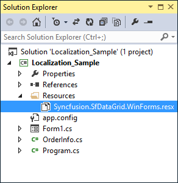
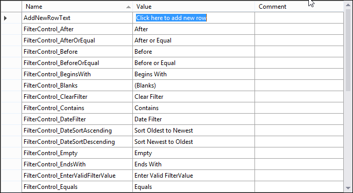

# Localization in DataGrid (SfDataGrid)
Localization is the process of translating the application resources into different language for the specific cultures. The SfDataGrid can be localized by adding [resource](https://docs.microsoft.com/en-us/previous-versions/visualstudio/visual-studio-2010/aa992030(v=vs.100)) file. Application culture can be changed by setting [CurrentUICulture ](https://docs.microsoft.com/en-us/dotnet/api/system.globalization.cultureinfo.currentuiculture?view=net-5.0)before `InitializeComponent` method.

## Localize at Sample Level
To localize the SfDataGrid based on `CurrentUICulture` using resource files, follow the below steps.

1) Create new folder and named as Resources in your application.

2) Add the default resource file of SfDataGrid into Resources folder. You can download the `Syncfusion.SfDataGrid.WinForms.resx` [here](https://www.syncfusion.com/downloads/support/directtrac/general/ze/Syncfusion.SfDataGrid.WinForms53748004.zip).

 

3) Right-click on the Resources folder, select **Add** and then **NewItem**.

4) In Add New Item wizard, select the **Resource File** option and name the filename as Syncfusion.SfDataGrid.WinForms.&lt;culture name&gt;.resx. For example, have to give name as Syncfusion.SfDataGrid.WinForms.de-DE.resx for German culture.

5) The culture name that indicates the name of language and country.
6) Now, select `Add` option to add the resource file in **Resources** folder.

 

7) Add the Name/Value pair in Resource Designer of Syncfusion.SfDataGrid.WinForms.de-DE.resx file and change its corresponding value to corresponding culture.

 

8) Now, set the `CurrentCulture` of the Application before the `InitializeComponent` method and Run the sample.



public Form1()
{
    System.Threading.Thread.CurrentThread.CurrentCulture = new System.Globalization.CultureInfo("de-DE");
    System.Threading.Thread.CurrentThread.CurrentUICulture = new System.Globalization.CultureInfo("de-DE");
    InitializeComponent();
}        


Public Sub New()
	System.Threading.Thread.CurrentThread.CurrentCulture = New System.Globalization.CultureInfo("de-DE")
	System.Threading.Thread.CurrentThread.CurrentUICulture = New System.Globalization.CultureInfo("de-DE")
	InitializeComponent()
End Sub  



To localize the `Select All` string in the CheckListBox of the FilterControl, include the resource file of SfListView to the sample using the previously specified steps, like in SfDataGrid.

The default resource file of SfListView can be download from [here](https://www.syncfusion.com/downloads/support/directtrac/general/ze/ResourceFile1283641291). Refer to the [localization](https://help.syncfusion.com/windowsforms/listview/localization) section in SfListView.

## Editing Default Resource File
The default resource file can be edited by adding it to Resources folder of the application where SfDataGrid reads the static texts from here. The default resource file can be download from [here](https://www.syncfusion.com/downloads/support/directtrac/general/ze/Syncfusion.SfDataGrid.WinForms53748004.zip).

Now, change the Name/Value pair in Resource Designer of `Syncfusion.SfDataGrid.WinForms.resx` file.

Now run the sample,

## Localize Resource File with Different Assembly or Namespace
By default, SfDataGrid try to read the resource file from executing assembly and its default namespace by using [Assembly.GetExecuteAssembly](https://docs.microsoft.com/en-us/dotnet/api/system.reflection.assembly.getexecutingassembly?view=net-5.0) method. When the resource file is located at different assembly or namespace, then it can be set to the SfDataGrid by using SR.SetResources method.



public Form1()
{
    System.Threading.Thread.CurrentThread.CurrentCulture = new System.Globalization.CultureInfo("de-DE");
    System.Threading.Thread.CurrentThread.CurrentUICulture = new System.Globalization.CultureInfo("de-DE");

    // Set the Custom assembly and namespace for the localization.
    SR.SetResources(typeof(CustomSfDataGrid).Assembly, "SfDataGridExt");
    InitializeComponent();
}        


public Form1()
{
    System.Threading.Thread.CurrentThread.CurrentCulture = new System.Globalization.CultureInfo("de-DE");
    System.Threading.Thread.CurrentThread.CurrentUICulture = new System.Globalization.CultureInfo("de-DE");

    // Set the Custom assembly and namespace for the localization.
    SR.SetResources(typeof(CustomSfDataGrid).Assembly, "SfDataGridExt");
    InitializeComponent();
}        


