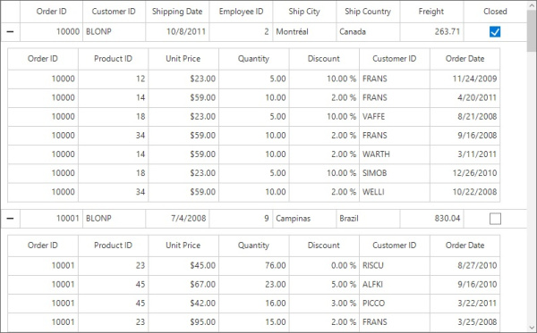
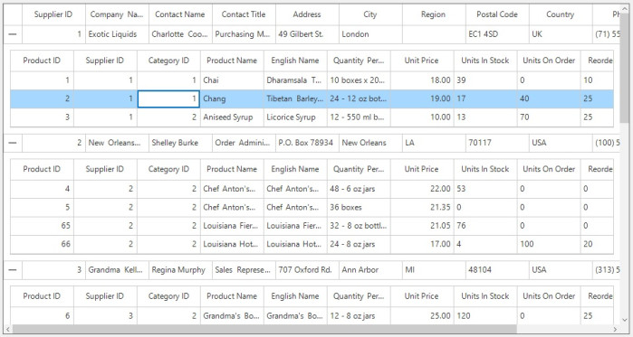
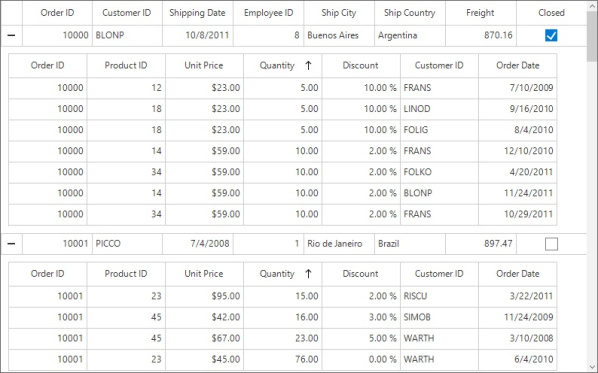
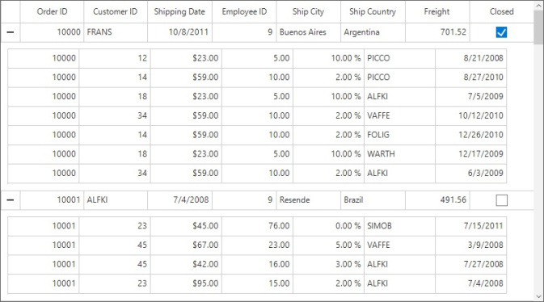
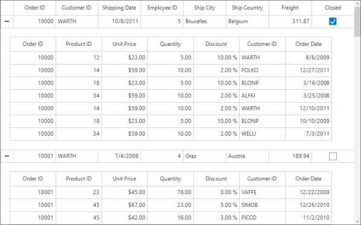
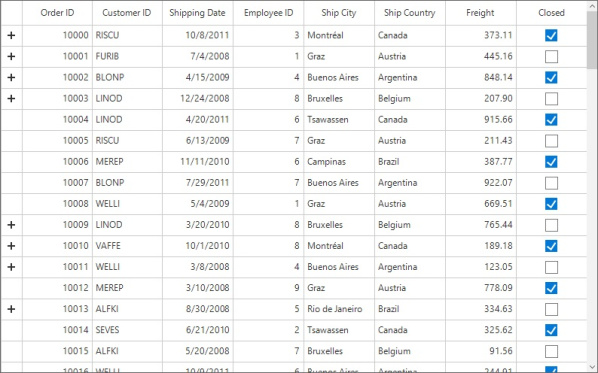

# Master Details View in Windows Forms DataGrid (SfDataGrid)

The SfDataGrid provides support to represent the hierarchical data in the form of nested tables by using Master-Details view. You can expand or collapse the nested table (DetailsViewDataGrid) by using an expander column in a row. You can also expand or collapse the nested table programmatically. The number of tables nested with relations are unlimited.

## Generating Master-Details view from IEnumerable

The relation of Master-Details view can be generated for the properties of type [IEnumerable](https://docs.microsoft.com/en-us/dotnet/api/system.collections.ienumerable?view=net-5.0) in the underlying data object.

Follow the steps to generate the Master-Details view for `IEnumerable`:

* Create the data source with relations (Here, relations are `IEnumerable` type properties).
* Defining relations
* Auto generating relations
* Manually defining relations.

### Create the data source with relations

Create a `OrderInfo` class with `OrderDetails` property of type [ObservableCollection](https://docs.microsoft.com/en-us/dotnet/api/system.collections.ienumerable?view=net-5.0) to form the relation. The `OrderDetails` property is defined as ObservableCollection<OrderDetails>.



public class OrderDetails : INotifyPropertyChanged
{
    private System.Nullable<int> _OrderID;

    /// 

    /// Gets or sets the order ID.
    /// 

    /// <value>The order ID.</value>
    public System.Nullable<int> OrderID
    {
        get
        {
            return this._OrderID;
        }
        set
        {
            this._OrderID = value;
            RaisePropertyChanged("OrderID");
        }
    }

    private int _ProductID;

    /// 

    /// Gets or sets the product ID.
    /// 

    /// <value>The product ID.</value>
    public int ProductID
    {
        get
        {
            return this._ProductID;
        }
        set
        {
            this._ProductID = value;
            RaisePropertyChanged("ProductID");
        }
    }

    private decimal _UnitPrice;

    /// 

    /// Gets or sets the unit price.
    /// 

    /// <value>The unit price.</value>
    public decimal UnitPrice
    {
        get
        {
            return this._UnitPrice;
        }
        set
        {
            this._UnitPrice = value;
            RaisePropertyChanged("UnitPrice");
        }
    }
    private Int16 _Quantity;

    /// 

    /// Gets or sets the quantity.
    /// 

    /// <value>The quantity.</value>
    public Int16 Quantity
    {
        get
        {
            return this._Quantity;
        }
        set
        {
            this._Quantity = value;
            RaisePropertyChanged("Quantity");
        }
    }
    private double _Discount;

    /// 

    /// Gets or sets the discount.
    /// 

    /// <value>The discount.</value>
    public double Discount
    {
        get
        {
            return this._Discount;
        }
        set
        {
            this._Discount = value;
            RaisePropertyChanged("Discount");
        }
    }

    private string _customerID;

    /// 

    /// Gets or sets the customer ID.
    /// 

    /// <value>The customer ID.</value>
    public string CustomerID
    {
        get
        {
            return _customerID;
        }
        set
        {
            _customerID = value;
            RaisePropertyChanged("CustomerID");
        }
    }

    private DateTime _orderDate;

    /// 

    /// Gets or sets the order date.
    /// 

    /// <value>The order date.</value>
    public DateTime OrderDate
    {
        get
        {
            return _orderDate;
        }
        set
        {
            _orderDate = value;
            RaisePropertyChanged("OrderDate");
        }
    }

    /// 

    /// Initializes a new instance of the <see cref="OrderDetails"/> class.
    /// 

    /// <param name="orderID">The order ID.</param>
    /// <param name="productID">The product ID.</param>
    /// <param name="unitPrice">The unit price.</param>
    /// <param name="quantity">The quantity.</param>
    /// <param name="discount">The discount.</param>
    public OrderDetails(int orderID, int productID, decimal unitPrice, Int16 quantity, double discount, string customerID, DateTime orderDate)
    {
        this._Discount = discount;
        this._OrderID = orderID;
        this._ProductID = productID;
        this._Quantity = quantity;
        this._UnitPrice = unitPrice;
        this._customerID = customerID;
        this._orderDate = orderDate;
    }

    public event PropertyChangedEventHandler PropertyChanged;

    private void RaisePropertyChanged(string name)
    {
        if (PropertyChanged != null)
            PropertyChanged(this, new PropertyChangedEventArgs(name));
    }
}

public class OrderInfo : INotifyPropertyChanged
{
    private int _OrderID;
    private string _CustomerID;
    private System.Nullable<int> _EmployeeID;
    private string _ShipCity;
    private string _ShipCountry;
    private double _Freight;
    private bool _isClosed;
    private DateTime _shippingDate;
    private List<OrderDetails> orderDetails;

    /// 

    /// Initializes a new instance of the <see cref="OrderInfo"/> class.
    /// 

    public OrderInfo()
    {

    }

    /// 

    /// Gets or sets the order details.
    /// 

    /// <value>The order details.</value>
    public List<OrderDetails> OrderDetails
    {
        get
        {
            return this.orderDetails;
        }
        set
        {
            this.orderDetails = value;
            RaisePropertyChanged("OrderDetails");
        }
    }

    /// 

    /// Gets or sets the order ID.
    /// 

    /// <value>The order ID.</value>
    [Display(Name = "Order ID")]
    public int OrderID
    {
        get
        {
            return this._OrderID;
        }
        set
        {
            this._OrderID = value;
            RaisePropertyChanged("OrderID");
        }
    }

    /// 

    /// Gets or sets the customer ID.
    /// 

    /// <value>The customer ID.</value>
    [Display(Name = "Customer ID")]
    public string CustomerID
    {
        get
        {
            return this._CustomerID;
        }
        set
        {
            this._CustomerID = value;
            RaisePropertyChanged("CustomerID");
        }
    }

    /// 

    /// Gets or sets the shipping date.
    /// 

    /// <value>The shipping date.</value>
    [Display(Name = "Shipping Date")]
    public DateTime ShippingDate
    {
        get
        {
            return _shippingDate;
        }
        set
        {
            _shippingDate = value;
            RaisePropertyChanged("ShippingDate");
        }
    }

    /// 

    /// Gets or sets the employee ID.
    /// 

    /// <value>The employee ID.</value>
    [Display(Name = "Employee ID")]
    public System.Nullable<int> EmployeeID
    {
        get
        {
            return this._EmployeeID;
        }
        set
        {
            this._EmployeeID = value;
            RaisePropertyChanged("EmployeeID");
        }
    }

    /// 

    /// Gets or sets the ship city.
    /// 

    /// <value>The ship city.</value>

    [Display(Name = "Ship City")]
    public string ShipCity
    {
        get
        {
            return this._ShipCity;
        }
        set
        {
            this._ShipCity = value;
            RaisePropertyChanged("ShipCity");
        }
    }

    /// 

    /// Gets or sets the ship country.
    /// 

    /// <value>The ship country.</value>

    [Display(Name = "Ship Country")]
    public string ShipCountry
    {
        get
        {
            return this._ShipCountry;
        }
        set
        {
            this._ShipCountry = value;
            RaisePropertyChanged("ShipCountry");
        }
    }

    /// 

    /// Gets or sets the freight.
    /// 

    /// <value>The freight.</value>
    public double Freight
    {
        get
        {
            return this._Freight;
        }
        set
        {
            this._Freight = value;
            RaisePropertyChanged("Freight");
        }
    }

    /// 

    /// Gets or sets a value indicating whether this instance is closed.
    /// 

    /// <value><c>true</c> if this instance is closed; otherwise, <c>false</c>.</value>
    [Display(Name = "Closed")]
    public bool IsClosed
    {
        get
        {
            return this._isClosed;
        }

        set
        {
            this._isClosed = value;
            this.RaisePropertyChanged("IsClosed");
        }
    }

    public event PropertyChangedEventHandler PropertyChanged;

    private void RaisePropertyChanged(string name)
    {
        if (PropertyChanged != null)
            PropertyChanged(this, new PropertyChangedEventArgs(name));
    }
}




Public Class OrderDetails
    Implements INotifyPropertyChanged
    Private _OrderID? As Integer

    ''' 

    ''' Gets or sets the order ID.
    ''' 

    ''' <value>The order ID.</value>
    Public Property OrderID() As Integer?
        Get
            Return Me._OrderID
        End Get
        Set(ByVal value? As Integer)
            Me._OrderID = value
            RaisePropertyChanged("OrderID")
        End Set
    End Property

    Private _ProductID As Integer

    ''' 

    ''' Gets or sets the product ID.
    ''' 

    ''' <value>The product ID.</value>
    Public Property ProductID() As Integer
        Get
            Return Me._ProductID
        End Get
        Set(ByVal value As Integer)
            Me._ProductID = value
            RaisePropertyChanged("ProductID")
        End Set
    End Property

    Private _UnitPrice As Decimal

    ''' 

    ''' Gets or sets the unit price.
    ''' 

    ''' <value>The unit price.</value>
    Public Property UnitPrice() As Decimal
        Get
            Return Me._UnitPrice
        End Get
        Set(ByVal value As Decimal)
            Me._UnitPrice = value
            RaisePropertyChanged("UnitPrice")
        End Set
    End Property
    Private _Quantity As Int16

    ''' 

    ''' Gets or sets the quantity.
    ''' 

    ''' <value>The quantity.</value>
    Public Property Quantity() As Int16
        Get
            Return Me._Quantity
        End Get
        Set(ByVal value As Int16)
            Me._Quantity = value
            RaisePropertyChanged("Quantity")
        End Set
    End Property
    Private _Discount As Double

    ''' 

    ''' Gets or sets the discount.
    ''' 

    ''' <value>The discount.</value>
    Public Property Discount() As Double
        Get
            Return Me._Discount
        End Get
        Set(ByVal value As Double)
            Me._Discount = value
            RaisePropertyChanged("Discount")
        End Set
    End Property

    Private _customerID As String

    ''' 

    ''' Gets or sets the customer ID.
    ''' 

    ''' <value>The customer ID.</value>
    Public Property CustomerID() As String
        Get
            Return _customerID
        End Get
        Set(ByVal value As String)
            _customerID = value
            RaisePropertyChanged("CustomerID")
        End Set
    End Property

    Private _orderDate As DateTime

    ''' 

    ''' Gets or sets the order date.
    ''' 

    ''' <value>The order date.</value>
    Public Property OrderDate() As DateTime
        Get
            Return _orderDate
        End Get
        Set(ByVal value As DateTime)
            _orderDate = value
            RaisePropertyChanged("OrderDate")
        End Set
    End Property

    ''' 

    ''' Initializes a new instance of the <see cref="OrderDetails"/> class.
    ''' 

    ''' <param name="orderID">The order ID.</param>
    ''' <param name="productID">The product ID.</param>
    ''' <param name="unitPrice">The unit price.</param>
    ''' <param name="quantity">The quantity.</param>
    ''' <param name="discount">The discount.</param>
    Public Sub New(ByVal orderID As Integer, ByVal productID As Integer, ByVal unitPrice As Decimal, ByVal quantity As Int16, ByVal discount As Double, ByVal customerID As String, ByVal orderDate As DateTime)
        Me._Discount = discount
        Me._OrderID = orderID
        Me._ProductID = productID
        Me._Quantity = quantity
        Me._UnitPrice = unitPrice
        Me._customerID = customerID
        Me._orderDate = orderDate
    End Sub

    Public Event PropertyChanged As PropertyChangedEventHandler

    Private Sub RaisePropertyChanged(ByVal name As String)
        RaiseEvent PropertyChanged(Me, New PropertyChangedEventArgs(name))
    End Sub
End Class

Public Class OrderInfo
    Implements INotifyPropertyChanged
    Private _OrderID As Integer
    Private _CustomerID As String
    Private _EmployeeID? As Integer
    Private _ShipCity As String
    Private _ShipCountry As String
    Private _Freight As Double
    Private _isClosed As Boolean
    Private _shippingDate As DateTime
'INSTANT VB NOTE: The variable orderDetails was renamed since Visual Basic does not allow class members with the same name:
    Private orderDetails_Renamed As List(Of OrderDetails)

    ''' 

    ''' Initializes a new instance of the <see cref="OrderInfo"/> class.
    ''' 

    Public Sub New()

    End Sub

    ''' 

    ''' Gets or sets the order details.
    ''' 

    ''' <value>The order details.</value>
    Public Property OrderDetails() As List(Of OrderDetails)
        Get
            Return Me.orderDetails_Renamed
        End Get
        Set(ByVal value As List(Of OrderDetails))
            Me.orderDetails_Renamed = value
            RaisePropertyChanged("OrderDetails")
        End Set
    End Property

    ''' 

    ''' Gets or sets the order ID.
    ''' 

    ''' <value>The order ID.</value>
    <Display(Name := "Order ID")>
    Public Property OrderID() As Integer
        Get
            Return Me._OrderID
        End Get
        Set(ByVal value As Integer)
            Me._OrderID = value
            RaisePropertyChanged("OrderID")
        End Set
    End Property

    ''' 

    ''' Gets or sets the customer ID.
    ''' 

    ''' <value>The customer ID.</value>
    <Display(Name := "Customer ID")>
    Public Property CustomerID() As String
        Get
            Return Me._CustomerID
        End Get
        Set(ByVal value As String)
            Me._CustomerID = value
            RaisePropertyChanged("CustomerID")
        End Set
    End Property

    ''' 

    ''' Gets or sets the shipping date.
    ''' 

    ''' <value>The shipping date.</value>
    <Display(Name := "Shipping Date")>
    Public Property ShippingDate() As DateTime
        Get
            Return _shippingDate
        End Get
        Set(ByVal value As DateTime)
            _shippingDate = value
            RaisePropertyChanged("ShippingDate")
        End Set
    End Property

    ''' 

    ''' Gets or sets the employee ID.
    ''' 

    ''' <value>The employee ID.</value>
    <Display(Name := "Employee ID")>
    Public Property EmployeeID() As Integer?
        Get
            Return Me._EmployeeID
        End Get
        Set(ByVal value? As Integer)
            Me._EmployeeID = value
            RaisePropertyChanged("EmployeeID")
        End Set
    End Property

    ''' 

    ''' Gets or sets the ship city.
    ''' 

    ''' <value>The ship city.</value>

    <Display(Name := "Ship City")>
    Public Property ShipCity() As String
        Get
            Return Me._ShipCity
        End Get
        Set(ByVal value As String)
            Me._ShipCity = value
            RaisePropertyChanged("ShipCity")
        End Set
    End Property

    ''' 

    ''' Gets or sets the ship country.
    ''' 

    ''' <value>The ship country.</value>

    <Display(Name := "Ship Country")>
    Public Property ShipCountry() As String
        Get
            Return Me._ShipCountry
        End Get
        Set(ByVal value As String)
            Me._ShipCountry = value
            RaisePropertyChanged("ShipCountry")
        End Set
    End Property

    ''' 

    ''' Gets or sets the freight.
    ''' 

    ''' <value>The freight.</value>
    Public Property Freight() As Double
        Get
            Return Me._Freight
        End Get
        Set(ByVal value As Double)
            Me._Freight = value
            RaisePropertyChanged("Freight")
        End Set
    End Property

    ''' 

    ''' Gets or sets a value indicating whether this instance is closed.
    ''' 

    ''' <value><c>true</c> if this instance is closed; otherwise, <c>false</c>.</value>
    <Display(Name := "Closed")>
    Public Property IsClosed() As Boolean
        Get
            Return Me._isClosed
        End Get

        Set(ByVal value As Boolean)
            Me._isClosed = value
            Me.RaisePropertyChanged("IsClosed")
        End Set
    End Property

    Public Event PropertyChanged As PropertyChangedEventHandler

    Private Sub RaisePropertyChanged(ByVal name As String)
        RaiseEvent PropertyChanged(Me, New PropertyChangedEventArgs(name))
    End Sub
End Class



Create a `OrderInfoRepository` class with `GetOrdersDetails` method which returns the `ObservableCollection<OrderInfo>`. The class is initialized with several data objects in the constructor. Similarly, the `OrdersDetails` property is also initialized.



public class OrderInfoRepository
{
    /// 

    /// Initializes a new instance of the <see cref="OrderInfoRepository"/> class.
    /// 

    public OrderInfoRepository()
    {

    }

    /// 

    /// Gets the orders details.
    /// 

    /// <param name="count">The count.</param>
    /// <returns></returns>
    public List<OrderInfo> GetOrdersDetails(int count)
    {
        List<OrderInfo> ordersDetails = new List<OrderInfo>();
        this.OrderedDates = GetDateBetween(2008, 2012, count);
        OrdersAdd(count);
        SetShipCity();
        for (int i = 10000; i < count + 10000; i++)
        {
            ordersDetails.Add(GetOrder(i));
        }
        return ordersDetails;
    }

    /// 

    /// Gets the customers.
    /// 

    /// <value>The customers.</value>
    public List<string> Customers
    {
        get
        {
            return this.CustomerID.ToList();
        }
    }

    /// 

    /// Gets the ship countries.
    /// 

    /// <value>The ship countries.</value>
    public List<string> ShipCountries
    {
        get
        {
            return this.ShipCountry.ToList();
        }
    }

    /// 

    /// Adds the OrderDetails to the collection.
    /// 

    private void OrdersAdd(int count)
    {
        orderDetailsCollection.Add(new OrderDetails(10000, 12, 23, 5, 10, CustomerID[r.Next(15)], this.OrderedDates[r.Next(count - 1)]));
        orderDetailsCollection.Add(new OrderDetails(10000, 14, 59, 10, 2, CustomerID[r.Next(15)], this.OrderedDates[r.Next(count - 1)]));
        orderDetailsCollection.Add(new OrderDetails(10000, 18, 23, 5, 10, CustomerID[r.Next(15)], this.OrderedDates[r.Next(count - 1)]));
        orderDetailsCollection.Add(new OrderDetails(10000, 34, 59, 10, 2, CustomerID[r.Next(15)], this.OrderedDates[r.Next(count - 1)]));
        orderDetailsCollection.Add(new OrderDetails(10000, 14, 59, 10, 2, CustomerID[r.Next(15)], this.OrderedDates[r.Next(count - 1)]));
        orderDetailsCollection.Add(new OrderDetails(10000, 18, 23, 5, 10, CustomerID[r.Next(15)], this.OrderedDates[r.Next(count - 1)]));
        orderDetailsCollection.Add(new OrderDetails(10000, 34, 59, 10, 2, CustomerID[r.Next(15)], this.OrderedDates[r.Next(count - 1)]));
        orderDetailsCollection.Add(new OrderDetails(10001, 23, 45, 76, 0, CustomerID[r.Next(15)], this.OrderedDates[r.Next(count - 1)]));
        orderDetailsCollection.Add(new OrderDetails(10001, 45, 67, 23, 5, CustomerID[r.Next(15)], this.OrderedDates[r.Next(count - 1)]));
        orderDetailsCollection.Add(new OrderDetails(10001, 45, 42, 16, 3, CustomerID[r.Next(15)], this.OrderedDates[r.Next(count - 1)]));
        orderDetailsCollection.Add(new OrderDetails(10001, 23, 95, 15, 2, CustomerID[r.Next(15)], this.OrderedDates[r.Next(count - 1)]));
        orderDetailsCollection.Add(new OrderDetails(10002, 7, 70, 6, 4, CustomerID[r.Next(15)], this.OrderedDates[r.Next(count - 1)]));
        orderDetailsCollection.Add(new OrderDetails(10002, 2, 30, 5, 2, CustomerID[r.Next(15)], this.OrderedDates[r.Next(count - 1)]));
        orderDetailsCollection.Add(new OrderDetails(10003, 23, 73, 9, 3, CustomerID[r.Next(15)], this.OrderedDates[r.Next(count - 1)]));
        orderDetailsCollection.Add(new OrderDetails(10003, 8, 11, 8, 7, CustomerID[r.Next(15)], this.OrderedDates[r.Next(count - 1)]));
        orderDetailsCollection.Add(new OrderDetails(10003, 1, 150, 1, 0, CustomerID[r.Next(15)], this.OrderedDates[r.Next(count - 1)]));
        orderDetailsCollection.Add(new OrderDetails(10009, 4, 35, 4, 0, CustomerID[r.Next(15)], this.OrderedDates[r.Next(count - 1)]));
        orderDetailsCollection.Add(new OrderDetails(10009, 2, 31, 7, 0, CustomerID[r.Next(15)], this.OrderedDates[r.Next(count - 1)]));
        orderDetailsCollection.Add(new OrderDetails(10010, 7, 23, 3, 0, CustomerID[r.Next(15)], this.OrderedDates[r.Next(count - 1)]));
        orderDetailsCollection.Add(new OrderDetails(10010, 5, 65, 4, 0, CustomerID[r.Next(15)], this.OrderedDates[r.Next(count - 1)]));
        orderDetailsCollection.Add(new OrderDetails(10010, 3, 15, 5, 0, CustomerID[r.Next(15)], this.OrderedDates[r.Next(count - 1)]));
        orderDetailsCollection.Add(new OrderDetails(10010, 2, 31, 1, 0, CustomerID[r.Next(15)], this.OrderedDates[r.Next(count - 1)]));
        orderDetailsCollection.Add(new OrderDetails(10011, 6, 46, 2, 0, CustomerID[r.Next(15)], this.OrderedDates[r.Next(count - 1)]));
        orderDetailsCollection.Add(new OrderDetails(10011, 3, 45, 4, 0, CustomerID[r.Next(15)], this.OrderedDates[r.Next(count - 1)]));
        orderDetailsCollection.Add(new OrderDetails(10011, 2, 41, 7, 0, CustomerID[r.Next(15)], this.OrderedDates[r.Next(count - 1)]));
        orderDetailsCollection.Add(new OrderDetails(10013, 19, 80, 2, 0, CustomerID[r.Next(15)], this.OrderedDates[r.Next(count - 1)]));
        orderDetailsCollection.Add(new OrderDetails(10013, 20, 111, 2, 7, CustomerID[r.Next(15)], this.OrderedDates[r.Next(count - 1)]));
        orderDetailsCollection.Add(new OrderDetails(10021, 54, 35, 2, 0, CustomerID[r.Next(15)], this.OrderedDates[r.Next(count - 1)]));
        orderDetailsCollection.Add(new OrderDetails(10021, 63, 46, 2, 0, CustomerID[r.Next(15)], this.OrderedDates[r.Next(count - 1)]));
        orderDetailsCollection.Add(new OrderDetails(10021, 27, 99, 2, 0, CustomerID[r.Next(15)], this.OrderedDates[r.Next(count - 1)]));
        orderDetailsCollection.Add(new OrderDetails(10022, 59, 80, 2, 0, CustomerID[r.Next(15)], this.OrderedDates[r.Next(count - 1)]));
        orderDetailsCollection.Add(new OrderDetails(10022, 60, 111, 2, 7, CustomerID[r.Next(15)], this.OrderedDates[r.Next(count - 1)]));
        orderDetailsCollection.Add(new OrderDetails(10022, 47, 35, 2, 0, CustomerID[r.Next(15)], this.OrderedDates[r.Next(count - 1)]));
        orderDetailsCollection.Add(new OrderDetails(10032, 4, 35, 2, 0, CustomerID[r.Next(15)], this.OrderedDates[r.Next(count - 1)]));
        orderDetailsCollection.Add(new OrderDetails(10032, 6, 46, 2, 0, CustomerID[r.Next(15)], this.OrderedDates[r.Next(count - 1)]));
        orderDetailsCollection.Add(new OrderDetails(10034, 17, 99, 2, 0, CustomerID[r.Next(15)], this.OrderedDates[r.Next(count - 1)]));
        orderDetailsCollection.Add(new OrderDetails(10034, 19, 80, 2, 0, CustomerID[r.Next(15)], this.OrderedDates[r.Next(count - 1)]));
        orderDetailsCollection.Add(new OrderDetails(10034, 20, 111, 2, 7, CustomerID[r.Next(15)], this.OrderedDates[r.Next(count - 1)]));
        orderDetailsCollection.Add(new OrderDetails(10042, 4, 35, 2, 0, CustomerID[r.Next(15)], this.OrderedDates[r.Next(count - 1)]));
        orderDetailsCollection.Add(new OrderDetails(10042, 4, 35, 2, 0, CustomerID[r.Next(15)], this.OrderedDates[r.Next(count - 1)]));
        orderDetailsCollection.Add(new OrderDetails(10045, 6, 46, 2, 0, CustomerID[r.Next(15)], this.OrderedDates[r.Next(count - 1)]));
        orderDetailsCollection.Add(new OrderDetails(10045, 17, 99, 2, 0, CustomerID[r.Next(15)], this.OrderedDates[r.Next(count - 1)]));
        orderDetailsCollection.Add(new OrderDetails(10045, 19, 80, 2, 0, CustomerID[r.Next(15)], this.OrderedDates[r.Next(count - 1)]));
        orderDetailsCollection.Add(new OrderDetails(10045, 20, 111, 2, 7, CustomerID[r.Next(15)], this.OrderedDates[r.Next(count - 1)]));
        orderDetailsCollection.Add(new OrderDetails(10056, 4, 35, 2, 0, CustomerID[r.Next(15)], this.OrderedDates[r.Next(count - 1)]));
        orderDetailsCollection.Add(new OrderDetails(10056, 4, 35, 2, 0, CustomerID[r.Next(15)], this.OrderedDates[r.Next(count - 1)]));
        orderDetailsCollection.Add(new OrderDetails(10056, 6, 46, 2, 0, CustomerID[r.Next(15)], this.OrderedDates[r.Next(count - 1)]));
        orderDetailsCollection.Add(new OrderDetails(10067, 17, 99, 2, 0, CustomerID[r.Next(15)], this.OrderedDates[r.Next(count - 1)]));
        orderDetailsCollection.Add(new OrderDetails(10067, 19, 80, 2, 0, CustomerID[r.Next(15)], this.OrderedDates[r.Next(count - 1)]));
        orderDetailsCollection.Add(new OrderDetails(10067, 20, 111, 2, 7, CustomerID[r.Next(15)], this.OrderedDates[r.Next(count - 1)]));
    }

    private List<DateTime> OrderedDates;
    Random r = new Random();
    List<OrderDetails> orderDetailsCollection = new List<OrderDetails>();

    /// 

    /// Gets the order.
    /// 

    /// <param name="i">The i.</param>
    /// <returns></returns>
    private OrderInfo GetOrder(int i)
    {
        var shipCountry = ShipCountry[r.Next(5)];
        var shipCity = ShipCity[shipCountry];
        return new OrderInfo()
        {
            OrderID = i,
            CustomerID = CustomerID[r.Next(15)],
            EmployeeID = r.Next(1, 10),
            Freight = Math.Round(r.Next(1000) + r.NextDouble(), 2),
            ShipCountry = shipCountry,
            ShippingDate = this.OrderedDates[i - 10000],
            IsClosed = i % 2 == 0 ? true : false,
            ShipCity = shipCity[r.Next(shipCity.Length - 1)],
            OrderDetails = GetOrderDetails(i)
        };
    }

    /// 

    /// Gets the collection of OrderDetails.
    /// 

    /// <param name="i">The i.</param>
    /// <returns></returns>
    public List<OrderDetails> GetOrderDetails(int i)
    {
        List<OrderDetails> order = new List<OrderDetails>();
        foreach (var orderDetails in orderDetailsCollection)
            if (orderDetails.OrderID == i)
                order.Add(orderDetails);
        return order;
    }

    string[] ShipCountry = new string[]
    {
        "Argentina",
        "Austria",
        "Belgium",
        "Brazil",
        "Canada",
        "Denmark",
        "Finland",
        "France",
        "Germany",
        "Ireland",
        "Italy",
        "Mexico",
        "Norway",
        "Poland",
        "Portugal",
        "Spain",
        "Sweden",
        "Switzerland",
        "UK",
        "USA",
        "Venezuela"
    };

    Dictionary<string, string[]> ShipCity = new Dictionary<string, string[]>();

    /// 

    /// Sets the ship city.
    /// 

    private void SetShipCity()
    {
        string[] _Argentina = new string[] { "Buenos Aires" };

        string[] _Austria = new string[] { "Graz", "Salzburg" };

        string[] _Belgium = new string[] { "Bruxelles", "Charleroi" };

        string[] _Brazil = new string[] { "Campinas", "Resende", "Rio de Janeiro", "São Paulo" };

        string[] _Canada = new string[] { "Montréal", "Tsawassen", "Vancouver" };

        string[] _Denmark = new string[] { "Århus", "København" };

        string[] _Finland = new string[] { "Helsinki", "Oulu" };

        string[] _France = new string[] { "Lille", "Lyon", "Marseille", "Nantes", "Paris", "Reims", "Strasbourg", "Toulouse", "Versailles" };

        string[] _Germany = new string[] { "Aachen", "Berlin", "Brandenburg", "Cunewalde", "Frankfurt a.M.", "Köln", "Leipzig", "Mannheim", "München", "Münster", "Stuttgart" };

        string[] _Ireland = new string[] { "Cork" };

        string[] _Italy = new string[] { "Bergamo", "Reggio Emilia", "Torino" };

        string[] _Mexico = new string[] { "México D.F." };

        string[] _Norway = new string[] { "Stavern" };

        string[] _Poland = new string[] { "Warszawa" };

        string[] _Portugal = new string[] { "Lisboa" };

        string[] _Spain = new string[] { "Barcelona", "Madrid", "Sevilla" };

        string[] _Sweden = new string[] { "Bräcke", "Luleå" };

        string[] _Switzerland = new string[] { "Bern", "Genève" };

        string[] _UK = new string[] { "Colchester", "Hedge End", "London" };

        string[] _USA = new string[] { "Albuquerque", "Anchorage", "Boise", "Butte", "Elgin", "Eugene", "Kirkland", "Lander", "Portland", "San Francisco", "Seattle", "Walla Walla" };

        string[] _Venezuela = new string[] { "Barquisimeto", "Caracas", "I. de Margarita", "San Cristóbal" };

        ShipCity.Add("Argentina", _Argentina);
        ShipCity.Add("Austria", _Austria);
        ShipCity.Add("Belgium", _Belgium);
        ShipCity.Add("Brazil", _Brazil);
        ShipCity.Add("Canada", _Canada);
        ShipCity.Add("Denmark", _Denmark);
        ShipCity.Add("Finland", _Finland);
        ShipCity.Add("France", _France);
        ShipCity.Add("Germany", _Germany);
        ShipCity.Add("Ireland", _Ireland);
        ShipCity.Add("Italy", _Italy);
        ShipCity.Add("Mexico", _Mexico);
        ShipCity.Add("Norway", _Norway);
        ShipCity.Add("Poland", _Poland);
        ShipCity.Add("Portugal", _Portugal);
        ShipCity.Add("Spain", _Spain);
        ShipCity.Add("Sweden", _Sweden);
        ShipCity.Add("Switzerland", _Switzerland);
        ShipCity.Add("UK", _UK);
        ShipCity.Add("USA", _USA);
        ShipCity.Add("Venezuela", _Venezuela);

    }

    string[] CustomerID = new string[]
    {
        "ALFKI",
        "FRANS",
        "MEREP",
        "FOLKO",
        "SIMOB",
        "WARTH",
        "VAFFE",
        "FURIB",
        "SEVES",
        "LINOD",
        "RISCU",
        "PICCO",
        "BLONP",
        "WELLI",
        "FOLIG"
    };

    /// 

    /// Gets the date between.
    /// 

    /// <param name="startYear">The start year.</param>
    /// <param name="EndYear">The end year.</param>
    /// <param name="Count">The count.</param>
    /// <returns></returns>
    private List<DateTime> GetDateBetween(int startYear, int EndYear, int Count)
    {
        List<DateTime> date = new List<DateTime>();
        Random d = new Random(1);
        Random m = new Random(2);
        Random y = new Random(startYear);
        for (int i = 0; i < Count; i++)
        {
            int year = y.Next(startYear, EndYear);
            int month = m.Next(3, 13);
            int day = d.Next(1, 31);

            date.Add(new DateTime(year, month, day));
        }
        return date;
    }
}




Public Class OrderInfoRepository
    ''' 

    ''' Initializes a new instance of the <see cref="OrderInfoRepository"/> class.
    ''' 

    Public Sub New()

    End Sub

    ''' 

    ''' Gets the orders details.
    ''' 

    ''' <param name="count">The count.</param>
    ''' <returns></returns>
    Public Function GetOrdersDetails(ByVal count As Integer) As List(Of OrderInfo)
        Dim ordersDetails As New List(Of OrderInfo)()
        Me.OrderedDates = GetDateBetween(2008, 2012, count)
        OrdersAdd(count)
        SetShipCity()
        For i As Integer = 10000 To count + 10000 - 1
            ordersDetails.Add(GetOrder(i))
        Next i
        Return ordersDetails
    End Function

    ''' 

    ''' Gets the customers.
    ''' 

    ''' <value>The customers.</value>
    Public ReadOnly Property Customers() As List(Of String)
        Get
            Return Me.CustomerID.ToList()
        End Get
    End Property

    ''' 

    ''' Gets the ship countries.
    ''' 

    ''' <value>The ship countries.</value>
    Public ReadOnly Property ShipCountries() As List(Of String)
        Get
            Return Me.ShipCountry.ToList()
        End Get
    End Property

    ''' 

    ''' Adds the OrderDetails to the collection.
    ''' 

    Private Sub OrdersAdd(ByVal count As Integer)
        orderDetailsCollection.Add(New OrderDetails(10000, 12, 23, 5, 10, CustomerID(r.Next(15)), Me.OrderedDates(r.Next(count - 1))))
        orderDetailsCollection.Add(New OrderDetails(10000, 14, 59, 10, 2, CustomerID(r.Next(15)), Me.OrderedDates(r.Next(count - 1))))
        orderDetailsCollection.Add(New OrderDetails(10000, 18, 23, 5, 10, CustomerID(r.Next(15)), Me.OrderedDates(r.Next(count - 1))))
        orderDetailsCollection.Add(New OrderDetails(10000, 34, 59, 10, 2, CustomerID(r.Next(15)), Me.OrderedDates(r.Next(count - 1))))
        orderDetailsCollection.Add(New OrderDetails(10000, 14, 59, 10, 2, CustomerID(r.Next(15)), Me.OrderedDates(r.Next(count - 1))))
        orderDetailsCollection.Add(New OrderDetails(10000, 18, 23, 5, 10, CustomerID(r.Next(15)), Me.OrderedDates(r.Next(count - 1))))
        orderDetailsCollection.Add(New OrderDetails(10000, 34, 59, 10, 2, CustomerID(r.Next(15)), Me.OrderedDates(r.Next(count - 1))))
        orderDetailsCollection.Add(New OrderDetails(10001, 23, 45, 76, 0, CustomerID(r.Next(15)), Me.OrderedDates(r.Next(count - 1))))
        orderDetailsCollection.Add(New OrderDetails(10001, 45, 67, 23, 5, CustomerID(r.Next(15)), Me.OrderedDates(r.Next(count - 1))))
        orderDetailsCollection.Add(New OrderDetails(10001, 45, 42, 16, 3, CustomerID(r.Next(15)), Me.OrderedDates(r.Next(count - 1))))
        orderDetailsCollection.Add(New OrderDetails(10001, 23, 95, 15, 2, CustomerID(r.Next(15)), Me.OrderedDates(r.Next(count - 1))))
        orderDetailsCollection.Add(New OrderDetails(10002, 7, 70, 6, 4, CustomerID(r.Next(15)), Me.OrderedDates(r.Next(count - 1))))
        orderDetailsCollection.Add(New OrderDetails(10002, 2, 30, 5, 2, CustomerID(r.Next(15)), Me.OrderedDates(r.Next(count - 1))))
        orderDetailsCollection.Add(New OrderDetails(10003, 23, 73, 9, 3, CustomerID(r.Next(15)), Me.OrderedDates(r.Next(count - 1))))
        orderDetailsCollection.Add(New OrderDetails(10003, 8, 11, 8, 7, CustomerID(r.Next(15)), Me.OrderedDates(r.Next(count - 1))))
        orderDetailsCollection.Add(New OrderDetails(10003, 1, 150, 1, 0, CustomerID(r.Next(15)), Me.OrderedDates(r.Next(count - 1))))
        orderDetailsCollection.Add(New OrderDetails(10009, 4, 35, 4, 0, CustomerID(r.Next(15)), Me.OrderedDates(r.Next(count - 1))))
        orderDetailsCollection.Add(New OrderDetails(10009, 2, 31, 7, 0, CustomerID(r.Next(15)), Me.OrderedDates(r.Next(count - 1))))
        orderDetailsCollection.Add(New OrderDetails(10010, 7, 23, 3, 0, CustomerID(r.Next(15)), Me.OrderedDates(r.Next(count - 1))))
        orderDetailsCollection.Add(New OrderDetails(10010, 5, 65, 4, 0, CustomerID(r.Next(15)), Me.OrderedDates(r.Next(count - 1))))
        orderDetailsCollection.Add(New OrderDetails(10010, 3, 15, 5, 0, CustomerID(r.Next(15)), Me.OrderedDates(r.Next(count - 1))))
        orderDetailsCollection.Add(New OrderDetails(10010, 2, 31, 1, 0, CustomerID(r.Next(15)), Me.OrderedDates(r.Next(count - 1))))
        orderDetailsCollection.Add(New OrderDetails(10011, 6, 46, 2, 0, CustomerID(r.Next(15)), Me.OrderedDates(r.Next(count - 1))))
        orderDetailsCollection.Add(New OrderDetails(10011, 3, 45, 4, 0, CustomerID(r.Next(15)), Me.OrderedDates(r.Next(count - 1))))
        orderDetailsCollection.Add(New OrderDetails(10011, 2, 41, 7, 0, CustomerID(r.Next(15)), Me.OrderedDates(r.Next(count - 1))))
        orderDetailsCollection.Add(New OrderDetails(10013, 19, 80, 2, 0, CustomerID(r.Next(15)), Me.OrderedDates(r.Next(count - 1))))
        orderDetailsCollection.Add(New OrderDetails(10013, 20, 111, 2, 7, CustomerID(r.Next(15)), Me.OrderedDates(r.Next(count - 1))))
        orderDetailsCollection.Add(New OrderDetails(10021, 54, 35, 2, 0, CustomerID(r.Next(15)), Me.OrderedDates(r.Next(count - 1))))
        orderDetailsCollection.Add(New OrderDetails(10021, 63, 46, 2, 0, CustomerID(r.Next(15)), Me.OrderedDates(r.Next(count - 1))))
        orderDetailsCollection.Add(New OrderDetails(10021, 27, 99, 2, 0, CustomerID(r.Next(15)), Me.OrderedDates(r.Next(count - 1))))
        orderDetailsCollection.Add(New OrderDetails(10022, 59, 80, 2, 0, CustomerID(r.Next(15)), Me.OrderedDates(r.Next(count - 1))))
        orderDetailsCollection.Add(New OrderDetails(10022, 60, 111, 2, 7, CustomerID(r.Next(15)), Me.OrderedDates(r.Next(count - 1))))
        orderDetailsCollection.Add(New OrderDetails(10022, 47, 35, 2, 0, CustomerID(r.Next(15)), Me.OrderedDates(r.Next(count - 1))))
        orderDetailsCollection.Add(New OrderDetails(10032, 4, 35, 2, 0, CustomerID(r.Next(15)), Me.OrderedDates(r.Next(count - 1))))
        orderDetailsCollection.Add(New OrderDetails(10032, 6, 46, 2, 0, CustomerID(r.Next(15)), Me.OrderedDates(r.Next(count - 1))))
        orderDetailsCollection.Add(New OrderDetails(10034, 17, 99, 2, 0, CustomerID(r.Next(15)), Me.OrderedDates(r.Next(count - 1))))
        orderDetailsCollection.Add(New OrderDetails(10034, 19, 80, 2, 0, CustomerID(r.Next(15)), Me.OrderedDates(r.Next(count - 1))))
        orderDetailsCollection.Add(New OrderDetails(10034, 20, 111, 2, 7, CustomerID(r.Next(15)), Me.OrderedDates(r.Next(count - 1))))
        orderDetailsCollection.Add(New OrderDetails(10042, 4, 35, 2, 0, CustomerID(r.Next(15)), Me.OrderedDates(r.Next(count - 1))))
        orderDetailsCollection.Add(New OrderDetails(10042, 4, 35, 2, 0, CustomerID(r.Next(15)), Me.OrderedDates(r.Next(count - 1))))
        orderDetailsCollection.Add(New OrderDetails(10045, 6, 46, 2, 0, CustomerID(r.Next(15)), Me.OrderedDates(r.Next(count - 1))))
        orderDetailsCollection.Add(New OrderDetails(10045, 17, 99, 2, 0, CustomerID(r.Next(15)), Me.OrderedDates(r.Next(count - 1))))
        orderDetailsCollection.Add(New OrderDetails(10045, 19, 80, 2, 0, CustomerID(r.Next(15)), Me.OrderedDates(r.Next(count - 1))))
        orderDetailsCollection.Add(New OrderDetails(10045, 20, 111, 2, 7, CustomerID(r.Next(15)), Me.OrderedDates(r.Next(count - 1))))
        orderDetailsCollection.Add(New OrderDetails(10056, 4, 35, 2, 0, CustomerID(r.Next(15)), Me.OrderedDates(r.Next(count - 1))))
        orderDetailsCollection.Add(New OrderDetails(10056, 4, 35, 2, 0, CustomerID(r.Next(15)), Me.OrderedDates(r.Next(count - 1))))
        orderDetailsCollection.Add(New OrderDetails(10056, 6, 46, 2, 0, CustomerID(r.Next(15)), Me.OrderedDates(r.Next(count - 1))))
        orderDetailsCollection.Add(New OrderDetails(10067, 17, 99, 2, 0, CustomerID(r.Next(15)), Me.OrderedDates(r.Next(count - 1))))
        orderDetailsCollection.Add(New OrderDetails(10067, 19, 80, 2, 0, CustomerID(r.Next(15)), Me.OrderedDates(r.Next(count - 1))))
        orderDetailsCollection.Add(New OrderDetails(10067, 20, 111, 2, 7, CustomerID(r.Next(15)), Me.OrderedDates(r.Next(count - 1))))
    End Sub

    Private OrderedDates As List(Of DateTime)
    Private r As New Random()
    Private orderDetailsCollection As New List(Of OrderDetails)()

    ''' 

    ''' Gets the order.
    ''' 

    ''' <param name="i">The i.</param>
    ''' <returns></returns>
    Private Function GetOrder(ByVal i As Integer) As OrderInfo
        Dim shipCountry = Me.ShipCountry(r.Next(5))
        Dim shipCity = Me.ShipCity(shipCountry)
        Return New OrderInfo() With {.OrderID = i, .CustomerID = CustomerID(r.Next(15)), .EmployeeID = r.Next(1, 10), .Freight = Math.Round(r.Next(1000) + r.NextDouble(), 2), .ShipCountry = shipCountry, .ShippingDate = Me.OrderedDates(i - 10000), .IsClosed = If(i Mod 2 = 0, True, False), .ShipCity = shipCity(r.Next(shipCity.Length - 1)), .OrderDetails = GetOrderDetails(i)}
    End Function

    ''' 

    ''' Gets the collection of OrderDetails.
    ''' 

    ''' <param name="i">The i.</param>
    ''' <returns></returns>
    Public Function GetOrderDetails(ByVal i As Integer) As List(Of OrderDetails)
        Dim order As New List(Of OrderDetails)()
        For Each orderDetails In orderDetailsCollection
            If orderDetails.OrderID = i Then
                order.Add(orderDetails)
            End If
        Next orderDetails
        Return order
    End Function

    Private ShipCountry() As String = { "Argentina", "Austria", "Belgium", "Brazil", "Canada", "Denmark", "Finland", "France", "Germany", "Ireland", "Italy", "Mexico", "Norway", "Poland", "Portugal", "Spain", "Sweden", "Switzerland", "UK", "USA", "Venezuela" }

    Private ShipCity As New Dictionary(Of String, String())()

    ''' 

    ''' Sets the ship city.
    ''' 

    Private Sub SetShipCity()
        Dim _Argentina() As String = { "Buenos Aires" }

        Dim _Austria() As String = { "Graz", "Salzburg" }

        Dim _Belgium() As String = { "Bruxelles", "Charleroi" }

        Dim _Brazil() As String = { "Campinas", "Resende", "Rio de Janeiro", "São Paulo" }

        Dim _Canada() As String = { "Montréal", "Tsawassen", "Vancouver" }

        Dim _Denmark() As String = { "Århus", "København" }

        Dim _Finland() As String = { "Helsinki", "Oulu" }

        Dim _France() As String = { "Lille", "Lyon", "Marseille", "Nantes", "Paris", "Reims", "Strasbourg", "Toulouse", "Versailles" }

        Dim _Germany() As String = { "Aachen", "Berlin", "Brandenburg", "Cunewalde", "Frankfurt a.M.", "Köln", "Leipzig", "Mannheim", "München", "Münster", "Stuttgart" }

        Dim _Ireland() As String = { "Cork" }

        Dim _Italy() As String = { "Bergamo", "Reggio Emilia", "Torino" }

        Dim _Mexico() As String = { "México D.F." }

        Dim _Norway() As String = { "Stavern" }

        Dim _Poland() As String = { "Warszawa" }

        Dim _Portugal() As String = { "Lisboa" }

        Dim _Spain() As String = { "Barcelona", "Madrid", "Sevilla" }

        Dim _Sweden() As String = { "Bräcke", "Luleå" }

        Dim _Switzerland() As String = { "Bern", "Genève" }

        Dim _UK() As String = { "Colchester", "Hedge End", "London" }

        Dim _USA() As String = { "Albuquerque", "Anchorage", "Boise", "Butte", "Elgin", "Eugene", "Kirkland", "Lander", "Portland", "San Francisco", "Seattle", "Walla Walla" }

        Dim _Venezuela() As String = { "Barquisimeto", "Caracas", "I. de Margarita", "San Cristóbal" }

        ShipCity.Add("Argentina", _Argentina)
        ShipCity.Add("Austria", _Austria)
        ShipCity.Add("Belgium", _Belgium)
        ShipCity.Add("Brazil", _Brazil)
        ShipCity.Add("Canada", _Canada)
        ShipCity.Add("Denmark", _Denmark)
        ShipCity.Add("Finland", _Finland)
        ShipCity.Add("France", _France)
        ShipCity.Add("Germany", _Germany)
        ShipCity.Add("Ireland", _Ireland)
        ShipCity.Add("Italy", _Italy)
        ShipCity.Add("Mexico", _Mexico)
        ShipCity.Add("Norway", _Norway)
        ShipCity.Add("Poland", _Poland)
        ShipCity.Add("Portugal", _Portugal)
        ShipCity.Add("Spain", _Spain)
        ShipCity.Add("Sweden", _Sweden)
        ShipCity.Add("Switzerland", _Switzerland)
        ShipCity.Add("UK", _UK)
        ShipCity.Add("USA", _USA)
        ShipCity.Add("Venezuela", _Venezuela)

    End Sub

    Private CustomerID() As String = { "ALFKI", "FRANS", "MEREP", "FOLKO", "SIMOB", "WARTH", "VAFFE", "FURIB", "SEVES", "LINOD", "RISCU", "PICCO", "BLONP", "WELLI", "FOLIG" }

    ''' 

    ''' Gets the date between.
    ''' 

    ''' <param name="startYear">The start year.</param>
    ''' <param name="EndYear">The end year.</param>
    ''' <param name="Count">The count.</param>
    ''' <returns></returns>
    Private Function GetDateBetween(ByVal startYear As Integer, ByVal EndYear As Integer, ByVal Count As Integer) As List(Of DateTime)
        Dim [date] As New List(Of DateTime)()
        Dim d As New Random(1)
        Dim m As New Random(2)
        Dim y As New Random(startYear)
        For i As Integer = 0 To Count - 1
            Dim year As Integer = y.Next(startYear, EndYear)
            Dim month As Integer = m.Next(3, 13)
            Dim day As Integer = d.Next(1, 31)

            [date].Add(New DateTime(year, month, day))
        Next i
        Return [date]
    End Function
End Class




### Defining relations

#### Auto generating relations

The SfDataGrid will automatically generate relations and inner relations for the `IEnumerable` property types in the data object. This can be enabled by setting the SfDataGrid.AutoGenerateRelations to true.

Bind the created collection in the previous step to the [SfDataGrid.DataSource](https://help.syncfusion.com/cr/windowsforms/Syncfusion.WinForms.DataGrid.SfDataGrid.html#Syncfusion_WinForms_DataGrid_SfDataGrid_DataSource) and set the [SfDataGrid.AutoGenerateRelations](https://help.syncfusion.com/cr/windowsforms/Syncfusion.WinForms.DataGrid.SfDataGrid.html#Syncfusion_WinForms_DataGrid_SfDataGrid_AutoGenerateRelations) to `true`.



sfDataGrid.AutoGenerateRelations = true;


sfDataGrid.AutoGenerateRelations = True



When relations are auto-generated, you can handle the [SfDataGrid.AutoGeneratingRelations](https://help.syncfusion.com/cr/windowsforms/Syncfusion.WinForms.DataGrid.SfDataGrid.html) event to customize or cancel the GridViewDefinition before adding it to the [SfDataGrid.DetailsViewDefinitions](https://help.syncfusion.com/cr/windowsforms/Syncfusion.WinForms.DataGrid.SfDataGrid.html#Syncfusion_WinForms_DataGrid_SfDataGrid_DetailsViewDefinitions).

Here, the relation is created from OrderDetails collection property.

#### Manual defining relations

You can define the relation of Master-Details view manually by using the [SfDataGird.DetailsViewDefinitions](https://help.syncfusion.com/cr/windowsforms/Syncfusion.WinForms.DataGrid.SfDataGrid.html#Syncfusion_WinForms_DataGrid_SfDataGrid_DetailsViewDefinitions) when the [SfDataGrid.AutoGenerateRelations](https://help.syncfusion.com/cr/windowsforms/Syncfusion.WinForms.DataGrid.SfDataGrid.html#Syncfusion_WinForms_DataGrid_SfDataGrid_AutoGenerateRelations) is false.

To define the Master-Details view relations, create GridViewDefinition and set the name of IEnumerable type property (from data object) to GridViewDefinition.RelationalColumn. Then, add the GridViewDefinition to the SfDataGrid.DetailsViewDefinitions.



sfDataGrid.AutoGenerateRelations = false;

var gridViewDefinition = new GridViewDefinition();
gridViewDefinition.RelationalColumn = "OrderDetails";
gridViewDefinition.DataGrid = new SfDataGrid() { Name = "FirstLevelNestedGrid", AutoGenerateColumns = true };

sfDataGrid.DetailsViewDefinitions.Add(gridViewDefinition);



sfDataGrid.AutoGenerateRelations = False

Dim gridViewDefinition = New GridViewDefinition()
gridViewDefinition.RelationalColumn = "OrderDetails"
gridViewDefinition.DataGrid = New SfDataGrid() With {.Name = "FirstLevelNestedGrid", .AutoGenerateColumns = True}

sfDataGrid.DetailsViewDefinitions.Add(gridViewDefinition)



## Generating Master-Details view from DataTable

The relation of Master-Details view can be generated for DataTable, when the DataRelation is defined between two tables in the underlying DataSet.

Follow the steps to generate the Master-Details view relation for `DataTable`,

* Create the DataTable with relations.
* Defining relations
* Auto generating relations
* Manually defining relations

### Create the DataTable with relations

Create a method `GetDataTable` type of `DataTable` which returns the `DataTable` with relations between `Suppliers` and `Products` tables in the `DataSet` based on `SupplierID` column.



/// 

/// Gets the data table.
/// 

public DataTable GetDataTable()
{
    DataSet ds = new DataSet();

    string connectionString = @"Data Source=" + FindFile("Northwind.sdf");
    using (SqlCeConnection con = new SqlCeConnection(connectionString))
    {
        con.Open();
        SqlCeDataAdapter sqlDataAdapter1 = new SqlCeDataAdapter("SELECT * FROM Suppliers", con);
        sqlDataAdapter1.Fill(ds, "Suppliers");
    }

    using (SqlCeConnection con1 = new SqlCeConnection(connectionString))
    {
        con1.Open();
        SqlCeDataAdapter sqlDataAdapter1 = new SqlCeDataAdapter("SELECT * FROM Products", con1);
        sqlDataAdapter1.Fill(ds, "Products");
    }

    ds.Relations.Add(new DataRelation("Supplier_Product", ds.Tables[0].Columns["Supplier ID"], ds.Tables[1].Columns["Supplier ID"]));

    if (ds.Tables.Count > 0)
        return ds.Tables[0];
    else
        return null;
}




''' 

''' Gets the data table.
''' 

Public Function GetDataTable() As DataTable
    Dim ds As New DataSet()

    Dim connectionString As String = "Data Source=" & FindFile("Northwind.sdf")
    Using con As New SqlCeConnection(connectionString)
        con.Open()
        Dim sqlDataAdapter1 As New SqlCeDataAdapter("SELECT * FROM Suppliers", con)
        sqlDataAdapter1.Fill(ds, "Suppliers")
    End Using

    Using con1 As New SqlCeConnection(connectionString)
        con1.Open()
        Dim sqlDataAdapter1 As New SqlCeDataAdapter("SELECT * FROM Products", con1)
        sqlDataAdapter1.Fill(ds, "Products")
    End Using

    ds.Relations.Add(New DataRelation("Supplier_Product", ds.Tables(0).Columns("Supplier ID"), ds.Tables(1).Columns("Supplier ID")))

    If ds.Tables.Count > 0 Then
        Return ds.Tables(0)
    Else
        Return Nothing
    End If
End Function




### Defining relations

#### Auto generating relations

The SfDataGrid will automatically generate relations and inner relations based on the relations defined in the `DataSet`. This can be enabled by setting the SfDataGrid.AutoGenerateRelations to true.

Bind the created table in the previous step to the [SfDataGrid.DataSource](https://help.syncfusion.com/cr/windowsforms/Syncfusion.WinForms.DataGrid.SfDataGrid.html#Syncfusion_WinForms_DataGrid_SfDataGrid_DataSource) and set the [SfDataGrid.AutoGenerateRelations](https://help.syncfusion.com/cr/windowsforms/Syncfusion.WinForms.DataGrid.SfDataGrid.html#Syncfusion_WinForms_DataGrid_SfDataGrid_AutoGenerateRelations) to true.



sfDataGrid.AutoGenerateRelations = true;




sfDataGrid.AutoGenerateRelations = True




When the relations are auto-generated, you can handle the SfDataGrid.AutoGeneratingRelations event to customize or cancel the GridViewDefinition before adding it to the SfDataGrid.DetailsViewDefinitions.

Here, Master-Details view relation is auto generated based on the Supplier_Product relation.

#### Manual defining relations

You can define the Master-Details view relation manually by using the [SfDataGird.DetailsViewDefinitions](https://help.syncfusion.com/cr/windowsforms/Syncfusion.WinForms.DataGrid.SfDataGrid.html#Syncfusion_WinForms_DataGrid_SfDataGrid_DetailsViewDefinitions) collection when the [SfDataGrid.AutoGenerateRelations](https://help.syncfusion.com/cr/windowsforms/Syncfusion.WinForms.DataGrid.SfDataGrid.html#Syncfusion_WinForms_DataGrid_SfDataGrid_AutoGenerateRelations) is false.

To define the Master-Details View relations, create GridViewDefinition and set the relation name as Supplier_Product to GridViewDefinition.RelationalColumn. Then, the GridViewDefinition is added to the SfDataGrid.DetailsViewDefinitions collection of the parent DataGrid.



sfDataGrid.AutoGenerateRelations = false;

// GridViewDefinition for DataGrid
var gridViewDefinition = new GridViewDefinition();
gridViewDefinition.RelationalColumn = "Supplier_Product";
gridViewDefinition.DataGrid = new SfDataGrid() { Name = "FirstLevelNestedGrid", AutoGenerateColumns = true };
sfDataGrid.DetailsViewDefinition.Add(gridViewDefinition);




sfDataGrid.AutoGenerateRelations = False

' GridViewDefinition for DataGrid
Dim gridViewDefinition = New GridViewDefinition()
gridViewDefinition.RelationalColumn = "Supplier_Product"
gridViewDefinition.DataGrid = New SfDataGrid() With {.Name = "FirstLevelNestedGrid", .AutoGenerateColumns = True}
sfDataGrid.DetailsViewDefinition.Add(gridViewDefinition)




## Populating Master-Details view through events

You can load the `DataSource` for [DetailsViewDataGrid](https://help.syncfusion.com/cr/windowsforms/Syncfusion.WinForms.DataGrid.DetailsViewDataGrid.html) asynchronously by handling the [SfDataGrid.DetailsViewExpanding](https://help.syncfusion.com/cr/windowsforms/Syncfusion.WinForms.DataGrid.SfDataGrid.html) event. You can set the DataSource on-demand when expanding the record through [DetailsViewExpandingEventArgs.DetailsViewDataSource](https://help.syncfusion.com/cr/windowsforms/Syncfusion.WinForms.DataGrid.Events.DetailsViewExpandingEventArgs.html#Syncfusion_WinForms_DataGrid_Events_DetailsViewExpandingEventArgs_DetailsViewDataSource) property in the SfDataGrid.DetailsViewExpanding` event handler.



this.sfDataGrid.DetailsViewExpanding += SfDataGrid_DetailsViewExpanding;

private void SfDataGrid_DetailsViewExpanding(object sender, DetailsViewExpandingEventArgs e)
{
    OrderInfo orderInfo = e.Record as OrderInfo;
    if (orderInfo.OrderID == 10000)
        e.DetailsViewDataSource.Add("OrderDetails", GetDetailsViewDataSource());
}

private ObservableCollection<OrderDetails> GetDetailsViewDataSource()
{
    ObservableCollection<OrderDetails> orderDetails = new ObservableCollection<OrderDetails>();
    orderDetails.Add(new OrderDetails(1000, 2, 11, 2, 3, "Alan", DateTime.Today.AddDays(1), "Orlando"));
    orderDetails.Add(new OrderDetails(1001, 2, 11, 2, 3, "Michael", DateTime.Today, "Chennai"));
    return orderDetails;
}



AddHandler sfDataGrid1.DetailsViewExpanding, AddressOf SfDataGrid_DetailsViewExpanding 

Private Sub SfDataGrid_DetailsViewExpanding(ByVal sender As Object, ByVal e As DetailsViewExpandingEventArgs)
    Dim orderInfo As OrderInfo = TryCast(e.Record, OrderInfo)
    If orderInfo.OrderID = 10000 Then
        e.DetailsViewDataSource.Add("OrderDetails", GetDetailsViewDataSource())
    End If
End Sub

Private Function GetDetailsViewDataSource() As ObservableCollection(Of OrderDetails)
    Dim orderDetails As New ObservableCollection(Of OrderDetails)()
    orderDetails.Add(New OrderDetails(1000, 2, 11, 2, 3, "Alan", DateTime.Today.AddDays(1), "Orlando"))
    orderDetails.Add(New OrderDetails(1001, 2, 11, 2, 3, "Michael", DateTime.Today, "Chennai"))
    Return orderDetails
End Function




N> This event will be trigged only when the underlying data object contains relations otherwise, you must define a dummy relation to notify the DataGrid to fire this event.

## Defining properties for DetailsViewDataGrid

You can set properties like `AllowEditing`, `AllowFiltering`, and `AllowSorting` for DetailsViewDataGrid by using the [GridViewDefinition.DataGrid](https://help.syncfusion.com/cr/windowsforms/Syncfusion.WinForms.DataGrid.GridViewDefinition.html#Syncfusion_WinForms_DataGrid_GridViewDefinition__ctor) property.

### When manually defining relations

For manually defined relations, the properties can be directly set to the GridViewDefinition.DataGrid.



GridViewDefinition firstLevelGridViewDefinition = new GridViewDefinition();
firstLevelGridViewDefinition.RelationalColumn = "OrderDetails";

SfDataGrid firstLevelNestedGrid = new SfDataGrid();
firstLevelNestedGrid.AllowSorting = true;
firstLevelNestedGrid.AllowFiltering = true;
firstLevelNestedGrid.AllowResizingColumns = true;

firstLevelGridViewDefinition.DataGrid = firstLevelNestedGrid;
sfDataGrid.DetailsViewDefinitions.Add(firstLevelGridViewDefinition);




Dim firstLevelGridViewDefinition As New GridViewDefinition()
firstLevelGridViewDefinition.RelationalColumn = "OrderDetails"

Dim firstLevelNestedGrid As New SfDataGrid()
firstLevelNestedGrid.AllowSorting = True
firstLevelNestedGrid.AllowFiltering = True
firstLevelNestedGrid.AllowResizingColumns = True

firstLevelGridViewDefinition.DataGrid = firstLevelNestedGrid
sfDataGrid.DetailsViewDefinitions.Add(firstLevelGridViewDefinition)




For two levels of nesting,



// Creating First level GridViewDefinition.
GridViewDefinition firstLevelGridViewDefinition = new GridViewDefinition();
firstLevelGridViewDefinition.RelationalColumn = "OrderDetails";

// Creating First level DetailsView Grid.
SfDataGrid firstLevelNestedGrid = new SfDataGrid();
firstLevelNestedGrid.AllowSorting = true;
firstLevelNestedGrid.AllowFiltering = true;
firstLevelNestedGrid.AllowResizingColumns = true;
firstLevelGridViewDefinition.DataGrid = firstLevelNestedGrid;

// Creating Second level GridViewDefinition.
GridViewDefinition secondLevelGridViewDefinition = new GridViewDefinition();
secondLevelGridViewDefinition.RelationalColumn = "ProductDetails";

// Creating Second level DetailsView Grid.
SfDataGrid secondLevelDataGrid = new SfDataGrid();
secondLevelDataGrid.AllowSorting = true;
secondLevelDataGrid.AllowFiltering = true;
secondLevelDataGrid.AllowResizingColumns = true;
secondLevelGridViewDefinition.DataGrid = secondLevelDataGrid;

// Adding second level GridViewDefinition to the first level DetailsView Grid.
firstLevelNestedGrid.DetailsViewDefinitions.Add(secondLevelGridViewDefinition);

// Adding first level GridViewDefinition to the parent DataGrid.
sfDataGrid.DetailsViewDefinitions.Add(firstLevelGridViewDefinition);




' Creating First level GridViewDefinition.
Dim firstLevelGridViewDefinition As New GridViewDefinition()
firstLevelGridViewDefinition.RelationalColumn = "OrderDetails"

' Creating First level DetailsView Grid.
Dim firstLevelNestedGrid As New SfDataGrid()
firstLevelNestedGrid.AllowSorting = True
firstLevelNestedGrid.AllowFiltering = True
firstLevelNestedGrid.AllowResizingColumns = True
firstLevelGridViewDefinition.DataGrid = firstLevelNestedGrid

' Creating Second level GridViewDefinition.
Dim secondLevelGridViewDefinition As New GridViewDefinition()
secondLevelGridViewDefinition.RelationalColumn = "ProductDetails"

' Creating Second level DetailsView Grid.
Dim secondLevelDataGrid As New SfDataGrid()
secondLevelDataGrid.AllowSorting = True
secondLevelDataGrid.AllowFiltering = True
secondLevelDataGrid.AllowResizingColumns = True
secondLevelGridViewDefinition.DataGrid = secondLevelDataGrid

' Adding second level GridViewDefinition to the first level DetailsView Grid.
firstLevelNestedGrid.DetailsViewDefinitions.Add(secondLevelGridViewDefinition)

' Adding first level GridViewDefinition to the parent DataGrid.
sfDataGrid.DetailsViewDefinitions.Add(firstLevelGridViewDefinition)




### When auto generating relations

When the relation is auto-generated, you can get the [GridViewDefinition.DataGrid](https://help.syncfusion.com/cr/windowsforms/Syncfusion.WinForms.DataGrid.GridViewDefinition.html#Syncfusion_WinForms_DataGrid_GridViewDefinition__ctor) in the AutoGeneratingRelations event handler to set the property.



sfDataGrid.AutoGeneratingRelations += SfDataGrid_AutoGeneratingRelations;

private void SfDataGrid_AutoGeneratingRelations(object sender, AutoGeneratingRelationsEventArgs e)
{
    e.GridViewDefinition.DataGrid.AllowSorting = true;
    e.GridViewDefinition.DataGrid.AllowFiltering = true;
    e.GridViewDefinition.DataGrid.AllowResizingColumns = true;
}




AddHandler sfDataGrid1. AutoGeneratingRelations, AddressOf SfDataGrid_AutoGeneratingRelations

Private Sub SfDataGrid_AutoGeneratingRelations(ByVal sender As Object, ByVal e As AutoGeneratingRelationsEventArgs)
    e.GridViewDefinition.DataGrid.AllowSorting = True
    e.GridViewDefinition.DataGrid.AllowFiltering = True
    e.GridViewDefinition.DataGrid.AllowResizingColumns = True
End Sub




For two levels of nesting,



sfDataGrid.AutoGeneratingRelations += SfDataGrid_AutoGeneratingRelations;

private void SfDataGrid_AutoGeneratingRelations(object sender, AutoGeneratingRelationsEventArgs e)
{
    e.GridViewDefinition.DataGrid.AllowSorting = true;
    e.GridViewDefinition.DataGrid.AllowFiltering = true;
    e.GridViewDefinition.DataGrid.AllowResizingColumns = true;

    // Wiring events to FirstLevel DataGrid.
    e.GridViewDefinition.DataGrid.AutoGenerateRelations = true;
    e.GridViewDefinition.DataGrid.AutoGeneratingRelations += FirstLevelDataGrid_AutoGeneratingRelations;
}

private void FirstLevelDataGrid_AutoGeneratingRelations(object sender, AutoGeneratingRelationsEventArgs e)
{
    e.GridViewDefinition.DataGrid.AllowSorting = true;
    e.GridViewDefinition.DataGrid.AllowFiltering = true;
    e.GridViewDefinition.DataGrid.AllowResizingColumns = true;
}




AddHandler sfDataGrid1. AutoGeneratingRelations, AddressOf SfDataGrid_AutoGeneratingRelations

Private Sub SfDataGrid_AutoGeneratingRelations(ByVal sender As Object, ByVal e As AutoGeneratingRelationsEventArgs)
    e.GridViewDefinition.DataGrid.AllowSorting = True
    e.GridViewDefinition.DataGrid.AllowFiltering = True
    e.GridViewDefinition.DataGrid.AllowResizingColumns = True

    ' Wiring events to FirstLevel DataGrid.
    e.GridViewDefinition.DataGrid.AutoGenerateRelations = True
    AddHandler e.GridViewDefinition.DataGrid.AutoGeneratingRelations, AddressOf FirstLevelDataGrid_AutoGeneratingRelations
End Sub

Private Sub FirstLevelDataGrid_AutoGeneratingRelations(ByVal sender As Object, ByVal e As AutoGeneratingRelationsEventArgs)
    e.GridViewDefinition.DataGrid.AllowSorting = True
    e.GridViewDefinition.DataGrid.AllowFiltering = True
    e.GridViewDefinition.DataGrid.AllowResizingColumns = True
End Sub




N> When making any change in one DetailsViewDataGrid, that change will be applied to all DetailsViewDataGrid in the same level. For example, when you resize the first column in one DetailsViewDataGrid, the same column width will be applied to all DetailsViewDataGrid at that level. This is applicable for features like filtering, sorting, grouping, and reordering columns.

Here, `Quantity` column is sorted in all DetailsViewDataGrid at the same level.

N> FrozenRowCount, FooterRowCount, FooterColumnCount, and FrozenColumnCount properties are not supported while using Master-Details view.

## Defining columns for DetailsViewDataGrid

The GridViewDefinition.DataGrid columns can be generated either automatically or manually like parent DataGrid. You can refer to here to know more about [columns](https://help.syncfusion.com/windowsforms/datagrid/columns).

### Auto generating columns

Auto generate the GridViewDefinition.DataGrid columns by setting the [GridViewDefinition.DataGrid.AutoGenerateColumns](https://help.syncfusion.com/cr/windowsforms/Syncfusion.WinForms.DataGrid.SfDataGrid.html#Syncfusion_WinForms_DataGrid_SfDataGrid_AutoGenerateColumns) to `true`. Cancel or customize the column being created for GridViewDefinition.DataGrid by handling the [GridViewDefinition.DataGrid.AutoGeneratingColumn](https://help.syncfusion.com/cr/windowsforms/Syncfusion.WinForms.DataGrid.SfDataGrid.html) event.



GridViewDefinition firstLevelGridViewDefinition = new GridViewDefinition();
firstLevelGridViewDefinition.RelationalColumn = "OrderDetails";
SfDataGrid firstLevelNestedGrid = new SfDataGrid();

// Enabling AutoGenerateColumns and Wiring AutoGeneratingColumn event for first level DataGrid.
firstLevelNestedGrid.AutoGenerateColumns = true;
firstLevelNestedGrid.AutoGeneratingColumn += FirstLevelNestedGrid_AutoGeneratingColumn;

firstLevelGridViewDefinition.DataGrid = firstLevelNestedGrid;
sfDataGrid.DetailsViewDefinitions.Add(firstLevelGridViewDefinition);




Dim firstLevelGridViewDefinition As New GridViewDefinition()
firstLevelGridViewDefinition.RelationalColumn = "OrderDetails"
Dim firstLevelNestedGrid As New SfDataGrid()

' Enabling AutoGenerateColumns and Wiring AutoGeneratingColumn event for first level DataGrid.
firstLevelNestedGrid.AutoGenerateColumns = True
AddHandler firstLevelNestedGrid.AutoGeneratingColumn, AddressOf FirstLevelNestedGrid_AutoGeneratingColumn

firstLevelGridViewDefinition.DataGrid = firstLevelNestedGrid
sfDataGrid.DetailsViewDefinitions.Add(firstLevelGridViewDefinition)




When the relation is auto generated, you can set the properties and wire the GridViewDefinition.DataGrid.AutoGeneratingColumn` event in the SfDataGrid.AutoGeneratingRelations event handler.



sfDataGrid.AutoGeneratingRelations += SfDataGrid_AutoGeneratingRelations;

private void SfDataGrid_AutoGeneratingRelations(object sender, AutoGeneratingRelationsEventArgs e)
{
    e.GridViewDefinition.DataGrid.AutoGenerateColumns = true;
    e.GridViewDefinition.DataGrid.AutoGeneratingColumn += FirstLevelDataGrid_AutoGeneratingColumn;
}

private void FirstLevelDataGrid_AutoGeneratingColumn(object sender, AutoGeneratingColumnArgs e)
{
}




AddHandler sfDataGrid.AutoGeneratingRelations, AddressOf SfDataGrid_AutoGeneratingRelations

Private Sub SfDataGrid_AutoGeneratingRelations(ByVal sender As Object, ByVal e As AutoGeneratingRelationsEventArgs)
    e.GridViewDefinition.DataGrid.AutoGenerateColumns = True
    AddHandler e.GridViewDefinition.DataGrid.AutoGeneratingColumn, AddressOf FirstLevelDataGrid_AutoGeneratingColumn
End Sub

Private Sub FirstLevelDataGrid_AutoGeneratingColumn(ByVal sender As Object, ByVal e As AutoGeneratingColumnArgs)
End Sub




### Manually defining columns

You can directly define the columns to GridViewDefinition.DataGrid when[AutoGenerateColumns](https://help.syncfusion.com/cr/windowsforms/Syncfusion.WinForms.DataGrid.SfDataGrid.html#Syncfusion_WinForms_DataGrid_SfDataGrid_AutoGenerateColumns) is `false`. When the relation is manually defined, you can define the columns directly to the GridViewDefinition.DataGrid by adding desired column to the [SfDataGrid.Columns](https://help.syncfusion.com/cr/windowsforms/Syncfusion.WinForms.DataGrid.SfDataGrid.html#Syncfusion_WinForms_DataGrid_SfDataGrid_Columns) collection.



GridViewDefinition firstLevelGridViewDefinition = new GridViewDefinition();
firstLevelGridViewDefinition.RelationalColumn = "OrderDetails";
SfDataGrid firstLevelNestedGrid = new SfDataGrid();

// Disabling AutoGenerateColumns and manually defining columns for first level DataGrid.
firstLevelNestedGrid.AutoGenerateColumns = false;
firstLevelNestedGrid.Columns.Add(new GridTextColumn() { MappingName = "OrderID", HeaderText = "Order ID" });
firstLevelNestedGrid.Columns.Add(new GridTextColumn() { MappingName = "ProductID", HeaderText = "Product ID" });

firstLevelGridViewDefinition.DataGrid = firstLevelNestedGrid;
sfDataGrid.DetailsViewDefinitions.Add(firstLevelGridViewDefinition);




Dim firstLevelGridViewDefinition As New GridViewDefinition()
firstLevelGridViewDefinition.RelationalColumn = "OrderDetails"
Dim firstLevelNestedGrid As New SfDataGrid()

' Disabling AutoGenerateColumns and manually defining columns for first level DataGrid.
firstLevelNestedGrid.AutoGenerateColumns = False
firstLevelNestedGrid.Columns.Add(New GridTextColumn() With {.MappingName = "OrderID", .HeaderText = "Order ID"})
firstLevelNestedGrid.Columns.Add(New GridTextColumn() With {.MappingName = "ProductID", .HeaderText = "Product ID"})

firstLevelGridViewDefinition.DataGrid = firstLevelNestedGrid
sfDataGrid.DetailsViewDefinitions.Add(firstLevelGridViewDefinition)




When the relation is auto generated, you can define the GridViewDefinition.DataGrid columns manually through the SfDataGrid.AutoGeneratingRelations event handler.



sfDataGrid.AutoGeneratingRelations += SfDataGrid_AutoGeneratingRelations;

private void SfDataGrid_AutoGeneratingRelations(object sender, AutoGeneratingRelationsEventArgs e)
{
    e.GridViewDefinition.DataGrid.AutoGenerateColumns = false;
    e.GridViewDefinition.DataGrid.Columns.Add(new GridTextColumn() { MappingName = "OrderID", HeaderText = "Order ID" });
    e.GridViewDefinition.DataGrid.Columns.Add(new GridTextColumn() { MappingName = "ProductID", HeaderText = "Product ID" });
}




AddHandler sfDataGrid.AutoGeneratingRelations, AddressOf SfDataGrid_AutoGeneratingRelations

Private Sub SfDataGrid_AutoGeneratingRelations(ByVal sender As Object, ByVal e As AutoGeneratingRelationsEventArgs)
    e.GridViewDefinition.DataGrid.AutoGenerateColumns = False
    e.GridViewDefinition.DataGrid.Columns.Add(New GridTextColumn() With {.MappingName = "OrderID", .HeaderText = "Order ID"})
    e.GridViewDefinition.DataGrid.Columns.Add(New GridTextColumn() With {.MappingName = "ProductID", .HeaderText = "Product ID"})
End Sub




## Handling events for DetailsViewDataGrid

You can handle the [DetailsViewDataGrid](https://help.syncfusion.com/cr/windowsforms/Syncfusion.WinForms.DataGrid.DetailsViewDataGrid.html) events by wiring the events to `GridViewDefinition.DataGrid` where the sender is [GridViewDefinition.DataGrid](https://help.syncfusion.com/cr/windowsforms/Syncfusion.WinForms.DataGrid.GridViewDefinition.html#Syncfusion_WinForms_DataGrid_GridViewDefinition__ctor). In another way, you can also handle `DetailsViewDataGrid` event through parent DataGrid event by setting the NotifyEventsToParentDataGrid property of `GridViewDefinition.DataGrid`.

### When manually defining relations

For manually defined relation, the events can be wired from the `GridViewDefinition.DataGrid` directly.



GridViewDefinition firstLevelGridViewDefinition = new GridViewDefinition();
firstLevelGridViewDefinition.RelationalColumn = "OrderDetails";
SfDataGrid firstLevelNestedGrid = new SfDataGrid();

// Wiring events for first level DataGrid.
firstLevelNestedGrid.CurrentCellBeginEdit += FirstLevelNestedGrid_CurrentCellBeginEdit;
firstLevelNestedGrid.SortColumnsChanging += FirstLevelNestedGrid_SortColumnsChanging;
firstLevelNestedGrid.FilterChanging += FirstLevelNestedGrid_FilterChanging;

firstLevelGridViewDefinition.DataGrid = firstLevelNestedGrid;
sfDataGrid.DetailsViewDefinitions.Add(firstLevelGridViewDefinition);




Dim firstLevelGridViewDefinition As New GridViewDefinition()
firstLevelGridViewDefinition.RelationalColumn = "OrderDetails"
Dim firstLevelNestedGrid As New SfDataGrid()

' Wiring events for first level DataGrid.
AddHandler firstLevelNestedGrid.CurrentCellBeginEdit, AddressOf FirstLevelNestedGrid_CurrentCellBeginEdit
AddHandler firstLevelNestedGrid.SortColumnsChanging, AddressOf FirstLevelNestedGrid_SortColumnsChanging
AddHandler firstLevelNestedGrid.FilterChanging, AddressOf FirstLevelNestedGrid_FilterChanging

firstLevelGridViewDefinition.DataGrid = firstLevelNestedGrid
sfDataGrid.DetailsViewDefinitions.Add(firstLevelGridViewDefinition)




For second level nested grid,



GridViewDefinition firstLevelGridViewDefinition = new GridViewDefinition();
firstLevelGridViewDefinition.RelationalColumn = "OrderDetails";
SfDataGrid firstLevelNestedGrid = new SfDataGrid();

// Wiring events for first level DataGrid.
firstLevelNestedGrid.CurrentCellBeginEdit += FirstLevelNestedGrid_CurrentCellBeginEdit;
firstLevelNestedGrid.SortColumnsChanging += FirstLevelNestedGrid_SortColumnsChanging;
firstLevelNestedGrid.FilterChanging += FirstLevelNestedGrid_FilterChanging;

firstLevelGridViewDefinition.DataGrid = firstLevelNestedGrid;
sfDataGrid.DetailsViewDefinitions.Add(firstLevelGridViewDefinition);

GridViewDefinition secondLevelGridViewDefinition = new GridViewDefinition();
secondLevelGridViewDefinition.RelationalColumn = "ProductDetails";
SfDataGrid secondLevelDataGrid = new SfDataGrid();

// Wiring events for second level DataGrid.
secondLevelDataGrid.CurrentCellBeginEdit += SecondLevelDataGrid_CurrentCellBeginEdit;
secondLevelDataGrid.SortColumnsChanging += SecondLevelDataGrid_SortColumnsChanging;
secondLevelDataGrid.FilterChanging += SecondLevelDataGrid_FilterChanging;

secondLevelGridViewDefinition.DataGrid = secondLevelDataGrid;
firstLevelNestedGrid.DetailsViewDefinitions.Add(secondLevelGridViewDefinition);




Dim firstLevelGridViewDefinition As New GridViewDefinition()
firstLevelGridViewDefinition.RelationalColumn = "OrderDetails"
Dim firstLevelNestedGrid As New SfDataGrid()

' Wiring events for first level DataGrid.
AddHandler firstLevelNestedGrid.CurrentCellBeginEdit, AddressOf FirstLevelNestedGrid_CurrentCellBeginEdit
AddHandler firstLevelNestedGrid.SortColumnsChanging, AddressOf FirstLevelNestedGrid_SortColumnsChanging
AddHandler firstLevelNestedGrid.FilterChanging, AddressOf FirstLevelNestedGrid_FilterChanging

firstLevelGridViewDefinition.DataGrid = firstLevelNestedGrid
sfDataGrid.DetailsViewDefinitions.Add(firstLevelGridViewDefinition)

Dim secondLevelGridViewDefinition As New GridViewDefinition()
secondLevelGridViewDefinition.RelationalColumn = "ProductDetails"
Dim secondLevelDataGrid As New SfDataGrid()

' Wiring events for second level DataGrid.
AddHandler secondLevelDataGrid.CurrentCellBeginEdit, AddressOf secondLevelDataGrid_CurrentCellBeginEdit
AddHandler secondLevelDataGrid.SortColumnsChanging, AddressOf secondLevelDataGrid_SortColumnsChanging
AddHandler secondLevelDataGrid.FilterChanging, AddressOf secondLevelDataGrid_FilterChanging

secondLevelGridViewDefinition.DataGrid = secondLevelDataGrid
firstLevelNestedGrid.DetailsViewDefinitions.Add(secondLevelGridViewDefinition)




### When auto generating relations

When the relation is auto-generated, you can get the GridViewDefinition.DataGrid in the AutoGeneratingRelations event handler to wire the events.



this.sfDataGrid.AutoGeneratingRelations += SfDataGrid_AutoGeneratingRelations;

private void SfDataGrid_AutoGeneratingRelations(object sender, AutoGeneratingRelationsEventArgs e)
{
    e.GridViewDefinition.DataGrid.CurrentCellBeginEdit += FirstLevelNestedGrid_CurrentCellBeginEdit;
    e.GridViewDefinition.DataGrid.SortColumnsChanging += FirstLevelNestedGrid_SortColumnsChanging;
    e.GridViewDefinition.DataGrid.FilterChanging += FirstLevelNestedGrid_FilterChanging;
}




AddHandler sfDataGrid.AutoGeneratingRelations, AddressOf SfDataGrid_AutoGeneratingRelations

Private Sub SfDataGrid_AutoGeneratingRelations(ByVal sender As Object, ByVal e As AutoGeneratingRelationsEventArgs)
    AddHandler e.GridViewDefinition.DataGrid.CurrentCellBeginEdit, AddressOf FirstLevelNestedGrid_CurrentCellBeginEdit
   AddHandler e.GridViewDefinition.DataGrid.SortColumnsChanging, AddressOf FirstLevelNestedGrid_SortColumnsChanging
   AddHandler e.GridViewDefinition.DataGrid.FilterChanging, AddressOf FirstLevelNestedGrid_FilterChanging
End Sub




For second level nested grid,



this.sfDataGrid.AutoGeneratingRelations += SfDataGrid_AutoGeneratingRelations;

private void SfDataGrid_AutoGeneratingRelations(object sender, AutoGeneratingRelationsEventArgs e)
{
    e.GridViewDefinition.DataGrid.AutoGenerateRelations = true;
    e.GridViewDefinition.DataGrid.AutoGeneratingRelations += FirstLevelDataGrid_AutoGeneratingRelations;
}

private void FirstLevelDataGrid_AutoGeneratingRelations(object sender, AutoGeneratingRelationsEventArgs e)
{
    e.GridViewDefinition.DataGrid.CurrentCellBeginEdit += SecondLevelDataGrid_CurrentCellBeginEdit;
    e.GridViewDefinition.DataGrid.SortColumnsChanging += SecondLevelDataGrid_SortColumnsChanging;
    e.GridViewDefinition.DataGrid.FilterChanging += SecondLevelDataGrid_FilterChanging;
}




AddHandler sfDataGrid.AutoGeneratingRelations, AddressOf SfDataGrid_AutoGeneratingRelations

Private Sub SfDataGrid_AutoGeneratingRelations(ByVal sender As Object, ByVal e As AutoGeneratingRelationsEventArgs)
    e.GridViewDefinition.DataGrid.AutoGenerateRelations = True
    AddHandler e.GridViewDefinition.DataGrid.AutoGeneratingRelations, AddressOf FirstLevelDataGrid_AutoGeneratingRelations
End Sub

Private Sub FirstLevelDataGrid_AutoGeneratingRelations(ByVal sender As Object, ByVal e As AutoGeneratingRelationsEventArgs)
    AddHandler e.GridViewDefinition.DataGrid.CurrentCellBeginEdit, AddressOf SecondLevelDataGrid_CurrentCellBeginEdit
    AddHandler e.GridViewDefinition.DataGrid.SortColumnsChanging, AddressOf SecondLevelDataGrid_SortColumnsChanging
    AddHandler e.GridViewDefinition.DataGrid.FilterChanging, AddressOf SecondLevelDataGrid_FilterChanging
End Sub




### Listen DetailsViewDataGrid event in ParentDataGrid event handler

You can listen to the [DetailsViewDataGrid](https://help.syncfusion.com/cr/windowsforms/Syncfusion.WinForms.DataGrid.DetailsViewDataGrid.html) event in the parent DataGrid event handlers itself by setting the NotifyEventsToParentDataGrid property of [GridViewDefinition.DataGrid](https://help.syncfusion.com/cr/windowsforms/Syncfusion.WinForms.DataGrid.GridViewDefinition.html#Syncfusion_WinForms_DataGrid_GridViewDefinition__ctor). Then, no need to listen the events for each level as discussed previously.



GridViewDefinition firstLevelGridViewDefinition = new GridViewDefinition();
firstLevelGridViewDefinition.RelationalColumn = "OrderDetails";
SfDataGrid firstLevelNestedGrid = new SfDataGrid();

// To notify the DetailsView events to parent DataGrid events.
firstLevelNestedGrid.NotifyEventsToParentDataGrid = true;

firstLevelGridViewDefinition.DataGrid = firstLevelNestedGrid;
sfDataGrid.DetailsViewDefinitions.Add(firstLevelGridViewDefinition);




Dim firstLevelGridViewDefinition As New GridViewDefinition()
firstLevelGridViewDefinition.RelationalColumn = "OrderDetails"
Dim firstLevelNestedGrid As New SfDataGrid()

' To notify the DetailsView events to parent DataGrid events.
firstLevelNestedGrid.NotifyEventsToParentDataGrid = True

firstLevelGridViewDefinition.DataGrid = firstLevelNestedGrid
sfDataGrid.DetailsViewDefinitions.Add(firstLevelGridViewDefinition)




You can wire the events in the parent DataGrid and get the corresponding `DetailsViewDataGrid` in the parent DataGrid EventArgs.



this.sfDataGrid.RowValidating += SfDataGrid_RowValidating;

private void SfDataGrid_RowValidating(object sender, RowValidatingEventArgs e)
{
    var detailsViewDataGrid = e.OriginalSender as DetailsViewDataGrid;
}




AddHandler Me.sfDataGrid.RowValidating, AddressOf SfDataGrid_RowValidating

Private Sub SfDataGrid_RowValidating(ByVal sender As Object, ByVal e As RowValidatingEventArgs)
    Dim detailsViewDataGrid = TryCast(e.OriginalSender, DetailsViewDataGrid)
End Sub




You can get the source DataGrid in the parent DataGrid events by using the SourceDataGrid property.



this.sfDataGrid.RowValidating += SfDataGrid_RowValidating;

private void SfDataGrid_RowValidating(object sender, RowValidatingEventArgs e)
{
    var detailsViewDataGrid = e.OriginalSender as DetailsViewDataGrid;
    var sourceDataGrid = detailsViewDataGrid.NotifyListener.SourceDataGrid;
}




AddHandler Me.sfDataGrid.RowValidating, AddressOf SfDataGrid_RowValidating

Private Sub SfDataGrid_RowValidating(ByVal sender As Object, ByVal e As RowValidatingEventArgs)
    Dim detailsViewDataGrid = TryCast(e.OriginalSender, DetailsViewDataGrid)
    Dim sourceDataGrid = detailsViewDataGrid.NotifyListener.SourceDataGrid
End Sub




### Getting the parent DataGrid while editing DetailsViewDataGrid

You can get the corresponding parent DataGrid while editing the [DetailsViewDataGrid](https://help.syncfusion.com/cr/windowsforms/Syncfusion.WinForms.DataGrid.DetailsViewDataGrid.html) through its [CurrentCellBeginEdit](https://help.syncfusion.com/cr/windowsforms/Syncfusion.WinForms.DataGrid.SfDataGrid.html) event handler.



firstLevelNestedGrid.CurrentCellBeginEdit += FirstLevelNestedGrid_CurrentCellBeginEdit;

private void FirstLevelNestedGrid_CurrentCellBeginEdit(object sender, CurrentCellBeginEditEventArgs e)
{
    var detailsViewDataGrid = e.OriginalSender as DetailsViewDataGrid;
    var parentDataGrid = detailsViewDataGrid.NotifyListener.GetParentDataGrid();
}




AddHandler firstLevelNestedGrid.CurrentCellBeginEdit, AddressOf FirstLevelNestedGrid_CurrentCellBeginEdit

Private Sub FirstLevelNestedGrid_CurrentCellBeginEdit(ByVal sender As Object, ByVal e As CurrentCellBeginEditEventArgs)
    Dim detailsViewDataGrid = TryCast(e.OriginalSender, DetailsViewDataGrid)
    Dim parentDataGrid = detailsViewDataGrid.NotifyListener.GetParentDataGrid()
End Sub




Here, the sender is [GridViewDefinition.DataGrid](https://help.syncfusion.com/cr/windowsforms/Syncfusion.WinForms.DataGrid.GridViewDefinition.html#Syncfusion_WinForms_DataGrid_GridViewDefinition__ctor). You can get the `DetailsViewDataGrid` that raises the event by using the `OriginalSender`.

## Column sizing

The SfDataGrid allows you to apply column sizing to the [DetailsViewDataGrid](https://help.syncfusion.com/cr/windowsforms/Syncfusion.WinForms.DataGrid.DetailsViewDataGrid.html) by setting the [GridViewDefinition.DataGrid.AutoSizeColumnsMode](https://help.syncfusion.com/cr/windowsforms/Syncfusion.WinForms.DataGrid.SfDataGrid.html#Syncfusion_WinForms_DataGrid_SfDataGrid_AutoSizeColumnsMode) like parent DataGrid. For more information, refer to the [Column Sizing](https://help.syncfusion.com/windowsforms/datagrid/columns#column-sizing) section.

### Resizing parent DataGrid and DetailsViewDataGrid simultaneously

By default, the `DetailsViewDataGrid` column width will not be adjusted while resizing the parent DataGrid columns. You can adjust the DetailsViewDataGrid column width simultaneously while resizing the parent DataGrid by handling the [DetailsViewLoading](https://help.syncfusion.com/cr/windowsforms/Syncfusion.WinForms.DataGrid.SfDataGrid.html) and [ColumnResizing](https://help.syncfusion.com/cr/windowsforms/Syncfusion.WinForms.DataGrid.SfDataGrid.html) events.

N> It is applicable only when the parent and `DetailsViewDataGrid` having same number of columns.

Setting the column width of the `DetailsViewDataGrid` is based on the parent DataGrid column in the `DetailsViewLoading` event.



this.sfDataGrid.DetailsViewLoading += SfDataGrid_DetailsViewLoading;

private void SfDataGrid_DetailsViewLoading(object sender, DetailsViewLoadingAndUnloadingEventArgs e)
{
    var parentGrid = e.OriginalSender is DetailsViewDataGrid ? (e.OriginalSender as SfDataGrid) : sender as SfDataGrid;

    if (!CanResize(parentGrid))
        return;

    if (parentGrid.Columns.Count != e.DetailsViewDataGrid.Columns.Count)
        return;
    double width = 0;
    var detailsViewStartColumnIndex = e.DetailsViewDataGrid.TableControl.ResolveToStartColumnIndex();

    for (int i = 0; i < parentGrid.Columns.Count; i++)
    {
        width = i == 0 ? parentGrid.Columns[i].ActualWidth - detailsViewStartColumnIndex * 24 : parentGrid.Columns[i].Width;

        if (e.DetailsViewDataGrid.Columns[i].Width != parentGrid.Columns[i].Width)
            e.DetailsViewDataGrid.Columns[i].Width = width;
    }
}




AddHandler sfDataGrid.DetailsViewLoading, AddressOf SfDataGrid_DetailsViewLoading

Private Sub SfDataGrid_DetailsViewLoading(ByVal sender As Object, ByVal e As DetailsViewLoadingAndUnloadingEventArgs)
    Dim parentGrid = If(TypeOf e.OriginalSender Is DetailsViewDataGrid, (TryCast(e.OriginalSender, SfDataGrid)), TryCast(sender, SfDataGrid))

    If Not CanResize(parentGrid) Then
        Return
    End If

    If parentGrid.Columns.Count <> e.DetailsViewDataGrid.Columns.Count Then
        Return
    End If
    Dim width As Double = 0
    Dim detailsViewStartColumnIndex = e.DetailsViewDataGrid.TableControl.ResolveToStartColumnIndex()

    For i As Integer = 0 To parentGrid.Columns.Count - 1
        width = If(i = 0, parentGrid.Columns(i).ActualWidth - detailsViewStartColumnIndex * 24, parentGrid.Columns(i).Width)

        If e.DetailsViewDataGrid.Columns(i).Width <> parentGrid.Columns(i).Width Then
            e.DetailsViewDataGrid.Columns(i).Width = width
        End If
    Next i
End Sub




When the column is resized in the parent DataGrid column, the new width will be set to the corresponding column of `DetailsViewDataGrid` based on the [ColumnIndex](https://help.syncfusion.com/cr/windowsforms/Syncfusion.WinForms.DataGrid.Events.ColumnResizingEventArgs.html#Syncfusion_WinForms_DataGrid_Events_ColumnResizingEventArgs_ColumnIndex) argument in the [ColumnResizing](https://help.syncfusion.com/cr/windowsforms/Syncfusion.WinForms.DataGrid.SfDataGrid.html) event.



this.sfDataGrid.ColumnResizing += SfDataGrid_ColumnResizing;

private void SfDataGrid_ColumnResizing(object sender, ColumnResizingEventArgs e)
{
    var grid = sender as SfDataGrid;
    // For DetailsView grid, sender will be RootDataGrid. So need to get OriginalSender
    if (e.OriginalSender is DetailsViewDataGrid)
        grid = e.OriginalSender as SfDataGrid;
    if (grid.View == null)
        return;
    SetWidth(grid, this.sfDataGrid.TableControl.ResolveToScrollColumnIndex(e.ColumnIndex), e.Width);
}

/// 

/// Decides whether need to resize the child grid columns based on parent grid
/// 

/// <param name="dataGrid">parent DataGrid</param>
/// <returns>bool</returns>
private bool CanResize(SfDataGrid dataGrid)
{
    if (dataGrid.DetailsViewDefinitions == null && !dataGrid.DetailsViewDefinitions.Any())
        return true;
    foreach (var definition in dataGrid.DetailsViewDefinitions)
    {
        var detailsViewGrid = (definition as GridViewDefinition).DataGrid;
        if (detailsViewGrid.DetailsViewDefinitions == null && !detailsViewGrid.DetailsViewDefinitions.Any())
            return CanResize(detailsViewGrid);
        if (detailsViewGrid.Columns.Count != dataGrid.Columns.Count)
            return false;
    }
    return true;
}

/// 

/// Recursively set width in all levels
/// 

/// <param name="grid">SfDataGrid</param>
/// <param name="scrollColumnIndex">scrollColumnIndex</param>
/// <param name="width">width</param>
private void SetWidth(SfDataGrid grid, int scrollColumnIndex, double width)
{
    if (grid.DetailsViewDefinitions == null || !grid.DetailsViewDefinitions.Any())
        return;
    if (!CanResize(grid))
        return;
    var columnIndex = grid.TableControl.ResolveToGridVisibleColumnIndex(scrollColumnIndex);
    if (columnIndex < 0)
        return;
    var parentStartColumnIndex = grid.TableControl.ResolveToStartColumnIndex();
    var indentColumnsWidth = 0;
    foreach (var definition in grid.DetailsViewDefinitions)
    {
        var detailsViewDataGrid = (definition as GridViewDefinition).DataGrid;
        var startColumnIndex = detailsViewDataGrid.TableControl.ResolveToStartColumnIndex();
        indentColumnsWidth = startColumnIndex * 24;
        var tempWidth = width - indentColumnsWidth < 0 ? 0 : width - indentColumnsWidth;
        detailsViewDataGrid.Columns[columnIndex].Width = scrollColumnIndex == parentStartColumnIndex ? tempWidth : width;
        // If DetailsViewDataGrid has DetailsViewDefinition, recursively set width upto all levels
        if (detailsViewDataGrid.DetailsViewDefinitions != null && detailsViewDataGrid.DetailsViewDefinitions.Any())
            SetWidth(detailsViewDataGrid, detailsViewDataGrid.TableControl.ResolveToScrollColumnIndex(columnIndex), detailsViewDataGrid.Columns[columnIndex].Width);
    }
}




AddHandler sfDataGrid.ColumnResizing, AddressOf SfDataGrid_ColumnResizing

Private Sub SfDataGrid_ColumnResizing(ByVal sender As Object, ByVal e As ColumnResizingEventArgs)
    Dim grid = TryCast(sender, SfDataGrid)
    ' For DetailsView grid, sender will be RootDataGrid. So need to get OriginalSender
    If TypeOf e.OriginalSender Is DetailsViewDataGrid Then
        grid = TryCast(e.OriginalSender, SfDataGrid)
    End If
    If grid.View Is Nothing Then
        Return
    End If
    SetWidth(grid, Me.sfDataGrid.TableControl.ResolveToScrollColumnIndex(e.ColumnIndex), e.Width)
End Sub

''' 

''' Decides whether need to resize the child grid columns based on parent grid
''' 

''' <param name="dataGrid">parent DataGrid</param>
''' <returns>bool</returns>
Private Function CanResize(ByVal dataGrid As SfDataGrid) As Boolean
    If dataGrid.DetailsViewDefinitions Is Nothing AndAlso (Not dataGrid.DetailsViewDefinitions.Any()) Then
        Return True
    End If
    For Each definition In dataGrid.DetailsViewDefinitions
        Dim detailsViewGrid = (TryCast(definition, GridViewDefinition)).DataGrid
        If detailsViewGrid.DetailsViewDefinitions Is Nothing AndAlso (Not detailsViewGrid.DetailsViewDefinitions.Any()) Then
            Return CanResize(detailsViewGrid)
        End If
        If detailsViewGrid.Columns.Count <> dataGrid.Columns.Count Then
            Return False
        End If
    Next definition
    Return True
End Function

''' 

''' Recursively set width in all levels
''' 

''' <param name="grid">SfDataGrid</param>
''' <param name="scrollColumnIndex">scrollColumnIndex</param>
''' <param name="width">width</param>
Private Sub SetWidth(ByVal grid As SfDataGrid, ByVal scrollColumnIndex As Integer, ByVal width As Double)
    If grid.DetailsViewDefinitions Is Nothing OrElse (Not grid.DetailsViewDefinitions.Any()) Then
        Return
    End If
    If Not CanResize(grid) Then
        Return
    End If
    Dim columnIndex = grid.TableControl.ResolveToGridVisibleColumnIndex(scrollColumnIndex)
    If columnIndex < 0 Then
        Return
    End If
    Dim parentStartColumnIndex = grid.TableControl.ResolveToStartColumnIndex()
    Dim indentColumnsWidth = 0
    For Each definition In grid.DetailsViewDefinitions
        Dim detailsViewDataGrid = (TryCast(definition, GridViewDefinition)).DataGrid
        Dim startColumnIndex = detailsViewDataGrid.TableControl.ResolveToStartColumnIndex()
        indentColumnsWidth = startColumnIndex * 24
        Dim tempWidth = If(width - indentColumnsWidth < 0, 0, width - indentColumnsWidth)
        detailsViewDataGrid.Columns(columnIndex).Width = If(scrollColumnIndex Is parentStartColumnIndex, tempWidth, width)
        ' If DetailsViewDataGrid has DetailsViewDefinition, recursively set width upto all levels
        If detailsViewDataGrid.DetailsViewDefinitions IsNot Nothing AndAlso detailsViewDataGrid.DetailsViewDefinitions.Any() Then
            SetWidth(detailsViewDataGrid, detailsViewDataGrid.TableControl.ResolveToScrollColumnIndex(columnIndex), detailsViewDataGrid.Columns(columnIndex).Width)
        End If
    Next definition
End Sub




You can get the sample [here](http://www.syncfusion.com/downloads/support/directtrac/general/ze/Parent_ChildResizing-459909318).

N> To display the parent and DetailsViewDataGrid in the same line, set the DetailsViewPadding as Zero for top, bottom, right sides and the expander column width as left, because we have started rendering the grid inside the Expander column itself.

## Selection

The [DetailsViewDataGrid](https://help.syncfusion.com/cr/windowsforms/Syncfusion.WinForms.DataGrid.DetailsViewDataGrid.html) allows you to select the rows based on the [SelectionMode](https://help.syncfusion.com/cr/windowsforms/Syncfusion.WinForms.DataGrid.SfDataGrid.html#Syncfusion_WinForms_DataGrid_SfDataGrid_SelectionMode) property in its parent DataGrid.

### Getting the selected DetailsViewDataGrid

You can get the currently selected `DetailsViewDataGrid` by using the SelectedDetailsViewGrid property of the parent DataGrid.



var detailsViewDataGrid = this.sfDataGrid.SelectedDetailsViewGrid;


Dim detailsViewDataGrid = Me.sfDataGrid.SelectedDetailsViewGrid



For accessing nested level `SelectedDetailsViewGrid`,



var detailsViewDataGrid = this.sfDataGrid.SelectedDetailsViewGrid.SelectedDetailsViewGrid;



Dim detailsViewDataGrid = Me.sfDataGrid.SelectedDetailsViewGrid.SelectedDetailsViewGrid




### Getting the SelectedItem, SelectedItems, and SelectedIndex of DetailsViewDataGrid

You can access the selected record or records and selected record index of the `DetailsViewDataGrid` by using the [SelectedItem](https://help.syncfusion.com/cr/windowsforms/Syncfusion.WinForms.DataGrid.SfDataGrid.html#Syncfusion_WinForms_DataGrid_SfDataGrid_SelectedItem), [SelectedItems](https://help.syncfusion.com/cr/windowsforms/Syncfusion.WinForms.DataGrid.SfDataGrid.html#Syncfusion_WinForms_DataGrid_SfDataGrid_SelectedItems), and [SelectedIndex](https://help.syncfusion.com/cr/windowsforms/Syncfusion.WinForms.DataGrid.SfDataGrid.html#Syncfusion_WinForms_DataGrid_SfDataGrid_SelectedIndex) properties directly.



var detailsViewDataGrid = this.sfDataGrid.GetDetailsViewGrid(2);
int selectedIndex = detailsViewDataGrid.SelectedIndex;
var selectedItem = detailsViewDataGrid.SelectedItem;
var selectedItems = detailsViewDataGrid.SelectedItems;




Dim detailsViewDataGrid = Me.sfDataGrid.GetDetailsViewGrid(2)
Dim selectedIndex As Integer = detailsViewDataGrid.SelectedIndex
Dim selectedItem = detailsViewDataGrid.SelectedItem
Dim selectedItems = detailsViewDataGrid.SelectedItems




You can access the SelectedItem, SelectedItems, and SelectedIndex properties of DetailsViewDataGrid by using the parent SelectedDetailsViewGrid property of dataGrid.



int selectedIndex = this.sfDataGrid.SelectedDetailsViewGrid.SelectedIndex;
var selectedItem = this.sfDataGrid.SelectedDetailsViewGrid.SelectedItem;
var selectedItems = this.sfDataGrid.SelectedDetailsViewGrid.SelectedItems;




Dim selectedIndex As Integer = Me.sfDataGrid.SelectedDetailsViewGrid.SelectedIndex
Dim selectedItem = Me.sfDataGrid.SelectedDetailsViewGrid.SelectedItem
Dim selectedItems = Me.sfDataGrid.SelectedDetailsViewGrid.SelectedItems




### Getting the CurrentCell of DetailsViewDataGrid

You can get the [CurrentCell](https://help.syncfusion.com/cr/windowsforms/Syncfusion.WinForms.DataGrid.SfDataGrid.html#Syncfusion_WinForms_DataGrid_SfDataGrid_CurrentCell) of `DetailsViewDataGrid` by using the `SelectedDetailsViewGrid` property of the parent DataGrid or [CurrentCellBeginEdit](https://help.syncfusion.com/cr/windowsforms/Syncfusion.WinForms.DataGrid.SfDataGrid.html) event of `DetailsViewDataGrid`.



// Retrieving current cell from SelectedDetailsViewGrid.
var currentCell = this.sfDataGrid.SelectedDetailsViewGrid.CurrentCell;

firstLevelNestedGrid.CurrentCellBeginEdit += FirstLevelNestedGrid_CurrentCellBeginEdit;

private void FirstLevelNestedGrid_CurrentCellBeginEdit(object sender, CurrentCellBeginEditEventArgs e)
{
    // Retrieving current cell when editing the DetailsView.
    var detailsViewDataGrid = e.OriginalSender as DetailsViewDataGrid;
    var currentCell = detailsViewDataGrid.CurrentCell;
}




' Retrieving current cell from SelectedDetailsViewGrid.
Private currentCell = Me.sfDataGrid.SelectedDetailsViewGrid.CurrentCell

AddHandler firstLevelNestedGrid.CurrentCellBeginEdit, AddressOf FirstLevelNestedGrid_CurrentCellBeginEdit

Private Sub FirstLevelNestedGrid_CurrentCellBeginEdit(ByVal sender As Object, ByVal e As CurrentCellBeginEditEventArgs)
    ' Retrieving current cell when editing the DetailsView.
    Dim detailsViewDataGrid = TryCast(e.OriginalSender, DetailsViewDataGrid)
    Dim currentCell = detailsViewDataGrid.CurrentCell
End Sub




You can refer to [here](#_Handling_events_for "") to know the handling events of `DetailsViewDataGrid`.

### Getting the parent DataGrid

You can get the immediate parent DataGrid of the corresponding `DetailsViewDataGrid` through the GetParentDataGrid method of the SfDataGrid.NotifyListener.



var parentDataGrid = this.sfDataGrid.SelectedDetailsViewGrid.NotifyListener.GetParentDataGrid();




Dim parentDataGrid = Me.sfDataGrid.SelectedDetailsViewGrid.NotifyListener.GetParentDataGrid()




### Getting the DetailsViewDataGrid

You can get the `DetailsViewDataGrid` based on the row index through GetDetailsViewGrid helper method.



var detailsViewDataGrid = this.sfDataGrid.GetDetailsViewGrid(2);




Dim detailsViewDataGrid = Me.sfDataGrid.GetDetailsViewGrid(2)




### Programmatic selection in DetailsViewDataGrid

In [DetailsViewDataGrid](https://help.syncfusion.com/cr/windowsforms/Syncfusion.WinForms.DataGrid.DetailsViewDataGrid.html), you can add or remove the selection programmatically like parent DataGrid. You can get `DetailsViewDataGrid` by using the [DetailsViewLoading](https://help.syncfusion.com/cr/windowsforms/Syncfusion.WinForms.DataGrid.SfDataGrid.html) event or [GetDetailsViewGrid](https://help.syncfusion.com/cr/windowsforms/Syncfusion.WinForms.DataGrid.Interactivity.SelectionHelper.html#Syncfusion_WinForms_DataGrid_Interactivity_SelectionHelper_GetDetailsViewGrid_Syncfusion_WinForms_DataGrid_SfDataGrid_System_Int32_) method to process the selection operations.

#### Selecting records

You can select a particular record by using the [SelectedItem](https://help.syncfusion.com/cr/windowsforms/Syncfusion.WinForms.DataGrid.SfDataGrid.html#Syncfusion_WinForms_DataGrid_SfDataGrid_SelectedItem) property.



this.sfDataGrid.DetailsViewLoading += SfDataGrid_DetailsViewLoading;

private void SfDataGrid_DetailsViewLoading(object sender, DetailsViewLoadingAndUnloadingEventArgs e)
{
    var record = e.DetailsViewDataGrid.GetRecordAtRowIndex(1);
    e.DetailsViewDataGrid.SelectedItem = record;
}




Private Me.sfDataGrid.DetailsViewLoading += AddressOf SfDataGrid_DetailsViewLoading

Private Sub SfDataGrid_DetailsViewLoading(ByVal sender As Object, ByVal e As DetailsViewLoadingAndUnloadingEventArgs)
    Dim record = e.DetailsViewDataGrid.GetRecordAtRowIndex(1)
    e.DetailsViewDataGrid.SelectedItem = record
End Sub




You can also select a particular record by using the [SelectedIndex](https://help.syncfusion.com/cr/windowsforms/Syncfusion.WinForms.DataGrid.SfDataGrid.html#Syncfusion_WinForms_DataGrid_SfDataGrid_SelectedIndex) property.



this.sfDataGrid.DetailsViewLoading += SfDataGrid_DetailsViewLoading;

private void SfDataGrid_DetailsViewLoading(object sender, DetailsViewLoadingAndUnloadingEventArgs e)
{
    e.DetailsViewDataGrid.SelectedIndex = 1;
}




AddHandler sfDataGrid.DetailsViewLoading, AddressOf SfDataGrid_DetailsViewLoading

Private Sub SfDataGrid_DetailsViewLoading(ByVal sender As Object, ByVal e As DetailsViewLoadingAndUnloadingEventArgs)
    e.DetailsViewDataGrid.SelectedIndex = 1
End Sub




#### Row selection

You can select multiple rows by using the SelectRows method.



var detailsViewDataGrid = this.sfDataGrid.GetDetailsViewGrid(2);
detailsViewDataGrid.SelectRows(1, 2);




Dim detailsViewDataGrid = Me.sfDataGrid.GetDetailsViewGrid(2)
detailsViewDataGrid.SelectRows(1, 2)




## Appearance Customization

The appearance of the DetailsViewDataGrid can be customized like parent DataGrid through styling support in the SfDataGrid.

### Changing header appearance of DetailsViewDataGrid

You can customize the header appearance of the DetailsViewDataGrid through the [Style.HeaderStyle](https://help.syncfusion.com/cr/windowsforms/Syncfusion.WinForms.DataGrid.Styles.DataGridStyle.html#Syncfusion_WinForms_DataGrid_Styles_DataGridStyle_HeaderStyle) property of DetailsViewDataGrid.



sfDataGrid.AutoGenerateRelations = false;

var gridViewDefinition = new GridViewDefinition();
gridViewDefinition.RelationalColumn = "OrderDetails";
gridViewDefinition.DataGrid = new SfDataGrid() { Name = "FirstLevelNestedGrid", AutoGenerateColumns = true };
gridViewDefinition.DataGrid.Style.HeaderStyle.BackColor = ColorTranslator.FromHtml("#CAECCF");

sfDataGrid.DetailsViewDefinitions.Add(gridViewDefinition);




sfDataGrid.AutoGenerateRelations = False

Dim gridViewDefinition = New GridViewDefinition()
gridViewDefinition.RelationalColumn = "OrderDetails"
gridViewDefinition.DataGrid = New SfDataGrid() With {.Name = "FirstLevelNestedGrid", .AutoGenerateColumns = True}
gridViewDefinition.DataGrid.Style.HeaderStyle.BackColor = ColorTranslator.FromHtml("#CAECCF")

sfDataGrid.DetailsViewDefinitions.Add(gridViewDefinition)




When the relation is auto-generated, you can customize the header style to GridViewDefinition.DataGrid in the AutoGeneratingRelations event.



sfDataGrid.AutoGeneratingRelations += SfDataGrid_AutoGeneratingRelations;

private void SfDataGrid_AutoGeneratingRelations(object sender, AutoGeneratingRelationsEventArgs e)
{
    e.GridViewDefinition.DataGrid.Style.HeaderStyle.BackColor = ColorTranslator.FromHtml("#CAECCF");
}




AddHandler sfDataGrid.AutoGeneratingRelations, AddressOf SfDataGrid_AutoGeneratingRelations

Private Sub SfDataGrid_AutoGeneratingRelations(ByVal sender As Object, ByVal e As AutoGeneratingRelationsEventArgs)
    e.GridViewDefinition.DataGrid.Style.HeaderStyle.BackColor = ColorTranslator.FromHtml("#CAECCF")
End Sub




### Hiding header row of Master-Details View

You can hide the header row of the [DetailsViewDataGrid](https://help.syncfusion.com/cr/windowsforms/Syncfusion.WinForms.DataGrid.DetailsViewDataGrid.html) by setting the [HeaderRowHeight](https://help.syncfusion.com/cr/windowsforms/Syncfusion.WinForms.DataGrid.SfDataGrid.html#Syncfusion_WinForms_DataGrid_SfDataGrid_HeaderRowHeight) property.



sfDataGrid.DetailsViewDefinitions[0].DataGrid.HeaderRowHeight = 0;




sfDataGrid.DetailsViewDefinitions[0].DataGrid.HeaderRowHeight = 0




### Customizing padding of the DetailsViewDataGrid

The padding of [DetailsViewDataGrid](https://help.syncfusion.com/cr/windowsforms/Syncfusion.WinForms.DataGrid.DetailsViewDataGrid.html) can be customized through the DetailsViewPadding property and it will be set to its corresponding parent DataGrid.



sfDataGrid.DetailsViewPadding = new Padding(20);




sfDataGrid.DetailsViewPadding = New Padding(20)




### Customize ExpanderColumn width

You can customize the width of the ExpanderColumn in the SfDataGrid by using the [ExpanderColumnWidth](https://help.syncfusion.com/cr/windowsforms/Syncfusion.WinForms.DataGrid.SfDataGrid.html#Syncfusion_WinForms_DataGrid_SfDataGrid_ExpanderColumnWidth) property .



sfDataGrid.ExpanderColumnWidth = 50;




sfDataGrid.ExpanderColumnWidth = 50




## Expanding and collapsing the DetailsViewDataGrid programmatically

The SfDataGrid allows you to expand or collapse the `DetailsViewDataGrid` programmatically in different ways.

### Expand or collapse all the DetailsViewDataGrid

You can expand or collapse all the `DetailsViewDataGrid` programmatically by using the [ExpandAllDetailsView](https://help.syncfusion.com/cr/windowsforms/Syncfusion.WinForms.DataGrid.SfDataGrid.html#Syncfusion_WinForms_DataGrid_SfDataGrid_ExpandAllDetailsView) and [CollapseAllDetailsView](https://help.syncfusion.com/cr/windowsforms/Syncfusion.WinForms.DataGrid.SfDataGrid.html#Syncfusion_WinForms_DataGrid_SfDataGrid_CollapseAllDetailsView) methods.



this.sfDataGrid.ExpandAllDetailsView();
this.sfDataGrid.CollapseAllDetailsView();




Me.sfDataGrid.ExpandAllDetailsView()
Me.sfDataGrid.CollapseAllDetailsView()




### Expand or collapse DetailsView based on record index

You can expand or collapse `DetailsViewDataGrid` based on the record index by using the [ExpandDetailsViewAt](https://help.syncfusion.com/cr/windowsforms/Syncfusion.WinForms.DataGrid.SfDataGrid.html#Syncfusion_WinForms_DataGrid_SfDataGrid_ExpandDetailsViewAt_System_Int32_) and [CollapseDetailsViewAt](https://help.syncfusion.com/cr/windowsforms/Syncfusion.WinForms.DataGrid.SfDataGrid.html#Syncfusion_WinForms_DataGrid_SfDataGrid_CollapseDetailsViewAt_System_Int32_) methods.



this.sfDataGrid.ExpandDetailsViewAt(0);
this.sfDataGrid.CollapseDetailsViewAt(0);




Me.sfDataGrid.ExpandDetailsViewAt(0)
Me.sfDataGrid.CollapseDetailsViewAt(0)



## Hiding expander when parent record’s relation property has an empty collection or null

By default, the expander will be visible for all the data rows in the parent DataGrid even if its RelationalColumn property has an empty collection or null.

You can hide the expander from the view when corresponding RelationalColumn property has an empty collection or null by setting the [HideEmptyGridViewDefinition](https://help.syncfusion.com/cr/windowsforms/Syncfusion.WinForms.DataGrid.SfDataGrid.html#Syncfusion_WinForms_DataGrid_SfDataGrid_HideEmptyGridViewDefinition) property to true.



sfDataGrid.HideEmptyGridViewDefinition = true;


sfDataGrid.HideEmptyGridViewDefinition = True



## Handling events

### DetailsViewLoading

The DetailsViewLoading event is raised when the DetailsViewDataGrid is being loaded in to the view (when scrolling, changing window size, and expanding the record using an expander or programmatically).

This event receives two arguments where, the sender as SfDataGrid and [DetailsViewLoadingAndUnloadingEventArgs](https://help.syncfusion.com/cr/windowsforms/Syncfusion.WinForms.DataGrid.Events.DetailsViewLoadingAndUnloadingEventArgs.html) which contains the following member:

**DetailsViewDataGrid****:** Gets the DetailsViewDataGrid loaded into view. You can set the customized Renderers, SelectionController, ColumnResizingController, ColumnDragDropController, and AutoSizeController to this. But, it is not preferable to change the value of the public properties like AllowFiltering, AllowSorting, SelectionMode, AllowDeleting, etc. here.



sfDataGrid.DetailsViewLoading += SfDataGrid_DetailsViewLoading;

private void SfDataGrid_DetailsViewLoading(object sender, DetailsViewLoadingAndUnloadingEventArgs e)
{
    if (!(e.DetailsViewDataGrid.SelectionController is CustomSelectionController))
        e.DetailsViewDataGrid.SelectionController = new CustomSelectionController(sfDataGrid);
}




AddHandler sfDataGrid.DetailsViewLoading, AddressOf SfDataGrid_DetailsViewLoading

Private Sub SfDataGrid_DetailsViewLoading(ByVal sender As Object, ByVal e As DetailsViewLoadingAndUnloadingEventArgs)
    If Not(TypeOf e.DetailsViewDataGrid.SelectionController Is CustomSelectionController) Then
        e.DetailsViewDataGrid.SelectionController = New CustomSelectionController(sfDataGrid)
    End If
End Sub




### DetailsViewUnLoading

The [DetailsViewUnLoading](https://help.syncfusion.com/cr/windowsforms/Syncfusion.WinForms.DataGrid.SfDataGrid.html) event is raised when the DetailsViewDataGrid is being unloaded from the view.

This event receives two arguments where, the sender as SfDataGrid and [DetailsViewLoadingAndUnloadingEventArgs](https://help.syncfusion.com/cr/windowsforms/Syncfusion.WinForms.DataGrid.Events.DetailsViewLoadingAndUnloadingEventArgs.html) which contains the following member:

**DetailsViewDataGrid****:** Gets the DetailsViewDataGrid unloaded from the view (when scrolling, changing window size, sorting, grouping, filtering, and collapsing the DetailsViewDataGrid using expander or programmatically).



sfDataGrid.DetailsViewUnloading += SfDataGrid_DetailsViewUnloading;

private void SfDataGrid_DetailsViewUnloading(object sender, DetailsViewLoadingAndUnloadingEventArgs e)
{
}




AddHandler sfDataGrid. DetailsViewUnloading, AddressOf SfDataGrid_DetailsViewUnLoading

Private Sub SfDataGrid_DetailsViewUnloading(ByVal sender As Object, ByVal e As DetailsViewLoadingAndUnloadingEventArgs)
End Sub




### DetailsViewExpanding

The [DetailsViewExpanding](https://help.syncfusion.com/cr/windowsforms/Syncfusion.WinForms.DataGrid.SfDataGrid.html) event is raised when the DetailsViewDataGrid is being expanded by using an expander.



sfDataGrid.DetailsViewExpanding += SfDataGrid_DetailsViewExpanding;

private void SfDataGrid_DetailsViewExpanding(object sender, DetailsViewExpandingEventArgs e)
{
}




AddHandler sfDataGrid.DetailsViewExpanding, AddressOf SfDataGrid_DetailsViewExpanding

Private Sub SfDataGrid_DetailsViewExpanding(ByVal sender As Object, ByVal e As DetailsViewExpandingEventArgs)
End Sub




### DetailsViewExpanded

The [DetailsViewExpanded](https://help.syncfusion.com/cr/windowsforms/Syncfusion.WinForms.DataGrid.SfDataGrid.html) event is raised after the DetailsViewDataGrid is expanded by using an expander.



sfDataGrid.DetailsViewExpanded += SfDataGrid_DetailsViewExpanded;

private void SfDataGrid_DetailsViewExpanded(object sender, DetailsViewExpandedEventArgs e)
{
}




AddHandler sfDataGrid.DetailsViewExpanded, AddressOf SfDataGrid_DetailsViewExpanded

Private Sub SfDataGrid_DetailsViewExpanded(ByVal sender As Object, ByVal e As DetailsViewExpandedEventArgs)
End Sub




### DetailsViewCollapsing

The [DetailsViewCollapsing](https://help.syncfusion.com/cr/windowsforms/Syncfusion.WinForms.DataGrid.SfDataGrid.html) event is raised when the DetailsViewDataGrid is being collapsed from the view by using an expander.



sfDataGrid.DetailsViewCollapsing += SfDataGrid_DetailsViewCollapsing;

private void SfDataGrid_DetailsViewCollapsing(object sender, DetailsViewCollapsingEventArgs e)
{
}




AddHandler sfDataGrid.DetailsViewCollapsing, AddressOf SfDataGrid_DetailsViewCollapsing

Private Sub SfDataGrid_DetailsViewCollapsing(ByVal sender As Object, ByVal e As DetailsViewCollapsingEventArgs)
End Sub




### DetailsViewCollapsed

The [DetailsViewCollapsed](https://help.syncfusion.com/cr/windowsforms/Syncfusion.WinForms.DataGrid.SfDataGrid.html) event is raised after the DetailsViewDataGrid is collapsed by using an expander.



sfDataGrid.DetailsViewCollapsed += SfDataGrid_DetailsViewCollapsed;

private void SfDataGrid_DetailsViewCollapsed(object sender, DetailsViewCollapsedEventArgs e)
{
}




AddHandler sfDataGrid.DetailsViewCollapsed, AddressOf SfDataGrid_DetailsViewCollapsed

Private Sub SfDataGrid_DetailsViewCollapsed(ByVal sender As Object, ByVal e As DetailsViewCollapsedEventArgs)
End Sub




### Cancel expanding or collapsing operations through events

You can cancel the expanding operation while expanding the DetailsViewDataGrid by using the DetailsViewExpandingEventArgs.Cancel property in the [DetailsViewExpanding](https://help.syncfusion.com/cr/windowsforms/Syncfusion.WinForms.DataGrid.SfDataGrid.html) event handler.



sfDataGrid.DetailsViewExpanding += SfDataGrid_DetailsViewExpanding;

private void SfDataGrid_DetailsViewExpanding(object sender, DetailsViewExpandingEventArgs e)
{
    if ((e.Record as OrderInfo).OrderID == 1002)
        e.Cancel = true;
}




AddHandler sfDataGrid.DetailsViewExpanding, AddressOf SfDataGrid_DetailsViewExpanding

Private Sub SfDataGrid_DetailsViewExpanding(ByVal sender As Object, ByVal e As DetailsViewExpandingEventArgs)
    If (TryCast(e.Record, OrderInfo)).OrderID = 1002 Then
        e.Cancel = True
    End If
End Sub




Similarly, the collapsing operation can be canceled through the DetailsViewCollapsingEventArgs.Cancel property in the [DetailsViewCollapsing](https://help.syncfusion.com/cr/windowsforms/Syncfusion.WinForms.DataGrid.SfDataGrid.html) event handler.



sfDataGrid.DetailsViewCollapsing += SfDataGrid_DetailsViewCollapsing;

private void SfDataGrid_DetailsViewCollapsing(object sender, DetailsViewCollapsingEventArgs e)
{
    if ((e.Record as OrderInfo).OrderID == 1002)
        e.Cancel = true;
}




AddHandler sfDataGrid.DetailsViewCollapsing, AddressOf SfDataGrid_DetailsViewCollapsing

Private Sub SfDataGrid_DetailsViewCollapsing(ByVal sender As Object, ByVal e As DetailsViewCollapsingEventArgs)
    If (TryCast(e.Record, OrderInfo)).OrderID = 1002 Then
        e.Cancel = True
    End If
End Sub




## Master-Details view limitations

Limitations are:

1. `DetailsViewDataGrid` does not have GroupDropArea.
2. `DetailsViewDataGrid` does not support AutoGenerateColumnsMode.ResetAll. Instead, it works based on Reset.
3. Master-Details view does not support data virtualization.
4. Master-Details view does not support freeze pane.
5. Master-Details view does not support AutoRowHeight.
6. For DetailsViewDataGrid, properties like SelectionMode, DetailsViewPadding, AllowSelectionOnMouseDown, and RightToLeft are assigned from its parent grid only. So, both parent DataGrid and DetailsViewDataGrid cannot have different values for these properties.

## See also

[How to collapse the details view datagrid inside the Groups in DataGrid (SfDataGrid)](https://www.syncfusion.com/kb/11052)

[How to apply alternate backcolor for the rows in both parent and child grid in WinForms DataGrid (SfDataGrid)](https://www.syncfusion.com/kb/10221)
