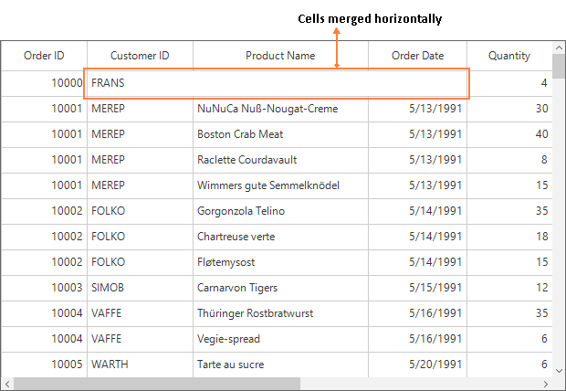
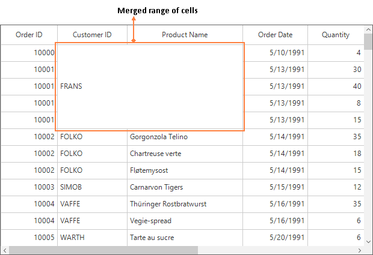
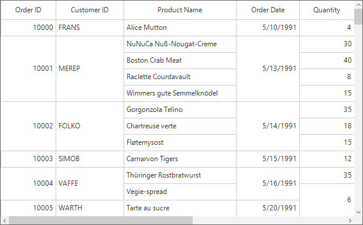

# Merge Cells in Windows Forms DataGrid (SfDataGrid)
The SfDataGrid allows merging a range of adjacent cells by using the [QueryCoveredRange](https://help.syncfusion.com/cr/windowsforms/Syncfusion.WinForms.DataGrid.SfDataGrid.html) event. The merged cells can be exported and printed.

`QueryCoveredRange` event is not fired for the cells that are not visible and also for the cells that are already in covered range. When scrolling the grid, the merged range will be added for newly added rows and columns through this event and removed for the rows and columns which are out of view.

The [QueryCoveredRangeEventArgs](https://help.syncfusion.com/cr/windowsforms/Syncfusion.WinForms.DataGrid.SfDataGrid.html) of the QueryCoveredRange event provides information about the cell which triggered this event. The [QueryCoveredRangeEventArgs.OriginalSender](https://help.syncfusion.com/cr/windowsforms/Syncfusion.WinForms.DataGrid.Events.GridEventArgs.html#Syncfusion_WinForms_DataGrid_Events_GridEventArgs_OriginalSender) returns the `SfDataGrid` which fired this event for `DetailsView`. By using the [QueryCoveredRangeEventArgs.Range](https://help.syncfusion.com/cr/windowsforms/Syncfusion.WinForms.DataGrid.Events.QueryCoveredRangeEventArgs.html#Syncfusion_WinForms_DataGrid_Events_QueryCoveredRangeEventArgs_Range) property, the adjacent cells can be merged.



this.sfDataGrid1.SelectionMode = GridSelectionMode.None;
this.sfDataGrid1.QueryCoveredRange += sfDataGrid1_QueryCoveredRange;

void sfDataGrid1_QueryCoveredRange(object sender, QueryCoveredRangeEventArgs e)
{ 
}


Me.sfDataGrid1.SelectionMode = GridSelectionMode.None
AddHandler Me.sfDataGrid1.QueryCoveredRange, AddressOf sfDataGrid1_QueryCoveredRange

Private Sub sfDataGrid1_QueryCoveredRange(ByVal sender As Object, ByVal e As QueryCoveredRangeEventArgs)
End Sub



## Merging cells
The range of cells can be merged by setting [CoveredCellInfo](https://help.syncfusion.com/cr/windowsforms/Syncfusion.WinForms.DataGrid.CoveredCellInfo.html) (by defining left, right, top & bottom) to [QueryCoveredRangeEventArgs.Range](https://help.syncfusion.com/cr/windowsforms/Syncfusion.WinForms.DataGrid.Events.QueryCoveredRangeEventArgs.html#Syncfusion_WinForms_DataGrid_Events_QueryCoveredRangeEventArgs_Range) and handling this event.

### Merging cells horizontally by fixed range
The columns in a row can be merged by setting the column range using the [Left](https://help.syncfusion.com/cr/windowsforms/Syncfusion.WinForms.DataGrid.CoveredCellInfo.html#Syncfusion_WinForms_DataGrid_CoveredCellInfo_Left) and [Right](https://help.syncfusion.com/cr/windowsforms/Syncfusion.WinForms.DataGrid.CoveredCellInfo.html#Syncfusion_WinForms_DataGrid_CoveredCellInfo_Right) properties of `CoveredCellInfo`.



this.sfDataGrid1.SelectionMode = GridSelectionMode.None;
this.sfDataGrid1.QueryCoveredRange += sfDataGrid1_QueryCoveredRange;

void sfDataGrid1_QueryCoveredRange(object sender, QueryCoveredRangeEventArgs e)
{
    if (e.RowIndex == 1)
    {
        if (e.ColumnIndex >= 1 && e.ColumnIndex <= 3)
        {
            e.Range = new CoveredCellInfo(1, 3, 1, 1);
            e.Handled = true;
        }
    }
}


Me.sfDataGrid1.SelectionMode = GridSelectionMode.None
AddHandler Me.sfDataGrid1.QueryCoveredRange, AddressOf sfDataGrid1_QueryCoveredRange

Private Sub sfDataGrid1_QueryCoveredRange(Object sender, QueryCoveredRangeEventArgs e)
	If e.RowIndex = 1 Then
		If e.ColumnIndex >= 1 AndAlso e.ColumnIndex <= 3 Then
			e.Range = New CoveredCellInfo(1, 3, 1, 1)
			e.Handled = True
		End If
	End If
End Sub



### Merging cells vertically by fixed range
A range of rows for a particular column can be merged by setting the row range using the [Top](https://help.syncfusion.com/cr/windowsforms/Syncfusion.WinForms.DataGrid.CoveredCellInfo.html#Syncfusion_WinForms_DataGrid_CoveredCellInfo_Top) and [Bottom](https://help.syncfusion.com/cr/windowsforms/Syncfusion.WinForms.DataGrid.CoveredCellInfo.html#Syncfusion_WinForms_DataGrid_CoveredCellInfo_Bottom) properties of [CoveredCellInfo](https://help.syncfusion.com/cr/windowsforms/Syncfusion.WinForms.DataGrid.CoveredCellInfo.html).



this.sfDataGrid1.SelectionMode = GridSelectionMode.None;
this.sfDataGrid1.QueryCoveredRange += sfDataGrid1_QueryCoveredRange;
void sfDataGrid1_QueryCoveredRange(object sender, QueryCoveredRangeEventArgs e)
{
    if (e.ColumnIndex == 1)
    {
        if (e.RowIndex >= 1 && e.RowIndex <= 5)
        {
            e.Range = new CoveredCellInfo(1, 1, 1, 5);
            e.Handled = true;
        }
    }
}


Me.sfDataGrid1.SelectionMode = GridSelectionMode.None
AddHandler Me.sfDataGrid1.QueryCoveredRange, AddressOf sfDataGrid1_QueryCoveredRange

Private Sub sfDataGrid1_QueryCoveredRange(ByVal sender As Object, ByVal e As QueryCoveredRangeEventArgs)
	If e.ColumnIndex = 1 Then
		If e.RowIndex >= 1 AndAlso e.RowIndex <= 5 Then
			e.Range = New CoveredCellInfo(1, 1, 1, 5)
			e.Handled = True
		End If
	End If
End Sub



### Merging range of cells
A range of rows and columns can be merged by using the [Left](https://help.syncfusion.com/cr/windowsforms/Syncfusion.WinForms.DataGrid.CoveredCellInfo.html#Syncfusion_WinForms_DataGrid_CoveredCellInfo_Left), [Right](https://help.syncfusion.com/cr/windowsforms/Syncfusion.WinForms.DataGrid.CoveredCellInfo.html#Syncfusion_WinForms_DataGrid_CoveredCellInfo_Right), [Top](https://help.syncfusion.com/cr/windowsforms/Syncfusion.WinForms.DataGrid.CoveredCellInfo.html#Syncfusion_WinForms_DataGrid_CoveredCellInfo_Top) and [Bottom](https://help.syncfusion.com/cr/windowsforms/Syncfusion.WinForms.DataGrid.CoveredCellInfo.html#Syncfusion_WinForms_DataGrid_CoveredCellInfo_Bottom) properties of [CoveredCellInfo](https://help.syncfusion.com/cr/windowsforms/Syncfusion.WinForms.DataGrid.CoveredCellInfo.html).



this.sfDataGrid1.SelectionMode = GridSelectionMode.None;
this.sfDataGrid1.QueryCoveredRange += sfDataGrid1_QueryCoveredRange;

void sfDataGrid1_QueryCoveredRange(object sender, QueryCoveredRangeEventArgs e)
{
    if (e.ColumnIndex == 1 && e.RowIndex == 1)
    {
        e.Range = new CoveredCellInfo(1, 2, 1, 5);
        e.Handled = true;
    }    
}


Me.sfDataGrid1.SelectionMode = GridSelectionMode.None
AddHandler Me.sfDataGrid1.QueryCoveredRange, AddressOf sfDataGrid1_QueryCoveredRange

Private Sub sfDataGrid1_QueryCoveredRange(ByVal sender As Object, ByVal e As QueryCoveredRangeEventArgs)
	If e.ColumnIndex = 1 AndAlso e.RowIndex = 1 Then
		e.Range = New CoveredCellInfo(1, 2, 1, 5)
		e.Handled = True
	End If
End Sub



## Merging cells based on the content
The redundant data of adjacent cells in a row or a column can be merged by using the [QueryCoveredRange](https://help.syncfusion.com/cr/windowsforms/Syncfusion.WinForms.DataGrid.SfDataGrid.html) event.
In the following code, the `GetRange` method returns the range of a cell based on the adjacent cells content. 



/// 

/// Holds the PropertyAccessProvider to git the cell value.
/// 

IPropertyAccessProvider propertyAccessProvider = null;

public Form1()
{
    InitializeComponent();
    this.sfDataGrid1.DataSource = new OrderInfoCollection().OrdersListDetails;
    propertyAccessProvider = sfDataGrid1.View.GetPropertyAccessProvider();

    this.sfDataGrid1.SelectionMode = GridSelectionMode.None;
    this.sfDataGrid1.QueryCoveredRange += sfDataGrid1_QueryCoveredRange;
}

void sfDataGrid1_QueryCoveredRange(object sender, QueryCoveredRangeEventArgs e)
{
    var range = GetRange(e.GridColumn, e.RowIndex, e.ColumnIndex, e.Record);

    if (range == null)
        return;

    e.Range = range;
    e.Handled = true;
}

private CoveredCellInfo GetRange(GridColumn column, int rowIndex, int columnIndex, object rowData)
{
    var range = new CoveredCellInfo(columnIndex, columnIndex, rowIndex, rowIndex);
    object data = propertyAccessProvider.GetFormattedValue(rowData, column.MappingName);

    GridColumn leftColumn = null;
    GridColumn rightColumn = null;

    // total rows count.
    int recordsCount = this.sfDataGrid1.GroupColumnDescriptions.Count != 0 ? 
        (this.sfDataGrid1.View.TopLevelGroup.DisplayElements.Count + this.sfDataGrid1.TableSummaryRows.Count + this.sfDataGrid1.UnboundRows.Count + (this.sfDataGrid1.AddNewRowPosition == RowPosition.Top ? +1 : 0)) 
        : (this.sfDataGrid1.View.Records.Count + this.sfDataGrid1.TableSummaryRows.Count + this.sfDataGrid1.UnboundRows.Count + (this.sfDataGrid1.AddNewRowPosition == RowPosition.Top ? +1 : 0));
    recordsCount += this.sfDataGrid1.TableControl.GetHeaderIndex();

    // Merge Horizontally
    // compare right column               
    for (int i = sfDataGrid1.Columns.IndexOf(column); i < this.sfDataGrid1.Columns.Count - 1; i++)
    {
        var compareData = propertyAccessProvider.GetFormattedValue(rowData, sfDataGrid1.Columns[i + 1].MappingName);

        if (compareData == null)
            break;

        if (!compareData.Equals(data))
            break;
        rightColumn = sfDataGrid1.Columns[i + 1];
    }

    // compare left column.
    for (int i = sfDataGrid1.Columns.IndexOf(column); i > 0; i--)
    {
        var compareData = propertyAccessProvider.GetFormattedValue(rowData, sfDataGrid1.Columns[i - 1].MappingName);

        if (compareData == null)
            break;

        if (!compareData.Equals(data))
            break;
        leftColumn = sfDataGrid1.Columns[i - 1];
    }

    if (leftColumn != null || rightColumn != null)
    {
        // set left index
        if (leftColumn != null)
        {
            var leftColumnIndex = this.sfDataGrid1.TableControl.ResolveToScrollColumnIndex(this.sfDataGrid1.Columns.IndexOf(leftColumn));
            range = new CoveredCellInfo(leftColumnIndex, range.Right, range.Top, range.Bottom);
        }

        // set right index
        if (rightColumn != null)
        {
            var rightColumnIndex = this.sfDataGrid1.TableControl.ResolveToScrollColumnIndex(this.sfDataGrid1.Columns.IndexOf(rightColumn));
            range = new CoveredCellInfo(range.Left, rightColumnIndex, range.Top, range.Bottom);
        }
        return range;
    }

    // Merge Vertically from the row index.
    int previousRowIndex = -1;
    int nextRowIndex = -1;

    // Get previous row data.                
    var startIndex = sfDataGrid1.TableControl.ResolveStartIndexBasedOnPosition();
    for (int i = rowIndex - 1; i >= startIndex; i--)
    {
        var previousData = this.sfDataGrid1.GetRecordEntryAtRowIndex(i);
        if (previousData == null || !previousData.IsRecords)
            break;

        var compareData = propertyAccessProvider.GetFormattedValue((previousData as RecordEntry).Data, column.MappingName);

        if (compareData == null)
            break;

        if (!compareData.Equals(data))
            break;
        previousRowIndex = i;
    }

    // get next row data.
    for (int i = rowIndex + 1; i < recordsCount + 1; i++)
    {
        var nextData = this.sfDataGrid1.GetRecordEntryAtRowIndex(i);
        if (nextData == null || !nextData.IsRecords)
            break;

        var compareData = propertyAccessProvider.GetFormattedValue((nextData as RecordEntry).Data, column.MappingName);

        if (compareData == null)
            break;

        if (!compareData.Equals(data))
            break;
        nextRowIndex = i;
    }

    if (previousRowIndex != -1 || nextRowIndex != -1)
    {
        if (previousRowIndex != -1)
            range = new CoveredCellInfo(range.Left, range.Right, previousRowIndex, range.Bottom);

        if (nextRowIndex != -1)
            range = new CoveredCellInfo(range.Left, range.Right, range.Top, nextRowIndex);
        return range;
    }

    return null;
}


''' 

''' Holds the PropertyAccessProvider to git the cell value.
''' 

Private propertyAccessProvider As IPropertyAccessProvider = Nothing

Public Sub New()
	InitializeComponent()
	Me.sfDataGrid1.DataSource = New OrderInfoCollection().OrdersListDetails
	propertyAccessProvider = sfDataGrid1.View.GetPropertyAccessProvider()

	Me.sfDataGrid1.SelectionMode = GridSelectionMode.None
                AddHandler Me.sfDataGrid1.QueryCoveredRange, AddressOf sfDataGrid1_QueryCoveredRange
End Sub

Private Sub sfDataGrid1_QueryCoveredRange(ByVal sender As Object, ByVal e As QueryCoveredRangeEventArgs)
	Dim range = GetRange(e.GridColumn, e.RowIndex, e.ColumnIndex, e.Record)

	If range Is Nothing Then
		Return
	End If

	e.Range = range
	e.Handled = True
End Sub

Private Function GetRange(ByVal column As GridColumn, ByVal rowIndex As Integer, ByVal columnIndex As Integer, ByVal rowData As Object) As CoveredCellInfo
	Dim range = New CoveredCellInfo(columnIndex, columnIndex, rowIndex, rowIndex)
	Dim data As Object = propertyAccessProvider.GetFormattedValue(rowData, column.MappingName)

	Dim leftColumn As GridColumn = Nothing
	Dim rightColumn As GridColumn = Nothing

	' total rows count.
	Dim recordsCount As Integer = If(Me.sfDataGrid1.GroupColumnDescriptions.Count <> 0, (Me.sfDataGrid1.View.TopLevelGroup.DisplayElements.Count + Me.sfDataGrid1.TableSummaryRows.Count + Me.sfDataGrid1.UnboundRows.Count + (If(Me.sfDataGrid1.AddNewRowPosition = RowPosition.Top, +1, 0))), (Me.sfDataGrid1.View.Records.Count + Me.sfDataGrid1.TableSummaryRows.Count + Me.sfDataGrid1.UnboundRows.Count + (If(Me.sfDataGrid1.AddNewRowPosition = RowPosition.Top, +1, 0))))
	recordsCount += Me.sfDataGrid1.TableControl.GetHeaderIndex()

	' Merge Horizontally
	' compare right column               
	For i As Integer = sfDataGrid1.Columns.IndexOf(column) To Me.sfDataGrid1.Columns.Count - 2
		Dim compareData = propertyAccessProvider.GetFormattedValue(rowData, sfDataGrid1.Columns(i + 1).MappingName)

		If compareData Is Nothing Then
			Exit For
		End If

		If Not compareData.Equals(data) Then
			Exit For
		End If
		rightColumn = sfDataGrid1.Columns(i + 1)
	Next i

	' compare left column.
	For i As Integer = sfDataGrid1.Columns.IndexOf(column) To 1 Step -1
		Dim compareData = propertyAccessProvider.GetFormattedValue(rowData, sfDataGrid1.Columns(i - 1).MappingName)

		If compareData Is Nothing Then
			Exit For
		End If

		If Not compareData.Equals(data) Then
			Exit For
		End If
		leftColumn = sfDataGrid1.Columns(i - 1)
	Next i

	If leftColumn IsNot Nothing OrElse rightColumn IsNot Nothing Then
		' set left index
		If leftColumn IsNot Nothing Then
			Dim leftColumnIndex = Me.sfDataGrid1.TableControl.ResolveToScrollColumnIndex(Me.sfDataGrid1.Columns.IndexOf(leftColumn))
			range = New CoveredCellInfo(leftColumnIndex, range.Right, range.Top, range.Bottom)
		End If

		' set right index
		If rightColumn IsNot Nothing Then
			Dim rightColumnIndex = Me.sfDataGrid1.TableControl.ResolveToScrollColumnIndex(Me.sfDataGrid1.Columns.IndexOf(rightColumn))
			range = New CoveredCellInfo(range.Left, rightColumnIndex, range.Top, range.Bottom)
		End If
		Return range
	End If

	' Merge Vertically from the row index.
	Dim previousRowIndex As Integer = -1
	Dim nextRowIndex As Integer = -1

	' Get previous row data.                
	Dim startIndex = sfDataGrid1.TableControl.ResolveStartIndexBasedOnPosition()
	For i As Integer = rowIndex - 1 To startIndex Step -1
		Dim previousData = Me.sfDataGrid1.GetRecordEntryAtRowIndex(i)
		If previousData Is Nothing OrElse (Not previousData.IsRecords) Then
			Exit For
		End If

		Dim compareData = propertyAccessProvider.GetFormattedValue((TryCast(previousData, RecordEntry)).Data, column.MappingName)

		If compareData Is Nothing Then
			Exit For
		End If

		If Not compareData.Equals(data) Then
			Exit For
		End If
		previousRowIndex = i
	Next i

	' get next row data.
	For i As Integer = rowIndex + 1 To recordsCount
		Dim nextData = Me.sfDataGrid1.GetRecordEntryAtRowIndex(i)
		If nextData Is Nothing OrElse (Not nextData.IsRecords) Then
			Exit For
		End If

		Dim compareData = propertyAccessProvider.GetFormattedValue((TryCast(nextData, RecordEntry)).Data, column.MappingName)

		If compareData Is Nothing Then
			Exit For
		End If

		If Not compareData.Equals(data) Then
			Exit For
		End If
		nextRowIndex = i
	Next i

	If previousRowIndex <> -1 OrElse nextRowIndex <> -1 Then
		If previousRowIndex <> -1 Then
			range = New CoveredCellInfo(range.Left, range.Right, previousRowIndex, range.Bottom)
		End If

		If nextRowIndex <> -1 Then
			range = New CoveredCellInfo(range.Left, range.Right, range.Top, nextRowIndex)
		End If
		Return range
	End If

	Return Nothing
End Function



## Merge cells in Master-Details View
Master- Details view allows merging the range of cells by using the [QueryCoveredRange](https://help.syncfusion.com/cr/windowsforms/Syncfusion.WinForms.DataGrid.SfDataGrid.html) event of details view DataGrid. The [DetailsViewDataGrid](https://help.syncfusion.com/cr/windowsforms/Syncfusion.WinForms.DataGrid.DetailsViewDataGrid.html) triggered event can be get from the [QueryCoveredRangeEventArgs.OriginalSender](https://help.syncfusion.com/cr/windowsforms/Syncfusion.WinForms.DataGrid.Events.GridEventArgs.html#Syncfusion_WinForms_DataGrid_Events_GridEventArgs_OriginalSender) of the `QueryCoveredRange` event.



var FirstLevelNestedGrid = this.sfDataGrid1.DetailsViewDefinitions[0].DataGrid;
FirstLevelNestedGrid.QueryCoveredRange += FirstLevelNestedGrid_QueryCoveredRange;

void FirstLevelNestedGrid_QueryCoveredRange(object sender, Syncfusion.WinForms.DataGrid.Events.QueryCoveredRangeEventArgs e)
{
    if (e.ColumnIndex == 1)
    {
        if (e.RowIndex >= 2 && e.RowIndex <= 3)
        {
            e.Range = new CoveredCellInfo(1, 1, 2, 3);
            e.Handled = true;
        }
    }
}


Private FirstLevelNestedGrid As SfDataGrid = Me.sfDataGrid1.DetailsViewDefinitions(0).DataGrid
AddHandler FirstLevelNestedGrid.QueryCoveredRange, AddressOf sfDataGrid1_QueryCoveredRange

Private Sub FirstLevelNestedGrid_QueryCoveredRange(ByVal sender As Object, ByVal e As Syncfusion.WinForms.DataGrid.Events.QueryCoveredRangeEventArgs)
	If e.ColumnIndex = 1 Then
		If e.RowIndex >= 2 AndAlso e.RowIndex <= 3 Then
			e.Range = New CoveredCellInfo(1, 1, 2, 3)
			e.Handled = True
		End If
	End If
End Sub



## Exporting Merged Cells

### Export merged cells to Excel
The merged cells can be exported to Excel by setting the [ExcelExportingOptions.ExportMergedCells](https://help.syncfusion.com/cr/windowsforms/Syncfusion.WinForms.DataGridConverter.ExcelExportingOptions.html#Syncfusion_WinForms_DataGridConverter_ExcelExportingOptions_ExportMergedCells) property.



ExcelExportingOptions excelExportingOption = new ExcelExportingOptions();
excelExportingOption.ExportMergedCells = true;


Dim excelExportingOption As New ExcelExportingOptions()
excelExportingOption.ExportMergedCells = True



### Export merged cells to PDF
The merged cells can be exported to PDF by setting the [PdfExportingOptions.ExportMergedCells](https://help.syncfusion.com/cr/windowsforms/Syncfusion.WinForms.DataGridConverter.PdfExportingOptions.html#Syncfusion_WinForms_DataGridConverter_PdfExportingOptions_ExportMergedCells) property.



PdfExportingOptions pdfExportingOption = new PdfExportingOptions();
pdfExportingOption.ExportMergedCells = true;


Dim pdfExportingOption As New PdfExportingOptions()
pdfExportingOption.ExportMergedCells = True



## Limitations
Limitations when using cell merging in the SfDataGrid are:

* Row selection is not supported.
* Heterogeneous rows cannot be merged.
* Freeze panes are not supported.
* With `DetailsViewDefinition`, cell merging is not supported if [HideEmptyGridViewDefinition](https://help.syncfusion.com/cr/windowsforms/Syncfusion.WinForms.DataGrid.SfDataGrid.html#Syncfusion_WinForms_DataGrid_SfDataGrid_HideEmptyGridViewDefinition) is false or record has [DetailsViewDataGrid](https://help.syncfusion.com/cr/windowsforms/Syncfusion.WinForms.DataGrid.DetailsViewDataGrid.html).

## How to enable merging with selection
The SfDataGrid does not allow cell merging when the [SelectionMode](https://help.syncfusion.com/cr/windowsforms/Syncfusion.WinForms.DataGrid.SfDataGrid.html#Syncfusion_WinForms_DataGrid_SfDataGrid_SelectionMode) is set other than `None`. This behavior can be overcome by setting the [ExternalExceptionThrownEventArgs.Handled](https://help.syncfusion.com/cr/windowsforms/Syncfusion.WinForms.DataGrid.Events.ExternalExceptionThrownEventArgs.html#Syncfusion_WinForms_DataGrid_Events_ExternalExceptionThrownEventArgs_Handled) to true by using the [ExternalExceptionThrown](https://help.syncfusion.com/cr/windowsforms/Syncfusion.WinForms.DataGrid.SfDataGrid.html) event.



this.sfDataGrid1.ExternalExceptionThrown += sfDataGrid1_ExternalExceptionThrown;
void sfDataGrid1_ExternalExceptionThrown(object sender, Syncfusion.WinForms.DataGrid.Events.ExternalExceptionThrownEventArgs e)
{
    e.Handled = true;
}


AddHandler Me.sfDataGrid1.ExternalExceptionThrown, AddressOf sfDataGrid1_ExternalExceptionThrown

Private Sub sfDataGrid1_ExternalExceptionThrown(ByVal sender As Object, ByVal e As Syncfusion.WinForms.DataGrid.Events.ExternalExceptionThrownEventArgs)
	e.Handled = True
End Sub


