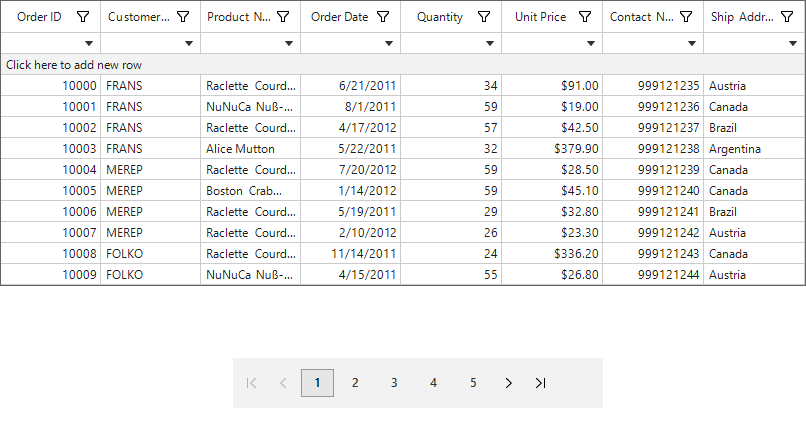

# Paging in Windows Forms DataGrid (SfDataGrid)

SfDataGrid provides support to manipulate the data using [SfDataPager](https://help.syncfusion.com/cr/windowsforms/Syncfusion.WinForms.DataPager.SfDataPager.html) control.

## Getting Started

Follow the below steps to bind SfDataGrid with SfDataPager.

1. Create IEnumerable collection that you want to bind and set it to SfDataPager.Source property.
2. Set [SfDataPager.PageSize](https://help.syncfusion.com/cr/windowsforms/Syncfusion.Data.PagedCollectionView.html#Syncfusion_Data_PagedCollectionView_PageSize) property to specify the number of records to be displayed per page.
3. Bind [SfDataPager.PagedSource](https://help.syncfusion.com/cr/windowsforms/Syncfusion.WinForms.DataPager.SfDataPager.html#Syncfusion_WinForms_DataPager_SfDataPager_PagedSource) to [SfDataGrid.DataSource](https://help.syncfusion.com/cr/windowsforms/Syncfusion.WinForms.DataGrid.SfDataGrid.html#Syncfusion_WinForms_DataGrid_SfDataGrid_DataSource) property. So whenever the page is changed, PagedSource will be update based on current page.



public partial class OrderInfo 
{
    private int _OrderID;

    private DateTime _orderDate;

    private string _CustomerID;

    private double _unitPrice;

    private int _Quantity;

    private Int64 _contactNumber;

    private string _product;

    private string _shipAddress; 
    
    [Display(Name = "Order ID")]
    public int OrderID
    {
        get
        {
            return this._OrderID;
        }
        set
        {
            this._OrderID = value;
            this.OnPropertyChanged("OrderID");
        }
    }
    
    [Display(Name = "Customer ID")]
    public string CustomerID
    {
        get
        {
            return this._CustomerID;
        }
        set
        {
            this._CustomerID = value;
            this.OnPropertyChanged("CustomerID");
        }
    }
   
    [Display(Name = "Product Name")]
    public string ProductName
    {
        get
        {
            return this._product;
        }
        set
        {
            this._product = value;
            this.OnPropertyChanged("ProductName");
        }
    }
   
    [Display(Name = "Order Date")]
    public DateTime OrderDate
    {
        get
        {
            return _orderDate;
        }
        set
        {
            _orderDate = value;
        }
    }

    public int Quantity
    {
        get
        {
            return this._Quantity;
        }
        set
        {
            _Quantity = value;
            OnPropertyChanged("Quantity");
        }
    }

    [DataType(DataType.Currency)]
    [Display(Name = "Unit Price")]
    public double UnitPrice
    {
        get
        {
            return _unitPrice;
        }
        set
        {
            _unitPrice = value;
            OnPropertyChanged("UnitPrice");
        }
    }
   
    [Display(Name = "Contact Number")]
    public Int64 ContactNumber
    {
        get
        {
            return this._contactNumber;
        }
        set
        {
            _contactNumber = value;
            OnPropertyChanged("ContactNumber");
        }
    }
  
    [Display(Name = "Ship Address")] 
    public string ShipAddress
    {
        get
        {
            return this._shipAddress;
        }
        set
        {
            this._shipAddress = value;
            this.OnPropertyChanged("ShipAddress");
        }
    }

    public event PropertyChangedEventHandler PropertyChanged;
    private void OnPropertyChanged(string propertyName)
    {
        if (PropertyChanged != null)
            this.PropertyChanged(this, new PropertyChangedEventArgs(propertyName));
    }
	
    public OrderInfo(int orderID, string customerId, string productName, DateTime orderDate, int quantity, double unitPrice, Int64 contactNumber,  string shipAddress)
    {
        this.OrderID = orderID;
        this.OrderDate = orderDate;
        this.CustomerID = customerId;
        this.UnitPrice = unitPrice;
        this.Quantity = quantity;
        this.ContactNumber = contactNumber;
        this.ProductName = productName;
        this.ShipAddress = shipAddress;    
    }
}


Partial Public Class OrderInfo
	Private _OrderID As Integer

	Private _orderDate As DateTime

	Private _CustomerID As String

	Private _unitPrice As Double

	Private _Quantity As Integer

	Private _contactNumber As Int64

	Private _product As String

	Private _shipAddress As String

	<Display(Name := "Order ID")> _
	Public Property OrderID() As Integer
		Get
			Return Me._OrderID
		End Get
		Set(ByVal value As Integer)
			Me._OrderID = value
			Me.OnPropertyChanged("OrderID")
		End Set
	End Property

	<Display(Name := "Customer ID")> _
	Public Property CustomerID() As String
		Get
			Return Me._CustomerID
		End Get
		Set(ByVal value As String)
			Me._CustomerID = value
			Me.OnPropertyChanged("CustomerID")
		End Set
	End Property
    
	<Display(Name := "Product Name")> _
	Public Property ProductName() As String
		Get
			Return Me._product
		End Get
		Set(ByVal value As String)
			Me._product = value
			Me.OnPropertyChanged("ProductName")
		End Set
	End Property

	<Display(Name := "Order Date")> _
	Public Property OrderDate() As DateTime
		Get
			Return _orderDate
		End Get
		Set(ByVal value As DateTime)
			_orderDate = value
		End Set
	End Property

	Public Property Quantity() As Integer
		Get
			Return Me._Quantity
		End Get
		Set(ByVal value As Integer)
			_Quantity = value
			OnPropertyChanged("Quantity")
		End Set
	End Property

	<DataType(DataType.Currency), Display(Name := "Unit Price")> _
	Public Property UnitPrice() As Double
		Get
			Return _unitPrice
		End Get
		Set(ByVal value As Double)
			_unitPrice = value
			OnPropertyChanged("UnitPrice")
		End Set
	End Property
    
	<Display(Name := "Contact Number")> _
	Public Property ContactNumber() As Int64
		Get
			Return Me._contactNumber
		End Get
		Set(ByVal value As Int64)
			_contactNumber = value
			OnPropertyChanged("ContactNumber")
		End Set
	End Property
    
	<Display(Name := "Ship Address")> _
	Public Property ShipAddress() As String
		Get
			Return Me._shipAddress
		End Get
		Set(ByVal value As String)
			Me._shipAddress = value
			Me.OnPropertyChanged("ShipAddress")
		End Set
	End Property

	Public Event PropertyChanged As PropertyChangedEventHandler
	Private Sub OnPropertyChanged(ByVal propertyName As String)
		If PropertyChangedEvent IsNot Nothing Then
			RaiseEvent PropertyChanged(Me, New PropertyChangedEventArgs(propertyName))
		End If
	End Sub
	
	Public Sub New(ByVal orderID As Integer, ByVal customerId As String, ByVal productName As String, ByVal orderDate As DateTime, ByVal quantity As Integer, ByVal unitPrice As Double, ByVal contactNumber As Int64, ByVal shipAddress As String)
		Me.OrderID = orderID
		Me.OrderDate = orderDate
		Me.CustomerID = customerId
		Me.UnitPrice = unitPrice
		Me.Quantity = quantity
		Me.ContactNumber = contactNumber
		Me.ProductName = productName
		Me.ShipAddress = shipAddress
	End Sub
		
End Class





public class OrderInfoCollection
{
    private ObservableCollection<OrderInfo> _orders;

    public ObservableCollection<OrderInfo> Orders
    {
        get { return _orders; }
        set { _orders = value; }
    }

    public OrderInfoCollection()
    {
        _orders = new ObservableCollection<OrderInfo>();
        this.GenerateOrders();
    }

    private void GenerateOrders()
    {
       _orders.Add(new OrderInfo(10000, "FRANS", "Raclette Courdavault", new DateTime(2011,6,21), 34,91, 9991212235, "Austria"));
	   _orders.Add(new OrderInfo(10001, "FRANS", "NuNuCa Nuß-Nougat-Creme", new DateTime(2011, 8, 1), 59, 19, 9991212236, "Canada"));
	   _orders.Add(new OrderInfo(10002, "FRANS", "Raclette Courdavault", new DateTime(2012, 4, 17), 57, 42.50, 9991212237, "Brazil"));
	   _orders.Add(new OrderInfo(10003, "FRANS", "Alice Mutton", new DateTime(2011, 5, 22), 32, 379.90, 9991212238, "Argentina"));
	   _orders.Add(new OrderInfo(10004, "MEREP", "Raclette Courdavault", new DateTime(2012, 7, 20), 59, 28.50, 9991212239, "Canada"));
	   _orders.Add(new OrderInfo(10005, "MEREP", "Boston Crab Meat",  new DateTime(2012, 1, 14), 59, 45.10, 9991212240, "Canada"));
	   _orders.Add(new OrderInfo(10006, "MEREP", "Raclette Courdavault", new DateTime(2011, 5, 19), 29, 32.80, 9991212241, "Brazil"));
	   _orders.Add(new OrderInfo(10007, "MEREP", "Raclette Courdavault", new DateTime(2012, 2, 10), 26, 23.30, 9991212242, "Austria"));
	   _orders.Add(new OrderInfo(10008, "FOLKO", "Raclette Courdavault", new DateTime(2011, 11, 14), 24, 336.20, 9991212243, "Canada"));
	   _orders.Add(new OrderInfo(10009, "FOLKO", "NuNuCa Nuß-Nougat-Creme", new DateTime(2011, 4, 15), 55, 26.80, 9991212244, "Austria"));
    }
}


Public Class OrderInfoCollection
	
Public Class OrderInfoCollection
	Private _orders As ObservableCollection(Of OrderInfo)

	Public Property Orders() As ObservableCollection(Of OrderInfo)
		Get
			Return _orders
		End Get
		Set(ByVal value As ObservableCollection(Of OrderInfo))
			_orders = value
		End Set
	End Property

	Public Sub New()
		_orders = New ObservableCollection(Of OrderInfo)()
		Me.GenerateOrders()
	End Sub

	Private Sub GenerateOrders()
		_orders.Add(New OrderInfo(10000, "FRANS", "Raclette Courdavault", New DateTime(2011,6,21), 34,91, 9991212235, "Austria"))
		_orders.Add(New OrderInfo(10001, "FRANS", "NuNuCa Nuß-Nougat-Creme", New DateTime(2011, 8, 1), 59, 19, 9991212236, "Canada"))
		_orders.Add(New OrderInfo(10002, "FRANS", "Raclette Courdavault", New DateTime(2012, 4, 17), 57, 42.50, 9991212237, "Brazil"))
		_orders.Add(New OrderInfo(10003, "FRANS", "Alice Mutton", New DateTime(2011, 5, 22), 32, 379.90, 9991212238, "Argentina"))
		_orders.Add(New OrderInfo(10004, "MEREP", "Raclette Courdavault", New DateTime(2012, 7, 20), 59, 28.50, 9991212239, "Canada"))
		_orders.Add(New OrderInfo(10005, "MEREP", "Boston Crab Meat",  New DateTime(2012, 1, 14), 59, 45.10, 9991212240, "Canada"))
		_orders.Add(New OrderInfo(10006, "MEREP", "Raclette Courdavault", New DateTime(2011, 5, 19), 29, 32.80, 9991212241, "Brazil"))
		_orders.Add(New OrderInfo(10007, "MEREP", "Raclette Courdavault", New DateTime(2012, 2, 10), 26, 23.30, 9991212242, "Austria"))
		_orders.Add(New OrderInfo(10008, "FOLKO", "Raclette Courdavault", New DateTime(2011, 11, 14), 24, 336.20, 9991212243, "Canada"))
		_orders.Add(New OrderInfo(10009, "FOLKO", "NuNuCa Nuß-Nougat-Creme", New DateTime(2011, 4, 15), 55, 26.80, 9991212244, "Austria"))				
	End Sub
End Class





    var data = new OrderInfoCollection();
	
    // Set the datasource for the SfDataPager.
    sfDataPager1.DataSource = data.Orders;
    sfDataPager1.PageSize = 10;
    sfDataGrid.DataSource = sfDataPager1.PagedSource;


    Dim data = New OrderInfoCollection()

    ' Set the datasource for the SfDataPager.
    sfDataPager1.DataSource = data.Orders
    sfDataPager1.PageSize = 10
    sfDataGrid.DataSource = sfDataPager1.PagedSource



### Limitations
1.	SfDataPager doesn’t accepts `DataTable` as Source.
2. `AddNewRow` is not supported in SfDataGrid.

## Load Data in on-demand
SfDataPager allows you to load data for current page alone using on-demand paging instead of loading data for all pages.

Follow the below steps to load the DataSource for page in on-demand,

1. Set [SfDataPager.AllowOnDemandPaging](https://help.syncfusion.com/cr/windowsforms/Syncfusion.WinForms.DataPager.SfDataPager.html#Syncfusion_WinForms_DataPager_SfDataPager_AllowOnDemandPaging) as `true`.
2. Set [SfDataPager.PageCount](https://help.syncfusion.com/cr/windowsforms/Syncfusion.WinForms.DataPager.SfDataPager.html#Syncfusion_WinForms_DataPager_SfDataPager_PageCount) based on total number of records and [SfDataPager.PageSize](https://help.syncfusion.com/cr/windowsforms/Syncfusion.Data.PagedCollectionView.html#Syncfusion_Data_PagedCollectionView_PageSize) property.
3. Use [OnDemandLoading](https://help.syncfusion.com/cr/windowsforms/Syncfusion.WinForms.DataPager.SfDataPager.html#Syncfusion_WinForms_DataPager_SfDataPager_OnDemandLoading) event to load the DataSource for current page using [LoadDynamicData](https://help.syncfusion.com/cr/windowsforms/Syncfusion.WinForms.DataPager.SfDataPager.html#Syncfusion_WinForms_DataPager_SfDataPager_LoadDynamicData_System_Int32_System_Collections_IEnumerable_) method.
4. [OnDemandLoading](https://help.syncfusion.com/cr/windowsforms/Syncfusion.WinForms.DataPager.SfDataPager.html#Syncfusion_WinForms_DataPager_SfDataPager_OnDemandLoading) event is raised when SfDataPager moves to another page and you can load the DataSource for corresponding page through OnDemandLoading event.

[OnDemandLoadingEventArgs](https://help.syncfusion.com/cr/windowsforms/Syncfusion.WinForms.DataPager.Events.OnDemandLoadingEventArgs.html) has the following members,

1. [StartRowIndex](https://help.syncfusion.com/cr/windowsforms/Syncfusion.WinForms.DataPager.Events.OnDemandLoadingEventArgs.html#Syncfusion_WinForms_DataPager_Events_OnDemandLoadingEventArgs_StartRowIndex) - returns the start index based on PageIndex (Number of previous pages * PageSize).
2. [PageSize](https://help.syncfusion.com/cr/windowsforms/Syncfusion.Data.PagedCollectionView.html#Syncfusion_Data_PagedCollectionView_PageSize) - denotes the number of records to be displayed in the page.

N> Do not assign SfDataPager.Source property while using on-demand paging.



private List<Employees> employeeCollection;

public Form1()
{
InitializeComponent();
this.sfDataPager1.OnDemandLoading += OnDemandLoading;
}
private void OnDemandLoading(object sender, OnDemandLoadingEventArgs e)
{
sfDataPager1.LoadDynamicData(e.StartRowIndex, employeeCollection.Skip(e.StartRowIndex).Take(e.PageSize));
}


Private employeeCollection As List(Of Employees)

AddHandler Me.sfDataPager1.OnDemandLoading, AddressOf OnDemandLoading

Private Sub OnDemandLoading(ByVal sender As Object, ByVal e As OnDemandLoadingEventArgs)
    sfDataPager1.LoadDynamicData(e.StartRowIndex, employeeCollection.Skip(e.StartRowIndex).Take(e.PageSize))
End Sub




### Asynchronous data loading

Data to the `SfDataPager` can be loaded asynchronously using the [BusyIndicator](https://help.syncfusion.com/cr/windowsforms/Syncfusion.WinForms.Core.Utils.BusyIndicator.html).



// Wire events.
this.sfDataPager1.OnDemandLoading += OnDemandLoading;            

BusyIndicator busyIndicator = new BusyIndicator();

private void OnDemandLoading(object sender, OnDemandLoadingEventArgs e)
{
    //Show busy indicator while loading the data.
    if (sfDataGrid.TableControl.IsHandleCreated)
    {
        busyIndicator.Show(this.sfDataGrid.TableControl);
        Thread.Sleep(1000);
    }

    sfDataPager1.LoadDynamicData(e.StartRowIndex, employeeCollection.Skip(e.StartRowIndex).Take(e.PageSize));
    busyIndicator.Hide();
}


' Wire events.
AddHandler Me.sfDataPager1.OnDemandLoading, AddressOf OnDemandLoading

Dim busyIndicator As New BusyIndicator()

Private Sub OnDemandLoading(ByVal sender As Object, ByVal e As OnDemandLoadingEventArgs)
	'Show busy indicator while loading the data.
	If sfDataGrid.TableControl.IsHandleCreated Then
		busyIndicator.Show(Me.sfDataGrid.TableControl)
		Thread.Sleep(1000)
	End If

	sfDataPager1.LoadDynamicData(e.StartRowIndex, employeeCollection.Skip(e.StartRowIndex).Take(e.PageSize))
	busyIndicator.Hide()
End Sub



### Resetting Cache
While navigating between the pages, records are loaded through `OnDemandLoading` event and the records of navigated pages will be maintained in cache. If you navigate to already navigated page, the records are loaded from cache instead of loading from `OnDemandLoading` event. You can clear the cache by using [PageCollectionView.ResetCache](https://help.syncfusion.com/cr/windowsforms/Syncfusion.Data.PagedCollectionView.html#Syncfusion_Data_PagedCollectionView_ResetCache) method. Once this method is invoked, the `OnDemandLoading` event will be raised while navigating multiple times to the same page.



this.sfDataPager1.OnDemandLoading += OnDemandLoading;
private void OnDemandLoading(object sender, OnDemandLoadingEventArgs e)
{
    sfDataPager1.LoadDynamicData(e.StartRowIndex, employeeCollection.Skip(e.StartRowIndex).Take(e.PageSize));
 
     //resetting cache for all pages.
    (sfDataPager1.PagedSource as PagedCollectionView).ResetCache();
}


AddHandler Me.sfDataPager1.OnDemandLoading, AddressOf OnDemandLoading

Private Sub OnDemandLoading(ByVal sender As Object, ByVal e As OnDemandLoadingEventArgs)
    sfDataPager1.LoadDynamicData(e.StartRowIndex, employeeCollection.Skip(e.StartRowIndex).Take(e.PageSize))

    'resetting cache for all pages.

    TryCast(sfDataPager1.PagedSource, PagedCollectionView).ResetCache()
End Sub




You can also clear the cache to particular page by specifying the PageIndex in [PageCollectionView.ResetCacheForPage](https://help.syncfusion.com/cr/windowsforms/Syncfusion.Data.PagedCollectionView.html#Syncfusion_Data_PagedCollectionView_ResetCacheForPage_System_Int32_) method.



(sfDataPager1.PagedSource as PagedCollectionView).ResetCacheForPage(this.sfDataPager1.SelectedPageIndex);


TryCast(sfDataPager1.PagedSource, PagedCollectionView).ResetCacheForPage(Me.sfDataPager1.SelectedPageIndex)



### Loading data from database in on-demand
You can read the data from database in on-demand (here, records are retrieved from Northwind data provider) in [OnDemandLoading](https://help.syncfusion.com/cr/windowsforms/Syncfusion.WinForms.DataPager.SfDataPager.html#Syncfusion_WinForms_DataPager_SfDataPager_OnDemandLoading) event handler.



public partial class Form1 : Form
{
Northwind northWind;
List<Orders> source = new List<Orders>();

public Form1()
{
    InitializeComponent();
    string connectionString = string.Format(@"Data Source = {0}", ("Northwind.sdf"));

    //northWind dataProvider connectivity.
    northWind = new Northwind(connectionString);
    source = northWind.Orders.ToList();
    this.sfDataPager1.OnDemandLoading += OnDemandLoading;
}

private void OnDemandLoading(object sender, OnDemandLoadingEventArgs e)
{ 
    sfDataPager1.LoadDynamicData(e.StartRowIndex, source.Skip(e.StartRowIndex).Take(e.PageSize));
}


Partial Public Class Form1
	Inherits Form
Private northWind As Northwind
Private source As New List(Of Orders)()

Public Sub New()
	InitializeComponent()
	Dim connectionString As String = String.Format("Data Source = {0}", ("Northwind.sdf"))

	'northWind dataProvider connectivity.
	northWind = New Northwind(connectionString)
	source = northWind.Orders.ToList()
	AddHandler Me.sfDataPager1.OnDemandLoading, AddressOf OnDemandLoading
End Sub

Private Sub OnDemandLoading(ByVal sender As Object, ByVal e As OnDemandLoadingEventArgs)
	sfDataPager1.LoadDynamicData(e.StartRowIndex, source.Skip(e.StartRowIndex).Take(e.PageSize))
End Sub



### Changing PageCount at run time while filtering
You can change the [SfDataPager.PageCount](https://help.syncfusion.com/cr/windowsforms/Syncfusion.WinForms.DataPager.SfDataPager.html#Syncfusion_WinForms_DataPager_SfDataPager_PageCount) at runtime based on the records count in on-demand paging. Here, PageCount are modified by filtering the records in run time.



public partial class Form1 : Form
{
Northwind northWind;
List<Orders> source = new List<Orders>();

public Form1()
{
    InitializeComponent();
    string connectionString = string.Format(@"Data Source = {0}", ("Northwind.sdf"));

    //northWind dataProvider connectivity.
    northWind = new Northwind(connectionString);
    source = northWind.Orders.ToList();
    this.sfDataPager1.OnDemandLoading += OnDemandLoading;
}

private void OnDemandLoading(object sender, OnDemandLoadingEventArgs e)
{ 
    sfDataPager1.LoadDynamicData(e.StartRowIndex, source.Skip(e.StartRowIndex).Take(e.PageSize));
}

private List<Orders> ApplyFilter(Northwind NorthwindSource)
{

    // records are filtered based on CustomerID column
    return NorthwindSource.Orders.Where(item => item.CustomerID.Contains(filterTextBox.Text)).ToList();
}

private void FilterBtn_Click(object sender, System.EventArgs e)
{
    source = ApplyFilter(northWind);

    //page count resets based on filtered records.

    if (source.Count() < sfDataPager1.PageSize)
        this.sfDataPager1.PageCount = 1;

    else
    {
        var count = source.Count() / sfDataPager1.PageSize;

        if (source.Count() % sfDataPager1.PageSize == 0)
            this.sfDataPager1.PageCount = count;

        else
            this.sfDataPager1.PageCount = count + 1;

    }
    this.sfDataPager1.MoveToPage(0);
    this.sfDataPager1.Refresh();
}



Partial Public Class Form1
	Inherits Form
Private northWind As Northwind
Private source As New List(Of Orders)()

Public Sub New()
	InitializeComponent()
	Dim connectionString As String = String.Format("Data Source = {0}", ("Northwind.sdf"))

	'northWind dataProvider connectivity.
	northWind = New Northwind(connectionString)
	source = northWind.Orders.ToList()
	AddHandler Me.sfDataPager1.OnDemandLoading, AddressOf OnDemandLoading
End Sub

Private Sub OnDemandLoading(ByVal sender As Object, ByVal e As OnDemandLoadingEventArgs)
	sfDataPager1.LoadDynamicData(e.StartRowIndex, source.Skip(e.StartRowIndex).Take(e.PageSize))
End Sub

Private Function ApplyFilter(ByVal NorthwindSource As Northwind) As List(Of Orders)

	' records are filtered based on CustomerID column
	Return NorthwindSource.Orders.Where(Function(item) item.CustomerID.Contains(filterTextBox.Text)).ToList()
End Function

Private Sub FilterBtn_Click(ByVal sender As Object, ByVal e As System.EventArgs)
	source = ApplyFilter(northWind)

	'page count resets based on filtered records.

	If source.Count() < sfDataPager1.PageSize Then
		Me.sfDataPager1.PageCount = 1

	Else
		Dim count = source.Count() / sfDataPager1.PageSize

		If source.Count() Mod sfDataPager1.PageSize = 0 Then
			Me.sfDataPager1.PageCount = count

		Else
			Me.sfDataPager1.PageCount = count + 1
		End If

	End If
	Me.sfDataPager1.MoveToPage(0)
	Me.sfDataPager1.Refresh()
End Sub



Here, records are filtered based on the textbox text in clicking event of Filter button. Initially PageCount is 5 and it is changed as 1 once the records are filtered.
You can refer the [sample](https://github.com/SyncfusionExamples/how-to-change-the-PageCount-at-runtime-when-data-loaded-on-demand-is-filtered-in-winforms-datapager) from here.

### Sorting complete collection
You can sort the complete collection with on-demand paging by using [SfDataGrid.SortColumnsChanging](https://help.syncfusion.com/cr/windowsforms/Syncfusion.WinForms.DataGrid.SfDataGrid.html#Syncfusion_WinForms_DataGrid_SfDataGrid_SortColumnsChanging) event.
In this event, you can sort the complete underlying collection instead of sorting current page alone by resetting the caches.



public partial class Form1 : Form
{
Northwind northWind;
List<Orders> source = new List<Orders>();

public Form1()
{
    InitializeComponent();
    string connectionString = string.Format(@"Data Source = {0}", ("Northwind.sdf"));

    //northWind dataProvider connectivity.
    northWind = new Northwind(connectionString);
    source = northWind.Orders.ToList();
    this.sfDataPager1.OnDemandLoading += OnDemandLoading;
}

private void OnDemandLoading(object sender, OnDemandLoadingEventArgs e)
{ 
    sfDataPager1.LoadDynamicData(e.StartRowIndex, source.Skip(e.StartRowIndex).Take(e.PageSize));
}

private void SfDataGrid_SortColumnsChanging(object sender, Syncfusion.WinForms.DataGrid.Events.SortColumnsChangingEventArgs e)
{
    (sfDataPager1.PagedSource as PagedCollectionView).ResetCache();
    (sfDataPager1.PagedSource as PagedCollectionView).ResetCacheForPage(sfDataPager1.SelectedPageIndex);

    if (e.Action == NotifyCollectionChangedAction.Add || e.Action == NotifyCollectionChangedAction.Replace)
    {
        var sortDesc = e.AddedItems[0];

        if (sortDesc.SortDirection == ListSortDirection.Ascending)
        {

            //records are sorted in ascending order.
            source = source.OfQueryable().AsQueryable().OrderBy(sortDesc.ColumnName).Cast<Orders>().ToList();
        }

        else
        {

            //records are sorted descending order.
            source =
                source.OfQueryable()
                        .AsQueryable()
                        .OrderByDescending(sortDesc.ColumnName)
                        .Cast<Orders>()
                        .ToList();
        }
        this.sfDataPager1.MoveToPage(sfDataPager1.SelectedPageIndex);
    }
}


Partial Public Class Form1
	Inherits Form
Private northWind As Northwind
Private source As New List(Of Orders)()

Public Sub New()
	InitializeComponent()
	Dim connectionString As String = String.Format("Data Source = {0}", ("Northwind.sdf"))

	'northWind dataProvider connectivity.
	northWind = New Northwind(connectionString)
	source = northWind.Orders.ToList()
	AddHandler Me.sfDataPager1.OnDemandLoading, AddressOf OnDemandLoading
End Sub

Private Sub OnDemandLoading(ByVal sender As Object, ByVal e As OnDemandLoadingEventArgs)
	sfDataPager1.LoadDynamicData(e.StartRowIndex, source.Skip(e.StartRowIndex).Take(e.PageSize))
End Sub

Private Sub SfDataGrid_SortColumnsChanging(ByVal sender As Object, ByVal e As Syncfusion.WinForms.DataGrid.Events.SortColumnsChangingEventArgs)
	TryCast(sfDataPager1.PagedSource, PagedCollectionView).ResetCache()
	TryCast(sfDataPager1.PagedSource, PagedCollectionView).ResetCacheForPage(sfDataPager1.SelectedPageIndex)

	If e.Action = NotifyCollectionChangedAction.Add OrElse e.Action = NotifyCollectionChangedAction.Replace Then
		Dim sortDesc = e.AddedItems(0)

		If sortDesc.SortDirection = ListSortDirection.Ascending Then

			'records are sorted in ascending order.
			source = source.OfQueryable().AsQueryable().OrderBy(sortDesc.ColumnName).Cast(Of Orders)().ToList()

		Else

			'records are sorted descending order.
			source = source.OfQueryable().AsQueryable().OrderByDescending(sortDesc.ColumnName).Cast(Of Orders)().ToList()
		End If
		Me.sfDataPager1.MoveToPage(sfDataPager1.SelectedPageIndex)
	End If
End Sub



### Limitations
1.	UI Filtering is not supported. You can code in application level to filter the data.
2.	Data processing operations (Sorting, Grouping) are done only in the current page.
3.	Deleting is not supported. You can code to delete row in application level.
4.	Only the navigated pages are exported when on-demand paging is enabled, if the navigated page cache is cleared then the corresponding page will not be exported.

## Appearance

### Button style

The appearance of the button style can be customized using the [NavigationButtonStyle](https://help.syncfusion.com/cr/windowsforms/Syncfusion.WinForms.DataPager.Style.DataPagerStyle.html#Syncfusion_WinForms_DataPager_Style_DataPagerStyle_NavigationButtonStyle) and [PageButtonStyle](https://help.syncfusion.com/cr/windowsforms/Syncfusion.WinForms.DataPager.Style.DataPagerStyle.html#Syncfusion_WinForms_DataPager_Style_DataPagerStyle_PageButtonStyle) property.



this.sfDataPager1.Style.NavigationButtonStyle.BackColor = Color. SeaGreen;


Me.sfDataPager1.Style.NavigationButtonStyle.BackColor = Color.SeaGreen





this.sfDataPager1.Style.PageButtonStyle.BackColor = Color.LightSeaGreen;
this.sfDataPager1.Style.PageButtonStyle.FocusedBackColor = Color.Silver;


Me.sfDataPager1.Style.PageButtonStyle.BackColor = Color.LightSeaGreen
Me.sfDataPager1.Style.PageButtonStyle.FocusedBackColor = Color.Silver



### Orientation
SfDataPager allows you to arrange the child elements either horizontally or vertically. This can be achieved by using the [Orientation](https://help.syncfusion.com/cr/windowsforms/Syncfusion.WinForms.DataPager.SfDataPager.html#Syncfusion_WinForms_DataPager_SfDataPager_Orientation) Property. Orientation is an Enum type. The following table describes the Orientation enum values.

<table>
<tr>
<th>
Enum Value</th><th>
Description</th></tr>
<tr>
<td>
Horizontal</td><td>
This is the default enum value for Orientation. Arranges all the navigation buttons and numeric buttons horizontally.
{{''|markdownify}}

</td></tr>
<tr>
<td>
Vertical</td><td>
Arranges all the navigation buttons and numeric buttons vertically.
{{''|markdownify}}

</td></tr>
</table>

