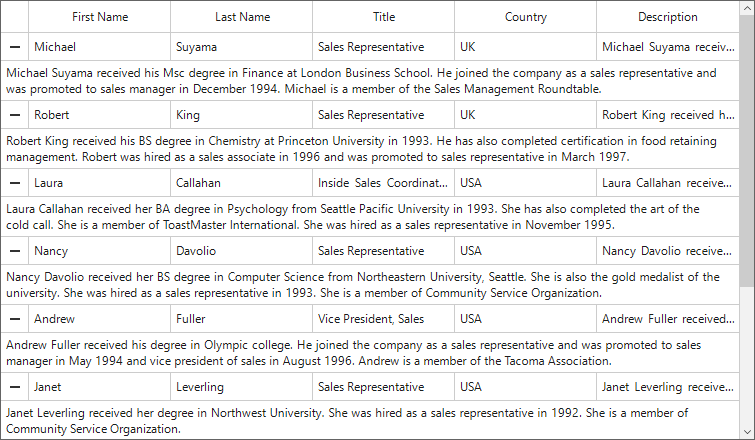
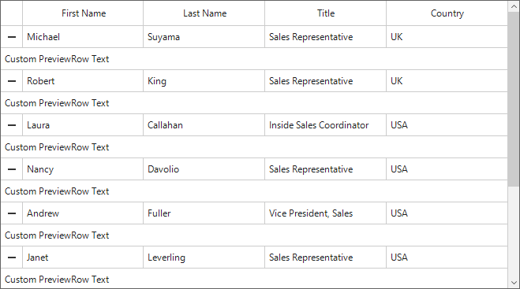
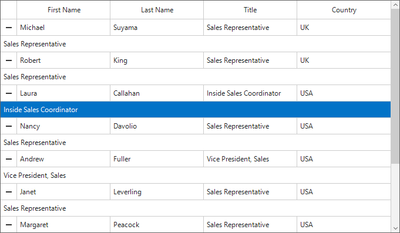
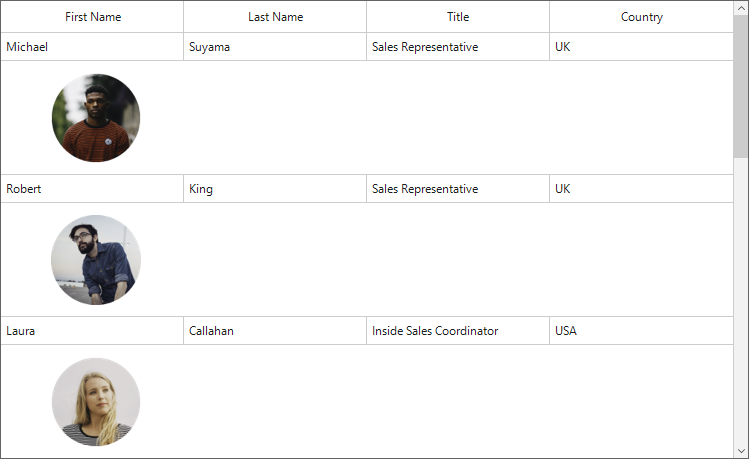

# Preview Rows in Windows Forms DataGrid (SfDataGrid)
The SfDataGrid provides support to display additional information of rows. This can be expanded or collapsed using an expander or programmatically.

## Show preview row

The preview row can be added to grid by setting the [ShowPreviewRow](https://help.syncfusion.com/cr/windowsforms/Syncfusion.WinForms.DataGrid.SfDataGrid.html#Syncfusion_WinForms_DataGrid_SfDataGrid_ShowPreviewRow) property to true. By default, preview rows will be loaded as empty in collapsed state. If you need to load data in preview rows, set the [PreviewRowMappingName](https://help.syncfusion.com/cr/windowsforms/Syncfusion.WinForms.DataGrid.SfDataGrid.html#Syncfusion_WinForms_DataGrid_SfDataGrid_PreviewRowMappingName) property as field name from data source. It will display the given field data in the preview row.



//Enable preview row for the SfDataGrid.
sfDataGrid.ShowPreviewRow = true;
sfDataGrid.PreviewRowMappingName = "Description";
sfDataGrid.ExpandAllPreviewRow();


'Enable preview row for the SfDataGrid.
sfDataGrid.ShowPreviewRow = True
sfDataGrid.PreviewRowMappingName = "Description"
sfDataGrid.ExpandAllPreviewRow()



To display the custom text for each preview rows, use the [DrawPreviewRow](https://help.syncfusion.com/cr/windowsforms/Syncfusion.WinForms.DataGrid.SfDataGrid.html) event and initialize the [DrawPreviewRowEventArgs.Text](https://help.syncfusion.com/cr/windowsforms/Syncfusion.WinForms.DataGrid.Events.DrawPreviewRowEventArgs.html) property to change the display text of the preview rows.



sfDataGrid.DrawPreviewRow += OnDrawPreviewRow;

private void OnDrawPreviewRow(object sender, DrawPreviewRowEventArgs e)
{
    //Setting custom display text for all preview rows.
    e.Text = "Custom PreviewRow Text";
}


AddHandler sfDataGrid.DrawPreviewRow, AddressOf OnDrawPreviewRow

Private Sub OnDrawPreviewRow(ByVal sender As Object, ByVal e As DrawPreviewRowEventArgs)
	'Setting custom display text for all preview rows.
	e.Text = "Custom PreviewRow Text"
End Sub



## Expand and collapse preview rows

The SfDataGrid allows you to expand or collapse the preview rows programmatically in different ways.

### Expand or collapse all the preview rows

You can expand or collapse all the preview rows programmatically using the [ExpandAllPreviewRow](https://help.syncfusion.com/cr/windowsforms/Syncfusion.WinForms.DataGrid.SfDataGrid.html#Syncfusion_WinForms_DataGrid_SfDataGrid_ExpandAllPreviewRow) and [CollapseAllPreviewRow](https://help.syncfusion.com/cr/windowsforms/Syncfusion.WinForms.DataGrid.SfDataGrid.html#Syncfusion_WinForms_DataGrid_SfDataGrid_CollapseAllPreviewRow) methods.



this.sfDataGrid.ExpandAllPreviewRow();
this.sfDataGrid.CollapseAllPreviewRow();


Me.sfDataGrid.ExpandAllPreviewRow()
Me.sfDataGrid.CollapseAllPreviewRow()



### Expand or collapse preview rows based on record index

You can expand or collapse preview rows based on the record index by using the [ExpandPreviewRowAt](https://help.syncfusion.com/cr/windowsforms/Syncfusion.WinForms.DataGrid.SfDataGrid.html#Syncfusion_WinForms_DataGrid_SfDataGrid_ExpandPreviewRowAt_System_Int32_) and [CollapsePreviewRowAt](https://help.syncfusion.com/cr/windowsforms/Syncfusion.WinForms.DataGrid.SfDataGrid.html#Syncfusion_WinForms_DataGrid_SfDataGrid_CollapsePreviewRowAt_System_Int32_) methods.



this.sfDataGrid.ExpandPreviewRowAt(0);
this.sfDataGrid.CollapsePreviewRowAt(0);


Me.sfDataGrid.ExpandPreviewRowAt(0)
Me.sfDataGrid.CollapsePreviewRowAt(0)



### Hide expand/collapse option 

By default, the expander column will be added to each row to expand or collapse the preview row. If you need to hide the expander column for the preview rows, set the [ExpanderColumnWidth](https://help.syncfusion.com/cr/windowsforms/Syncfusion.WinForms.DataGrid.SfDataGrid.html#Syncfusion_WinForms_DataGrid_SfDataGrid_ExpanderColumnWidth) property to 0, and then you can expand all preview rows by using the `ExpandAllPreviewRow` method programmatically.



//Hiding the expand/collapse option for the preview rows. 
sfDataGrid.ExpanderColumnWidth = 0;
sfDataGrid.ExpandAllPreviewRow();


'Hiding the expand/collapse option for the preview rows. 
sfDataGrid.ExpanderColumnWidth = 0
sfDataGrid.ExpandAllPreviewRow()



#### Height customization

The height of the preview rows can be customized using the [PreviewRowHeightMode](https://help.syncfusion.com/cr/windowsforms/Syncfusion.WinForms.DataGrid.SfDataGrid.html#Syncfusion_WinForms_DataGrid_SfDataGrid_PreviewRowHeightMode) property. The preview row height modes are as follows.

<table>
<tr>
<td>
{{'**Height mode**'| markdownify }}
</td>
<td>
{{'**Definition**'| markdownify }}
</td>
</tr>
<tr>
<td>
Auto
</td>
<td>
Sets the calculated height based on the actual size of the preview row text.
</td>
</tr>
<tr>
<td>
Fixed
</td>
<td>
Sets the default height specified by the PreviewRowHeight property.
</td>
</tr>
</table>

The following code example demonstrates how to auto-size the height of preview row based on its content.



sfDataGrid.PreviewRowHeightMode = PreviewRowHeightMode.Auto;


sfDataGrid.PreviewRowHeightMode = PreviewRowHeightMode.Auto



## Appearance 

The appearance of the preview rows can be changed by using the [PreviewRowStyle](https://help.syncfusion.com/cr/windowsforms/Syncfusion.WinForms.DataGrid.Styles.DataGridStyle.html#Syncfusion_WinForms_DataGrid_Styles_DataGridStyle_PreviewRowStyle) property. 



//Customizing the default appearance of the preview rows.
sfDataGrid.Style.PreviewRowStyle.BackColor = ColorTranslator.FromHtml("#0273C7");
sfDataGrid.Style.PreviewRowStyle.TextColor = Color.White;


'Customizing the default appearance of the preview rows.
sfDataGrid.Style.PreviewRowStyle.BackColor = ColorTranslator.FromHtml("#0273C7")
sfDataGrid.Style.PreviewRowStyle.TextColor = Color.White



### Conditional Styling

The appearance of preview rows can be changed based on the conditions using the [DrawPreviewRow](https://help.syncfusion.com/cr/windowsforms/Syncfusion.WinForms.DataGrid.SfDataGrid.html) event.



//Enable preview row for the SfDataGrid.
sfDataGrid.ShowPreviewRow = true;
sfDataGrid.PreviewRowMappingName = "Title";
sfDataGrid.DrawPreviewRow += OnDrawPreviewRow;

private void OnDrawPreviewRow(object sender, DrawPreviewRowEventArgs e)
{
    // Setting custom style for the preview rows.
    if(e.Text == "Inside Sales Coordinator")
    {
        e.Style.BackColor = ColorTranslator.FromHtml("#0273C7");
        e.Style.TextColor = Color.White;
    }
}


'Enable preview row for the SfDataGrid.
sfDataGrid.ShowPreviewRow = True
sfDataGrid.PreviewRowMappingName = "Title"
AddHandler sfDataGrid.DrawPreviewRow, AddressOf OnDrawPreviewRow

private void OnDrawPreviewRow(Object sender, DrawPreviewRowEventArgs e)
	' Setting custom style for the preview rows.
	If e.Text = "Inside Sales Coordinator" Then
		e.Style.BackColor = ColorTranslator.FromHtml("#0273C7")
		e.Style.TextColor = Color.White
	End If
End Sub



### Setting preview row padding

The padding of the preview rows can be changed by using the [PreviewRowPadding](https://help.syncfusion.com/cr/windowsforms/Syncfusion.WinForms.DataGrid.SfDataGrid.html#Syncfusion_WinForms_DataGrid_SfDataGrid_PreviewRowPadding) property.



//Enable preview row for the SfDataGrid.
sfDataGrid.ShowPreviewRow = true;
sfDataGrid.PreviewRowMappingName = "Title";

//Set the padding for the preview rows.
sfDataGrid.PreviewRowPadding = new Padding(100, 5, 5, 5);


'Enable preview row for the SfDataGrid.
sfDataGrid.ShowPreviewRow = True
sfDataGrid.PreviewRowMappingName = "Title"

'Set the padding for the preview rows.
sfDataGrid.PreviewRowPadding = New Padding(100, 5, 5, 5)



### Display image in preview row using custom drawing

The drawing of the preview rows can be customized by handling the [DrawPreviewRow](https://help.syncfusion.com/cr/windowsforms/Syncfusion.WinForms.DataGrid.SfDataGrid.html) event. By using graphics of this event argument, you can draw the customized appearance of the preview rows.



sfDataGrid.DrawPreviewRow += OnDrawPreviewRow;

private void OnDrawPreviewRow(object sender, DrawPreviewRowEventArgs e)
{
    if (!string.IsNullOrEmpty(e.Text))
    {
        var bounds = e.Graphics.ClipBounds;
        e.Graphics.SetClip(e.Bounds);
        var rect = new Rectangle(e.Bounds.X + 50, e.Bounds.Y + 2, 100, 100);
        var image = Image.FromFile(@"..\..\Images\" + e.Text + ".png");

        //Draws the image at the preview row.
        e.Graphics.DrawImage(image, rect);

        // To draw the bottom and right border for the preview row.
        e.Graphics.DrawLine(new Pen(e.Style.Borders.Bottom.Color), new Point(e.Bounds.Left, e.Bounds.Bottom - 1), new Point(e.Bounds.Right, e.Bounds.Bottom - 1));
        e.Graphics.DrawLine(new Pen(e.Style.Borders.Right.Color), new Point(e.Bounds.Right - 1, e.Bounds.Top), new Point(e.Bounds.Right - 1, e.Bounds.Bottom - 1));
        e.Graphics.SetClip(bounds);
        e.Handled = true;
    }
}


'Enable preview row for the SfDataGrid.
sfDataGrid.ShowPreviewRow = True
sfDataGrid.PreviewRowMappingName = "FirstName"
AddHandler sfDataGrid.DrawPreviewRow, AddressOf OnDrawPreviewRow

private void OnDrawPreviewRow(Object sender, DrawPreviewRowEventArgs e)
	If Not String.IsNullOrEmpty(e.Text) Then
		Dim bounds = e.Graphics.ClipBounds
		e.Graphics.SetClip(e.Bounds)
		Dim rect = New Rectangle(e.Bounds.X + 50, e.Bounds.Y + 2, 100, 100)
		Dim image = Image.FromFile("..\..\Images\" & e.Text & ".png")

		'Draws the image at the preview row.
		e.Graphics.DrawImage(image, rect)

		' To draw the bottom and right border for the preview row.
		e.Graphics.DrawLine(New Pen(e.Style.Borders.Bottom.Color), New Point(e.Bounds.Left, e.Bounds.Bottom - 1), New Point(e.Bounds.Right, e.Bounds.Bottom - 1))
		e.Graphics.DrawLine(New Pen(e.Style.Borders.Right.Color), New Point(e.Bounds.Right - 1, e.Bounds.Top), New Point(e.Bounds.Right - 1, e.Bounds.Bottom - 1))
		e.Graphics.SetClip(bounds)
		e.Handled = True
	End If
End Sub



## Handling expand or collapse operations

You can cancel the expanding operation while expanding the preview rows by using the [PreviewRowExpandingEventArgs.Cancel](https://help.syncfusion.com/cr/windowsforms/Syncfusion.WinForms.DataGrid.Events.PreviewRowExpandingEventArgs.html) property in the [PreviewRowExpanding](https://help.syncfusion.com/cr/windowsforms/Syncfusion.WinForms.DataGrid.SfDataGrid.html) event handler. 



sfDataGrid.PreviewRowExpanding += SfDataGrid_PreviewRowExpanding;

private void SfDataGrid_PreviewRowExpanding(object sender, PreviewRowExpandingEventArgs e)
{
    e.Cancel = true;
}


AddHandler sfDataGrid.PreviewRowExpanding += AddressOf SfDataGrid_PreviewRowExpanding

Private Sub SfDataGrid_PreviewRowExpanding(ByVal sender As Object, ByVal e As PreviewRowExpandingEventArgs)
	e.Cancel = True
End Sub



Similarly, the collapsing operation can be canceled using the [PreviewRowCollapsingEventArgs.Cancel](https://help.syncfusion.com/cr/windowsforms/Syncfusion.WinForms.DataGrid.Events.PreviewRowCollapsingEventArgs.html) property in the [PreviewRowCollapsing](https://help.syncfusion.com/cr/windowsforms/Syncfusion.WinForms.DataGrid.SfDataGrid.html) event handler.



sfDataGrid.PreviewRowCollapsing += SfDataGrid_PreviewRowCollapsing;

private void SfDataGrid_PreviewRowCollapsing(object sender, PreviewRowCollapsingEventArgs e)
{
    e.Cancel = true;
}   


AddHandler sfDataGrid.PreviewRowCollapsing += AddressOf SfDataGrid_PreviewRowCollapsing

Private Sub SfDataGrid_PreviewRowCollapsing(ByVal sender As Object, ByVal e As PreviewRowCollapsingEventArgs)
	e.Cancel = True
End Sub



### Limitations

1.	Does not support both details view and preview rows at same level.
2.  Does not support the `QueryRowHeight` event.
3.  Does not support freeze columns with the preview rows.
