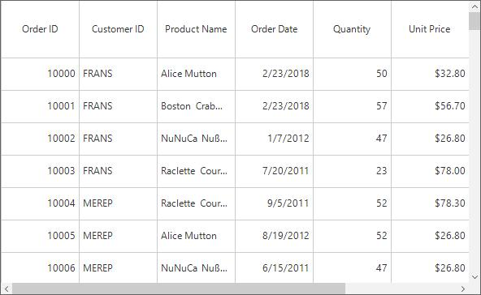
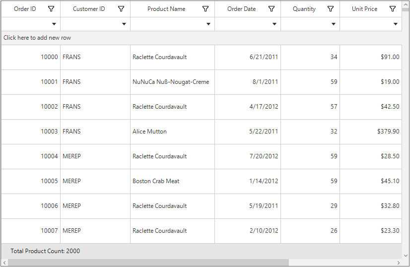
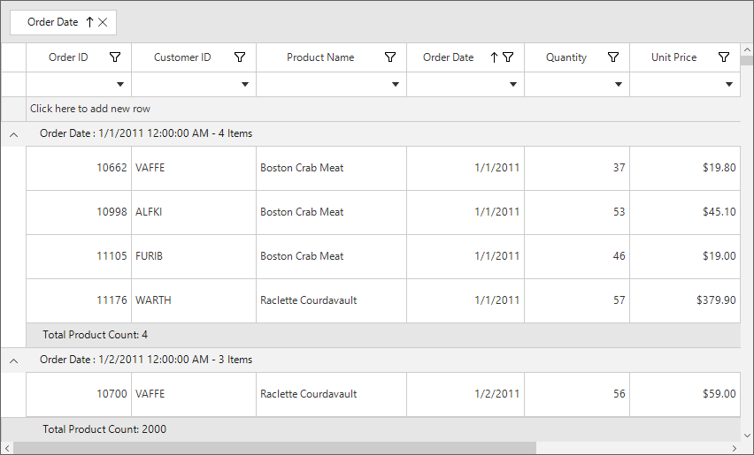
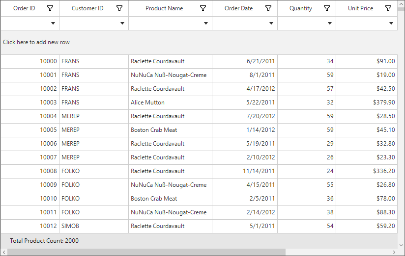
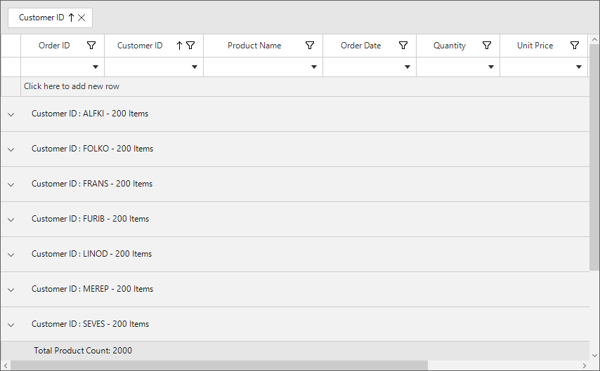
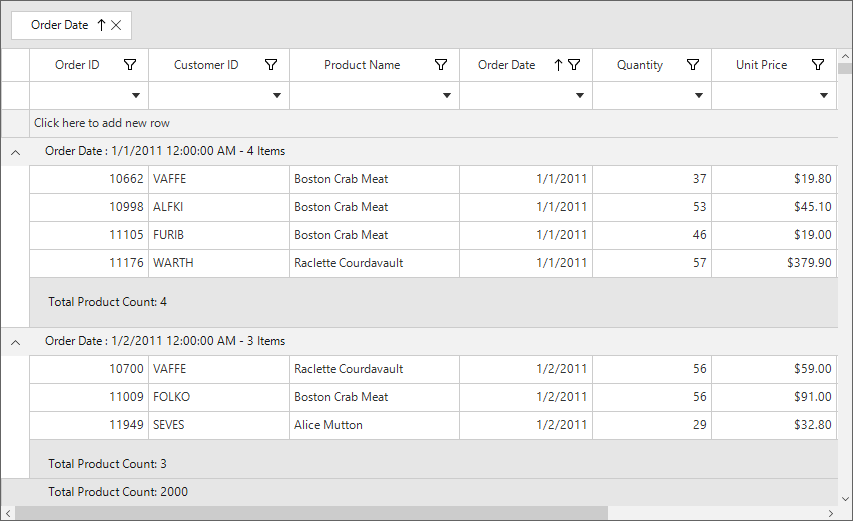
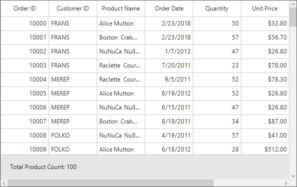

# Row Height Customization in Windows Forms DataGrid (SfDataGrid)

The height of the default row and Header row can be changed by using the [SfDataGrid.RowHeight](https://help.syncfusion.com/cr/windowsforms/Syncfusion.WinForms.DataGrid.SfDataGrid.html#Syncfusion_WinForms_DataGrid_SfDataGrid_RowHeight) and [SfDataGrid.HeaderRowHeight](https://help.syncfusion.com/cr/windowsforms/Syncfusion.WinForms.DataGrid.SfDataGrid.html#Syncfusion_WinForms_DataGrid_SfDataGrid_HeaderRowHeight) property.



//Set the row height for the default row.
this.sfDataGrid.RowHeight = 40;

//Set the row height for header row
this.sfDataGrid.HeaderRowHeight = 70;


'Set the row height for the default row.
Me.sfDataGrid.RowHeight = 40

'Set the row height for header row
Me.sfDataGrid.HeaderRowHeight = 70



## Set Height for the Specific Row

The row height of the particular row can be set by using the [RowHeights](https://help.syncfusion.com/cr/windowsforms/Syncfusion.WinForms.DataGrid.TableControl.html#Syncfusion_WinForms_DataGrid_TableControl_RowHeights) property.



this.sfDataGrid.TableControl.RowHeights[2] = 50;
this.sfDataGrid.TableControl.Invalidate();


Me.sfDataGrid.TableControl.RowHeights(2) = 50
Me.sfDataGrid.TableControl.Invalidate()



The row height of particular row can also be set by using the [QueryRowHeight](https://help.syncfusion.com/cr/windowsforms/Syncfusion.WinForms.DataGrid.SfDataGrid.html) event.



this.sfDataGrid.QueryRowHeight += sfDataGrid_QueryRowHeight;
void sfDataGrid_QueryRowHeight(object sender, QueryRowHeightEventArgs e)
{
    if (e.RowIndex == 2)
    {
        e.Height = 50;
        e.Handled = true;
    }
}


AddHandler Me.sfDataGrid.QueryRowHeight, AddressOf sfDataGrid_QueryRowHeight
Private Sub sfDataGrid_QueryRowHeight(ByVal sender As Object, ByVal e As QueryRowHeightEventArgs)
	If e.RowIndex = 2 Then
		e.Height = 50
		e.Handled = True
	End If
End Sub



## Fit Row Height based on its Content
The row height can be fit based on its content in [QueryRowHeight](https://help.syncfusion.com/cr/windowsforms/Syncfusion.WinForms.DataGrid.SfDataGrid.html) event using [GetAutoRowHeight](https://help.syncfusion.com/cr/windowsforms/Syncfusion.WinForms.DataGrid.AutoSizeController.html#Syncfusion_WinForms_DataGrid_AutoSizeController_GetAutoRowHeight_System_Int32_Syncfusion_WinForms_DataGrid_RowAutoFitOptions_System_Int32__) method. This improves the readability of the content and it does not affect the loading performance of the [WinForms DataGrid](https://www.syncfusion.com/winforms-ui-controls/datagrid) (SfDataGrid) as the `QueryRowHeight` event triggered for rows in on-demand.
`GetAutoRowHeight` method returns true when the row height is calculated for record & header rows and returns false for other rows. Calculated height based on content set to the out parameter and you can assign the calculated height to the Height property of[QueryRowHeightEventArgs](https://help.syncfusion.com/cr/windowsforms/Syncfusion.WinForms.DataGrid.Events.QueryRowHeightEventArgs.html).



RowAutoFitOptions autoFitOptions = new RowAutoFitOptions();
this.sfDataGrid.QueryRowHeight += sfDataGrid_QueryRowHeight;

//To get the calculated height from GetAutoRowHeight method.
int autoHeight;
void sfDataGrid_QueryRowHeight(object sender, QueryRowHeightEventArgs e)
{
    if (this.sfDataGrid.AutoSizeController.GetAutoRowHeight(e.RowIndex, autoFitOptions, out autoHeight))
    {
        if (autoHeight > 24)
        {
            e.Height = autoHeight;
            e.Handled = true;
        }
    }
}


Private autoFitOptions As New RowAutoFitOptions()
AddHandler Me.sfDataGrid.QueryRowHeight, AddressOf sfDataGrid_QueryRowHeight

'To get the calculated height from GetAutoRowHeight method.
Private autoHeight As Integer
Private Sub sfDataGrid_QueryRowHeight(ByVal sender As Object, ByVal e As QueryRowHeightEventArgs)
	If Me.sfDataGrid.AutoSizeController.GetAutoRowHeight(e.RowIndex, autoFitOptions, autoHeight) Then
		If autoHeight > 24 Then
			e.Height = autoHeight
			e.Handled = True
		End If
	End If
End Sub



Here, row heights are customized based on the large text content.

### Auto-Fit Row Height Options
[RowAutoFitOptions](https://help.syncfusion.com/cr/windowsforms/Syncfusion.WinForms.DataGrid.RowAutoFitOptions.html) have the following properties,

1. [ExcludeColumns](https://help.syncfusion.com/cr/windowsforms/Syncfusion.WinForms.DataGrid.RowAutoFitOptions.html#Syncfusion_WinForms_DataGrid_RowAutoFitOptions_ExcludeColumns) – By default, `GetAutoRowHeight` method calculates the row height based on all columns. To skip the specific columns from the row height calculation, add that columns to the `ExcludeColumns` property. 

2. [CanIncludeHiddenColumns](https://help.syncfusion.com/cr/windowsforms/Syncfusion.WinForms.DataGrid.RowAutoFitOptions.html#Syncfusion_WinForms_DataGrid_RowAutoFitOptions_CanIncludeHiddenColumns) – The hidden columns can also be consider for the row height calculation by setting the `CanIncludeHiddenColumns` as `true`.

## Calculate Height based on Certain Columns
The row height can be calculated based on the particular columns by using the `ExcludeColumns` of the `RowAutoFitOptions` in the `QueryRowHeight` event.



RowAutoFitOptions autoFitOptions = new RowAutoFitOptions();
// The list contains the column names that will excluded from the height calculation in GetAutoRowHeight method.
List<string> excludeColumns = new List<string>() { "CustomerID", "OrderID" };
autoFitOptions.ExcludeColumns = excludeColumns;

this.sfDataGrid.QueryRowHeight += sfDataGrid_QueryRowHeight;

//To get the calculated height from GetAutoRowHeight method.
int autoHeight;
void sfDataGrid_QueryRowHeight(object sender, QueryRowHeightEventArgs e)
{
    if (this.sfDataGrid.AutoSizeController.GetAutoRowHeight(e.RowIndex, autoFitOptions, out autoHeight))
    {
        if (autoHeight > 24)
        {
            e.Height = autoHeight;
            e.Handled = true;
        }
    }
}



Private autoFitOptions As New RowAutoFitOptions()
' The list contains the column names that will excluded from the height calculation in GetAutoRowHeight method.
Private excludeColumns As New List(Of String)() From {"CustomerID", "OrderID"}
autoFitOptions.ExcludeColumns = excludeColumns

AddHandler Me.sfDataGrid.QueryRowHeight, AddressOf sfDataGrid_QueryRowHeight

'To get the calculated height from GetAutoRowHeight method.
Private autoHeight As Integer
Private Sub sfDataGrid_QueryRowHeight(ByVal sender As Object, ByVal e As QueryRowHeightEventArgs)
	If Me.sfDataGrid.AutoSizeController.GetAutoRowHeight(e.RowIndex, autoFitOptions, autoHeight) Then
		If autoHeight > 24 Then
			e.Height = autoHeight
			e.Handled = True
		End If
	End If
End Sub



## Reset the RowHeight at Runtime
The row height of particular or all rows in View can be reset at runtime to get the updated height from `QueryRowHeight` event handler by using the [InvalidateRowHeight](https://help.syncfusion.com/cr/windowsforms/Syncfusion.WinForms.DataGrid.SfDataGrid.html#Syncfusion_WinForms_DataGrid_SfDataGrid_InvalidateRowHeight_System_Int32_) and [Reset](https://help.syncfusion.com/cr/windowsforms/Syncfusion.WinForms.DataGrid.RowHeightManager.html#Syncfusion_WinForms_DataGrid_RowHeightManager_Reset) methods.

`InvalidateRowHeight` – Resets the height of particular row.
`RowHeightManager.Reset` – Resets the height for all rows in View.



//Resets the row height for particular row.
this.sfDataGrid.InvalidateRowHeight(2); 

//Resets the height for all rows in View.
this.sfDataGrid.TableControl.RowHeightManager.Reset();

this.sfDataGrid.TableControl.Invalidate();


'Resets the row height for particular row.
Me.sfDataGrid.InvalidateRowHeight(2)

'Resets the height for all rows in View.
Me.sfDataGrid.TableControl.RowHeightManager.Reset()

Me.sfDataGrid.TableControl.Invalidate()



### Update RowHeight while Editing 
The row height of the currently edited row can be updated based on its content by using the [CurrentCellEndEdit](https://help.syncfusion.com/cr/windowsforms/Syncfusion.WinForms.DataGrid.SfDataGrid.html) event.
In this event call the `InvalidateRowHeight` to reset the current row height. Then call the `Invalidate` method of [TableControl](https://help.syncfusion.com/cr/windowsforms/Syncfusion.WinForms.DataGrid.TableControl.html) to refresh the view. Now the `QueryRowHeight` event is called again for edited row alone and row height is calculated based on edited content.



RowAutoFitOptions autoFitOptions = new RowAutoFitOptions();

this.sfDataGrid.QueryRowHeight += sfDataGrid_QueryRowHeight;
this.sfDataGrid.CurrentCellEndEdit += sfDataGrid_CurrentCellEndEdit;

void sfDataGrid_CurrentCellEndEdit(object sender, CurrentCellEndEditEventArgs e)
{
    this.sfDataGrid.InvalidateRowHeight(e.DataRow.RowIndex);
    this.sfDataGrid.TableControl.Invalidate();
}

//To get the calculated height from GetAutoRowHeight method.
int autoHeight;
void sfDataGrid_QueryRowHeight(object sender, QueryRowHeightEventArgs e)
{
    if (this.sfDataGrid.AutoSizeController.GetAutoRowHeight(e.RowIndex, autoFitOptions, out autoHeight))
    {
        if (autoHeight > 24)
        {
            e.Height = autoHeight;
            e.Handled = true;
        }
    }
}


Private autoFitOptions As New RowAutoFitOptions()
AddHandler Me.sfDataGrid.QueryRowHeight, AddressOf sfDataGrid_QueryRowHeight
AddHandler Me.sfDataGrid.CurrentCellEndEdit, AddressOf sfDataGrid_CurrentCellEndEdit
Private Sub sfDataGrid_CurrentCellEndEdit(ByVal sender As Object, ByVal e As CurrentCellEndEditEventArgs)
Me.sfDataGrid.InvalidateRowHeight(e.DataRow.RowIndex)
Me.sfDataGrid.TableControl.Invalidate()
End Sub
'To get the calculated height from GetAutoRowHeight method.
Private autoHeight As Integer
Private Sub sfDataGrid_QueryRowHeight(ByVal sender As Object, ByVal e As QueryRowHeightEventArgs)
If Me.sfDataGrid.AutoSizeController.GetAutoRowHeight(e.RowIndex, autoFitOptions, autoHeight) Then
If autoHeight > 24 Then
e.Height = autoHeight
e.Handled = True
End If
End If
End Sub



## Change HeaderRow Height based on its Content
By default, auto height is supported for the headers is `QueryRowHeight` event. The auto row height can only set for the header row by using the [GetHeaderIndex](https://help.syncfusion.com/cr/windowsforms/Syncfusion.WinForms.DataGrid.DataGridIndexResolver.html#Syncfusion_WinForms_DataGrid_DataGridIndexResolver_GetHeaderIndex_Syncfusion_WinForms_DataGrid_TableControl_) method to decide whether the row index is header or not in `QueryRowHeight` event.



RowAutoFitOptions autoFitOptions = new RowAutoFitOptions();
//Enable TextWrapping for the column header
sfDataGrid.Columns[0].AllowHeaderTextWrapping = true;
this.sfDataGrid.QueryRowHeight += sfDataGrid_QueryRowHeight;

//To get the calculated height from GetAutoRowHeight method.
int autoHeight;
void sfDataGrid_QueryRowHeight(object sender, QueryRowHeightEventArgs e)
{
    //checked whether the row index is header or not.
    if (this.sfDataGrid.TableControl.GetHeaderIndex() == e.RowIndex)
    {
        if (this.sfDataGrid.AutoSizeController.GetAutoRowHeight(e.RowIndex, autoFitOptions, out autoHeight))
        {
            if (autoHeight > 24)
            {
                e.Height = autoHeight;
                e.Handled = true;
            }
        }
    }
}


Private autoFitOptions As New RowAutoFitOptions()
'Enable TextWrapping for the column header
Private sfDataGrid.Columns(0).AllowHeaderTextWrapping = True
AddHandler Me.sfDataGrid.QueryRowHeight, AddressOf sfDataGrid_QueryRowHeight

'To get the calculated height from GetAutoRowHeight method.
Private autoHeight As Integer
Private Sub sfDataGrid_QueryRowHeight(ByVal sender As Object, ByVal e As QueryRowHeightEventArgs)
	'checked whether the row index is header or not.
	If Me.sfDataGrid.TableControl.GetHeaderIndex() = e.RowIndex Then
		If Me.sfDataGrid.AutoSizeController.GetAutoRowHeight(e.RowIndex, autoFitOptions, autoHeight) Then
			If autoHeight > 24 Then
				e.Height = autoHeight
				e.Handled = True
			End If
		End If
	End If
End Sub



## Change StackedHeaderRow Height based on its Content
By default, auto height is supported for [StackedHeaderRows](https://help.syncfusion.com/cr/windowsforms/Syncfusion.WinForms.DataGrid.StackedHeaderRows.html) in `QueryRowHeight` event. To specify the auto height for the stacked header row alone, check the row index with `StackedHeaderRows` count in the `QueryRowHeight` event.



this.sfDataGrid.StackedHeaderRows.Add(new StackedHeaderRow()
{
    Name = "StackedHeader1",
    StackedColumns = new StackedColumns()
         {
              new StackedColumn()
              {
                   ChildColumns = "OrderID,CustomerID,ProductName",
                    HeaderText = "The over all customer details including the OrderID, Customer ID and product name for the KYC information"
              }
         }
});

RowAutoFitOptions autoFitOptions = new RowAutoFitOptions();
sfDataGrid.Columns[0].AllowHeaderTextWrapping = true;
sfDataGrid.Columns[0].AllowTextWrapping = true;
this.sfDataGrid.QueryRowHeight += sfDataGrid_QueryRowHeight;

//To get the calculated height from GetAutoRowHeight method.
int autoHeight;
void sfDataGrid_QueryRowHeight(object sender, QueryRowHeightEventArgs e)
{
    //checked whether the row index is stacked header or not.
    if (e.RowIndex < this.sfDataGrid.StackedHeaderRows.Count)
    {
        if (this.sfDataGrid.AutoSizeController.GetAutoRowHeight(e.RowIndex, autoFitOptions, out autoHeight))
        {
            if (autoHeight > 24)
            {
                e.Height = autoHeight;
                e.Handled = true;
            }
        }
    }
}


Me.sfDataGrid.StackedHeaderRows.Add(New StackedHeaderRow() With {.Name = "StackedHeader1", .StackedColumns = New StackedColumns() With { New StackedColumn() With {.ChildColumns = "OrderID,CustomerID,ProductName", .HeaderText = "The over all customer details including the OrderID, Customer ID and product name for the KYC information"} }})

Dim autoFitOptions As New RowAutoFitOptions()
sfDataGrid.Columns(0).AllowHeaderTextWrapping = True
sfDataGrid.Columns(0).AllowTextWrapping = True
AddHandler Me.sfDataGrid.QueryRowHeight, AddressOf sfDataGrid_QueryRowHeight

'To get the calculated height from GetAutoRowHeight method.
Dim autoHeight As Integer
Private Sub sfDataGrid_QueryRowHeight(ByVal sender As Object, ByVal e As QueryRowHeightEventArgs)
	'checked whether the row index is stacked header or not.
	If e.RowIndex < Me.sfDataGrid.StackedHeaderRows.Count Then
		If Me.sfDataGrid.AutoSizeController.GetAutoRowHeight(e.RowIndex, autoFitOptions, autoHeight) Then
			If autoHeight > 24 Then
				e.Height = autoHeight
				e.Handled = True
			End If
		End If
	End If
End Sub



## Change default record row height

The height for the record rows can be set within the `QueryRowHeight` event. SfDataGrid doesn’t have any method to check for the default record row. It can be done by checking whether the record corresponding to the row index is a `RecordEntry` or not.



this.sfDataGrid.QueryRowHeight += sfDataGrid_QueryRowHeight;

void sfDataGrid_QueryRowHeight(object sender, QueryRowHeightEventArgs e)
{

    if (this.IsDefaultRow(e.RowIndex))
    {
        e.Handled = true;
        e.Height = 50;
    }
}

bool IsDefaultRow(int rowIndex)
{
    if (this.sfDataGrid.View.TopLevelGroup != null)
    {
        var startIndex = this.sfDataGrid.TableControl.ResolveStartIndexBasedOnPosition();
        var record = this.sfDataGrid.View.TopLevelGroup.DisplayElements[rowIndex - startIndex];
        return record != null && record is RecordEntry;
    }
    else
    {
        return !(this.sfDataGrid.TableControl.IsTableSummaryIndex(rowIndex) ||
         this.sfDataGrid.IsAddNewRowIndex(rowIndex) ||
         this.sfDataGrid.IsFilterRowIndex(rowIndex) ||
         this.sfDataGrid.TableControl.GetHeaderIndex() == rowIndex);
    }
}


AddHandler Me.sfDataGrid.QueryRowHeight, AddressOf sfDataGrid_QueryRowHeight

Private Sub sfDataGrid_QueryRowHeight(ByVal sender As Object, ByVal e As QueryRowHeightEventArgs)

    If Me.IsDefaultRow(e.RowIndex) Then
        e.Handled = True
        e.Height = 50
    End If
End Sub

Private Function IsDefaultRow(ByVal rowIndex As Integer) As Boolean
    If Me.sfDataGrid.View.TopLevelGroup IsNot Nothing Then
        Dim startIndex = Me.sfDataGrid.TableControl.ResolveStartIndexBasedOnPosition()
        Dim record = Me.sfDataGrid.View.TopLevelGroup.DisplayElements(rowIndex - startIndex)
        Return record IsNot Nothing AndAlso TypeOf record Is RecordEntry
    Else
        Return Not (Me.sfDataGrid.TableControl.IsTableSummaryIndex(rowIndex) OrElse
                    Me.sfDataGrid.IsAddNewRowIndex(rowIndex) OrElse
                    Me.sfDataGrid.IsFilterRowIndex(rowIndex) OrElse
                    Me.sfDataGrid.TableControl.GetHeaderIndex() = rowIndex)
    End If
End Function



## Change add new row height

The height of the add new row can be set by using [SfDataGrid.IsAddNewRowIndex](https://help.syncfusion.com/cr/windowsforms/Syncfusion.WinForms.DataGrid.DataGridIndexResolver.html#Syncfusion_WinForms_DataGrid_DataGridIndexResolver_IsAddNewRowIndex_Syncfusion_WinForms_DataGrid_SfDataGrid_System_Int32_) method within the `QueryRowHeight` event.  



this.sfDataGrid.QueryRowHeight += sfDataGrid_QueryRowHeight;

void sfDataGrid_QueryRowHeight(object sender, QueryRowHeightEventArgs e)
{

    if (this.sfDataGrid.IsAddNewRowIndex(e.RowIndex))
    {
        e.Handled = true;
        e.Height = 50;
    }
}


AddHandler Me.sfDataGrid.QueryRowHeight, AddressOf sfDataGrid_QueryRowHeight

Private Sub sfDataGrid_QueryRowHeight(ByVal sender As Object, ByVal e As QueryRowHeightEventArgs)

    If Me.sfDataGrid.IsAddNewRowIndex(e.RowIndex) Then
        e.Handled = True
        e.Height = 50
    End If
End Sub



## Change filter row height

The height of the filter row can be set by using [SfDataGrid.IsFilterRowIndex](https://help.syncfusion.com/cr/windowsforms/Syncfusion.WinForms.DataGrid.DataGridIndexResolver.html#Syncfusion_WinForms_DataGrid_DataGridIndexResolver_IsFilterRowIndex_Syncfusion_WinForms_DataGrid_SfDataGrid_System_Int32_) method within the `QueryRowHeight` event.  



this.sfDataGrid.QueryRowHeight += sfDataGrid_QueryRowHeight;

void sfDataGrid_QueryRowHeight(object sender, QueryRowHeightEventArgs e)
{
    if (this.sfDataGrid.IsFilterRowIndex(e.RowIndex))
    {
        e.Handled = true;
        e.Height = 50;
    }
}


AddHandler Me.sfDataGrid.QueryRowHeight, AddressOf sfDataGrid_QueryRowHeight

Private Sub sfDataGrid_QueryRowHeight(ByVal sender As Object, ByVal e As QueryRowHeightEventArgs)
	If Me.sfDataGrid.IsFilterRowIndex(e.RowIndex) Then
		e.Handled = True
		e.Height = 50
	End If
End Sub



## Change caption summary row height

The height of the caption summary rows can be set within the `QueryRowHeight` event. SfDataGrid doesn’t have any method to check for the caption summary row. It can be done by checking whether the record corresponding to the row is a `Group` or not.



this.sfDataGrid.QueryRowHeight += sfDataGrid_QueryRowHeight;

void sfDataGrid_QueryRowHeight(object sender, QueryRowHeightEventArgs e)
{
    if (this.sfDataGrid.View.TopLevelGroup != null)
    {
        if (this.IsCaptionSummaryRow(e.RowIndex))
        {
            e.Handled = true;
            e.Height = 50;
        }
    }
}

bool IsCaptionSummaryRow(int rowIndex)
{
    var startIndex = this.sfDataGrid.TableControl.ResolveStartIndexBasedOnPosition();
    var record = this.sfDataGrid.View.TopLevelGroup.DisplayElements[rowIndex - startIndex];

    return record != null && record is Group;
}


AddHandler Me.sfDataGrid.QueryRowHeight, AddressOf sfDataGrid_QueryRowHeight

Private Sub sfDataGrid_QueryRowHeight(ByVal sender As Object, ByVal e As QueryRowHeightEventArgs)

    If Me.sfDataGrid.View.TopLevelGroup IsNot Nothing Then
        If Me.IsCaptionSummaryRow(e.RowIndex) Then
            e.Handled = True
            e.Height = 50
        End If
    End If
End Sub

Private Function IsCaptionSummaryRow(ByVal rowIndex As Integer) As Boolean
	Dim startIndex = Me.sfDataGrid.TableControl.ResolveStartIndexBasedOnPosition()
	Dim record = Me.sfDataGrid.View.TopLevelGroup.DisplayElements(rowIndex - startIndex)

	Return record IsNot Nothing AndAlso TypeOf record Is Group
End Function



## Change group summary row height

The height of the group summary rows can be set within the `QueryRowHeight` event. SfDataGrid doesn’t have any method to check for the group summary row. It can be done by checking whether the record corresponding to the row index is a `SummaryRecordEntry`or not.  



this.sfDataGrid.QueryRowHeight += sfDataGrid_QueryRowHeight;

void sfDataGrid_QueryRowHeight(object sender, QueryRowHeightEventArgs e)
{
    if (this.sfDataGrid.View.TopLevelGroup != null)
    {
        if (this.IsGroupSummaryRow(e.RowIndex))
        {
            e.Handled = true;
            e.Height = 50;
        }
    }
}

bool IsGroupSummaryRow(int rowIndex)
{
    var startIndex = this.sfDataGrid.TableControl.ResolveStartIndexBasedOnPosition();
    var record = this.sfDataGrid.View.TopLevelGroup.DisplayElements[rowIndex - startIndex];

    return record != null && record is SummaryRecordEntry;
}


AddHandler Me.sfDataGrid.QueryRowHeight, AddressOf sfDataGrid_QueryRowHeight

Private Sub sfDataGrid_QueryRowHeight(ByVal sender As Object, ByVal e As QueryRowHeightEventArgs)

    If Me.sfDataGrid.View.TopLevelGroup IsNot Nothing Then
        If Me.IsGroupSummaryRow(e.RowIndex) Then
            e.Handled = True
            e.Height = 50
        End If
    End If
End Sub

Private Function IsGroupSummaryRow(ByVal rowIndex As Integer) As Boolean
	Dim startIndex = Me.sfDataGrid.TableControl.ResolveStartIndexBasedOnPosition()
	Dim record = Me.sfDataGrid.View.TopLevelGroup.DisplayElements(rowIndex - startIndex)

	Return record IsNot Nothing AndAlso TypeOf record Is SummaryRecordEntry
End Function



## Change TableSummaryRow Height 
The row height of the table summary row can be changed in the `QueryRowHeight` event by using the [IsTableSummaryIndex](https://help.syncfusion.com/cr/windowsforms/Syncfusion.WinForms.DataGrid.DataGridIndexResolver.html#Syncfusion_WinForms_DataGrid_DataGridIndexResolver_IsTableSummaryIndex_Syncfusion_WinForms_DataGrid_TableControl_System_Int32_) method. This method will check and return `true`, if the given row index is the table summary row otherwise return false.



this.sfDataGrid.QueryRowHeight += sfDataGrid_QueryRowHeight;

//To get the calculated height from GetAutoRowHeight method.
void sfDataGrid_QueryRowHeight(object sender, QueryRowHeightEventArgs e)
{
    //checked whether the row index is table summary row or not.
    if (sfDataGrid.TableControl.IsTableSummaryIndex(e.RowIndex))
    {
        e.Height = 50;
        e.Handled = true; 
    }
}


AddHandler Me.sfDataGrid.QueryRowHeight, AddressOf sfDataGrid_QueryRowHeight

'To get the calculated height from GetAutoRowHeight method.
Private Sub sfDataGrid_QueryRowHeight(ByVal sender As Object, ByVal e As QueryRowHeightEventArgs)
	'checked whether the row index is table summary row or not.
	If sfDataGrid.TableControl.IsTableSummaryIndex(e.RowIndex) Then
		e.Height = 50
		e.Handled = True
	End If
End Sub



