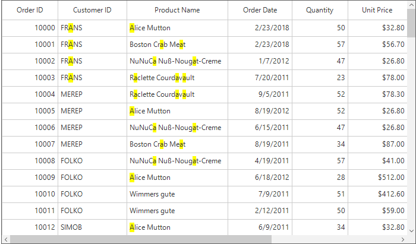
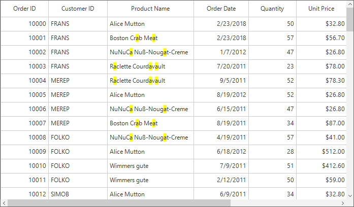
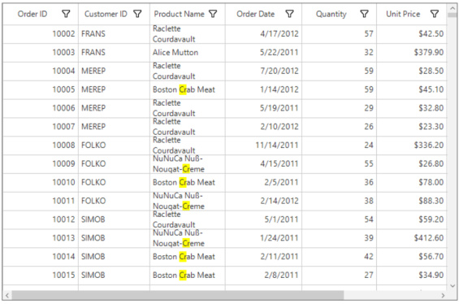
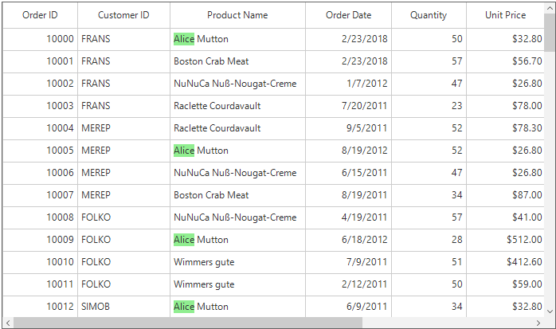
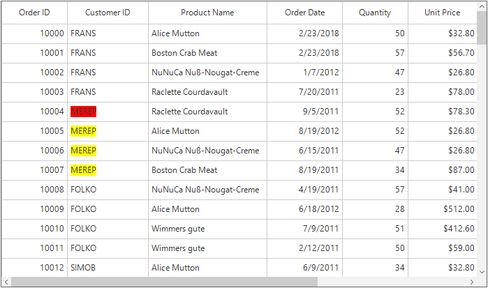
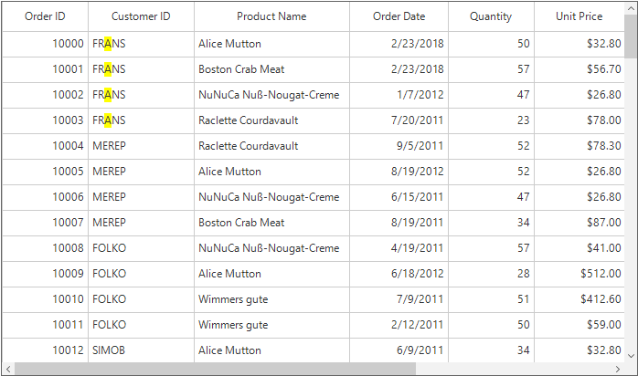

# Search in Windows Forms DataGrid (SfDataGrid)
[Windows Forms DataGrid](https://www.syncfusion.com/winforms-ui-controls/datagrid) (SfDataGrid) provides the support for search the specific string in the SfDataGrid. This can be achieved by using the [SearchController.Search](https://help.syncfusion.com/cr/windowsforms/Syncfusion.WinForms.DataGrid.SearchController.html#Syncfusion_WinForms_DataGrid_SearchController_Search_System_String_) method. The founded matches will be highlighted in the SfDataGrid.



//Search and highlight the text in SfDataGrid.
this.sfDataGrid.SearchController.Search("a");


'Search and highlight the text in SfDataGrid.
Me.sfDataGrid.SearchController.Search("a")



## Filtering
The filtering based on the search text can be enabled by setting the [AllowFiltering](https://help.syncfusion.com/cr/windowsforms/Syncfusion.WinForms.DataGrid.SearchController.html#Syncfusion_WinForms_DataGrid_SearchController_AllowFiltering) property to `true`.



// Enable the filtering using the search text
this.sfDataGrid.SearchController.AllowFiltering = true;

//Search and highlight the text in SfDataGrid.
this.sfDataGrid.SearchController.Search("Alice");


' Enable the filtering using the search text
Me.sfDataGrid.SearchController.AllowFiltering = True

'Search and highlight the text in SfDataGrid.
Me.sfDataGrid.SearchController.Search("Alice")



## Filtering with DataTable

By default, when binding the DataTable collection to SfDataGrid, filtering will not work in searching operation. So, convert the DataTable to Dynamic collection.



public ObservableCollection<ExpandoObject> DynamicOrders
{
    get; set;
}

var collection = GetDataTable();
var dynamicCollection = new ObservableCollection<ExpandoObject>();
foreach (System.Data.DataRow row in collection.Rows)
{
    ExpandoObject expandoObject = new ExpandoObject();
    dynamicCollection.Add(expandoObject);
    foreach (DataColumn column in collection.Columns)
    {
        var dictionary = ((IDictionary<string, object>)(expandoObject));
        dictionary[column.ColumnName] = row[column];
    }
}

DynamicOrders = dynamicCollection;
sfDataGrid1.DataSource = DynamicOrders;


public Property DynamicOrders() As ObservableCollection(Of ExpandoObject)

Dim collection = GetDataTable()
Dim dynamicCollection = New ObservableCollection(Of ExpandoObject)()
For Each row As System.Data.DataRow In collection.Rows
	Dim expandoObject As New ExpandoObject()
	dynamicCollection.Add(expandoObject)
	For Each column As DataColumn In collection.Columns
		Dim dictionary = (CType(expandoObject, IDictionary(Of String, Object)))
		dictionary(column.ColumnName) = row(column)
	Next column
Next row

DynamicOrders = dynamicCollection
sfDataGrid1.DataSource = DynamicOrders



## Case Sensitive Search
The data can be searched with the case-sensitivity by setting the [SearchController.AllowCaseSensitiveSearch](https://help.syncfusion.com/cr/windowsforms/Syncfusion.WinForms.DataGrid.SearchController.html#Syncfusion_WinForms_DataGrid_SearchController_AllowCaseSensitiveSearch) property to `true`.

## Searching wrap text

The wrap text can be searched by using the [SearchController.Search](https://help.syncfusion.com/cr/windowsforms/Syncfusion.WinForms.DataGrid.SearchController.html#Syncfusion_WinForms_DataGrid_SearchController_Search_System_String_) method.



//Enable text wrapping for the column.
this.sfDataGrid1.Columns[2].AllowTextWrapping = true;

//Search and highlight the search text in SfDataGrid.
this.sfDataGrid1.SearchController.Search("cr");


'Enable text wrapping for the column.
Me.sfDataGrid1.Columns(2).AllowTextWrapping = True

'Search and highlight the search text in SfDataGrid.
Me.sfDataGrid1.SearchController.Search("cr")



## Changing Search Highlight Color
The highlighting color of the search text can be changed by using the [SearchColor](https://help.syncfusion.com/cr/windowsforms/Syncfusion.WinForms.DataGrid.SearchController.html#Syncfusion_WinForms_DataGrid_SearchController_SearchColor) property.


//Set the color for highlighting the search text
this.sfDataGrid.SearchController.SearchColor = Color.LightGreen;


'Set the color for highlighting the search text
Me.sfDataGrid.SearchController.SearchColor = Color.LightGreen



## Disable Highlighting Search Text
The highlighting of the search text can be disabled by setting the [AllowHighlightSearchText](https://help.syncfusion.com/cr/windowsforms/Syncfusion.WinForms.DataGrid.SearchController.html#Syncfusion_WinForms_DataGrid_SearchController_AllowHighlightSearchText) property to `false`.



//Disable the highlighting of the search text
this.sfDataGrid.SearchController.AllowHighlightSearchText = false;

//Search and filter without highlighting the search text.
this.sfDataGrid.SearchController.AllowFiltering = true;
this.sfDataGrid.SearchController.Search("SEVES");


'Disable the highlighting of the search text
Me.sfDataGrid.SearchController.AllowHighlightSearchText = False

'Search and filter without highlighting the search text.
Me.sfDataGrid.SearchController.AllowFiltering = True
Me.sfDataGrid.SearchController.Search("SEVES")



## Search only in Selected Columns
By default the searching is applied for all the columns in the SfDataGrid. This can be changed to search only in the specified columns by using the [SearchColumns](https://help.syncfusion.com/cr/windowsforms/Syncfusion.WinForms.DataGrid.SearchController.html#Syncfusion_WinForms_DataGrid_SearchController_SearchColumns) collection. The column names added to the SearchColumns list is only consider for the search operations.



// Search only in Quantity column
this.sfDataGrid.SearchController.SearchColumns.Add("Quantity");
this.sfDataGrid.SearchController.Search("2");


' Search only in Quantity column
Me.sfDataGrid.SearchController.SearchColumns.Add("Quantity")
Me.sfDataGrid.SearchController.Search("2")



## Search Condition
By default the searching will be performed based on the `Contains` condition. This can be changed by using the [SearchType](https://help.syncfusion.com/cr/windowsforms/Syncfusion.WinForms.DataGrid.SearchController.html#Syncfusion_WinForms_DataGrid_SearchController_SearchType) property. The `SearchType` enumeration has the following conditions,

* StartsWith – Used to find the text which starts with the SearchText.
* EndsWith – Used to find the text which ends with the SearchText.
* Contains – Used to find the text which contains the SearchText.

## Navigating based on Search Text
The cells which contains the SearchText can be navigated by using the [SearchController.FindNext](https://help.syncfusion.com/cr/windowsforms/Syncfusion.WinForms.DataGrid.SearchController.html#Syncfusion_WinForms_DataGrid_SearchController_FindNext_System_String_) and [SearchController.FindPrevious](https://help.syncfusion.com/cr/windowsforms/Syncfusion.WinForms.DataGrid.SearchController.html#Syncfusion_WinForms_DataGrid_SearchController_FindPrevious_System_String_) methods.



// Find the next match and highlight using the HighlightSearchColor.
this.sfDataGrid.SearchController.FindNext("Alice");

// Find the previous match and highlight using the HighlightSearchColor.
this.sfDataGrid.SearchController.FindPrevious("Alice");


' Find the next match and highlight using the HighlightSearchColor.
Me.sfDataGrid.SearchController.FindNext("Alice")

' Find the previous match and highlight using the HighlightSearchColor.
Me.sfDataGrid.SearchController.FindPrevious("Alice")



By default the currently navigated search text will be highlighted with the default color. This can be changed by using the [SearchHighlightColor](https://help.syncfusion.com/cr/windowsforms/Syncfusion.WinForms.DataGrid.SearchController.html#Syncfusion_WinForms_DataGrid_SearchController_SearchHighlightColor) property.



this.sfDataGrid.SearchController.SearchHighlightColor = Color.Red;
// Find the next match and highlight using the HighlightSearchColor.
this.sfDataGrid.SearchController.FindNext("MEREP");


Me.sfDataGrid.SearchController.SearchHighlightColor = Color.Red
' Find the next match and highlight using the HighlightSearchColor.
Me.sfDataGrid.SearchController.FindNext("MEREP")



### Move Current Cell to the Next Match
The current cell can be moved to the next possible match by using the [SearchController.CurrentRowColumnIndex](https://help.syncfusion.com/cr/windowsforms/Syncfusion.WinForms.DataGrid.SearchController.html#Syncfusion_WinForms_DataGrid_SearchController_CurrentRowColumnIndex) property.



// Find the next match and highlight using the HighlightSearchColor.
this.sfDataGrid.SearchController.FindNext("MEREP");

// Moves the current cell to the next possible match.
this.sfDataGrid.MoveToCurrentCell(this.sfDataGrid.SearchController.CurrentRowColumnIndex);


' Find the next match and highlight using the HighlightSearchColor.
Me.sfDataGrid.SearchController.FindNext("MEREP")

' Moves the current cell to the next possible match.
Me.sfDataGrid.MoveToCurrentCell(Me.sfDataGrid.SearchController.CurrentRowColumnIndex)



## Clear Search
The search can be cleared by using the [ClearSearch](https://help.syncfusion.com/cr/windowsforms/Syncfusion.WinForms.DataGrid.SearchController.html#Syncfusion_WinForms_DataGrid_SearchController_ClearSearch) method.



// Clears the search applied by using the search controller.
this.sfDataGrid.SearchController.ClearSearch();


' Clears the search applied by using the search controller.
Me.sfDataGrid.SearchController.ClearSearch()



## Search Customization 
SfDataGrid process the search operations in [SearchController](https://help.syncfusion.com/cr/windowsforms/Syncfusion.WinForms.DataGrid.SearchController.html) class. The default search behaviors can be customized by overriding the `SearchController` class and set to `SfDataGrid.SearchController` property.



public class SearchControllerExt : SearchController
{
    public SearchControllerExt(SfDataGrid grid) :
        base(grid)
    { }
    protected override void HighlightSearchText(Graphics paint, DataColumnBase column, CellStyleInfo style, Rectangle bounds, string cellValue, RowColumnIndex rowColumnIndex)
    {
        //Does not highlight the search text the specific column
        if (column.GridColumn.MappingName == "ProductName")
            return;
        base.HighlightSearchText(paint, column, style, bounds, cellValue, rowColumnIndex);
    }
}


Public Class SearchControllerExt
	Inherits SearchController
	Public Sub New(ByVal grid As SfDataGrid)
		MyBase.New(grid)
	End Sub

	Protected Overrides Sub HighlightSearchText(ByVal paint As Graphics, ByVal column As DataColumnBase, ByVal style As CellStyleInfo, ByVal bounds As Rectangle, ByVal cellValue As String, ByVal rowColumnIndex As RowColumnIndex)
		'Does not highlight the search text the specific column
		If column.GridColumn.MappingName = "ProductName" Then
			Return
		End If

		MyBase.HighlightSearchText(paint, column, style, bounds, cellValue, rowColumnIndex)
	End Sub
End Class



## See also

[How to search and select record in WinForms DataGrid (SfDataGrid)](https://support.syncfusion.com/kb/article/8552/how-to-search-and-select-record-in-winforms-datagrid-sfdatagrid)
