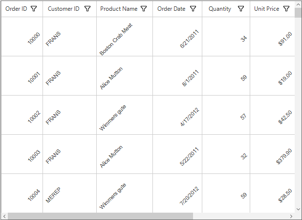
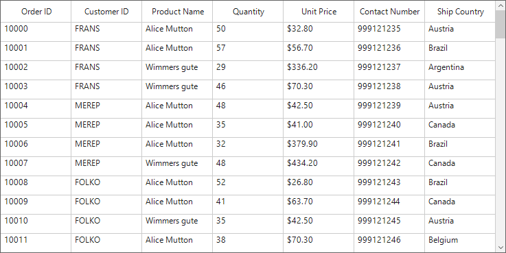
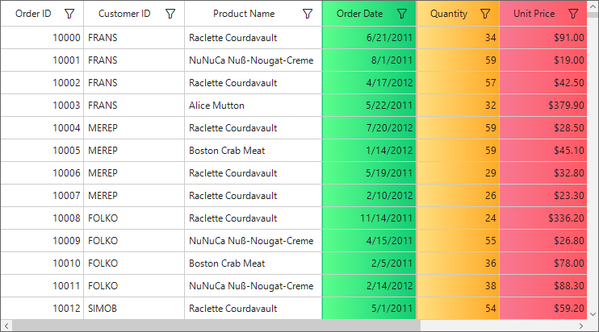
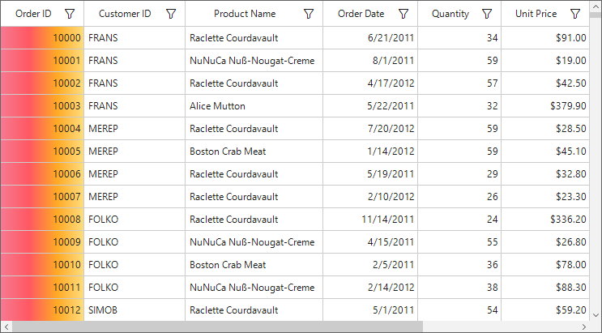
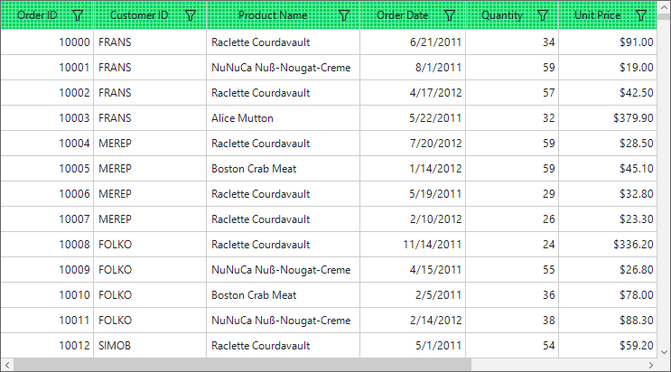
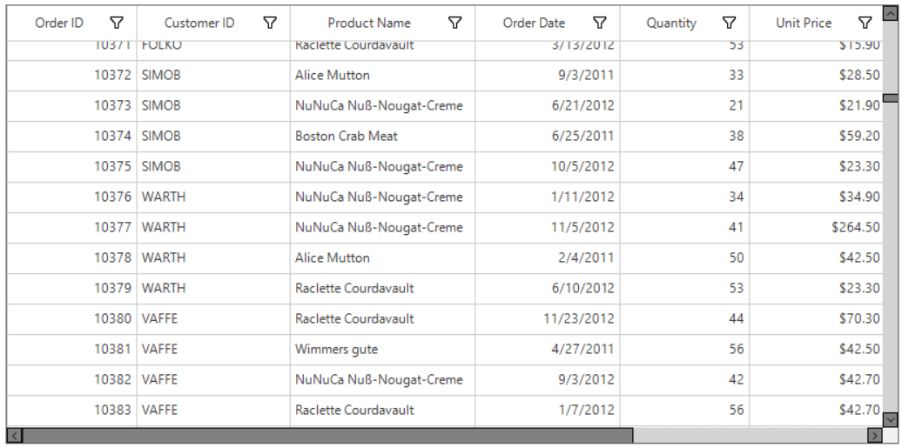
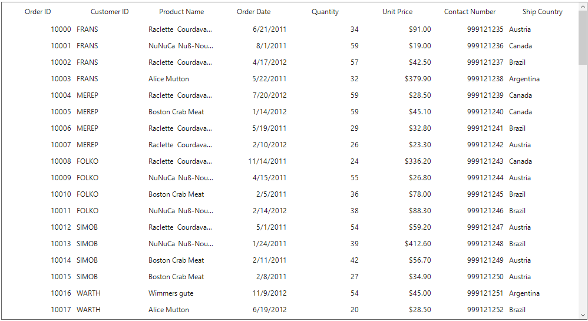
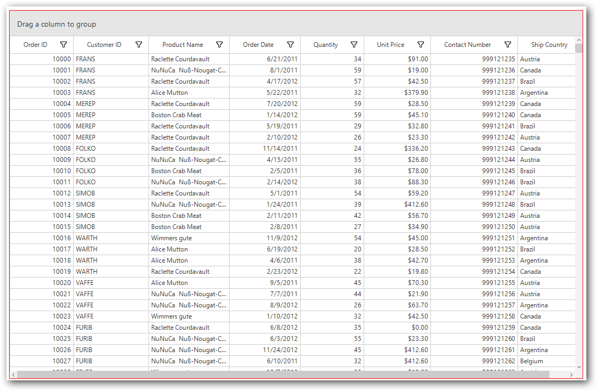

# Styles in Windows Forms DataGrid (SfDataGrid)

## Styling Record Cell

Appearance of the record cells can be customized by using the [CellStyle](https://help.syncfusion.com/cr/windowsforms/Syncfusion.WinForms.DataGrid.Styles.DataGridStyle.html#Syncfusion_WinForms_DataGrid_Styles_DataGridStyle_CellStyle) property.



this.sfDataGrid1.Style.CellStyle.BackColor = Color.AliceBlue;
this.sfDataGrid1.Style.CellStyle.TextColor = Color.DarkBlue;


Me.sfDataGrid1.Style.CellStyle.BackColor = Color.AliceBlue
Me.sfDataGrid1.Style.CellStyle.TextColor = Color.DarkBlue



Appearance of the record cells of a particular column can be customized by using the [GridColumnBase.CellStyle](https://help.syncfusion.com/cr/windowsforms/Syncfusion.WinForms.DataGrid.GridColumnBase.html#Syncfusion_WinForms_DataGrid_GridColumnBase_CellStyle) property.



this.sfDataGrid1.Columns["ProductName"].CellStyle.BackColor = Color.PaleTurquoise;
this.sfDataGrid1.Columns["ProductName"].CellStyle.TextColor = Color.DarkRed;


Me.sfDataGrid1.Columns("ProductName").CellStyle.BackColor = Color.PaleTurquoise
Me.sfDataGrid1.Columns("ProductName").CellStyle.TextColor = Color.DarkRed



Font orientation of the record cells can be set by using the [CellStyle.Font.Orientation](https://help.syncfusion.com/cr/windowsforms/Syncfusion.WinForms.DataGrid.Styles.DataGridStyle.html#Syncfusion_WinForms_DataGrid_Styles_DataGridStyle_CellStyle) property.



this.sfDataGrid1.RowHeight = 80;
this.sfDataGrid1.Style.CellStyle.Font.Orientation = 45;


Me.sfDataGrid1.RowHeight = 80
Me.sfDataGrid1.Style.CellStyle.Font.Orientation = 45



The text alignment of the record cells can be changed by using [CellStyle.HorizontalAlignment](https://help.syncfusion.com/cr/windowsforms/Syncfusion.WinForms.DataGrid.Styles.CellStyleInfo.html#Syncfusion_WinForms_DataGrid_Styles_CellStyleInfo_HorizontalAlignment) and [CellStyle.VerticalAlignment](https://help.syncfusion.com/cr/windowsforms/Syncfusion.WinForms.DataGrid.Styles.CellStyleInfo.html#Syncfusion_WinForms_DataGrid_Styles_CellStyleInfo_VerticalAlignment) properties respectively.  



//Change alignment for the record cells.
this.sfDataGrid1.Style.CellStyle.HorizontalAlignment = HorizontalAlignment.Left;
this.sfDataGrid1.Style.CellStyle.VerticalAlignment = System.Windows.Forms.VisualStyles.VerticalAlignment.Top;



'Change alignment for the record cells.
Me.sfDataGrid1.Style.CellStyle.HorizontalAlignment = HorizontalAlignment.Left
Me.sfDataGrid1.Style.CellStyle.VerticalAlignment = System.Windows.Forms.VisualStyles.VerticalAlignment.Top




The text alignment for the record cells in a specific column can be changed by using by using [GridColumnBase.CellStyle.HorizontalAlignment](https://help.syncfusion.com/cr/windowsforms/Syncfusion.WinForms.DataGrid.Styles.CellStyleInfo.html#Syncfusion_WinForms_DataGrid_Styles_CellStyleInfo_HorizontalAlignment) and [GridColumnBase.CellStyle.VerticalAlignment](https://help.syncfusion.com/cr/windowsforms/Syncfusion.WinForms.DataGrid.Styles.CellStyleInfo.html#Syncfusion_WinForms_DataGrid_Styles_CellStyleInfo_VerticalAlignment) properties.

N>[GridColumnBase.CellStyle](https://help.syncfusion.com/cr/windowsforms/Syncfusion.WinForms.DataGrid.GridColumnBase.html#Syncfusion_WinForms_DataGrid_GridColumnBase_CellStyle) has higher priority than [SfDataGrid.Style.CellStyle](https://help.syncfusion.com/cr/windowsforms/Syncfusion.WinForms.DataGrid.Styles.DataGridStyle.html#Syncfusion_WinForms_DataGrid_Styles_DataGridStyle_CellStyle).

## Styling Column Header
Appearance of the column headers can be customized by using the [HeaderStyle](https://help.syncfusion.com/cr/windowsforms/Syncfusion.WinForms.DataGrid.Styles.DataGridStyle.html#Syncfusion_WinForms_DataGrid_Styles_DataGridStyle_HeaderStyle) property.
For more details, refer to `Appearance` in [Header Row](https://help.syncfusion.com/windowsforms/datagrid/rows#header-row) section.

## Styling Stacked Header
Appearance of the stacked headers can be customized by the [StackedHeaderStyle](https://help.syncfusion.com/cr/windowsforms/Syncfusion.WinForms.DataGrid.Styles.DataGridStyle.html#Syncfusion_WinForms_DataGrid_Styles_DataGridStyle_StackedHeaderStyle) property.
For more details, refer to `Appearance` in [Stacked Headers](https://help.syncfusion.com/windowsforms/datagrid/columns#stacked-headers) section.

## Styling CaptionSummary
Appearance of the caption summary can be customized by using the [CaptionSummaryRowStyle](https://help.syncfusion.com/cr/windowsforms/Syncfusion.WinForms.DataGrid.Styles.DataGridStyle.html#Syncfusion_WinForms_DataGrid_Styles_DataGridStyle_CaptionSummaryRowStyle) property.
For more details, refer to `Appearance` in [Caption Summary](https://help.syncfusion.com/windowsforms/datagrid/summaries#caption-summary) section.

## Styling GroupSummary
Appearance of the group summary can be customized by using the [GroupSummaryRowStyle](https://help.syncfusion.com/cr/windowsforms/Syncfusion.WinForms.DataGrid.Styles.DataGridStyle.html#Syncfusion_WinForms_DataGrid_Styles_DataGridStyle_GroupSummaryRowStyle) property.
For more details, refer to `Appearance` in [Group Summary](https://help.syncfusion.com/windowsforms/datagrid/summaries#group-summary) section.

## Styling TableSummary
Appearance of the table summary can be customized by using the [TableSummaryRowStyle](https://help.syncfusion.com/cr/windowsforms/Syncfusion.WinForms.DataGrid.Styles.DataGridStyle.html#Syncfusion_WinForms_DataGrid_Styles_DataGridStyle_TableSummaryRowStyle) property.
For more details, refer to `Appearance` in [Table Summary](https://help.syncfusion.com/windowsforms/datagrid/summaries#table-summary) section.

## Gradient Background Style

SfDataGrid helps to provide gradient background appearance for the cells by using [Interior](https://help.syncfusion.com/cr/windowsforms/Syncfusion.WinForms.DataGrid.Styles.CellStyleInfo.html#Syncfusion_WinForms_DataGrid_Styles_CellStyleInfo_Interior) property which is available in the StyleInfo properties of all the elements in the SfDataGrid.

The gradient  background can be achieved by initializing the `Interior` property using [BrushInfo](https://help.syncfusion.com/cr/windowsforms/Syncfusion.Drawing.BrushInfo.html#Syncfusion_Drawing_BrushInfo__ctor) object with [GradientStyle](https://help.syncfusion.com/cr/windowsforms/Syncfusion.Drawing.GradientStyle.html) and the necessary colors.

In the below example, gradient background is applied for the header cells and the record cells by providing the `GradientStyle` as `Horizontal` and the gradient start and end colors.



this.sfDataGrid1.Columns["OrderDate"].HeaderStyle.Interior = new Syncfusion.WinForms.Core.BrushInfo(GradientStyle.Horizontal, ColorTranslator.FromHtml("#5aff8d"), ColorTranslator.FromHtml("#12cb74"));
this.sfDataGrid1.Columns["Quantity"].HeaderStyle.Interior = new Syncfusion.WinForms.Core.BrushInfo(GradientStyle.Horizontal, ColorTranslator.FromHtml("#FFDF80"), ColorTranslator.FromHtml("#FFA925"));
this.sfDataGrid1.Columns["UnitPrice"].HeaderStyle.Interior = new Syncfusion.WinForms.Core.BrushInfo(GradientStyle.Horizontal, ColorTranslator.FromHtml("#f77891"), ColorTranslator.FromHtml("#ff5862"));

this.sfDataGrid1.Columns["OrderDate"].CellStyle.Interior = new Syncfusion.WinForms.Core.BrushInfo(GradientStyle.Horizontal, ColorTranslator.FromHtml("#5aff8d"), ColorTranslator.FromHtml("#12cb74"));
this.sfDataGrid1.Columns["Quantity"].CellStyle.Interior = new Syncfusion.WinForms.Core.BrushInfo(GradientStyle.Horizontal, ColorTranslator.FromHtml("#FFDF80"), ColorTranslator.FromHtml("#FFA925"));
this.sfDataGrid1.Columns["UnitPrice"].CellStyle.Interior = new Syncfusion.WinForms.Core.BrushInfo(GradientStyle.Horizontal, ColorTranslator.FromHtml("#f77891"), ColorTranslator.FromHtml("#ff5862"));


Me.sfDataGrid1.Columns("OrderDate").HeaderStyle.Interior = New Syncfusion.WinForms.Core.BrushInfo(GradientStyle.Horizontal, ColorTranslator.FromHtml("#5aff8d"), ColorTranslator.FromHtml("#12cb74"))
Me.sfDataGrid1.Columns("Quantity").HeaderStyle.Interior = New Syncfusion.WinForms.Core.BrushInfo(GradientStyle.Horizontal, ColorTranslator.FromHtml("#FFDF80"), ColorTranslator.FromHtml("#FFA925"))
Me.sfDataGrid1.Columns("UnitPrice").HeaderStyle.Interior = New Syncfusion.WinForms.Core.BrushInfo(GradientStyle.Horizontal, ColorTranslator.FromHtml("#f77891"), ColorTranslator.FromHtml("#ff5862"))

Me.sfDataGrid1.Columns("OrderDate").CellStyle.Interior = New Syncfusion.WinForms.Core.BrushInfo(GradientStyle.Horizontal, ColorTranslator.FromHtml("#5aff8d"), ColorTranslator.FromHtml("#12cb74"))
Me.sfDataGrid1.Columns("Quantity").CellStyle.Interior = New Syncfusion.WinForms.Core.BrushInfo(GradientStyle.Horizontal, ColorTranslator.FromHtml("#FFDF80"), ColorTranslator.FromHtml("#FFA925"))
Me.sfDataGrid1.Columns("UnitPrice").CellStyle.Interior = New Syncfusion.WinForms.Core.BrushInfo(GradientStyle.Horizontal, ColorTranslator.FromHtml("#f77891"), ColorTranslator.FromHtml("#ff5862"))



In the below example, gradient background is applied for the record cells by providing multiple gradient colors using [BrushInfoColorList](https://help.syncfusion.com/cr/windowsforms/Syncfusion.WinForms.Core.BrushInfoColorList.html).



this.sfDataGrid1.Columns["OrderID"].CellStyle.Interior = new Syncfusion.WinForms.Core.BrushInfo(GradientStyle.Horizontal, 
new Syncfusion.WinForms.Core.BrushInfoColorList(new Color[] { ColorTranslator.FromHtml("#FFDF80"), ColorTranslator.FromHtml("#FFA925"),
ColorTranslator.FromHtml("#ff5862"),ColorTranslator.FromHtml("#f77891")}));


Me.sfDataGrid1.Columns("OrderID").CellStyle.Interior = New Syncfusion.WinForms.Core.BrushInfo(GradientStyle.Horizontal, New Syncfusion.WinForms.Core.BrushInfoColorList(New Color() { ColorTranslator.FromHtml("#FFDF80"), ColorTranslator.FromHtml("#FFA925"), ColorTranslator.FromHtml("#ff5862"),ColorTranslator.FromHtml("#f77891")}))



## Pattern Background Style

SfDataGrid helps to provide background pattern for the cells by using [Interior](https://help.syncfusion.com/cr/windowsforms/Syncfusion.WinForms.DataGrid.Styles.CellStyleInfo.html#Syncfusion_WinForms_DataGrid_Styles_CellStyleInfo_Interior) property which is available in the StyleInfo properties of all the elements in the SfDataGrid.

The background pattern can be achieved by initializing the `Interior` property using [BrushInfo](https://help.syncfusion.com/cr/windowsforms/Syncfusion.Drawing.BrushInfo.html#Syncfusion_Drawing_BrushInfo__ctor) object with [PatternStyle](https://help.syncfusion.com/cr/windowsforms/Syncfusion.Drawing.PatternStyle.html) and the necessary colors.

In the below example, background pattern is applied for the header cells by providing the `PatternStyle` as `SmallGrid` and the fore color and back color for the pattern.



this.sfDataGrid1.Style.HeaderStyle.Interior = new Syncfusion.WinForms.Core.BrushInfo(PatternStyle.SmallGrid, ColorTranslator.FromHtml("#5aff8d"), ColorTranslator.FromHtml("#12cb74"));


Me.sfDataGrid1.Style.HeaderStyle.Interior = New Syncfusion.WinForms.Core.BrushInfo(PatternStyle.SmallGrid, ColorTranslator.FromHtml("#5aff8d"), ColorTranslator.FromHtml("#12cb74"))



## Styling UnboundRows
Appearance of the unbound rows can be customized by using the [UnboundRowStyle](https://help.syncfusion.com/cr/windowsforms/Syncfusion.WinForms.DataGrid.Styles.DataGridStyle.html#Syncfusion_WinForms_DataGrid_Styles_DataGridStyle_UnboundRowStyle) property.
For more details, refer to `Appearance` in [Unbound Rows](https://help.syncfusion.com/windowsforms/datagrid/unboundrow) section.

## Styling AddNewRow
Appearance of the AddNewRow can be customized by using the [AddNewRowStyle](https://help.syncfusion.com/cr/windowsforms/Syncfusion.WinForms.DataGrid.Styles.DataGridStyle.html#Syncfusion_WinForms_DataGrid_Styles_DataGridStyle_AddNewRowStyle) property.
For more details, refer to `Appearance` in [AddNewRow](https://help.syncfusion.com/windowsforms/datagrid/datamanipulation#addnewrow ) section.

## Styling RowHeader
Appearance of a row header can be customized by using the [RowHeaderStyle](https://help.syncfusion.com/cr/windowsforms/Syncfusion.WinForms.DataGrid.Styles.DataGridStyle.html#Syncfusion_WinForms_DataGrid_Styles_DataGridStyle_RowHeaderStyle) property.
For more details, refer to `Appearance` in [Row Header](https://help.syncfusion.com/windowsforms/datagrid/rows#row-header) section.

## Styling FilterRow
Appearance of a filter row can be customized by using the [FilterRowStyle](https://help.syncfusion.com/cr/windowsforms/Syncfusion.WinForms.DataGrid.Styles.DataGridStyle.html#Syncfusion_WinForms_DataGrid_Styles_DataGridStyle_FilterRowStyle) property.
For more details, refer to `Appearance` in [Filter Row](https://help.syncfusion.com/windowsforms/datagrid/filterrow#appearance) section.

## Styling Scrollbars
Appearance of the vertical scrollbar can be customized by using the [VerticalScrollBar](https://help.syncfusion.com/cr/windowsforms/Syncfusion.WinForms.Controls.Styles.ScrollerVisualStyle.html#Syncfusion_WinForms_Controls_Styles_ScrollerVisualStyle_VerticalScrollBar) property.



//Sets the back color of the vertical scrollbar arrow button.
this.sfDataGrid1.Style.VerticalScrollBar.ArrowButtonBackColor = Color.Gray;
this.sfDataGrid1.Style.VerticalScrollBar.ArrowButtonHoverBackColor = Color.White;
this.sfDataGrid1.Style.VerticalScrollBar.ArrowButtonPressedBackColor = Color.Blue;

//Sets the fore color of the vertical scrollbar arrow button.
this.sfDataGrid1.Style.VerticalScrollBar.ArrowButtonForeColor = Color.Black;
this.sfDataGrid1.Style.VerticalScrollBar.ArrowButtonHoverForeColor = Color.Black;
this.sfDataGrid1.Style.VerticalScrollBar.ArrowButtonPressedForeColor = Color.Gray;
this.sfDataGrid1.Style.VerticalScrollBar.ArrowButtonBorderColor = Color.Black;

// Sets the style properties of the thumb.
this.sfDataGrid1.Style.VerticalScrollBar.ThumbColor = Color.Gray;
this.sfDataGrid1.Style.VerticalScrollBar.ThumbHoverColor = Color.Black;
this.sfDataGrid1.Style.VerticalScrollBar.ThumbPressedColor = Color.Blue;
this.sfDataGrid1.Style.VerticalScrollBar.ThumbBorderColor = Color.Black;

// Sets the back color of the vertical scrollbar.
this.sfDataGrid1.Style.VerticalScrollBar.ScrollBarBackColor = Color.LightGray;


'Sets the back color of the vertical scrollbar arrow button.
Me.sfDataGrid1.Style.VerticalScrollBar.ArrowButtonBackColor = Color.Gray
Me.sfDataGrid1.Style.VerticalScrollBar.ArrowButtonHoverBackColor = Color.White
Me.sfDataGrid1.Style.VerticalScrollBar.ArrowButtonPressedBackColor = Color.Blue

'Sets the fore color of the vertical scrollbar arrow button.
Me.sfDataGrid1.Style.VerticalScrollBar.ArrowButtonForeColor = Color.Black
Me.sfDataGrid1.Style.VerticalScrollBar.ArrowButtonHoverForeColor = Color.Black
Me.sfDataGrid1.Style.VerticalScrollBar.ArrowButtonPressedForeColor = Color.Gray
Me.sfDataGrid1.Style.VerticalScrollBar.ArrowButtonBorderColor = Color.Black

' Sets the style properties of the thumb.
Me.sfDataGrid1.Style.VerticalScrollBar.ThumbColor = Color.Gray
Me.sfDataGrid1.Style.VerticalScrollBar.ThumbHoverColor = Color.Black
Me.sfDataGrid1.Style.VerticalScrollBar.ThumbPressedColor = Color.Blue
Me.sfDataGrid1.Style.VerticalScrollBar.ThumbBorderColor = Color.Black

' Sets the back color of the vertical scrollbar.
Me.sfDataGrid1.Style.VerticalScrollBar.ScrollBarBackColor = Color.LightGray



Appearance of the horizontal scrollbar can be customized by using the [HorizontalScrollBar](https://help.syncfusion.com/cr/windowsforms/Syncfusion.WinForms.Controls.Styles.ScrollerVisualStyle.html#Syncfusion_WinForms_Controls_Styles_ScrollerVisualStyle_HorizontalScrollBar) property.



//Sets the back color of the horizontal scrollbar arrow button.
this.sfDataGrid1.Style.HorizontalScrollBar.ArrowButtonBackColor = Color.Gray;
this.sfDataGrid1.Style.HorizontalScrollBar.ArrowButtonHoverBackColor = Color.White;
this.sfDataGrid1.Style.HorizontalScrollBar.ArrowButtonPressedBackColor = Color.Blue;

//Sets the fore color of the horizontal scrollbar arrow button.
this.sfDataGrid1.Style.HorizontalScrollBar.ArrowButtonForeColor = Color.Black;
this.sfDataGrid1.Style.HorizontalScrollBar.ArrowButtonHoverForeColor = Color.Black;
this.sfDataGrid1.Style.HorizontalScrollBar.ArrowButtonPressedForeColor = Color.Gray;
this.sfDataGrid1.Style.HorizontalScrollBar.ArrowButtonBorderColor = Color.Black;

// Sets the style properties of the thumb.
this.sfDataGrid1.Style.HorizontalScrollBar.ThumbColor = Color.Gray;
this.sfDataGrid1.Style.HorizontalScrollBar.ThumbHoverColor = Color.Black;
this.sfDataGrid1.Style.HorizontalScrollBar.ThumbPressedColor = Color.Blue;
this.sfDataGrid1.Style.HorizontalScrollBar.ThumbBorderColor = Color.Black;

// Sets the back color of the horizontal scrollbar.
this.sfDataGrid1.Style.HorizontalScrollBar.ScrollBarBackColor = Color.LightGray;


'Sets the back color of the horizontal scrollbar arrow button.
Me.sfDataGrid1.Style.HorizontalScrollBar.ArrowButtonBackColor = Color.Gray
Me.sfDataGrid1.Style.HorizontalScrollBar.ArrowButtonHoverBackColor = Color.White
Me.sfDataGrid1.Style.HorizontalScrollBar.ArrowButtonPressedBackColor = Color.Blue

'Sets the fore color of the horizontal scrollbar arrow button.
Me.sfDataGrid1.Style.HorizontalScrollBar.ArrowButtonForeColor = Color.Black
Me.sfDataGrid1.Style.HorizontalScrollBar.ArrowButtonHoverForeColor = Color.Black
Me.sfDataGrid1.Style.HorizontalScrollBar.ArrowButtonPressedForeColor = Color.Gray
Me.sfDataGrid1.Style.HorizontalScrollBar.ArrowButtonBorderColor = Color.Black

' Sets the style properties of the thumb.
Me.sfDataGrid1.Style.HorizontalScrollBar.ThumbColor = Color.Gray
Me.sfDataGrid1.Style.HorizontalScrollBar.ThumbHoverColor = Color.Black
Me.sfDataGrid1.Style.HorizontalScrollBar.ThumbPressedColor = Color.Blue
Me.sfDataGrid1.Style.HorizontalScrollBar.ThumbBorderColor = Color.Black

' Sets the back color of the horizontal scrollbar.
Me.sfDataGrid1.Style.HorizontalScrollBar.ScrollBarBackColor = Color.LightGray



## Styling GroupDropArea
Appearance of the GroupDropArea can be customized by using the [GroupDropAreaStyle](https://help.syncfusion.com/cr/windowsforms/Syncfusion.WinForms.DataGrid.Styles.DataGridStyle.html#Syncfusion_WinForms_DataGrid_Styles_DataGridStyle_GroupDropAreaStyle)  property.
For more details, refer to `Customizing GroupDropArea Appearance` in [Grouping](https://help.syncfusion.com/windowsforms/datagrid/grouping#groupdroparea-customization) section.

## Styling GroupDropAreaItem
Appearance of the GroupDropAreaItem can be customized by using the [GroupDropAreaItemStyle](https://help.syncfusion.com/cr/windowsforms/Syncfusion.WinForms.DataGrid.Styles.DataGridStyle.html#Syncfusion_WinForms_DataGrid_Styles_DataGridStyle_GroupDropAreaItemStyle) property.
For more details, refer to `Customizing GroupDropAreaItem` Appearance in [Grouping](https://help.syncfusion.com/windowsforms/datagrid/grouping#groupdroparea-customization) section.

## Styling Frozen Rows and Columns
Appearance of the frozen rows and columns can be customized by using the [FreezePaneLineStyle](https://help.syncfusion.com/cr/windowsforms/Syncfusion.WinForms.DataGrid.Styles.DataGridStyle.html#Syncfusion_WinForms_DataGrid_Styles_DataGridStyle_FreezePaneLineStyle) property.
For more details, refer to `Appearance` in [Freeze Panes](https://help.syncfusion.com/windowsforms/datagrid/rows#freeze-panes) section.

## Selection	
Appearance of the selected rows and current cell can be customized by using the [SelectionStyle](https://help.syncfusion.com/cr/windowsforms/Syncfusion.WinForms.DataGrid.Styles.DataGridStyle.html#Syncfusion_WinForms_DataGrid_Styles_DataGridStyle_SelectionStyle) property.
For more details, refer to `Appearance` in [Selection](https://help.syncfusion.com/windowsforms/datagrid/selection#appearance) section.

## Changing the Color and Thickness of the Gridlines
Color and thickness of the grid lines can be changed by using the [Borders](https://help.syncfusion.com/cr/windowsforms/Syncfusion.WinForms.DataGrid.Styles.CellStyleInfo.html#Syncfusion_WinForms_DataGrid_Styles_CellStyleInfo_Borders) property.



this.sfDataGrid1.Style.CellStyle.Borders.All = new GridBorder(Color.DarkBlue, GridBorderWeight.ExtraThick);
this.sfDataGrid1.Style.HeaderStyle.Borders.All = new GridBorder(Color.DarkBlue, GridBorderWeight.ExtraThick);


Me.sfDataGrid1.Style.CellStyle.Borders.All = New GridBorder(Color.DarkBlue, GridBorderWeight.ExtraThick)
Me.sfDataGrid1.Style.HeaderStyle.Borders.All = New GridBorder(Color.DarkBlue, GridBorderWeight.ExtraThick)



## Changing the style of gridlines
The styles for the cell borders can be changed by initializing [GridBorderStyle](https://help.syncfusion.com/cr/windowsforms/Syncfusion.Windows.Forms.Grid.GridBorderStyle.html) in the [Borders](https://help.syncfusion.com/cr/windowsforms/Syncfusion.WinForms.DataGrid.Styles.CellStyleInfo.html#Syncfusion_WinForms_DataGrid_Styles_CellStyleInfo_Borders) property.



this.sfDataGrid1.Style.HeaderStyle.Borders.All = new GridBorder(GridBorderStyle.Dotted, Color.Blue, GridBorderWeight.Thin);
this.sfDataGrid1.Style.CellStyle.Borders.All = new GridBorder(GridBorderStyle.Dotted, Color.Blue, GridBorderWeight.Thin);


Me.sfDataGrid1.Style.HeaderStyle.Borders.All = New GridBorder(GridBorderStyle.Dotted, Color.Blue, GridBorderWeight.Thin)
Me.sfDataGrid1.Style.CellStyle.Borders.All = New GridBorder(GridBorderStyle.Dotted, Color.Blue, GridBorderWeight.Thin)



## Disable the gridlines
The cell borders can be disabled by setting `GridBorderStyle` to `GridBorderStyle.None` in the [Borders](https://help.syncfusion.com/cr/windowsforms/Syncfusion.WinForms.DataGrid.Styles.CellStyleInfo.html#Syncfusion_WinForms_DataGrid_Styles_CellStyleInfo_Borders) property.



this.sfDataGrid1.Style.HeaderStyle.Borders.All = new GridBorder(GridBorderStyle.None);
this.sfDataGrid1.Style.CellStyle.Borders.All = new GridBorder(GridBorderStyle.None);


Me.sfDataGrid1.Style.HeaderStyle.Borders.All = New GridBorder(GridBorderStyle.None)
Me.sfDataGrid1.Style.CellStyle.Borders.All = New GridBorder(GridBorderStyle.None)



## Changing the grid border Color
The grid border color can be changed by using the [Style.BorderColor](https://help.syncfusion.com/cr/windowsforms/Syncfusion.WinForms.DataGrid.Styles.DataGridStyle.html#Syncfusion_WinForms_DataGrid_Styles_DataGridStyle_BorderColor) property



this.sfDataGrid1.Style.BorderStyle = BorderStyle.FixedSingle;
this.sfDataGrid1.Style.BorderColor = Color.Red;


Me.sfDataGrid1.Style.BorderStyle = BorderStyle.FixedSingle
Me.sfDataGrid1.Style.BorderColor = Color.Red



## Showing busy indicator for the data operations

Indication of the data operation performed on the SfDataGrid can be showed with the help of `BusyIndicator` by setting the [ShowBusyIndicator](https://help.syncfusion.com/cr/windowsforms/Syncfusion.WinForms.DataGrid.SfDataGrid.html#Syncfusion_WinForms_DataGrid_SfDataGrid_ShowBusyIndicator) property to `true`. This will display an animated busy indicator image while performing the data operations such as loading large data, sorting, grouping, and filtering.



// To display the busy indicator in the SfDataGrid for the data operations.
this.sfDataGrid1.ShowBusyIndicator = true;


' To display the busy indicator in the SfDataGrid for the data operations.
Me.sfDataGrid1.ShowBusyIndicator = True



### Changing the busy indicator image 

The busy indicator image can be changed by using the [SfDataGrid.Style.BusyIndicatorImage](https://help.syncfusion.com/cr/windowsforms/Syncfusion.WinForms.DataGrid.Styles.DataGridStyle.html#Syncfusion_WinForms_DataGrid_Styles_DataGridStyle_BusyIndicatorImage) property. The image should be in GIF file format. 



sfDataGrid1.Style.BusyIndicatorImage = Image.FromFile(@"../../BusyIndicator.gif");


sfDataGrid1.Style.BusyIndicatorImage = Image.FromFile("../../BusyIndicator.gif")



## See also

[How to apply alternate backcolor for the rows in both parent and child grid in WinForms DataGrid (SfDataGrid)](https://support.syncfusion.com/kb/article/9045/how-to-apply-alternate-backcolor-for-the-rows-in-both-parent-and-child-grid-in-winforms)

[How to change the outermost border color of the WinForms DataGrid (SfDataGrid)](https://support.syncfusion.com/kb/article/7942/how-to-change-the-outermost-border-color-of-the-winforms-datagrid-sfdatagrid)
