# Summaries in Windows Forms DataGrid (SfDataGrid)
SfDataGrid provides support to display the concise information about the data objects using summaries. SfDataGrid provides below three different types of summary rows.

* **Table Summary** – Used to display summary information of table either at top or bottom of SfDataGrid.
* **Group Summary** – Used to display summary information of data objects in each group.
* **Caption Summary** – Used to display summary information in the caption of the group.

Summary rows are represented by using [GridSummaryRow](https://help.syncfusion.com/cr/windowsforms/Syncfusion.WinForms.DataGrid.GridSummaryRow.html) and each `GridSummaryRow` hold summary information of columns in [SummaryColumns](https://help.syncfusion.com/cr/windowsforms/Syncfusion.WinForms.DataGrid.GridSummaryRow.html#Syncfusion_WinForms_DataGrid_GridSummaryRow_SummaryColumns) property. The `SummaryColumns` contains the collection of[GridSummaryColumn](https://help.syncfusion.com/cr/windowsforms/Syncfusion.WinForms.DataGrid.GridSummaryColumn.html) which carries the name of column, format and its summary aggregate type.

## Aggregate Types
The summary aggregate types can be specified by using [GridSummaryColumn.SummaryType](https://help.syncfusion.com/cr/windowsforms/Syncfusion.WinForms.DataGrid.GridSummaryColumn.html#Syncfusion_WinForms_DataGrid_GridSummaryColumn_SummaryType) property and use the built-in function in [GridSummaryColumn.Format](https://help.syncfusion.com/cr/windowsforms/Syncfusion.WinForms.DataGrid.GridSummaryColumn.html#Syncfusion_WinForms_DataGrid_GridSummaryColumn_Format).
The following are the list of predefined aggregate types and its built-in functions.

<table>
<tr>
<td>
{{'**Aggregate Type**'| markdownify }}
</td>
<td>
{{'**Built-in function**'| markdownify }}
</td>
</tr>
<tr>
<td>
CountAggregate
</td>
<td>
Count
</td>
</tr>
<tr>
<td>
Int32Aggregate
</td>
<td>
Count, Max, Min, Average and Sum
</td>
</tr>
<tr>
<td>
DoubleAggregate
</td>
<td>
Count, Max, Min, Average and Sum
</td>
</tr>
<tr>
<td>
Custom
</td>
<td>
Used for custom summaries
</td>
</tr>
</table>

## Table Summary
The table summary calculates the summary value over all the records. SfDataGrid allows to add any number of table summary rows in top and bottom of SfDataGrid. 

### Adding Table Summary
Table summary row can be added in SfDataGrid by adding [GridTableSummaryRow](https://help.syncfusion.com/cr/windowsforms/Syncfusion.WinForms.DataGrid.GridTableSummaryRow.html) to [SfDataGrid.TableSummaryRows](https://help.syncfusion.com/cr/windowsforms/Syncfusion.WinForms.DataGrid.SfDataGrid.html#Syncfusion_WinForms_DataGrid_SfDataGrid_TableSummaryRows) collection.

### Displaying Table Summary for Column
Summary information can  be displayed in the column by setting [GridSummaryRow.ShowSummaryInRow](https://help.syncfusion.com/cr/windowsforms/Syncfusion.WinForms.DataGrid.GridSummaryRow.html#Syncfusion_WinForms_DataGrid_GridSummaryRow_ShowSummaryInRow) to `false` and defining summary columns. To calculate summary based on column you must specify the below properties,

1. [GridSummaryColumn.MappingName](https://help.syncfusion.com/cr/windowsforms/Syncfusion.WinForms.DataGrid.GridSummaryColumn.html#Syncfusion_WinForms_DataGrid_GridSummaryColumn_MappingName) – MappingName of the column (Property name of data object).
2. [GridSummaryColumn.SummaryType](https://help.syncfusion.com/cr/windowsforms/Syncfusion.WinForms.DataGrid.GridSummaryColumn.html#Syncfusion_WinForms_DataGrid_GridSummaryColumn_SummaryType) – SfDataGrid provides different built-in summary calculation functions for various types.
3. [GridSummaryColumn.Format](https://help.syncfusion.com/cr/windowsforms/Syncfusion.WinForms.DataGrid.GridSummaryColumn.html#Syncfusion_WinForms_DataGrid_GridSummaryColumn_Format) – Used to define format string for summary based on support function name’s in specified SummaryType.
In the below code snippet, table summary is defined for `OrderID` column.



GridTableSummaryRow tableSummaryRow1 = new GridTableSummaryRow();
tableSummaryRow1.Name = "TableSummary";
tableSummaryRow1.ShowSummaryInRow = false;
tableSummaryRow1.Position = VerticalPosition.Bottom;

GridSummaryColumn summaryColumn1 = new GridSummaryColumn();
summaryColumn1.Name = "TotalProduct";
summaryColumn1.SummaryType = SummaryType.DoubleAggregate;
summaryColumn1.Format = "Total Product Count : {Sum:c}";
summaryColumn1.MappingName = "ProductName";

tableSummaryRow1.SummaryColumns.Add(summaryColumn1);

this.sfDataGrid1.TableSummaryRows.Add(tableSummaryRow1);


Dim tableSummaryRow1 As New GridTableSummaryRow()
tableSummaryRow1.Name = "TableSummary"
tableSummaryRow1.ShowSummaryInRow = False
tableSummaryRow1.Position = VerticalPosition.Bottom

Dim summaryColumn1 As New GridSummaryColumn()
summaryColumn1.Name = "TotalProduct"
summaryColumn1.SummaryType = SummaryType.DoubleAggregate
summaryColumn1.Format = "Total Product Count : {Sum:c}"
summaryColumn1.MappingName = "ProductName"

tableSummaryRow1.SummaryColumns.Add(summaryColumn1)

Me.sfDataGrid1.TableSummaryRows.Add(tableSummaryRow1)



### Displaying Table Summary for Row
Summary information can be displayed in row by setting [GridSummaryRow.ShowSummaryInRow](https://help.syncfusion.com/cr/windowsforms/Syncfusion.WinForms.DataGrid.GridSummaryRow.html#Syncfusion_WinForms_DataGrid_GridSummaryRow_ShowSummaryInRow) to `true` and defining summary columns. [GridSummaryRow.Title](https://help.syncfusion.com/cr/windowsforms/Syncfusion.WinForms.DataGrid.GridSummaryRow.html#Syncfusion_WinForms_DataGrid_GridSummaryRow_Title) must set based on [GridSummaryColumn.Name](https://help.syncfusion.com/cr/windowsforms/Syncfusion.WinForms.DataGrid.GridSummaryColumn.html#Syncfusion_WinForms_DataGrid_GridSummaryColumn_Name) property to format summary columns values in row.


GridTableSummaryRow tableSummaryRow1 = new GridTableSummaryRow();
tableSummaryRow1.Name = "TableSummary";
tableSummaryRow1.ShowSummaryInRow = true;
tableSummaryRow1.Title = " Total Product Count: {TotalProduct}";
tableSummaryRow1.Position = VerticalPosition.Bottom;

GridSummaryColumn summaryColumn1 = new GridSummaryColumn();
summaryColumn1.Name = "TotalProduct";
summaryColumn1.SummaryType = SummaryType.DoubleAggregate;
summaryColumn1.Format = "{Count}";
summaryColumn1.MappingName = "ProductName";

tableSummaryRow1.SummaryColumns.Add(summaryColumn1);

this.sfDataGrid1.TableSummaryRows.Add(tableSummaryRow1);


Dim tableSummaryRow1 As New GridTableSummaryRow()
tableSummaryRow1.Name = "TableSummary"
tableSummaryRow1.ShowSummaryInRow = True
tableSummaryRow1.Title = " Total Product Count: {TotalProduct}"
tableSummaryRow1.Position = VerticalPosition.Bottom

Dim summaryColumn1 As New GridSummaryColumn()
summaryColumn1.Name = "TotalProduct"
summaryColumn1.SummaryType = SummaryType.DoubleAggregate
summaryColumn1.Format = "{Count}"
summaryColumn1.MappingName = "ProductName"

tableSummaryRow1.SummaryColumns.Add(summaryColumn1)

Me.sfDataGrid1.TableSummaryRows.Add(tableSummaryRow1)



N> [GridSummaryRow.Title](https://help.syncfusion.com/cr/windowsforms/Syncfusion.WinForms.DataGrid.GridSummaryRow.html#Syncfusion_WinForms_DataGrid_GridSummaryRow_Title) must be specified if [GridSummaryRow.ShowSummaryInRow](https://help.syncfusion.com/cr/windowsforms/Syncfusion.WinForms.DataGrid.GridSummaryRow.html#Syncfusion_WinForms_DataGrid_GridSummaryRow_ShowSummaryInRow) is enabled.

### Positioning Table Summary Row
The Table summary can be positioned either at top or bottom of `SfDataGrid` by setting [GridTableSummaryRow.Position](https://help.syncfusion.com/cr/windowsforms/Syncfusion.WinForms.DataGrid.GridTableSummaryRow.html#Syncfusion_WinForms_DataGrid_GridTableSummaryRow_Position) property.



// Creates the TableSummaryRow.
GridTableSummaryRow tableSummaryRow1 = new GridTableSummaryRow();
tableSummaryRow1.Name = "TableSummary1";
tableSummaryRow1.ShowSummaryInRow = true;
tableSummaryRow1.Title = " Total Product Count: {ProductName}";
tableSummaryRow1.Position = VerticalPosition.Top;

GridTableSummaryRow tableSummaryRow2 = new GridTableSummaryRow();
tableSummaryRow2.Name = "TableSummary2";
tableSummaryRow2.ShowSummaryInRow = true;
tableSummaryRow2.Title = " Total Product Count: {ProductName}";
tableSummaryRow2.Position = VerticalPosition.Bottom;

// Creates the GridSummaryColumn.
GridSummaryColumn summaryColumn1 = new GridSummaryColumn();
summaryColumn1.Name = "TotalProduct";
summaryColumn1.SummaryType = SummaryType.DoubleAggregate;
summaryColumn1.Format = "{Count:c}";
summaryColumn1.MappingName = "ProductName";

// Adds the GridSummaryColumn in the SummaryColumns collection.
tableSummaryRow1.SummaryColumns.Add(summaryColumn1);
tableSummaryRow2.SummaryColumns.Add(summaryColumn1);

// Adds the GridTableSummaryRow in the TableSummaryRows collection.
this.sfDataGrid1.TableSummaryRows.Add(tableSummaryRow1);
this.sfDataGrid1.TableSummaryRows.Add(tableSummaryRow2);


' Creates the TableSummaryRow.
Dim tableSummaryRow1 As New GridTableSummaryRow()
tableSummaryRow1.Name = "TableSummary1"
tableSummaryRow1.ShowSummaryInRow = True
tableSummaryRow1.Title = " Total Product Count: {ProductName}"
tableSummaryRow1.Position = VerticalPosition.Top

Dim tableSummaryRow2 As New GridTableSummaryRow()
tableSummaryRow2.Name = "TableSummary2"
tableSummaryRow2.ShowSummaryInRow = True
tableSummaryRow2.Title = " Total Product Count: {ProductName}"
tableSummaryRow2.Position = VerticalPosition.Bottom

' Creates the GridSummaryColumn.
Dim summaryColumn1 As New GridSummaryColumn()
summaryColumn1.Name = "TotalProduct"
summaryColumn1.SummaryType = SummaryType.DoubleAggregate
summaryColumn1.Format = "{Count:c}"
summaryColumn1.MappingName = "ProductName"

' Adds the GridSummaryColumn in the SummaryColumns collection.
tableSummaryRow1.SummaryColumns.Add(summaryColumn1)
tableSummaryRow2.SummaryColumns.Add(summaryColumn1)

' Adds the GridTableSummaryRow in the TableSummaryRows collection.
Me.sfDataGrid1.TableSummaryRows.Add(tableSummaryRow1)
Me.sfDataGrid1.TableSummaryRows.Add(tableSummaryRow2)



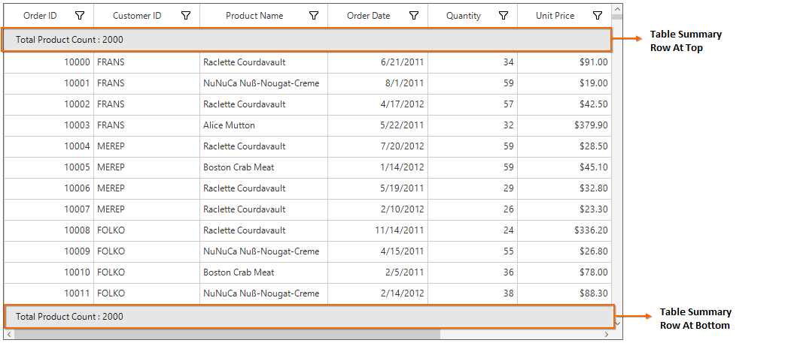

### Displaying column summary with title

SfDataGrid supports to show column summary and title summary at the same time. You can show column summary along with title by defining the [GridSummaryRow.Title](https://help.syncfusion.com/cr/windowsforms/Syncfusion.WinForms.DataGrid.GridSummaryRow.html#Syncfusion_WinForms_DataGrid_GridSummaryRow_Title) and [GridSummaryRow.TitleColumnCount](https://help.syncfusion.com/cr/windowsforms/Syncfusion.WinForms.DataGrid.GridSummaryRow.html#Syncfusion_WinForms_DataGrid_GridSummaryRow_TitleColumnCount) property along with defining summary columns. Showing column summary along with title can be only supported if [GridSummaryRow.ShowSummaryInRow](https://help.syncfusion.com/cr/windowsforms/Syncfusion.WinForms.DataGrid.GridSummaryRow.html#Syncfusion_WinForms_DataGrid_GridSummaryRow_ShowSummaryInRow) is disabled.

Refer [Displaying table summary for column](https://help.syncfusion.com/windowsforms/datagrid/summaries#displaying-table-summary-for-column) section to know more about how to display table summary columns.

In the below code snippet, `GridSummaryRow.TitleColumnCount` is set as 3 and `GridSummaryRow.Title` is defined along with summary columns.



// Creates the TableSummaryRow1.
GridTableSummaryRow tableSummaryRow1 = new GridTableSummaryRow();
tableSummaryRow1.ShowSummaryInRow = false;
tableSummaryRow1.TitleColumnCount = 3;
tableSummaryRow1.Position = VerticalPosition.Top;            
tableSummaryRow1.Title = "Total Price : {PriceAmount} for {ProductCount} products";

// Creates the TableSummaryRow2.
GridTableSummaryRow tableSummaryRow2 = new GridTableSummaryRow();
tableSummaryRow2.ShowSummaryInRow = false;
tableSummaryRow2.TitleColumnCount = 3;
tableSummaryRow2.Position = VerticalPosition.Bottom;
tableSummaryRow2.Title = "Total Price : {PriceAmount} for {ProductCount} products";

// Creates the GridSummaryColumn1.
GridSummaryColumn summaryColumn1 = new GridSummaryColumn();
summaryColumn1.Name = "OrderDate";
summaryColumn1.Format = "{Count:d}";
summaryColumn1.MappingName = "OrderDate";
summaryColumn1.SummaryType = SummaryType.CountAggregate;

// Creates the GridSummaryColumn2.
GridSummaryColumn summaryColumn2 = new GridSummaryColumn();
summaryColumn2.Name = "ProductCount";
summaryColumn2.Format = "{Count:d}";
summaryColumn2.MappingName = "Quantity";
summaryColumn2.SummaryType = SummaryType.CountAggregate;

// Creates the GridSummaryColumn2.
GridSummaryColumn summaryColumn3 = new GridSummaryColumn();
summaryColumn3.Name = "PriceAmount";
summaryColumn3.Format = "{Sum:c}";
summaryColumn3.MappingName = "UnitPrice";
summaryColumn3.SummaryType = SummaryType.DoubleAggregate;

// Adds the GridSummaryColumn in the SummaryColumns collection.
tableSummaryRow1.SummaryColumns.Add(summaryColumn1);
tableSummaryRow1.SummaryColumns.Add(summaryColumn2);
tableSummaryRow1.SummaryColumns.Add(summaryColumn3);
tableSummaryRow2.SummaryColumns.Add(summaryColumn1);
tableSummaryRow2.SummaryColumns.Add(summaryColumn2);
tableSummaryRow2.SummaryColumns.Add(summaryColumn3);

// Adds the GridTableSummaryRow in the TableSummaryRows collection.
this.sfDataGrid1.TableSummaryRows.Add(tableSummaryRow1);
this.sfDataGrid1.TableSummaryRows.Add(tableSummaryRow2);            


' Creates the TableSummaryRow1.
Dim tableSummaryRow1 As New GridTableSummaryRow()
tableSummaryRow1.ShowSummaryInRow = False
tableSummaryRow1.TitleColumnCount = 3
tableSummaryRow1.Position = VerticalPosition.Top
tableSummaryRow1.Title = "Total Price : {PriceAmount} for {ProductCount} products"

' Creates the TableSummaryRow2.
Dim tableSummaryRow2 As New GridTableSummaryRow()
tableSummaryRow2.ShowSummaryInRow = False
tableSummaryRow2.TitleColumnCount = 3
tableSummaryRow2.Position = VerticalPosition.Bottom
tableSummaryRow2.Title = "Total Price : {PriceAmount} for {ProductCount} products"

' Creates the GridSummaryColumn1.
Dim summaryColumn1 As New GridSummaryColumn()
summaryColumn1.Name = "OrderDate"
summaryColumn1.Format = "{Count:d}"
summaryColumn1.MappingName = "OrderDate"
summaryColumn1.SummaryType = SummaryType.CountAggregate

' Creates the GridSummaryColumn2.
Dim summaryColumn2 As New GridSummaryColumn()
summaryColumn2.Name = "ProductCount"
summaryColumn2.Format = "{Count:d}"
summaryColumn2.MappingName = "Quantity"
summaryColumn2.SummaryType = SummaryType.CountAggregate

' Creates the GridSummaryColumn2.
Dim summaryColumn3 As New GridSummaryColumn()
summaryColumn3.Name = "PriceAmount"
summaryColumn3.Format = "{Sum:c}"
summaryColumn3.MappingName = "UnitPrice"
summaryColumn3.SummaryType = SummaryType.DoubleAggregate

' Adds the GridSummaryColumn in the SummaryColumns collection.
tableSummaryRow1.SummaryColumns.Add(summaryColumn1)
tableSummaryRow1.SummaryColumns.Add(summaryColumn2)
tableSummaryRow1.SummaryColumns.Add(summaryColumn3)
tableSummaryRow2.SummaryColumns.Add(summaryColumn1)
tableSummaryRow2.SummaryColumns.Add(summaryColumn2)
tableSummaryRow2.SummaryColumns.Add(summaryColumn3)

' Adds the GridTableSummaryRow in the TableSummaryRows collection.
Me.sfDataGrid1.TableSummaryRows.Add(tableSummaryRow1)
Me.sfDataGrid1.TableSummaryRows.Add(tableSummaryRow2)



The following screenshot illustrates displaying summary columns with title at same time for `TableSummaryRow`.

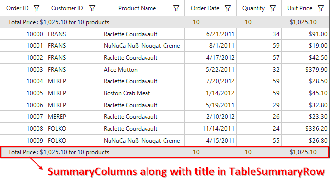

#### Limitations

The following are the limitations of displaying column summary along with title at same time for `TableSummaryRow`:

* If [FrozenColumnCount](https://help.syncfusion.com/cr/windowsforms/Syncfusion.WinForms.DataGrid.SfDataGrid.html#Syncfusion_WinForms_DataGrid_SfDataGrid_FrozenColumnCount) is defined lesser than `GridSummaryRow.TitleColumnCount`, the title summary will be spanned to `FrozenColumnCount` range, since spanned range and frozen range cannot be vary.
* Summary columns defined in the `GridSummaryRow.TitleColumnCount` range will not be shown.

### Appearance
The appearance of the table summary can be customized by [SfDataGrid.Style.TableSummaryRowStyle](https://help.syncfusion.com/cr/windowsforms/Syncfusion.WinForms.DataGrid.Styles.DataGridStyle.html#Syncfusion_WinForms_DataGrid_Styles_DataGridStyle_TableSummaryRowStyle) property. The `TableSummaryRowStyle` property contains all the settings that are needed for the table summary row appearance customization.



this.sfDataGrid1.Style.TableSummaryRowStyle.BackColor = Color.LightSkyBlue;
this.sfDataGrid1.Style.TableSummaryRowStyle.Borders.All = new GridBorder(Color.Black, GridBorderWeight.Medium);
this.sfDataGrid1.Style.TableSummaryRowStyle.Font = new GridFontInfo(new Font("Arial", 10f, FontStyle.Bold));


Me.sfDataGrid1.Style.TableSummaryRowStyle.BackColor = Color.LightSkyBlue
Me.sfDataGrid1.Style.TableSummaryRowStyle.Borders.All = New GridBorder(Color.Black, GridBorderWeight.Medium)
Me.sfDataGrid1.Style.TableSummaryRowStyle.Font = New GridFontInfo(New Font("Arial", 10f, FontStyle.Bold))



### Overriding Table Summary Renderer
[GridTableSummaryCellRender](https://help.syncfusion.com/cr/windowsforms/Syncfusion.WinForms.DataGrid.Renderers.GridTableSummaryCellRenderer.html) is the cell renderer which renders the table summary row. The table summary row appearance and the summary value can be customized with the `GridTableSummaryCellRender`.

#### Creating Custom Renderer
The number format for numeric values displayed on [GridTableSummaryRow](https://help.syncfusion.com/cr/windowsforms/Syncfusion.WinForms.DataGrid.GridTableSummaryRow.html) can be applied by overriding the `OnRender` method in `GridTableSummaryCellRenderer` class.



  public class CustomGridTableSummaryRenderer : GridTableSummaryCellRenderer
    {
        protected override void OnRender(Graphics paint, Rectangle cellRect, string cellValue,
            CellStyleInfo style, DataColumnBase column, RowColumnIndex rowColumnIndex)
        {
            if (string.IsNullOrEmpty(cellValue))
                return;
            // Creates new number format and apply it to summary value. 
            NumberFormatInfo format = new NumberFormatInfo();
            format.NumberDecimalDigits = 3;
            format.NumberDecimalSeparator = " * ";
            format.NumberGroupSeparator = ",";
            //Number format is applied to summary value.
            cellValue = Convert.ToDouble(double.Parse(cellValue, NumberStyles.Currency)).ToString("N", format);
            StringFormat stringFormat = new StringFormat();
            stringFormat.LineAlignment = StringAlignment.Center;
            stringFormat.Alignment = StringAlignment.Center;
            paint.DrawString(cellValue, style.Font.GetFont(), Brushes.Black, cellRect, stringFormat);
        }
    }


  Public Class CustomGridTableSummaryRenderer
	  Inherits GridTableSummaryCellRenderer
		Protected Overrides Sub OnRender(ByVal paint As Graphics, ByVal cellRect As Rectangle, ByVal cellValue As String, ByVal style As CellStyleInfo, ByVal column As DataColumnBase, ByVal rowColumnIndex As RowColumnIndex)
			If String.IsNullOrEmpty(cellValue) Then
				Return
			End If
			' Creates new number format and apply it to summary value. 
			Dim format As New NumberFormatInfo()
			format.NumberDecimalDigits = 3
			format.NumberDecimalSeparator = " * "
			format.NumberGroupSeparator = ","
			'Number format is applied to summary value.
			cellValue = Convert.ToDouble(Double.Parse(cellValue, NumberStyles.Currency)).ToString("N", format)
			Dim stringFormat As New StringFormat()
			stringFormat.LineAlignment = StringAlignment.Center
			stringFormat.Alignment = StringAlignment.Center
			paint.DrawString(cellValue, style.Font.GetFont(), Brushes.Black, cellRect, stringFormat)
		End Sub
  End Class



#### Replacing Custom Renderer
The overridden custom table summary renderer can be replaced with default renderer by replacing the `CustomGridTableSummaryRenderer` to the `TableSummary` in the [CellRenderers](https://help.syncfusion.com/cr/windowsforms/Syncfusion.WinForms.DataGrid.SfDataGrid.html#Syncfusion_WinForms_DataGrid_SfDataGrid_CellRenderers) collection.



this.sfDataGrid1.CellRenderers.Remove("TableSummary");
this.sfDataGrid1.CellRenderers.Add("TableSummary", new CustomGridTableSummaryRenderer());


Me.sfDataGrid1.CellRenderers.Remove("TableSummary")
Me.sfDataGrid1.CellRenderers.Add("TableSummary", New CustomGridTableSummaryRenderer())



## Group Summary
Group summary values calculated based on the records in the group and the summary information will be displayed at the bottom of each group. The group summary row can be viewed by expanding the corresponding group header. SfDataGrid allows to add any number of group summary rows.

### Adding Group Summary
The group summary rows can be added in SfDataGrid by adding the [GridSummaryRow](https://help.syncfusion.com/cr/windowsforms/Syncfusion.WinForms.DataGrid.GridSummaryRow.html) to [SfDataGrid.GroupSummaryRows](https://help.syncfusion.com/cr/windowsforms/Syncfusion.WinForms.DataGrid.SfDataGrid.html#Syncfusion_WinForms_DataGrid_SfDataGrid_GroupSummaryRows) collection.

### Displaying Group Summary for Column
Summary information can be displayed in the column by setting [GridSummaryRow.ShowSummaryInRow](https://help.syncfusion.com/cr/windowsforms/Syncfusion.WinForms.DataGrid.GridSummaryRow.html#Syncfusion_WinForms_DataGrid_GridSummaryRow_ShowSummaryInRow) to `false` and defining summary columns. To calculate summary based on column you should specify the below properties,

1. [GridSummaryColumn.MappingName](https://help.syncfusion.com/cr/windowsforms/Syncfusion.WinForms.DataGrid.GridSummaryColumn.html#Syncfusion_WinForms_DataGrid_GridSummaryColumn_MappingName) – MappingName of the column (Property name of data object).
2. [GridSummaryColumn.SummaryType](https://help.syncfusion.com/cr/windowsforms/Syncfusion.WinForms.DataGrid.GridSummaryColumn.html#Syncfusion_WinForms_DataGrid_GridSummaryColumn_SummaryType) – SfDataGrid provides different built-in summary calculation functions for various types.
3. [GridSummaryColumn.Format](https://help.syncfusion.com/cr/windowsforms/Syncfusion.WinForms.DataGrid.GridSummaryColumn.html#Syncfusion_WinForms_DataGrid_GridSummaryColumn_Format) – Used to define format string for summary based on support function name’s in specified SummaryType.



// Creates the GridSummaryRow.
GridSummaryRow groupSummaryRow1 = new GridSummaryRow();
groupSummaryRow1.Name = "GroupSummary";
groupSummaryRow1.ShowSummaryInRow = false;

// Creates the GridSummaryColumn.
GridSummaryColumn summaryColumn1 = new GridSummaryColumn();
summaryColumn1.Name = "UnitPrice";
summaryColumn1.SummaryType = SummaryType.DoubleAggregate;
summaryColumn1.Format = "Total Price : {Sum:c}";
summaryColumn1.MappingName = "UnitPrice";

// Adds the GridSummaryColumn in SummaryColumns collection.
groupSummaryRow1.SummaryColumns.Add(summaryColumn1);

// Adds the summary row in the GroupSummaryRows collection.
this.sfDataGrid1.GroupSummaryRows.Add(groupSummaryRow1);


' Creates the GridSummaryRow.
Dim groupSummaryRow1 As New GridSummaryRow()
groupSummaryRow1.Name = "GroupSummary"
groupSummaryRow1.ShowSummaryInRow = False

' Creates the GridSummaryColumn.
Dim summaryColumn1 As New GridSummaryColumn()
summaryColumn1.Name = "UnitPrice"
summaryColumn1.SummaryType = SummaryType.DoubleAggregate
summaryColumn1.Format = "Total Price : {Sum:c}"
summaryColumn1.MappingName = "UnitPrice"

' Adds the GridSummaryColumn in SummaryColumns collection.
groupSummaryRow1.SummaryColumns.Add(summaryColumn1)

' Adds the summary row in the GroupSummaryRows collection.
Me.sfDataGrid1.GroupSummaryRows.Add(groupSummaryRow1)



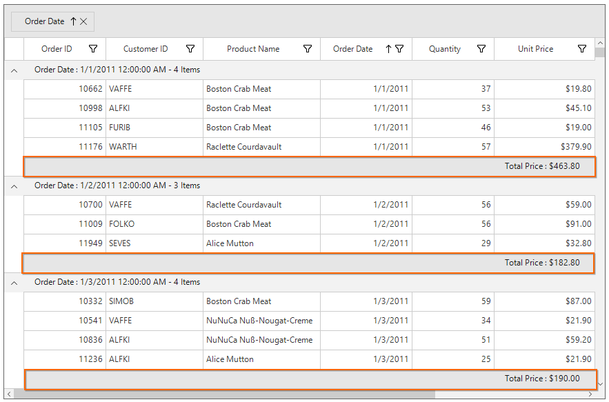

### Displaying Group Summary for Row
Summary information can be displayed in row by setting [GridSummaryRow.ShowSummaryInRow](https://help.syncfusion.com/cr/windowsforms/Syncfusion.WinForms.DataGrid.GridSummaryRow.html#Syncfusion_WinForms_DataGrid_GridSummaryRow_ShowSummaryInRow) to `true` and defining summary columns. [GridSummaryRow.Title](https://help.syncfusion.com/cr/windowsforms/Syncfusion.WinForms.DataGrid.GridSummaryRow.html#Syncfusion_WinForms_DataGrid_GridSummaryRow_Title) should be defined based on [GridSummaryColumn.Name](https://help.syncfusion.com/cr/windowsforms/Syncfusion.WinForms.DataGrid.GridSummaryRow.html#Syncfusion_WinForms_DataGrid_GridSummaryRow_Name) property to format summary columns values in row.



// Creates the GridSummaryRow.
GridSummaryRow groupSummaryRow1 = new GridSummaryRow();
groupSummaryRow1.Name = "GroupSummary";
groupSummaryRow1.ShowSummaryInRow = true;
groupSummaryRow1.Title = "Total Price $: { UnitPrice }";

// Creates the GridSummaryColumn.
GridSummaryColumn summaryColumn1 = new GridSummaryColumn();
summaryColumn1.Name = "UnitPrice";
summaryColumn1.SummaryType = SummaryType.DoubleAggregate;
summaryColumn1.Format = "{Sum:c}";
summaryColumn1.MappingName = " UnitPrice ";

// Adds the GridSummaryColumn in SummaryColumns collection.
groupSummaryRow1.SummaryColumns.Add(summaryColumn1);

// Adds the summary row in the GroupSummaryRows collection.
this.sfDataGrid1.GroupSummaryRows.Add(groupSummaryRow1);


' Creates the GridSummaryRow.
Dim groupSummaryRow1 As New GridSummaryRow()
groupSummaryRow1.Name = "GroupSummary"
groupSummaryRow1.ShowSummaryInRow = True
groupSummaryRow1.Title = "Total Price $: { UnitPrice }"

' Creates the GridSummaryColumn.
Dim summaryColumn1 As New GridSummaryColumn()
summaryColumn1.Name = "UnitPrice"
summaryColumn1.SummaryType = SummaryType.DoubleAggregate
summaryColumn1.Format = "{Sum:c}"
summaryColumn1.MappingName = " UnitPrice "

' Adds the GridSummaryColumn in SummaryColumns collection.
groupSummaryRow1.SummaryColumns.Add(summaryColumn1)

' Adds the summary row in the GroupSummaryRows collection.
Me.sfDataGrid1.GroupSummaryRows.Add(groupSummaryRow1)



N> [GridSummaryRow.Title](https://help.syncfusion.com/cr/windowsforms/Syncfusion.WinForms.DataGrid.GridSummaryRow.html#Syncfusion_WinForms_DataGrid_GridSummaryRow_Title) must be specified if [GridSummaryRow.ShowSummaryInRow](https://help.syncfusion.com/cr/windowsforms/Syncfusion.WinForms.DataGrid.GridSummaryRow.html#Syncfusion_WinForms_DataGrid_GridSummaryRow_ShowSummaryInRow) is enabled.

### Displaying column summary with title

SfDataGrid supports to show column summary and title summary at the same time. You can show column summary along with title by defining the [GridSummaryRow.Title](https://help.syncfusion.com/cr/windowsforms/Syncfusion.WinForms.DataGrid.GridSummaryRow.html#Syncfusion_WinForms_DataGrid_GridSummaryRow_Title) and [GridSummaryRow.TitleColumnCount](https://help.syncfusion.com/cr/windowsforms/Syncfusion.WinForms.DataGrid.GridSummaryRow.html#Syncfusion_WinForms_DataGrid_GridSummaryRow_TitleColumnCount) property along with defining summary columns. Showing column summary along with title can be only supported if [GridSummaryRow.ShowSummaryInRow](https://help.syncfusion.com/cr/windowsforms/Syncfusion.WinForms.DataGrid.GridSummaryRow.html#Syncfusion_WinForms_DataGrid_GridSummaryRow_ShowSummaryInRow) is disabled.

Refer [Displaying group summary for column](https://help.syncfusion.com/windowsforms/datagrid/summaries#displaying-group-summary-for-column) section to know more about how to display group summary columns.

In the below code snippet, `GridSummaryRow.TitleColumnCount` is set as 3 and `GridSummaryRow.Title` is defined along with summary columns.



// Creates the GridSummaryRow.
GridSummaryRow groupSummaryRow1 = new GridSummaryRow();
groupSummaryRow1.Name = "GroupSummary";
groupSummaryRow1.ShowSummaryInRow = false;
groupSummaryRow1.TitleColumnCount = 3;
groupSummaryRow1.Title = "Total Price: {PriceAmount} for {ProductCount} Products";

// Creates the GridSummaryColumn1.
GridSummaryColumn summaryColumn1 = new GridSummaryColumn();
summaryColumn1.Name = "OrderDate";
summaryColumn1.Format = "{Count:d}";
summaryColumn1.MappingName = "OrderDate";
summaryColumn1.SummaryType = SummaryType.CountAggregate;

// Creates the GridSummaryColumn2.
GridSummaryColumn summaryColumn2 = new GridSummaryColumn();
summaryColumn2.Name = "ProductCount";
summaryColumn2.Format = "{Count:d}";
summaryColumn2.MappingName = "Quantity";
summaryColumn2.SummaryType = SummaryType.CountAggregate;

// Creates the GridSummaryColumn2.
GridSummaryColumn summaryColumn3 = new GridSummaryColumn();
summaryColumn3.Name = "PriceAmount";
summaryColumn3.Format = "{Sum:c}";
summaryColumn3.MappingName = "UnitPrice";
summaryColumn3.SummaryType = SummaryType.DoubleAggregate;

// Adds the GridSummaryColumn in SummaryColumns collection.
groupSummaryRow1.SummaryColumns.Add(summaryColumn1);
groupSummaryRow1.SummaryColumns.Add(summaryColumn2);
groupSummaryRow1.SummaryColumns.Add(summaryColumn3);

// Adds the summary row in the GroupSummaryRows collection.
this.sfDataGrid1.GroupSummaryRows.Add(groupSummaryRow1);


' Creates the GridSummaryRow.
Dim groupSummaryRow1 As New GridSummaryRow()
groupSummaryRow1.Name = "GroupSummary"
groupSummaryRow1.ShowSummaryInRow = False
groupSummaryRow1.TitleColumnCount = 3
groupSummaryRow1.Title = "Total Price: {PriceAmount} for {ProductCount} Products"

' Creates the GridSummaryColumn1.
Dim summaryColumn1 As New GridSummaryColumn()
summaryColumn1.Name = "OrderDate"
summaryColumn1.Format = "{Count:d}"
summaryColumn1.MappingName = "OrderDate"
summaryColumn1.SummaryType = SummaryType.CountAggregate

' Creates the GridSummaryColumn2.
Dim summaryColumn2 As New GridSummaryColumn()
summaryColumn2.Name = "ProductCount"
summaryColumn2.Format = "{Count:d}"
summaryColumn2.MappingName = "Quantity"
summaryColumn2.SummaryType = SummaryType.CountAggregate

' Creates the GridSummaryColumn2.
Dim summaryColumn3 As New GridSummaryColumn()
summaryColumn3.Name = "PriceAmount"
summaryColumn3.Format = "{Sum:c}"
summaryColumn3.MappingName = "UnitPrice"
summaryColumn3.SummaryType = SummaryType.DoubleAggregate

' Adds the GridSummaryColumn in SummaryColumns collection.
groupSummaryRow1.SummaryColumns.Add(summaryColumn1)
groupSummaryRow1.SummaryColumns.Add(summaryColumn2)
groupSummaryRow1.SummaryColumns.Add(summaryColumn3)

' Adds the summary row in the GroupSummaryRows collection.
Me.sfDataGrid1.GroupSummaryRows.Add(groupSummaryRow1)



The following screenshot illustrates displaying summary columns with title at same time for `GroupSummaryRow`.

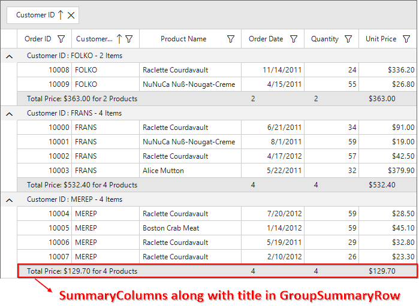

#### Limitations

The following are the limitations of displaying column summary along with title at same time for `GroupSummaryRow`:

* If [FrozenColumnCount](https://help.syncfusion.com/cr/windowsforms/Syncfusion.WinForms.DataGrid.SfDataGrid.html#Syncfusion_WinForms_DataGrid_SfDataGrid_FrozenColumnCount) is defined lesser than `GridSummaryRow.TitleColumnCount`, the title summary will be spanned to `FrozenColumnCount` range, since spanned range and frozen range cannot be vary.
* Summary columns defined in the `GridSummaryRow.TitleColumnCount` range will not be shown.

### Appearance
The appearance of the group summary can be customized by [SfDataGrid.Style.GroupSummaryRowStyle](https://help.syncfusion.com/cr/windowsforms/Syncfusion.WinForms.DataGrid.Styles.DataGridStyle.html#Syncfusion_WinForms_DataGrid_Styles_DataGridStyle_GroupSummaryRowStyle) property. The `GroupSummaryRowStyle` property contains all the settings that are needed for the group summary row appearance customization.



this.sfDataGrid1.Style.GroupSummaryRowStyle.BackColor = Color.LightSkyBlue;
this.sfDataGrid1.Style.GroupSummaryRowStyle.Font = new GridFontInfo(new Font("Arial", 10f, FontStyle.Bold));


Me.sfDataGrid1.Style.GroupSummaryRowStyle.BackColor = Color.LightSkyBlue
Me.sfDataGrid1.Style.GroupSummaryRowStyle.Font = New GridFontInfo(New Font("Arial", 10f, FontStyle.Bold))



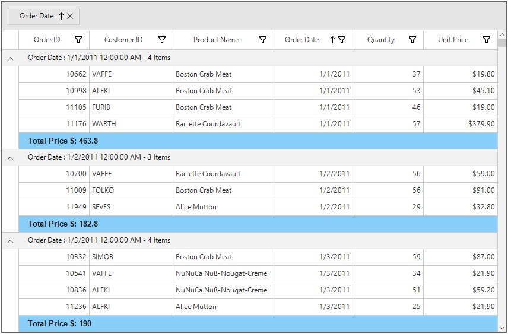

### Overriding Group Summary Renderer
[GridGroupSummaryCellRenderer](https://help.syncfusion.com/cr/windowsforms/Syncfusion.WinForms.DataGrid.Renderers.GridGroupSummaryCellRenderer.html) is the cell renderer which renders the group summary row. The group summary row appearance and the summary value can be customized with the `GridGroupSummaryCellRender`.

#### Creating Custom Renderer
The number format for numeric values displayed on group summary row can be applied by overriding the `OnRender` method in `GridGroupSummaryCellRenderer` class.



public class CustomGridGroupSummaryRenderer : GridGroupSummaryCellRenderer
    {
        protected override void OnRender(Graphics paint, Rectangle cellRect, string cellValue,
            CellStyleInfo style, DataColumnBase column, RowColumnIndex rowColumnIndex)
        {
            if (string.IsNullOrEmpty(cellValue))
                return;
            // Creates new number format and apply it to summary value. 
            NumberFormatInfo format = new NumberFormatInfo();
            format.NumberDecimalDigits = 3;
            format.NumberDecimalSeparator = "*";
            format.NumberGroupSeparator = ",";
            //Number format is applied to summary value.
            cellValue = Convert.ToDouble(double.Parse(cellValue, NumberStyles.Currency)).ToString("N", format);
            StringFormat stringFormat = new StringFormat();
            stringFormat.LineAlignment = StringAlignment.Center;
            stringFormat.Alignment = StringAlignment.Center;
            paint.DrawString(cellValue, style.Font.GetFont(), Brushes.Black, cellRect, stringFormat);
        }
    }


Public Class CustomGridGroupSummaryRenderer
	Inherits GridGroupSummaryCellRenderer
		Protected Overrides Sub OnRender(ByVal paint As Graphics, ByVal cellRect As Rectangle, ByVal cellValue As String, ByVal style As CellStyleInfo, ByVal column As DataColumnBase, ByVal rowColumnIndex As RowColumnIndex)
			If String.IsNullOrEmpty(cellValue) Then
				Return
			End If
			' Creates new number format and apply it to summary value. 
			Dim format As New NumberFormatInfo()
			format.NumberDecimalDigits = 3
			format.NumberDecimalSeparator = "*"
			format.NumberGroupSeparator = ","
			'Number format is applied to summary value.
			cellValue = Convert.ToDouble(Double.Parse(cellValue, NumberStyles.Currency)).ToString("N", format)
			Dim stringFormat As New StringFormat()
			stringFormat.LineAlignment = StringAlignment.Center
			stringFormat.Alignment = StringAlignment.Center
			paint.DrawString(cellValue, style.Font.GetFont(), Brushes.Black, cellRect, stringFormat)
		End Sub
End Class



#### Replacing Custom Renderer
The overridden custom group summary renderer can be replaced with default renderer by replacing the `CustomGridGroupSummaryRenderer` to the `GroupSummary` in the [CellRenderers](https://help.syncfusion.com/cr/windowsforms/Syncfusion.WinForms.DataGrid.SfDataGrid.html#Syncfusion_WinForms_DataGrid_SfDataGrid_CellRenderers) collection.



this.sfDataGrid1.CellRenderers.Remove("GroupSummary");
this.sfDataGrid1.CellRenderers.Add("GroupSummary", new CustomGridGroupSummaryRenderer());


Me.sfDataGrid1.CellRenderers.Remove("GroupSummary")
Me.sfDataGrid1.CellRenderers.Add("GroupSummary", New CustomGridGroupSummaryRenderer())



## Caption Summary
SfDataGrid provides built-in support for caption summary. The caption summary value calculated based on the records in a group and the summary information will be displayed in the caption of group.
Below screen shot shows the built-in caption summary of Group.

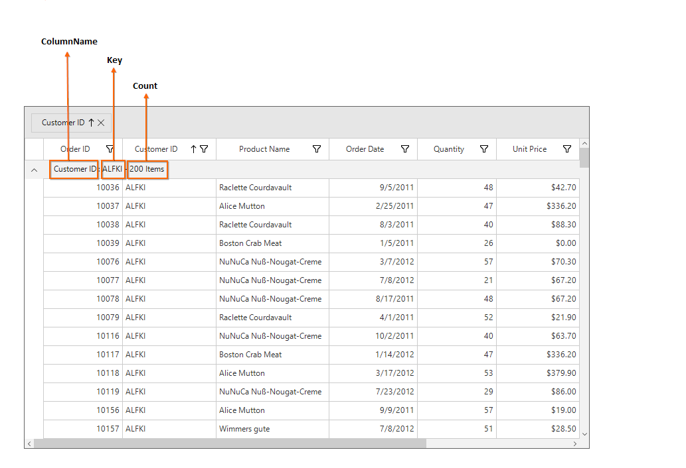

### Formatting Built-in Caption Summary
The group caption text can be formatted using the [SfDataGrid.GroupCaptionTextFormat](https://help.syncfusion.com/cr/windowsforms/Syncfusion.WinForms.DataGrid.SfDataGrid.html#Syncfusion_WinForms_DataGrid_SfDataGrid_GroupCaptionTextFormat) property.

The default group caption format is `{ColumnName}: {Key} - {ItemsCount} Items`.

* ColumnName - Displays the name of the column currently grouped.
* Key - Displays the key value of group.
* ItemsCount - Displays the number of items in group.
The group caption format can be changed to Key and ItemsCount alone by setting `GroupCaptionTextFormat` as below,


this.sfDataGrid1.GroupCaptionTextFormat = "{Key} : {ItemsCount}";


Me.sfDataGrid1.GroupCaptionTextFormat = "{Key} : {ItemsCount}"



### Displaying Caption Summary for Column

Summary information can be displayed in the column by setting [GridSummaryRow.ShowSummaryInRow](https://help.syncfusion.com/cr/windowsforms/Syncfusion.WinForms.DataGrid.GridSummaryRow.html#Syncfusion_WinForms_DataGrid_GridSummaryRow_ShowSummaryInRow) to `false` and defining summary columns. To calculate summary based on column the below properties must be specified, 

1. [GridSummaryColumn.MappingName](https://help.syncfusion.com/cr/windowsforms/Syncfusion.WinForms.DataGrid.GridSummaryColumn.html#Syncfusion_WinForms_DataGrid_GridSummaryColumn_MappingName) – MappingName of the column (Property name of data object).
2. [GridSummaryColumn.SummaryType](https://help.syncfusion.com/cr/windowsforms/Syncfusion.WinForms.DataGrid.GridSummaryColumn.html#Syncfusion_WinForms_DataGrid_GridSummaryColumn_SummaryType) – SfDataGrid provides different built-in summary calculation functions for various types.
3. [GridSummaryColumn.Format](https://help.syncfusion.com/cr/windowsforms/Syncfusion.WinForms.DataGrid.GridSummaryColumn.html#Syncfusion_WinForms_DataGrid_GridSummaryColumn_Format) – Used to define format string for summary based on support function name’s in specified SummaryType.



// Creates the GridSummaryRow.
GridSummaryRow captionSummaryRow = new GridSummaryRow();
captionSummaryRow.Name = "CaptionSummary";
captionSummaryRow.ShowSummaryInRow = false;

// Creates the GridSummaryColumn.
GridSummaryColumn summaryColumn1 = new GridSummaryColumn();
summaryColumn1.Name = "Column1";
summaryColumn1.SummaryType = SummaryType.DoubleAggregate;
summaryColumn1.Format = "{Sum:c}";
summaryColumn1.MappingName = "UnitPrice";

GridSummaryColumn summaryColumn2 = new GridSummaryColumn();
summaryColumn2.Name = "Column2";
summaryColumn2.SummaryType = SummaryType.Int32Aggregate;
summaryColumn2.Format = "{Count}";
summaryColumn2.MappingName = "OrderID";

// Adds the summary column in the SummaryColumns collection.
captionSummaryRow.SummaryColumns.Add(summaryColumn1);
captionSummaryRow.SummaryColumns.Add(summaryColumn2);

// Initializes the caption summary row.
this.sfDataGrid1.CaptionSummaryRow = captionSummaryRow;


' Creates the GridSummaryRow.
Dim captionSummaryRow As New GridSummaryRow()
captionSummaryRow.Name = "CaptionSummary"
captionSummaryRow.ShowSummaryInRow = False

' Creates the GridSummaryColumn.
Dim summaryColumn1 As New GridSummaryColumn()
summaryColumn1.Name = "Column1"
summaryColumn1.SummaryType = SummaryType.DoubleAggregate
summaryColumn1.Format = "{Sum:c}"
summaryColumn1.MappingName = "UnitPrice"

Dim summaryColumn2 As New GridSummaryColumn()
summaryColumn2.Name = "Column2"
summaryColumn2.SummaryType = SummaryType.Int32Aggregate
summaryColumn2.Format = "{Count}"
summaryColumn2.MappingName = "OrderID"

' Adds the summary column in the SummaryColumns collection.
captionSummaryRow.SummaryColumns.Add(summaryColumn1)
captionSummaryRow.SummaryColumns.Add(summaryColumn2)

' Initializes the caption summary row.
Me.sfDataGrid1.CaptionSummaryRow = captionSummaryRow



### Displaying Caption Summary for Row
Summary information can be displayed in row by setting [GridSummaryRow.ShowSummaryInRow](https://help.syncfusion.com/cr/windowsforms/Syncfusion.WinForms.DataGrid.GridSummaryRow.html#Syncfusion_WinForms_DataGrid_GridSummaryRow_ShowSummaryInRow) to `true` and defining summary columns. [GridSummaryRow.Title](https://help.syncfusion.com/cr/windowsforms/Syncfusion.WinForms.DataGrid.GridSummaryRow.html#Syncfusion_WinForms_DataGrid_GridSummaryRow_Title) based on [GridSummaryColumn.Name](https://help.syncfusion.com/cr/windowsforms/Syncfusion.WinForms.DataGrid.GridSummaryRow.html#Syncfusion_WinForms_DataGrid_GridSummaryRow_Name) property must be defined to format the summary columns values in row.


// Creates the GridSummaryRow.
GridSummaryRow captionSummaryRow = new GridSummaryRow();
captionSummaryRow.Name = "CaptionSummary";
captionSummaryRow.ShowSummaryInRow = true;
captionSummaryRow.Title = " Total Quantity of {Key} : {Quantity}";

// Creates the GridSummaryColumn.
GridSummaryColumn summaryColumn1 = new GridSummaryColumn();
summaryColumn1.Name = "Quantity";
summaryColumn1.SummaryType = SummaryType.DoubleAggregate;
summaryColumn1.Format = "{Sum:c}";
summaryColumn1.MappingName = "Quantity";

// Adds the summary column in the SummaryColumns collection.
captionSummaryRow.SummaryColumns.Add(summaryColumn1);

// Initializes the caption summary row.
this.sfDataGrid1.CaptionSummaryRow = captionSummaryRow;


' Creates the GridSummaryRow.
Dim captionSummaryRow As New GridSummaryRow()
captionSummaryRow.Name = "CaptionSummary"
captionSummaryRow.ShowSummaryInRow = True
captionSummaryRow.Title = " Total Quantity of {Key} : {Quantity}"

' Creates the GridSummaryColumn.
Dim summaryColumn1 As New GridSummaryColumn()
summaryColumn1.Name = "Quantity"
summaryColumn1.SummaryType = SummaryType.DoubleAggregate
summaryColumn1.Format = "{Sum:c}"
summaryColumn1.MappingName = "Quantity"

' Adds the summary column in the SummaryColumns collection.
captionSummaryRow.SummaryColumns.Add(summaryColumn1)

' Initializes the caption summary row.
Me.sfDataGrid1.CaptionSummaryRow = captionSummaryRow



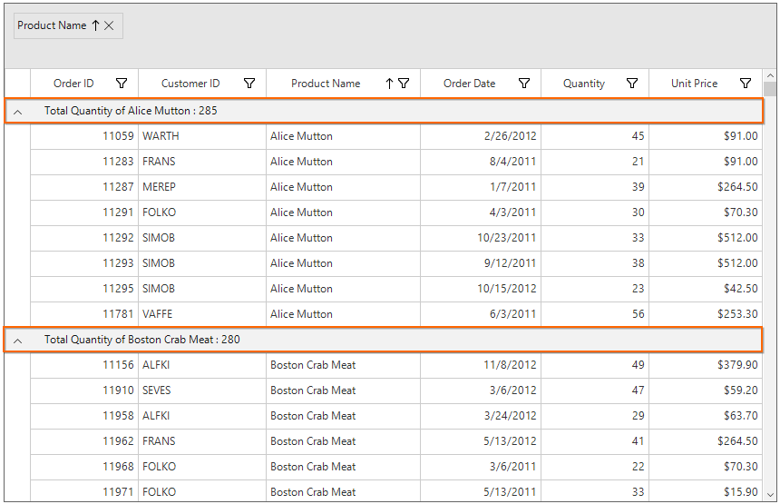

### Displaying column summary with title

SfDataGrid supports to show column summary and title summary at the same time. You can show column summary along with title by defining the [GridSummaryRow.Title](https://help.syncfusion.com/cr/windowsforms/Syncfusion.WinForms.DataGrid.GridSummaryRow.html#Syncfusion_WinForms_DataGrid_GridSummaryRow_Title) and [GridSummaryRow.TitleColumnCount](https://help.syncfusion.com/cr/windowsforms/Syncfusion.WinForms.DataGrid.GridSummaryRow.html#Syncfusion_WinForms_DataGrid_GridSummaryRow_TitleColumnCount) property along with defining summary columns. Showing column summary along with title can be only supported if [GridSummaryRow.ShowSummaryInRow](https://help.syncfusion.com/cr/windowsforms/Syncfusion.WinForms.DataGrid.GridSummaryRow.html#Syncfusion_WinForms_DataGrid_GridSummaryRow_ShowSummaryInRow) is disabled.

Refer [Displaying caption summary for column](https://help.syncfusion.com/windowsforms/datagrid/summaries#displaying-caption-summary-for-column) section to know more about how to display caption summary columns.

In the below code snippet, `GridSummaryRow.TitleColumnCount` is set as 3 and `GridSummaryRow.Title` is defined along with summary columns.



// Creates the GridSummaryRow.
GridSummaryRow captionSummaryRow = new GridSummaryRow();
captionSummaryRow.Name = "CaptionSummary";
captionSummaryRow.ShowSummaryInRow = false;
captionSummaryRow.TitleColumnCount = 3;
captionSummaryRow.Title = "Total Price: {PriceAmount} for {ProductCount} Products";

// Creates the GridSummaryColumn1.
GridSummaryColumn summaryColumn1 = new GridSummaryColumn();
summaryColumn1.Name = "OrderDate";
summaryColumn1.Format = "{Count:d}";
summaryColumn1.MappingName = "OrderDate";
summaryColumn1.SummaryType = SummaryType.CountAggregate;

// Creates the GridSummaryColumn2.
GridSummaryColumn summaryColumn2 = new GridSummaryColumn();
summaryColumn2.Name = "ProductCount";
summaryColumn2.Format = "{Count:d}";
summaryColumn2.MappingName = "Quantity";
summaryColumn2.SummaryType = SummaryType.CountAggregate;

// Creates the GridSummaryColumn2.
GridSummaryColumn summaryColumn3 = new GridSummaryColumn();
summaryColumn3.Name = "PriceAmount";
summaryColumn3.Format = "{Sum:c}";
summaryColumn3.MappingName = "UnitPrice";
summaryColumn3.SummaryType = SummaryType.DoubleAggregate;

// Adds the summary column in the SummaryColumns collection.
captionSummaryRow.SummaryColumns.Add(summaryColumn1);
captionSummaryRow.SummaryColumns.Add(summaryColumn2);
captionSummaryRow.SummaryColumns.Add(summaryColumn3);

// Initializes the caption summary row.
this.sfDataGrid1.CaptionSummaryRow = captionSummaryRow;


' Creates the GridSummaryRow.
Dim captionSummaryRow As New GridSummaryRow()
captionSummaryRow.Name = "CaptionSummary"
captionSummaryRow.ShowSummaryInRow = False
captionSummaryRow.TitleColumnCount = 3
captionSummaryRow.Title = "Total Price: {PriceAmount} for {ProductCount} Products"

' Creates the GridSummaryColumn1.
Dim summaryColumn1 As New GridSummaryColumn()
summaryColumn1.Name = "OrderDate"
summaryColumn1.Format = "{Count:d}"
summaryColumn1.MappingName = "OrderDate"
summaryColumn1.SummaryType = SummaryType.CountAggregate

' Creates the GridSummaryColumn2.
Dim summaryColumn2 As New GridSummaryColumn()
summaryColumn2.Name = "ProductCount"
summaryColumn2.Format = "{Count:d}"
summaryColumn2.MappingName = "Quantity"
summaryColumn2.SummaryType = SummaryType.CountAggregate

' Creates the GridSummaryColumn2.
Dim summaryColumn3 As New GridSummaryColumn()
summaryColumn3.Name = "PriceAmount"
summaryColumn3.Format = "{Sum:c}"
summaryColumn3.MappingName = "UnitPrice"
summaryColumn3.SummaryType = SummaryType.DoubleAggregate

' Adds the summary column in the SummaryColumns collection.
captionSummaryRow.SummaryColumns.Add(summaryColumn1)
captionSummaryRow.SummaryColumns.Add(summaryColumn2)
captionSummaryRow.SummaryColumns.Add(summaryColumn3)

' Initializes the caption summary row.
Me.sfDataGrid1.CaptionSummaryRow = captionSummaryRow



The following screenshot illustrates displaying summary columns with title at same time for `CaptionSummaryRow`.

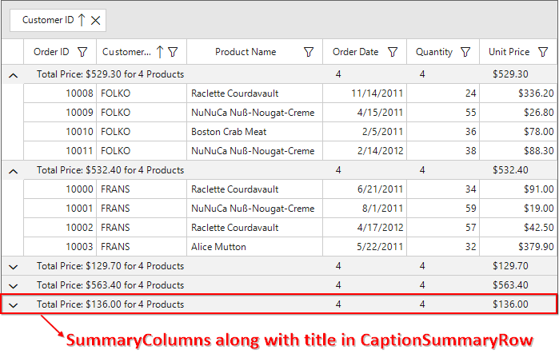

#### Limitations

The following are the limitations of displaying column summary along with title at same time for `CaptionSummaryRow`:

* If [FrozenColumnCount](https://help.syncfusion.com/cr/windowsforms/Syncfusion.WinForms.DataGrid.SfDataGrid.html#Syncfusion_WinForms_DataGrid_SfDataGrid_FrozenColumnCount) is defined lesser than `GridSummaryRow.TitleColumnCount`, the title summary will be spanned to `FrozenColumnCount` range, since spanned range and frozen range cannot be vary.
* Summary columns defined in the `GridSummaryRow.TitleColumnCount` range will not be shown.

### Appearance
The appearance of the caption summary can be customized by [SfDataGrid.Style.CaptionSummaryRowStyle](https://help.syncfusion.com/cr/windowsforms/Syncfusion.WinForms.DataGrid.Styles.DataGridStyle.html#Syncfusion_WinForms_DataGrid_Styles_DataGridStyle_CaptionSummaryRowStyle) property. The `CaptionSummaryRowStyle` property contains all the settings that are needed for the caption summary row appearance customization.


this.sfDataGrid1.Style.CaptionSummaryRowStyle.BackColor = Color.LightSkyBlue;
this.sfDataGrid1.Style.CaptionSummaryRowStyle.Font = new GridFontInfo(new Font("Arial", 10f, FontStyle.Bold));


Me.sfDataGrid1.Style.CaptionSummaryRowStyle.BackColor = Color.LightSkyBlue
Me.sfDataGrid1.Style.CaptionSummaryRowStyle.Font = New GridFontInfo(New Font("Arial", 10f, FontStyle.Bold))



### Overriding Caption Summary Renderer
[GridCaptionSummaryCellRenderer](https://help.syncfusion.com/cr/windowsforms/Syncfusion.WinForms.DataGrid.Renderers.GridCaptionSummaryCellRenderer.html) is the cell renderer which renders the caption summary row. The caption summary row appearance and the summary value can be customized with the `GridCaptionSummaryCellRender`.

#### Creating Custom Renderer

Number format for numeric values displayed on caption summary row can be applied by overriding the `OnRender` method in `GridCaptionSummaryCellRenderer` class.



public class CustomGridCaptionSummaryRenderer : GridCaptionSummaryCellRenderer
    {
        protected override void OnRender(Graphics paint, Rectangle cellRect, string cellValue,
         CellStyleInfo style, DataColumnBase column, RowColumnIndex rowColumnIndex)
        {
            if (string.IsNullOrEmpty(cellValue))
                return;
            StringFormat stringFormat = new StringFormat();
            stringFormat.LineAlignment = StringAlignment.Center;
            stringFormat.Alignment = StringAlignment.Center;
            if (column.GridColumn.MappingName == "UnitPrice")
            {
                // Creates new number format and apply it to summary value. 
                NumberFormatInfo format = new NumberFormatInfo();
                format.NumberDecimalDigits = 3;
                format.NumberDecimalSeparator = "*";
                format.NumberGroupSeparator = ",";
                //Number format is applied to summary value.
                cellValue = Convert.ToDouble(double.Parse(cellValue, NumberStyles.Currency)).ToString("N", format);
            }
            paint.DrawString(cellValue, style.Font.GetFont(), Brushes.Black, cellRect, stringFormat);
        }
    }


Public Class CustomGridCaptionSummaryRenderer
	Inherits GridCaptionSummaryCellRenderer
		Protected Overrides Sub OnRender(ByVal paint As Graphics, ByVal cellRect As Rectangle, ByVal cellValue As String, ByVal style As CellStyleInfo, ByVal column As DataColumnBase, ByVal rowColumnIndex As RowColumnIndex)
			If String.IsNullOrEmpty(cellValue) Then
				Return
			End If
			Dim stringFormat As New StringFormat()
			stringFormat.LineAlignment = StringAlignment.Center
			stringFormat.Alignment = StringAlignment.Center
			If column.GridColumn.MappingName = "UnitPrice" Then
				' Creates new number format and apply it to summary value. 
				Dim format As New NumberFormatInfo()
				format.NumberDecimalDigits = 3
				format.NumberDecimalSeparator = "*"
				format.NumberGroupSeparator = ","
				'Number format is applied to summary value.
				cellValue = Convert.ToDouble(Double.Parse(cellValue, NumberStyles.Currency)).ToString("N", format)
			End If
			paint.DrawString(cellValue, style.Font.GetFont(), Brushes.Black, cellRect, stringFormat)
		End Sub
End Class



#### Replacing Custom Renderer

The overridden custom caption summary renderer can be replaced with default renderer by replacing the `CustomGridCaptionSummaryRenderer` to the `CaptionSummary` in the [CellRenderers](https://help.syncfusion.com/cr/windowsforms/Syncfusion.WinForms.DataGrid.SfDataGrid.html#Syncfusion_WinForms_DataGrid_SfDataGrid_CellRenderers) collection.


this.sfDataGrid1.CellRenderers.Remove("CaptionSummary");
this.sfDataGrid1.CellRenderers.Add("CaptionSummary", new CustomGridCaptionSummaryRenderer());


Me.sfDataGrid1.CellRenderers.Remove("CaptionSummary")
Me.sfDataGrid1.CellRenderers.Add("CaptionSummary", New CustomGridCaptionSummaryRenderer())



## On-demand summary calculation for group and caption summary

You can calculate the caption and group summaries on-demand by setting the [sfDataGrid.SummaryCalculationMode](https://help.syncfusion.com/cr/windowsforms/Syncfusion.WinForms.DataGrid.SfDataGrid.html#Syncfusion_WinForms_DataGrid_SfDataGrid_SummaryCalculationMode) property to ‘CalculationMode.OnDemandCaptionSummary’ or ‘CalculationMode.OnDemandGroupSummary’. You can set this property when loading more number of summary columns on summary row or more number of group summaries to improve loading performance. The on-demand summary calculation calculates summaries for the summary rows that are visible, and summaries for other rows will be calculated only when it comes into view.



this.sfDataGrid.SummaryCalculationMode = CalculationMode.OnDemandCaptionSummary | CalculationMode.OnDemandGroupSummary;


Me.sfDataGrid.SummaryCalculationMode = CalculationMode.OnDemandCaptionSummary Or CalculationMode.OnDemandGroupSummary



## Formatting Summary
In the below sections, formatting is explained using table summary. In the same way, group and caption summaries can also be formatted.

### Defining Summary Function
In the below code snippet `Format` property is defined to display sum of `UnitPrice` by specifying the function name inside curly braces.

N> `DoubleAggregate` is used as `SummaryType` which has Count, Max, Min, Average and Sum functions.



// Creates the TableSummaryRow.
GridTableSummaryRow tableSummaryRow1 = new GridTableSummaryRow();
tableSummaryRow1.Name = "TableSummary";
tableSummaryRow1.ShowSummaryInRow = false;
tableSummaryRow1.Position = TableSummaryRowPosition.Bottom;

// Creates the GridSummaryColumn.
GridSummaryColumn summaryColumn1 = new GridSummaryColumn();
summaryColumn1.Name = "UnitPrice";
summaryColumn1.SummaryType = SummaryType.DoubleAggregate;
summaryColumn1.Format = "{Sum}";
summaryColumn1.MappingName = " UnitPrice ";

// Adds the GridSummaryColumn in the SummaryColumns collection.
tableSummaryRow1.SummaryColumns.Add(summaryColumn1);

// Adds the GridTableSummaryRow in the TableSummaryRows collection.
this.sfDataGrid1.TableSummaryRows.Add(tableSummaryRow1);


' Creates the TableSummaryRow.
Dim tableSummaryRow1 As New GridTableSummaryRow()
tableSummaryRow1.Name = "TableSummary"
tableSummaryRow1.ShowSummaryInRow = False
tableSummaryRow1.Position = TableSummaryRowPosition.Bottom

' Creates the GridSummaryColumn.
Dim summaryColumn1 As New GridSummaryColumn()
summaryColumn1.Name = "UnitPrice"
summaryColumn1.SummaryType = SummaryType.DoubleAggregate
summaryColumn1.Format = "{Sum}"
summaryColumn1.MappingName = " UnitPrice "

' Adds the GridSummaryColumn in the SummaryColumns collection.
tableSummaryRow1.SummaryColumns.Add(summaryColumn1)

' Adds the GridTableSummaryRow in the TableSummaryRows collection.
Me.sfDataGrid1.TableSummaryRows.Add(tableSummaryRow1)



### Formatting Summary Value

The summary value can be formatted by setting the appropriate format after the aggregate function followed by colon(:) in [GridSummaryColumn.Format](https://help.syncfusion.com/cr/windowsforms/Syncfusion.WinForms.DataGrid.GridSummaryColumn.html#Syncfusion_WinForms_DataGrid_GridSummaryColumn_Format) property.
In the below code snippet `UnitPrice` column summary is formatted using `c` format specifier. Refer [here](https://learn.microsoft.com/en-us/dotnet/standard/base-types/standard-numeric-format-strings) to know about how to set different format.



// Creates the GridSummaryColumn.
GridSummaryColumn summaryColumn1 = new GridSummaryColumn();
summaryColumn1.Name = "UnitPrice";
summaryColumn1.SummaryType = SummaryType.DoubleAggregate;
summaryColumn1.Format = "{Sum:c}";
summaryColumn1.MappingName = " UnitPrice ";

// Adds the GridSummaryColumn in the SummaryColumns collection.
tableSummaryRow1.SummaryColumns.Add(summaryColumn1);

// Adds the GridTableSummaryRow in the TableSummaryRows collection.
this.sfDataGrid1.TableSummaryRows.Add(tableSummaryRow1);


' Creates the GridSummaryColumn.
Dim summaryColumn1 As New GridSummaryColumn()
summaryColumn1.Name = "UnitPrice"
summaryColumn1.SummaryType = SummaryType.DoubleAggregate
summaryColumn1.Format = "{Sum:c}"
summaryColumn1.MappingName = " UnitPrice "

' Adds the GridSummaryColumn in the SummaryColumns collection.
tableSummaryRow1.SummaryColumns.Add(summaryColumn1)

' Adds the GridTableSummaryRow in the TableSummaryRows collection.
Me.sfDataGrid1.TableSummaryRows.Add(tableSummaryRow1)


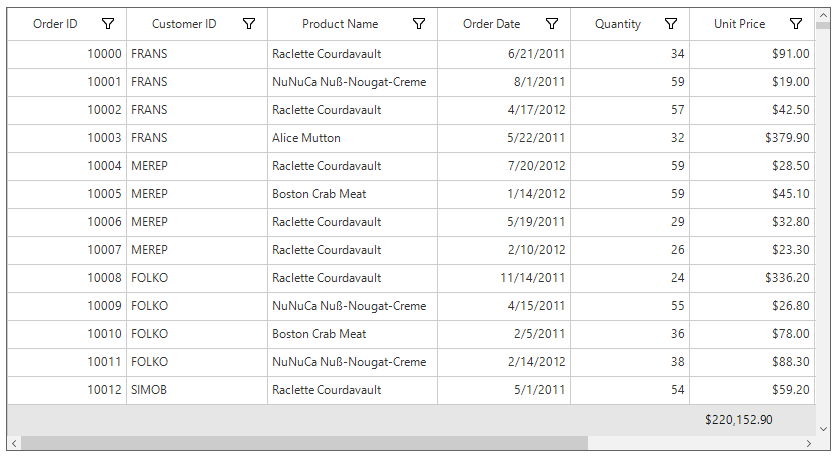

### Displaying Additional Content in Summary
Additional content can be appended with summary value using [GridSummaryColumn.Format](https://help.syncfusion.com/cr/windowsforms/Syncfusion.WinForms.DataGrid.GridSummaryColumn.html#Syncfusion_WinForms_DataGrid_GridSummaryColumn_Format) property.


// Creates the GridSummaryColumn.
GridSummaryColumn summaryColumn1 = new GridSummaryColumn();
summaryColumn1.Name = "TotalPrice";
summaryColumn1.SummaryType = SummaryType.DoubleAggregate;
summaryColumn1.Format = "Total Price : {Sum:c}";
summaryColumn1.MappingName = "UnitPrice";

// Adds the GridSummaryColumn in the SummaryColumns collection.
tableSummaryRow1.SummaryColumns.Add(summaryColumn1);

// Adds the GridTableSummaryRow in the TableSummaryRows collection.
this.sfDataGrid1.TableSummaryRows.Add(tableSummaryRow1);


' Creates the GridSummaryColumn.
Dim summaryColumn1 As New GridSummaryColumn()
summaryColumn1.Name = "TotalPrice"
summaryColumn1.SummaryType = SummaryType.DoubleAggregate
summaryColumn1.Format = "Total Price : {Sum:c}"
summaryColumn1.MappingName = "UnitPrice"

' Adds the GridSummaryColumn in the SummaryColumns collection.
tableSummaryRow1.SummaryColumns.Add(summaryColumn1)

' Adds the GridTableSummaryRow in the TableSummaryRows collection.
Me.sfDataGrid1.TableSummaryRows.Add(tableSummaryRow1)



### Formatting Summary for Row
The summary value for row can  be formatted by using [GridSummaryRow.Title](https://help.syncfusion.com/cr/windowsforms/Syncfusion.WinForms.DataGrid.GridSummaryRow.html#Syncfusion_WinForms_DataGrid_GridSummaryRow_Title) when [ShowSummaryInRow](https://help.syncfusion.com/cr/windowsforms/Syncfusion.WinForms.DataGrid.GridSummaryRow.html#Syncfusion_WinForms_DataGrid_GridSummaryRow_ShowSummaryInRow) set to `true`.



// Creates the TableSummaryRow.
GridTableSummaryRow tableSummaryRow1 = new GridTableSummaryRow();
tableSummaryRow1.Name = "TableSummary";
tableSummaryRow1.ShowSummaryInRow = true;
tableSummaryRow1.Title = " Total Unit Price: {UnitPrice} ";
tableSummaryRow1.Position = TableSummaryRowPosition.Top;

// Creates the GridSummaryColumn.
GridSummaryColumn summaryColumn1 = new GridSummaryColumn();
summaryColumn1.Name = "TotalPrice";
summaryColumn1.SummaryType = SummaryType.DoubleAggregate;
summaryColumn1.Format = "{Sum:c}";
summaryColumn1.MappingName = " UnitPrice ";

// Adds the GridSummaryColumn in the SummaryColumns collection.
tableSummaryRow1.SummaryColumns.Add(summaryColumn1);

// Adds the GridTableSummaryRow in the TableSummaryRows collection.
this.sfDataGrid1.TableSummaryRows.Add(tableSummaryRow1);


' Creates the TableSummaryRow.
Dim tableSummaryRow1 As New GridTableSummaryRow()
tableSummaryRow1.Name = "TableSummary"
tableSummaryRow1.ShowSummaryInRow = True
tableSummaryRow1.Title = " Total Unit Price: {UnitPrice} "
tableSummaryRow1.Position = TableSummaryRowPosition.Top

' Creates the GridSummaryColumn.
Dim summaryColumn1 As New GridSummaryColumn()
summaryColumn1.Name = "TotalPrice"
summaryColumn1.SummaryType = SummaryType.DoubleAggregate
summaryColumn1.Format = "{Sum:c}"
summaryColumn1.MappingName = " UnitPrice "

' Adds the GridSummaryColumn in the SummaryColumns collection.
tableSummaryRow1.SummaryColumns.Add(summaryColumn1)

' Adds the GridTableSummaryRow in the TableSummaryRows collection.
Me.sfDataGrid1.TableSummaryRows.Add(tableSummaryRow1)



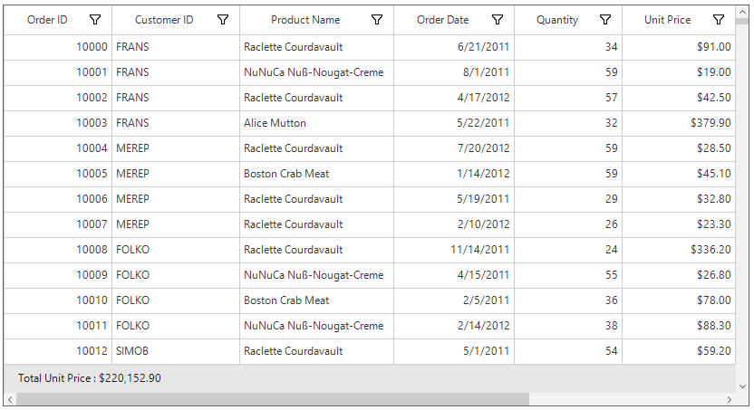

## Calculate summary for selected rows

SfDataGrid calculates the summaries for all records by default. You can calculate the summaries for selected records by using the [SfDataGrid.SummaryCalculationUnit](https://help.syncfusion.com/cr/windowsforms/Syncfusion.WinForms.DataGrid.SfDataGrid.html#Syncfusion_WinForms_DataGrid_SfDataGrid_SummaryCalculationUnit) or [GridSummaryRow.CalculationUnit](https://help.syncfusion.com/cr/windowsforms/Syncfusion.WinForms.DataGrid.GridSummaryRow.html#Syncfusion_WinForms_DataGrid_GridSummaryRow_CalculationUnit) property.
This is applicable for all type of summary rows such as table, caption and group summary.

In the below code snippet, the summaries for selected records are calculated for the top positioned `TableSummaryRow` and the summaries for all records are calculated for the bottom positioned `TableSummaryRow`.



// Creates the TableSummaryRow1.
GridTableSummaryRow tableSummaryRow1 = new GridTableSummaryRow();
tableSummaryRow1.ShowSummaryInRow = true;
tableSummaryRow1.Position = VerticalPosition.Top;
tableSummaryRow1.CalculationUnit = SummaryCalculationUnit.SelectedRows;
tableSummaryRow1.Title = "Total price for selected records:  {UnitPrice}";

// Creates the TableSummaryRow2.
GridTableSummaryRow tableSummaryRow2 = new GridTableSummaryRow();
tableSummaryRow2.ShowSummaryInRow = true;
tableSummaryRow2.Position = VerticalPosition.Bottom;            
tableSummaryRow2.Title = "Total Price for all records:  {UnitPrice}";

// Creates the GridSummaryColumn1.
GridSummaryColumn summaryColumn1 = new GridSummaryColumn();
summaryColumn1.Name = "UnitPrice";
summaryColumn1.Format = "{Sum:c}";
summaryColumn1.MappingName = "UnitPrice";
summaryColumn1.SummaryType = SummaryType.DoubleAggregate;

// Creates the GridSummaryColumn2.
GridSummaryColumn summaryColumn2 = new GridSummaryColumn();
summaryColumn2.Name = "UnitPrice";
summaryColumn2.Format = "{Sum:c}";
summaryColumn2.MappingName = "UnitPrice";
summaryColumn2.SummaryType = SummaryType.DoubleAggregate;

// Adds the GridSummaryColumn in the SummaryColumns collection.
tableSummaryRow1.SummaryColumns.Add(summaryColumn1);
tableSummaryRow2.SummaryColumns.Add(summaryColumn2);

// Adds the GridTableSummaryRow in the TableSummaryRows collection.
this.sfDataGrid.TableSummaryRows.Add(tableSummaryRow1);
this.sfDataGrid.TableSummaryRows.Add(tableSummaryRow2);


' Creates the TableSummaryRow1.
Dim tableSummaryRow1 As New GridTableSummaryRow()
tableSummaryRow1.ShowSummaryInRow = True
tableSummaryRow1.Position = VerticalPosition.Top
tableSummaryRow1.CalculationUnit = SummaryCalculationUnit.SelectedRows
tableSummaryRow1.Title = "Total price for selected records:  {UnitPrice}"

' Creates the TableSummaryRow2.
Dim tableSummaryRow2 As New GridTableSummaryRow()
tableSummaryRow2.ShowSummaryInRow = True
tableSummaryRow2.Position = VerticalPosition.Bottom
tableSummaryRow2.Title = "Total Price for all records:  {UnitPrice}"

' Creates the GridSummaryColumn1.
Dim summaryColumn1 As New GridSummaryColumn()
summaryColumn1.Name = "UnitPrice"
summaryColumn1.Format = "{Sum:c}"
summaryColumn1.MappingName = "UnitPrice"
summaryColumn1.SummaryType = SummaryType.DoubleAggregate

' Creates the GridSummaryColumn2.
Dim summaryColumn2 As New GridSummaryColumn()
summaryColumn2.Name = "UnitPrice"
summaryColumn2.Format = "{Sum:c}"
summaryColumn2.MappingName = "UnitPrice"
summaryColumn2.SummaryType = SummaryType.DoubleAggregate

' Adds the GridSummaryColumn in the SummaryColumns collection.
tableSummaryRow1.SummaryColumns.Add(summaryColumn1)
tableSummaryRow2.SummaryColumns.Add(summaryColumn2)

' Adds the GridTableSummaryRow in the TableSummaryRows collection.
Me.sfDataGrid.TableSummaryRows.Add(tableSummaryRow1)
Me.sfDataGrid.TableSummaryRows.Add(tableSummaryRow2)



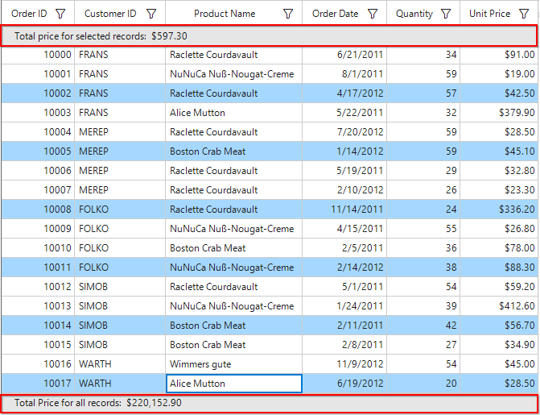

N> The `GridSummaryRow.CalculationUnit` takes higher priority than the `SfDataGrid.SummaryCalculationUnit`.

### Limitation

`SummaryCalculationUnit.SelectedRows` or `SummaryCalculationUnit.Mixed` will not be considered for cell selection.

## Custom Summaries
SfDataGrid allows to implement own aggregate functions, when the built-in aggregate functions don’t meet the requirement.
The summary values can be calculated based on custom logic using [GridSummaryColumn.CustomAggregate](https://help.syncfusion.com/cr/windowsforms/Syncfusion.WinForms.DataGrid.GridSummaryColumn.html#Syncfusion_WinForms_DataGrid_GridSummaryColumn_CustomAggregate) property.

### Implementing Custom Aggregate

1) Create custom aggregate class by deriving from `ISummaryAggregate` interface.

2) In the `CalculateAggregateFunc` method, the summary must be calculated and assign it to the property.
In the below code snippet, the Standard Deviation is calculated for quantity of products.


public class CustomAggregate : ISummaryAggregate
{
    public CustomAggregate()
    {
    }
    public double StdDev { get; set; }
    Action<IEnumerable, string, PropertyDescriptor> ISummaryAggregate.CalculateAggregateFunc()
    {
        return (items, property, pd) =>
        {
            var enumerableItems = items as IEnumerable<SalesByYear>;
            if (pd.Name == "StdDev")
            {
                this.StdDev = enumerableItems.StdDev<SalesByYear>(q => q.Total);
            }
        };
    }
}

public static class LinqExtensions
{
    public static double StdDev<T>(this IEnumerable<T> values, Func<T, double?> selector)
    {
        double result = 0;
        var count = values.Count();
        if (count > 0)
        {
            double? avg = values.Average(selector);
            double sum = values.Select(selector).Sum(d =>
            {
                if (d.HasValue)
                {
                    return Math.Pow(d.Value - avg.Value, 2);
                }
                return 0.0;
            });
            result = Math.Sqrt((sum) / (count - 1));
        }
        return result;
    }
}


Public Class CustomAggregate
	Implements ISummaryAggregate
	Public Sub New()
	End Sub
	Public Property StdDev() As Double

	Private Function CalculateAggregateFunc() As Action(Of IEnumerable, String, PropertyDescriptor) Implements ISummaryAggregate.CalculateAggregateFunc
		Return Sub(items, property, pd)
			Dim enumerableItems = TryCast(items, IEnumerable(Of SalesByYear))
			If pd.Name = "StdDev" Then
				Me.StdDev = enumerableItems.StdDev(Of SalesByYear)(Function(q) q.Total)
			End If
		End Sub
	End Function
End Class

Public Module LinqExtensions
	<System.Runtime.CompilerServices.Extension> _
	Public Function StdDev(Of T)(ByVal values As IEnumerable(Of T), ByVal selector As Func(Of T, Double?)) As Double
		Dim result As Double = 0
		Dim count = values.Count()
		If count > 0 Then
			Dim avg? As Double = values.Average(selector)

			Dim sum As Double = values.Select(selector).Sum(Function(d)
				If d.HasValue Then
					Return Math.Pow(d.Value - avg.Value, 2)
				End If
				Return 0.0
			End Function)
			result = Math.Sqrt((sum) / (count - 1))
		End If
		Return result
	End Function
End Module



3) Assign the custom aggregate to [GridSummaryColumn.CustomAggregate](https://help.syncfusion.com/cr/windowsforms/Syncfusion.WinForms.DataGrid.GridSummaryColumn.html#Syncfusion_WinForms_DataGrid_GridSummaryColumn_CustomAggregate) property and set the `SummaryType` as `Custom`. [GridSummaryColumn.Format](https://help.syncfusion.com/cr/windowsforms/Syncfusion.WinForms.DataGrid.GridSummaryColumn.html#Syncfusion_WinForms_DataGrid_GridSummaryColumn_Format) property is defined based on property name in custom aggregate `StdDev`.



// Creates the TableSummaryRow.
GridTableSummaryRow tableSummaryRow1 = new GridTableSummaryRow();
tableSummaryRow1.Name = "TableSummary";
tableSummaryRow1.ShowSummaryInRow = true;
tableSummaryRow1.Title = "Standard Deviation for Total Sales : {TotalSales}";
tableSummaryRow1.Position = TableSummaryRowPosition.Top;

// Creates the GridSummaryColumn.
GridSummaryColumn summaryColumn1 = new GridSummaryColumn();
summaryColumn1.Name = "TotalSales";
summaryColumn1.SummaryType = SummaryType.Custom;
// Initialize the CustomAggregate.
summaryColumn1.CustomAggregate = new CustomAggregate();
summaryColumn1.Format = "{StdDev}";

// Adds the GridSummaryColumn in the SummaryColumns collection.
tableSummaryRow1.SummaryColumns.Add(summaryColumn1);

// Adds the GridTableSummaryRow in the TableSummaryRows collection.
this.sfDataGrid.TableSummaryRows.Add(tableSummaryRow1);


' Creates the TableSummaryRow.
Dim tableSummaryRow1 As New GridTableSummaryRow()
tableSummaryRow1.Name = "TableSummary"
tableSummaryRow1.ShowSummaryInRow = True
tableSummaryRow1.Title = "Standard Deviation for Total Sales : {TotalSales}"
tableSummaryRow1.Position = TableSummaryRowPosition.Top

' Creates the GridSummaryColumn.
Dim summaryColumn1 As New GridSummaryColumn()
summaryColumn1.Name = "TotalSales"
summaryColumn1.SummaryType = SummaryType.Custom
' Initialize the CustomAggregate.
summaryColumn1.CustomAggregate = New CustomAggregate()
summaryColumn1.Format = "{StdDev}"

' Adds the GridSummaryColumn in the SummaryColumns collection.
tableSummaryRow1.SummaryColumns.Add(summaryColumn1)

' Adds the GridTableSummaryRow in the TableSummaryRows collection.
Me.sfDataGrid.TableSummaryRows.Add(tableSummaryRow1)



You can download the custom summaries demo [here](https://www.syncfusion.com/downloads/support/directtrac/general/ze/Custom_Summaries-1592567908.zip).

## See also

[How to show the total summary value in DateTime format using custom aggregate in WinForms DataGrid (SfDataGrid)](https://www.syncfusion.com/kb/9604/how-to-show-the-total-summary-value-in-datetime-format-using-custom-aggregate-in-winforms)

[How to calculate the summary value based on other column summary value in WinForms DataGrid (SfDataGrid)](https://www.syncfusion.com/kb/8810/how-to-calculate-the-summary-value-based-on-other-column-summary-value-in-winforms-datagrid)
