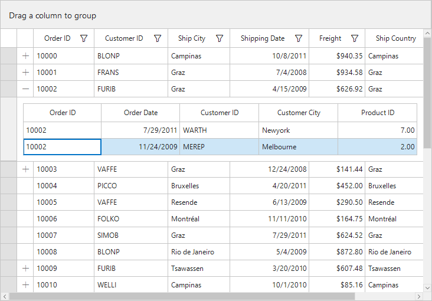
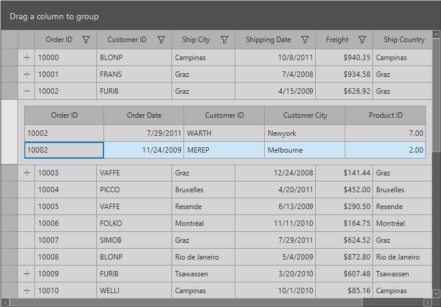
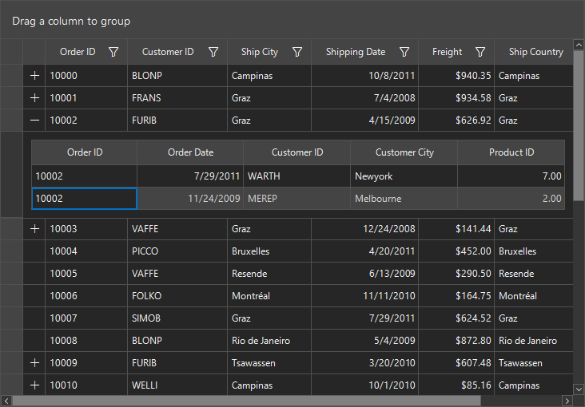
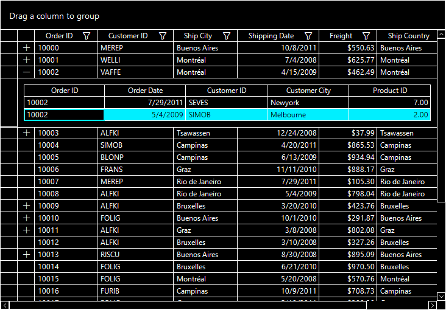

# Theme in WinForms DataGrid
SfDataGrid offers six built in themes for professional representation as follows.

* Office2016Colorful
* Office2016White
* Office2016DarkGray
* Office2016Black
* Office2019Colorful
* HighContrastBlack

Theme can be applied to SfDataGrid by following the below steps:

* [Load theme assembly](#load-theme-assembly)
* [Apply theme](#apply-theme)

## Load theme assembly

To set theme to `SfDataGrid`, the following assemblies should be added as reference in any application.

<table>
<tr>
<td>
{{'**Assemblies**'| markdownify }}
</td>
<td>
{{'        **Themes**'| markdownify }}
</td>
</tr>
<tr>
<td>
Syncfusion.Office2016Theme.WinForms       
</td>
<td>
Office2016Colorful 
Office2016White 
Office2016DarkGray 
Office2016Black
</td>
</tr>
<tr>
<td>
Syncfusion.Office2019Theme.WinForms
</td>
<td>
Office2019Colorful
</td>
</tr>
<tr>
<td>
Syncfusion.HighContrastTheme.WinForms
</td>
<td>
HighContrastBlack
</td>
</tr>
</table>

Before applying theme to `SfDataGrid`, required theme assembly should be loaded.



using Syncfusion.WinForms.Controls;

static class Program
{
        /// 

        /// The main entry point for the application.
        /// 

        
        static void Main()
        {
            Syncfusion.Licensing.SyncfusionLicenseProvider.RegisterLicense(DemoCommon.FindLicenseKey());
            SfSkinManager.LoadAssembly(typeof(Syncfusion.WinForms.Themes.Office2016Theme).Assembly);
            SfSkinManager.LoadAssembly(typeof(Syncfusion.WinForms.Themes.Office2019Theme).Assembly);
            SfSkinManager.LoadAssembly(typeof(Syncfusion.HighContrastTheme.WinForms.HighContrastTheme).Assembly);
            Application.EnableVisualStyles();
            Application.SetCompatibleTextRenderingDefault(false);
            Application.Run(new Form1());
        }
}



Imports Syncfusion.WinForms.Controls

Friend Module Program
        ''' 

        ''' The main entry point for the application.
        ''' 

        Sub Main()
            Syncfusion.Licensing.SyncfusionLicenseProvider.RegisterLicense(DemoCommon.FindLicenseKey())
            SfSkinManager.LoadAssembly(GetType(Syncfusion.WinForms.Themes.Office2016Theme).Assembly)
            SfSkinManager.LoadAssembly(GetType(Syncfusion.WinForms.Themes.Office2019Theme).Assembly)
            SfSkinManager.LoadAssembly(GetType(Syncfusion.HighContrastTheme.WinForms.HighContrastTheme).Assembly)
            Application.EnableVisualStyles()
            Application.SetCompatibleTextRenderingDefault(False)
            Application.Run(New Form1())
        End Sub
End Module



## Apply theme
Appearance of SfDataGrid can be changed by [ThemeName](https://help.syncfusion.com/cr/windowsforms/Syncfusion.WinForms.DataGrid.SfDataGrid.html) of SfDataGrid.

## Office2016Colorful
This option helps to set the Office2016Colorful Theme.



// Office2016Colorful
 this.sfDataGrid.ThemeName = "Office2016Colorful";


' Office2016Colorful
 Me.sfDataGrid.ThemeName = "Office2016Colorful"



## Office2016White
This option helps to set the Office2016White Theme.



// Office2016White
 this.sfDataGrid.ThemeName = "Office2016White";


' Office2016White
 Me.sfDataGrid.ThemeName = "Office2016White"



## Office2016DarkGray
This option helps to set the Office2016DarkGray Theme.



// Office2016DarkGray
 this.sfDataGrid.ThemeName = "Office2016DarkGray";


' Office2016DarkGray
 Me.sfDataGrid.ThemeName = "Office2016DarkGray"



## Office2016Black
This option helps to set the Office2016Black Theme.



// Office2016Black
 this.sfDataGrid.ThemeName = "Office2016Black";


' Office2016Black
 Me.sfDataGrid.ThemeName = "Office2016Black"



## Office2019Colorful
This option helps to set the Office2019Colorful Theme.



// Office2019Colorful
 this.sfDataGrid.ThemeName = "Office2019Colorful";


' Office2019Colorful
 Me.sfDataGrid.ThemeName = "Office2019Colorful"



## HighContrastBlack
This option helps to set the HighContrastBlack Theme.



// HighContrastBlack
 this.sfDataGrid.ThemeName = "HighContrastBlack";


' HighContrastBlack
 Me.sfDataGrid.ThemeName = "HighContrastBlack"



